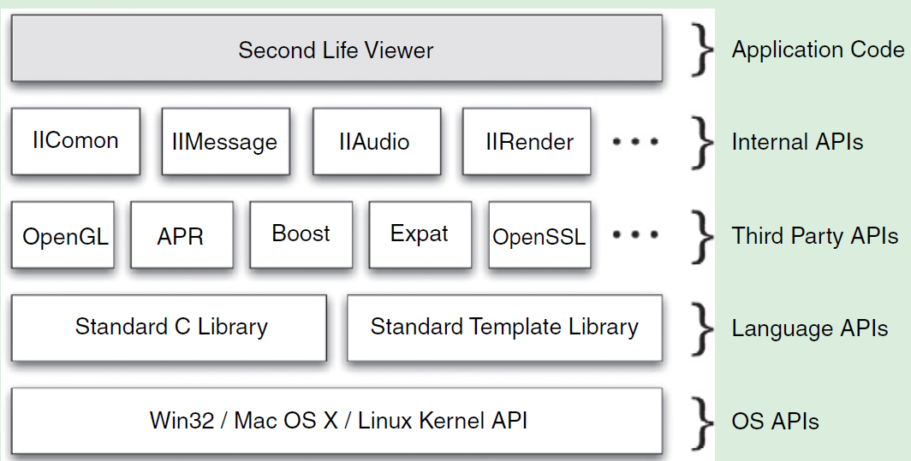

# API Design for C++

[toc]

Interfaces are the most important code that you write because a problem with your interface is far more costly to fix than a bug in your implementation.

## Introduction

An API is a logical interface to a software component that hides the internal details required to implement it.

A C++ API includes

1. Headers: define interface; (source .cpp for open source APIs)
2. Libraries: static (.lib, .a) or dynamic library (.dll, .so) for implementation
3. Documentation: automatically generated

e.g. Window API (Wind32 API)

Must strive for backward compatibility whenever changing an API.

> An API describes software used by other engineers to build their applications. As such, it must be well-designed, documented, regression tested, and stable between releases.

Layers of APIs

- OS APIs: low-level APIs, e.g. Win32
- Langue APIs: STL
- Image APIs: libjpeg, libtiff, libpng libraries
- Three-Dimensional Graphics APIs: OpenGL and DirectX. 3D games will work on various graphics cards because each graphics card manufacture distributes drivers that provide the implementation details behind the OpenGL and DirectX API.
- Graphical User Interface APIs: wxWidgets, Qt, GTK+



Architecture diagram for the second life viewer

> APIs and SDKs: Essentially SDK is platform specific package that you install on your computer in order to build applications against one or more APIs.

File formats, network protocols (client/server, peer-to-peer, middleware services over a network socket) are conceptually similar to an API.

> Whenever you create a file format or client/server protocol, you should also create an API for it. This allows details of the specification, and any further changes to it, to be centralized and hidden

## Qualities

Model the problem domain; provide a good abstraction

Unified Modeling Language (UML)

UML class diagrams: UML specification defines a collection of visual notations to model object-oriented software systems. A single class is represented with a box that is segment into three parts:

1. Upper section contains the class name
2. Middle section lists attributes of the class
3. Lower section enumerates methods of the class

For class attributes and methods, use symbols to indicate access level:

- +indicates public
- -indicates private
- #indicates protected

Relationships between classes:

- *Association*: A simple dependency between two classes where neither owns the other, shown as solid line. Association can be directional, indicated with >
- *Aggregation*: A "has-a" or whole/part relationship where neither class owns the other, shown as a line with hollow diamond
- *Composition*: A "has-a" relationship where the lifetime of the part is managed by the whole, represented as a line with a filled diamond
- *Generalization*: A subclass relationship between classes, shown as a line with a hollow triangle arrowhead

what is the difference between aggregation and composition?

universally unique identifier (UUID)

object modeling being minimally complete

information hiding with *physical hiding* (declaration and definition) and *logical hiding* (encapsulation)

> A declaration introduces the name and type of a symbol to the compiler. A definition provides the full details for that symbol, be it a function body or a region of memory

Generally speaking, provide declarations in .h files and associated definitions in .cpp files. For API design practice, strive to limit API headers to only provide declarations. 

> Java provides public, private, protected and package-private level of visibility. Package-private means that a member can only be accessed by classes within the same package. This is the default visibility in Java. Package-private is a great way to allow other classes in a JAR file to access internal members without exposing them globally to your clients.
>
> C++ does not have package-private visibility. Instead it uses friendship to allow named classes and functions to access protected and private members of a class.

> Encapsulation is the process of separating the public interface of an API from its underlying implementation

"Wallhack" in CS, a modified OpenGL driver that renders walls partially or fully transparent.

In terms of good API design, you should never make member variables public (use setter, getter)

Caching: a classic optimization technique is to store the value of a frequently requested calculation and then directly return that value for future requests. Synchronization: to make thread safe, the standard way to do this is to add mutex locking whenever a value is accessed. This would only be possible if you have wrapped access to the data values in getter/setter methods. Make the value being read-only by not providing a setter method.

> Data members of a class should always be declared private, never public or protected

hide implementation methods as well. The key point is that a class should define what to do, not how it is done.

> Never return non-const pointers or references to private data members. This breaks encapsulation

We still must distribute the header file, which declares private class members, to allow clients to compile their code again your API. This is an unfortunate limitation of the C++ language: all public, protected and private members of a class must appear in the declaration for that class. One popular technique to hid private members from the public header files is the **Pimpl** idiom. This involves isolating all of a class's private data members inside a separate implementation class in the .cpp file. The .h file then only needs to contain an opaque pointer to this implementation class. Strongly encouraged. Or at least attempt to remove private methods form the header when they are not necessary (only access public members or no members at all) by moving them to the .cpp file and converting them to static functions.

> Prefer declaring private functionality as static functions within the .cpp file rather than exposing them in public headers as private methods. (Pimpl idiom is even better though).

Hide any actual class that are purely implementation details. These classes should not be revealed as part of the public interface of your API.

Minimally complete:

1. Don't overpromise: every public API element is a promise. When in double, leave it out!
2. Add virtual functions judiciously: virtual function calls must be resolved at run time by performing a vtable lookup, whereas non-virtual function calls can be resolved at compile time. Ultimately, you should only allow overriding if you explicitly intend for this to be possible. As a general rule of thumb, if your API doesn't call a particular method internally, then that method probably should not be virtual. Herb Sutter: prefer to make virtual functions private and only consider making them protected if derived classes need to invoke the virtual function's base implementation. As  a result, Sutter suggests that interfaces should be non-virtual and they should use the Template Method design pattern where appropriate (Non-Virtual Interface idiom - NVI). Always declare your destructor to be virtual if there are any virtual functions in your class. Never call virtual functions from your constructor or destructor. These calls will never be directed to a subclass.
3. Convenience APIs: (convenience wrappers: utility routines that encapsulate multiple API calls to provide simpler higher-level operations). The important point is that you do not mix your convenience API int he same classes as your core API. Istead, produce supplementary classes that wrap certain public functionality of your core API. These convenience classes should be fully isolated from your core API. Convenience API should depend only on the public interface of your core API, not on any internal methods or classes. e.g. The OpenGL API is extremely powerful, but it is also aimed at a very low level. However, most OpenGL implementations also include the OpenGL Utility Library (GLU), which is API built on top of OpenGL API that provides higher-level functions. These functions are defined in a completely separate library to the OpenGL library.


> Add convenience APIs as separate modules or libraries that sit on top of minimal core API

4. Easy to use: Prefer enums to booleans to improve code readability; avoid functions with multiple parameters of the same type; consistent design of naming conventions, parameter order, use of standard patterns, memory model semantics, the use of exceptions, error handing etc; the use of abbreviations should be avoided at all costs; Polymorphism (not always making sense) and template can help keeping consistency; Orthogonal (methods design with no side effects) - reduce redundancy, increase independence; Robust resource allocation: use smart pointers, RAII, memory management is a specific case of resource management (mutex locks, file handles), writing a ScopedMutex class for automatic deallocation.

```c++
Date birthday(Year(1986), Month::Jul(), Day(7)); // define Year, Month and Day type to avoid (int, int, int) arguments
```

> Return a dynamically allocated object using a smart pointer if the client is responsible for deallocating it.

The take-home point in terms of API design is that if your API provides access to the allocation and deallocation of some resource, then you should consider providing a class to manage this, where resource allocation happens in the constructor and deallocation happens in the destructor (and perhaps additionally through a public Release() method so that clients have more control over when the resource is freed).

> Think of resource allocation and deallocation as object construction and destruction.

Platform independent. A well-designed C++ API should always avoid platform-specific #if/#ifdef lines in its public headers, unless for interfacing with a platform-specific resource.

> Never put platform-specific #if or #ifdef statements in your public APIs. It exposes implementation details and makes your API appear different on different platforms.

5. Loosely coupled: Good APIs exhibit loose coupling (components inter-dependency) and high cohesion (strongly related the various functions). Circular dependency should be avoided. Whenever you have a choice, you should prefer declaring a function as a non-member non-friend function rather than a member function (Scott Meyers). Doing so improves encapsulation and reduces the degree of coupling of functions. 

> Use a forward declaration for a class unless you actually need to #Include its full definition


## Patterns

## Design

## Styles

## Usage

## Performance

## Versioning

## Documentation

## Testing

## Scripting

## Extensibility

## Libraries

## Appendix

### DLLs

In Windows, a dynamic-link library (DLL) is a kind of executable file that acts as a shared library of functions and resources, which enables an executable to call functions or use resources stored in a separate file. The OS can load the DLL into an application's memory space when the application is loaded (*implicit linking*), or on demand at runtime (*explicit linking*). Multiple applications can access the contents of a single copy of a DLL in memory at the same time.

Differences between dynamic linking and static linking

- Static linking copies all the object code in a static library into the executables that use it when they are built.
- Dynamic linking includes only the information needed by Windows at run time to locate and load the DLL that contains a data item or function. When you create a DLL, you also create an import library that contains  this information. When you build an executable that calls the DLL, the  linker uses the exported symbols in the import library to store this  information for the Windows loader. When the loader loads a DLL, the DLL is mapped into the memory space of your application. If present, a  special function in the DLL, `DllMain`, is called to perform any initialization the DLL requires.

Differences between applications and DLLs

- An application can have multiple instances of itself running in the  system simultaneously, whereas a DLL can have only one instance.
- An application can be loaded as a process that can own things such as a  stack, threads of execution, global memory, file handles, and a message  queue, but a DLL cannot.

When your applications use common functions in a DLL, then as long as  the function arguments and return values do not change, you can  implement bug fixes and deploy updates to the DLL. When DLLs are  updated, the applications that use them do not need to be recompiled or  relinked, and they make use of the new DLL as soon as it's deployed.

Dynamic linking makes it easier to support applications written in  different programming languages. Programs written in different  programming languages can call the same DLL function as long as the  programs follow the function's calling convention. The programs and the  DLL function must be compatible in the following ways: the order in  which the function expects its arguments to be pushed onto the stack,  whether the function or the application is responsible for cleaning up  the stack, and whether any arguments are passed in registers.

