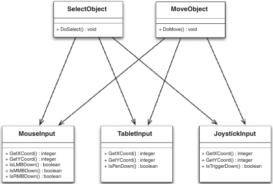
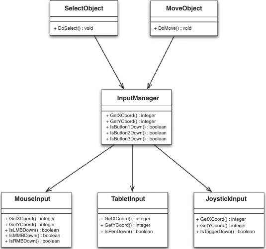
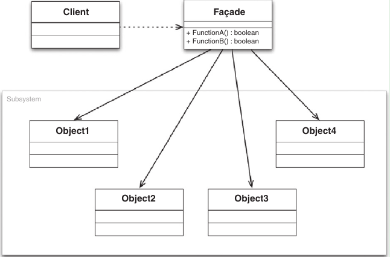

# API Design for C++

[toc]

Interfaces are the most important code that you write because a problem with your interface is far more costly to fix than a bug in your implementation.

## Introduction

An API is a logical interface to a software component that hides the internal details required to implement it.

A C++ API includes

1. Headers: define interface; (source .cpp for open source APIs)
2. Libraries: static (.lib, .a) or dynamic library (.dll, .so) for implementation
3. Documentation: automatically generated

e.g. Window API (Wind32 API)

Must strive for backward compatibility whenever changing an API.

> An API describes software used by other engineers to build their applications. As such, it must be well-designed, documented, regression tested, and stable between releases.

Layers of APIs

- OS APIs: low-level APIs, e.g. Win32
- Langue APIs: STL
- Image APIs: libjpeg, libtiff, libpng libraries
- Three-Dimensional Graphics APIs: OpenGL and DirectX. 3D games will work on various graphics cards because each graphics card manufacture distributes drivers that provide the implementation details behind the OpenGL and DirectX API.
- Graphical User Interface APIs: wxWidgets, Qt, GTK+


Architecture diagram for the second life viewer

> APIs and SDKs: Essentially SDK is platform specific package that you install on your computer in order to build applications against one or more APIs.

File formats, network protocols (client/server, peer-to-peer, middleware services over a network socket) are conceptually similar to an API.

> Whenever you create a file format or client/server protocol, you should also create an API for it. This allows details of the specification, and any further changes to it, to be centralized and hidden

## Qualities

Model the problem domain; provide a good abstraction

Unified Modeling Language (UML)

UML class diagrams: UML specification defines a collection of visual notations to model object-oriented software systems. A single class is represented with a box that is segment into three parts:

1. Upper section contains the class name
2. Middle section lists attributes of the class
3. Lower section enumerates methods of the class

For class attributes and methods, use symbols to indicate access level:

- +indicates public
- -indicates private
- #indicates protected

Relationships between classes:

- *Association*: A simple dependency between two classes where neither owns the other, shown as solid line. Association can be directional, indicated with >
- *Aggregation*: A "has-a" or whole/part relationship where neither class owns the other, shown as a line with hollow diamond
- *Composition*: A "has-a" relationship where the lifetime of the part is managed by the whole, represented as a line with a filled diamond
- *Generalization*: A subclass relationship between classes, shown as a line with a hollow triangle arrowhead

what is the difference between aggregation and composition?

universally unique identifier (UUID)

object modeling being minimally complete

information hiding with *physical hiding* (declaration and definition) and *logical hiding* (encapsulation)

> A declaration introduces the name and type of a symbol to the compiler. A definition provides the full details for that symbol, be it a function body or a region of memory

Generally speaking, provide declarations in .h files and associated definitions in .cpp files. For API design practice, strive to limit API headers to only provide declarations. 

> Java provides public, private, protected and package-private level of visibility. Package-private means that a member can only be accessed by classes within the same package. This is the default visibility in Java. Package-private is a great way to allow other classes in a JAR file to access internal members without exposing them globally to your clients.
>
> C++ does not have package-private visibility. Instead it uses friendship to allow named classes and functions to access protected and private members of a class.

> Encapsulation is the process of separating the public interface of an API from its underlying implementation

"Wallhack" in CS, a modified OpenGL driver that renders walls partially or fully transparent.

In terms of good API design, you should never make member variables public (use setter, getter)

Caching: a classic optimization technique is to store the value of a frequently requested calculation and then directly return that value for future requests. Synchronization: to make thread safe, the standard way to do this is to add mutex locking whenever a value is accessed. This would only be possible if you have wrapped access to the data values in getter/setter methods. Make the value being read-only by not providing a setter method.

> Data members of a class should always be declared private, never public or protected

hide implementation methods as well. The key point is that a class should define what to do, not how it is done.

> Never return non-const pointers or references to private data members. This breaks encapsulation

We still must distribute the header file, which declares private class members, to allow clients to compile their code again your API. This is an unfortunate limitation of the C++ language: all public, protected and private members of a class must appear in the declaration for that class. One popular technique to hid private members from the public header files is the **Pimpl** idiom. This involves isolating all of a class's private data members inside a separate implementation class in the .cpp file. The .h file then only needs to contain an opaque pointer to this implementation class. Strongly encouraged. Or at least attempt to remove private methods form the header when they are not necessary (only access public members or no members at all) by moving them to the .cpp file and converting them to static functions.

> Prefer declaring private functionality as static functions within the .cpp file rather than exposing them in public headers as private methods. (Pimpl idiom is even better though).

Hide any actual class that are purely implementation details. These classes should not be revealed as part of the public interface of your API.

Minimally complete:

1. Don't overpromise: every public API element is a promise. When in double, leave it out!
2. Add virtual functions judiciously: virtual function calls must be resolved at run time by performing a vtable lookup, whereas non-virtual function calls can be resolved at compile time. Ultimately, you should only allow overriding if you explicitly intend for this to be possible. As a general rule of thumb, if your API doesn't call a particular method internally, then that method probably should not be virtual. Herb Sutter: prefer to make virtual functions private and only consider making them protected if derived classes need to invoke the virtual function's base implementation. As  a result, Sutter suggests that interfaces should be non-virtual and they should use the Template Method design pattern where appropriate (Non-Virtual Interface idiom - NVI). Always declare your destructor to be virtual if there are any virtual functions in your class. Never call virtual functions from your constructor or destructor. These calls will never be directed to a subclass.
3. Convenience APIs: (convenience wrappers: utility routines that encapsulate multiple API calls to provide simpler higher-level operations). The important point is that you do not mix your convenience API int he same classes as your core API. Istead, produce supplementary classes that wrap certain public functionality of your core API. These convenience classes should be fully isolated from your core API. Convenience API should depend only on the public interface of your core API, not on any internal methods or classes. e.g. The OpenGL API is extremely powerful, but it is also aimed at a very low level. However, most OpenGL implementations also include the OpenGL Utility Library (GLU), which is API built on top of OpenGL API that provides higher-level functions. These functions are defined in a completely separate library to the OpenGL library.


> Add convenience APIs as separate modules or libraries that sit on top of minimal core API

4. Easy to use: Prefer enums to booleans to improve code readability; avoid functions with multiple parameters of the same type; consistent design of naming conventions, parameter order, use of standard patterns, memory model semantics, the use of exceptions, error handing etc; the use of abbreviations should be avoided at all costs; Polymorphism (not always making sense) and template can help keeping consistency; Orthogonal (methods design with no side effects) - reduce redundancy, increase independence; Robust resource allocation: use smart pointers, RAII, memory management is a specific case of resource management (mutex locks, file handles), writing a ScopedMutex class for automatic deallocation.

```c++
Date birthday(Year(1986), Month::Jul(), Day(7)); // define Year, Month and Day type to avoid (int, int, int) arguments
```

> Return a dynamically allocated object using a smart pointer if the client is responsible for deallocating it.

The take-home point in terms of API design is that if your API provides access to the allocation and deallocation of some resource, then you should consider providing a class to manage this, where resource allocation happens in the constructor and deallocation happens in the destructor (and perhaps additionally through a public Release() method so that clients have more control over when the resource is freed).

> Think of resource allocation and deallocation as object construction and destruction.

Platform independent. A well-designed C++ API should always avoid platform-specific #if/#ifdef lines in its public headers, unless for interfacing with a platform-specific resource.

> Never put platform-specific #if or #ifdef statements in your public APIs. It exposes implementation details and makes your API appear different on different platforms.

5. Loosely coupled: Good APIs exhibit loose coupling (components inter-dependency) and high cohesion (strongly related the various functions). Circular dependency should be avoided. Whenever you have a choice, you should prefer declaring a function as a non-member non-friend function rather than a member function (Scott Meyers). Doing so improves encapsulation and reduces the degree of coupling of functions. intentional redundancy; Manager classes: A manager class is one that owns and coordinates several lower-level classes. Callbacks, observers, and notifications: In C++, a callback is a pointer to a function within in module A that is passed to module B so that B can invoke the function in A at an appropriate time. Module B knows nothing about module A and has no include or link dependencies upon A. Callbacks are a popular technique to break cyclic dependencies in large projects. Observers is a more O-O solution than callbacks. The signals and slots concepts was introduced by Qt as a generic way to allow any event to be sent to any interested method to act upon. Signals can be thought of simply as callbacks with multiple targets (slots). All of the slots for a signal are called when that signal is invoked, or "emitted".

> Use a forward declaration for a class unless you actually need to #Include its full definition





```c++
// signal/slot mechanism using boost::signal
class MySlot {
  public:
    void operator()() const {
        cout << "MySlot called" << endl;
    }
};

// create instance
MySlot slot;
// create a signal with no arguments and a void return value
boost::signal<void ()> signal;
// connect slot to the signal
signal.connect(slot);
// emit the signal and thereby call all of the slots
signal();
```

6. Stable, documented and tested

## Patterns

A design pattern is a general solution to a common software design problem.

- **Creational Patterns**

  - Abstract Factory: Encapsulates a group of related factories
  - Builder: Separates a complex object's construction from its representation
  - Factory Method: Lets a class defer instantiation to subclasses
  - Prototype: Specifies a prototypical instance of a class that can be cloned to produce new objects
  - Singleton: Ensures a class has only one instance

- **Structural Patterns**

  - Adapter: Converts the interface of one class into another interface
  - Bridge: Decouples an abstraction from its implementation so that both can be changed independently
  - Composite: Composes objects into tree structures to represent part-whole hierarchies
  - Decorator: Adds additional behavior to an existing object in a dynamic fashion
  - Facade: Provides a unified higher-level interface to a set of interfaces in a subsystem
  - Flyweight: Uses sharing to support large numbers of fine-grained objects efficiently
  - Proxy: Provides a surrogate or placeholder for another object to control access to it

- **Behavioral Patterns**

  - Chain of Responsibility: Gives more than one receiver object a chance to handle a request from a sender object
  - Command: Encapsulates a request or operation as an object, with support for undoable operations
  - Interpreter: Specifies how to represent and evaluate sentences in a language
  - Iterator: Provides a way to access the elements of an aggregate object sequentially
  - Mediator: Defines an object that encapsulates how a set of objects interact
  - Momento: Captures an object's internal state so that it can be restored to the same state later
  - Observer: Allows a one-to-many notification of state changes between objects
  - State: Allows an object to appear to change its type when its internal state changes
  - Strategy: Defines a family of algorithms, encapsulates each one, and makes them interchangeable at run time
  - Template Method: Defines a skeleton of an algorithm in an operation, deferring some steps to subclasses
  - Visitor: Represents an operation to be performed on the elements of an object structure

  

### Pimpl Idiom

Pimply completely hides internal details from your public header files. Essentially, it lets us move private member data and functions to the .cpp file. Indispensable tool for creating well-insulated APIs and can be considered a special case of the Bridge design pattern. (Use more Pimpl if only one thing learned from this book).

Opaque pointer to declared type (not defined yet).

> When using the pimpl idiom use a private nested implementation class. Only use a public nested Impl class (or a public non-nested class) if other classes or free functions in the .cpp must access Impl members

Recommend putting all private member various and private methods in the Impl class.

The default copy constructor and assignment operator will only perform a shallow copy, which is bad for pimpled classes (repeated deletion). We can

1. Make class uncopyable: = delete or declare only or declare as private
2. Explicitly define the copy semantics (performing deep copy)

To avoid memory issues, we should ensure that the very first thing the constructor does is to allocate the Impl object (preferably via initialization list) and the very last thing the destructor does it to delete it.

Alternatively, rely upon smart pointers. Also, a scoped pointer (unique_ptr) is non-copyable by definition.

> Think about the copy semantics of the pimpl classes and consider using a smart pointer to manage initialization and destruction of the implementation pointer

dirty tactics to gain access to your private member (actually legal)

```c++
#define private public  // make private members be public!
#include "yourapi.h"    // can now access your private members
#undef private      	// revert to default private semantics
```

With pimpl, the compiler will no longer catch changes to member variables within const methods.

```c++
void PimpledObject::constMethod() const {
    mImpl->mName = "string changed by a const method";
}
```

### Singleton

enforce that only one instance of an object is ever created.

> A Singleton is a more elegant way to maintain global state, but you should always question whether you need global state

The Singleton pattern involves creating a class with a static method that returns the same instance of the class every time it is called. Prefer returning a reference than a pointer in the getInstance() method (avoid potential deleting by clients)

```c++
class Singleton {
  public:
    static Singleton& getInstance();
  private:
    Singleton();
    ~Singleton();
    Singleton(const Singleton&) = delete;  // private state sufficies without delete
    const Singleton& operator= (const Singleton&) = delete;
};
```

> Declare the constructor, destructor, copy constructor, and assignment operation to be private (or protected) to enforce the Singleton property

The relative order of initialization of non-local static objects in different translation units is undefined.

thread safe and race condition

> Creating a thread-safe Singleton in C++ is hard. Consider initializing it with a static constructor or an API initialization function

Singleton vs. dependency injection: a technique where an object is passed into a class (injected) instead of having the class create and store the object itself (constructor injection or setter or even define a reusable interface to inject certain types of objects and then inherit from that interface in your classes)

```c++
class MyDataBase {
    public:
    MyDataBase(DataBase* db): mDatabase(db) {}
    private:
    Database* mDatabase;
}
```

> Dependency injection makes it easier to test code that uses Singletons

The Monostate pattern can be an alternative pattern to Singleton when there is no need to store state in the Singleton object itself. The Monostate allows multiple instances of a class to be created where all of those instances use the same static data

```c++
class Monostate {
  public:
    int getTheAnswer() const {  // multiple instaces will ge the same static variable
        return sAnswer;
    }
  private:
    static int sAnswer;
};

int Monostate::sAnswer = 42;
```

Robert Martin: Singleton enforces the structure of singularity by only allowing one instance to be created, whereas Monostate enforces the behavior of singularity by sharing the same data for all instances

> Consider using Monostate instead of Singleton if you don't need lazy initialization of global data or if you want the singular nature of the class to be transparent

All member functions can be declared static in certain Monostate. One drawback with the static method version Monostate is that you cannot subclass any of the static methods because static member functions cannot be virtual.

Singleton is essentially a way to store global data and tends to be an indicator of poor design. Ofen it's useful to think about introducing a "session" or "execution context" object into your system early on. This is a single instance that holds all all of the state for your code rather than representing that state with multiple singletons.

> There are several alternatives to the Singleton pattern, including dependency injection, the Monostate pattern, and the use of a session context

### Factory Methods

provides a generalized way to create instance of an object and can be a great way to hide implementation details for derived class. In essence, a factory method is a generalization of a constructor. At a basic level, a factory method is simply a normal method call that can return an instance of a class. However, they are often used in combination with inheritance, where a derived class can override the factory method and return an instance of that derived class. Abstract base classes (ABC).

ABC contains pure virtual member functions and couldn't be initialized using new.

```c++
// render.h
class IRenderer {
    public:
    virtual ~IRenderer() {}
    virtual bool loadScene(const string& filename) = 0;
    virtual void setViewportSize(int w, int h) = 0;
    virtual void setCameraPosition(double x, double y, double z) = 0;
    virtual void setLookAt(double x, double y, double z) = 0;
    virtual void Render() = 0;
}
```

We can provide a default implementation for pure virtual methods for call in derived class but it would still have to be explicitly overridden and not all methods have to be pure virtual.

In Java, this is referred as interface

Always declare the destructor of an abstract base class (any class with virtual method(s) actually) to be virtual.

```c++
// renderfactory.h
#include "renderer.h"
class RendererFactory {
    public:
    IRenderer* createRenderer(const string& type);
};
```

Factory method is just a normal method that can return an instance of an object (for derived class not ABC).

```c++
// rendererfactory.cpp; assuming you have 3 concrete derived classes (hidden from user)
#include "renderfactory.h"
#include "openglrenderer.h"
#include "directxrenderer.h"
#include "mesarenderer.h"

IRender* RendererFactory::createRenderer(const string& type) {
    if (type == "opengl")
        return new OpenGLRenderer();
    if (type == "directx")
        return new DirectXRenderer();
    if (type == "mesa")
        return new MesaRenderer();
    
    return nullptr;
}

```

The factory method allows users to decide which derived class to create at run time, not compile time as a normal constructor requires. Different classes are created based on user input or contents of a configuration file read at run time.

> Note: the header files for the various concrete derived classes are only included in the factory's .cpp file. They don't appear in the renderfactory.h public header. In effect, these are private header files and do not need to be distributed with API. Users can never see the private details of different renders besides specify a render via a string variable or an enum

> Use Factory Methods to provide more powerful class construction semantics and to hide subclass details

To allow new derived classes to be added at run time, we can update the factory class to maintain a map that associates type names to object creation callbacks. This can be used to create extensible plugin interfaces for API

The factory object must now hold state. This is the reason why most factory objects are also singletons.

```c++
// rendererfactory.h
#include "renderer.h"
#include <map>

class RendererFactory {
    public:
    typedef IRenderer* (*CreateCallback)();
    static void registerRenderer(const std::string& type, CreateCallback cb);
    static void unregisterRenderer(const std::string& type);
    static IRenderer* createRenderer(const std::string& type);
    private:
    typedef std::map<std::string, CreateCallback> callbackMap;
    static callbackMap mRenderers;
};
```

the associate .cpp file

```c++
#include "rendererfactory.h"

// instantiate the static variable in RendererFactory
RendererFactory::callbackMap RendererFactory::mRenderers;

void RendererFactory::registerRenderer(const string& type, CreateCallback cb) {
    mRenderers[type] = cb;
}
void RendererFactory::unregisterRenderer(const string& type) {
    mRenderers.erase(type);
}

IRenderer* RendererFactory::createRenderer(const string& type) {
    callbackMap::iterator = mRenderers.find(type);
    if (it != mRenderers.end()) {
        // call the creation callback to construct this derived type
        return (it->second)();
    }
    return nullptr;
}
```

API user can register/unregister new renders in the system. The compiler will ensure that the user's new renderer conforms to the IRenderer abstract interface

```c++
class UserRenderer: public IRenderer {
    public:
    ~UserRenderer() {}
    bool loadScene(const std::string& filename) { return true; }
    void setViewportSize(int w, int h) {}
    void setCameraPosition(double x, double y, double z) {}
    void setLookAt(double x, double y, double z) {}
    void Render() { cout << "User render" << endl; }
    static IRenderer* Create() { return new UserRenderer(); }
};

int main() {
    // register new renderer
    RenderFactory::registerRender("user", UserRender::Create);
    // create an instance of new renderer
    IRenderer* r = RendererFactory::CreateRenderer("user");
    r->Render();
    delete r;
    
    return 0;
}
```


### API Wrapping Patterns

Proxy, Adapter, Facade describe various solutions for wrapping an API on top of an existing incompatible or legacy interface. Proxy and Adapter provide one-to-one mapping of new classes to preexisting classes, whereas the Facade provides a simplified interface to a larger collection of classes.

Design a new cleaner API that hides the underlying legacy code or to expose a C++ API to a plain C interface for certain clients.

**Proxy**

The proxy class and the original class has the same one-to-one interface. This pattern is often implemented by making the proxy class store a copy of, or a pointer to the original class. Be careful with code duplication and changes to the original object

```c++
class Proxy {
    public:
    Proxy(): mOrig(new Original()) {}
    ~Proxy() { delete mOrig; }
    bool doSomething(int value) {
        return mOrig->doSomething(value);
    }
    private:
    Proxy(const Proxy&);
    const Proxy& operator=(const Proxy&);
    
    Original* mOrig;
}
```

An alternative solution is to use an abstract interface that is shared by both the proxy and original APIs (better synchronized)

> A Proxy provides an interface that forwards function calls to another interface of the same form

support resource sharing: Flyweight pattern, where multiple objects share the same underlying data to minimize memory footprint.

**Adapter**

Adapter pattern translates the interface for one class into a compatible but different interface (may be different from original)

```c++
class RectangelAdapter {
    public:
    RectangleAdapter(): mRect(new Rectangle()) {}
    ~RectangleAdapter() {
        delete mRect;
    }
    void Set(float x1, float y1, float x2, float y2) {
        float w = x2-x1;
        float h = y2-y1;
        float cx = (x1+x2)/2;
        float cy = (y1+y2)/2;
        mRect->setDimensions(cx, cy, w, h);
    }
    private:
    RectangleAdapter(const RectangleAdapter&) = delete;
    const RectangleAdapter& operator= (const RectangleAdapter&) = delete;
    
    Rectangle* mRect;
};
```

> An Adapter translates one interface into a compatible but different interface

Adapters can be implemented using composition (as above) or inheritance, i.e object adapters or class adapters. Prefer to use private inheritance for class adapter so that only new interface is made public.

We could create adapter classes that wrap the plain C API calls into C++ classes, which is more object-oriented.

**Facade**

The Facade design pattern presents a simplified interface for a larger collection of classes. In effect, it defines a higher-level interface that makes the underlying subsystem easier to use (similar to convenience APIs).



> A Facade provides a simplified interface to a collection of other classes. In an encapsulating facade, the underlying classes are not accessible.

### Observer Pattern

Allows conceptually unrelated classes to communicate by allowing one class (the observer) to register for notifications from another class (the object).

> An Observer lets you decouple components and avoid cyclic dependencies. Compile-time coupling means that users cannot dynamically add new dependencies to the system at run time.

**Model-View-Controller**

MVC architecture isolates the business logic (Model) from the user interface (View) with the Controller receiving user input and coordinating the other two.

Qt; e.g. checkbox button, the current on/off state of the button is stored in Model, the View draws the current state of the button on the screen, and the Controller updates the Model state and View display when the user clicks the button.

> 

## Design

## Styles

## Usage

## Performance

## Versioning

## Documentation

## Testing

## Scripting

## Extensibility

## Libraries

## Appendix

### DLLs

In Windows, a dynamic-link library (DLL) is a kind of executable file that acts as a shared library of functions and resources, which enables an executable to call functions or use resources stored in a separate file. The OS can load the DLL into an application's memory space when the application is loaded (*implicit linking*), or on demand at runtime (*explicit linking*). Multiple applications can access the contents of a single copy of a DLL in memory at the same time.

Differences between dynamic linking and static linking

- Static linking copies all the object code in a static library into the executables that use it when they are built.
- Dynamic linking includes only the information needed by Windows at run time to locate and load the DLL that contains a data item or function. When you create a DLL, you also create an import library that contains  this information. When you build an executable that calls the DLL, the  linker uses the exported symbols in the import library to store this  information for the Windows loader. When the loader loads a DLL, the DLL is mapped into the memory space of your application. If present, a  special function in the DLL, `DllMain`, is called to perform any initialization the DLL requires.

Differences between applications and DLLs

- An application can have multiple instances of itself running in the  system simultaneously, whereas a DLL can have only one instance.
- An application can be loaded as a process that can own things such as a  stack, threads of execution, global memory, file handles, and a message  queue, but a DLL cannot.

When your applications use common functions in a DLL, then as long as  the function arguments and return values do not change, you can  implement bug fixes and deploy updates to the DLL. When DLLs are  updated, the applications that use them do not need to be recompiled or  relinked, and they make use of the new DLL as soon as it's deployed.

Dynamic linking makes it easier to support applications written in  different programming languages. Programs written in different  programming languages can call the same DLL function as long as the  programs follow the function's calling convention. The programs and the  DLL function must be compatible in the following ways: the order in  which the function expects its arguments to be pushed onto the stack,  whether the function or the application is responsible for cleaning up  the stack, and whether any arguments are passed in registers.

