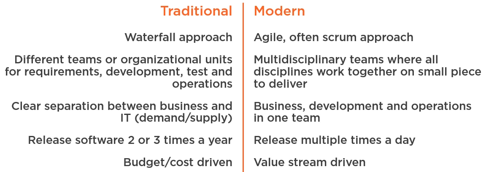

#  Continuous Delivery with Azure DevOps

[toc]

## The big picture

Have an overview on what the Azure DevOps tools can do and how to implement continuous delivery in the organization

Dashboards

Boards

Repos

Pipelines

Test Plans

Artifacts

### Why & What

- Traditional IT
- Continuous delivery and DevOps

a holistic way on all the steps involved building and running software

1st principle behind agile manifesto:

Our highest priority is to satisfy the customer through early and *continuous delivery* of valuable software

continuous delivery: all about creating a repeatable and reliable process for delivering software in order to deliver high value software to our customers fast!

### How

- Azure DevOps tools
  - Boards: organize the delivery of the software; team collaboration
    - use "work items"; traceability; planning; Backlog; Kanban; sprint
  - Repos: version control: Team Foundation Server Version Control and Git
  - Pipelines: building and releasing the software
  - Test plans: tests strategy
  - Artifacts

