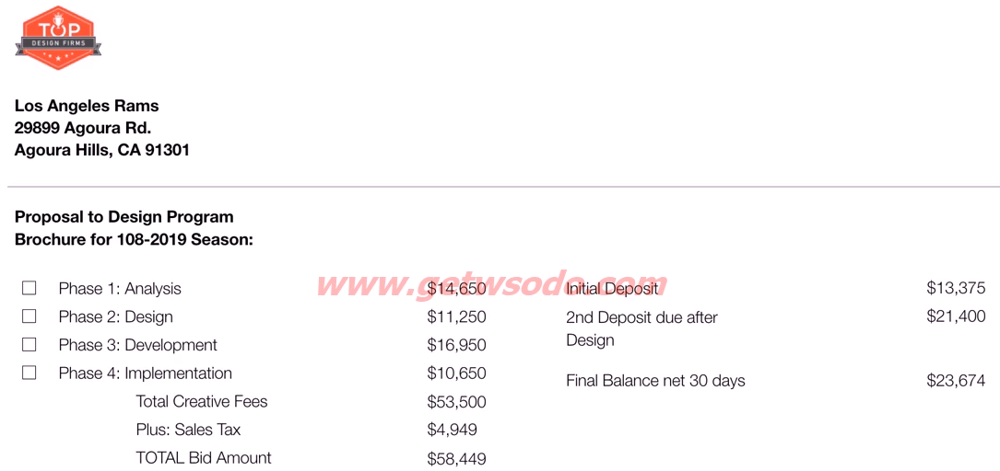
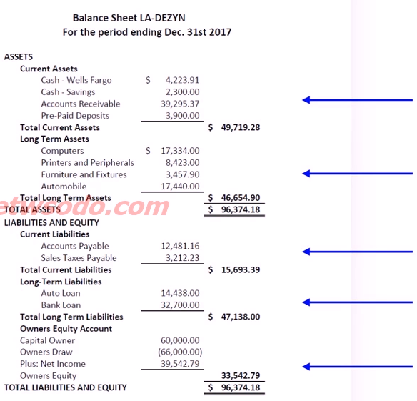
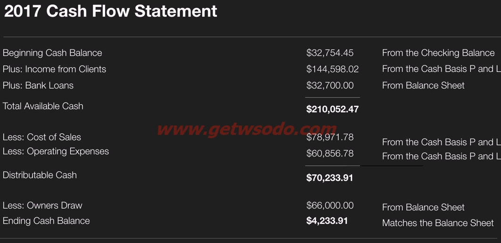
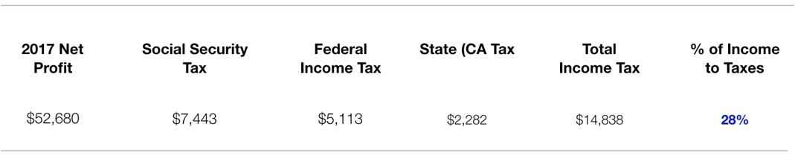

# Managing Money - Errol Gerson - TheFutur

[toc]

https://thefutur.com/course/managing-money

## Introduction

Entrepreneur with accounting background

Creative people need take control of their business

Feel comfortable talking about money. *When the outflow exceeds the inflow, then the upkeep becomes your downfall!*

What is measured improves; Accounting is a measurement tool

## Score Keeping

major of small business in US is sole propriety

### Fixed and Variable Expenses

There are two types of costs/expenses. It's important to know the difference of the two

- fixed costs: the same regardless of sales
- variable costs: change based on sales activity

### Cash vs. Accrual Accounting

There are two ways reporting your income (under current IRS code)

- Cash: recognize income when it is received; recognize expenses when they are paid
- Accrual: recognize income when it is earned; recognize expenses when they occur (business with >$5M has to use Accrual)

Cash System is useless; disadvantages of Cash system

- reports are not a true picture of the business
- doesn't comply with the 'matching principle'
- Unreliable for decision-making and analysis

Accrual system is a valuable tool for growth planning and more creditable for banks

Activities for young entrepreneurs

- **Sell, Sell, Sell, Sell, Sell**
- Keep track of client design time
- Enter client billings (accounts receivable)
- Enter expenses (accounts payable)
- Pay bills
- Manage your staff
- Do Marketing
- Run Reports
- Manage Cash
- Motivate yourself
- Start all over again next week 

Sell is the most important one (80% of the time)

### How to Bill Clients

Client billing

- Time and materials by hour - terrible will lose money eventually
- Fixed price billing - worse
- Value-based Phased investments

Never talk with customers about the cost (generates an outlay and a pain) but instead talk about investment (generates a return and a gain)

#### ADDI system

- Analysis 20-25%
- Design 20-25%
- Development 20-25%
- Implementation - 20-25%

How to bill the customer (1/3 - 1/3 - 1/3)

- project start
- half way
- website launched

a lot of young entrepreneur feel very afraid of asking for a deposit; why: be confident, be comfortable; - The moment you asked for the deposit, the customer respects you

### Purchase Orders vs. Contracts

short-term (purchases) vs. long-term (contract). Prefer using contracts if possible; for small projects, PO is ok

receivable vs. payable; know the numbers in control; If you have receivable more than 60 days, you are not doing a good job

### LLC vs. Corporation

LLC is passing through (paying personal tax)

most bookkeepers don't do taxing (no CPA) - $25-45/hr worth it; never let your bookkeeper sign checks

## Attention Directing

### Important Financial Statements

- Income statements
- Balance sheet
- Cash Flows (most important)

Again Use Accrual based accounting - Imperial

### Giving Numbers Meaning

a number itself has  no meaning

budget and expectation

### Balance Sheet

healthy receivable/payable ratios - 2:1

where you can get capital to start the business?

### Cash Flow

the most important document

draw salary from Bank Loans - crazy

### Why Cash is King

control over fear

cash runs the business

### Q&A

transition from sole ownership to LLC? transfer, contributing as equity

set a goal, gaining the motivation

## Problem Solving

### Importance of budgeting

budgeting and forecasting `we never plan to fail, we only fail to plan` (Bezos is obviously the best)

5 key components of management

- planning
- organizing
- staffing
- directing
- controlling

### Gross profit margin and break even point

- fixed costs
- variable costs

Break-even worksheet

gross profit margin; figure out break even point is crucial

### Understanding your GPM and BEP

Translating revenue into sales goals

It is imperative to track the billable hours of your business all the time; once you have the # of billable hrs/mo, you are able to calculate the average rate/hr you charged your clients

**Post-Mortem Analysis**

In order to improve on your bidding, keep meticulous records of each job and how much time was spent on that job

### Independent Contractor vs. Employee

tax; consult attorneys

### Summary so far

the most important thing of all: the cash flow

know your break even point

### Philosophy and Lies

**Entrepreneurship is living some years of your life like most people won't, so that you can spend the rest of your life like most people can't**

do the thing you don't want to do

change the perspective: no means "Next Opportunity"

4 lies

- Can I make just one more change?
- Sorry, I can't pay you, but you'll get a lot of exposure!
- Could you lower your rate by half? - nobody has respect for you once you said that
- Can I have this done by tomorrow?

Don't be afraid to walk way

The more you respect yourself, the less you need the approval of others

### Income Tax

### Closing Note

applying these principles and to succeed

## Freshbooks Accounting Software

Demos

- setup invoices
- generate balance sheet
- profit & loss statement
- view expenses
- view cash flow

Accrual (Billed in sw) vs. Cash (Collected in sw)

## Gusto HR Management Software

## Tools