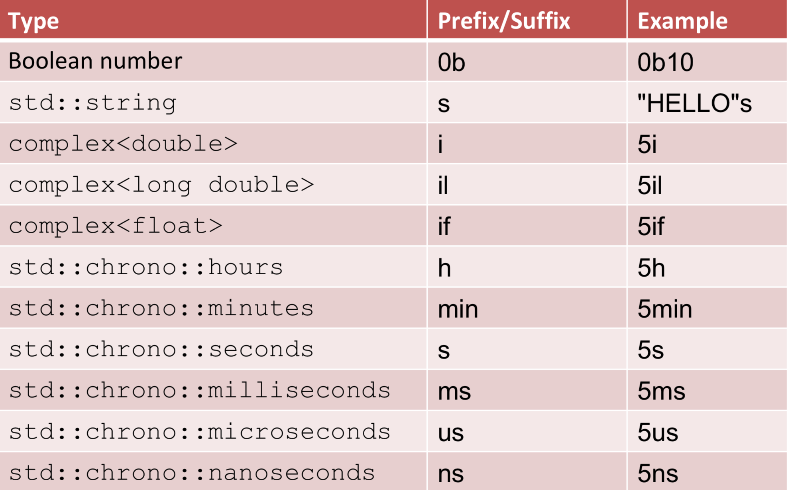

# C++ Fundamentals for Professionals

[toc]

## Core Language

C++ 98 was initially more focused on object-oriented programming. With the introduction of C++11, the language shifted focus on *functional programming*.

## Literals

explicit values in the program.

Raw string literals: suppress the interpretation of a string. notice the difference

```c++
#include <iostream>
#include <string>

int main(){

  std::string nat = "C:\temp\newFile.txt";
  std::cout << nat << std::endl;

  // including \t \n
  std::string raw1 = std::string(R"(C:\temp\newFile.txt)");
  std::cout << "\n" << raw1 << std::endl;  

  // raw string including "
  std::string raw3 = std::string(R"(a raw string including ")");
  std::cout << "\n" << raw3 << std::endl;

  return 0;
}

// output:
//C:	emp
//ewFile.txt
//
//C:\temp\newFile.txt
//
//a raw string including "
```

user-defined literals for type safety (with corresponding literal operator)



In C++14, string literals are supported. C++ used to only support C-string literals, meaning that we had to always use a C-string literal to initialize a C++ string. Time literals are very convenient; time literals are of type std::chrono::duration

```c++
#include <iostream>
#include <ostream>

namespace Distance{
  class MyDistance{
    public:
      MyDistance(double i):m(i){}

      friend MyDistance operator +(const MyDistance& a, const MyDistance& b){
        return MyDistance(a.m + b.m);
      }
      friend MyDistance operator -(const MyDistance& a, const MyDistance& b){
        return MyDistance(a.m - b.m);
      }

      friend std::ostream& operator<< (std::ostream &out, const MyDistance& myDist){
        out << myDist.m << " m";
         return out;
      }
    private:
      double m;

  };

  namespace Unit{
    MyDistance operator "" _km(long double d){
      return MyDistance(1000*d);
    }
    MyDistance operator "" _m(long double m){
      return MyDistance(m);
    }
    MyDistance operator "" _dm(long double d){
      return MyDistance(d/10);
    }
    MyDistance operator "" _cm(long double c){
      return MyDistance(c/100);
    }
    MyDistance operator "" _ft(long double ft) {
      return MyDistance(ft*0.348);
    }
    MyDistance operator "" _mi(long double mi) {
      return MyDistance(mi*1609.344);
    }
  }
}

using namespace Distance::Unit;

int main(){

  std:: cout << std::endl;

  std::cout << "1.0_km: " << 1.0_km << std::endl;
  std::cout << "1.0_m: " << 1.0_m << std::endl;
  std::cout << "1.0_dm: " << 1.0_dm << std::endl;
  std::cout << "1.0_cm: " << 1.0_cm << std::endl;
  std::cout << "1.0_ft: " << 1.0_ft << std::endl;
  std::cout << "1.0_mi: " << 1.0_mi << std::endl;

  std::cout << std::endl;
  std::cout << "1.0_km + 2.0_dm +  3.0_dm - 4.0_cm: " << 1.0_km + 2.0_dm +  3.0_dm - 4.0_cm << std::endl;
  std::cout << std::endl;

  return 0;
}


// output:
// 1.0_km: 1000 m
// 1.0_m: 1 m
// 1.0_dm: 0.1 m
// 1.0_cm: 0.01 m
// 1.0_ft: 0.348 m
// 1.0_mi: 1609.34 m
//
// 1.0_km + 2.0_dm +  3.0_dm + 4.0_cm: 1000.54 m
```

- should use namespaces for user-defined literals for collision avoidance.

## Types

Drawbacks of enumerations in classical C++

- Enumerators implicit convert to int
- Enumerators in the enclosing scope
- The type of the enumeration cannot be specified

Strongly-type enumerations since C++11, enum class/ enum struct, which

- can only be accessed in the scope of the enumeration
- don't implicitly convert to int (can use static_cast<int>(NewEnum::one))


**Pointers**

A pointer holds the address of a value. pointer dereferencing; create dynamic data using pointers, with *new* keyword.

Use nullptr (type std::nullptr_t) instead of number 0 or macro NULL

- we can assign nullptr to arbitrary pointers
- a nullptr can be compared with all other pointers

type deduction in template function will deduce 0 to int, NULL to type long int, instead of pointer type. The nullptr cannot be assigned to any arbitrary variable except a bool (through uniform initialization)

Function pointers

```c++
void addOne(int& x){
  x += 1;
}
void (*inc1)(int&)= addOne;  // function pointer
auto inc2 = addOne;

```

Pointer to struct/class member

reference: alias. A reference is never NULL and must always be initialized by having an existing variable assigned to it.

References behave like constant pointers

## Automatic Type Deduction

"auto" introduced since C++11

```c++
  // define a pointer to a function
  int (*add)(int,int)= myAdd;               // explicit
  auto add1= myAdd;                         // auto
  
  // iterate through a vector
  std::vector<int> vec;
  for (std::vector<int>::iterator it= vec.begin(); it != vec.end(); ++it){} 
  for (auto it1= vec.begin(); it1 != vec.end(); ++it1) {}
```


auto determines its type from an initializer. That simply means that; without an initializer, there is no type and therefore, no variable. The compiler ensures that each type is initialized, which is a nice side effect of auto (avoid undefined behavior).

> default initialization (the initialization performed when a variable is constructed with no initializer):
>
> “objects with automatic storage duration (and their sub-objects) are initialized to indeterminate values”
>
> Local variables that are not user-defined will not be default initialized.

Refactorization with auto

```c++
#include <typeinfo>  // for using typeid
#include <iostream>

int main(){
  auto a = 5;
  auto b = 10;
  auto sum =  a * b * 3;
  auto res = sum + 10; 
  std::cout << "typeid(res).name(): " << typeid(res).name() << std::endl;
  
  auto a2 = 5;
  auto b2 = 10.5;
  auto sum2 = a2 * b2 * 3;
  auto res2 = sum2 * 10;  
  std::cout << "typeid(res2).name(): " << typeid(res2).name() << std::endl;
  
  auto a3 = 5;
  auto b3 = 10;
  auto sum3 = a3 * b3 * 3.1f;
  auto res3 = sum3 * 10;  
  std::cout << "typeid(res3).name(): " << typeid(res3).name() << std::endl;
  
  return 0;
}

// output:
// typeid(res).name(): i
// typeid(res2).name(): d
// typeid(res3).name(): f
```

auto combines the dynamic behavior of an interpreter with the static behavior of a compiler

## Casts

## Unified Initialization

## const, constexpr, and volatile

## Move Semantic and Perfect Forwarding

## Memory Management

## Functions

## Classes and Objects

## Inheritance

## Templates

## Utilities

## Smart Pointers

## Containers in General

## Sequential Containers

## Associative Containers in General

## Ordered Associative Containers

## Unordered Associative Containers

## Algorithms

## Non-Modifying Algorithms

## Modifying Algorithms

## More Algorithms

## Callables

## Iterators

## Strings

## Regular Expressions

## Input and Output

## Threads

## Shared Data

## Tasks

## Conclusion