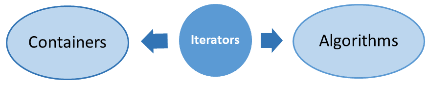

# C++ Standard Library including C++14 & C++17

Components of STL

**Containers**

- Sequential containers: vector, std::array, deque, list, forward_list (vector should be default choice for 95% cases)
- Associative containers: ordered or unordered: set, map, multiset, multimap; unordered_set, unordered_map, unordered_multiset, unordered_multimap (map should be default choice for 95% cases)
- Container Adapters: provide a simplified interface to the sequential containers: stack, queue and priority_queue

> The ordered associative containers have access time depending logarithmically on the number of elements, the unordered associative containers allow constant access time. Therefore the access time is independent of the size.

**Algorithms**

STL provides more than 100 algorithms. By specifying the execution policy, we can run most of the algorithms *sequential, parallel or parallel and vectorized*. A lot of algorithms can be further customized by *callable* like functions, function objects or lambda-functions.

