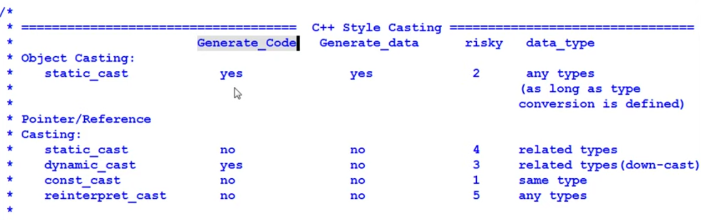
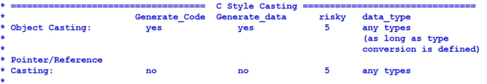

# Bo Qian - C++

[toc]

## Advanced C++

### const

- A compile time constraint that an object can not be modified

```c++
const int i = 9; 		// i = 6; error

const int* p1 = &i; 	// data is const, pointer is not
int const* p2 = &i;		// equivalent to above

int* const p2; 			// pointer is const, data is not
const int* const p3; 	// data and pointer are both const

// cast
const_cast<int&>(i) = 6; // cast away the const-ness
std::cout << i << std::endl;	// still 9?

int j;
static_cast<const int&>(j) = 7; // cast j to be const, could not assign value; won't compile
```

- if *const* is on the left of *, data is const
- if *const* is on the right of *, pointer is const
- read from right to left

Why use *const*

- Guards against inadvertent write to the variable (compile time is preferred over runtime)
- Self documenting
- Enables compiler to do more optimization, making code tighter
- const means the variable can be put in ROM (important for embedded programming)

cast is a hacky way of coding, breaking promises and should be avoided generally

### const and Functions

*const* used with functions; use when appropriate

```c++
// const parameters
void setAge(const int a) {age = a;}  // this const not very useful without &
// const return value
const string& getName() {return name};
// const function - won't compile if use another non-const function, even without changing anything
void printDogName() const {cout << name << endl;}
// const for overloading - when the object is const will use the const function, if the object is not const, then will call the non-const version
void printDogName() {cout << name << endl;}
```

### Logic Constness and Bitwise Constness

Q. To have pointer to data member and member functions you need to make them public. A. Correct!

What it really means for a function to be *const* logic constness: access an item should be const, however, we are changing counter value; The compiler maintains the concept of bitwise constness.

Solution for conflict: make the counter to be mutable

```c++
mutable int accessCounter;
```

or use const_cast (a hacky way, should be avoided)another conflict with pointer member variable; if the value pointed to by the pointer is modified (logically non-const), the compiler will happily to accept the bitwise constness claim.

use 'mutable' for logical constness

### Compiler Generated Functions

If not explicitly declared: compiler generates

- copy constructor (member by member initialization)
- copy assignment operator (member by member copying)
- destructor
- default constructor (only if there is no constructor declared)
  - call base class's default constructor
  - class data member's default constructor

The STL container requires the contained object being copyable and assignment-able. All reference (as member variable) needs to be initialized and can not be copied through compiler created copy constructor.

C++11 default constructor = default

> - compiler generated functions are public and inline
> - generated only if they are needed

### Disallow Functions

as long as we define a constructor taking any argument, the compiler will not generate the default constructor.

need to disallow: two handles write to the same file; to disallow in C++11, using delete; In C++03, we can make the copy constructor to be private and giving copy constructor only declaration but no definition.

The same can be used for copy assignment operator

```c++
class OpenFile {
public:
    OpenFile(string filename) {cout << "Open a file " << filename << endl;}
    OpenFile(OpenFile& rhs) = delete;
    OpenFile &operator=(const OpenFile &rhs) = delete;
// C++03;
private:
    // OpenFile(OpenFile& rhs);
};
```

Making destructor being private is not a good idea.

friends are worse than enemies.

reference counting shared pointers; count the number of pointers pointing to itself

we have to provide a public interface for destruction

```c++
class OpenFile
{
public:
    OpenFile(string filename) { cout << "Open a file " << filename << endl; }
    void destroyMe() { delete this; }

private:
    ~OpenFile() { cout << "OpenFile destructed." << endl; }
};

int main()
{
    // not working
    // OpenFile f(string("_file"));
    // f.destroyMe();
    OpenFile *f = new OpenFile(string("_file"));
    f->destroyMe();
}
```

If f is on stack, it's still not working.

Conclusion:

- A class with private destructor can only be stored on *heap* but not *stack*
- this can be useful for embedded programming, when the stack is small, easily cause stack overflow; we can store heavy class object on heap with private destructor; this can be forced with private destructor

Summary of disallowing functions:

- C++11: f() = delete;
- C++03: declare a function to be private, and not define it
- Private destructor: stay out of stack

### Virtual Destructors and Smart Destructor

When an object is used polymorphically, how to make sure the correct destructor is invoked in the end?

```c++
class Dog
{
public:
    ~Dog() { cout << "Dog destroyed" << endl; }
};

class YellowDog : public Dog
{
public:
    ~YellowDog() { cout << "Yellow dog destroyed" << endl; }
};

class DogFactory
{
public:
    static Dog *createYellowDog() { return (new YellowDog()); }
    //... create other dogs
};

int main()
{
    Dog *pd = DogFactory::createYellowDog();
    //... do something with pd

    delete pd;
    return 0;
}
```

output of above code

```sh
Dog destroyed
```

with

```c++
class Dog
{
public:
    virtual ~Dog() { cout << "Dog destroyed" << endl; }
};
```

the output will be

```sh
Yellow dog destroyed
Dog destroyed
```

**If a class is meant to be used in a polymorphic way, then the base class must have a virtual destructor.**


If we really don't want to have a destructor, there is option 2: - shared_ptr

```c++
class Dog
{
public:
    ~Dog() { cout << "Dog destroyed" << endl; }  // don't need virtual destructor
};

class YellowDog : public Dog
{
public:
    ~YellowDog() { cout << "Yellow dog destroyed" << endl; }
};

class DogFactory
{
public:
    static shared_ptr<Dog> createYellowDog()
    {
        return shared_ptr<YellowDog>(new YellowDog());
    }
    //... create other dogs
};

int main()
{
    shared_ptr<Dog> pd = DogFactory::createYellowDog();
    //...

    // delete pd;
    return 0;
}
```

output:

```sh
Yellow dog destroyed
Dog destroyed
```

unique_ptr won't work this way

Note: *All classes in STL have no virtual destructor*, so be careful inheriting from them. One solution is to use shared_ptr as much as possible

### Exceptions in Destructors

Don't allow exceptions to escape from destructor, because the result could be disastrous.

if object is stored in stack (created without new), then it's first in last out; the latest created object will be destroyed first

We should not throw exception out of a destructor.

- solution 1: the destructor swallows whatever exception it generates; i.e. have exception handle within the destructor; not leaking out

- solution 2: move the exception-prone code to a different function (not within the destructor)

The questions is who is a better person to handle the exception: the class itself or the client of the class object

### Virtual Functions in Constructor or Destructor

make virtual function explicit

the power of dynamic binding

- Avoid calling virtual function in Constructor or Destructor

### Assignment to self in assignment operator

```c++
class collar;
class Dog {
  collar* pCollar;
public:
  dog& operator=(const dog& rhs) {
      delete pCollar;
      pCollar = new collar(*rhs.pCollar);
      return *this;
  }
};
```

the above code will have issue with self-assignment

```c++
if (this == &rhs)
    return *this;
```

there is still possible issue if there is only exception thrown after deletion

```c++
collar* pOrgCollar = pCollar;
pCollar = new collar(*rhs.pCollar);
delete pOrgCollar;
```

this code is exception-safe

Solution 2: Delegation

```c++
class Dog {
  collar* pCollar;
public:
  dog& operator=(const dog& rhs) {
      *pCollar = *rhs.pCollar;  // member by member copying of collars or call collar's operator=
      return *this;
  }
};
```

### RAII

Use objects to manage resources: memory, hardware device, network handle etc.

The only code that can be guaranteed to be executed after exception is thrown are the destructor of objects residing on the stack.

Resource management therefore needs to be tied to the lifespan of suitable objects in order to gain automatic deallocation and reclamation.

shared_ptr is another example of RAII

The order of function's parameter passing are up to the compilers

Conclusion: don't combine storing objects in shared pointer with other statement.


What happens when resource management object is copied?

- Solution 1: prohibit copying (=delete) of copy constructor and copy assignment operator
- Solution 2: reference-count the underlying resource by using shared_ptr

the "deleter" function can be customized for shared_ptr

### Static Initialization Fiasco

Initialization Fiasco: a subtle problem that can crash the program

global objects in different scope, construction order are not defined

Singleton design pattern

```c++
Dog* Singleton::getDog() {
    if (!pd)
        pd = new Dog("Gunner");  // Initialize upon First Usage Idiom
    return pd;
}
Singleton::~Singleton {
    if (pd) delete pd;
    pd = nullptr;
}
```

The beauty of design pattern

### Struct vs. Class

The only difference in language concern:

- struct members are public by default while class members are private by default

In practice, struct is used as data container (no or few basic member functions); Class is used as complex data structure, that carry private data, interfaced through public member functions

Another convention: class member variables usually named with trailing "_" (instead of m_x), but static named as normal variable;

separate interface and implementation;

set rules through setter/mutator; getter/accessor

From the other perspective, if there are too many setter/getter, that may indicate there are design issues with the class

### Resource Managing Class

Pitfalls of object with a pointer as member to another object

shallow copy

Solution 1: Define copy constructor and copy assignment operator for deep copying

Solution 2: Delete copy constructor and copy assignment operator, define clone()

Solution 2: use smart pointer

Note: STL containers require the elements to be copy construct-able and copy assignable

implicit copying can easily be a source of bugs

### Virtual Constructor - Clone() function

work like a virtual constructor

```c++
class Dog
{
public:
    virtual Dog *clone() { return (new Dog(*this)); } // co-variant return type
};

class YelloDog : public Dog
{
    // override virtual function
    virtual YelloDog *clone() { return (new YelloDog(*this)); }
};

void foo(Dog *d)
{
    Dog *c = d->clone();
}

int main()
{
    YelloDog d;
    foo(&d);

    return 0;
}
```

### Define Implicit Type Conversion

standard type conversion and user defined type conversion. Both can be explicit or implicit

There are 2 methods to define implicit user defined type conversion:

1. Use constructor that accept a single parameter; convert other types of object into your class
   1. note: if you only want to define a constructor, and no implicit type conversion, always put "explicit" before the constructor to avoid inadvertent type conversion
2. Use the type conversion function; convert an object of your class into other types

```c++
class Dog
{
public:
    Dog(string name) : name_{name} {} // No explicit
    // string getName() { return name_; }
    // Object conversion
    operator string() const { return name_; }

private:
    string name_;
};

int main()
{
    string dogname = "Bob";
    Dog d = dogname; // implicit conversion
    // cout << "My name is: " << d.getName() << endl;
    // cout << "My name is: " << d << endl;  // this doesn't work; weird

    string dog2 = d;
    cout << "My name is: " << dog2 << endl; // but this does

    return 0;
}
```

This flexibility doesn't worth the risk!!!


PRINCIPLE: make interface easy to use correctly and hard to use incorrectly. How hard is enough? Ideally, uncompilable

General guideline:

- avoid defining seemingly unexpected conversion
- avoid defining two-way implicit conversion

Implicit type conversion is useful when creating numerical types of class, such as a rational class

### All Castings Considered - Part I

C++ provides 4 casting (explicit conversion) operators: static_cast, dynamic_cast, const_cast, reinterpret_cast. It also inherits the C-style cast from C.

1. static_cast

```c++
    int i = 9;
    float f = static_cast<float>(i);

    Dog d1 = static_cast<Dog>(string("Bob"));      // Type conversion needs to be defined
    Dog *pd = static_cast<Dog *>(new YellowDog()); // convert pointer/reference from one type
                                            	  // to a related type (down/up cast)
```

2. dynamic_cast

```c++
Dog* pd = new YellowDog():
YellowDog* py = dynamic_cast<YellowDog*>(pd);
```

- convert pointer/reference from one type to a related type (typically downcast)
- run-time type check. If succeed, py == pd; if fail, py == 0;
- It requires the 2 types to be polymorphic (have virtual function)

3. const_cast

```c++
const char* str = "Hello, world!";
char* modifiable = const_cast<char*>(str);
```

- cast away the constness of the object being pointed to
- only works on pointer/reference
- only works on same type (not related type like dynamic_cast)

4. reinterpret_cast

```c++
long p = 510010980;
Dog* d = reinterpret_cast<Dog*>(p);
```

- re-interpret the bits of the object pointed to
- only works on pointer/reference
- the ultimate cast that can cast one pointer to any other type of pointer
- typically used in lower-level coding

C-style casting

```c++
shrot a = 200;
int i = (int)a;  // c-like cast notation
int j = int(a);  // funcitonal notation
```

A mixture of static_cast, const_cast and reinterpret_cast


Generally, C++ style of casts are preferred over the C-style, because:

- Easier to identify in the code
- Less usage error. C++ style provides:
  - Narrowly specified purpose of each cast (less error-prone), and
  - Run-time type check capability

### All Castings Considered - Part II

```c++
class Dog
{
public:
    virtual ~Dog() {}
};

class YellowDog : public Dog
{
    int age_;
public:
    void bark() { cout << "woof. " << endl; }
    // void bark() { cout << "woof. I am " << age_ << endl; }  // exception thrown
};

int main()
{
    Dog *pd = new Dog();
    YellowDog *py = dynamic_cast<YellowDog *>(pd);
    py->bark();

    cout << "py = " << py << endl;
    cout << "pd = " << pd << endl;

    return 0;
}
// output:
woof.
py = 0
pd = 0x6325c0
```

All YellowDog are Dog, but not vice versa. So the dynamic_cast failed

bark() is treated as a static function since it doesn't access any member function


The correct way

```c++
int main()
{
    Dog *pd = new Dog();
    YellowDog *py = dynamic_cast<YellowDog *>(pd);
    if (py)
        py->bark();

    cout << "py = " << py << endl;
    cout << "pd = " << pd << endl;

    return 0;
}
// output
py = 0
pd = 0xd025c0
```

Better way

```c++
class Dog
{
public:
    virtual void bark() {}
    virtual ~Dog() {}
};

class YellowDog : public Dog
{
    int age_;

public:
    // void bark() { cout << "woof. " << endl; }
    void bark() { cout << "woof. I am " << age_ << endl; }
};

int main()
{
    Dog *py = new YellowDog();
    py->bark();

    cout << "py = " << py << endl;

    return 0;
}
// output
woof. I am 0
py = 0xd025c0
```

Polymorphism is more elegant solution


casting could be a handy hack tool

```c++
class Dog
{
public:
    Dog() : m_name("Bob"){};
    void bark() const { // *this is const
        // m_name = "Henry"; // not allowed
        const_cast<Dog *>(this)->m_name = "Henry";
        cout << "My name is " << m_name << endl;
    }

private:
    string m_name;
};

int main()
{
    Dog *pd = new Dog();
    pd->bark();

    return 0;
}
// output
My name is Henry
```




risky level (5 > 1)

static_cast is risky (always succeed)



### Public, Protected, Private Inheritance

The specifies different access control from the derived class to the base class.

Protected, Private inheritance is rarely seen in production code

Access control:

- None of the derived classes can access anything that is private in base
- public inheritance inherits public members of base as public and the protected members of base as protected
- private inheritance inherits public and protected members of base as private
- protected inheritance inherits public and protected members of base as protected

```c++
class B {};

class D_priv: private B{};
class D_prot: protected B{};
class D_pub: public B{};
```

From casting:

- Anyone can cast a D_pub* to B*. D_pub is a special kind of B
- D_priv's members and friends can cast a D_priv* to B*
- D_prot's members, friends, and children can cast a D_prot* to B*


- public inheritance: is-a relationship
- private inheritance: similar to has-a relation

```c++
class ring {
  public:
    void tinkle() {...}
};

// composition
class Dog {
    ring m_ring;
  public:
    void tinkle() {m_ring.tinkle()};  // call forwarding
};
// private inheritance
class dog: private ring {
  public:
    using ring::tinkle;
};
```

In general, composition is preferred (more flexible and less coupled)

### Maintain is-a relation for Public Inheritance

A Derived class should be able to do everything the base class can do

```c++
class dog
{
public:
    virtual void bark() { cout << "I am just a dog.\n"; }
};
class yellowdog : public dog
{
public:
    void bark() override { cout << "I am a yellow dog.\n"; }
};

int main()
{
    yellowdog *py = new yellowdog();
    py->bark();

    dog *pd = py;  // with/without virtual, this makes a big difference
    pd->bark();
    return 0;
}
// output
I am a yellow dog.
I am a yellow dog.
```

Polymorphism; only override virtual function

```c++
class dog
{
public:
    virtual void bark(string msg = "just a")
    {
        cout << "I am " << msg << " dog." << endl;
    }
};
class yellowdog : public dog
{
public:
    void bark(string msg = "a yellow") override
    {
        cout << "I am " << msg << " dog." << endl;
    }
};

int main()
{
    yellowdog *py = new yellowdog();
    py->bark();

    dog *pd = py;
    pd->bark();
    return 0;
}
// output:
I am a yellow dog.
I am just a dog.
```

This is crazy; 

- *virtual function is bound in run time; however, the default value is bound at compile time*
- lesson: never override the default parameter value for virtual function

Summary:

- Precise definition of classes
- don't override non-virtual functions
- don't override default parameter values for virtual functions
- force inheritance of shadowed functions

### Understanding rvalue and lvalue

C++11 introduced rvalue reference

- lvalue: an object that occupies some *identifiable* location in memory
- rvalue: an object that is not a lvalue

Most variables in C++ code are lvalues, which you can obtain their address

```c++
int& r = i;  // lvalue reference
int& r = 5;  // Error
const int& r = 5;  // Ok, exception
```

Misconception 1: function or operator always yields rvalues

Misconception 2: lvalues are modifiable (e.g. const)

Misconception 3: rvalues are not modifiable (it is not true for user defined type)

Summary:

- Every C++ expression yield either an rvalue or a lvalue
- If the expression has an identifiable memory address, it's lvalue; otherwise, rvalue


### Static Polymorphism

When talking about polymorphism, by default, it's dynamic polymorphism; Dynamic polymorphism is great, coming with (small) prices

- memory cost of the virtual table
- run time cost of dynamic binding

What we want to mimic from the dynamic polymorphism

1. is-a relationship between base class and derived class
2. Base class defines a "generic" algorithm that is used by derived class
3. The "generic" algorithm is customized by the derived class

```c++
template <typename T>
class Generic_Parser {
  public:
    void parse_preorder(TreeNode* node) {
        if (node) {
            process_node(node);
            parse_preorder(node->left);
            parse_preorder(node->right);
        }
    }
    void process_node(TreeNode* node) {  // not virtual anymore
        static_cast<T*>(this)->process_node(node);
    }
};

class EmployeeChart_Parser: public Generic_Parser<EmployeeChart_Parser> {
  public:
    void process_node(TreeNode* node) {
        cout << "Customized process_node() for EmployeeChart.\n";
    }
};

int main() {
    ...
    EmployeeChart_Parser ep;
    ep.parse_preorder(root);
}
```

The above technique is called "Curiously recurring template pattern" or static polymorphism, simulated polymorphism

Commonly used technique in Library code

TMP: Template Metaprogramming

move computation from run time to compile time


Ref:

polymorphism is an **ability to treat objects of different types as if they are of a same type**. 

Static Polymorphism is the linking of a function with an object during  compile time is called static. It is also called static binding.

polymorphism — providing a single interface to entities of different types. virtual functions provide dynamic (run-time) polymorphism through an interface provided by a base class. Overloaded functions and templates provide static (compile-time) polymorphism. - Bjarne Stroustrup

Overloading

- overloaded operator
- overloaded function

Template

- Function template
- Class template
- Specializing template

### Multiple Inheritance - Devil or Angel

Pure Abstract Class is also known as Interface. Languages like C# and Java even have a keyword "Interface" for this reason and they don't  support multiple inheritance the way C++ does. Classes in C# and Java can have only 1 base class and many Interfaces. In other words, multiple inheritance in C++ (without using Pure Abstract Classes) is generally considered to be a bad practice. That is the reason languages like C#  and Java don't support it at all.

Diamond shape of hierarchy

virtual inheritance; however, initialization problem: the most derived class should be responsible for the initialization of the virtual base class (awkward)

Why use multiple inheritance in the first place? *Interface segregation principle*: Split large interfaces into smaller and more specific ones so that clients only need to know about the methods that are of interest to them.


Abstract class: a class has one or more pure virtual functions.

Pure Abstract class (interface in Java): a class containing only pure virtual functions

- no data
- no concrete functions


Summary:

1. Multiple inheritance is an important technique, e.g. ISP
2. Derive only from PACs when using multiple inheritance


### Duality of Public Inheritance:  Interface & Implementation

- inheritance of interface
- inheritance of implementation

pure abstract function provides no implementation, need to be overridden; abstract function provides default implementation, can be overridden; non-abstract function provides implementation, can't be overridden

```c++
class Dog {
  public:
    virtual void bark() = 0;
    virtual void eat() {cout << "eating. \n";}
    void run() {cout << "running.";}
}
```


Types of Inheritance in C++

1. Pure virtual public function - inherit interface only
2. Non-virtual public function - inherit both interface and implementation
3. Impure virtual public function - inherit interface and default implementation
4. Protected function - inherit implementation only

As as software designer, it is very important to separate the concepts of interface and implementation


*Interface inheritance* is the main feature of inheritance:

- Subtyping
- Polymorphism

Pitfalls:

- be careful of interface bloat
- interfaces do not reveal implementation

*Implementation inheritance*

- increase code complexity
- not encouraged in general

Guidelines for Implementation inheritance

1. Do not use inheritance for code reuse, use composition (with helper function)
2. Minimize the implementation in base classes. Base classes should be thin
3. Minimize the level of hierarchies in implementation inheritance

"Inheritance is often useful, but more often overused (abused)"

### Code Reuse - Inheritance vs Composition

two main ways for code reuse: inheritance and composition

we should always strike for precise, self-explanatory names


Composition is better than inheritance

- Less code coupling between reused code and reuser of the code
  - Child class automatically inherits ALL parent class's public members
  - Child class can access parent's protected members
    - Inheritance breaks encapsulation
- Dynamic binding
  - Inheritance is bound at compile time
  - Composition can be bound either at compile time (polymorphism) or at run time (dynamic binding)
- Flexible code construct with composition

"Friends and children, biggest enemy of your privacy. It's a philosophy of life." - haha


### Namespace and Keyword "using"

using

1. using directive: to bring all namespace members into current scope
2. using declaration
   1. bring one specific namespace member to current scope
   2. bring a member from base class to current class's scope (illegal in global scope)

```c++
using namespace std;
using std::cout;

using B::f;
```

Children class can "name hiding" base class function even with different function signature;

anonymous namespace


### Koenig Lookup - Argument Dependent Lookup (ADL)

```c++
namespace A {
    struct X{};
    void g(X) { cout << "calling A::g() \n";}
}

int main() {
    A::X x1;
    /*A::*/g(x1);			// Koenig lookup, or Argument Dependent Lookup (ADL)
}
```

The above code will compile and run even g is defined in namespace A (because x1 is defined in A, so compiler will search in A)

Koenig lookup only works in namespace, can't look into a class

name hidding


Name Lookup Sequence

- With namespaces
  - current scope => next enclosed scope => ... => global scope
  - To override the sequence
    - Qualifier or using declaration
    - Koening Lookup
- With classes
  - current class scope => parent scope => ... => global scope
  - To override the sequence
    - Qualifier or using declaration


### Koenig Lookup and Namespace Design/Interface Principle

```c++
namespace A {
    struct X {};
    void g(X) { cout << "calling A::g() \n";}
    void g() {cout << "calling A::g() \n";}
}
int main() {
    A::X x1;
    g(x1);  // Koenig lookup, argument dependent lookup; runs ok
    g();	// Error; not seen in namespace
}
```

Engineering Principle

- Functions that operate on class C and in a same namespace with C are part of C's interface
- Functions that are part of C's interface should be in the same namespace as C

```c++
A::C c;
c.f();
h(c);	// also interface
```


### Demystifying Operator new/delete

### How to Define new Handler

What: New handler is a function invoked when operator new failed to allocate memory. It's purpose is to help memory allocation to succeed. set_new_handler() installs a new handler and returns current new handler

The new-handler must do one of following things:

- make more memory available
- install a different new handler
- uninstall the new-handler (passing a null pointer)
- throw an exception bad_alloc or its descendent
- terminate the program

```c++
void NoMoreMem() {
    std::cerr << "Unable to allocate memory" << std::endl;
    abort();
}
int main() {
    std::set_new_handler(NoMoreMem);
    int* pGiant = new int[1000000000L];
    delete[] pGiant;
}
```


Class specific new-handler


## Modern C++

### Learn C++11 in 20 Minutes - Part I

#### 1. Initializer List

All the relevant STL containers have been updated to accept initializer_list for constructing.

We can also define own initializer_list constructor for customized class

#### 2. Uniform Initialization

C++11 extends the scope of curly brace initialization

Uniform Initialization Search Order

1. Initializer_list constructor
2. Regular constructor that takes the appropriate parameters
3. Aggregate initializer

```c++
class Dog {
  public:
    int age_;									// 3rd choice
    Dog(int a) {								// 2nd choice
        age_ = a;
    }
    Dog(const initializer_list<int>& vec) {
        age_ = *(vec.begin());					  // 1st choice
    }
};
```

#### 3. auto

IDE becomes more important

#### 4. foreach (range-based for loop)

works on any class that has begin() and end() functions defined

#### 5. nullptr

#### 6. enum class

more strong typed and safe

#### 7. static_assert

```c++
// run-time assert
assert(myPonter != NULL);
// compile-time assert
static_assert(sizeof(int) == 4);
```

#### 8. Delegating Constructors

init() function is not needed in constructors 


### Learn C++11 in 20 Minutes - Part II

#### 9. override (for virtual function)

To avoid inadvertently create new function in derived classes

#### 10. final (for virtual function and for class)

- no class can be further derived
- no class method can override

#### 11. Compiler Generated Default Constructor

```c++
class Dog {
  public:
    Dog(int age);
    Dog() = default; 	// force compiler to geenrate the default constructor
}
```

#### 12. delete

disallow some functions, e.g. assignment operator

#### 13. constexpr

```c++
constexprt int A() {return 3;}  // computation at compile time
int arr[A()+3];

// write faster program with constexpr
constexpr int cubed(int x) { return x*x*x; }
int y = cubed(200);		// computed at compile time
```

#### 14. New string literals

```c++
char*		a = u8"string";	// UTF-8 string
char16_t*	b = u"string";	// UTF-16 string
char32_t*	c = U"string";	// UTF-32 string
char*		d = R"string \\";	// raw string; \\ not escape anymore
```

#### 15. Lambda function

```c++
auto f = [](int x, int y) {
    return x+y;
}
```

the C++ way of functional programming

```c++
template <typename func>
void filter(func f, vector<int> arr) {
    for (auto i : arr) {
        if (f(i))
            cout << i << " ";
    }
}

vector<int> v = {1, 2, 3, 4, 5, 5};
filter([](int x) {return (x>3);}, v);  // output: 4, 5, 6
int y = 4;
filter([&](int x) {return (x>y);}, v); // output: 5, 6
```


### Rvalue Reference  - Move Semantics

C++11 Rvalue Reference:

1. Moving semantics
2. Perfect forwarding

you can overload a function with rvalue or lvalue reference

costly copy constructor

std::move

```c++
foo_by_ref(resuable);		// call no constructor - most efficient
foo(resuable);				// call copy constructor - most expensive
foo(std::move(reusable));	// call move constructor
```


Note:

1. The most useful place for rvalue reference is overloading copy constructor and copy assignment operator, to achieve move semantics

```c++
X& X::operator=(X const& rhs);
X& X::operator=(X&& rhs);
```

2. Move semantics is implemented for all STL containers, which means:
   1. move to C++, you code will be faster without changing a thing
   2. pass-by-value can be used for STL containers

Move Constructor/Move Assignment operator:

- purpose: conveniently avoid costly and unnecessary deep copying
- they are particularly powerful where passing by reference and passing by value are both used
- they give you finer control of which part of your object to be moved

### Rvalue Reference - Perfect Forwarding

```c++
void foo(boVector arg);
// boVector has both move constructor and copy constructor

template <typename T>
void relay(T arg) {
    foo(arg);
}
int main() {
    boVector reusable = createBoVector();
    relay(reusable);
    ...
    relay(createBoVector);
}
```


Requirements:

1. No costly and unnecessary copy construction of boVector is made
2. rvalue is forwarded as rvalue, and lvalue is forwarded as lvalue

Solution:

```c++
template <typename T>
void relay(T&& arg) {
    foo(std::forward<T>(arg));
}

// Implementation of std::forward
template <typename T>
T&& forward(typename remove_reference<T>::type& arg) {
    return static_cast<T&&>(arg);
}
// foo and relay will get the exact same type of arg, that's how perfect forwarding is achieved
```

Note: this will work because type T is a template type


Reference Collapsing Rules (C++11)

- T& &     ==> T&
- T& &&   ==> T&
- T&& &   ==> T&
- T&& && ==> T&&

back to the relay example

rvalue reference is specified with type&&. type&& is always rvalue reference?

```c++
// T&& variable is initialized with rvalue => rvalue reference
relay(9); => T = int&& => T&& = int&& && = int&&  // T = int
// T&& variable is initialized with lvaue => lvalue reference
relay(x); => T = int& ==> T&& = int& && = int&    
```

a universal reference by Scott Meyers

T&& is a universal reference: rvalue, lvalue, const, non-const, etc...

conditions (otherwise it is rvalue reference):

1. T is a template type
2. Type deduction (reference collapsing) happens to T
   1. T is a function template type, not class template type


compare std::move vs. std::forward()

```c++
std::move<T>(arg);			// turn arg into an rvalue type
std::forward<T>(arg);		// turn arg to type of T&&
```


Summary:

Usage of rvalue reference:

1. Move semantics
2. Perfect forwarding

### User Defined Literals

Literals are constants. C++ has 4 kinds of leterals

- integer
- floating point
- character
- string

```c++
constexpr long double operator"" _cm(long double x)
{
    return x * 10;
}
constexpr long double operator"" _m(long double x) { return x * 1e3; }
constexpr long double operator"" _mm(long double x) { return x; }
constexpr long double operator"" _inch(long double x) { return x * 25.4; }

long double height = 3.4_cm + 1.5_inch;
```

constexpr makes the computation done during compiling time;

C++ went a long way to make user defined types (classes) to behave same as build-in types. User defined literals pushes this effort even further

limitations of arguments types (long double works, but not double): TODO

### Compiler Generated Functions

C++03

1. default constructor (generated only if no constructor is declared by user)
2. copy constructor (generated only if no 5, 6 declared by user)
3. copy assignment operator (generated only if no 5, 6 declared by user)
4. destructor

C++11:

5. move constructor (generated only if 2, 3, 4, 6 not declared by user)
6. move assignment operator (generated only if 2, 3, 4, 5 not declared by user)

```c++
class Duck {  // 4
	Duck(Duck&&) {}  // move constructor
}
```

the above Duck class will only have destructor to be auto-generated by the compiler (it won't be copied but only copied)

### C++11 Library: Shared Pointer - 1

memory leaks and dangling pointer

```c++
std::shared_ptr<Dog> p(new Dog("Gunner"));
cout << p.use_count() << endl;
```

be careful with this

```c++
// An object should be assigned to a smart pointer as soon as it is created. Raw pointer should not be used again.
Dog* d = new Dog("Tank");
shared_ptr<Dog> p(d);
shared_ptr<Dog> p2(d);
```

undefined behavior, d will be destroyed twice

```c++
shared_ptr<Dog> p = std::make_shared<Dog>("Tank");
```

make_shared is the preferred way of creating shared_ptr, faster and safer

static_pointer_cast

dynamic_pointer_cast

const_pointer_cast

### C++11 Library: Shared Pointer - 2


## C++ Standard Library	

## Advanced STL

## Concurrent Programming with C++11

## Boost Library

## C++ Unit Test

## Practical Programming Algorithms

