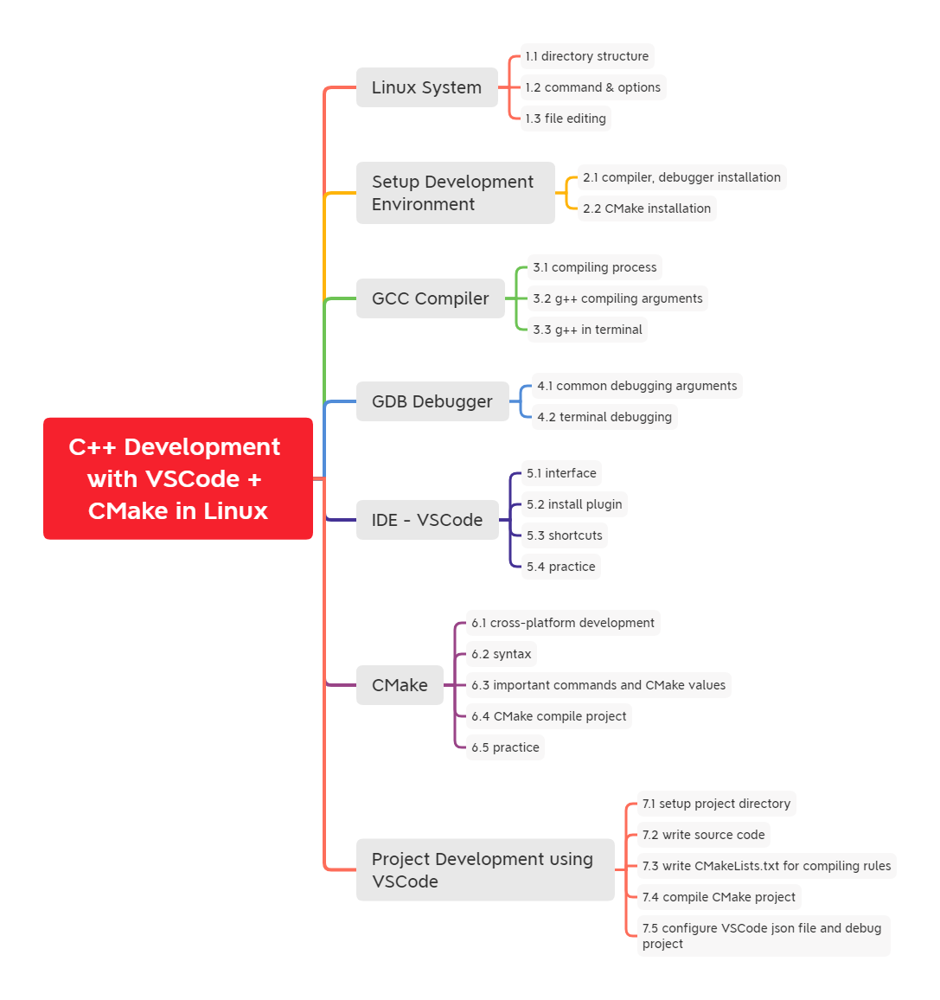

# C++ Development with VSCode + CMake in Linux

[toc]



## Linux System

Linux is open source operating system

Everything are files in Linux

### 1.1 directory structure

Linux file folder structures

### 1.2 command & options

Linux commands that can be input in the terminal

Command format:

- command (whitespace) [option] (whitespace) [object]
- option and object can be none or multiple

Important commands

```sh
# pwd - print current working directory
pwd
# ls - list directory contents; dir works as well
# ls relative path
ls
ls ./   # [current directory]
ls ../  # [parent directory]
# ls absolute path
ls /home  #
ls /      # root directory
# ls with options
ls -lah /home # l (list) a (all files including hidden) h(high 		visible format)
```

```sh
# cd - change directory
cd
cd ~  # these two equivalent; goes to home direcotry

# cd - relative path
cd ..   	# parent directory
cd ../bin/  # (sister) directory under parent directory
# cd - absolute path
cd /usr/local  # starts with /

# mkdir - make directory
mkdir src
mkdir -p a/b/c  # make multiple layers of non-existent folders
mkdir a b c     # make multiple folders under current directory
```

```sh
# touch - change file timestamps; create file
touch linux.txt
touch ../linux		# create linux file in parent directory
touch /home/wayne/myfile  # create file with absolute path
touch file file.txt	# create multiple files

# rm - remove files or directories
rm file.txt		# remove file.txt in current directory
rm /usr/file01	# remove file01 with absolute path
# remove directory
rm -rf myfolder	 # remove r(recursive) f(force); be cautious
rm -rf /usr/myfolder
```

```sh
# cp - copy files and directories
cp account.txt temp	# copy account.txt file to temp folder
cp -r /home/wayne/myfolder /  # -r recursive copy

# mv - move (rename) files
mv myfile /folder
mv myfolder /tempfolder
mv myfile myfile001		# rename myfile to myfile001
```

```sh
# man - an interface to the system reference manuals
man ls
man cd  # help cd
man man
```

```sh
# reboot - reboot the machine
reboot
# shutdown - power-off the machine
shutdown -h now
```


### 1.3 file editing

## Setup Development Environment

### 2.1 compiler, debugger installation

### 2.2 CMake installation

## GCC Compiler

### 3.1 compiling process

### 3.2 g++ compiling arguments

### 3.3 g++ in terminal

## GDB Debugger

### 4.1 common debugging arguments

### 4.2 terminal debugging

## IDE - VSCode

### 5.1 interface

### 5.2 install plugin

### 5.3 shortcuts

### 5.4 practice

## CMake

### 6.1 cross-platform development

### 6.2 syntax

### 6.3 important commands and CMake values

### 6.4 CMake compile project

### 6.5 practice

## Project Development using VSCode

### 7.1 setup project directory

### 7.2 write source code

### 7.3 write CMakeLists.txt for compiling rules

### 7.4 compile CMake project

### 7.5 configure VSCode json file and debug project

