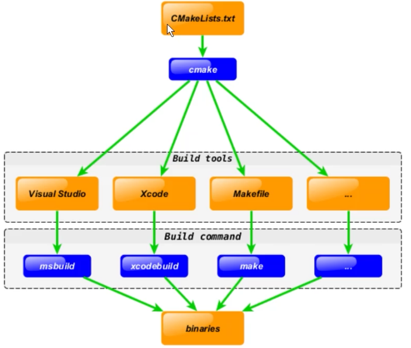

# C++ Development with VSCode + CMake in Linux

[toc]


## Linux System

Linux is open source operating system

Everything are files in Linux

### 1.1 directory structure

Linux file folder structures

### 1.2 command & options

Linux commands that can be input in the terminal

Command format:

- command (whitespace) [option] (whitespace) [object]
- option and object can be none or multiple

Important commands

```sh
# pwd - print current working directory
pwd
# ls - list directory contents; dir works as well
# ls relative path
ls
ls ./   # [current directory]
ls ../  # [parent directory]
# ls absolute path
ls /home  #
ls /      # root directory
# ls with options
ls -lah /home # l (list) a (all files including hidden) h(high 		visible format)
```

```sh
# cd - change directory
cd
cd ~  # these two equivalent; goes to home direcotry

# cd - relative path
cd ..   	# parent directory
cd ../bin/  # (sister) directory under parent directory
# cd - absolute path
cd /usr/local  # starts with /

# mkdir - make directory
mkdir src
mkdir -p a/b/c  # make multiple layers of non-existent folders
mkdir a b c     # make multiple folders under current directory
```

```sh
# touch - change file timestamps; create file
touch linux.txt
touch ../linux		# create linux file in parent directory
touch /home/wayne/myfile  # create file with absolute path
touch file file.txt	# create multiple files

# rm - remove files or directories
rm file.txt		# remove file.txt in current directory
rm /usr/file01	# remove file01 with absolute path
# remove directory
rm -rf myfolder	 # remove r(recursive) f(force); be cautious
rm -rf /usr/myfolder
```

```sh
# cp - copy files and directories
cp account.txt temp	# copy account.txt file to temp folder
cp -r /home/wayne/myfolder /  # -r recursive copy

# mv - move (rename) files
mv myfile /folder
mv myfolder /tempfolder
mv myfile myfile001		# rename myfile to myfile001
```

```sh
# man - an interface to the system reference manuals
man ls
man cd  # help cd
man man
```

```sh
# reboot - reboot the machine
reboot
# shutdown - power-off the machine
shutdown -h now
```


### 1.3 file editing

- Vim
  - Vim is the standard editor in Unix, Linux
  - Vim can be used for software development, as well as file editing
  - very powerful in terminal
- gedit
- nano


## Setup Development Environment

### 2.1 compiler, debugger, CMake installation

- Install GCC, GDB

```sh
sudo apt update
# install compiler and debugger
sudo apt install build-essential gdb
```

```sh
# confirm installation 
gcc --version
g++ --version
gdb --version
```

```sh
# clang
clang --version
```


- Install CMake

```sh
sudo apt install cmake
```

```sh
# confirm installation
cmake --version
```


## GCC Compiler

- GCC compiler support C++, Go etc.
- VSCode calls GCC compiler to compile C/C++ code
- gcc compiles C; g++ compiles C++

### 3.1 compiling process

1. Pre-processing

   ```sh
   # -E option instructs compiler to pre-process the input file
   g++ -E test.cpp -o test.i  #.i file
   # view - optional
   vi test.i
   ```

2. Compiling

   ```sh
   # -S compiler instructs g++ to stop compiling after generating assembly
   # the default extension for assembly is .s
   g++ -S test.i -o test.s
   ```

3. Assembling

   ```sh
   # -c option instructs g++ compiles assembly to objective code of the machine language
   # by default, the objective code created by g++ will have .o extension
   g++ -c test.s -o test.o  # -c or -C the same
   ```

4. Linking

   ```sh
   # -o option generates the executable code
   g++ test.o -o test
   ```

5. All steps can be combined

   ```sh
   g++ test.cpp -o test
   # or
   c++ test.cpp -o test  # use default c++ compiler
   # check all files
   ls -lah
   ```

### 3.2 g++ compiling arguments

1. -g compile executable with debugging information

   ```sh
   # -g option instructs GCC to create debugging information that could be used by GDB debugger
   g++ -g hello.cpp -o hello  # the hello file will be much bigger than the versionw without -g
   ```

2. -O[n]  optimize the code

   ```sh
   # optimize the source code durign compilation
   # generally will make the code run faster
   # -o reduces the code length and run-time, equivalent to -o1
   # -o0 no optimization
   # -o1 default optimization
   # -o2 extra optimization besides o1
   # -o3 extra optimization
   # option will make the compilation slower than -o but running faster
   g++ -o2 hello.cpp  # -o2 is ususally good enough
   # timing the efficiency
   time ./test_wtO
   time ./test_wO
   ```

3. -l, -L specify library file | library file path

   ```sh
   # -l argument (lower) is used to specify the library to link
   # the libraries in /lib, /usr/lib, /usr/local/lib can be linked direclty with -l
   
   # e.g. link glog lib
   g++ -lglog test.cpp
   
   # if the library files are not within the 3 directories listed above, need use -L (upper) to specify the libary file directory
   
   # e.g. link mytest library, libmytest.so is in /home/wayne/mytestlibfolder directory
   g++ -L/home/wayne/mytestlibfolder -lmytest test.cpp
   ```

4. -I specify header file search directory

   ```sh
   # -I
   # /usr/include directory not need to be specified, gcc will search there. If the header files # are not found there, we need specify it with -I/myincldue e.g.
   # -I argument can use relative path
   
   g++ -I/myclude test.cpp
   ```

5. -Wall print warning information

   ```sh
   # print gcc provided warning info
   g++ -Wall test.cpp
   ```

6. -w lose warning information

   ```sh
   # close all warning info
   g++ -w test.cpp
   ```

7. -std=c++11 setup compile standard

   ```sh
   # use c++11 standard
   g++ -std=c++11 test.cpp
   ```

8. -o specify output file name

   ```sh
   #specify the executable name being test
   g++ test.cpp -o test
   ```

9. -D define macro

   ```sh
   # define macro when using gcc/g++
   # commonly used
   # - DEBUG define DEBUG macro, use this to open or close the DEBUG info in the code
   ```

   ```c++
   // -Dname: define macro name, the default content is string "1"
   #include <iostream>
   
   int main() {
       #ifdef DEBUG
           std::cout << "DEBUG log:\n";
       #endif
       	std::cout << "hello there\n";
       return 0;
   }
   
   // to show the debug info, compile with g++ -DDEBUG test.cpp
   ```

notice we can use "man gcc" to check the usage manual

### 3.3 g++ in terminal

```sh
# directly compile and run
# include "swap.h" to use "swap.cpp"
g++ main.cpp src/swap.cpp -Iinclude -o test
./test
```

#### generate library file and linking to executable

link static library

```sh
# current tree structure (main.cpp, include/swap.h, src/swap.cpp)
# enter src directory
$ cd src
# assembly, generate swap.o
g++ swap.cpp -c -I../include
# generate static library libSwap.a
ar rs libSwap.a swap.o

# back to parent directory
$ cd ..
# link, create executable static_main
g++ main.cpp -Iinclude -Lsrc -lSwap -o static_main
# test
$ ./static_main
```


Link dynamic library

```sh
# current tree structure (main.cpp, include/swap.h, src/swap.cpp)
# enter src directory
$ cd src

# generate dynamic library libSwap.so
g++ swap.cpp -I../include -fPIC -shared -o libSwap.so
## above command equivalent to below two
# g++ swap.cpp -I../include -c -fPIC
# g++ -shared -o libSwap.so swap.o

# back to parent directory
$ cd ..
# link, create executable share_main
# share_main size should be smaller than static_main
g++ main.cpp -Iinclude -Lsrc -lSwap -o share_main
# test
$ LD_LIBRARY_PATH=src ./share_main  # load dynamic lib, which is not in the searchable path
# unlike windows, cp libSwap.so to the same directory as share_main won't work
```


## GDB Debugger

- GDB is the most commonly used debugger in Linux system for C/C++ development
- VSCode can invoke GDB debugger for debugging

### 4.1 common debugging arguments

start debugging: `gdb[exefilename]`, to enter debugging, exefilename is the executable to be debugged

```sh
# command can be simplified with the short symbol in (), for example run (r)
$(gdb) help(h)
$(gdb) run(r)  # restart running executable (run-text, run-bin)
$(gdb) start   # single step
$(gdb) list(l) # view source code
$(gdb) set	   # set variable value
$(gdb) next(n)  # single step debugging (skip function)
$(gdb) step(s)  # single step debugging (step in function)
$(gdb) backtrace(bt)	# view the function call stack
$(gdb) finish	# finish current function, goes to invoking point
$(gdb) info(i)	# view function local variable value
$(gdb) continue(c)	# continue execution
$(gdb) print(p)	 # print value and address
$(gdb) quit(q)	 # quit gbd

$(gdb) break+num(b)		# set breaking point in num line
$(gdb) info breakpoints	 # view all breakpoints
$(gdb) delete breakpoints num(d)  # remove num-th breakpoint
$(gdb) display	 # trace variable value
$(gdb) undisplay
$(gdb) watch	# display when the watched variable change
$(gdb) i watch   # dispaly watch point
$(gdb) enable breakpoints	# enable
$(gdb) disable breakpoints
$(gdb) x	# view memory
$(gdb) run argv[1] argv[2]	# comman line argument when debugging
```

> - use -g flag when compiling in order to debug: g++ -g main.cpp -o main
> - Enter: repeat the last command

### 4.2 terminal debugging

```sh
# compile w/wt -g
g++ sum.cpp -o a_no_g
g++ -g sum.cpp -p a_yes_g
# compare size
ls -l(ah)

# debug
gdb a_yes_g
# gdb a_no_g  # (no debugging symbols found)
# ctrl+l  # clear screen in gdb
run
break 13  # set breakpoint
info breakpoints  # check
b 14
i b				 # check

r
print i
continue	# F5
display i   # add watch

list		# view source code
```


## IDE - VSCode

```sh
code .	# open VSCode in current directory
```

### 5.1 interface

- Window: CRLF  \r\n
- Linux: LF 		  \n

### 5.2 install plugin

- C/C++
- CMake
- CMake Tools

### 5.3 shortcuts

- Ctrl+Shift+P
- Ctrl+P
- Ctrl + `: open terminal
- Alt + Up/Down
- F2: rename variables
- F12: go to definition
- Ctrl+F/Ctrl+H
- F11: full

### 5.4 practice

VSCode use folder as project

## CMake

- CMake is an open-source, cross-platform tool designed to build, test and package software
- CMake is used to control the software compilation process using simple *platform and compiler independent* configuration files, and generate native makefiles and workspaces that can be used in the compiler environment of your choice
- CMake is the standard from most C++ open source projects

### 6.1 cross-platform development

assume we have cross-platform project with C++ code shared along different platforms/IDEs (e.g. `Visual studio` on Windows, `Xcode` on OSX an `Makefil` for Linux). If we want to add new source files. We have to add it to every tool used. To keep the environment consistent we have to do the similar update several times. And the most important thing is that we have to id is **manually**.

CMake solve this design flaw by adding extra step to development process. We describe the project in `CMakeLists.txt` file and use `CMake` to generate tools you currently interest in using cross-platform CMake code



### 6.2 syntax

- basic syntax: command(arg1 arg2)

- command is case insensitive, arguments are case sensitive

  ```cmake
  set(HELLO hello.cpp)
  add_executable(hello main.cpp hello.cpp)
  ADD_EXECUTABLE(hello main.cpp ${HELLO})  # L2,3 are equivalent
  ```

- use \${} for variable value accessing, but in IF control flow use variable name directly (e.g. IF(HELLO))

### 6.3 important commands and CMake values

- `cmake_minimum_required`

- `project`: specify project name, can specify language

  ```cmake
  porject(HelloWorld CXX)
  ```

- `set`: define variable

  ```cmake
  set(SRC sayhello.cpp hello.cpp)
  ```

- `include_directories`: add header search directories to project

  ```cmake
  # add /usr/include/myinclude and ./include to the header search path
  include_directories(/usr/include/myinclude ./include)  # absolute and relative path
  ```

- `link_directories`: add libraries search directories to project

  ```cmake
  # add /usr/lib/mylibfolder ./lib to the library search path
  link_directories(/usr/lib/mylibfolder ./lib)  # absolute and relative path
  ```

- `add_library`: create library

  ```cmake
  ## add_library(libname [SHARED|STATIC|MODULE] [EXCLUDE_FROM_ALL] source1 source2 ...)
  add_library(hello SHARED ${src})
  ```

- `add_compile_option`

  ```cmake
  add_compile_options(-Wall -std=c++11 -o2)
  ```

- `add_executable`

  ```cmake
  add_executable(main main.cpp)
  ```

- `target_link_libraries`: add shared libraries the need to be linked for the target

  ```cmake
  # link dynamic library 'hello' to executable 'main'
  target_link_libraries(main hello)
  ```

- `add_subdirectory`: add subdirectories that store source files to the current project, it can specify binary files and store location

  ```cmake
  # syntax: add_subdirectory(source_dir [binary_dir] [EXCLUDE_FROM_ALL])
  # add subdirectory src, in which there has to be one CMakeLists.txt
  add_subdirectory(src)
  ```

- `aux_source_directory` - find all source files in a directory and store it in a variable, this command is used to automatically create source file list temporarily

  

### 6.4 CMake compile project

### 6.5 practice

## Project Development using VSCode

### 7.1 setup project directory

### 7.2 write source code

### 7.3 write CMakeLists.txt for compiling rules

### 7.4 compile CMake project

### 7.5 configure VSCode json file and debug project

