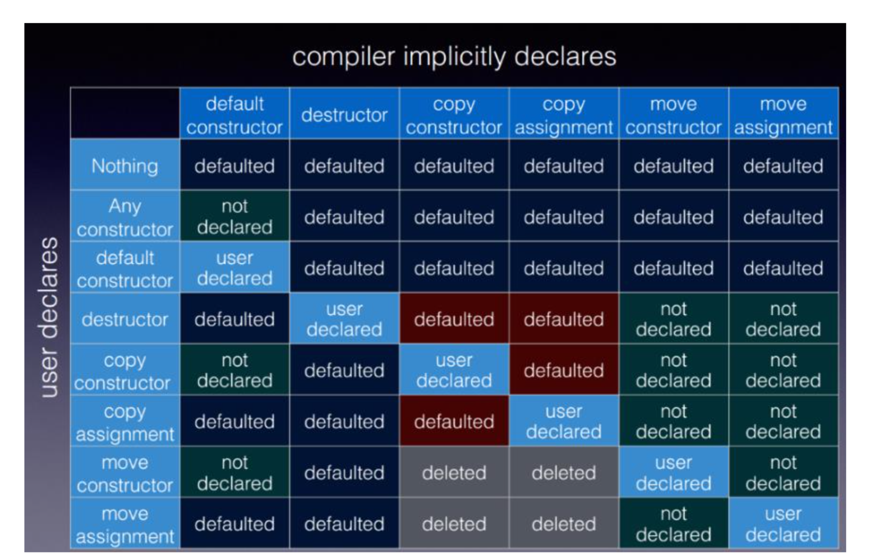

# C++ Fundamentals for Professionals

[toc]

## Core Language

C++ 98 was initially more focused on object-oriented programming. With the introduction of C++11, the language shifted focus on *functional programming*.

## Literals

explicit values in the program.

Raw string literals: suppress the interpretation of a string. notice the difference

```c++
#include <iostream>
#include <string>

int main(){

  std::string nat = "C:\temp\newFile.txt";
  std::cout << nat << std::endl;

  // including \t \n
  std::string raw1 = std::string(R"(C:\temp\newFile.txt)");
  std::cout << "\n" << raw1 << std::endl;  

  // raw string including "
  std::string raw3 = std::string(R"(a raw string including ")");
  std::cout << "\n" << raw3 << std::endl;

  return 0;
}

// output:
//C:	emp
//ewFile.txt
//
//C:\temp\newFile.txt
//
//a raw string including "
```

user-defined literals for type safety (with corresponding literal operator)


In C++14, string literals are supported. C++ used to only support C-string literals, meaning that we had to always use a C-string literal to initialize a C++ string. Time literals are very convenient; time literals are of type std::chrono::duration

```c++
#include <iostream>
#include <ostream>

namespace Distance{
  class MyDistance{
    public:
      MyDistance(double i):m(i){}

      friend MyDistance operator +(const MyDistance& a, const MyDistance& b){
        return MyDistance(a.m + b.m);
      }
      friend MyDistance operator -(const MyDistance& a, const MyDistance& b){
        return MyDistance(a.m - b.m);
      }

      friend std::ostream& operator<< (std::ostream &out, const MyDistance& myDist){
        out << myDist.m << " m";
         return out;
      }
    private:
      double m;

  };

  namespace Unit{
    MyDistance operator "" _km(long double d){
      return MyDistance(1000*d);
    }
    MyDistance operator "" _m(long double m){
      return MyDistance(m);
    }
    MyDistance operator "" _dm(long double d){
      return MyDistance(d/10);
    }
    MyDistance operator "" _cm(long double c){
      return MyDistance(c/100);
    }
    MyDistance operator "" _ft(long double ft) {
      return MyDistance(ft*0.348);
    }
    MyDistance operator "" _mi(long double mi) {
      return MyDistance(mi*1609.344);
    }
  }
}

using namespace Distance::Unit;

int main(){

  std:: cout << std::endl;

  std::cout << "1.0_km: " << 1.0_km << std::endl;
  std::cout << "1.0_m: " << 1.0_m << std::endl;
  std::cout << "1.0_dm: " << 1.0_dm << std::endl;
  std::cout << "1.0_cm: " << 1.0_cm << std::endl;
  std::cout << "1.0_ft: " << 1.0_ft << std::endl;
  std::cout << "1.0_mi: " << 1.0_mi << std::endl;

  std::cout << std::endl;
  std::cout << "1.0_km + 2.0_dm +  3.0_dm - 4.0_cm: " << 1.0_km + 2.0_dm +  3.0_dm - 4.0_cm << std::endl;
  std::cout << std::endl;

  return 0;
}


// output:
// 1.0_km: 1000 m
// 1.0_m: 1 m
// 1.0_dm: 0.1 m
// 1.0_cm: 0.01 m
// 1.0_ft: 0.348 m
// 1.0_mi: 1609.34 m
//
// 1.0_km + 2.0_dm +  3.0_dm + 4.0_cm: 1000.54 m
```

- should use namespaces for user-defined literals for collision avoidance.

## Types

Drawbacks of enumerations in classical C++

- Enumerators implicit convert to int
- Enumerators in the enclosing scope
- The type of the enumeration cannot be specified

Strongly-type enumerations since C++11, enum class/ enum struct, which

- can only be accessed in the scope of the enumeration
- don't implicitly convert to int (can use static_cast<int>(NewEnum::one))


**Pointers**

A pointer holds the address of a value. pointer dereferencing; create dynamic data using pointers, with *new* keyword.

Use nullptr (type std::nullptr_t) instead of number 0 or macro NULL

- we can assign nullptr to arbitrary pointers
- a nullptr can be compared with all other pointers

type deduction in template function will deduce 0 to int, NULL to type long int, instead of pointer type. The nullptr cannot be assigned to any arbitrary variable except a bool (through uniform initialization)

Function pointers

```c++
void addOne(int& x){
  x += 1;
}
void (*inc1)(int&)= addOne;  // function pointer
auto inc2 = addOne;

```

Pointer to struct/class member

reference: alias. A reference is never NULL and must always be initialized by having an existing variable assigned to it.

References behave like constant pointers

## Automatic Type Deduction

### auto

"auto" introduced since C++11

```c++
  // define a pointer to a function
  int (*add)(int,int)= myAdd;               // explicit
  auto add1= myAdd;                         // auto
  
  // iterate through a vector
  std::vector<int> vec;
  for (std::vector<int>::iterator it= vec.begin(); it != vec.end(); ++it){} 
  for (auto it1= vec.begin(); it1 != vec.end(); ++it1) {}
```


auto determines its type from an initializer. That simply means that; without an initializer, there is no type and therefore, no variable. The compiler ensures that each type is initialized, which is a nice side effect of auto (avoid undefined behavior).

> default initialization (the initialization performed when a variable is constructed with no initializer):
>
> “objects with automatic storage duration (and their sub-objects) are initialized to indeterminate values”
>
> Local variables that are not user-defined will not be default initialized.

Refactorization with auto

```c++
#include <typeinfo>  // for using typeid
#include <iostream>

int main(){
  auto a = 5;
  auto b = 10;
  auto sum =  a * b * 3;
  auto res = sum + 10; 
  std::cout << "typeid(res).name(): " << typeid(res).name() << std::endl;
  
  auto a2 = 5;
  auto b2 = 10.5;
  auto sum2 = a2 * b2 * 3;
  auto res2 = sum2 * 10;  
  std::cout << "typeid(res2).name(): " << typeid(res2).name() << std::endl;
  
  auto a3 = 5;
  auto b3 = 10;
  auto sum3 = a3 * b3 * 3.1f;
  auto res3 = sum3 * 10;  
  std::cout << "typeid(res3).name(): " << typeid(res3).name() << std::endl;
  
  return 0;
}

// output:
// typeid(res).name(): i
// typeid(res2).name(): d
// typeid(res3).name(): f
```

auto combines the dynamic behavior of an interpreter with the static behavior of a compiler

Advanced types

```c++
#include <chrono>
#include <future>
#include <map>
#include <string>
#include <tuple>

int main(){
  // define a function pointer
  int (*myAdd1)(int, int) = [](int a, int b){return a + b;};
  // use type inference of the C++11 compiler
  auto myAdd2 = [](int a, int b){return a + b;};
    
  auto myInts = {1, 2, 3};  // initializer_list<int>
  auto myIntBegin = myInts.begin();  // initializer_list<int>::iterator

  std::map<int, std::string> myMap = {{1, std::string("one")}, {2, std::string("two")}};
  auto myMapBegin = myMap.begin();  // map<int, string>::iterator

  auto func = [](const std::string& a){ return a;};  // (string)(*)(string)?
    							  // std::function<string(const string&)>

  auto futureLambda= std::async([](const std::string& s ) {return std::string("Hello ") + s;}, std::string("lambda function."));  // std::future<string>

  auto begin = std::chrono::system_clock::now();  // chrono::time_point<chrono::system_clock>

  auto pa = std::make_pair(1, std::string("second"));  // pair<int, string>

  auto tup = std::make_tuple(std::string("first"), 4, 1.1, true, 'a');  // tuple<string, int, double, bool, char>
    
    return 0;
}
```

### decltype

decltype is used to determine the type of an expression or entity

```c++
	int i = 1998; // Rvalue
	decltype(i) i2 = 2011; // Same as int i2 = 2011
	decltype((i)) iRef = i2; // (i) is an lvalue, reference returned

	cout << typeid(i2).name() << endl;
	cout << typeid(iRef).name() << endl;  // vs2017 showed int, should be int&
```

Rules:

- if the expression is an *lvalue*, decltype will return **a reference to the data type to the expression**
- if the expression is an rvalue, decltype will return **the data type of the value**

decltype is not used as often as auto. It is useful with templates that can deduce the type of a function (or function pointer).

### Automatic Return type

C++14

```c++
template <typename T1, typename T2>
auto add(T1 fir, T2 sec) /*-> decltype(fir+sec)*/{
    return fir + sec;
}
```


## Casts

### Explicit Cast

- dynamic_cast
- static_cast
- const_cast
- reinterpret_cast

We should avoid using C-casts ((type) value_to_be_casted)

*explicit is better than implicit*

### Dynamic Cast

- dynamic_cast converts a pointer or reference of a class to a pointer or reference in the same inheritance hierarchy. 
- It can only be used with polymorphic classes. We can cast up, down and across the inheritance hierarchy. dynamic_cast is mostly used when converting from a derived class to a base class (upcast)
- Type information at run time is used to determine if the cast is valid. 
- If the cast is not possible, we will get a nullptr in case of pointer and an std::bad_cast-exception in case of a reference

> Do keep in mind that dynamic_cast only deals with pointers and references

### Static Cast

- static_cast is the simplest casting operator and is used for simple conversions. 
- It can only perform well-defined conversions by the compiler.
- It allows bidirectional conversion between related data types such as: pointer types in class hierarchies
- static_cast cannot be used with polymorphic types
- unlike dynamic_cast, a static_cast is performed during compile time

### Const Cast

- const_cast allows us to remove or add the const or volatile property from a variable
- rarely used

### Reinterpret Cast

- reinterpret_cast allows us to convert a pointer of a particular type to a pointer of any other type regardless of whether the types are related or not
- It also allows conversion between a pointer and an integral
- reinterpret_cast guarantees that if a pointer is cast into another type, casting it back would return the original value
- not recommended

### Type Information

```c++
#include <typeinfo>

Circle c(5.0);
const std::type_info& t = typeid(Circle);
const std::type_info& v = typeid(c);

// type_info object could be compared directly
if (typeid(c) == typeid (b)) {
    //
}
std::cout << t.name() << std::endl;
```


## Unified Initialization

### unified initialization with {}

**Direct Initialization**

```c++
std::string str{"hello"};
int i{2011};
```

**Copy Initialization**

```c++
std::string str = {"hello"};
int i = {2011};
```

The difference is that *direct initialization directly calls the constructor of the type*, whereas, in copy initialization, the value is created and implicitly converted into the type.

It is possible to utilize {} for narrowing prevention.

A function could return an initializer list directly for object construction.

sequence constructor has a higher priority than classical constructor.

> In C++14, auto with {} always gives an initializer_list; with C++17, the rules are more complicated

## const, constexpr, and volatile

type const* / const type* : the value being pointed to is const; pointer can points to other variable

type* const: constant pointer, which can't point to another variable; but the value is changeable

trick: read from right to left

### constexpr

expression is evaluated at compile time. not just for variables, but functions and user-defined types.

pure functions: always return the same result when given the same arguments; never has side effects; never change the state of the program.

```c++
constexpr int square(int x) {return x*x; }
static_assert(square(10) == 100, "you calculated it wrong");

// array initialization
int arrayClassic[100];
int arrayWithConstExpression[square(10)];
```

Making the expression a constexpr variable will allow the code compilation to pass the assertions.

constexpr could be used with auto


How can we check that an instance will be created at compile-time?


### Volatile

The volatile variable is one whose value may change due to an external event.

volatile keyword exists in C# and Java as well, but it has nothing in common with volatile in C++. In C++

*volatile vs. std::atomic*

- volatile is for special objects, on which optimized read or write operations are not allowed
- std::atomic defines atomic variables, which are meant for thread-safe reading and writing. The volatile keyword in Java and C# is equivalent to std::atomic in C++. In other words, volatile has not multithreading semantics in C++.

`volatile` is typically used in embedded programming to denote objects that can change independently of the regular program flow. These are, for example, objects that represent an external device  (memory-mapped I/O). Because these objects can change independent of the regular program flow, their values will be written directly in the main memory. Hence, there is no optimized storing in caches - TODO.

volatile and data race

One of the biggest challenge of thread-management begins when the threads share non-const data.

- Data Race/Race Condition: a data race is a state, in which at least two threads access a shared data at the same time, and at least one of the threads is a writer. the program behavior is undefined.
- Critical Section: a critical section is a section of the code, which not more than one thread should access at any point in time.

The first solution is a mutex (mutual exclusion). It ensures that only one thread can access a critical section

## Move Semantic and Perfect Forwarding

### Rvalues and Lvalues

Rvalues are:

- temporary objects
- objects without a name
- objects from which we cannot get an address
- always on the right side of an assignment operation

*Lvalues can only be bound to lvalue references. However, rvalues can be bound to rvalue references or const lvalue references*. The binding of rvalues to rvalue references has higher priority.

Rvalue references: applications

**Move Semantics**

- cheap moving rather than expensive copying
- no memory allocation and deallocation
- non-copyable but moveable objects can be transferred by value

**Perfect forwarding**

- forward an object without changing its rvalue/lvalue nature. This helps in function templates

```c++
struct MyData{};

std::string function( const MyData & ) {
    return "lvalue reference";
}

std::string function( MyData && ) {
    return "rvalue reference";
}

int main(){
  MyData myData;
    // function(myData): lvalue reference
  std::cout << "function(myData): " << function(myData) << std::endl;
    // function(MyData()): rvalue reference
  std::cout << "function(MyData()): " << function(MyData()) << std::endl;
    // function(std::move(myData)): rvalue reference
  std::cout << "function(std::move(myData)): " << function(std::move(myData)) << std::endl;

    return 0;
}
```

- myData is lvalue reference since it has name and address
- MyData() is temporary object, which has no name and address, so it's rvalue reference

### Copy vs. Move Semantics

Copying is expensive and moving is cheap. But, the resource of the move operation is in a "valid but unspecified state" afterward.

> Although it is called "move". When we move an object, we transfer ownership. *By moving, we give the object to someone else*

- A class supports copy semantics if the class has a copy constructor and a copy assignment operator
- A class supports move semantics if the class has a move constructor and a move assignment operator

Containers of the STL can have non-copyable elements. The copy semantics is the fallback for the move semantics (meaning if we invoke std::move with a non-moveable type, copy semantic is used because an rvalue can be bound to an rvalue reference and a const lvalue reference). The function std::move moves its resource, and is a static_cast to a rvalue reference under the hood.

move constructor, move assignment operator has non-constant rvalue reference as arguments, while the traditional copy constructor and copy assignment operator get their assignment as constant lvalue reference

> The move semantic has priority over the copy semantic

Big six:

- default constructor
- destructor
- move and copy constructor
- move and copy assignment operator

Move semantic can be significantly faster than the copy semantic since we are only redirecting the pointer to another vector. More precisely, the cost of move semantics are independent of the size of the data structure.

### Perfect Forwarding

Def: If a function template forwards its arguments without changing their lvalue or rvalue characteristics, we call it *perfect forwarding*

The (Arg&& a) **universal reference** can bind lvalues or values.

To achieve perfect forwarding, we have to combine a universal reference with std::forward, std::foward<Arg>(a). When the argument a is an ravlue, std::forward moves its argument. When the argument a is an lvalue, it copies the argument. Therefore, an rvalue remains an rvalue.

```c++
template<typename T>
void wrapper(T&& a) {
    func(std::forward<T>(a));
}
```

Variadic Templates are templates that can get an arbitrary number of arguments.

```c++
template<typename T, typename ... Args>
T create(Args&& ... args) {
    return T(std::forward<Args>(args)...);
}
```


## Memory Management

### Memory allocation and release

We can directly create objects in static memory, in a reserved data, or even in a memory pool.

Dynamic memory, or the heap, has to be explicitly requested or released by the programmer. The compiler manages its memory automatically on the stack. Smart pointers manage memory automatically

new causes memory allocation and object initialization. The class of the allocated object must have a default constructor.

> The STL containers and C++ String automatically manage their memory

If the deleted object belongs to a type hierarchy, the destructor of the object and the destructors of all base classes will be automatically called. If the destructor of the base class is *virtual*, we can destroy the object with a pointer or reference to the base class.

be careful with undefined behavior after deletion.


**RAII**

acquire resource in constructor and release in destructor.

Even the throwing of an exception does not alter the reliability of RAII. The destructor will still be called at the end of the try block.

### Overloading new and delete

for programs running for long periods of time, it is a challenge to allocate and deallocate memory from a memory management perspective.

TODO

## Functions

The *signature* of a function is its name and parameters (no return types). Function arguments are passed by value by default.

The parameters that have default arguments must be placed at the end (not really convenient in practice, should adopt something like in Python with named argument)

### Function Overloading

The compiler ignores *references* when overloading functions.

```c++
int min(int x, int y);
// is the same as
int min(int& x, int& y);
```

Furthermore, the *const* and *volatile* quantifiers are also ignored.

### Lambda Functions

a function without a name.

A lambda can be written in-place and can be treated as data.

**Function vs. function object**

lambdas are just function objects automatically created by the compiler.

A function object is an instance of a class for which the call operator, operator(), is overloaded. A function object is an object that behaves like a function. The main difference between a function and a function object is that *a function object is an object and can, therefore, have a state*

```c++
int addFunc(int a, int b) {
    return a+b;
}

int main() {
    struct AddObj {
        int operator()(int a, int b) const {  // function object
            return a+b;
        }
    }
    
    AddObj addObj;
    addObj(3, 4) == addFunc(3, 4);
    // lambda
    auto addObjLambda = [](int a, int b) {return a+b;}
    addObjLambda(3, 4) == addFunc(3, 4);
}
```

 If the lambda expression captures its environment and therefore has a state, the corresponding struct, `AddObj`, gets a constructor for initializing its members. If the lambda  expression captures its argument by reference, so does the constructor.  The same holds for capturing by value.


Lambda function can bind their invocation context. This is perhaps the best feature of C++ lambdas.


**Generic lambda functions** that deduce their argument types. A generic lambda is a function template.

```c++
#include <iostream>
#include <vector>
#include <numeric>
using namespace std::string_literals;

int main() {
  auto add11=[ ](int i, int i2){ return i + i2; }; 
  auto add14= [ ](auto i, auto i2){ return i + i2; };
  std::vector<int> myVec{1, 2, 3, 4, 5};
  auto res11= std::accumulate(myVec.begin(), myVec.end(), 0, add11); 
  auto res14= std::accumulate(myVec.begin(), myVec.end(), 0, add14);
  
  std::cout << res11 << std::endl;
  std::cout << res14 << std::endl;

  std::vector<std::string> myVecStr{"Hello"s, " World"s};
  auto st= std::accumulate(myVecStr.begin(), myVecStr.end(), ""s, add14);
  std::cout << st << std::endl; // Hello World
}
```


Capturing local variables

```c++
#include <functional>

std::function<int(int)> makeLambda(int a){    
    return [a](int b){ return a + b; };
}

int main(){
    auto add5 = makeLambda(5);      
    auto add10 = makeLambda(10);      
    add5(10) == add10(5);               
}
```


example: using Lambdas for sorting

```c++
bool lessLength(const string& f, const string& s) {
    return f.length() < s.length();
}
// functor
class GreaterLength {
  public:
    bool operator() (const string& f, const string& s) const {
        return f.length() > s.length();
    }
};

int main() {
    vector<string> myStrVec = {"12345", "123456", "1234", "1", "12", "123", "12345"};
    // 1. sort with function
    std::sort(myStrVec.begin(), myStrVec.end(), lessLength);
    // 2. sort with function object
   	std::sort(myStrVec.begin(), myStrVec.end(), GreaterLength());
    // 3. sort with Lambda function
    std::sort(myStrVec.begin(), myStrVec.end(), [](const string& f, const string& s) {return f.length() < s.length(); });
    // print
    std::copy(myStrVec.begin(), myStrVec.end(), std::ostream_iterator<std::string>(std::cout,  " "));
    
    return 0;
}
```


## Classes and Objects

### Class Types

classes are data types encapsulating *attributes* and *methods*

Objects are concrete examples of a class that exist at run time.

Static attributes are attributes shared by all instances of a class. Only one stance of the static attribute is present for all objects.

### Constructors

Constructors are special methods for the instantiation of an object in the class. Constructors has the exact name as the class and no return type.

The explicit constructor is used to avoid implicit class to a class's constructor

```c++
Account(double b): balance{b}{}
Account acc = 100.0;  // OK
// explicit constructor
explicit Account(double b): balance(b) {}
// Account account = 100.0;  // Error
```

### Initializers for Instances

**Member initializer lists**

An initializer list is used to initialize the members in the constructor of a class. The list is added before the body of the constructor.

- non-static attributes that are declared const or as a reference must be initialized in the initializer list
- the sequence of initialization corresponds to the sequence in which the attributes were declared (makes no much sense)
- static attributes cannot be initialized in the initializer of the constructor

### Constructor Delegation

constructor delegation occurs when a constructor calls another constructor of the same class in its initializer list.

The default constructor can actually calls the parameterized constructor not just vice versa.

> Note: constructor delegation must be done in the initializer list not in the body. If not, we will end up with two objects.
>
> Recursively invoking constructors will result in undefined behavior

### Destructors

free up memory, releasing locks

Locks and smart pointers use this characteristic. If a class has a raw pointer (T*) or reference (T&), consider whether it might be owned.

std::unique_ptr is by design as efficient as a raw pointer can be. There is no overhead in memory or time.

**A base class destructor should be either public and virtual or protected and nonvirtual**. If the destructor of the base class is protected, we cannot destroy derived objects using a base class pointer, therefore, the destructor must not be virtual.

If the destructor of a class, `Base`, is private, we cannot use the type. If the destructor of a class, `Base`, is protected, we can only derive `Derived` from Base and use Derived.

```c++
struct Base{
    protected:
    ~Base() = default;
};
 
struct Derived: Base{};
 
int main(){
    Base b;   // Error: Base::~Base is protected within this context
    Derived d;
}
```

### Methods

Every class attribute has an implicit *this* pointer.

static methods can be used with or without an instance of the class.

> Note: Static methods do not have this pointer. They can only access static attributes and methods.

Constant objects can only call *const* or *constexpr* methods. An instance does not have to be const to use constant methods. Constant methods can only change an instance variable if the instance variable is declared *mutable*

constexpr methods are implicitly const. Such methods can only class other constexpr functions, methods, and global variables.

*const vs constexpr*

- const methods are used to increase safety. They restrict modification access to the attributes of the class.
- constexpr methods are used to increase performance and optimize the program (evaluated at compile time)

### Request and Suppress Methods

default can only be assigned to special methods that do not have any default arguments.



By using *delete* in combination with *default*, we can define whether or not a class's objects:

- can be copied
- can only be created on the stack
- can only be created on the heap

```c++
class SomeType{
  public:
  // state the compiler generated default constructor
  SomeType() = default;
  // constructor for int
  SomeType(int value){
    std::cout << "SomeType(int) " << std::endl;
  };
  // explicit Copy Constructor
  explicit SomeType(const SomeType&) = default;
  // virtual destructor, in case of inheritance
  virtual ~SomeType() = default;

};
```


delete is also applicable to functions (interesting)

```c++
#include <iostream>

class NonCopyableClass{
  public:
  // state the compiler generated default constructor
  NonCopyableClass()= default;
  // disallow copying
  NonCopyableClass& operator = (const NonCopyableClass&) = delete;
  NonCopyableClass (const NonCopyableClass&) = delete;
  // disallow copying
  NonCopyableClass& operator = (NonCopyableClass&&) = default;
  NonCopyableClass (NonCopyableClass&&) = default;
};

class TypeOnStack {
  public:
    void * operator new(std::size_t)= delete;
};

class TypeOnHeap{
  public:
    ~TypeOnHeap()= delete;
};

void onlyDouble(double){}
template <typename T>
void onlyDouble(T)=delete;

int main(){

  NonCopyableClass nonCopyableClass;
  TypeOnStack typeOnStack;
  TypeOnHeap * typeOnHeap = new TypeOnHeap;
  onlyDouble(3.14);
    
  // force the compiler errors
  NonCopyableClass nonCopyableClass2(nonCopyableClass); // cannot copy
  TypeOnStack * typeOnHeap2 = new TypeOnStack; // cannot create on heap
  TypeOnHeap typeOnStack2; // cannot create on stack
  onlyDouble(2011); // int argument not accepted
}
```

### Operator Overloading

Derived class inherit all the operators of their base classes except the assignment operator. Each class needs to overload the = operator.

```c++
// overload +=  
Account& operator += (double b){
    balance += b;
    return * this;
  }
// friend fucntion for accessing private member and overload for same types
 friend Account& operator += (Account& a, Account& b) {
   a.balance += b.balance;
   return a;
 }
// overload <<
 friend std::ostream& operator << (std::ostream& os, const Account& a) {
   os << a.balance;
   return os;
 }

// usage
  Account acc1(100.0);

  acc1 += 50.0;
  acc1 += acc1;
  acc1.operator += (50.0);  // explicit operator call
```

If the assignment operator is not overloaded, the compiler creates one implicitly.

move assignment operator can be more efficient than copy assignment.

### Explicit Conversion Operators

### Call Operator

By overloading the function call operator (), we can call objects like ordinary function objects that may or may not have arguments. These special objects are known as functors.

*The best feature of function objects is that they can have a state*. Since they are objects, data is stored inside them, but they can also be used as functions to return data.

Functors are very similar to lambda functions. Lambdas actually create anonymous functors. Functors are used frequently in STL algorithms as arguments.

```c++
class SumMe {
  public:
    SunMe(): sum(0){};
    void operator()(int x) {
        sum += x;
    }
    int getSum() const {return sum;}
  private:
    int sum;
};

// usage
std::vector<int> intVec = {1, 2, 3, 4, 5, 6, 7, 8, 9, 10};
SumMe sumMe = std::for_each(intVec.begin(), intVec.end(), SumMe());
std::cout << "sumMe.getSum(): " << sumMe.getSum() << std::endl;

// use Lambda
int sum{0};
std::for_each(intVec.begin(), intVec.end(), [&sum](int x) { sum += x; });
```

> Lambda functions can also have a state

### Access Rights for Members

The public and protected members are the interfaces of the class, the private members are the implementations of the class.

### Friend

The friend declaration appears in a class body and grants a function or  another class access to private and protected members of the class where the friend declaration appears.

A class can declare friendship to a function, a method or a class

- Access specifier have no effect on the meaning of friend declarations (private, or public)
- Friendship cannot be inherited, not transitive
- **A friend has full control of the internals of a class**

Structs should be used instead of classes if the data type is a simple data holder.

## Inheritance

### Abstract Base Classes

When one class inherits from another class, it gets all its attributes and members from the parent class and can add new ones.

> Polymorphism: when the characteristics of an object behave differently at run time.

Abstract base classes are classes that have at least one pure virtual method. They are typically used as interfaces for class hierarchies.

- abstract base class cannot be instantiated
- derived class has to implement the pure virtual method in order to get instantiated
- must implement a pure virtual destructor

The derived class and the base class have an is-a relationship. Public inheritance is called an is-a relationship because the derived class has the same interface as the base class. The derived class is a specialization of the base class

```c++
// public->public, protected->protected
class BankAccount: public Account {...}
// public->protected, protected->protected
class BankAccount: protected Account {...}
// public->private, protected->private
class BankAccount: private Account {...}
```

A class hierarchy is constructed to represent a set of hierarchically organized concepts (only). Typically, base classes act as interfaces. There are two major uses for hierarchies,

- implementation inheritance
- interface inheritance

C++ core guidelines

- Use class hierarchies to represent concepts with inherent hierarchical structure (only)

make sure the idea represented in the base class exactly matches all derived types and there is not a better way to express it than using the tight coupling of inheritance

- If a base class is used as an interface, make is a pure abstract class

A class is more stable (less brittle) if it does not contain data. Interfaces should normally be composed entirely of public pure virtual functions and a default/virtual destructor.

```c++
class My_interface {
public:
    // ...only pure virtual functions here ...
    virtual ~My_interface() {}   // or =default
};
```

- use abstract classes as interfaces when complete separation of interface and implementation is needed - such as on an ABI boundary

### Constructor Inheriting

Constructor calls start with base class and end with the most derived class.

> Only the default constructor is inherited, the copy and move constructor will not be inherited

### Base Class Initializers

specify the data that are given to the base class for initialization

```c++
struct Account{
  Account(double amount){};
};

struct BankAccount: Account{
BankAccount(double r): Account(r), cur("EUR"){}  // specialization
private:
  std::string cur;
};
```

### Destructor Calls

The sequence of destructor calls starts with with the most derived class and ends with the base class.

> constructor calls and destructor calls follow the exact opposite behavior

### Virtual Methods

- Virtua methods are used to adjust the behavior of an object while keeping its interface stable
- to be overridden

The dynamic type of the object determines which version of a virtual method will be called. To apply virtuality, a pointer or a reference is needed.

```c++
Account* aPtr = &banAccount;

Account& aRef = bankAccount;
```

Polymorphic

- The method is selected at run-time
- dynamic or late binding

Rules

- Virtual methods do not have to be overridden
- Methods declared as virtual stay virtual in the hierarchy

When destructing an object via a pointer or a reference to a base class, the destructors must be virtual.

### Override and Final

To override a method, the signature of the overridden method of the base class has to match exactly.

*final* supports two use cases

- declare a method that cannot be overridden
- define a class that cannot be derived from

Methods and classes declared as final are an optimization opportunity for the compiler

```c++
// both variants are equivalent
void func() final;
virtual void fun() final override;  // ?
```

The template method design pattern. The typical implementation of the template method pattern is to use NVI, which stands for non-virtual interface, meaning the interface should not be virtual. NVI requires non-virtual interface, which is not possible in Java or Python

### Multiple Inheritance

Diamond-problem

Ambiguous calls to members can be resolved by using the scope operator

virtual multiple inheritance

## Templates

TODO

## Utilities

TODO

## Smart Pointers

3 different smart pointers, defined in the header <memory>

explicit memory management in C++

- unique_ptr: exclusive ownership, can't be copied
- shared_ptr: shared ownership, with reference counter
- weak_ptr: temporary ownership

smart pointers manage their resources according to the RAII idiom.

> RAII: **R**esource **A**cquisition **I**s **I**nitialization,  also known as RAII, is a popular technique in C++. Resource  acquisition and release are bound to the lifetime of an object. This  means that the memory for the smart pointer is allocated in the  constructor and deallocated in the destructor. We can use this technique in C++ because the destructor is called when the object goes out of  scope.

### Unique Pointers

unique_ptr should be our first choice since it functions without memory or performance overhead

- can be instantiated with and without a resource.
- manages the life cycle of a single object or an array of objects.
- transparently offers the interface of the underlying resource.
- can be parametrized with its own deleter function.
- can be moved (move semantics).
- can be created with the helper function `std::make_unique`

```c++
auto uniquePtr = std::make_unique<int>(2020);
// make_unique is preferred over
auto uniquePtr2 = std::unique_ptr<int>(new int(2020));
```

> always use make_unique, which guarantees no memory leak

.get() methods obtains the address of the smart pointer

unique_ptr has a specialization for arrays

```c++
    std::unique_ptr<MyStruct[]> myUniqueArray{new MyStruct[5]};  // on the heap
	MyStruct myStruct;  // on the stack
    myStruct= myUniqueArray[0];
```

### Shared Pointers

keeping a reference count to maintain the count of its copies; two handles: one for the resource, one for the reference counter

The C++ runtime guarantees that the call of the reference counter is an atomic operation; Due to this management, shared_ptr consumes more time and memory than a raw pointer or unqiue_ptr

Use std::make_shared rather than directly creating an std::shared_ptr because std::make_shared is much faster and it guarantees no memory leaks

CRTP

derive from std::enable_shared_from_this

The classic issue of smart pointers using a reference count is to have cyclic references.

### Weak Pointers

std::weak_ptr supports no transparent access to the resources; it only borrows the resource from an std::shared_ptr; and it breaks the cycle of std::shared_ptr

std::weak_ptr does not change the reference counter of the shared variable. .use_count remains unchanged

### Cyclic References

cyclic references of std::shared_ptr if they refer to each other. The reference counter will never become 0.

### Performance Comparison

shared_ptr is now; make_unique is faster than raw unique pointer;

```c++
std::unique_ptr<int> tmp(new int(100));
// vs.
std::unique_ptr<int> tmp(std::make_unique<int>(100));
```

### Passing Smart Pointers

The Six Rules for passing shared_ptr and unique_ptr

1. **[R.32](https://www.educative.io/courses/cpp-fundamentals-for-professionals/(http://isocpp.github.io/CppCoreGuidelines/CppCoreGuidelines#Rr-uniqueptrparam))**: Take a `unique_ptr` parameter to express that a function assumes ownership of a widget.
2. **[R.33](http://isocpp.github.io/CppCoreGuidelines/CppCoreGuidelines#Rr-reseat)**: Take a `unique_ptr&` parameter to express that a function reseats the widget. (resets?)
3. **[R.34](http://isocpp.github.io/CppCoreGuidelines/CppCoreGuidelines#Rr-sharedptrparam-owner)**: Take a `shared_ptr` parameter to express that a function is part owner.
4. **[R.35](http://isocpp.github.io/CppCoreGuidelines/CppCoreGuidelines#Rr-sharedptrparam)**: Take a `shared_ptr&` parameter to express that a function might reseat the shared pointer.
5. **[R.36](http://isocpp.github.io/CppCoreGuidelines/CppCoreGuidelines#Rr-sharedptrparam-const)**: Take a const `shared_ptr&` parameter to express that it might retain a reference count to the object.
6. **[R.37](http://isocpp.github.io/CppCoreGuidelines/CppCoreGuidelines#Rr-smartptrget)**: Do not pass a pointer or reference obtained from an aliased smart pointer.

```c++
struct Widget{
    Widget(int){}
};
void sink(std::unique_ptr<Widget> uniqPtr){
    // void thinko(const unique_ptr<widget>&); // usually not what you want
    // do something with uniqPtr
}

int main(){
    auto uniqPtr = std::make_unique<Widget>(1998); 
    sink(std::move(uniqPtr));      // (1)
    sink(uniqPtr);                 // (2) ERROR
}
```

If the function only wants to use the Widget, it should take its parameter by pointer or by reference.

```c++
void useWidget(Widget* wid);
void useWidget(Widget& wid);
```

```c++
// R33
void reseat(std::unique_ptr<Widget>& uniqPtr){
    uniqPtr.reset(new Widget(2003));   // (0)
    // do something with uniqPtr
}

auto uniqPtr = std::make_unique<Widget>(1998);
reseat(std::move(uniqPtr));  // Error
reseat(uniqPtr);
```

Will not only construct a new Widget(2003), but also destruct the old Widget(1998)

```c++
// R34, 35, 36 
void share(std::shared_ptr<Widget> shaWid);  // will increase reference counter
void reseat(std::shard_ptr<Widget>& shadWid);  // will not change the reference counter; and we can reseat the resource
void mayShare(const std::shared_ptr<Widget>& shaWid);  // only borrows the resource; should prefer Widget* or Widget& over this
```


## Containers in General

Each container has an allocator which works in the background, and hence the size of a container can be adjusted at runtime.

Sequential Contaiers

- std::array
- vector
- deque
- list
- forward_list

### Create and Delete


## Sequential Containers

## Associative Containers in General

## Ordered Associative Containers

## Unordered Associative Containers

## Algorithms

## Non-Modifying Algorithms

## Modifying Algorithms

## More Algorithms

## Callables

## Iterators

## Strings

## Regular Expressions

## Input and Output

## Threads

## Shared Data

## Tasks

## Conclusion