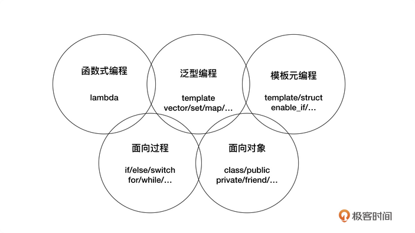
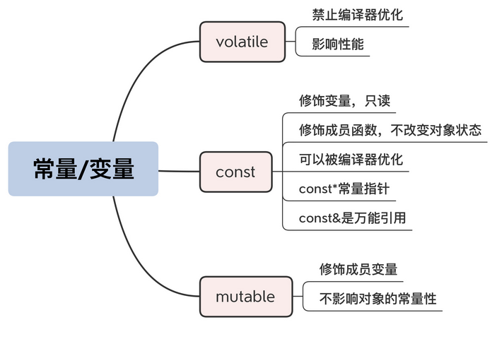
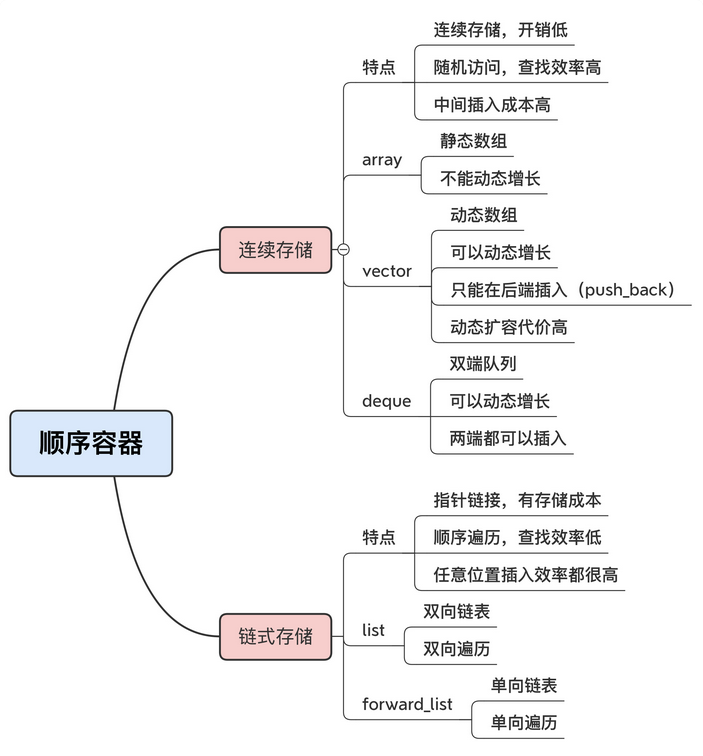
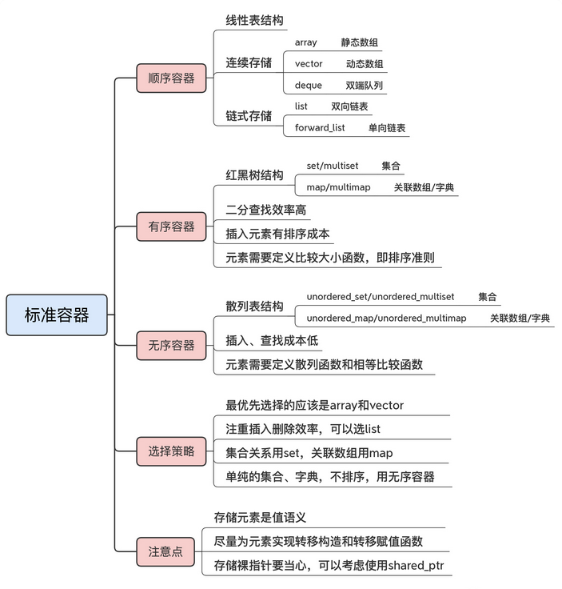
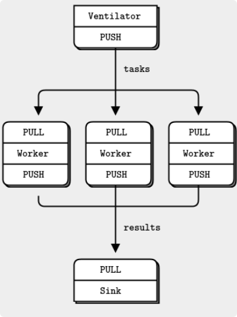
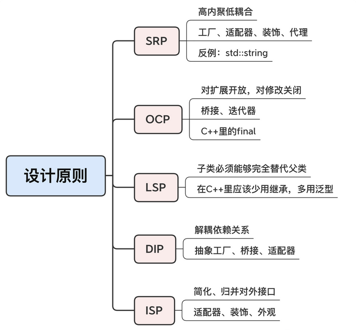
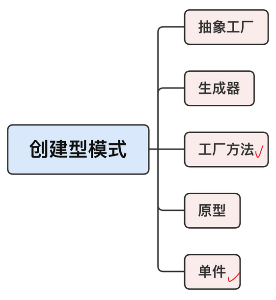
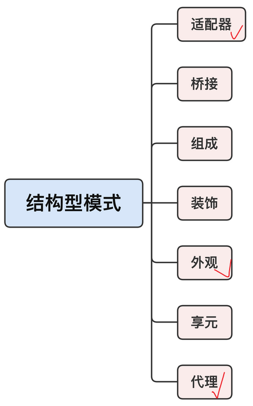
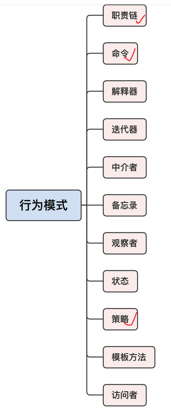
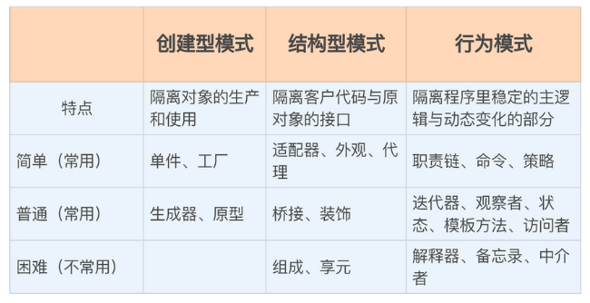

# C++ 实战笔记

[toc]

## 1. 课前导读

重点是谈使用时的注意事项和经验教训。

课程分为5个模块，注重语言和库的“开发落地”，基本不讲语法细节和内部实现原理，用实例促使更多地应用“现代C++”自然、直观的思维方式。

- 概论：生命周期和编程范式
- 语言特性：自动类型推导、智能指针、Lamdba表达式
- 标准库：字符串、容器、算法和并发
- 技能进阶：第三方工具，序列化、网络通信和性能分析
- 总结：设计模式，完整可用的C++服务端程序

勉言：

- 任何人都能写出机器能看懂的代码，但只有优秀的程序员才能写出人能看懂的代码。
- 有两种写程序的方式：一种是把代码写得非常复杂，以至于“看不出明显的错误”；另一种是把代码写得非常简单，以至于“明显看不出错误”。
- “把正确的代码改快速”，要比“把快速的代码改正确”，容易得太多。

C++/Python混合编程，C++写底层代码，Python调用。


建议使用Linux。目前差不多所有的商业网站的服务器（还有Android）上跑的都是Linux，C++再开发后台服务方面可以大显身手。

居然不会CMake？

## 2. 概论

从“生命周期”和“编程范式”的角度来“剖析”C++

### 重新认识C++：生命周期和编程范式 

Coding, Pre-processing, Compiling and Running

预处理是C/C++程序独有的阶段 #

“模板元编程”


现代C++支持“面向过程”、“面向对象”、“范式”、“模板元”、“函数式”这五种编程范式。



面向对象：高内聚低耦合，核心思想是“抽象”和“封装”

泛型编程：核心思想是“一切皆为类型”，使用模板而不是继承的方式来复用代码，运行效率更高，代码也更简洁；STL

模板元编程：核心思想是“类型运算”，操作的数据是编译时可见的“类型”，代码只能由编译器执行，而不能被运行时的CPU执行。更多的以库的方式来使用

函数式：数学意义上、无副作用的函数，核心思想时“一切皆可调用”，通过一系列连续或这嵌套的函数调用实现对数据的处理。

适当混用：常用范式“过程+对象+泛型”，少量“函数式”，慎用“模板元”

C++不是纯粹的面向对象语言，它是面向对象的探路先锋，走了一些弯路，给后来的Java等蹚了道；我们完全可以在C++里按照Java的风格来写面向对象。


面向对象和基于对象有什么区别？

广义上都属于面向对象。前者强调统一用对象建模，多应用设计模式，对象关系复杂。后者相当于C with class，只把class当成struct来封装数据，继承、多态等高级特性用的比较少。


C++的应用水平取决于团体的整体水平。

typedef是在编译阶段，而不是预处理阶段

编译成机器码，但这并不是跨平台的代码，而是源码可以跨平台，由不同的编译器编译成对应平台的二进制代码。
Java等语言的字节码由于运行在虚拟机上，它才是跨平台的代码。

docker用的是go。C++可以让你理解底层计算机的运行机制，反而让你在上层更好地工作。而且C++很容易编写各种底层模块给上层调用，做混合编程里最核心最要求性能的那部分。

### 编码阶段能做什么：秀出好的code style

human readable

空格与空行：留白的艺术

起个好名字

- “匈牙利命名法” - 基本被淘汰
- “CamelCase" - popular in Java
- "snake_case" - C/C++

命名长度一个普遍认可的原则：变量/函数的名字长度与它的作用域成正比；局部可以短一点，全局名应该长一点。

注释：适当注释，一个突出的反例十四JSON，没有注释功能。参考Javadoc

Doxgen：支持从源码生成完整的API文档，但是格式过于“死板”。

注释另一个功能是TODO

“必杀技”：code review

检查C++代码风格的工具：cpplint。它是一个Python脚本

clang-format

```bash
sudo pip install cpplint
```

函数的注释如果是API，写在声明，如果是内部用，写在定义处。


### 预处理阶段能做什么：宏定义和条件编译   

#### 预处理编程：#include, #define

记住：预处理阶段编程的操作目标是“源码”，用各种指令控制预处理器，把源码改造成另一种形式。虽然都在一个源文件里，但预处理不属于C++语言，它走的是预处理器，不受C++语法规则的约束。

#include可以不做检查的包含任意的文件（不限于“头文件”）

#include可以编写一些代码片段，存进“.inc”文件里，然后有选择的加载。用得好的话，可以实现“源码级别的抽象”。

```c++
static uint32_t calc_table[] = { // 非常大的一个数组，有几十行
    0x00000000, 0x77073096, 0xee0e612c, 0x990951ba,
    0x076dc419, 0x706af48f, 0xe963a535, 0x9e6495a3,
    0x0edb8832, 0x79dcb8a4, 0xe0d5e91e, 0x97d2d988,
    0x09b64c2b, 0x7eb17cbd, 0xe7b82d07, 0x90bf1d91,
    ...
};

static uint32_t calc_table[] = {
#	include "calc_values.inc" // 非常大的一个数组，细节被隐藏
};
```


#define可谓“无所不能”，在预处理阶段可以无视C++语法限制，替换任何文字，定义常量/变量,实现函数功能，为类型起别名（typedef），减少重复代码...。但是，使用宏的时候一定要谨慎，时刻记着以简化代码、清晰易懂为目标，不要“滥用”。

注意事项：

- 首先，因为宏的展开、替换发生在预处理阶段，不涉及函数调用、参数传递、指针寻址，没
  有任何运行期的效率损失，所以对于一些调用频繁的小代码片段来说，用宏来封装的效果比
  inline 关键字要更好，因为它真的是源码级别的无条件内联。

  ```c++
  // 示例来自Nginx
  #define ngx_tolower(c) ((c >= 'A' && c <= 'Z') ? (c | 0x20) : c)
  #define ngx_toupper(c) ((c >= 'a' && c <= 'z') ? (c & ~0x20) : c)
  #define ngx_memzero(buf, n) (void) memset(buf, 0, n)
  ```

- 其次，你要知道，**宏是没有作用域概念的，永远是全局生效**。所以，对于一些用来简化代
  码、起临时作用的宏，最好是用完后尽快用“#undef”取消定义，避免冲突的风险

  ```c++
  #define CUBE(a) (a) * (a) * (a) // 定义一个简单的求立方的宏
  cout << CUBE(10) << endl; // 使用宏简化代码
  cout << CUBE(15) << endl; // 使用宏简化代码
  #undef CUBE // 使用完毕后立即取消定义
  ```

  另一种做法是宏定义前先检查，如果之前有定义就先undef，然后再重新定义

  ```c++
  #ifdef AUTH_PWD // 检查是否已经有宏定义
  # undef AUTH_PWD // 取消宏定义
  #endif // 宏定义检查结束
  #define AUTH_PWD "xxx" // 重新宏定义
  ```

- 再次，你可以适当使用宏来定义代码中的常量，消除“魔术数字”“魔术字符串”（magic number）。虽然不少人认为，定义常量更应该使用 enum 或者 const，但我觉得宏定义毕竟用法简单，也是源码级的真正常量，而且还是从 C 继承下来的传统，用在头文件里还是有些优势的。

  ```c++
  #define MAX_BUF_LEN 65535
  #define VERSION "1.0.18"
  ```

- “文本替换”的功能

  ```c++
  #define BEGIN_NAMESPACE(x) namespace x {
  #define END_NAMESPACE(x) }
  BEGIN_NAMESPACE(my_own)
  ... // functions and classes
  END_NAMESPACE(my_own)
  ```


#### 条件编译（#if/#else/#endif）

通常编译环境都会有一些预定义宏，比如 CPU 支持的特殊指令集、操作系统 / 编译器 / 程序库的版本、语言特性等，使用它们就可以早于运行阶段，提前在预处理阶段做出各种优化，产生出最适合当前系统的源码。

```c++
// __cplusplus 标记了C++的版本号
#ifdef __cplusplus // 定义了这个宏就是在用C++编译
	extern "C" { // 函数按照C的方式去处理
#endif
	void a_c_function(int a);
#ifdef __cplusplus // 检查是否是C++编译
	} // extern "C" 结束
#endif

#if __cplusplus >= 201402 // 检查C++标准的版本号
	cout << "c++14 or later" << endl; // 201402就是C++14
#elif __cplusplus >= 201103 // 检查C++标准的版本号
	cout << "c++11 or later" << endl; // 201103是C++11
#else // __cplusplus < 201103 // 199711是C++98
	# error "c++ is too old" // 太低则预处理报错
#endif // __cplusplus >= 201402 // 预处理语句结束
```


使用“#if 1”“#if 0”来显式启用或者禁用大段代码，要比“/* … */”的注释方式安全得多，也清楚得多

```c++
#if 0 // 0即禁用下面的代码，1则是启用
	... // 任意的代码
#endif // 预处理结束
#if 1 // 1启用代码，用来强调下面代码的必要性
	... // 任意的代码
#endif // 预处理结束
```


小结：

1. 预处理不属于 C++ 语言，过多的预处理语句会扰乱正常的代码，除非必要，应当少用慎
   用；
2. “#include”可以包含任意文件，所以可以写一些小的代码片段，再引进程序里；
3. 头文件应该加上“Include Guard”，防止重复包含；
4. “#define”用于宏定义，非常灵活，但滥用文本替换可能会降低代码的可读性；
5. “条件编译”其实就是预处理编程里的分支语句，可以改变源码的形态，针对系统生成最合适的代码。

> 有的编译器支持指令"#pragma once"，也可以实现“include guard”，但它是非标准的，不推荐使用 - 这个g++, MSVC都支持
>
> C++20新增了“模块”(module)特性，可以实现一次性加载，但"include guard"再短期内还是无可替代的。

条件编译多用在跨平台和高级优化方面，不用当然也可以，但要追求性能极致就必须考虑。

预处理就是文本替换，你要是愿意，用shell、Python也可以处理C++源码来实现。

extern "C" { }是处理编译器的链接符号，保持与C兼容，通常是为了导出外部接口使用的。

预处理就是面向源码编程，调整源码的形态，掌握了这一点就可以让代码更干净整齐。


### 编译阶段能做什么：属性和静态断言

编译阶段生成machine instruction code

编译阶段的特殊性在于，它看到的都是 C++ 语法实体，比如 typedef、using、template、struct/class 这些关键字定义的类型，而不是运行阶段的变量。所以，这时的编程思维方式与平常大不相同。

```c++
// 编译阶段数值计算
template <int N>
struct fib
{
    static const int value = fib<N - 1>::value + fib<N - 2>::value;
};

template <>
struct fib<0> // template specialization
{
    static const int value = 1;
};

template <>
struct fib<1>
{
    static const int value = 1;
};

int main()
{
    cout << fib<2>::value << endl;
    cout << fib<3>::value << endl;
    cout << fib<4>::value << endl;
    cout << fib<5>::value << endl;

    return 0;
}
```

上面的计算是编译阶段完成的！

可以把编译器想象成是一种特殊的“虚拟机”，在上面跑的是只有编译器才能识别、处理的代码。


两个比较容易理解的编译阶段技巧：属性和静态断言

#### 属性（attribute）

C++11, attribute 可以被理解为给变量、函数、类等“贴”上一个编译阶段的“标签”，方便编译器识别处理。

```c++
[[deprecated("deadline:2020-12-31")]] // C++14 or later
int old_func();
```

任何用到这个函数的程序都会在编译时看到这个标签，报出一条警告。当然，程序还是能够正常编译的

#### 静态断言（static _assert）

```c++
assert(i > 0 && "i must be greater than zero");
assert(p != nullptr);
assert(!str.empty());
```

注意，assert 虽然是一个宏，但在预处理阶段不生效，而是在运行阶段才起作用，所以又叫“动态断言”。

static_assert是编译阶段里检测各种条件的“断言”，编译器看到static_assert会计算表达式的值，如果false，会报错，导致编译失败。

```c++
template<int N>
struct fib
{
    static_assert(N >= 0, "N >= 0");
    static const int value =
    	fib<N - 1>::value + fib<N - 2>::value;
};
```

> assert是宏，但是static_assert是专门的关键字，不是宏
>
> static_assert 运行在编译阶段，只能看到编译时的常数和类型，看不到运行时的变量、指针、内存数据等，是“静态”的，所以不要简单地把 assert 的习惯搬过来用。

想要更好地发挥静态断言的为例，还要配合标准库里的"type_traits", 它提供了对应这些概念的各种编译期“函数”

```c++
// 假设T是一个模板参数，即template<typename T>
static_assert(
	is_integral<T>::value, "int");
static_assert(
	is_pointer<T>::value, "ptr");
static_assert(
	is_default_constructible<T>::value, "constructible");
```


小结：

1. “属性”相当于编译阶段的“标签”，用来标记变量、函数或者类，让编译器发出或者不发出警告，还能够手工指定代码的优化方式。
2. 官方属性很少，常用的只有“deprecated”。我们也可以使用非官方的属性，需要加上名字空间限定。
3. static_assert 是“静态断言”，在编译阶段计算常数和类型，如果断言失败就会导致编译错误。它也是迈向模板元编程的第一步。
4. 和运行阶段的“动态断言”一样，static_assert 可以在编译阶段定义各种前置条件，充分利用 C++ 静态类型语言的优势，让编译器执行各种检查，避免把隐患带到运行阶段。


### 面向对象编程：怎样才能写出一个“好”的类？      

“面向对象”仍然是编程界的主流 C++, Java, Python, Go, Rust, Swift...

#### 设计思想

要点是抽象和封装

#### 实现原则

“继承”和“多态”不是核心，只能算是附加品。建议再设计类的时候*尽量少用继承和虚函数* - （不敢苟同，继承要少用，多态是很有益处的）。

如果没有隐含的重用代码也会降低耦合度，让类更独立，更容易理解。
还有，把“继承”切割出去之后，可以避免去记忆、实施那一大堆难懂的相关规则，比如public/protected/private 继承方式的区别、多重继承、纯虚接口类、虚析构函数，还可以绕过动态转型、对象切片、函数重载等很多危险的陷阱，减少冗余代码，提高代码的健壮性。

如果非要用继承不可，那么我觉得一定要控制继承的层次，用 UML 画个类体系的示意图来辅助检查。如果继承深度超过三层，就说明有点“过度设计”了，需要考虑用组合关系替代继承关系，或者改用模板和泛型。

设计模式、重构

少用“嵌套类”，这本来是名字空间该做的事情，用类来实现就有点“越权”了。正确的做法应该是，定义一个新的名字空间，把内部类都“提”到外面，降低原来类的耦合度和复杂度。

#### 编码准则

use "final"

建议你只使用 public 继承，避免使用 virtual、protected

在现代 C++ 里，一个类总是会有六大基本函数：三个构造、两个赋值、一个析构。

=default

=delete

explicit: 因为 C++ 有隐式构造和隐式转型的规则，如果你的类里有单参数的构造函数，或者是转型操作符函数，为了防止意外的类型转换，保证安全，就要使用“explicit”将这些函数标记为“显式”。

#### 常用技巧

##### “委托构造” delegating constructor

传统的init()函数可行，但效率和可读性较差，毕竟不是真正的构造函数。C++11引入了“委托构造”的新特性

```c++
class DemoDelegating final
{
private:
	int a; // 成员变量
public:
    DemoDelegating(int x) : a(x) {}// 基本的构造函数

    DemoDelegating() : // 无参数的构造函数
    	DemoDelegating(0) {}// 给出默认值，委托给第一个构造函数

    DemoDelegating(const string& s) : // 字符串参数构造函数
    	DemoDelegating(stoi(s)) {} // 转换成整数，再委托给第一个构造函数
};
```

##### 成员变量初始化 in-class member initializer

```c++
class DemoInit final // 有很多成员变量的类
{
private:
    int a = 0; // 整数成员，赋值初始化
    string s = "hello"; // 字符串成员，赋值初始化
    vector<int> v{1, 2, 3}; // 容器成员，使用花括号的初始化列表
public:
    DemoInit() = default; // 默认构造函数
    ~DemoInit() = default; // 默认析构函数
public:
    DemoInit(int x) : a(x) {} // 可以单独初始化成员，其他用默认值
};
```

##### 类型别名 Type alias

C++11拓展了using的用法，增加了typedef的功能（格式相反）

```c++
using uint_t = unsigned int; // using别名
typedef unsigned int uint_t； // 等价的typedef
```

```c++
class DemoClass final
{
public:
    using this_type = DemoClass; // 给自己也起个别名
    using kafka_conf_type = KafkaConfig; // 外部类起别名
public:
    using string_type = std::string; // 字符串类型别名
    using uint32_type = uint32_t; // 整数类型别名
    using set_type = std::set<int>; // 集合类型别名
    using vector_type = std::vector<std::string>;// 容器类型别名
private:
    string_type m_name = "tom"; // 使用类型别名声明变量
    uint32_type m_age = 23; // 使用类型别名声明变量
    set_type m_books; // 使用类型别名声明变量
private:
    kafka_conf_type m_conf; // 使用类型别名声明变量
};
```

类型别名让代码规范整齐，而且因为引入了“语法层面的宏定义”，将来在维护时可以随意改换成其他类型。。比如，把字符串改成 string_view（C++17 里的字符串只读视图），把集合类型改成 unordered_set，只要变动别名定义就行了，原代码不需要做任何改动。


小结：

1. “面向对象编程”是一种设计思想，要点是“抽象”和“封装”，“继承”“多态”是衍生出的特性，不完全符合现实世界。
2. 在 C++ 里应当少用继承和虚函数，降低对象的成本，绕过那些难懂易错的陷阱。
3. 使用特殊标识符“final”可以禁止类被继承，简化类的层次关系。类有六大基本函数，对于重要的构造 / 析构函数，可以使用“= default”来显式要求编译器使用默认实现。
4. “委托构造”和“成员变量初始化”特性可以让创建对象的工作更加轻松。
5. 使用 using 或 typedef 可以为类型起别名，既能够简化代码，还能够适应将来的变化。

在C++里，不要再使用"typedef struct {...} xxx;" 的方式来定义结构体，这是传统C的做法，不仅没有必要，而且会造成困惑。

传统的类编写方式时“\*.h + \*.cpp”， 声明与实现分离，但更推荐在一个“\*.hpp”里实现类的全部功能，这样更“现代”。很多开源的现代C++项目都采用了“hpp”的方式，比如Boost。在.h中将类的定义和实现写在一起，是默认所有成员函数都内联了，但是否内联有编译器决定，通常只有小的函数才会内联，大的函数不会。

设计模式更强调对象组合，而不是继承；继承时一种“硬”代码复用，关系比较强，不如组合灵活，建议少用。

## 3. 语言特性

### auto/decltype：为什么要有自动类型推导？

#### 自动类型推导

auto type deduction; C++是静态强类型语言。泛型编程是，手动类型推导尤其麻烦。

```c++
auto f = bind1st(std::less<int>(), 2);
// issues
auto str = "hello";  // 推导为const char[6]
```

除了简化代码，auto还避免了对类型的“硬编码”。把map改为unordered_map，用auto不需要改动后面的代码。

“自动类型推导”实际上和“attribute"一样，是编译阶段的特殊指令，指示编译器去计算类型。

#### auto

auto的类型推导只能用在“初始化”的场合（赋值初始化，初始化列表）。目前的C++标准不允许在类成员变量的初始化使用auto

规则

- auto总是推导出“值类型”，绝不会是“引用”
- auto可以加上const， volatile， \*, &这样的类型修饰符，得到新的类型

#### decltype

auto只能用于初始化，decltype可以“向编译器索取类型”

decltype不仅能够推导出值类型，还能够推导出引用类型，也就是表达式的“原始类型”；auto只会推导出值类型。所以，decltype可以看成是一个真正的类型名。

```c++
int x = 0;
using inter_ptr = decltype(&x);  // int*
using int_ref = decltype(x)&;	 // int&
```

C++14增加了decltype(auto)的形式，既可以精确推导类型，又能像auto一样方便使用。

```c++
int x = 0;
decltype(auto) x1 = (x);	// int&
decltype(auto) x2 = &x;		// int*
decltype(auto) x3 = x1;		// int&
```


在变量声明时应尽量多用auto

C++14，auto能够推导函数返回值，这样在写返回复杂函数时，比如pair, container或iterator，会省事

```c++
auto get_a_set() {
    std::set<int> s = {1, 2, 3};
    return s;
}
```

decltype是auto的高级形式，更侧重于编译阶段的类型计算，所以常用在泛型编程里，获取各种类型，配合typedef或using更方便。

比如，定义函数指针

```c++
// UNIX信号函数的原型，看着就让人晕，你能手写出函数指针吗？
void (*signal(int signo, void (*func)(int)))(int)
// 使用decltype可以轻松得到函数指针类型
using sig_func_ptr_t = decltype(&signal) ;
```

定义类时，auto被禁用了，decltype可以

```c++
class DemoClass final
{
public:
	using set_type = std::set<int>; // 集合类型别名
private:
    set_type m_set; // 使用别名定义成员变量
    // 使用decltype计算表达式的类型，定义别名
    using iter_type = decltype(m_set.begin());
    iter_type m_pos; // 类型别名定义成员变量
};
```


小结

1. “自动类型推导”是给编译器下的指令，让编译器去计算表达式的类型，然后返回给程序员。
2. auto 用于初始化时的类型推导，总是“值类型”，也可以加上修饰符产生新类型。它的规则比较好理解，用法也简单，应该积极使用。
3. decltype 使用类似函数调用的形式计算表达式的类型，能够用在任意场合，因为它就是一个编译阶段的类型。
4. decltype 能够推导出表达式的精确类型，但写起来比较麻烦，在初始化时可以采用decltype(auto) 的简化形式。
5. 因为 auto 和 decltype 不是“硬编码”的类型，所以用好它们可以让代码更清晰，减少后期维护的成本。

C++14新增了后缀"s"，表示standard string， "auto str = "xxx"s 可以推导出std::string

auto和decltype的编译期计算类型过程是一样的，都是得出类型，不会计算表达式，只是一个从初始化里获取表达式，一个自带表达式，这个区别导致了用法的不同。

关于 extern "C": 这个是为了兼容C语言，因为C++编译生成的链接符号与C不一样，用这个就会导出与C一样规则的符号，方便外部库调用。


### const/volative/mutable: 常量/变量究竟是怎么回事

#### const, volatile

从 C++ 程序的生命周期角度来看的话，const和宏定义还是有本质区别的：const 定义的常量在预处理阶段并不存在，而是直到运行阶段才会出现。

准确地说，它实际上是运行时的“变量”，只不过不允许修改，是“只读”的（read only），叫“只读变量”更合适。

```c++
// 需要加上volatile修饰，运行时才能看到效果
const volatile int MAX_LEN = 1024;
auto ptr = (int*)(&MAX_LEN);
*ptr = 2048;
cout << MAX_LEN << endl; // 输出2048
```

最好把 const 理解成 read only（虽然是“只读”，但在运行阶段没有什么是不可以改变的，也可以强制写入），把变量标记成 const 可以让编译器做更好的优化。
而 volatile 会禁止编译器做优化，所以除非必要，应当少用 volatile

#### 基本的const用法

常量引用和常量指针

```c++
int x = 100;
const int& rx = x;
const int* px = &x;
```

const & 被称为万能引用，也就是说，它可以引用任何类型，即不管是值、指针、左引用还是右引用，它都能“照单全收”。

在设计函数的时候，我建议你尽可能地使用它作为入口参数，一来保证效率，二来保证安全。

const用于指针

- const 放在声明的最左边，表示指向常量的指针。这个其实很好理解，指针指向的是一个“只读变量”，不允许修改
- const 在“*”的右边，表示指针不能被修改，而指向的变量可以被修改：

```c++
string name = "uncharted";
const string* ps1 = &name; // 指向常量
*ps1 = "spiderman"; // 错误，不允许修改

string* const ps2 = &name; // 指向变量，但指针本身不能被修改
*ps2 = "spiderman"; // 正确，允许修改
```

#### 与类相关的const用法

```c++
class DemoClass final
{
private:
    const long MAX_SIZE = 256; // const成员变量
    int m_value; // 成员变量
public:
    int get_value() const // const成员函数
    {
    	return m_value;
    }
};
```

编译器确认对象不会变，可以去做更好的优化

#### 关键字mutable

mutable 与 volatile 的字面含义有点像，但用法、效果却大相径庭。volatile 可以用来修饰任何变量，而 mutable 却只能修饰类里面的成员变量，表示变量即使是在 const 对象里，也是可以修改的。- cheating

对属于内部的私有实现细节，外面看不到，变与不变不会改变外界看到的常量性。对于这些有特殊作用的成员变量，你可以给它加上 mutable 修饰，解除 const 的限制，让任何成员函数都可以操作它。

```c++
class DemoClass final
{
private:
	mutable mutex_type m_mutex; // mutable成员变量
public:
    void save_data() const // const成员函数
    {
    	// do someting with m_mutex
    }
};
```

总结：**尽可能多用const，让代码更安全**。这在多线程编程时尤其有用。



const_cast用于去除“常量性”,最好不用

const可以被用来overload成员函数


### smart_ptr 智能指针到底“智能”在哪里？

#### 什么是智能指针

指针是源自 C 语言的概念，本质上是一个内存地址索引，代表了一小片内存区域（也可能会很大），能够直接读写内存。
因为它完全映射了计算机硬件，所以操作效率高，是 C/C++ 高效的根源。当然，这也是引起无数麻烦的根源。

RAII，析构函数

智能指针完全实践了 RAII，包装了裸指针，而且因为重载了 * 和 -> 操作符，用起来和原始指针一模一样

#### unique_ptr

```c++
unique_ptr<int> ptr1(new int(10)); // int智能指针
assert(*ptr1 = 10); // 可以使用*取内容
assert(ptr1 != nullptr); // 可以判断是否为空指针
unique_ptr<string> ptr2(new string("hello")); // string智能指针
assert(*ptr2 == "hello"); // 可以使用*取内容
assert(ptr2->size() == 5); // 可以使用->调用成员函数
```

需要注意的是，unique_ptr 虽然名字叫指针，用起来也很像，但它**实际上并不是指针，而是一个对象**。所以，不要企图对它调用 delete，它会自动管理初始化时的指针，在离开作用域时析构释放内存。

unique_ptr 没有定义加减运算，不能随意移动指针地址

make_unique since C++14

unique_ptr 指针的所有权是“唯一”的，不允许共享，任何时候只能有一个“人”持有它。

unique_ptr 应用了 C++ 的“转移”（move）语义，同时禁止了拷贝赋值，所以，在向另一个 unique_ptr 赋值的时候，要特别留意，必须用 std::move() 函数显式地声明所有权转移。赋值操作之后，指针的所有权就被转走了，原来的 unique_ptr 变成了空指针，新的unique_ptr 接替了管理权，保证所有权的唯一性：

```c++
auto ptr = make_unique<int>(42);
assert(ptr && *ptr == 42);

auto ptr2 = std::move(ptr1);
assert(!ptr1 && ptr2);  // ptr1 == nullptr
```

**尽量不要对unique_ptr执行赋值操作**


#### shared_ptr

shared_ptr与unique_ptr最大不同：它的所有权是可以被安全共享的，也就是说支持拷贝赋值，允许被多个“人”同时持有，就像原始指针一样。

```c++
auto ptr1 = make_shared<int>(42); // 工厂函数创建智能指针
assert(ptr1 && ptr1.unique() ); // 此时智能指针有效且唯一
auto ptr2 = ptr1; // 直接拷贝赋值，不需要使用move()
assert(ptr1 && ptr2); // 此时两个智能指针均有效
assert(ptr1 == ptr2); // shared_ptr可以直接比较
// 两个智能指针均不唯一，且引用计数为2
assert(!ptr1.unique() && ptr1.use_count() == 2);
assert(!ptr2.unique() && ptr2.use_count() == 2);
```

shared_ptr 支持安全共享的秘密在于内部使用了“引用计数”。shared_ptr 具有完整的“值语义”（即可以拷贝赋值），所以，它可以在任何场合替代原始指针，而不用再担心资源回收的问题，比如用于容器存储指针、用于函数安全返回动态创建的对象。

天下没有免费的午餐，引用计数的存储和管理都是成本，这方面是 shared_ptr 不如 unique_ptr 的地方。

在运行阶段，引用计数的变动是很复杂的，很难知道它真正释放资源的时机，无法像 Java、Go 那样明确掌控、调整垃圾回收机制。
你要特别小心对象的析构函数，不要有非常复杂、严重阻塞的操作。一旦 shared_ptr 在某个不确定时间点析构释放资源，就会阻塞整个进程或者线程，“整个世界都会静止不动”

```c++
class DemoShared final // 危险的类，不定时的地雷
{
public:
    DemoShared() = default;
    ~DemoShared() // 复杂的操作会导致shared_ptr析构时世界静止
    {
    	// Stop The World ...
    }
};
```

新的问题：“循环引用”，这在把shared_ptr作为类成员的时候最容易出现

```c++
class Node final
{
public:
    using this_type = Node;
    using shared_type = std::shared_ptr<this_type>;
public:
	shared_type next; // 使用智能指针来指向下一个节点
};
auto n1 = make_shared<Node>(); // 工厂函数创建智能指针
auto n2 = make_shared<Node>(); // 工厂函数创建智能指针
assert(n1.use_count() == 1); // 引用计数为1
assert(n2.use_count() == 1);
n1->next = n2; // 两个节点互指，形成了循环引用
n2->next = n1;
assert(n1.use_count() == 2); // 引用计数为2
assert(n2.use_count() == 2); // 无法减到0，无法销毁，导致内存泄漏
```


要从根本上杜绝循环引用，需要weak_ptr。weak_ptr 顾名思义，功能很“弱”。它专门为打破循环引用而设计，只观察指针，不会增加引用计数（弱引用），但在需要的时候，可以调用成员函数 lock()，获取shared_ptr（强引用）。

```c++
class Node final
{
public:
    using this_type = Node;
    // 注意这里，别名改用weak_ptr
    using shared_type = std::weak_ptr<this_type>;
public:
	shared_type next; // 因为用了别名，所以代码不需要改动
};
auto n1 = make_shared<Node>(); // 工厂函数创建智能指针
auto n2 = make_shared<Node>(); // 工厂函数创建智能指针
n1->next = n2; // 两个节点互指，形成了循环引用
n2->next = n1;
assert(n1.use_count() == 1); // 因为使用了weak_ptr，引用计数为1
assert(n2.use_count() == 1); // 打破循环引用，不会导致内存泄漏
if (!n1->next.expired()) { // 检查指针是否有效
	auto ptr = n1->next.lock(); // lock()获取shared_ptr
    assert(ptr == n2);
}
```

小结：

1. 智能指针是代理模式的具体应用，它使用 RAII 技术代理了裸指针，能够自动释放内存，无需程序员干预，所以被称为“智能指针”。
2. 如果指针是“独占”使用，就应该选择 unique_ptr，它为裸指针添加了很多限制，更加安全。
3. 如果指针是“共享”使用，就应该选择 shared_ptr，它的功能非常完善，用法几乎与原始指针一样。
4. 应当使用工厂函数 make_unique()、make_shared() 来创建智能指针，强制初始化，而且还能使用 auto 来简化声明。
5. shared_ptr 有少量的管理成本，也会引发一些难以排查的错误，所以不要过度使用。

不要再使用raw pointer, new, delete

工厂函数make_unique(), make_shared()不是指返回智能指针对象那么简单，它内部也有优化，通常比手写类型构造的效率更高。

基本的数据结构强调效率，用智能指针就有点成本略高。智能指针最适合的应用场景是“自动资源管理”，链表还是不太合适，而且使用shared_ptr容易出现循环引用。

unique_ptr，效率与裸指针几乎相同，没有引用计数的成本。

unique_ptr不是线程安全的，不要在多线程里用。应该用shared_ptr，但它也只有最基本的线程安全保证，不能完全依赖它

不建议用智能指针管理数组，虽然这样也可以，最好用容器。


### exception: 怎样才能用好异常？

在 C++ 之前，处理异常的基本手段是“错误码”。有一个问题，那就是正常的业务逻辑代码与错误处理代码混在了一
起，看起来很乱。错误码还有一个更大的问题：它是可以被忽略的。

异常就是针对错误码的缺陷而设计的，它有三个特点。

- 异常的处理流程是完全独立的。
- 异常时绝对不能被忽略的，必须被处理。
- 异常可以用在错误码无法使用的场合。比如构造/析构函数，操作符重载

<stdexcept>


最好从第一层或第二层的某个类型作为基类（继承深度不超过三层）。

```c++
class my_exception : public std::runtime_error
{
public:
    using this_type = my_exception; // 给自己起个别名
    using super_type = std::runtime_error; // 给父类也起个别名
public:
    my_exception(const char* msg): // 构造函数
    	super_type(msg) {} // 别名也可以用于构造
    my_exception() = default; // 默认构造函数
    ~my_exception() = default; // 默认析构函数
private:
    int code = 0; // 其他的内部私有数据
};
```

再抛出异常的时候，建议最好不要直接用throw，而是要封装成一个函数 - *通过引入一个“中间层”来获得更多的可读性、安全性和灵活性*

对于多个catch块，异常只能按照catch块在代码里的顺序依次匹配，而不会去找最佳匹配。建议最好只用一个catch块。

C++ little known feature : function-try (never heard about it)

```c++
void some_function()
try // 函数名之后直接写try块
{
...
}
catch(...) // catch块与函数体同级并列
{
...
}
```


异常也是有成本的。异常的抛出和处理需要特别的栈展开(stack unwind)操作。

区分“非”错误，“轻微”错误和“严重”错误，谨慎使用异常。

比如说构造函数，如果内部初始化失败，无法创建，那后面的逻辑也就进行不下去了，所以这里就可以用异常来处理。
再比如，读写文件，通常文件系统很少会出错，总会成功，如果用错误码来处理不存在、权限错误等，就显得太啰嗦，这时也应该使用异常。
相反的例子就是 socket 通信。因为网络链路的不稳定因素太多，收发数据失败简直是“家常便饭”。虽然出错的后果很严重，但它出现的频率太高了，使用异常会增加很多的处理成本，为了性能考虑，还是检查错误码重试比较好。


noexcept 编译阶段指令；“不可靠的承诺”，不是“强保证”

noexcept 的真正意思是：“我对外承诺不抛出异常，我也不想处理异常，如果真的有异常发生，请让我死得干脆点，直接崩溃（crash、core dump）。”


如果你决定使用异常，为了确保出现异常的时候资源会正确释放，就必须禁用裸指针，改成智能指针，用 RAII 来管理内存。

boost.exception

C++d的异常机制里没有保证最终执行代码的finally

一般认为，重要的构造函数（普通构造、拷贝构造、转移构造）、析构函数应该尽量声明为noexcept，优化性能，而析构函数则必须保证绝不会抛异常。

###  lambda：函数式编程带来了什么？

函数式编程

在语法层面上，C/C++ 里的函数是比较特别的。虽然有函数类型，但不存在对应类型的变量，不能直接操作，只能用指针去间接操作（即函数指针），这让函数在类型体系里显得有点“格格不入”。

```c++
void my_square(int x) // 定义一个函数
{
	cout << x*x << endl; // 函数的具体内容
}
auto pfunc = &my_square; // 只能用指针去操作函数，指针不是函数
(*pfunc)(3); // 可以用*访问函数
pfunc(3);
```

C++ 不允许定义嵌套函数、函数套函数。

#### lambda

在面向过程编程范式里，函数和变量虽然是程序里最关键的两个组成部分，但却因为没有值、没有作用域而不能一致地处理。函数只能是函数，变量只能是变量，彼此之间“泾渭分明”。

```c++
auto func = [](int x) {cout << x*x << endl; };
func(3);
```

lambda 表达式与普通函数最大、也是最根本的区别。因为 lambda 表达式是一个变量，所以，我们就可以“按需分配”，随时随地在调用点“就地”定义函数，限制它的作用域和生命周期，实现函数的局部化。

lambda 表达式为 C++ 带来的变化可以说是革命性的。虽然它表面上只是一个很小的改进，简化了函数的声明 / 定义，但深层次带来的编程理念的变化，却是非常巨大的。lambda 引出的全新思维方式就是“函数式编程” - 把写计算机程序看作是数学意义上的求解函数。

lambda可以“捕获”外部变量。Javascript "闭包" closure


```c++
auto f = [](){} ;  // 相当于空函数
```

lambda可以嵌套。

在 C++ 里，每个 lambda 表达式都会有一个独特的类型，而这个类型只有编译器才知道，我们是无法直接写出来的，所以必须用 auto。鼓励“匿名”使用


变量捕获

- “[=]”表示按值捕获所有外部变量，表达式内部是值的拷贝，并且不能修改；
- “[&]”是按引用捕获所有外部变量，内部以引用的方式使用，可以修改；

外部变量称为”upvalue"：在 lambda 表达式定义之前所有出现的变量，不管它是局部的还是全局的。这有个变量生命周期的问题。

使用“[=]”按值捕获的时候，lambda 表达式使用的是变量的独立副本，非常安全。而使用“[&]”的方式捕获引用就存在风险，当 lambda 表达式在离定义点“很远的地方”被调用的时候，引用的变量可能发生了变化，甚至可能会失效，导致难以预料的后果。


C++14支持泛型的lambda

```c++
auto f = [](const auto& x) // 参数使用auto声明，泛型化
{
	return x + x;
};
cout << f(3) << endl; // 参数类型是int
cout << f(0.618) << endl; // 参数类型是double
string str = "matrix";
cout << f(str) << endl; // 参数类型是string
```

这个新特性在写泛型函数的时候非常方便，摆脱了冗长的模板参数和函数参数列表。尝试在今后的代码里都使用 lambda 来代替普通函数，能够少写很多代码。

比照“智能指针”的说法，lambda 完全可以称为是“智能函数”，价值体现在就地定义、变量捕获等能力上，它也给 C++ 的算法、并发（线程、协程）等后续发展方向铺平了道路。lambda表达式还有个重要的用途是它可以自定义stl函数谓词规则(pred)，例如自定义排序规则，而无需使用传统的仿函数那种麻烦的方法。

用“map+lambda”的方式来替换难以维护的 if/else/switch，可读性要比大量的分支语句好得多。


小结：

1. lambda 表达式是一个闭包，能够像函数一样被调用，像变量一样被传递；可以使用 auto 自动推导类型存储 lambda 表达式，但 C++ 鼓励尽量就地匿名使用，缩小作用域；
2. lambda 表达式使用“[=]”的方式按值捕获，使用“[&]”的方式按引用捕获，空的“[]”则是无捕获（也就相当于普通函数）；
3. 捕获引用时必须要注意外部变量的生命周期，防止变量失效；
4. C++14 里可以使用泛型的 lambda 表达式，相当于简化的模板函数。

每个lambda表达式的类型都是唯一的，所以即使函数签名相同，lambda变量也不能相互赋值。解决办法是使用标准库里的std::function类，它是“函数的容器”“函数只能指针”，可以存储任意符合签名的“可调用物” (callable object)，搭配使用能够让lambda表达式用起来更灵活。

lambda表达式赋值必须用auto，但auto不能用在类成员初始化，所以还不能用作成员函数（遗憾）

lambda超越了早期的函数对象，因为它是“闭包”，所以有着与函数、函数对象完全不同的用法，可以说是一种“高维生物”。

### C++ Callable Object

callable object: “可被某种方式调用其某些函数”的对象。

- 函数
- 指向成员函数的指针 a pointer to a member function, 当你通过对象调用，该对象被传递成为第一实参（必须是reference or pointer），其它实参一一对应成员函数的参数
- 函数对象 function object (定义了operator())
- lambda，严格地说它是一种函数对象

```c++
void func(int x, int y) { cout << "in function\n"; }
auto lam = [](int x, int y) { cout << "in lambda\n"; };
class C {
  public:
    void operator() (int x, int y) const { cout << "in function object\n"; }
    void memfunc (int x, int y) const { cout << "in member function\n"; }
};

#include <functional>
#include <future>
int main()
{
    C c;
    std::shared_ptr<C> sp(new C); // shared pointer

    // bind() uses callable object to bind arguments
    std::bind(func, 77, 33)();
    std::bind(lam, 77, 33)(); // equ. lam(77, 33);
    std::bind(C(), 77, 33)();
    std::bind(&C::memfunc, c, 77, 33)();
    std::bind(&C::memfunc, sp, 77, 33)();

    // async() uses callable objects to start (background) tasks
    std::async(func, 42, 70);
    std::async(lam, 42, 70);
    std::async(c, 42, 70);
    std::async(&C::memfunc, &c, 42, 70);
    std::async(&C::memfunc, sp, 42, 70);

    return 0;
}
```

如果想声明callable object， 一般可用class std::function<>

Ref: C++ Standard Library (2nd edition)

## 4. 标准库

### 一枝独秀的字符串：C++也能处理文本？

语言+标准库

#### 认识字符串

string是模板类basic_string的特化形式，是一个typedef

```c++
using string = std::basic_string<char>;  // string其实是类型别名
```

Unicode，它的目标是用一种编码方式统一处理人类语言文字，使用 32 位（4 个字节）来保证能够容纳过去或者将来所有的文字。但这就与 C++ 产生了矛盾。因为 C++ 的字符串源自 C，而 C 里的字符都是单字节的char 类型，无法支持 Unicode。

C++ 一直没有提供处理编码的配套工具，我们只能“自己造轮子”。建议你只用 string（相对wstring），而且在涉及 Unicode、编码转换的时候，尽量不要用C++，目前它还不太擅长做这种工作，可能还是改用其他语言来处理更好。

**字符串和容器完全是两个不同的概念**。把每个字符串都看作是一个不可变的实体，你才能在 C++ 里真正地用好字
符串。

```c++
using namespace std::literals::string_literals;
auto str = "std string"s;
```

Raw string literal

```c++
auto str = R"(nier:auto)";
```

字符串转换函数

```c++
assert(stoi("42") == 42); // 字符串转整数
assert(stol("253") == 253L); // 字符串转长整数
assert(stod("2.0") == 2.0); // 字符串转浮点数
assert(to_string(1984) == "1984"); // 整数转字符串
```


C++17, 轻量的string_view，内部只有指针和长度。C++11的模仿实现

```c++
class my_string_view final // 简单的字符串视图类，示范实现
{
public:
    using this_type = my_string_view; // 各种内部类型定义
    using string_type = std::string;
    using string_ref_type = const std::string&;
    using char_ptr_type = const char*;
    using size_type = size_t;
private:
    char_ptr_type ptr = nullptr; // 字符串指针
    size_type len = 0; // 字符串长度
public:
    my_string_view() = default;
    ~my_string_view() = default;
    my_string_view(string_ref_type str) noexcept
    : ptr(str.data()), len(str.length())
    {}
public:
    char_ptr_type data() const // 常函数，返回字符串指针
    {
        return ptr;
    }
    size_type size() const // 常函数，返回字符串长度
    {
    	return len;
    }
};
```


#### 正则表达式

https://www.pcre.org/

C++ 正则表达式主要有两个类。

- regex：表示一个正则表达式，是 basic_regex 的特化形式；
- smatch：表示正则表达式的匹配结果，是 match_results 的特化形式

C++ 正则匹配有三个算法，注意它们都是“只读”的，不会变动原字符串。

- regex_match()：完全匹配一个字符串；
- regex_search()：在字符串里查找一个正则匹配；
- regex_replace()：正则查找再做替换

在写正则的时候，记得最好要用“原始字符串”，不然转义符绝对会把你折腾得够呛。

在使用 regex 的时候，还要注意正则表达式的成本。因为正则串只有在运行时才会处理，检查语法、编译成正则对象的代价很高，所以尽量不要反复创建正则对象，能重用就重用。

TODO


小结：

1. C++ 支持多种字符类型，常用的 string 其实是模板类 basic_string 的特化形式；
2. 目前 C++ 对 Unicode 的支持还不太完善，建议尽量避开国际化和编码转化，不要“自讨苦吃”；
3. 应当把 string 视为一个完整的字符串来操作，不要把它当成容器来使用；
4. 字面量后缀“s”表示字符串类，可以用来自动推导出 string 类型；
5. 原始字符串不会转义，是字符串的原始形态，适合在代码里写复杂的文本；
6. 处理文本应当使用正则表达式库 regex，它的功能非常强大，但需要花一些时间和精力才能掌握

在string转换C字符串的时候，要注意c_str(), data()的区别，两个函数都返回const char*指针，但c_str()会在末尾添加'\0'


标准C++的string接口不太友好，易用， QString顺手很多

如果要用C++写界面，并且软件需要国际化，这种情况必须要用Unicode，这种情况用C++很费劲。


### 三分天下的容器：恰当选择，事半功倍      

容器，是C++泛型编程范式的基础。

算法+数据结构 = 程序。In C++, containers are the "data structures"。容器就是C++对数据结构的抽象和封装。

#### 容器的通用特性

容器保存元素采用的是“值”语义：容器里存储的是元素的拷贝、副本，而不是引用。尽量为元素实现转移构造和转移赋值函数(move constructor, move assignment operator)

emplace 函数可以“就地”构造元素，免去了构造后再拷贝、转移的成本。

```c++
Point p;
v.push_back(std::move(p));

v.emplace_back(...); // 直接在容易里构造函数，不需要拷贝或转移
```

不推荐在容器里存放指针，虽然开销低，但是麻烦且容易出错，有内存泄漏的隐患。推荐shared_ptr

#### 容器的具体特性

顺序容器、有序容器、无需容器

#### 顺序容器：array, vector, deque, list, forward_list

**array和vector直接对应C的内置数组，内存布局与C完全兼容，所以开销最低、速度最快**

它们的区别在于容量能否动态增长。

```c++
array<int, 2> arr; // 初始一个array，长度是2
assert(arr.size() == 2); // 静态数组的长度总是2

vector<int> v(2); // 初始一个vector，长度是2
for(int i = 0; i < 10; i++) {
	v.emplace_back(i); // 追加多个元素
}
assert(v.size() == 12); // 长度动态增长到12
```

deque (double-end queue)可以在两端高效地插入删除元素

vector, deque连续存储，随机访问，删除效率低

链表查找效率低




#### 有序容器：set/multiset, map/multimap

顺序容器的特点时,元素的次序时由它插入的次序而决定的,访问元素也就按照最初插入的顺序。 而有序容器则不同,它的元素在插入容器后就被按照某中规则自动排序,所以是"有序"的。

C++的有序容器使用的是树结构，通常是红黑树 - 有最好查找性能的二叉树。

“有序”容器决定了如何正确地排序。在定义容器的时候必须要指定key的比较函数。这个函数通常是默认的less

```c++
template<
	class T // 模板参数只有一个元素类型
> class vector; // vector
template<
	class Key, // 模板参数是key类型，即元素类型
    class Compare = std::less<Key> // 比较函数
> class set; // 集合
template<
	class Key, // 第一个模板参数是key类型
	class T, // 第二个模板参数是元素类型
	class Compare = std::less<Key> // 比较函数
> class map; // 关联数组
```

对于自定义类型，有两种方式来确定比较函数：一个是重载'<'，另一个是自定义模板参数。

```c++
bool operator<(const Point& a, const Point& b)
{
	return a.x < b.x; // 自定义比较运算
}
set<Point> s; // 现在就可以正确地放入有序容器
s.emplace(7);
```

函数对象或lambda表达式

```c++
set<int> s = {7, 3, 9};
auto comp = [](auto a, auto b) { return a > b; };  // use of 'auto' in lambda parameter 													// declaration only available with -std=c++14

set<int, decltype(comp)> gs(comp);
std::copy(begin(s), end(s), inserter(gs, gs.end()));
for (auto& x: gs) {
    cout << x << ", ";  // output: 9, 7, 3,
}
```

**集合关系就用set，关联数组就用map**

如果需要实时插入排序，选择set/map没问题，如果是非实时，最好还是用vector，全部数据插入完成后再一次性排序，效果肯定会更好。

#### 无序容器: unordered_set/unordered_map, unordered_multiset/unordered_multimap

无序容器同样也是集合和关联数组，用法上与有序容器几乎是一样的，区别在于内部数据结构：**不是红黑树，而是散列表(也叫哈希表) - hash table*

元素的位置取决于计算的散列值，没有规律可言，所以就是“无序”的

```c++
using map_type = // 类型别名
	unordered_map<int, string>; // 使用无序关联数组
map_type dict; // 定义一个无序关联数组
dict[1] = "one"; // 添加三个元素
dict.emplace(2, "two");
dict[10] = "ten";
for(auto& x : dict) { // 遍历输出
	cout << x.first << "=>" // 顺序不确定
	<< x.second << ","; // 既不是插入顺序，也不是大小序
}
```

无序容器虽然不要求顺序，但是对 key 的要求反而比有序容器更“苛刻”一些

```c++
template<
    class Key, // 第一个模板参数是key类型
    class T, // 第二个模板参数是元素类型
    class Hash = std::hash<Key>, // 计算散列值的函数对象
    class KeyEqual = std::equal_to<Key> // 相等比较函数
> class unordered_map;
```

key要具备两个条件：一是可以计算hash值，二是能够执行相等比较操作。第一个是因为散列表的要求，只有计算hash值才能放入散列表，二是因为hash值可能会冲突，当hash值相同时，就要比较真正的key值

```c++
bool operator==(const Point& a, const Point& b)
{
	return a.x == b.x; // 自定义相等比较运算
}
```

散列函数就略麻烦一点，你可以用函数对象或者 lambda 表达式实现，内部最好调用标准的 std::hash 函数对象，而不要自己直接计算，否则很容易造成 hash 冲突：

```c++
auto hasher = [](const auto& p) {
    return std::hash<int>()(p.x);	// 调用标准hash函数对象计算
};
```

有了相等函数和散列函数，自定义类型可以放入无序容器

```c++
unordered_set<Point, decltype(hasher)> s(10, hasher);
s.emplace(7);
s.emplace(3);
```


如果选择有序还是无序容器

如果只想要单纯的集合、字典，没有排序需求，就应该用无序容器，没有比较排序的成本，它的速度就会非常快。


“不要有多余的操作”，不需为不需要的功能付出代价。

小结：

1. 标准容器可以分为三大类，即顺序容器、有序容器和无序容器；
2. 所有容器中最优先选择的应该是 array 和 vector，它们的速度最快，开销最低；
3. list 是链表结构，插入删除的效率高，但查找效率低；
4. 有序容器是红黑树结构，对 key 自动排序，查找效率高，但有插入成本；
5. 无序容器是散列表结构，由 hash 值计算存储位置，查找和插入的成本都很低；有序容器和无序容器都属于关联容器，元素有 key 的概念，操作元素实际上是在操作key，所以要定义对 key 的比较函数或者散列函数。



使用容器的技巧：**多利用类型别名，而不要“写死”容器定义**。因为容器的大部分接口是相同的，所以只要变动别名定义，就能够随意改换不同的容器。


评判数据结构的基本指标是空间复杂度和时间复杂度。

有了vector，不要用new/delete来创建动态数组

散列表的理论上的时间复杂度是O(1)，比红黑树的O(logN)要快。但要注意，如果对元素里的大量数据计算hash，这个常数可能会很大，也许会超过O(logN)

有序容器和无序容器里有“等价” equivalent和“相等” equality的概念，等价是!(x<y)&&!(x>y), 相等是==。“等价”基于次序关系，对象不一定相同，而“相等”是两个对象真正相同。

标准库里还有stack, queue, priority_queue三个“容器适配器” container adapters, 它们不是真正的容器，而是由其它容器（通常是vector deque）“适配” 而实现的，使用接口上有变化，而内部结构相同。


### 五花八门的算法：不要再手写for循环了 

#### 认识算法

C++里的算法，指的是工作在容器上的一些泛型函数，对容器内的元素进行操作。

算法本质上都是for或者while

追求更高层次上的抽象和封装，也是函数式编程的基本理念。

算法+lambda

```c++
auto n = count_if(begin(v), end(v),
                 [](auto x) {
                     return x > 2;
                 }
         );
```

#### 认识迭代器

算法只能通过迭代器iterator去“间接”访问容器及元素，算法的能力由迭代器决定。泛型编程，分离了数据和操作。算法可以不关心容器的内部结构，以一致的方式去操作元素。容器的特化函数可能比std space的更高效。

迭代器可以理解为“只能指针”，它强调的是对数据的访问，而不是生命周期管理

与指针类似，迭代器可以前进或后退，但是不能假设一定支持++, -- 操作符。常用函数

- distance()
- advance()
- next()/prev()

```c++
array<int, 5> arr = {0,1,2,3,4}; // array静态数组容器
auto b = begin(arr); // 全局函数获取迭代器，首端
auto e = end(arr); // 全局函数获取迭代器，末端
assert(distance(b, e) == 5); // 迭代器的距离
auto p = next(b); // 获取“下一个”位置
assert(distance(b, p) == 1); // 迭代器的距离
assert(distance(p, b) == -1); // 反向计算迭代器的距离
advance(p, 2); // 迭代器前进两个位置，指向元素'3'
assert(*p == 3);
assert(p == prev(e, 2)); // 是末端迭代器的前两个位置
```

#### 最有用的算法

##### for_each

```c++
vector<int> v{3, 5, 6, 1, 10};
for (const auto &x : v)
{
    cout << x << ", ";
}

auto print = [](const auto &x) { // c++14
    cout << x << ", ";
};
for_each(cbegin(v), cend(v), print);
```

建议尽量多用for_each来替代for，促使我们更多地以“函数式”编程来思考。for_each算法的价值就体现在，它把要做的事情分成了两个部分：一个遍历容器元素，一个操纵容器元素。

##### 排序算法

- std::sort
- stable_sort
- partial_sort
- nth_element
- partition
- minmax_element

```c++
// top3
std::partial_sort(
	begin(v), next(begin(v), 3), end(v)); // 取前3名
// best3
std::nth_element(
	begin(v), next(begin(v), 3), end(v)); // 最好的3个
// Median
auto mid_iter = // 中位数的位置
	next(begin(v), v.size()/2);
std::nth_element( begin(v), mid_iter, end(v));// 排序得到中位数
cout << "median is " << *mid_iter << endl;
// partition
auto pos = std::partition( // 找出所有大于9的数
	begin(v), end(v),
    [](const auto& x) // 定义一个lambda表达式
    {
    	return x > 9;
    }
);
for_each(begin(v), pos, print); // 输出分组后的数据
// min/max
auto value = std::minmax_element( //找出第一名和倒数第一
	cbegin(v), cend(v)
);
```

注意，这些算法对迭代器要求比较高，通常都是随机访问迭代(minmax_element)除外，所以最好再顺序容器array/vector上调用。

对list，调用成员函数sort()

有序容器set/map本身已经排好序，直接对迭代器做运算就可以得到结果

对无序容器，不要调用排序算法

##### 查找算法

排序再查找

```c++
vector<int> v = {3,5,1,7,10,99,42}; // vector容器
std::sort(begin(v), end(v)); // 快速排序
auto found = binary_search( // 二分查找，只能确定元素在不在
	cbegin(v), cend(v), 7
);
// this is terrible
```

真正的二分查找，要用lower_bound

```c++
decltype(cend(v)) pos; // 声明一个迭代器，使用decltype
pos = std::lower_bound( // 找到第一个>=7的位置
	cbegin(v), cend(v), 7
);
found = (pos != cend(v)) && (*pos == 7); // 可能找不到，所以必须要判断
assert(found); // 7在容器里
pos = std::lower_bound( // 找到第一个>=9的位置
	cbegin(v), cend(v), 9
);
found = (pos != cend(v)) && (*pos == 9); // 可能找不到，所以必须要判断
assert(!found); // 9不在容器里
// this is even worse
```

lower_bound的返回值是一个“大于或等于”的迭代器

同理，upper_bound


find, find_first_of/find_end可用在未排序容器

```c++
vector<int> v = {1,9,11,3,5,7}; // vector容器
decltype(v.end()) pos; // 声明一个迭代器，使用decltype
pos = std::find( // 查找算法，找到第一个出现的位置
	begin(v), end(v), 3
);
assert(pos != end(v)); // 与end()比较才能知道是否找到
pos = std::find_if( // 查找算法，用lambda判断条件
	begin(v), end(v),
	[](auto x) { // 定义一个lambda表达式
		return x % 2 == 0; // 判断是否偶数
	}
);
assert(pos == end(v)); // 与end()比较才能知道是否找到
array<int, 2> arr = {3,5}; // array容器
pos = std::find_first_of( // 查找一个子区间
	begin(v), end(v),
	begin(arr), end(arr)
);
assert(pos != end(v)); // 与end()比较才能知道是否找到
```

C++ STL naming is a disaster!!!


小结：

1. 算法是专门操作容器的函数，是一种“智能 for 循环”，它的最佳搭档是 lambda 表达式；
2. 算法通过迭代器来间接操作容器，使用两个端点指定操作范围，迭代器决定了算法的能力；
3. for_each 算法是 for 的替代品，以函数式编程替代了面向过程编程；有多种排序算法，最基本的是 sort，但应该根据实际情况选择其他更合适的算法，避免浪费；
4. 在已序容器上可以执行二分查找，应该使用的算法是 lower_bound；
5. list/set/map 提供了等价的排序、查找函数，更适应自己的数据结构；
6. find/search 是通用的查找算法，效率不高，但不必排序也能使用。


equal_range可以一次性获得[lower_bound, upper_bound]


### 十面埋伏的并发：多线程真的很难吗？

Concurrency and Multi-threading 并发与多线程

通俗地说，“并发”是指再一个时间段内有多个操作再同时进行，与“多线程”并不是一回事。并发有很多种实现方式，多线程是其中最常用的一种手段。

#### 认识线程与多线程

线程的概念可以分成好几个层次，从CPU、操作系统等不同的角度看，它的定义也不同。**在C++语言里，线程是一个能够独立运行的函数**（？）

```c++
auto f = []() {
    cout << "tid = " << this_thread::get_id() << endl;
};
thread t(f);  // 启动一个线程，运行lambda函数f
t.join();  // got tid = 2 in VS code, seems strange
```

任何程序从一开始就有一个主线程，从main()开始运行。主线程可以调用接口函数，创建出子线程。子线程会立即脱离主线程的控制流程，单独运行，但共享主线程的数据。程序创建出多个子线程，执行多个不同的函数，也就成了多线程。

多线程有很多好处：任务并行、避免I/O阻塞、充分利用CPU、提高UI响应速度

问题：同步、死锁、数据竞争、系统调度开销等

难也不难。难，因为现实业务复杂，很难做到完美的解耦。一旦线程间有共享数据的需求，麻烦就接踵而至，要考虑各种情况、用各种手段去同步数据。随着线程数量的增加，复杂程度以几何数量级攀升。

基本常识：“读而不写”就不会有数据竞争。在C++多线程编程里读取const变量总是安全的，对类调用const成员函数、对容器调用只读算法总是线程安全的。

> 最好的并发就是没有并发，最好的多线程就是没有线程。
>
> 在大的、宏观层面“看得到”并发和线程，在小的、微观的层面上“看不到”线程

#### 多线程开发实践

四个基本的工具：仅调用一次、线程局部存储、原子变量和线程对象

##### 仅调用一次

初始化在多线程里 could be troublesome. 可以声明一个once_flag类型的变量来保证“仅调用一次”的功能，变量最好是静态、全局的（线程可见），来作为初始化的标志

```c++
static std::once_flag flag;  // 全局的初始化标志
```

然后调用专门call_once()函数，以函数式编程的方式，传递这个标志和初始化函数。这样C++会保证，即使多个线程重入call_once，也只能有一个线程会成功运行初始化。

```c++
static std::once_flag flag;

auto f = []() {
    std::call_once(flag, []() {
        cout << "only once" << endl;
    });
};

int main()
{
    thread t1(f);
    thread t2(f);

    t1.join();
    t2.join();
    return 0;
}

// output:
// only once
```

call_once()完全消除了初始化时的并发冲突，在它的调用位置根本看不到并发和线程。它也可以轻松地解决多线程领域里令人头疼的“双重检查锁定”问题。

##### 线程局部存储

读写全局（或者局部静态）变量是另一个比较常见的数据竞争场景。但是，有的时候，全局变量不一定是必须共享的，可能仅仅是为了方便线程传入传出数据，或者是本地cache，而不是为了共享所有权。这应该是线程独占所有权，不应该在多线程之间共同拥有，术语叫“线程局部存储” thread local storage

thread_local标记的变量在每个线程里都会有一个独立的副本，是“线程独占”的

```c++
int main()
{
    thread_local int n = 0;

    auto f = [&](int x) {
        n += x;
        cout << n << endl;  // note this "endl" may not necessarily work
    };

    thread t1(f, 10);
    thread t2(f, 10);
    t1.join();
    t2.join();

    return 0;
}
// output
// 1010
```

两个线程互不干扰。

把thread_local改成static 结果是“1020”

##### 原子变量

对于非独占、必须共享的数据，要想保证多线程读写共享数据的一致性，关键是要*解决同步问题*

Mutex成本太高，对于小数据，应该“原子化” atomic

```c++
using atomic_int = std::atomic<int>;
using atomic_bool = std::atomic<bool>;
using atomic_long = std::atomic<long>;
```

原子变量禁用了拷贝构造函数（so, atomic is an object type, like Java Integer?) ，所以在初始化的时候不能用“=”赋值，只能用{}()

```c++
using atomic_int = atomic<int>;
using atomic_long = atomic<long>;

atomic_int x{0};
assert(++x == 1);

atomic_long y{1000L};
y += 200;
assert(y < 2000);
```

除了模拟整数运算，原子变量还有一些特殊的原子操作，比如store, load, fetch_add, fetch_sub, exchange, compare_exchange_weak/compare_exchange_strong，最后一组就是著名的CAS（compare and swap）操作。另一个同样著名的TAS（Test and Set）操作，则需要用到一个特殊的原子类型atomic_flag，保证绝对无锁。

原子变量的最基本用法是当作线程安全的全局计数器或者标志位，一个更重要的应用领域是实现高效的无锁数据结构(lock-free)

boost.lock_free

##### 线程

call_once, thread_lock, atomic都尽量消除显性地使用线程。必须要用线程的时候，也不能逃避。

C++标准库里有线程类thread，std::this_thread有yield(), get_id(), sleep_for(), sleep_until()几个函数

```c++
int main()
{
    static atomic_flag flag{false}; // 原子化的标志量
    static atomic_int n;            // 原子化的int
    auto f = [&]()                  // 在线程里运行的lambda表达式，捕获引用
    {
        auto value = flag.test_and_set(); // TAS检查原子标志量
        if (value)
        {
            cout << "flag has been set." << endl;
        }
        else
        {
            cout << "set flag by " << this_thread::get_id() << endl; // 输出线程id
        }
        n += 100;               // 原子变量加法运算
        this_thread::sleep_for( // 线程睡眠
            n.load() * 10ms);   // 使用时间字面量
        cout << n << endl;
    };            // 在线程里运行的lambda表达式结束
    thread t1(f); // 启动两个线程，运行函数f
    thread t2(f);
    t1.join(); // 等待线程结束
    t2.join();
}
// output
// set flag by flag has been set.2
//
// 200
// 200
```

建议不要使用thread这个“原始”的线程概念，最好把它隐藏到底层，因为“看不到的线程才是好线程”

建议调用函数async()，它的含义是“异步运行”一个任务，隐含的动作是启动一个线程去执行，但不绝对保证立即启动（也可以在第一个参数传递std::launch::async，要求立即启动线程）

```c++
int main()
{
    auto task = [](auto x) {
        this_thread::sleep_for(x * 1ms);
        cout << "sleep for " << x << endl;
        return x;
    };
    auto f = std::async(task, 10);  // type: std::__basic_future<int>
    f.wait();

    assert(f.valid());
    cout << f.get() << endl;
}
// output
// sleep for 10
// 10
```

函数式编程的思路，在更高的抽象级别上去看待问题，*异步并发多个任务，让底层去自动管理线程* （比手动管理好）

async()会返回一个future变量，可以人为是代表了执行结果的“期货”，如果任务有返回值，就可以用成员函数get()获取。get()只能调用一次

 一个很隐蔽的“坑”，如果不显式获取async()的返回值，会*同步阻塞*直至任务完成（由于临时对象的析构函数），async变成了sync。所以即使我们不关心返回值，也要用auto配合async()，避免同步阻塞

```c++
auto::async(task, ...);	// will block
auto f = std::async(task, ...);  // use this
```

标准库里还有mutex, lock_guard, condition_variable, promise


小结

1. 多线程是并发最常用的实现方式，好处是任务并行、避免阻塞，坏处是开发难度高，有数据竞争、死锁等很多“坑”；
2. call_once() 实现了仅调用一次的功能，避免多线程初始化时的冲突；
3. thread_local 实现了线程局部存储，让每个线程都独立访问数据，互不干扰；
4. atomic 实现了原子化变量，可以用作线程安全的计数器，也可以实现无锁数据结构；async() 启动一个异步任务，相当于开了一个线程，但内部通常会有优化，比直接使用线程更好

C++20 协程co_wait/co_yield/co_return


atomic_init() 在C++20里被废弃

如果只是想简单地在线程里启动一个异步任务，完全不关心返回值，可以调用thread的成员函数detach()，比async()会更方便一点。


取决于传给子线程的参数，局部变量也可以给子线程共享。

Q: 当需要获取线程的结果，使用async可以直接获取其记过；使用thread则需要通过共享数据来获取，需要使用锁、条件变量。async的缺点是只能获取一次。若需要保证线程一直运行，多次获取其结果是，只能使用thread+condition_variable，不知道这样理解对吗？

A：基本正确。async()是一种简化的线程用法，目的就是获取future值，如果不是这个场景就不如thread灵活。 比如说线程里要保存一些cache数据，很显然这些cache不会是多线程共享的，用thread_local比较好。可以把它理解成是专门给线程准备的static全局变量。

多线程调试（比如断点）从来都不是个简单的工作，一般都是打日志，里面给出线程号和使用的变量，然后慢慢分析。

## 5. 技能进阶

精选的第三方工具：序列化/反序列化、网络通信、脚本语言混合编程和性能分析

### 序列化：简单通用的数据交换格式有哪些？

序列化：把内存里“活的对象”转换成精致的字节序列，便于存储和网络传输；而反序列化则是反向操作，从镜子的字节序列重新构建出内存里可用的对象。

三种简单又高效的数据交换格式：JSON、MessagePack，ProtoBuffer

#### JSON

human readable

起源于JavaScript，Web开发事实上的标准。因为JSON本身就是个KV结构，很容易映射到类似map的关联数组操作方式。

JSON格式注重的时方便易用，通常不会太在意性能

推荐JSON for modern C++。不是最小最快，但功能足够完善，使用方便，仅需要包含一个头文件"json.hpp"，没有外部依赖，也不需要额外的安装、编译、链接 （已测试）

```c++
#include <nlohmann/json.hpp>

using json_h = nlohmann::json;
```

```c++
json_h j2 = {
    {"pi", 3.141},
    {"happy", true},
    {"name", "Niels"},
    {"nothing", nullptr},
    {"answer", {
        {"everything", 42}
    }},
    {"list", {1, 0, 2}},
    {"object", {
        {"currency", "USD"},
        {"value", 42.99}
    }}
};
j2["foo"] = 23;
j2["bar"] = false;
j2.emplace("weather", "sunny");
std::vector<int> v {10, 80, 100};
j2["numbers"] = v;
std::map<std::string, int> m = {{"one", 1}, {"two", 2}};
j2["kv"] = m;
j2["gear"]["suits"] = "2099";

// write to JSON file
std::ofstream out("test.json");
out << std::setw(4) << j2 << std::endl;
// dump() to finish serialization; with 2 indent
std::cout << j2.dump(2) << std::endl;

// de-serialize, e,g, raw string
std::string str = R"(
		{
			"name": "wayne",
			"age": 23,
			"married": true
		}
	)";
auto jr = json_h::parse(str);
assert(jr["age"] == 23);
assert(jr["name"] == "wayne");

// read a JSON file
std::ifstream in("test.json");
json_h j;
in >> j;
```

- 添加数据像标准容器map一样自然简单
- 不需要特别指定数据的类型，会自动推导
- 可直接dump(), parse()
- 如果不能保证JSON数据的完整性，对可能发生的解析错误，用try-catch来保护

```c++
auto txt = "bad:data"s;
try {
    auto j = json_h::parse(txt);  // de-serialize
}
catch(std::exception& e) {
    cout << e.what() << endl;
}
```

#### MessagePack

也是一种轻量级的数据交换格式，与JSON的不同之处在于它不是纯文本，而是二进制。MessagePack比JSON更小巧，处理起来更快。

[MessagePack](http://msgpack.org/) is an efficient binary serialization format, which lets you exchange data among multiple languages like JSON, except that it's faster and smaller. Small integers are encoded into a single byte and short strings require only one extra byte in addition to the strings themselves. - from github

MessagePack支持几乎所有的编程语言，C++的官方实现是[msgpack-c](https://github.com/msgpack/msgpack-c/tree/cpp_master)。msgpack-c is header only library and requires boost library. You don't need to link boost libraries. 和JSON for Modern C++一样，msgpack-c也是仅头文件的库，只要包含一个"msgpack.hpp"就行了，不需要额外的编译链接选项。

MessagePack的设计理念和JSON是完全不同的，它没有定义JSON那样的数据结构，而是比较底层，只能对基本类型和标准容器序列化/反序列化，需要你自己去组织、整理要序列化的数据。

official example (need FIND_PACKAGE (Boost REQUIRED) in CMakeLists.txt)

```c++
#include <msgpack.hpp>
#include <string>
#include <iostream>
#include <sstream>

int main()
{
    msgpack::type::tuple<int, bool, std::string> src(1, true, "example");
    // serialize the object into the buffer.
    // any classes that implements write(const char*,size_t) can be a buffer.
    std::stringstream buffer;
    msgpack::pack(buffer, src);
    // send the buffer ...
    buffer.seekg(0);
    // deserialize the buffer into msgpack::object instance.
    std::string str(buffer.str());
    msgpack::object_handle oh =
        msgpack::unpack(str.data(), str.size());
    // deserialized object is valid during the msgpack::object_handle instance is alive.
    msgpack::object deserialized = oh.get();
    // msgpack::object supports ostream.
    std::cout << deserialized << std::endl;
    // convert msgpack::object instance into the original type.
    // if the type is mismatched, it throws msgpack::type_error exception.
    msgpack::type::tuple<int, bool, std::string> dst;
    deserialized.convert(dst);
    // or create the new instance
    msgpack::type::tuple<int, bool, std::string> dst2 =
        deserialized.as<msgpack::type::tuple<int, bool, std::string> >();
    
    return 0;
}
```

```c++
std::vector<int> v = {1, 2, 3, 4, 5};
msgpack::sbuffer sbuf;      // output buffer
msgpack::pack(sbuf, v);     // serialization
std::cout << sbuf.size() << std::endl;  // check data length after serialization
```

不像JSON那么简单直观，必须同时传递序列化的输出目标(sbuf)和被序列化的对象(v)。

输出目标sbuffer是个简单的缓冲区，可以被理解成是对字符串数组的封装，和vector<char>很像，有data(), size()方法来获取内部数据和长度

除了sbuffer，还可以选择zbuffer, fbuffer，它们是压缩输出和文件输出。

MessagePack的反序列化略微麻烦一些，要用到函数unpack()和两个核心类：object_handle和object

```c++
auto handle = msgpack::unpack(sbuf.data(), sbuf.size());
auto obj = handle.get();
std::cout << obj << std::endl;
```

obj 是MessagePack对数据的封装，相当于JSON for Modern C++的JSON对象，但是不能直接使用，必须知道数据的原始类型，才能转换还原：

```c++
// the original data type needs to be known for converstion back
std::vector<int> v2;
obj.convert(v2);
assert(std::equal(std::begin(v), std::end(v), std::begin(v2)));
```

因为MessagePack不能直接打包复杂数据，所以用起来比JSON麻烦一些，必须自己把数据逐个序列化，连在一起才行。

好在MessagePack又提供了一个packet类，可以实现串联的序列化操作

```c++
// packer for continuous serialization
msgpack::sbuffer sbufs;
msgpack::packer<decltype(sbufs)> packer(sbufs);

using namespace std::string_literals;  // need C++14
packer.pack(10).pack("mondao"s).pack(std::vector<int>{1, 2, 3});

for (decltype(sbufs.size()) offset = 0; offset != sbufs.size();) {
    auto handle = msgpack::unpack(sbufs.data(), sbufs.size(), offset);
    auto obj2 = handle.get();
}
```

还是比较麻烦。MessagePack提供了一个特别的宏：MSGPACK_DEFINE，把它放进你的类定义里，就可以像标准类型一样被MessagePack处理。

```c++
// pack(), unpack() like JSON
Book book1 = {1, "1984", {"a", "b"}}; // user defined type
msgpack::sbuffer sbufb;               // output buffer
msgpack::pack(sbufb, book1);          // serialize
Book book2;
try
{
    auto objb = msgpack::unpack( // deserialize
        sbufb.data(), sbufb.size())
        .get();
    objb.convert(book2); // conversion, this failed?
}
catch (std::exception &e)
{
    std::cout << e.what() << std::endl;
}
assert(book2.id == book1.id);
assert(book2.tags.size() == 2);
std::cout << book2.title << std::endl;
```

the above conversion to book2 actually failed (TODO):

terminate called after throwing an instance of 'msgpack::v1::type_error'
  what():  std::bad_cast


#### ProtoBuffer

Made by Google

PB是工业级产品，要安装一个预处理器和开发库，编译时还要链接动态库(-lprotobuf)

```c++
apt-get install protobuf-compiler
apt-get install libprotobuf-dev
g++ protobuf.cpp -std=c++14 -lprotobuf -o a.out
```

PB的另一个特点是数据又“模式”（schema），必须要先写一个IDL（Interface Description Language）文件，在里面定义好数据结构，只有预先定义了的数据结构，才能被序列化和反序列化。

这个特点既有好处也有坏处：一方面，接口就是清晰明确的规范文档，沟通简单五歧义；令一方面，就是缺乏灵活性，改接口会导致一连串的操作，繁琐

```protobuf
syntax = "proto2";	// 使用第二版
package sample; 	// 定义名字空间
message Vendor 		// 定义消息
{
    required uint32 id = 1; // required表示必须字段
    required string name = 2; // 有int32/string等基本类型
    required bool valid = 3; // 需要指定字段的序号，序列化时用
    optional string tel = 4; // optional字段可以没有
}
```

有了接口定义文件，需要再用protoc工具生成对应的C++源码，然后把源码文件加入自己的项目中，就可以使用了

```protobuf
protoc --cpp_out=. sample.proto		// 生成C++代码
```

重要的接口

- 字段名会生成对应的 has/set 函数，检查是否存在和设置值；
- IsInitialized() 检查数据是否完整（required 字段必须有值）；
- DebugString() 输出数据的可读字符串描述；
- ByteSize() 返回序列化数据的长度；
- SerializeToString() 从对象序列化到字符串；
- ParseFromString() 从字符串反序列化到对象；
- SerializeToArray()/ParseFromArray() 序列化的目标是字节数组。

示例

```c++
using vendor_t = sample::Vendor; // 类型别名

vendor_t v; // 声明一个PB对象
assert(!v.IsInitialized()); // required等字段未初始化

v.set_id(1); // 设置每个字段的值
v.set_name("sony");
v.set_valid(true);

assert(v.IsInitialized()); // required等字段都设置了，数据完整
assert(v.has_id() && v.id() == 1);
assert(v.has_name() && v.name() == "sony");
assert(v.has_valid() && v.valid());

cout << v.DebugString() << endl; // 输出调试字符串

string enc;
v.SerializeToString(&enc); // 序列化到字符串

vendor_t v2;
assert(!v2.IsInitialized());
v2.ParseFromString(enc);
```

PB在业界广泛使用，但是不能算是最好的，IDL定义和接口都太死板生硬，只能用最基本的数据类型，不支持标准容器。但是有Google“撑腰”，近年有gRPC“助拳”

另一个缺点是支持的编程语言太少，不能和JSON、MessagePack相比

##### ProtoBuff official tutorial - C++

implement a simple application using protocol buffers; introducing the language's protocol buffer API and the basics of creating and using .proto files.

- Define message formats in a .proto file
- Use the protocol buffer compiler
- use the C++ protocol buffer API to write and read message

Why use Protocol Buffers?

How to serialize and retrieve structured data?

- The raw in-memory data structures can be sent/saved in binary form. Over time, this is a fragile approach, as the receiving/reading code must be compiled with exactly the same memory layout, endianness, etc. Also, as files accumulate data in the raw format and copies of software that are wired for that format are spread around, it's very hard to extend the format.
- Serialize the data to XML. This approach can be very attractive since XML is (sort of) human readable and there are binding libraries for lots of languages. This can be a good choice if you want to share data with other applications/projects. However, XML is notoriously space intensive, and encoding/decoding it can impose a huge performance penalty on applications. Also, navigating an XML DOM tree is considerably more complicated than navigating simple fields in a class normally would be.

With protocol buffers, you write a `.proto` description of the data structure you wish to store. From that, the protocol buffer compiler creates a class that implements automatic encoding and parsing of the protocol buffer data with an efficient binary format. The generated class provides getters and setters for the fields that make up a protocol buffer and takes care of the details of reading and writing the protocol buffer as a unit. Importantly, the protocol buffer format supports the idea of extending the format over time in such a way that the code can still read data encoded with the old format.


小结：

JSON, MessagePack adn ProtoBuffer三种数据格式各有特色：

1. JSON 是纯文本，容易阅读，方便编辑，适用性最广；
2. MessagePack 是二进制，小巧高效，在开源界接受程度比较高；
3. ProtoBuffer 是工业级的数据格式，注重安全和性能，多用在大公司的商业产品里

PB代码写的比较差劲，不建议作为学习源码使用。

直接memcpy，同一种语言不同机器，或者不同语言可能存在兼容问题（变量内存存储布局、编码可能不同），而JSON是一种标准，有JSON库处理编码问题，且不同语言间统一。

序列化和反序列化实际是通信内容的一种标准协议（只规定了数据的格式，不涉及传输方式），有点像JVM，不区分平台只要同一套协议就可以互相通信。

序列化是数据交换时打包的一种方式，在数据量比较大，而且需要和其他语言打交道时使用，本地序列化，发送，接收方接收后，反序列化，读取一气呵成。

### 网络通信：我不想写原生Socket      

Socket网络编程，使用TCP/IP协议栈收发数据，不仅可以在本地的进程间通信，也可以在主机、机房之间异地通信。原生的Socket API非常底层，要考虑很多细节，如果再加上异步就更复杂了。像Socket建连/断连、协议格式解析、网络参数调整等，想要“凭空”写出一个健壮可靠的网络应用程序还是相当麻烦的。

C++里好用的网络通信库：libcurl, cpr, ZMQ

#### libcurl：高可移植、功能丰富的通信库

来源于著名的curl项目，也是curl的底层核心。稳定可靠，用户多Apple, Facebook, Google, Netflix

从Http到支持所有应用层协议：HTTPS, FTP, LDAP, SMTP

纯C语言开发，兼容性、可移植性好，基于C接口可以很容易写出很多语言的的封装 (github only has repo for curl？)。see this [build-libcurl-windows](https://github.com/blackrosezy/build-libcurl-windows) repo

libcurl的接口可以初略地分成两大类：easy系列和multi系列。easy系列是同步调用，比较简单；multi系列是异步的多线程调用，比较复杂。easy系统通常够用。

libcurl收发HTTP四个基本步骤：

1. 使用 curl_easy_init() 创建一个句柄，类型是 CURL*。但我们完全没有必要关心句柄的
   类型，直接用 auto 推导就行。
2. 使用 curl_easy_setopt() 设置请求的各种参数，比如请求方法、URL、header/body 数
   据、超时、回调函数等。这是最关键的操作。
3. 使用 curl_easy_perform() 发送数据，返回的数据会由回调函数处理。
4. 使用 curl_easy_cleanup() 清理句柄相关的资源，结束会话

```c++
#include <url/curl.h>                    // header

auto curl = curl_easy_init();			// create CURL handler
assert(curl);

curl_easy_setopt(curl, CURLOPT_URL, "http:://nginx.org");  // set request URL

auto res = curl_easy_perform(curl);		// send data
if (res != CURL_OK) {				   // check execution status
    cout << curl_easy_strerror(res) << endl;
}

curl_easy_cleanup(curl);				// clean handler resources
```

由于没有设置的回调函数，所以 libcurl 会使用内部的默认回调，把得到的 HTTP 响应数据输出到标准流，也就是直接打印到屏幕上。如果想要自己处理返回的 HTTP 报文，就得写一个回调函数，在里面实现业务逻辑。因为 libcurl 是 C 语言实现的，所以回调函数必须是函数指针。不过，C++11 允许你写lambda 表达式，这利用了一个特别规定：**无捕获的 lambda 表达式可以显式转换成一个函数指针**。注意一定要是“无捕获”，空[]

```c++
// 回调函数的原型
size_t write_callback(char* , size_t , size_t , void* );

curl_easy_setopt(curl, CURLOPT_WRITEFUNCTION, // 设置回调函数
    (decltype(&write_callback)) // decltype获取函数指针类型，显式转换
    [](char *ptr, size_t size, size_t nmemb, void *userdata)// lambda
    {
        cout << "size = " << size * nmemb << endl; // 简单的处理
        return size * nmemb; // 返回接收的字节数
    }
);
```

libcurl的准备和结尾的清理工作都很简单，关键是curl_easy_setopt()这一步的参数设置。


#### cpr：更现代、更易用的通信库

cpr 是对 libcurl 的一个 C++11 封装，使用了很多现代 C++ 的高级特性，对外的接口模仿了 Python 的 requests 库，非常简单易用

TLDR: C++ Requests is a simple wrapper around [libcurl](http://curl.haxx.se/libcurl) inspired by the excellent [Python Requests](https://github.com/kennethreitz/requests) project. Using the more expressive language facilities of C++11, this library  captures the essence of making network calls into a few concise idioms.

```cmake
cmake_minimum_required(VERSION 3.5)

set(PROJECT_VERSION "0.0.1")
project(CprPilot
        VERSION ${PROJECT_VERSION}
        LANGUAGES CXX)

if ("${CMAKE_CXX_COMPILER_ID}" STREQUAL "GUN" OR
    "${CMAKE_CXX_COMPILER_ID}" STREQUAL "Clang")
    set(warnings "-Wall -Wextra -Werror")
elseif ("${CMAKE_CXX_COMPILER_ID}" STREQUAL "MSVC")
    set(warnings "/W4 /WX /EHsc")
endif()

set(CMAKE_CXX_FLAGS "${CMAKE_CXX_FLAGS}")
set(CMAKE_CXX_STANDARD 14)
# Set build type if not set
set(default_build_type "Release")
if(NOT CMAKE_BUILD_TYPE)
    set(CMAKE_BUILD_TYPE ${default_build_type})
endif()

# include(FetchContent)
# FetchContent_Declare(cpr GIT_REPOSITORY https://github.com/whoshuu/cpr.git GIT_TAG c8d33915dbd88ad6c92b258869b03aba06587ff9) # the commit hash for 1.5.0
# FetchContent_MakeAvailable(cpr)

find_package(cpr CONFIG REQUIRED)
# include_directories("${CMAKE_SOURCE_DIR}/include")

set(TEST_SOURCES
    ${CMAKE_CURRENT_SOURCE_DIR}/src/Source.cpp
)

add_executable(CprTest ${TEST_SOURCES})
target_link_libraries(CprTest PRIVATE cpr)
```

很奇怪VSCode+vcpkg+CMake is not working properly, but Visual studio+vcpkg+CMake with the same CMakelists.txt没有问题

```c++
#include <cpr/cpr.h>
#include <iostream>

int main(int argc, char** argv) {

	auto res = cpr::Get(cpr::Url{ "http://openresty.org" });

	std::cout << res.elapsed << std::endl;  // request cost time
	std::cout << res.url << std::endl;		// requested url
	std::cout << res.status_code << std::endl;	// response status code
	std::cout << res.text.length() << std::endl; // response body data

	for (auto& x: res.header)
	{
		std::cout << x.first << " => " << x.second << std::endl;
	}

    return 0;
}
// output:
0.262475
http://openresty.org/en/
200
34697
Cache-Control => max-age=3600
Cache-Status => HIT
Connection => keep-alive
Content-Encoding => gzip
Content-Type => text/html; charset=utf-8
Date => Fri, 08 Jan 2021 12:27:51 GMT
Edge-Cache-Age => 790
Last-Modified => Mon, 10 Aug 2020 12:53:59 GMT
Req-ID => 0000288000042d76ae384f3f
Server => OpenResty Edge 2
Transfer-Encoding => chunked
Vary => Accept-Encoding
```

跟libcurl相比，cpr用起来太轻松了，不需要考虑什么初始化、设置参数、清理等杂事，一句话就能发送HTTP请求；也不用写回调函数，HTTP响应就是函数的返回值，用成员变量url, header, status_code, text就能得到报文的各个组成部分。

在cpr里，HTTP协议的概念都被实现为相应的函数或者类，内部再转化为libcurl操作，主要有

- GET/HEAD/POST 等请求方法，使用同名的 Get/Head/Post 函数；
- URL 使用 Url 类，它其实是 string 的别名；
- URL 参数使用 Parameters 类，KV 结构，近似 map；
- 请求头字段使用 Header 类，它其实是 map 的别名，使用定制的函数实现了大小写无关比较；
- Cookie 使用 Cookies 类，也是 KV 结构，近似 map；
- 请求体使用 Body 类；
- 超时设置使用 Timeout 类

这些函数和类的用法非常自然，类似于Python requests库

```c++
const auto url = "http://openresty.org"s; // 访问的URL
auto res1 = cpr::Head( // 发送HEAD请求
	cpr::Url{url} // 传递URL
);
auto res2 = cpr::Get( // 发送GET请求
    cpr::Url{url}, // 传递URL
    cpr::Parameters{ // 传递URL参数
    {"a", "1"}, {"b", "2"}}
);
auto res3 = cpr::Post( // 发送POST请求
    cpr::Url{url}, // 传递URL
    cpr::Header{ // 定制请求头字段
    {"x", "xxx"},{"expect",""}},
    cpr::Body{"post data"}, // 传递body数据
    cpr::Timeout{200ms} // 超时时间
);
```

cpr也支持异步处理，但它内部没有使用libcurl的multi接口，而是用了标注库里的future和async，跟libcurl的实现相比，简单而好理解。

调用方式基本相同，只是多了个"Async"后缀，返回的是一个future对象

```c++
// Async call
auto f = cpr::GetAsync(cpr::Url(url));  // Async request
auto res4 = f.get();
std::cout << res4.elapsed << std::endl;
```

prefer cpr over libcurl

#### ZMQ：高效、快速、多功能的通信库

libcurl, cpr处理的都是HTTP协议，协议自身有限制，比如必须一来一回，点对点直连，再超大数据量通信的时候不太合适。libcurl, cpr只能充当HTTP的客户端，不能写服务端程序。

ZMQ 不仅是一个单纯的网络通信库，更像是一个高级的异步并发框架。Zero Message Queue - 零延迟的消息队列，意味着它除了可以收发数据外，还可以用作消息中间件，解耦多个应用服务之间的强依赖关系，搭建高效、
有弹性的分布式系统，从而超越原生的 Socket。

作为消息队列，ZMQ 的另一大特点是零配置零维护零成本，不需要搭建额外的代理服务器，只要安装了开发库就能够直接使用，相当于把消息队列功能直接嵌入到你的应用程序里

ZeroMQ (also known as ØMQ, 0MQ, or zmq) looks like an embeddable  networking library but acts like a concurrency framework. It gives you sockets that carry atomic messages across various transports like  in-process, inter-process, TCP, and multicast. You can connect sockets N-to-N with patterns like  fan-out, pub-sub, task distribution, and request-reply. It's fast enough to be the fabric for clustered products. Its asynchronous I/O model  gives you scalable multicore applications, built as asynchronous message-processing tasks. It has a score of language APIs and runs on most operating systems.

 ```bash
apt-get install libzmq3-dev
 ```

ZMQ 是用 C++ 开发的，但出于兼容的考虑，对外提供的是纯 C 接口。不过它也有很多C++ 封装，可以选择自带的cppzmq

由于 ZMQ 把自身定位于更高层次的“异步消息队列”，所以它的用法就不像 Socket、HTTP 那么简单直白，而是定义了 5 种不同的工作模式，来适应实际中常见的网络通信场景。

- 原生模式（Raw），没有消息队列功能，相当于底层Socket的简单封装
- 结对模式（PAIR），两个端点一对一通信
- 请求响应模式（REQ-REP），两个端点一对一通信，但请求必须有响应
- 发布订阅模式（PUB-SUB），一对多通信，一个端点发布消息，多个端点接收处理；
- 管道模式（PUSH-PULL），或者叫流水线，可以一对多，也可以多对一。

前四种模式类似HTTP协议、Client-Server架构，很简单。管道模式非常适合进程间无阻塞传送海量数据，有点map-reduce的意思



在ZMQ里有两个基本的类

- context_t, 它是 ZMQ 的运行环境。使用 ZMQ 的任何功能前，必须要先创建它
- socket_t, 表示 ZMQ 的套接字，需要指定刚才说的那 5 种工作模式。注意它与原生 Socket 没有任何关系，只是借用了名字来方便理解

```c++
const auto thread_num = 1;				// 并发线程数
zmq::context_t context(thread_num);		 // ZMQ 环境变量
auto make_sock = [&](auto mode) {		 // lambda
    return zmq::socket_t(context, mode);  // 创建ZMQ套接字
};
```

和原生Socket一样，ZMQ套接字也必须关联到一个确定的地址才能收发数据，但它不仅支持TCP/IP，还支持进程内和进程间通信，这在本机交换数据时会更高效：

- TCP 通信地址的形式是“tcp://…”，指定 IP 地址和端口号；
- 进程内通信地址的形式是“inproc://…”，指定一个本地可访问的路径；
- 进程间通信地址的形式是“ipc://…”，也是一个本地可访问的路径。

用bind()/connect()两个函数把ZMQ套接字连接起来之后，就可以用send()/recv()来收发数据了

```c++
const auto addr = "ipc:///dev/shm/zmq.sock"s; // 通信地址
auto receiver = [=]() // lambda表达式接收数据
{
    auto sock = make_sock(ZMQ_PULL); // 创建ZMQ套接字，拉数据
    
    sock.bind(addr); // 绑定套接字
    assert(sock.connected());
    
    zmq::message_t msg;
    sock.recv(&msg); // 接收消息
    
    string s = {msg.data<char>(), msg.size()};
    cout << s << endl;
};
auto sender = [=]() // lambda表达式发送数据
{
    auto sock = make_sock(ZMQ_PUSH); // 创建ZMQ套接字，推数据
    
    sock.connect(addr); // 连接到对端
    assert(sock.connected());
    
    string s = "hello zmq";
    sock.send(s.data(), s.size()); // 发送消息
};
```

这段代码实现了两个最基本的客户端和服务器，看起来好像没什么特别的。但你应该注意到，使用 ZMQ 完全不需要考虑底层的 TCP/IP 通信细节，它会保证消息异步、安全、完整地到达服务器，让你关注网络通信之上更有价值的业务逻辑

ZMQ 的用法就是这么简单，但想要进一步发掘它的潜力，处理大流量的数据还是要去看它的[文档](https://zeromq.org/languages/cplusplus/)，选择合适的工作模式，再仔细调节各种参数

Built and install libzmq on Windows 10 successfully, but couldn't build (but header only) cppzmq, not sure why. finally used vcpkg - TODO

两个有用的细节

- ZMQ环境的线程数。默认值1，太小了，适当增大可以提高ZMQ的并发处理能力。建议用4-6结合具体性能测试
- 收发消息时的本地缓存数量。ZMQ的属于叫 High Water Mark。如果收发的数据过多，数量超过HWM， ZMQ要么阻塞，要么丢弃信息

```c++
// setting
sock.setsockopt(ZMQ_RCVHWM, 1000); // 接收消息最多缓存1000条
sock.setsockopt(ZMQ_SNDHWM, 100); // 发送消息最多缓存100条
```

HWM设置多大都可以，高并发系统里用过100万以上


小结：

1. libcurl 是一个功能完善、稳定可靠的应用层通信库，最常用的就是 HTTP 协议；
2. cpr 是对 libcurl 的 C++ 封装，接口简单易用；
3. libcurl 和 cpr 都只能作为客户端来使用，不能编写服务器端应用；
4. ZMQ 是一个高级的网络通信库，支持多种通信模式，可以把消息队列功能直接嵌入应用程序，搭建出高效、灵活、免管理的分布式系统。

networking library 推迟到了C++23。networking库基于已有多年实践的boost.asio，采用前摄器模式Proactor统一封装了操作系统的各种异步机制（epoll, kqueue, IOCP），而且支持协程。里面的概念很多，用起来也是很复杂的。


个人认为cpr的Body类设计得不是很好，其他的类都是把标准容器作为成员，以组合的方式使用，而它却直接从string继承

Beast是Boost提供的一个高级网络通信库。它基于asio，简单易用，完全异步无阻塞，支持HTTP和WebSocket

军工行业，强调实时，一般采用UDP，采用Qt的库

看开源代码库：先从代码风格看起，再熟悉C++关键字，再到整体架构、接口设计

库能减轻底层的一部分工作，把时间和经历集中在上层应用上。网络协议也要知道些

zmq 对比 rpc框架：zmq是消息中间件，可以保证消息不丢失，准确送达；rpc适用于开发请求-响应的场景，是远程调用，而zmq是更底层一些的网络传输库，应用范围更广。

C++是否有类似JAVA Netty这样的框架？没有，目前C++还没有非常完善易用的高级框架，rpc框架倒是有一些。

ASIO用起来及其别扭：可能是proactor，但是设计架构还是挺好的，作为底层比较合适，如果有高级封装库就更好了。

ZMP是否支持websocket：不支持，它用的是自己的协议，不走标准


### 脚本语言：搭建高性能的混合系统      

C++不能完全适应现在的快速开发和迭代的节奏，最终只能退到后端、底层等领域。要充分发挥C++的功力，要辅助其他的语言搭建混合系统，扬长避短，做好那最关键、最核心的部分。

当前的操作系统、虚拟机、解释器、引擎很多都是C或者C++编写的，使用C++可以很容易地编写各种底层模块，为上册的Java, Go等语言提供扩展功能。

两种轻便的脚本语言：Python, Lua与C++的无缝对接：以C++为底层基础，Python和Lua作为上层建筑，共同搭建高性能、易维护、可扩展的混合系统。

#### Python

最好的使用C++来开发Python扩展的工具：Pybind11

Pybind11借鉴了Boost.Python，能够在C++，Python之间自由转换，任意翻译两者的语言要素，比如把C++的vector转换为Python的列表，把Python的元组转换为C++的tuple，既可以在C++里调用Python脚本，也可以在Python里调用C++的函数、类。开发基于现代C++ （11以上）

Pybind11是一个纯头文件的库，但是必须结合Python，所以首先要有Python的开发库，然后再用pip工具安装

Pybind11充分利用了C++预处理和模板元编程，把无聊重复的代码都隐藏了起来，只需要短短几行代码，就可以实现一个Python扩展模块。

你只要用一个宏“PYBIND11_MODULE”，再给它两个参数，Python 模块名和C++ 实例对象名

```c++
#include <pybind11/pybind11.h> // pybind11的头文件
PYBIND11_MODULE(pydemo, m) // 定义Python模块pydemo
{
	m.doc() = "pybind11 demo doc"; // 模块的说明文档
} // Python模块定义结束
```

module: pydemo

第二个参数“m”其实是 pybind11::module 的一个实例对象，封装了所有的操作，比如这里的 doc() 就是模块的说明文档。它只是个普通的变量，起什么名字都可以，但为了写起来方便，一般都用“m”。

Pybind11 [cmake_example](https://github.com/pybind/cmake_example), my [pilot project](https://github.com/wayne-xiu/LibSampleCode/tree/master/Pybind11Pilot)

用g++编译"pybind11.cpp"为Python里可调用的模块

```bash
g++ pybind.cpp \ #编译的源文件
	-std=c++11 -shared -fPIC \ #编译成动态库
	`python3 -m pybind11 --includes` \ #获得包含路径
	-o pydemo`python3-config --extension-suffix` #生成的动态库名字
```

第一行是指定编译的源文件，第二行是指定编译成动态库，这两个不用多说。第三行调用了 Python，获得 pybind11 所在的包含路径，让 g++ 能够找得到头文件。第四行最关键，是生成的动态库名字，前面必须是源码里的模块名，而后面那部分则是Python 要求的后缀名，否则 Python 运行时会找不到模块。

```python
import pydemo
help(pydemo)
```

Pybind11也支持函数的参数、返回值使用标准容器，会自动转换成Python里的list, dict，不过需要额外再包含一个"stl.h"的头文件。

```c++
// use STL containers: string, tuple, vector
m.def("use_str", [](const std::string& str) {
    py::print(str);
    return str+"!!";
});

m.def("use_tuple", [](std::tuple<int, int, std::string> x) {
    std::get<0>(x)++;
    std::get<1>(x)++;
    std::get<2>(x)+="??";
    return x;
});

m.def("use_list", [](const std::vector<int>& v) {
    auto vv = v;
    py::print("input : ", vv);
    vv.push_back(100);
    return vv;
});
```

```python
>>> Pybind11Pilot.use_str("hello")
'hello!!'
>>> Pybind11Pilot.use_tuple([10, 20, "hello there"])
(11, 21, 'hello there??')
>>> Pybind11Pilot.use_list([10, 20, 30])
input :  [10, 20, 30]
[10, 20, 30, 100]
```

因为都是面向对象的编程语言，C++里的类也能够等价地转换到Python里面调用，这要用到一个特别的模板类class_

```c++
class Point final
{
public:
    Point() = default;
    Point(int a) : p_{a} {};

    int get() const { return p_; };
    void set(int a) { p_ = a; };

private:
    int p_ = 0;
};

PYBIND11_MODULE(Pybind11Pilot, m) {
    // class
    py::class_<Point>(m, "Point")
        .def(py::init())
        .def(py::init<int>())
        .def("get", &Point::get)
        .def("set", &Point::set)
        .def("__repr__", [](const Point& p) {
            return "<Point with value: " + std::to_string(p.get()) + " >";
        });
}
```

需要在模板参数里写上类名，然后在构造函数里指定它在Python里的名字。到处成员函数还是调用def，但它会返回对象自身的引用，所以可以连续调用，在一句话里导出所有接口

```python
>>> import Pybind11Pilot
>>> p = Pybind11Pilot.Point(10)
>>> p.get()
10
>>> print(p)
<Point with value: 10 >
>>> p.set(100)
>>> p.get()
100
```

对于一般的成员函数来说，定义的方式和普通函数一样，只是你必须加上取地址操作符“&”，把它写成函数指针的形式。而构造函数则比较特殊，必须调用 init() 函数来表示，如果有参数，还需要在 init() 函数的模板参数列表里写清楚。

Pybind11还支持异常、枚举、智能指针等C++特性


#### Lua

Lua小巧高效，号称是“最快的脚本语言”

在游戏开发领域，Lua是一种通用的工作语言（魔兽世界，愤怒的小鸟）

Lua 与其他语言最大的不同点在于它的设计目标：不追求“大而全”，而是“小而美”。Lua 自身只有很小的语言核心，能做的事情很少。但正是因为它小，才能够很容易地嵌入到其他语言里，为“宿主”添加脚本编程的能力，让“宿主”更容易扩展和定制。

标准的Lua使用解释器运行，速度不错，但和C/C++比起来还是有差距的。[LuaJIT](https://luajit.org/)，使用了Just in time技术，能够把Lua代码即时编译成机器码，速度几乎可以媲美原生C/C++，推荐[Open-Resty-LuaJIT](https://github.com/openresty/luajit2)

TODO

LuaJI+LuaBridge+C++


小结

Python 很“大众”，但比较复杂、性能不是特别高；而 Lua 比较“小众”，很小巧，有LuaJIT 让它运行速度极快。你可以结合自己的实际情况来选择

1. C++ 高效、灵活，但开发周期长、成本高，在混合系统里可以辅助其他语言，编写各种底层模块提供扩展功能，从而扬长避短；
2. pybind11 是一个优秀的 C++/Python 绑定库，只需要写很简单的代码，就能够把函数、类等 C++ 要素导入 Python；
3. Lua 是另一种小巧快速的脚本语言，它的兼容项目 LuaJIT 速度更快；
4. 使用 LuaBridge 可以导出 C++ 的函数、类，但直接用 LuaJIT 的 ffi 库更好；使用 LuaBridge 也可以很容易地执行 Lua 脚本、调用 Lua 函数，让 Lua 跑在 C++里。


Boost.Python没有Pybind11轻便（历史包袱C++98，Python2.4/2.5太重）

Lua/LuaJIT都是纯C编写的，所以在包含头文件的时候不要忘记用extern "C"

OpenResty把Lua嵌入C做到了极致，完美结合了Lua的协程和Nginx的事件机制，实现了100%无阻塞，非常值得研究学习


把C++嵌入到脚本语言可以提升脚本语言的执行效率；把脚本语言嵌入到C++可以通过利用脚本语言特性的优势来弥补相对C++的弱项，使得C++开发变得更灵活和开放。


### 性能分析：找出程序的瓶颈      

#### 运行阶段能做什么

在运行阶段，C++ 静态程序变成了动态进程，是一个实时、复杂的状态机，由 CPU 全程掌控。

在运行阶段能做、应该做的事情主要有三件：**调试（Debug）、测试（Test）和性能分析（Performance Profiling）**。

调试：GDB

测试：单元测试，集成测试

性能分析：可以把它跟 Code Review 对比一下。Code Review 是一种静态的程序分析方法，在编码阶段通过观察源码来优化程序、找出隐藏的 Bug。而性能分析是一种动态的程序分析方法，在运行阶段采集程序的各种信息，再整合、研究，找出软件运行的“瓶颈”，为进一步优化性能提供依据，指明方向。

性能分析的关键就是“测量”，优化需要数据支撑

性能分析的范围非常广，可以从 CPU 利用率、内存占用率、网络吞吐量、系统延迟等许多维度来评估。

多数时候最看重的是 CPU 性能分析。因为 CPU 利用率通常是评价程序运行的好坏最直观、最容易获取的指标，优化它是提升系统性能最快速的手段。其他维度也大多与CPU分析相关

#### 系统级工具

Linux 系统自己就内置了很多用于性能分析的工具，比如 top、sar、vmstat、netstat，等等。但是，Linux 的性能分析工具太多、太杂

根据我这些年的经验，挑选了四个“高性价比”的工具：top、pstack、strace 和 perf。它们用起来很简单，而且实用性很强，可以观测到程序的很多外部参数和内部函数调用，由内而外、由表及里地分析程序性能。

- top：通常是性能分析的“起点”。无论你开发的是什么样的应用程序，敲个 top 命令，就能够简单直观地看到 CPU、内存等几个最关键的性能指标。按“M”，看内存占用（RES/MEM），另一个是按“P”，看 CPU 占用，这两个都会从大到小自动排序，方便你找出最耗费资源的进程。

- pstack, strace：要深入进程内部，看看到底是哪些操作消耗了 CPU。pstack 可以打印出进程的调用栈信息，有点像是给正在运行的进程拍了个快照，你能看到某个时刻的进程里调用的函数和关系，对进程的运行有个初步的印象。

  pstack 显示的只是进程的一个“静态截面”，信息量还是有点少，而 strace 可以显示出进程的正在运行的系统调用，实时查看进程与系统内核交换了哪些信息。把 pstack 和 strace 结合起来，你大概就可以知道，进程在用户空间和内核空间都干了些什么。当进程的 CPU 利用率过高或者过低的时候，我们有很大概率能直接发现瓶颈所在。

- perf 可以说是 pstack 和 strace 的“高级版”，它按照固定的频率去“采样”，相当于连续执行多次的 pstack，然后再统计函数的调用次数，算出百分比。只要采样的频率足够大，把这些“瞬时截面”组合在一起，就可以得到进程运行时的可信数据，比较全面地描述出 CPU 使用情况。

  常用的 perf 命令是“perf top -K -p xxx”，按 CPU 使用率排序，只看用户空间的调用，这样很容易就能找出最耗费 CPU 的函数。

  **使用 perf 通常可以快速定位系统的瓶颈，帮助你找准性能优化的方向**

#### 源码级工具

top、pstack、strace 和 perf 属于“非侵入”式的分析工具，不需要修改源码，就可以在软件的外部观察、收集数据

一个专业的源码级性能分析工具：Google Performance Tools，一般简称为 [gperftools](https://github.com/gperftools/gperftools)。它是一个 C++ 工具集，里面包含了几个专门的性能分析工具（还有一个高效的内存分配器 tcmalloc），分析效果直观、友好、易理解，被广泛地应用于很多系统，经过了充分的实际验证。

gperftools 的性能分析工具有 CPUProfiler 和 HeapProfiler 两种，用来分析 CPU 和内存。不过，如果按照建议的，总是使用智能指针、标准容器，不使用 new/delete，就完全可以不用关心 HeapProfiler。

CPUProfiler 的原理和 perf 差不多，也是按频率采样，默认是每秒 100 次（100Hz），也就是每 10 毫秒采样一次程序的函数调用情况。

用法简单，只需要在源码里添加三个函数：

- ProfilerStart()，开始性能分析，把数据存入指定的文件
- ProfilerRegisterThread()，允许对线程做性能分析
- ProfilerStop()，停止性能分析

为了写起来方便，我用 shared_ptr 实现一个自动管理功能。这里利用了 void* 和空指针，可以在智能指针析构的时候执行任意代码（简单的 RAII 惯用法）：

```c++
auto make_cpu_profiler =       // lambda表达式启动性能分析
    [](const string &filename) // 传入性能分析的数据文件名
{
    ProfilerStart(filename.c_str()); // 启动性能分析
    ProfilerRegisterThread();        // 对线程做性能分析
    return std::shared_ptr<void>(    // 返回智能指针
        nullptr,                     // 空指针，只用来占位
        [](void *) {                 // 删除函数执行停止动作
            ProfilerStop();          // 停止性能分析
        });
};
```

测试代码，测试正则表达式处理文本的性能

```c++
auto cp = make_cpu_profiler("case1.perf"); // 启动性能分析
auto str = "neir:automata"s;
for(int i = 0; i < 1000; i++) { // 循环一千次
    auto reg = make_regex(R"(^(\w+)\:(\w+)$)");// 正则表达式对象
    auto what = make_match();
    assert(regex_match(str, what, reg)); // 正则匹配
}
```

编译运行后会得到一个“case1.perf”的文件，里面就是 gperftools 的分析数据，但它是二进制的，不能直接查看，如果想要获得可读的信息，还需要另外一个工具脚本[pprof](https://github.com/google/pprof)。下载代码后用“--text”选项，就可以输出文本形式的分析报告

```bash
pprof --text ./a.out case1.perf > case1.txt
Total: 72 samples
```

pprof 的文本分析报告和 perf 的很像，也是列出了函数的采样次数和百分比，但因为是源码级的采样，会看到大量的内部函数细节，虽然很详细，但很难找出重点。
好在 pprof 也能输出图形化的分析报告，支持有向图和火焰图，需要你提前安装 Graphviz和 FlameGraph

然后，你就可以使用“--svg”“--collapsed”等选项，生成更直观易懂的图形报告了

```bash
pprof --svg ./a.out case1.perf > case1.svg
pprof --collapsed ./a.out case1.perf > case1.cbt
flamegraph.pl case1.cbt > flame.svg
flamegraph.pl --invert --color aqua case1.cbt > icicle.svg
```

根据找到的问题，优化

```c++
auto reg = make_regex(R"(^(\w+)\:(\w+)$)"); // 正则表达式对象
auto what = make_match();
for(int i = 0; i < 1000; i++) { // 循环一千次
	assert(regex_match(str, what, reg)); // 正则匹配
}
```

因为优化效果太好，gperftools 甚至都来不及采样，不会产生分析数据 （哈哈！！）。

gperftools可以使用环境变量和信号来控制启停性能分析，或者链接 tcmalloc 库，优化 C++ 的内存分配速度。


小结

1. 最简单的性能分析工具是 top，可以快速查看进程的 CPU、内存使用情况；
2. pstack 和 strace 能够显示进程在用户空间和内核空间的函数调用情况；
3. perf 以一定的频率采样分析进程，统计各个函数的 CPU 占用百分比；
4. gperftools 是“侵入”式的性能分析工具，能够生成文本或者图形化的分析报告，最直观的方式是火焰图。

性能分析与优化是一门艰深的课题，也是一个广泛的议题，CPU、内存、网络、文件系统、数据库等等

perf, gperftools的性能分析基于“采样”，数据只具有统计意义

GCC/Clang内置了google开发的Santinizer工具，编译时使用-fsantize=address就可以检查内存可能存在的内存泄漏。

基于动态追踪技术和火焰图，OpenResty公司开发出了全新的性能分析工具"OpenResty XRay"，性能非常强大

Windows下的使用 wpr 和 wpa ，通过pdb文件直达堆栈，也很方便


## 6. 总结篇

### 设计模式（上）：C++与设计模式有啥关系？

设计模式和设计原则；高效、易维护的代码

#### 为什么要有设计模式

面向对象；系统地描述了一些软件开发中的常见问题、应用场景和对应的解决方案，给出专家级别的设计思路和指导原则。

#### 学习、理解设计模式，才能用好面向对象的C++

《设计模式》一书介绍了23个模式，分为三大类：创建型、结构型和行为模式，分别对应了开发面向对象系统的三个关键问题：如何创建对象、如何组合对象，以及如何处理对象之间的动态通信和职责分配。

代码是“死”的，思路是“活”的，思考what, where, when, why, how

#### 学习、理解设计原则，才能用好范式的C++

设计原则，最常用的有5个"SOLID"

1. SRP，单一职责（Single Responsibility Principle）；
2. OCP，开闭（Open Closed Principle）；
3. LSP，里氏替换（Liskov Substitution Principle）；
4. ISP，接口隔离（Interface-Segregation Principle）；
5. DIP，依赖反转，有的时候也叫依赖倒置（Dependency Inversion Principle）。

*单一职责原则*，简单来说就是“不要做多余的事”，更常见的说法就是**“高内聚低耦合”**。在设计类的时候，要尽量缩小“粒度”，功能明确单一，不要设计出“大而全”的类。使用SRP，经常会得到很多“短小精悍”的对象，这时候，就需要应用设计模式来组合、复用它们。比如使用工厂来分类创建对象，使用适配器、装饰、代理来组合对象，使用外观来封装批量的对象。

单一职责原则的一个反例是C++标准库里的字符串类string，它集成了字符串和字符容器的双重什么，接口复杂，让人无所适从（建议只当字符串用，字符容器的工作交给vector<char>）

*开闭原则*，表述为“对扩张开放，对修改关闭”。检查类封装的是否足够好，是否可以不改变源码就增加新功能。如果是否定的，那就说明违反了开闭原则。应用开闭原则的关键是*做好封装*，隐藏内部的具体实现细节，然后开放足够的接口，这样外部的客户代码就可以只通过接口去扩展功能，而不必侵入类的内部。桥接模式让接口保持稳定，而另一边的实现任意变；迭代器模式让集合保持稳定，改变访问集合的方式只需要改动迭代器。C++语言里的final关键字也是实践开闭原则的“利器”，把它用在类和成员函数上，可以有效地防止子类的修改。

*里氏替换原则*，意思是子类必须能够完全替代父类。C++支持泛型编程，并且也不建议多用继承。

*接口隔离原则*，它和单一职责原则有点像，但侧重点是对外的接口而不是内部的功能，目标是尽量简化、归并给外界调用的接口，避免写出大而不当的“面条类”。大多数结构型模式都可以用来实现接口隔离，比如，使用适配器来转换接口，使用装饰模式来增加接口，使用外观来简化复杂系统的接口。

*依赖反转原则*，个人觉得是一个比较难懂的原则，我的理解是上层要避免依赖下层的实现细节，下层要反过来依赖上层的抽象定义，说白了，大概就是“解耦”吧。模板方法模式可以算是比较明显的依赖反转的例子，父类定义主要的操作步骤，子类必须遵照这些步骤去实现具体的功能。如果单从“解耦”的角度来理解的话，存在上下级调用关系的设计模式都可以算成是依赖反转，比如抽象工厂、桥接、适配器。

除了 SOLID 这五个之外，还有两个比较有用：DRY（Don’t Repeate Yourself）和 KISS（Keep It Simple Stupid）。




小结

从比较“宏观”的层面说了设计模式和设计原则。在写 C++ 代码的过程中有意识地去发现、应用模式，设计出好的结构，对坏的代码进行重构。

1. 面向对象是主流编程范式，使用设计模式可以比较容易地得到良好的面向对象设计；
2. 经典的设计模式有 23 个，分成三大类：创建型模式、结构型模式和行为模式；
3. 应该从多角度、多方面去研究设计模式，多关注代码之外的部分，学习解决问题的思路；
4. 设计原则是设计模式之上更高层面的指导思想，适用性强，但可操作性弱，需要多在实践中体会；
5. 最常用的五个设计原则是“SOLID”，此外，还有“DRY”和“KISS”。

不可过度设计

与设计模式相关的另一个概念是重构，设计模式是为了避免重构，而重构则会应用到设计模式。还有一个概念叫“反模式”，或者叫“代码坏味”，记录了编程时容易落入的“陷阱”，比如Hard code， Magic numbers


设计模式就要多用、多思考，必须在实践中才能学到，看书看资料还是比较难领会其中的精髓的。但有书能够让你少走弯路，快速找到好的设计，避免摸索的成本。

学编程，必须要学设计模式，领会它的内在思想，才能提升自己的编程功力，才能往上走。

用宏代替字面量只是C++里的一种用法，不是特别提倡，但用起来也不错，这个完全看个人或者团队是否能够达成一致。比如说，用C和C++混合编程，有的接口会导出成C的形式，那么用宏就很合理了。关于宏带来的问题和它的恶名也都是众所皆知的了，我也是推荐尽量少用宏，用来定义常量还可以，要是写复杂的宏替换、宏函数就不是特别好了，会很影响可读性。

模式的应用范围也是可大可小，架构里可以用，代码里也可以用。

设计模式描述的是对象之间的关系，画出uml图来能够更好地帮助理解。


### 设计模式（下）：C++是怎么应用设计模式的？      

学习设计模式时，思考它们都符合哪些设计原则

#### 创建型模式



5个创建型模式，最有用的时单件和工厂。

单件模式，存在争议，但很好地体现了设计模式的基本思想，足够简单，可以作为范例学习

关于单件模式，一个“老生常谈”的话题是“双重检查锁定”，可以用来避免在多线程环境里多次初始化单件，写起来特别繁琐。

call_once可以很轻松地解决这个问题，像更省事的话，在C++里还有一种方法（C++11之后），可以直接使用函数内部的static静态变量。C++语言会保证静态变量的初始化是线程安全的，绝对不会有线程冲突（Starting in C++11, scoped static initialization is now thread-safe）。

Ref: [Thread-safe initialization of a Singleton](https://www.modernescpp.com/index.php/thread-safe-initialization-of-a-singleton)

```c++
auto& instance() {  // function to creating singleton object
    static T obj;
    return obj;
}
```

工厂模式包括抽象工厂、工厂方法两个模式。

抽象工厂是一个类，而工厂方法是一个函数，在纯面向对象范式里，两者的区别很大。而C++支持泛型编程，不需要特意派生出子类，只要接口相同就行，所以，这两个模式在C++里用起来也更自由一些，界限比较模糊。

DRY。简单地可以认为它是“对new的封装”。把new用工厂封装起来，就形成了一个“中间层”，隔离了客户代码和创建对象，两边只能通过工厂交互，彼此不知情，也就实现了解耦，由之前的强联系转变成了弱联系。make_unique(), make_shared()就是工厂模式的具体应用，封装了new，直接返回智能指针对象。

```c++
auto ptr1 = make_unique<int>(42);
auto ptr2 = make_shared<string>("metroid");
```

函数抛出异常、创建正则对象、创建Lua虚拟机，其实也都应用了工厂模式。

使用工厂模式的关键，就是要理解它面对的问题和解决问题的思路，比如说创建专属的对象、创建成套的对象，重点是“如何创建对象、创建出什么样的对象”。

#### 结构性模式

关注的是对象的静态联系，以灵活、可拆卸、可装配的方式组合出新的对象。多个参与者，最后必得到“一个”对象。



##### 适配器模式

目的是接口转换

适配器模式在 C++ 里多出现在有第三方库或者外部接口的时候，通常这些接口不会恰好符合我们自己的系统，功能很好，但不能直接用，想改源码很难，甚至是不可能的。所以，就需要用适配器模式给“适配”一下，让外部工具能够“match”我们的系统，而两边都不需要变动，“皆大欢喜”。

std::array就是一个适配器，包装了 C++ 的原生数组，转换成了容器的形式，让“裸内存数据”也可以接入标准库的泛型体系。

##### 外观模式

封装了一组对象，目的是简化这组对象的通信关系，提供一个高层次的易用接口，让外部用户更容易使用，降低系统的复杂度。

外观模式的特点是内部会操作很多对象，然后对外表现成一个对象。使用它的话，你就可以不用“事必躬亲”了，只要发一个指令，后面的杂事就都由它代劳了，就像是一个“大管家”。

async()函数就是外观模式的一个例子，它封装了线程的创建、调度等细节，用起来很简单，但也不排斥你直接使用 thread、mutex 等底层线程工具。

##### 代理模式

它和适配器有点像，都是包装一个对象，但关键在于它们的目的、意图有差异：不是为了适配插入系统，而是要“控制”对象，不允许外部直接与内部对象通信，所以叫作“代理”。
代理模式的应用非常广泛，如果你想限制、屏蔽、隐藏、增强或者优化一个类，就可以使用代理。这样，客户代码看到的只是代理对象，不知道原始对象（被代理的对象）是什么样，只能用代理对象给出的接口，这样就实现了控制的目的。

代理在C++里的一个典型应用就是智能指针，它接管了原始指针，限制了某些危险操作，并且添加了自动生命周期管理，少了自由，获得了安全。

#### 行为模式

它描述了对象之间*动态的*消息传递，也就是对象的“行为”，工作的方式。

11个。面向对象的设计更注重运行时的组合，比静态的组合更能增加系统的灵活性和扩展性。



行为模式都是在运行时才建立联系，所以通常都很复杂，不太好理解对象之间的关系和通信机制。

比较难用的是解释器和中介者；比较容易理解、使用的是*职责链、命令和策略*

职责链和命令这两个模式经常联合起来使用。职责链把多个对象串成一个“链条”，让链条里的每个对象都有机会去处理请求。而请求通常使用的是命令模式，把相关的数据打包成一个对象，解耦请求的发送和接收方。

C++的异常处理机制就是“职责链+命令”的一个实际应用。异常对象会自下而上地走过函数调用栈——也就是职责链，直到在链条中找到一个能够处理的 catch 块。

##### 策略模式

“策略”封装了不同的算法，可以在运行的时候灵活地互相替换，从而在外部“非入侵”地改变系统的行为内核。

策略模式有点像装饰模式和状态模式，你可不要弄混了。跟它们相比，策略模式的的特点是不会改变类的外部表现和内部状态，只是动态替换一个很小的算法功能模块。

容器和算法里用到的比较函数、散列函数，还有for_each算法里的lambda表达式，都可以算是策略模式的具体应用。

策略模式非常适合应用在if-else/switch-case的“分支决策”的代码里。你可以把每个分支逻辑都封装成类或者 lambda 表达式，再把它们存进容器，让容器来帮你查找最合适的处理策略。


小结

借鉴这些用法，尝试看看自己以前写的程序，是不是能应用工厂、适配器、代理、策略等模式去重构，让代码更加优雅、灵活。

1. 创建型模式里常用的有单件和工厂，封装了对象的创建过程，隔离了对象的生产和使用；
2. 结构型模式里常用的有适配器、外观和代理，通过对象组合，得到一个新对象，目的是适配、简化或者控制，隔离了客户代码与原对象的接口；
3. 行为模式里常用的有职责链、命令和策略，只有在运行时才会建立联系，封装、隔离了程序里动态变化的那部分。




少数公司有联席CEO，这在设计模式里也有对应，叫“多件”，但不太常用。

JSON/MessagePack等的序列化和反序列化可以不严格地看成是备忘录模式。

*观察者模式*是一个应用很广的行为模式，更常用的别名是信号机制、发布-订阅机制，但它比较复杂，自己实现的难度比较高，所以大多内置在语言或者应用框架里。

很多设计模式的结构都很相似，因为用的都是对象组合技术，但区别就在于它们的使用方式、目的、用途。

我个人是很反对单例模式的，其缺点大于优点：破坏了程序的封装，可以随便传来传去的多可怕，有全局变量的全部缺点（如果你需要使用全局变量，这说明你的设计有很大的问题），违背了单一职责原则，难以单元测试，依赖不清等；实在要使用单例模式的话，一定要注意原则：如果你使用单例是因为某个类的实例不能超过一个，那么这通常是可以的。如果使用它是因为singleton是一个全局可访问的对象，那用法是错误的。


### 知识串讲（上）：带你开发一个书店应用      

四个生命周期和五个编程范式

“语言特性”：自动类型推导、常量、智能指针、异常。函数式编程

“标准库”：字符串、容器、算法和并发

“技能进阶”：第三方工具，序列化、网络通信、脚本语言和性能分析

C++的设计模式和设计原则

#### 项目设计

网络版的C++ Primer里的书店程序

UML


#### 核心头文件

```c++
// cpplang.hpp
// Copyright (c) 2020 by Chrono

#ifndef _CPP_LANG_HPP
#define _CPP_LANG_HPP

#include <cassert>

#include <iostream>

#include <string>
#include <vector>
#include <set>
#include <map>
#include <unordered_set>
#include <unordered_map>
#include <algorithm>
#include <regex>

#include <atomic>
#include <future>
#include <thread>

//never 'using namespace std;' in c++ header

// must be C++11 or later
#if __cplusplus < 201103
#   error "C++ is too old"
#endif  // __cplusplus < 201103

// [[deprecated]]
#if __cplusplus >= 201402
#   define  CPP_DEPRECATED [[deprecated]]
#else
#   define  CPP_DEPRECATED [[gnu::deprecated]]
#endif  // __cplusplus >= 201402

// static_assert
#if __cpp_static_assert >= 201411
#   define STATIC_ASSERT(x) static_assert(x)
#else
#   define STATIC_ASSERT(x) static_assert(x, #x)
#endif

// macro for convienient namespace
#define BEGIN_NAMESPACE(x)  namespace x {
#define END_NAMESPACE(x)    }
#define USING_NAMESPACE(x)  using namespace x

//static_assert(
//    __GNUC__ >= 4, "GCC is too old");

#endif  //_CPP_LANG_HPP
```

定义核心头文件：cpplang.hpp。它集中了C++ 标准头和语言相关的定义，被用于其他所有的源文件。

include guard

在核心头文件里，我们还可以利用预处理编程，使用宏定义、条件编译来屏蔽操作系统、语言版本的差异，增强程序的兼容性。比如，这里我就检查了 C++ 的版本号，然后定义了简化版的"deprecated"和"static_assert"

#### 自旋锁

可以考虑引入多线程，提高吞吐量，减少阻塞。在多线程里保护数据一般要用到互斥量（Mutex），但它的代价太高，所以我设计了一个自旋锁，它使用了原子变量，所以成本低，效率高。

自旋锁被封装为一个 SpinLock 类，所以就要遵循一些 C++ 里常用的面向对象的设计准则，比如用 final 禁止继承、用 default/delete 显式标记构造 /析构函数、成员变量初始化、类型别名，等等

```c++
// SpinLock.hpp

// Copyright (c) 2020 by Chrono

#ifndef _SPIN_LOCK_HPP
#define _SPIN_LOCK_HPP

#include "cpplang.hpp"

BEGIN_NAMESPACE(cpp_study)

// atomic spinlock with TAS
class SpinLock final
{
public:
    using this_type   = SpinLock;
    using atomic_type = std::atomic_flag;

public:
    SpinLock() = default;
   ~SpinLock() = default;

    SpinLock(const this_type&) = delete;
    SpinLock& operator=(const this_type&) = delete;
public:
    void lock() noexcept
    {
        for(;;) {
            if (!m_lock.test_and_set()) {
                return;
            }

            std::this_thread::yield();
        }
    }

    bool try_lock() noexcept
    {
        return !m_lock.test_and_set();
    }

    void unlock() noexcept
    {
        m_lock.clear();
    }
private:
    atomic_type m_lock {false};
};

// RAII for lock
// you can change it to a template class
class SpinLockGuard final
{
public:
    using this_type      = SpinLockGuard;
    using spin_lock_type = SpinLock;
public:
    SpinLockGuard(spin_lock_type& lock) noexcept
        : m_lock(lock)
    {
        m_lock.lock();
    }

   ~SpinLockGuard() noexcept
   {
       m_lock.unlock();
   }

public:
    SpinLockGuard(const this_type&) = delete;
    SpinLockGuard& operator=(const this_type&) = delete;
private:
    spin_lock_type& m_lock;
};


END_NAMESPACE(cpp_study)

#endif  //_SPIN_LOCK_HPP
```

- 在编写成员函数的时候，为了尽量高效，需要 给函数都加上noexcept修饰，表示绝不会抛出异常
- 为了保证异常安全，在任何时候都不会死锁，还需要利用 RAII 技术再编写一个 LockGuard类。它在构造时锁定，在析构时解锁，这两个函数也应该用 noexcept 来优化
- 这样自旋锁就完成了，有了它就可以在多线程应用里保护共享的数据，避免数据竞争。

#### 网络通信

核心是“网络”。在现代 C++ 里，应当避免直接使用原生 Socket 来编写网络通信程序。这里我选择 ZMQ 作为底层通信库，它不仅方便易用，而且能够保证消息不丢失、完整可靠地送达目的地。

程序里使用 ZmqContext 类来封装底层接口（包装外观），它是一个模板类，整数模板参数用来指定线程数，在编译阶段就固定了 ZMQ 的多线程处理能力。对于 ZMQ 必需的运行环境变量（单件），我使用了一个小技巧：以静态成员函数来代替静态成员变量。这样就绕过了 C++ 的语言限制，不必在实现文件“*.cpp”里再写一遍变量定义，全部的代码都可以集中在 hpp 头文件里

```c++
// Zmq.hpp

// Copyright (c) 2020 by Chrono

#ifndef _ZMQ_HPP
#define _ZMQ_HPP

#include "cpplang.hpp"

// /usr/include/zmq.hpp
#include <zmq.hpp>

BEGIN_NAMESPACE(cpp_study)

using zmq_context_type  = zmq::context_t;
using zmq_socket_type   = zmq::socket_t;
using zmq_message_type  = zmq::message_t;

template<int thread_num = 1>
class ZmqContext final
{
#if 0
public:
    using zmq_context_type  = zmq::context_t;
    using zmq_socket_type   = zmq::socket_t;
    using zmq_message_type  = zmq::message_t;
#endif
public:
    ZmqContext() = default;
   ~ZmqContext() = default;
public:
    static
    zmq_context_type& context()
    {
        static zmq_context_type ctx(thread_num);
        return ctx;
    }
public:
    static
    zmq_socket_type recv_sock(int hwm = 1000, int linger = 10)
    {
        zmq_socket_type sock(context(), ZMQ_PULL);

        sock.setsockopt(ZMQ_RCVHWM, hwm);
        sock.setsockopt(ZMQ_LINGER, linger);    // wait for 10ms

        return sock;
    }

    static
    zmq_socket_type send_sock(int hwm = 1000, int linger = 10)
    {
        zmq_socket_type sock(context(), ZMQ_PUSH);

        sock.setsockopt(ZMQ_SNDHWM, hwm);
        sock.setsockopt(ZMQ_LINGER, linger);    // wait for 10ms

        return sock;
    }
};

END_NAMESPACE(cpp_study)

#endif  //_ZMQ_HPP
```

我们要实现两个静态工厂函数，创建收发数据的 Socket 对象。
这里要注意，如果你看 zmq.hpp 的源码，就会发现，它的内部实际上是使用了异常来处理错误的。所以，这里我们不能在函数后面加上 noexcept 修饰，同时也就意味着，在使用ZMQ 的时候，必须要考虑异常处理。

有了 ZmqContext 类，书店程序的网络基础也就搭建出来了，后面就可以用它来收发数据了。

#### 配置文件解析

大多数程序都会用到配置文件来保存运行时的各种参数，常见的格式有 INI、XML、JSON，等等。但我通常会选择把 Lua 嵌入 C++，用 Lua 脚本写配置文件

这么做的好处在哪里呢？
Lua 是一个完备的编程语言，所以写起来就非常自由灵活，比如添加任意的注释，数字可以写成“m × n”的运算形式。而 INI、XML 这些配置格式只是纯粹的数据，很难做到这样，很多时候需要在程序里做一些转换工作。
另外，在 Lua 脚本里，我们还能基于 Lua 环境写一些函数，校验数据的有效性，或者采集系统信息，实现动态配置。
总而言之，就是把 Lua 当作一个“可编程的配置语言”，让配置“活起来”。

```lua
-- conf.lua

-- copyright (c) 2020 chrono

-- lua is more flexible than json
-- you can use comment/expression
-- and more lua pragram

config = {

    -- should be same as client
    -- you could change it to ipc
    zmq_ipc_addr = "tcp://127.0.0.1:5555",

    -- see http_study's lua code
    http_addr = "http://localhost/cpp_study?token=cpp@2020",

    time_interval = 5,  -- seconds

    keyword = "super",

    sold_criteria = 100,

    revenue_criteria = 1000,

    best_n  = 3,

    max_buf_size = 4 * 1024,

}

-- more config
others = {
    -- add more
}

-- debug: luajit conf.lua

--print(config.http_addr)
```

Config类使用shared_ptr来管理Lua虚拟机，因为封装在类里，所以要注意类型别名和成员变量初始化的用法。

```c++
// Config.hpp

// Copyright (c) 2020 by Chrono

#ifndef _CONFIG_HPP
#define _CONFIG_HPP

#include "cpplang.hpp"

extern "C" {
#include <luajit.h>
#include <lualib.h>
#include <lauxlib.h>
}

#include <LuaBridge/LuaBridge.h>

BEGIN_NAMESPACE(cpp_study)

class Config final
{
public:
    using vm_type           = std::shared_ptr<lua_State>;
    using value_type        = luabridge::LuaRef;

    using string_type       = std::string;
    using string_view_type  = const std::string&;
    using regex_type        = std::regex;
    using match_type        = std::smatch;
public:
    Config() noexcept
    {
        assert(m_vm);

        luaL_openlibs(m_vm.get());
    }

   ~Config() = default;
public:
    void load(string_view_type filename) const  // parse config file
    {
        auto status = luaL_dofile(m_vm.get(), filename.c_str());

        if (status != 0) {	// throw exception
            throw std::runtime_error("failed to parse config");
        }
    }

    template<typename T>
    T get(string_view_type key) const
    {
        if (!std::regex_match(key, m_what, m_reg)) {
            throw std::runtime_error("config key error");
        }

        auto w1 = m_what[1].str();
        auto w2 = m_what[2].str();

        using namespace luabridge;

        auto v = getGlobal(
                    m_vm.get(), w1.c_str());

        return LuaRef_cast<T>(v[w2]);
    }
private:
    vm_type     m_vm {luaL_newstate(), lua_close};

    const regex_type    m_reg {R"(^(\w+)\.(\w+)$)"};
    mutable match_type  m_what;
};

END_NAMESPACE(cpp_study)

#endif  //_CONFIG_HPP
```

为了访问 Lua 配置文件里的值，我决定采用“key1.key2”这样简单的两级形式，有点像INI 的小节，这也正好对应 Lua 里的表结构。
想要解析出字符串里的前后两个 key，可以使用正则表达式（  第 11 讲），然后再去查询Lua 表。
因为构造正则表达式的成本很高，所以我把正则对象都定义为成员变量，而不是函数里的局部变量。

正则的匹配结果（m_what）是“临时”的，不会影响常量性，所以要给它加上 mutable修饰。

在 C++ 正则库的帮助下，处理字符串就太轻松了，拿到两个 key，再调用 LuaBridge 就可以获得 Lua 脚本里的配置项。为了进一步简化客户代码，我把 get() 函数改成了模板函数，显式转换成 int、string 等 C++ 标准类型，可读性、可维护性会更好。

Config 类也就完成了，可以轻松解析 Lua 格式的配置文件。

#### 小结

1. 在项目起始阶段，应该认真做需求分析，然后应用设计模式和设计原则，得出灵活、可扩展的面向对象系统；
2. C++ 项目里最好要有一个核心头文件（cpplang.hpp），集中定义所有标准头和语言特性，规范源文件里的 C++ 使用方式；
3. 使用原子变量（atomic）可以实现自旋锁，比互斥量的成本要低，更高效；
4. 使用 ZMQ 可以简化网络通信，但要注意它使用了异常来处理错误；
5. 使用 Lua 脚本作为配置文件的好处很多，是“可编程的配置文件”；在编写代码时要理解、用好 C++ 特性，恰当地使用 final、default、const 等关键字，让代码更安全、更可读，有利于将来的维护。

我们分析了需求，设计出了架构，开发了一些工具类，但还没有涉及业务逻辑代码


UML画图工具：TODO uml其实并不难，也没有必要完全学通学精，本质上就是个画图。先学会最基本的类图、时序图，其他的可以在实践中慢慢学。

在编写类的时候，反复用"= delete"禁止拷贝非常麻烦，在Boost里，有一个很小的工具类noncopyable，它实现了等价的功能，直接继承就行，能够节约大量代码

正文里里实现的自旋锁还不能算是严格的自旋锁，因为它TAS失败后立刻调用了yield()让出了CPU，真正的自旋锁应当再用一个循环，不停地try_lock“自旋”

Q：能否说说需求到UML图的过程，是怎么把需求提到UML的。还有就是给一张UML图，应该怎么看？

A：1.这个就是基本的需求分析了，简单来说，就是提取出需求里的名词和动词，转化成相应的类，比
如销售记录、配置文件、锁、XX主循环。
2.UML图有很多种，这里用到的是类图，表示的是类之间的关系，需要理解UML的基本语言要素，比如聚合、联系等，然后可以随便选一个类作为起点，像爬虫一样，沿着关系链接去看它相关的类，逐步去理解这些类是如何配合工作的。

### 知识串讲（下）：带你开发一个书店应用

主要业务逻辑部分：数据的表示和统计，数据的接受和发送主循环

#### 数据定义

写C++代码的“惯用法”

- 适当使用空行分隔代码里的逻辑段落
- 类名使用CamelCase，函数和变量使用snake_case，成员变量加m_前缀（I don't like m_ prefix)
- 在编译阶段使用静态断言，保证整数、浮点数的精度
- 使用final终结类继承体系，不允许别人产生子类
- 使用default显示定义拷贝构造、拷贝赋值、转移构造、转移赋值等重要函数
- 使用委托构造来编写不同形式的构造函数
- 成员变量在声明时直接初始化
- using定义类型别名
- 使用const来修饰常函数
- 使用nonexcept标记不抛出异常，优化函数

```c++
// SalesData.hpp
// Copyright (c) 2020 by Chrono

#ifndef _SALES_DATA_HPP
#define _SALES_DATA_HPP

#include "cpplang.hpp"

#include <msgpack.hpp>

#if MSGPACK_VERSION_MAJOR < 2
#   error "msgpack  is too old"
#endif

BEGIN_NAMESPACE(cpp_study)

// demo oop in C++
class SalesData final
{
public:
    using this_type = SalesData;

public:
    using string_type       = std::string;
    using string_view_type  = const std::string&;
    using uint_type         = unsigned int;
    using currency_type     = double;

    STATIC_ASSERT(sizeof(uint_type) >= 4);
    STATIC_ASSERT(sizeof(currency_type) >= 4);
public:
    SalesData(string_view_type id, uint_type s, currency_type r) noexcept
        : m_id(id), m_sold(s), m_revenue(r)
    {}

    SalesData(string_view_type id) noexcept
        : SalesData(id, 0, 0)
    {}

public:
#if 0
    SalesData(SalesData&& s) noexcept
        : m_id(std::move(s.m_id)),
          m_sold(std::move(s.m_sold)),
          m_revenue(std::move(s.m_revenue))
    {}

    SalesData& operator=(SalesData&& s) noexcept
    {
        m_id = std::move(s.m_id);
        m_sold = std::move(s.m_sold);
        m_revenue = std::move(s.m_revenue);

        return *this;
    }
#endif

    SalesData() = default;
   ~SalesData() = default;

    SalesData(const this_type&) = default;
    SalesData& operator=(const this_type&) = default;

    SalesData(this_type&& s) = default;
    SalesData& operator=(this_type&& s) = default;

private:
    string_type m_id        = "";
    uint_type   m_sold      = 0;
    currency_type   m_revenue   = 0;

public:
    MSGPACK_DEFINE(m_id, m_sold, m_revenue);

    msgpack::sbuffer pack() const
    {
        msgpack::sbuffer sbuf;
        msgpack::pack(sbuf, *this);

        return sbuf;
    }

    SalesData(const msgpack::sbuffer& sbuf)
    {
        auto obj = msgpack::unpack(
                    sbuf.data(), sbuf.size()).get();
        obj.convert(*this);
    }

public:
    void inc_sold(uint_type s) noexcept
    {
        m_sold += s;
    }

    void inc_revenue(currency_type r) noexcept
    {
        m_revenue += r;
    }
public:
    string_view_type id() const noexcept
    {
        return m_id;
    }

    uint_type sold() const noexcept
    {
        return m_sold;
    }

    currency_type revenue() const noexcept
    {
        return m_revenue;
    }

    CPP_DEPRECATED
    currency_type average() const
    {
        return m_revenue / m_sold;
    }
};

END_NAMESPACE(cpp_study)

#endif  //_SALES_DATA_HPP
```

代码里显式声明了转移构造和转移赋值函数，这样，在放入容易的时候就避免了拷贝，提高效率。

#### 序列化

SalesData作为销售记录，需要在网络上传输，就需要序列化和反序列化。

MessagePack小巧轻便，只要在类定义里添加一个宏，就可以实现序列化。为了方便使用，还可以为SalesData添加一个专门序列化的pack()成员函数。不过要注意，写这个函数给SalesData类增加了复杂度，在一定程度上违反了单一职责原则和接口隔离原则。

#### 数据存储和统计

Summary类可以用于数据存储和统计。

从UML类图可以看到，它关联了好几个类，所以类型别名对于它来说就特别重要，不仅*可以简化代码*， 也方便后续的维护。

```c++
// Summary.hpp
// Copyright (c) 2020 by Chrono

#ifndef _SUMMARY_HPP
#define _SUMMARY_HPP

#include "cpplang.hpp"
#include "SalesData.hpp"
#include "SpinLock.hpp"

BEGIN_NAMESPACE(cpp_study)

class Summary final
{
public:
    using this_type = Summary;
public:
    using sales_type        = SalesData;
    using lock_type         = SpinLock;
    using lock_guard_type   = SpinLockGuard;

    using string_type       = std::string;
    using map_type          =
            std::map<string_type, sales_type>;
            //std::unordered_map<string_type, sales_type>;
    using minmax_sales_type =
            std::pair<string_type, string_type>;
public:
    Summary() = default;
   ~Summary() = default;

    Summary(const this_type&) = delete;
    Summary& operator=(const this_type&) = delete;
private:
    mutable lock_type   m_lock;
    map_type            m_sales;
public:
    void add_sales(const sales_type& s)
    {
        lock_guard_type guard(m_lock);

        const auto& id = s.id();

        // not found
        if (m_sales.find(id) == m_sales.end()) {
            m_sales[id] = s;
            return;
        }

        // found
        // you could use iter to optimize it
        m_sales[id].inc_sold(s.sold());
        m_sales[id].inc_revenue(s.revenue());
    }

    minmax_sales_type minmax_sales() const
    {
        lock_guard_type guard(m_lock);  // 自动锁定，自动解锁

        if (m_sales.empty()) {
            return minmax_sales_type();
        }

        // algorithm
        auto ret = std::minmax_element(  // 求最大最小值
            std::begin(m_sales), std::end(m_sales),
            [](const auto& a, const auto& b)
            {
                return a.second.sold() < b.second.sold();
            });

        // min max
        auto min_pos = ret.first;
        auto max_pos = ret.second;

        return {min_pos->second.id(), max_pos->second.id()};
    }
};

END_NAMESPACE(cpp_study)

#endif  //_SUMMARY_HPP
```

考虑到销售记录不仅要存储，还有对数据的排序要求，所以选择了插入时自动排序的有序容器map（红黑树）

由于没有定制比较函数，所以默认是按照书号来排序的，不符合按销售量排序的要求。如果要按销售量排序的话就比较麻烦，因为不能用随时变化的销量作为Key，而标准库里又没有多索引容器，你可以试着把它改成unordered_map，然后用vector暂存来排序

为了能够再多线程正确访问，Summary使用自旋锁来保护核心数据，在对容器进行任何操作前都获取锁。锁不影响类的状态，所有要用mutable

因为有了RAII的SpinLockGuard，所以自旋锁用起来很优雅，直接构造一个变量就行，不用担心异常安全的问题。

#### 服务端主线程

客户端比较简单，只要序列化，再用ZMQ发送

```c++
// client.cpp
// Copyright (c) 2020 by Chrono
//
// g++ client.cpp -std=c++14 -I../common -I../common/include -lzmq -lpthread -o c.out;./c.out
// g++ client.cpp -std=c++14 -I../common -I../common/include -lzmq -lpthread -g -O0 -o c.out
// g++ client.cpp -std=c++14 -I../common -I../common/include -lzmq -lpthread -g -O0 -o c.out;./c.out

//#include <iostream>

#include "cpplang.hpp"
#include "SalesData.hpp"
#include "Zmq.hpp"

// you should put json.hpp in ../common
#include "json.hpp"

USING_NAMESPACE(std);
USING_NAMESPACE(cpp_study);

static
auto debug_print = [](auto& b)
{
    using json_t = nlohmann::json;

    json_t j;

    j["id"] = b.id();
    j["sold"] = b.sold();
    j["revenue"] = b.revenue();
    //j["average"] = b.average();

    std::cout << j.dump(2) << std::endl;
};

// sales data
static
auto make_sales = [=](const auto& id, auto s, auto r)
//-> msgpack::sbuffer
{
    return SalesData(id, s, r).pack();

#if 0
    SalesData book(id);

    book.inc_sold(s);
    book.inc_revenue(r);

    debug_print(book);

    auto buf = book.pack();
    cout << buf.size() << endl;

    //SalesData book2 {buf};
    //assert(book.id() == book2.id());
    //debug_print(book2);

    return buf;
#endif
};

// zmq send
static
auto send_sales = [](const auto& addr, const auto& buf)
{
    using zmq_ctx = ZmqContext<1>;

    auto sock = zmq_ctx::send_sock();

    sock.connect(addr);
    assert(sock.connected());

    auto len = sock.send(buf.data(), buf.size());
    assert(len == buf.size());

    cout << "send len = " << len << endl;
};

int main() {
    try
    {
        cout << "hello cpp_study client" << endl;

        //auto buf = make_sales("001", 10, 100);
        //send_sales("tcp://127.0.0.1:5555", buf);

        send_sales("tcp://127.0.0.1:5555",
                 make_sales("001", 10, 100));

        std::this_thread::sleep_for(100ms);

        send_sales("tcp://127.0.0.1:5555",
                 make_sales("002", 20, 200));

    }
    catch(std::exception& e)
    {
        std::cerr << e.what() << std::endl;
    }
}
```

服务器端

```c++
// Copyright (c) 2020 by Chrono
//
// g++ srv.cpp -std=c++14 -I../common -I../common/include -I/usr/local/include/luajit-2.1 -lluajit-5.1 -ldl -lzmq -lpthread -lcpr -lcurl -o a.out;./a.out
// g++ srv.cpp -std=c++14 -I../common -I../common/include -I/usr/local/include/luajit-2.1 -lluajit-5.1 -ldl -lzmq -lpthread -lcpr -lcurl -g -O0 -o a.out
// g++ srv.cpp -std=c++14 -I../common -I../common/include -I/usr/local/include/luajit-2.1 -lluajit-5.1 -ldl -lzmq -lpthread -lcpr -lcurl -g -O0 -o a.out;./a.out

//#include <iostream>

#include "cpplang.hpp"
#include "Summary.hpp"
#include "Zmq.hpp"
#include "Config.hpp"

// you should put json.hpp in ../common
#include "json.hpp"

#include <cstdio>
#include <cpr/cpr.h>

USING_NAMESPACE(std);
USING_NAMESPACE(cpp_study);

static
auto debug_print = [](auto& b)
{
    using json_t = nlohmann::json;

    json_t j;

    j["id"] = b.id();
    j["sold"] = b.sold();
    j["revenue"] = b.revenue();
    //j["average"] = b.average();

    std::cout << j.dump(2) << std::endl;
};

int main()
try
{
    cout << "hello cpp_study server" << endl;

    Config conf;			   // 封装读取Lua配置文件
    conf.load("./conf.lua");	// 解析配置文件

    Summary sum;
    std::atomic_int count {0};

    // todo: try-catch
    auto recv_cycle = [&]()
    {
        using zmq_ctx = ZmqContext<1>;	// ZMQ的类型别名

        // zmq recv

        auto sock = zmq_ctx::recv_sock();	// 自动类型推导获得接收Socket

        sock.bind(conf.get<string>("config.zmq_ipc_addr"));	// 绑定ZMQ接收端口；读取Lua配置文件
        assert(sock.connected());

        for(;;) {						// 服务器无限循环

            // xxx : shared_ptr/unique_ptr
            auto msg_ptr = std::make_shared<zmq_message_type>();	// 自动类型推导获得智能指针

            sock.recv(msg_ptr.get());		// ZMQ阻塞接收数据
            //cout << msg_ptr->size() << endl;

            ++count;
            cout << count << endl;
            //printf("count = %d\n", static_cast<int>(count));

            // async process msg

            // todo: try-catch
            //auto f = std::async(std::launch::async,
            std::thread(					// 再启动一个线程反序列化存储，没有用async
            [&sum, msg_ptr]()				// 显式捕获，注意！！
            //[&sum, &count](decltype(msg_ptr) ptr)
            {
                //cout << ptr.unique() << endl;

                SalesData book;
                // xxx: json/msgpack/protobuf
                auto obj = msgpack::unpack(		// 反序列化
                            msg_ptr->data<char>(), msg_ptr->size()).get();
                obj.convert(book);
                //cout << book.id() << endl;
                //debug_print(book);

                sum.add_sales(book);
            }).detach();   // async
        }   // for(;;)
    };  // recv_cycle lambda

    auto log_cycle = [&]()
    {
        auto http_addr = conf.get<string>("config.http_addr");
        auto time_interval = conf.get<int>("config.time_interval");

        for(;;) {
            std::this_thread::sleep_for(time_interval * 1s);
            //cout << "log_cycle" << endl;

            //auto info = sum.minmax_sales();
            //cout << "log_cycle get info" << endl;

            using json_t = nlohmann::json;

            json_t j;

            j["count"] = static_cast<int>(count);
            j["minmax"] = sum.minmax_sales();//{info.first, info.second};

            auto res = cpr::Post(
                       cpr::Url{http_addr},
                       cpr::Body{j.dump()},
                       cpr::Timeout{200ms}
            );

            if (res.status_code != 200) {
                cerr << "http post failed" << endl;
                //printf("http post failed\n");
            }
        }   // for(;;)
    };  // log_cycle lambda

    // launch log_cycle
    auto fu1 = std::async(std::launch::async, log_cycle);

    // launch recv_cycle then wait
    auto fu2 = std::async(std::launch::async, recv_cycle);

    fu2.wait();
}
catch(std::exception& e)
{
    std::cerr << e.what() << std::endl;
}
```

在main()函数开头，首先要加载配置文件，然后是数据存储类Summary，再定义一个用来技术的原子变量count，这些就是程序运行的全部环境数据

接下来的服务器主循环，使用了lambda表达式，引用获取上面的那些变量

主要的业务逻辑其实很简单，就是*ZMQ接收数据，然后MessagePack反序列化，存储数据*

不过为了避免阻塞、充分利用多线程，我在收到数据后，就把它包装进智能指针，再扔到另外一个线程里去处理了。这样主循环就只接收数据，不会因为反序列化、插入、排序等大计算量的工作而阻塞。代码里加上了详细的注释，你一定要仔细看、认真理解

要特别注意 lambda 表达式与智能指针的配合方式，要用值捕获而不能是引用捕获，否则，在线程运行的时候，智能指针可能会因为离开作用域而被销毁，引用失效，导致无法预知的错误。

有了这个lambda，就可以用async来启动服务循环

```c++
auto ful = std::async(std::launch::async, rec_cycle);
ful.wait();
```


#### 数据外发线程

rev_cycle是接收前端发来的数据，还需要一个线程把统计数据外发出去。同样，实现了一个lambda表达式：log_cycle

它采用了HTTP协议，把数据打包成JSON，发送到后台的某个RESTful服务器。搭建符合要求的Web服务不是件小事，所以这里为了方便测试，联动了一下《透视HTTP协议》，用那里的OpenResty写了个的HTTP接口：接收POST数据，然后打印到日志里，可以在Linux上搭建这个后台服务

log_cycle其实就是一个简单的HTTP客户端，所以代码的处理逻辑比较好理解，要注意的知识点有三点：

- 读取 Lua 配置中的 HTTP 服务器地址和周期运行时间；
- JSON 序列化数据；
- HTTP 客户端发送请求。

然后，还是要在主线程里用async()函数来启动这个lambda表达式，让它在后台定时上报数据。


#### 小结

把书店示例程序从头到尾给讲完了。可以看到，代码里面应用了很多我们之前讲的 C++ 特性，这些特性互相重叠、嵌套，紧凑地集成在了这个不是很大的程序里，代码整齐，逻辑清楚，很容易就实现了多线程、高性能的服务端程序，开发效率和运行效率都非常高。

1. 编写类的时候要用好 final、default、using、const 等关键字，从代码细节着手提高效率和安全性；
2. 对于中小型项目，序列化格式可以选择小巧高效的 MessagePack；
3. 在存储数据时，应当选择恰当的容器，有序容器在插入元素时会自动排序，但注意排序的依据只能是 Key；
4. 在使用 lambda 表达式的时候，要特别注意捕获变量的生命周期，如果是在线程里异步执行，应当尽量用智能指针的值捕获，虽然有点麻烦，但比较安全。

作业

- 写一个动态库，用Lua/Python调用C++发送请求，以脚本的方式简化客户端测试
- 把前端与服务器的数据交换格式改成JSON或者ProtoBuf,然后用工厂类封装序列化和反序列化功能，隔离接口


一个pybind11的问题：代码Client.cpp使用了第三方zmq组件，如果要转化成python可以调用的模块，除了适配Client.cpp自身接口需要用pybind11声明外，zmq涉及到的接口也要做么？ 看转换的格式比较固定，是不是有自动化的工具来做这件事呢？ 

 可以把zmq的调用封装起来，不对外暴露zmq接口，Python调用只传递几个参数


只要没有显式声明noexcept的地方，其实都应该加上try-catch。

通过PYBIND11的方式把Client.cpp里的接口转化成python能够加载模块，在利用python测试该模块？用C++写底层接口，然后用Python、lua去调用

unique_ptr只能管理对象的生命周期，自动销毁堆上的对象。而SpinLockGuard的目的是在生命周期结束时自动解锁。虽然用的都是RAII技术，但两者的行为、作用不同。

每次接受请求，都开启一个线程，是否合理？每个请求开新线程的代价是比较高的，但课程里的代码只是为了演示目的，实际项目里最好用线程池。

测试答对11/20

1. 现代C++内置了对并发、线程的支持，下面哪些说法是正确的
   1. call_once能够避免函数被线程重复调用
   2. thread_local表示线程独占所有权，每个线程都会有变量的独立副本，读写不会互相影响
   3. async()会启动一个线程，但不一定会立即启动
2. 关于网络通信，哪些描述是错误的
   1.  使用libcurl的时候，如果想要自己处理HTTP响应函数，就必须编写回调函数
   2. cpr内部封装了libcurl的easy系列接口，可以直接从函数的返回值获取HTTP响应数据
   3. [x] ZMQ只能使用TCP协议在进程间传输数据
   4. 使用libcurl和cpr开发不出HTTP服务端应用
3. static_assert不会生成运行阶段可执行的代码
4. 面向对象编程时，应该尽量使用typedef和using定义类型别名，解除与外部类型的强联系
5. 自动类型推导是现代C++的重要特性，下面的哪些说法是正确的
   1. 自动类型推导不是必需的，没有它我们也能写出正确的C++代码
   2. auto只能推导出“值类型”，不能推导出“引用类型”
   3. auto只能用于初始化，而decltype没有这个限制，可以用在任何地方
   4. 应当尽量使用"const auto&"的形式，避免拷贝的代价
6. 关于const
   1. 有const标记的变量其实也是变量，不是绝对不能修改的
7. 关于智能指针
   1. 智能指针是代理模式和RAII技术的具体实践
   2. 智能指针其实不是指针，而是对象
8. lambda是C++函数式编程的核心要素
   1. lambda表达式时变量，不是函数（对）
   2. [x] lambda表达式不允许嵌套定义，不能在一个lambda表达式里再定义另外一个lmabda表达式
   3. 可以在[]里混用引用捕获和值捕获（对）

## 7. 结束语

C++最大的优点是与C兼容，最大的缺点也是与C兼容

它是C之外唯一成熟可靠的系统级编程语言（Rust）

学习C++的一个基本原则：不要当“语言律师”（language lawyer），重实践不要在细节上下功夫

## 8. 轻松话题

### 4本值得一读再读的经典好书

#### 设计模式：可复用面向对象软件的基础

23个设计模式已经被无数软件系统所验证，成为软件界的标准用语，比如单件、工厂、代理、职责链、观察者。适配器等

无论使用什么语言，无论使用哪种范式，无论开发哪种形式的软件，都免不了用到这些模式。有些模式甚至成为语言的一部分（C++的iterator，Java的Oberserver）

#### C++标准程序库

要成为C++“大伽”，这本书是必需的。

#### ~~C++语言的设计和演化~~

历史书

#### C++ Primer

非常全面、精准的囊括了C++11的所有新特性和标准库组件。教科全书

### 给你分享我的工作百宝箱      

开发环境配置，工作效率

#### Linux

Windows上的登录Linux服务器客户端：PuTTY, XShell

更推荐把Linux操作系统当成终端机来使用，用内置的Teminal，ssh命令来实现远程登陆。具体做法，安装一个VirtualBox，再最小化安装一个Ubuntu。本身就是Linux，与开发环境相同，Linux里有非常丰富的工具可以下载安装，本地实验。

“全程键盘操作”

- Ctrl+Alt+T命令行，Ctrl+Shift+T新标签页
- 修改 Shell 的配置文件“.bashrc”或者是“.profile”，在里面加上一行“set -o vi”。你就可以在命令行里实现 vi 操作了，按一下 ESC 键，就进入到了 vi 模式，可以用“/”快速查找之前的历史命令，而不必每次都要敲完整的命令。

#### Vim

VS Code、Sublime

Vim is the best in Linux

尽早抛弃“窗口 + 鼠标”式编辑器，强迫自己只用 vi，就可以尽快熟悉 vi 的各种操作，让你在 Linux 上“运指如飞”。

TODO

#### Git

Git 的好处实在太多了：分布式、轻量级、可离线、开分支成本低……还有围绕着它的GitHub/GitLab 等高级团队工作平台，绝对是最先进的版本控制系统。
如果在 2020 年的今天，你所在的公司还在用 SVN 这样的“上古”软件，可真的是要考虑一下项目的前景了。

只介绍一个能够简化 Git 操作的小技巧：命令别名。

可以在 Git 的配置文件“.gitconfig”里为这些命令起别名

> there is difference between `.gitconfig` and `.git/config`.
>
> `.git/config` will have the configuration details of your repository. But `.gitconfig` will have your user details and the configuration you set for git like `user.name`, `user.email`, default editor, color setting, etc.
>
> **In Windows, you will find the `.gitconfig` file in `C:\Users\user_name`.** - cool
>
> `.git/config` file can be located under `<git_repository>/.git/` (`.git/config` gets created once you run `git init` command or you clone an initialized repository).

```gitconfig
[alias]
st = status
ci = commit
br = branch
co = checkout
au = add -u .
ll = log --oneline --graph
d = difftool
[diff]  # for Linux
tool = vimdiff
```


#### GDB

标准的 GDB 是纯命令行式的，用好GDB命令行调试，是一项基本素质

GDB 不仅是一个调试工具，它也是一个学习源码的好工具。

TODO （I don't know, I think VS Code is better even in Linux)


小结

1. 我选择 Linux 虚拟机作为登录服务器的终端，可以很容易开多窗口操作；
2. 我选择 Vim 作为编辑器，熟记常用命令后写代码也很方便；
3. 我选择 Git 作为版本管理工具，使用别名来简化命令；
4. GDB 是调试 C++ 程序的利器，也可以用来学习源码。

使用Linux虚拟机时，最好再设置一下本地的“共享目录”，方便上传下载各种资料（使用scp）

直接用root身份登录服务器时一个危险的操作，虽然很多人都这么做。我的建议是创建一个普通用户，然后用visudo赋予sudo权限，只在必须用root权限的时候才用sudo


Windows10的wsl2，即Linux子系统，可以拥有再Linux下一样的开发体验，其原理应该也是Linux虚拟机。微软在这方面的进步有目共睹，VSCode + sublime + Windows Terminal (微软不再是“业内公敌”)

Docker相比虚拟机怎么样


### 提高生活质量的App 

iPhone应用

#### Numbers

#### 有数

#### 倒数日 Days Matter

Countdown Event - 倒计时，人生里程碑；人生“小目标” - Nice TODO


### 真正高效的生活，是张弛有度  

时间管理。

#### 工作时间

写工作日志：Evernote或者GitHub私人仓库

关于优先级

- 上级领导安排的、工期紧的优先；
- 突发事件、hotfix 优先；
- 与外部门沟通、要出文档 / 说明的优先；
- 容易做的、好完成的优先；
- 与别人合作的优先；
- 自己能独立完成的放在最后。

划分时间片，定初略目标，细化具体任务。制定6个小时时间表

下班在云日志里总结完成情况、心得、难点

- 不要久坐
- 出去走走
- 深呼吸

#### 非工作时间

一定要给自己和家人留出足够的时间和空间；学习半个小时左右再睡觉，发散无功利的，看到github有兴趣的开源项目就clone下来。

睡前不看手机

END