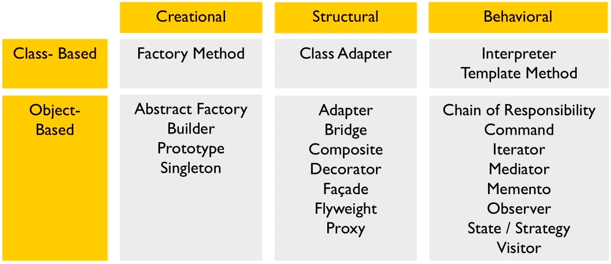
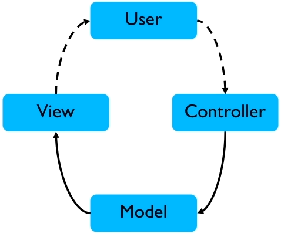
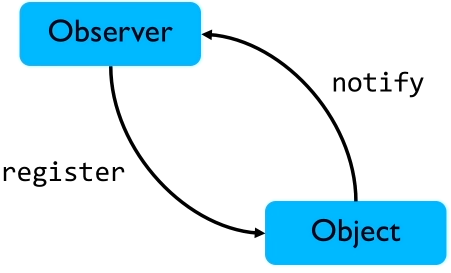
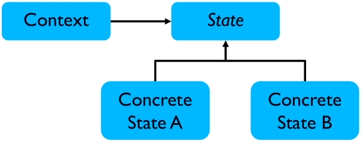

# Modern C++ Design Patterns

[toc]

patterns and idioms

## What is a Pattern

A design pattern is

- a tested solution to a recurring problem in a particular context

Patterns encode best practices

A shared language between developers; avoid common pitfalls

The Gang of Four: 23 patterns



## Some common patterns

- MVC; decouple UI, many variations e.g. MVVC

- State; represent changing object state; removes 'if' chains; related to 'Strategy' pattern

- Singleton; one instance of a type; harder to implement in C++

- Observer; notification of state changes; implemented in many frameworks

  



## What is an idiom

different from patterns, idioms are language or platform specific and are code-level, e.g. pointers and templates in C++

C++ Idioms

- RAII
- PIMPL: pointer to implementation; decouple implementation from use (state interface); improve compilation
- Smart pointers; overload ->
- CTRP: curiously recurring template pattern; *static polymorphism*; removes need for virtual functions

note: there is no one correct way to implement patterns; and patterns work together

## Implementing Patterns

### RAII

```c++
 #include <iostream>
#include <mutex>
#include <exception>

class Lock {
  private:
    std::mutex& mtx;
  public:
    Lock(std::mutex& m): mtx{m} {
        std::cout << "Locking" << std::endl;
        mtx.lock();
    }
    ~Lock() {
        std::cout << "Unlocking" << std::endl;
        mtx.unlock();
    }
};

int main() {

    std::mutex mt;
    std::cout << "Starting..." << std::endl;
    try {
        Lock l(mt);
        std::cout << "Doing stuff" << std::endl;
        throw std::exception();
    } catch(...) {
        std::cout << "Exception caught" << std::endl;
    }

    std::cout << "Done" << std::endl;

    return 0;
}
```

The lock is properly unlocked even with exception during execution due to RAII

### Implementing State

State: represent changing object state; object states are classes



consider an example of membership status: free, basic, prime

```c++
#include <iostream>
#include <string>

class Member {
    enum Membership {FREE, BASIC, PREMIUM};
    Membership type;

    int current_downloads;
    std::string name;
  public:
    Member(const std::string& n): name{n}, type(FREE), current_downloads{0} {}

    void upgrade() {
        switch (type) {
        case FREE:
            std::cout << "Free, upgrading to basic" << std::endl;
            type = BASIC;
            break;
        case BASIC:
            std::cout << "Basic, upgrading to premium" << std::endl;
            type = PREMIUM;
            break;
        case PREMIUM:
            std::cout << "You are at the highest level!" << std::endl;
            break;
        }
    }

    bool can_download() {
        switch (type) {
        case FREE:
            return current_downloads < 1;
            break;
        case BASIC:
            return current_downloads < 5;
            break;
        case PREMIUM:
            return true;
            break;
        }
    }
};
```

before using the State pattern, there are many switch cases

```c++
class Membership {
    std::string _name;
  public:
    Membership(const std::string& name): _name{name} {}
    const std::string& name() {
        return _name;
    }
    virtual int download_per_day() const = 0;
    virtual Membership* upgrade() const = 0;
};

class PremiumMember: public Membership {
  public:
    PremiumMember(): Membership("Premium") {}
    int download_per_day() const override {
        return 100;
    }

    virtual Membership * upgrade() const override {
        std::cout << "You are at the highest level" << std::endl;
        return this;
    }
};

class BasicMember: public Membership {
  public:
    BasicMember(): Membership("Basic") {}
    int download_per_day() const override {
        return 5;
    }
    virtual Membership * upgrade() const override {
        std::cout << "Basic, upgrade to premium" << std::endl;
        return new PremiumMember();
    }
};

class FreeTier: public Membership {
  public:
    FreeTier(): Membership("Free") {}
    int download_per_day() const override {
        return 1;
    }

    virtual Membership * upgrade() const override {
        std::cout << "Free, upgrade to basic" << std::endl;
        return new BasicMember();
    }
};

class Member {
    Membership* _role;
    std::string _name;
    int current_downloads;
  public:
    Member(const std::string& name): _name{name}, current_downloads{0}, _role{new FreeTier()} {}
    const std::string& name() {
        return _name;
    };
    bool can_download() const {
        return (_role->download_per_day() - current_downloads) > 0;
    }

    bool download() {
        if (can_download()) {
            ++current_downloads;
            return true;
        }
        return false;
    }
    void upgrade() {
        _role->upgrade();
    }

};
```

### Implementing PIMPL

similar to state, strategy pattern

```c++
class Container {
    Container(const Container& other);  // traditional way of non-copyable, as private
    Container& operator= (const Container& other);

    class Impl;  // forward declaration of implementation
    Impl* _impl;  // pointer to Implementation
  public:
    Container(const size_t size);
    int& operator[] (const int index);
    const int& operator[] (const int index) const;
};

class Container::Impl {
  public:
    Impl(const size_t size) {
        vec.resize(size);
    }

    std::vector<int> vec;
};

// Implementation of outer class
Container::Container(const size_t size): _impl(new Impl(size)) {}

int& Container::operator[](const int index) {
    return _impl->vec[index];
}

const int& Container::operator[](const int index) const {
    return _impl->vec[index];
}


int main() {

    Container c(10);
    c[3] = 7;
    
    std::cout << c[3] << std::endl;

    return 0;
}
```

### Implementing Smart Pointer

rarely see raw pointers in modern C++; Overload ->; manage resources, the concept of resources can be broad

its the responsibility of the developer to release the resources with the raw pointer

```c++
class Ptr<T> {
    T* p;
  public:
    //...
    T* operator->() const {
        return p;
    }
};
```

```c++
class Resource {
  public:
    Resource() {
        std::cout << "Creating Resource" << std::endl;
    }
    ~Resource() {
        std::cout << "Destroying Resource" << std::endl;
    }
    void do_something() {
        std::cout << "Doing something" << std::endl;
    }
};

template <typename T>
class Ptr {
    T* _ptr;

    // prevent copying
    Ptr(const Ptr& other);
    Ptr& operator=(const Ptr& other);
  public:
    explicit Ptr(T* p = 0): _ptr(p) {}
    ~Ptr() {
        delete _ptr;
    }

    T* operator->() const {
        return _ptr;
    }
    T& operator*() const {
        return *_ptr;
    }
};

int main() {

    Ptr<Resource> pr(new Resource());
    pr->do_something();

    return 0;
}

// output
//Creating Resource
//Doing something
//Destroying Resource
```

The Resource will be automatically released

Don't need to re-invent the wheel by creating your own smart pointers; code smell

```c++
template <typename T>
class Ptr2 {
    T* _ptr;

    Ptr2(const Ptr2& other);
    Ptr2& operator=(const Ptr2&);
  public:
    explicit Ptr2(T* p = 0): _ptr(p) {}
    ~Ptr2() {
        delete _ptr;
    }

    T* operator->() {
        // lazy initialization
        if (!_ptr)
            _ptr = new T();
        return _ptr;
    }

    T& operator*() {
        if (!_ptr)
            _ptr = new T();
        return *_ptr;
    }

};
```

Lazy initialization: create when needed

### Implementing CRTP

Curiously recurring template pattern

- static polymorphism
- removes need for virtual functions

```c++
class B<T> {};
class D:
	public B<D> {};
```

*It does this by defining a templated base class that uses a derived class as it's templated parameter*.

```c++
class Base {
  protected:
    virtual int get_value() const = 0;
  public:
    virtual ~Base() {}
    int return_data() const {
        return this->get_value();
    }
};

class Derived : public Base {
  private:
    int get_value() const override {
        return 10;
    }
};

int main() {

    Base* t = new Derived();
    std::cout << t->return_data() << std::endl;

    delete t;
    return 0;
}
```

Polymorphism is typically implemented using virtual functions. there is a run-time cost in using virtual functions, which may be prohibitive in low-latency applications. We can use CRTP to avoid the over-head of using virtual functions.

```c++
// CRTP
template <typename D>
class Base2 {
  public:
    D& derived() {
        return static_cast<D&>(*this);
    }
    int return_data() {
        return derived().get_value();
    }
};
class Derived2 : public Base2<Derived2> {
  public:
    int get_value() const {
        return 100;
    }
};

int main() {

    Base2<Derived2> b2;
    std::cout << b2.return_data() << std::endl;

    return 0;
}
```

we can see there is no virtual function and much less going on in the assembly code.

### Implementing Singleton

different ways to implement it in C++ and C++ specific issues

the traditional implementation:

```c++
class NaiveSingleton {
  private:
    static NaiveSingleton* _instance;

    NaiveSingleton() {};  // private default constructor
    NaiveSingleton(const NaiveSingleton&);  // prevent copying
    NaiveSingleton& operator= (const NaiveSingleton&);
  public:
    static NaiveSingleton* instance() {
        if (!_instance)
            _instance = new NaiveSingleton();
        return _instance;
    }

    void do_it() const {
        std::cout << "doing it" << std::endl;
    }
};

NaiveSingleton* NaiveSingleton::_instance = nullptr;
```

This works but not thread safe. There is possible racing condition between the check of _instance and the creation

A common fix for this is the "double check locking" mechanism

```c++
class DCLSingleton {
  private:
    static DCLSingleton* _instance;

    DCLSingleton() {};  // private default constructor
    DCLSingleton(const DCLSingleton&);  // prevent copying
    DCLSingleton& operator= (const DCLSingleton&);
    static std::mutex mtx;
  public:
    static DCLSingleton* instance() {
        if (!_instance) {    // first check
            mtx.lock();      // acquire lock
            if (!_instance)  // second check
                _instance = new DCLSingleton();
            mtx.unlock();
        }
        return _instance;
    }

    void do_it() const {
        std::cout << "doing it" << std::endl;
    }
};

std::mutex DCLSingleton::mtx;
DCLSingleton* DCLSingleton::_instance = nullptr;

int main() {

    DCLSingleton* inst = DCLSingleton::instance();
    inst->do_it();

    return 0;
}
```

This works but unfortunately, this is broken in C++ prior to C++11; modern complier can and do re-order constructions; memory model to support the concurrency library

One more implementation is from Scott Meyer

```c++

class MeyerSingleton {
  private:
    MeyerSingleton() {};  // prevent construction and copyying
    MeyerSingleton(const MeyerSingleton&);
    MeyerSingleton& operator= (const MeyerSingleton&);

  public:
    static MeyerSingleton& instance() {
        static MeyerSingleton _instance;
        return _instance;
    }

    void do_it() const {
        std::cout << "doing it" << std::endl;
    }
};

int main() {

    MeyerSingleton& inst2 = MeyerSingleton::instance();
    inst2.do_it();

    return 0;
}
```

This uses a static instance inside a function, which is initialized at the first call and dies after leaves the program.  This implementation returns an reference rather than pointer to the singleton

However, this is not completely safe. The order of destruction of static reference may ends with a dangling reference.

C++ specific issues:

- lifetime; when to destroy
- inheritance
- multiple threads

## Modern C++ Features

### Introduction

C++11 and 3 year release cycle

C++11 features

- Constructors
  - Delegating constructors
  - Inheriting constructors
- Members
  - Defaulted members
  - Deleted members
- Initialization
  - Uniform initialization
  - Initialization lists
- Rvalues
  - Rvalue reference
  - Move semantics
- Conversions
  - Explicit conversions
- Inferences
  - Type inference: auto
  - decltype
- Lambdas (anonymous functions)
- Range for
- nullptr
- constexpr
- static_assert
  - static_assert
  - Type traits
- Templates
  - Variadic templates
  - Template aliases

### Range-for

iterate over containers (arrays, strings, STL containers). Can work with custom types and no off-by-one errors

### Smart Pointers

```c++
#include <memory>
std::unique_ptr<int> p1(new int(10));
std::cout << *p1 << std::endl;
```

```c++
#include <cassert>
void func(std::unique_ptr<X> px) {
    //...
}
int main() {
    std::unique_ptr<X> p1(new X(10));
    func(std::move(p1));
    
    assert(p1 == nullptr);
    return 0;
}
```

### Lambdas

anonymous functions, more readable code and much used by STL

can have a little over-header; the lambda will be converted to functional object

```c++
// vector sum
int sum = 0;
std::for_each(v.begin(), v.end(),
             [&sum](int n) { sum += n;});
```

### Move Semantics

R-value references, move semantics, make use of temporaries; reduce construction and copying

```c++
Foo& operator=(Foo&& f) {
    p = f.p;
    f.p = nullptr;
    return *this;
}
```

steal the content directly

### Function and Bind

std::function wraps function-like objects; Function, functors and lambdas;

std::bind binds arguments to a function; returns another std::function

```c++
// simple function
int add(int a, int b) {
    return a+b;
}

// a functor
class Op {
  public:
    int operator() (int a, int b) const {
        return a+b;
    }
};

int main() {
	// simple function
    std::function<int (int, int)> f = add;
    std::cout << f(2, 3) << std::endl;

    // function object
    Op o;
    f = o;
    std::cout << f(2, 4) << std::endl;

    // lambda
    f = [](int a, int b) {
        return a+b;
    };
    std::cout << f(2, 5) << std::endl;

    // binding; create one single-argument function
    std::function<int (int)> add3 = std::bind(add, 3, std::placeholders::_1);
    std::cout << add3(3) << std::endl;  // 3+3=6
    
    return 0;
}
```

### Templates

variadic templates

- type-safe variable argument functions and classes
- also often used for classes
- compiler resolve types at compile time
- can check types

```c++
template<typename T>
T add(T val) {
    return val;
}


template<typename T, typename... Args>
T add(T first, Args... args) {
    return first + add(args...);
}

int main() {

    std::cout << add(1, 2, 3) << std::endl;

    std::cout << add(std::string("ab"), std::string("cd")) << std::endl;

    return 0;
}
// output
// 6
// abcd
```

notice the above code is not recursion

## Functional Programming

### Introduction

functional programming is supported by functional languages, but it is possible to program in a functional style in C++.

OO limitations

- not good at composing algorithms
- OO data structures are often slow
- OO doesn't handle concurrency well

### Principles of Functional programming

- functions at data (pass as arguments, return as results, functions used as building blocks)
- std::function, std::bind

Immutable Data

- Once created, data doesn't change
- Strings in Java, C#
- Helps with concurrency, reasoning

No Side Effects

- function evaluation affects nothing else
- pure functions; pure core + impure I/O, error handling

Always the same result

- same arguments => same result
- results can be cached
- concurrent

Lay evaluation

- don't evaluate something until you need it

Recursion

- Cornerstone of functional programming
- works with immutability
- natural way to express many algorithms
- tail recursion avoids blowing the stack - convert recursion to loops

### Higher Order Operations

**Filter** (abstract of selection)

- select elements from a sequence using a predicate

**Map ** (abstract of transforming)

- apply an operation to each element
- results in a  new sequence

**Reduce** (abstract of combing)

- combine elements into a single value

### Functional C++

Use STL and standard algorithms; use immutable data and pure functions

Exceptions aren't functional - should always return; not throw it

C++17 introduces optional<T>, may or may not return a value

## Patterns Revisited

- RAII
- PIMPL
- Observer
- Functional Idioms
- Functional error handing

### Implementing RAII

using smart pointers instead of raw pointers

### Implementing PIMPL

use unique_ptr to implementation as Herber recommended

### Implementing Observer

basis of even-driven system;

- subject registers a callback
- observer handles notification

### Implementing Functional Operations

- Filter
- Map
- Reduce

Functional Error Handling

- Don't throw exceptions
- Always return a value
- Handle the exception when you want

## Conclusion

- Design patterns and idioms
- Implementation in C++
- C++11/14 features
- Functional programming
- Modern implementation

read good code and get your code reviewed

codereview.stackexchange.com


## How to write SOLID C++

SOLID applies to any object-oriented design, and the SOLID principle can also form a core philosophy for agile development; solid results in testable code

- Single responsibility
  - responsibility over a single purpose
  - the class should only have one "reason" to change
- Open/closed
  - open for extension, closed for modification
  - add new functionality without having to change existing codes
- Liskov substitution
  - a subclass should satisfy not only the syntactic but also the behavioral expectations of the parents
  - the behavior of the various children of a class should be consistent
- Interface segregation
  - No one should depend on methods they do not use
  - Multiple single-purpose interfaces are better than one multi-interfaces
- Dependency inversion
  - high-level modules should not depend on low-level modules, both should depend on abstractions (don't depend on implementation tightly, but instead depend on interface loosely)
  - abstractions should not depend on, or leak, details from the implementation domain


