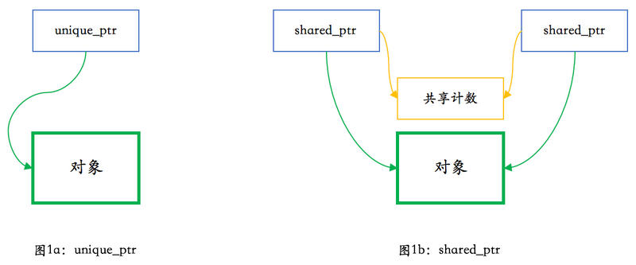
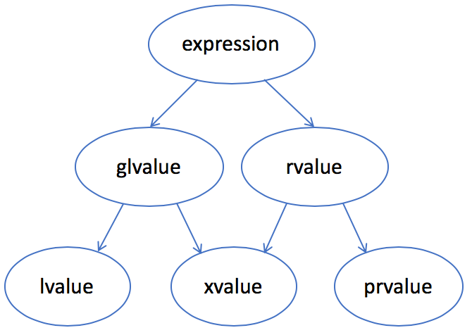

# 现代C++实战30讲

[toc]

## 0. 开篇

### C++这么难，为什么我们还要用C++

专栏主要讲C++之后的新特性以及相关的编程实践。

#### C++的意义

多范式的通用编程语言，面向过程、面向对象、泛型编程，新版本可以认为支持函数式编程。C++ 适用的领域非常广泛，小到嵌入式，大到分布式服务器，到处可以见到 C++ 的身影。

一些著名的用到 C++ 的场合：

- 大型桌面应用程序（如 Adobe Photoshop、Google Chrome 和 Microsoft Office）
- 大型网站后台（如 Google 的搜索引擎）
- 游戏（如 StarCraft）和游戏引擎（如 Unreal 和 Unity）
- 编译器（如 LLVM/Clang 和 GCC）
- 解释器（如 Java 虚拟机和 V8 JavaScript 引擎）
- 实时控制（如战斗机的飞行控制和火星车的自动驾驶系统）
- 视觉和智能引擎（如 OpenCV、TensorFlow）
- 数据库（如 Microsoft SQL Server、MySQL 和 MongoDB）

有些传统上使用 C++ 的场合现在已经不一定使用 C++，最典型的是个人电脑上的桌面应用。MFC已死；目前很流行的 Visual Studio Code 主要是用 TypeScript 写的，不是 C++。典型情况是，需要性能的组件用 C++ 来写，整个应用程序融合多种不同的语言（比如C#+C++）。

语言竞争激烈：

- 如果专注性能和最小内存占用的话，C 仍然是首选——嵌入式领域用 C 非常多，而 Linux 也是用纯 C 写的。
- 如果专注抽象表达和可读性的话，那 Python 之类的脚本语言则要方便得多。
- 图形界面（GUI）编程传统上是 C++ 的地盘，但近年来 C# 和 JavaScript 占领了很大一部分市场。
- 游戏算是 C++ 的经典强项了，但有了 C++ 写的游戏引擎，游戏用 C# 写也没啥问题了——你可能不一定知道，Unity 游戏引擎上的首选开发语言是 C#，而王者荣耀是用什么游戏引擎呢？答案正是 Unity——所以王者荣耀可以认为是用 C# 开发的。
- 还有，Go 和 Rust 也加入了战团，对 C++ 形成了一定的竞争……

C++的核心竞争力

- 抽象能力：意味着较高的开发效率，同时，更重要的是，不会因抽象而降低性能。
- 性能：这不用多说了，就是快并且占用资源少。
- 功耗：这是近年来我们越来越关注的问题，跟性能直接相关，性能好了功耗自然就低。

即使主流移动平台的开发语言不是 C++—而是 Java 和 Objective-C 或 Swift—但任何性能要求高的应用，都几乎必然会用到 C++ 开发的组件。

在服务器集群，C++的使用非常广泛

王者荣耀的客户端是用 Unity + C# 开发的，但王者荣耀的服务器端——那可还是用 C++  开发的。另外，有一点我前面还藏着呢！虽然王者荣耀初期是纯用 Unity 开发的，没有用到 C++；但后来，腾讯又用 C++  把游戏的逻辑部分独立成了一个 GameCore，进一步提高了性能。

跟 C++ 定位差不多、能有直接竞争关系的，也就是既支持高度抽象、又追求高性能的通用编程语言，其实只有 Rust 一种。而 Rust 远没有达到跟 C++ 一样的成熟和普及程度。

和 C 的兼容性，也是 C++ 的一大优势。虽然现在很多大型程序都混杂了多种语言，但在小项目里，减少语言的数量可以简化开发和部署。前不久，我在  Python 里做了一些加解密运算，发现使用的第三方库性能仍不够高，虽然它已经用了 C 开发的加解密引擎。所以，我找了用 C 写的高性能加解密代码，然后使用 pybind11 库，只手写了一百来行的 C++11 代码，就把性能又提高了几倍。（C++ + Pybind11 + Python绝配）

#### 什么时候该用C++

C++ 一直与 C 基本保持了向后兼容性，这种兼容性，也一直是 C++ 的安全性和易用性方面的负担。我的个人经验，完成同样的功能，C++ 需要的代码行数一般是 Python 的三倍左右，而性能则可以达到 Python 的十倍以上。

问题：**在开发上额外付出的时间，能从性能上省回来吗？**

简言之，当你的软件属于运算密集或者内存密集型，你需要性能、且愿意为性能付出额外代价的时候，应该考虑用 C++，特别在你的代码需要部署在多台服务器或者移动设备的场合。反之，如果性能不会成为你开发的软件的瓶颈，那 C++ 可能就不是一个最合适的工具。

在嵌入式应用的场景，那就根本不是值不值、而是行不行的问题。如果程序完成一个功能不能在指定的若干毫秒、甚至微秒内完成，那产品根本是失败、不可用的。在这种场合，能和 C++ 竞争的只有 C，但 C 是一种开发效率更低、更需要堆人力的语言了。在嵌入式开发使用 C++  的最大障碍可能不是技术，而是人力资源——搞嵌入式开发的程序员可能大多都习惯使用纯 C 了。

**C++ 是解决性能问题的利器，短时间里在市场上没有真正的竞争对手**

#### 如何学习C++

 C++ 的每一个新标准都是让语言从定义和规则的角度变得更复杂，但从用法上来说，新标准允许人们能够更简单地表达自己的计算意图。跟学外语一样，我们需要的是*多看多写*，掌握合适的“语感”，而不是记住所有的规则。


做无人驾驶感知系统的开发，尽管快速原型可以用python或者Matlab，但C++几乎是上车的唯一选择，就是因为它兼顾了强大的抽象能力、丰富的表达方式和高性能，尤其是汽车行业计算资源就是嵌入式设备…


对在 Windows 上使用 GCC 的开发者，我要特别提醒一句：要获得最全面的功能，你应当使用 MinGW-w64 的 POSIX 线程版本，这样才能完整使用 C++ 标准里的功能。

编译器命令行

```bash
# gcc
g++ -std=c++17 -W -Wall -Wfatal-errors 文件名
# clang
clang++ -std=c++17 -W -Wall -Wfatal-errors 文件名
# MSVC
cl /std:c++17 /EHsc /W3 文件名
```

适合阅读的开源项目, LLVM的libc++可读性是相当好的

## 1. 基础篇

### 01-堆、栈、RAII：C++里该如何管理资源？

#### 基本概念

堆 heap，在内存管理的语境下，指的是动态分配内存的区域。跟数据结构里的堆不是回事。

C++标准里一个相关的概念是自由存储区 free store，特质使用new，delete来分配和释放内存的区域。一般而言，这是堆的一个子集

- new delete操作的区域是free store
- malloc free操作的区域是heap

 `new` 和 `delete` 通常底层使用 `malloc` 和 `free` 来实现，所以 free store 也是 heap。鉴于对其区分的实际意义并不大

栈 stack，在内存管理的语境下，指的是函数调用过程中产生的本地变量和调用数据的区域。这个栈和数据结构里的栈高度相似，都LIFO

RAII 是 C++ 所特有的资源管理方式。主流的编程语言中， C++ 是唯一一个依赖 RAII 来做资源管理的。

#### 堆

从现代编程的角度来看，使用堆，或者说使用动态内存分配，是一件再自然不过的事情了.

```c++
// C++
auto ptr = new std::vector<int>();
// Java
ArrayList<int> list = new ArrayList<int>();
// Python
lst = list()
```

至今仍有很多场合会禁用动态内存，尤其在实时性要求比较高的场合，如飞行控制器和电信设备。

在堆上分配内存，有些语言可能使用 `new` 这样的关键字，有些语言则是在对象的构造时隐式分配，不需要特殊关键字。不管哪种情况，程序通常需要牵涉到三个可能的内存管理器的操作：

1. 让内存管理器分配一个某个大小的内存块
2. 让内存管理释放一个之前分配的内存块
3. 让内存管理器进行垃圾收集操作，寻找不在使用的内存块并予以释放

C++ 通常会做上面的操作 1 和 2。Java 会做上面的操作 1 和 3。而 Python 会做上面的操作 1、2、3。这是语言的特性和实现方式决定的。

**上面的三个操作都不简单，并且彼此之间是相关的。**

在不考虑垃圾收集的情况下，内存需要手工释放；在此过程中，内存可能有碎片化的情况。幸运的是，大部分软件开发人员都不需要担心这个问题。内存分配和释放的管理，是内存管理器的任务，一般情况下我们不需要介入。

“内存泄漏”

#### 栈

 C++ 里函数调用、本地变量是如何使用栈的。取决于计算机的实际架构，一般都会使用一个后进先出的结构。

栈是向上增长的。在包括 x86  在内的大部分计算机体系架构中，栈的增长方向是低地址，因而上方意味着低地址。任何一个函数，根据架构的约定，只能使用进入函数时栈指针向上部分的栈空间。当函数调用另外一个函数时，会把参数也压入栈里（我们此处忽略使用寄存器传递参数的情况），然后把下一行汇编指令的地址压入栈，并跳转到新的函数。新的函数进入后，首先做一些必须的保存工作，然后会调整栈指针，**分配出本地变量所需的空间**，随后执行函数中的代码，并在执行完毕之后，根据调用者压入栈的地址，返回到调用者未执行的代码中继续执行。

本地变量所需的内存就在栈上，跟函数执行所需的其他数据在一起。当函数执行完成之后，这些内存也就自然而然释放掉了。我们可以看到：

- 栈上的分配极为简单，移动一下栈指针而已。
- 栈上的释放也极为简单，函数执行结束时移动一下栈指针即可。
- 由于后进先出的执行过程，不可能出现内存碎片。

对于有构造和析构函数的非 POD 类型，栈上的内存分配也同样有效，只不过 C++ 编译器会在生成代码的合适位置，插入对构造和析构函数的调用。

这里尤其重要的是：编译器会自动调用析构函数，包括在函数执行发生异常的情况。在发生异常时对析构函数的调用，还有一个专门的术语，叫栈展开（stack unwinding）。也就是说，不管是否发生了异常，析构函数都会得到执行。

```c++
#include <stdio.h>

class Obj {
public:
  Obj() { puts("Obj()"); }
  ~Obj() { puts("~Obj()"); }
};

void foo(int n)
{
  Obj obj;
  if (n == 42)
    throw "life, the universe and everything";
}

int main()
{
  try {
    foo(41);
    foo(42);  // exception thrown, but descructor still called
  }
  catch (const char* s) {
    puts(s);
  }
}
// output
Obj()
~Obj()
Obj()
~Obj()
life, the universe and everything
```

在 C++ 里，所有的变量缺省都是值语义——如果不使用 `*` 和 `&` 的话，变量不会像 Java 或 Python 一样引用一个堆上的对象。对于像智能指针这样的类型，你写 `ptr->call()` 和 `ptr.get()`，语法上都是对的，并且 `->` 和 `.` 有着不同的语法作用。而在大部分其他语言里，访问成员只用 `.`，但在作用上实际等价于 C++ 的 `->`。这种值语义和引用语义的区别，是 C++ 的特点，也是它的复杂性的一个来源。要用好 C++，就需要理解它的值语义的特点。

#### RAII

在很多情况下，对象不能，或不应该，存储在栈上。比如：

- 对象很大；
- 对象的大小在编译时不能确定；
- 对象是函数的返回值，但由于特殊的原因，不应使用对象的值返回。

常见情况之一是，在工厂方法或其他面向对象编程的情况下，返回值类型是基类。

```c++
enum class shape_type {
  circle,
  triangle,
  rectangle,
  …
};

class shape { … };
class circle : public shape { … };
class triangle : public shape { … };
class rectangle : public shape { … };

shape* create_shape(shape_type type)
{
  …
  switch (type) {
      case shape_type::circle:
        return new circle(…);
      case shape_type::triangle:
        return new triangle(…);
      case shape_type::rectangle:
        return new rectangle(…);
      …
  }
}
```

函数的返回值只能是指针或其变体形式。如果返回类型是 `shape`，实际却返回一个 `circle`，编译器不会报错，但结果多半是错的。这种现象叫对象切片（object slicing），是 C++ 特有的一种编码错误。这种错误不是语法错误，而是一个对象复制相关的语义错误，也算是 C++ 的一个陷阱了。

如何确保在使用create_shape的返回值时不会发生内存泄漏呢？

答案就在析构函数和它的栈展开行为上。我们只需要把这个返回值放到一个本地变量里，并确保其析构函数会删除该对象即可。

```c++
class shape_wrapper {
public:
  explicit shape_wrapper(
    shape* ptr = nullptr)
    : ptr_(ptr) {}
  ~shape_wrapper()
  {
    delete ptr_;
  }
  shape* get() const { return ptr_; }
private:
  shape* ptr_;
};

void foo()
{
  …
  shape_wrapper ptr_wrapper(
    create_shape(…));
  …
}
```

 `delete` 空指针是一个合法的空操作

`new` 的时候先分配内存（失败时整个操作失败并向外抛出异常，通常是 `bad_alloc`），然后在这个结果指针上构造对象；构造成功则 `new` 操作整体完成，否则释放刚分配的内存并继续向外抛构造函数产生的异常。`delete` 时则判断指针是否为空，在指针不为空时调用析构函数并释放之前分配的内存。

在析构函数里做必要的清理工作，这就是 RAII 的基本用法。这种清理并不限于释放内存，也可以是：

- 关闭文件（`fstream` 的析构就会这么做）
- 释放同步锁
- 释放其他重要的系统资源

```c++
// 应该
std::mutex mtx;
void some_func()
{
  std::lock_guard<std::mutex> guard(mtx);
  // 做需要同步的工作
}

// 不应该
std::mutex mtx;
void some_func()
{
  mtx.lock();
  // 做需要同步的工作……
  // 如果发生异常或提前返回，
  // 下面这句不会自动执行。
  mtx.unlock();
}
```

上面的 `shape_wrapper` 差不多就是个最简单的智能指针了

#### 小结

讨论了 C++ 里内存管理的一些基本概念，强调栈是 C++ 里最“自然”的内存使用方式，并且，使用基于栈和析构函数的 RAII，可以有效地对包括堆内存在内的系统资源进行统一管理。


Q：\1. 全局静态和局部静态的变量是存储在哪个区域？看很多书是静态存储区，但静态存储区又是什么区？堆？
\2. thread local的变量存储在哪个区？因为线程是动态创建的，理解这个变量内存也应该动态分配的，线程结束内存自动释放？难道也是堆？
\3. 类的大小是怎么定的呢？一般都是看类的成员变量占用字节数再根据是否虚类看是否加4字节，但是类里面有很多成员函数，这些成员函数不占空间吗，如果有静态成员变量或者静态成员函数呢？

A：

1. 静态存储区既不是堆也不是栈，而是……静态的。意思是，它们是在程序编译、链接时完全确定下来的，具有固定的存储位置（暂不考虑某些系统的地址扰乱机制）。堆和栈上的变量则都是动态的，地址无法确定。
2.  thread_local和静态存储区类似，只不过不是整个程序统一一块，而是每个线程单独一块。用法上还是当成全局/静态变量来用，但不共享也就不需要同步了。
3. 非静态数据成员加上动态类型所需的空间。注意后者不一定是4，而一般是指针的大小，在64位系统上是8字节。还有，要考虑字节对齐的影响。*静态数据成员和成员函数都不占个别对象的空间*。

c++,近两年确实受到很大的冲击。云原生很不容易有个envoy，但是由于c++的复杂性，导致项目没有那么活跃。Go也有它的优点。写网络应用Go还是不错的。好的语言多了，也是C++用得少了些的原因。    


### 02-自己动手，实现C++的智能指针

将 `shape_wrapper` 改造成一个完整的智能指针。智能指针本质上并不神秘，其实就是 RAII 资源管理功能的自然展现而已。

这个类可以完成智能指针的最基本的功能：对超出作用域的对象进行释放。**但它缺了点东西：**

1. 这个类只适用于 `shape` 类
2. 该类对象的行为不够像指针
3. 拷贝该类对象会引发程序行为异常

#### 模板化和易用性

类模板

```c++
template <typename T>
class smart_ptr {
public:
  explicit smart_ptr(T* ptr = nullptr)
    : ptr_(ptr) {}
  ~smart_ptr()
  {
    delete ptr_;
  }
  T* get() const { return ptr_; }
private:
  T* ptr_;
};
```

模板使用也很简单，把原来的 `shape_wrapper` 改成 `smart_ptr<shape>` 就行

```c++
// * dereferencing
// -> pointing to member
// use in boolean expression like a pointer
template <typename T>
class smart_ptr {
public:
  …
  T& operator*() const { return *ptr_; }
  T* operator->() const { return ptr_; }
  operator bool() const { return ptr_; }
}
```

#### 拷贝构造和赋值

在 C++ 里没有像 Java 的 `clone` 方法这样的约定；一般而言，并没有通用的方法可以通过基类的指针来构造出一个子类的对象来。

```c++
template <typename T>
class smart_ptr {
  …
  smart_ptr(smart_ptr& other)
  {
    ptr_ = other.release();
  }
  smart_ptr& operator=(smart_ptr& rhs)
  {
    smart_ptr(rhs).swap(*this);
    return *this;
  }
  …
  T* release()
  {
    T* ptr = ptr_;
    ptr_ = nullptr;
    return ptr;
  }
  void swap(smart_ptr& rhs)
  {
    using std::swap;
    swap(ptr_, rhs.ptr_);
  }
  …
};
```

 `if (this != &rhs)` 的判断的实现，那种用法更啰嗦，而且异常安全性不够好——如果在赋值过程中发生异常的话，this 对象的内容可能已经被部分破坏了，对象不再处于一个完整的状态。

**目前这种惯用法则保证了强异常安全性：**赋值分为拷贝构造和交换两步，异常只可能在第一步发生；而第一步如果发生异常的话，this 对象完全不受任何影响。无论拷贝构造成功与否，结果只有赋值成功和赋值没有效果两种状态，而不会发生因为赋值破坏了当前对象这种场景。- 这实际上时C++98里auto_ptr的定义，已经在C++17里删除了

#### “移动”指针？

```c++
template <typename T>
class smart_ptr {
  …
  smart_ptr(smart_ptr&& other)
  {
    ptr_ = other.release();
  }
  smart_ptr& operator=(smart_ptr rhs)
  {
    rhs.swap(*this);
    return *this;
  }
  …
};
```

改了两个地方：

- 把拷贝构造函数中的参数类型 `smart_ptr&` 改成了 `smart_ptr&&`；现在它成了移动构造函数。
- 把赋值函数中的参数类型 `smart_ptr&` 改成了 `smart_ptr`，在构造参数时直接生成新的智能指针，从而不再需要在函数体中构造临时对象。现在赋值函数的行为是*移动还是拷贝*，完全依赖于构造参数时走的是移动构造还是拷贝构造。

根据 C++ 的规则，如果我提供了移动构造函数而没有手动提供拷贝构造函数，那后者自动被禁用

```c++
smart_ptr<shape> ptr1{create_shape(shape_type::circle)};
smart_ptr<shape> ptr2{ptr1};             // 编译出错
smart_ptr<shape> ptr3;
ptr3 = ptr1;                             // 编译出错
ptr3 = std::move(ptr1);                  // OK，可以
smart_ptr<shape> ptr4{std::move(ptr3)};  // OK，可以
```

这也是 C++11 的 `unique_ptr` 的基本行为。

#### 子类指针向基类指针的转换

一个 `circle*` 是可以隐式转换成 `shape*` 的，但上面的 `smart_ptr<circle>` 却无法自动转换成 `smart_ptr<shape>`。这个行为显然还是不够“自然”。

```c++
  template <typename U>
  smart_ptr(smart_ptr<U>&& other)
  {
    ptr_ = other.release();
  }
```

利用了指针的转换特性：现在 `smart_ptr<circle>` 可以移动给 `smart_ptr<shape>`，但不能移动给 `smart_ptr<triangle>`。不正确的转换会在代码编译时直接报错。

#### 引用计数



多个不同的 `shared_ptr` 不仅可以共享一个对象，在共享同一对象时也需要同时共享同一个计数。当最后一个指向对象（和共享计数）的 `shared_ptr` 析构时，它需要删除对象和共享计数

```c++
class shared_count {
public:
  shared_count() : count_(1) {}
  void add_count()
  {
    ++count_;
  }
  long reduce_count()  // return count
  {
    return --count_;
  }
  long get_count() const
  {
    return count_;
  }

private:
  long count_;
};
```

现在我们可以实现我们的引用计数智能指针了。首先是构造函数、析构函数和私有成员变量：

```c++
template <typename T>
class smart_ptr {
public:
  explicit smart_ptr(T* ptr = nullptr)
    : ptr_(ptr)
  {
    if (ptr) {
      shared_count_ = new shared_count();
    }
  }
  ~smart_ptr()
  {
    if (ptr_ && !shared_count_->reduce_count()) {
      delete ptr_;
      delete shared_count_;
    }
  }

private:
  T* ptr_;
  shared_count* shared_count_;
};
```

构造函数跟之前的主要不同点是会构造一个 `shared_count` 出来。析构函数在看到 `ptr_` 非空时（此时根据代码逻辑，`shared_count` 也必然非空），需要对引用数减一，并在引用数降到零时彻底删除对象和共享计数。原理就是这样，不复杂。

```c++
// 补充细节  
void swap(smart_ptr& rhs)
  {
    using std::swap;
    swap(ptr_, rhs.ptr_);
    swap(shared_count_,
         rhs.shared_count_);
  }

template <typename U>
smart_ptr(const smart_ptr<U>& other)
{
    ptr_ = other.ptr_;
    if (ptr_) {
        other.shared_count_->add_count();
        shared_count_ = other.shared_count_;
    }
}
template <typename U>
smart_ptr(smart_ptr<U>&& other)
{
    ptr_ = other.ptr_;
    if (ptr_) {
        shared_count_ = other.shared_count_;
        other.ptr_ = nullptr;
    }
}
```

上面代码有个问题

错误原因是模板的各个实例间并不天然就有 friend 关系，因而不能互访私有成员 `ptr_` 和 `shared_count_`。我们需要在 `smart_ptr` 的定义中显式声明

```c++
  long use_count() const
  {
    if (ptr_) {
      return shared_count_->get_count();
    } else {
      return 0;
    }
  }
```

测试代码

```c++
class shape {
public:
  virtual ~shape() {}
};

class circle : public shape {
public:
  ~circle() { puts("~circle()"); }
};

int main()
{
  smart_ptr<circle> ptr1(new circle());
  printf("use count of ptr1 is %ld\n", ptr1.use_count());
  smart_ptr<shape> ptr2;
  printf("use count of ptr2 was %ld\n", ptr2.use_count());
  ptr2 = ptr1;
  printf("use count of ptr2 is now %ld\n", ptr2.use_count());
  if (ptr1) {
    puts("ptr1 is not empty");
  }
}
// output
use count of ptr1 is 1
use count of ptr2 was 0
use count of ptr2 is now 2
ptr1 is not empty
~circle()
```

#### 指针类型转换

对应于 C++ 里的不同的类型强制转换：

- static_cast
- reinterpret_cast
- const_cast
- dynamic_cast

智能指针需要实现类似的函数模板。实现本身并不复杂，但为了实现这些转换，我们需要添加构造函数，允许在对智能指针内部的指针对象赋值时，使用一个现有的智能指针的共享计数。

```c++
  template <typename U>
  smart_ptr(const smart_ptr<U>& other,
            T* ptr)
  {
    ptr_ = ptr;
    if (ptr_) {
      other.shared_count_->add_count();
      shared_count_ = other.shared_count_;
    }
  }
```

```c++
template <typename T, typename U>
smart_ptr<T> dynamic_pointer_cast(
  const smart_ptr<U>& other)
{
  T* ptr = dynamic_cast<T*>(other.get());
  return smart_ptr<T>(other, ptr);
}
```

#### 代码列表

一个完整的smart_ptr

```c++
#include <utility>  // std::swap

class shared_count {
public:
  shared_count() noexcept
    : count_(1) {}
  void add_count() noexcept
  {
    ++count_;
  }
  long reduce_count() noexcept
  {
    return --count_;
  }
  long get_count() const noexcept
  {
    return count_;
  }

private:
  long count_;
};

template <typename T>
class smart_ptr {
public:
  template <typename U>
  friend class smart_ptr;

  explicit smart_ptr(T* ptr = nullptr)
    : ptr_(ptr)
  {
    if (ptr) {
      shared_count_ = new shared_count();
    }
  }
  ~smart_ptr()
  {
    printf("~smart_ptr(): %p\n", this);
    if (ptr_ && !shared_count_->reduce_count()) {
      delete ptr_;
      delete shared_count_;
    }
  }

  template <typename U>
  smart_ptr(const smart_ptr<U>& other) noexcept
  {
    ptr_ = other.ptr_;
    if (ptr_) {
      other.shared_count_->add_count();
      shared_count_ = other.shared_count_;
    }
  }
  template <typename U>
  smart_ptr(smart_ptr<U>&& other) noexcept
  {
    ptr_ = other.ptr_;
    if (ptr_) {
      shared_count_ = other.shared_count_;
      other.ptr_ = nullptr;
    }
  }
  template <typename U>
  smart_ptr(const smart_ptr<U>& other,
            T* ptr) noexcept
  {
    ptr_ = ptr;
    if (ptr_) {
      other.shared_count_ ->add_count();
      shared_count_ = other.shared_count_;
    }
  }
  smart_ptr&
  operator=(smart_ptr rhs) noexcept
  {
    rhs.swap(*this);
    return *this;
  }

  T* get() const noexcept
  {
    return ptr_;
  }
  long use_count() const noexcept
  {
    if (ptr_) {
      return shared_count_ ->get_count();
    } else {
      return 0;
    }
  }
  void swap(smart_ptr& rhs) noexcept
  {
    using std::swap;
    swap(ptr_, rhs.ptr_);
    swap(shared_count_, rhs.shared_count_);
  }

  T& operator*() const noexcept
  {
    return *ptr_;
  }
  T* operator->() const noexcept
  {
    return ptr_;
  }
  operator bool() const noexcept
  {
    return ptr_;
  }

private:
  T* ptr_;
  shared_count* shared_count_;
};

template <typename T>
void swap(smart_ptr<T>& lhs,
          smart_ptr<T>& rhs) noexcept
{
  lhs.swap(rhs);
}

template <typename T, typename U>
smart_ptr<T> static_pointer_cast(
  const smart_ptr<U>& other) noexcept
{
  T* ptr = static_cast<T*>(other.get());
  return smart_ptr<T>(other, ptr);
}

template <typename T, typename U>
smart_ptr<T> reinterpret_pointer_cast(
  const smart_ptr<U>& other) noexcept
{
  T* ptr = reinterpret_cast<T*>(other.get());
  return smart_ptr<T>(other, ptr);
}

template <typename T, typename U>
smart_ptr<T> const_pointer_cast(
  const smart_ptr<U>& other) noexcept
{
  T* ptr = const_cast<T*>(other.get());
  return smart_ptr<T>(other, ptr);
}

template <typename T, typename U>
smart_ptr<T> dynamic_pointer_cast(
  const smart_ptr<U>& other) noexcept
{
  T* ptr = dynamic_cast<T*>(other.get());
  return smart_ptr<T>(other, ptr);
}
```

注意noexcept

#### 小结

我们从 `shape_wrapper` 出发，实现了一个基本完整的带引用计数的智能指针。这个智能指针跟标准的 `shared_ptr` 比，还缺了一些东西，但日常用到的智能指针功能已经包含在内。现在，你应当已经对智能指针有一个较为深入的理解了。


### 03-右值和移动究竟解决了什么问题？

#### 值分左右



左值 lvalue 是有标识符、可以取地址的表达式，最常见的情况有：

- 变量、函数或数据成员的名字
- 返回左值引用的表达式，如 `++x`、`x = 1`、`cout << ' '`
- 字符串字面量如 `"hello world"` (?)

在函数调用时，左值可以绑定到左值引用的参数，如 `T&`

反之，纯右值 prvalue 是没有标识符、不可以取地址的表达式，一般也称之为“临时对象”。最常见的情况有：

- 返回非引用类型的表达式，如 `x++`、`x + 1`、`make_shared<int>(42)`
- 除字符串字面量之外的字面量，如 `42`、`true`

由于 C++ 有重载，我们就可以根据不同的引用类型，来选择不同的重载函数，来完成不同的行为。

```c++
smart_ptr(smart_ptr<U>&& other) noexcept
```

使用右值引用的第二个重载函数中的变量 `other` 算是左值还是右值呢？根据定义，`other` 是个变量的名字，变量有标识符、有地址，所以它还是一个左值——虽然它的类型是右值引用。

尤其重要的是，拿这个 `other` 去调用函数时，它匹配的也会是左值引用。也就是说，**类型是右值引用的变量是一个左值！**这点可能有点反直觉，但跟C++的其他方面是一致的。

```c++
smart_ptr<shape> ptr1{new circle()};
smart_ptr<shape> ptr2 = std::move(ptr1);
```

第一个表达式里的 `new circle()` 就是一个纯右值；对于指针，我们通常使用值传递，并不关心它是左值还是右值。

第二个表达式里的 `std::move(ptr)` 就有趣点了。它的作用是*把一个左值引用强制转换成一个右值引用*，而并不改变其内容。从实用的角度，在我们这儿 `std::move(ptr1)` 等价于 `static_cast<smart_ptr<shape>&&>(ptr1)`。因此，`std::move(ptr1)` 的结果是指向 `ptr1` 的一个右值引用，这样构造 `ptr2` 时就会选择上面第二个重载。

请注意，“值类别”（value category）和“值类型”（value  type）是两个看似相似、却毫不相干的术语。前者指的是上面这些左值、右值相关的概念，后者则是与引用类型（reference  type）相对而言，表明一个变量是代表实际数值，还是引用另外一个数值。在 C++ 里，所有的原生类型、枚举、结构、联合、类都代表值类型，只有引用（`&`）和指针（`*`）才是引用类型。在 Java 里，数字等原生类型是值类型，类则属于引用类型。在 Python 里，一切类型都是引用类型。

#### 生命周期和表达式类型

一个变量的生命周期在超出作用域时结束。那临时对象（prvalue）呢？在这儿，C++ 的规则是：一个临时对象会在包含这个临时对象的完整表达式估值完成后、按生成顺序的逆序被销毁，除非有生命周期延长发生。

#### 移动的意义

很关键的一点是，C++ 里的对象缺省都是值语义。

```c++
class A {
  B b_;
  C c_;
};
```

从实际内存布局的角度，很多语言——如 Java 和 Python——会在 `A` 对象里放 `B` 和 `C` 的指针（虽然这些语言里本身没有指针的概念）。而 C++ 则会直接把 `B` 和 `C` 对象放在 `A`  的内存空间里。这种行为既是优点也是缺点。说它是优点，是因为它保证了内存访问的局域性，而局域性在现代处理器架构上是绝对具有性能优势的。说它是缺点，是因为复制对象的开销大大增加：在 Java 类语言里复制的是指针，在 C++ 里是完整的对象。这就是为什么 C++ 需要移动语义这一优化，而 Java  类语言里则根本不需要这个概念。

一句话总结，移动语义使得在 C++ 里返回大对象（如容器）的函数和运算符成为现实，因而可以提高代码的简洁性和可读性，提高程序员的生产率。

所有的现代 C++ 的标准容器都针对移动进行了优化。

#### 如何实现移动

要让你设计的对象支持移动的话，通常需要下面几步：

- 你的对象应该有分开的拷贝构造和移动构造函数（除非你只打算支持移动，不支持拷贝——如 `unique_ptr`）。
- 你的对象应该有 `swap` 成员函数，支持和另外一个对象快速交换成员。
- 在你的对象的名空间下，应当有一个全局的 `swap` 函数，调用成员函数 `swap` 来实现交换。支持这种用法会方便别人（包括你自己在将来）在其他对象里包含你的对象，并快速实现它们的 `swap` 函数。
- 实现通用的 `operator=`。
- 上面各个函数如果不抛异常的话，应当标为 `noexcept`。这对移动构造函数尤为重要。

operator=成员函数，为了避免surprise，通常我们需要将其实现成对 `a = a;` 这样的写法安全。下面的写法算是个小技巧，对传递左值和右值都有效，而且规避了 `if (&rhs != this)` 这样的判断。

```c++
  smart_ptr&
  operator=(smart_ptr rhs) noexcept
  {
    rhs.swap(*this);
    return *this;
  }
```

#### 不要返回本地变量的引用

从 C++11 开始，返回值优化仍可以发生，named return value optimization，或 NRVO），能把对象直接构造到调用者的栈上。但在没有返回值优化的情况下，编译器将试图把本地对象移动出去，而不是拷贝出去。这一行为不需要程序员手工用 `std::move` 进行干预——使用`std::move` 对于移动行为没有帮助，反而会影响返回值优化。

#### 引用坍缩和完美转发

一个略复杂、但又不得不讲的话题，引用坍缩（又称“引用折叠”）。这个概念在泛型编程中是一定会碰到的。

一个实际的类型 `T`，它的左值引用是 `T&`，右值引用是 `T&&`。那么：

1. 是不是看到 `T&`，就一定是个左值引用？
2. 是不是看到 `T&&`，就一定是个右值引用？

对于前者的回答是“是”，对于后者的回答为“否”。

关键在于，在有模板的代码里，对于类型参数的推导结果可能是引用。

要点是：

- 对于 `template <typename T> foo(T&&)` 这样的代码，如果传递过去的参数是左值，`T` 的推导结果是左值引用；如果传递过去的参数是右值，`T` 的推导结果是参数的类型本身。
- 如果 `T` 是左值引用，那 `T&&` 的结果仍然是左值引用——即 `type& &&` 坍缩成了 `type&`。
- 如果 `T` 是一个实际类型，那 `T&&` 的结果自然就是一个右值引用。

事实上，很多标准库里的函数，连目标的参数类型都不知道，但我们仍然需要能够保持参数的值类别：左值的仍然是左值，右值的仍然是右值。这个功能在 C++ 标准库中已经提供了，叫 `std::forward`。它和 `std::move` 一样都是利用引用坍缩机制来实现。


#### 小结

介绍了 C++ 里的值类别，重点介绍了临时变量、右值引用、移动语义和实际的编程用法。由于这是 C++11 里的重点功能，你对于其基本用法需要牢牢掌握。

Q: 现在C++的应用范围貌似越来越窄，以前可能很多后台会用到，但是现在貌似后台都是go和java多一些，真正追求性能极致的貌似不多，现在也就一些人工智能方面和嵌入式方面会用到，但也是少数，真正要做一个深度学习框架的也不太多，即便是大企业也是个别几个部门，作为一个C++程序员比较迷茫，感觉这条路比较窄，未来的路怎么走呢？

把C++当作一种工具，也当作一种锻炼思维的方式，不要把它当成非用不可的圣器。把自己定位成“程序员”，而不是“C++程序员”。职业的将来方向定位成“软件架构师”、“开发主管”、“CTO”之类的角色，而不是“高级C++程序员”。

该用其他语言的时候用其他语言。要看到，即使不用C++，C++程序员在对优化的理解、对内存管理的理解等方面都是具有很大优势的。


### 04-容器汇编I：比较简单的若干容器

[xeus-cling](https://github.com/jupyter-xeus/xeus-cling)，它的便利性无与伦比——你可以直接在浏览器里以交互的方式运行代码，不需要本机安装任何编译器，try on binder

#### string

`string` 一般并不被认为是一个 C++ 的容器。`string` 是模板 `basic_string` 对于 `char` 类型的特化，可以认为是一个只存放字符 `char` 类型数据的容器。“真正”的容器类与 `string` 的最大不同点是里面可以存放任意类型的对象。

C++ 的 `begin` 和 `end` 是半开半闭区间：在容器非空时，`begin` 指向一个第一个元素，而 `end` 指向最后一个元素后面的位置；在容器为空时，`begin` 等于 `end`。

推荐你在代码中尽量使用 `string` 来管理字符串。不过，对于对外暴露的接口，情况有一点复杂。我一般不建议在接口中使用 `const string&`，除非确知调用者已经持有 `string`：如果函数里不对字符串做复杂处理的话，使用 `const char*` 可以避免在调用者只有 C 字符串时编译器自动构造 `string`，这种额外的构造和析构代价并不低。反过来，如果实现较为复杂、希望使用 `string` 的成员函数的话，那就应该考虑下面的策略：

- 如果不修改字符串的内容，使用 `const string&` 或 C++17 的 `string_view` 作为参数类型。后者是最理想的情况，因为即使在只有 C 字符串的情况，也不会引发不必要的内存复制。
- 如果需要在函数内修改字符串内容、但不影响调用者的该字符串，使用 `string` 作为参数类型（自动拷贝）。
- 如果需要改变调用者的字符串内容，使用 `string&` 作为参数类型（通常不推荐）。

#### vector

动态数组更为合适。它基本相当于 Java 的 `ArrayList` 和 Python 的 `list`。

可以使用 `data` 来获得指向其内容的裸指针（同 `string`）

留意一下 `push_…` 和 `pop_…` 成员函数。它们存在时，说明容器对指定位置的删除和插入性能较高。`vector` 适合在尾部操作，这是它的内存布局决定的。只有在尾部插入和删除时，其他元素才会不需要移动，除非内存空间不足导致需要重新分配内存空间。

`push_back`、`insert`、`reserve`、`resize` 等函数导致内存重分配时，或当 `insert`、`erase` 导致元素位置移动时，`vector` 会试图把元素“移动”到新的内存区域。`vector` 通常保证强异常安全性，如果元素类型没有提供一个**保证不抛异常的移动构造函数**，`vector` 通常会使用拷贝构造函数。因此，对于拷贝代价较高的自定义元素类型，我们应当定义移动构造函数，并标其为 `noexcept`，或只在容器中放置对象的智能指针。这就是为什么我之前需要在 `smart_ptr` 的实现中标上 `noexcept` 的原因。

C++11 开始提供的 `emplace…` 系列函数是为了提升容器的性能而设计的。对于 `vector` 里的内容，结果是一样的；但使用 `push_back` 会额外生成临时对象，多一次拷贝构造和一次析构。

现代处理器的体系架构使得对连续内存访问的速度比不连续的内存要快得多。因而，`vector` 的连续内存使用是它的一大优势所在。当你不知道该用什么容器时，缺省就使用 `vector` 吧。

`vector` 的一个主要缺陷是大小增长时导致的元素移动。如果可能，尽早使用 `reserve` 函数为 `vector` 保留所需的内存，这在 `vector` 预期会增长很大时能带来很大的性能提升。

#### deque

double-ended queue，双端队列

`deque` 的接口和 `vector` 相比，有如下的区别：

- `deque` 提供 `push_front`、`emplace_front` 和 `pop_front` 成员函数。
- `deque` 不提供 `data`、`capacity` 和 `reserve` 成员函数。

布局特性：

- 如果只从头、尾两个位置对 `deque` 进行增删操作的话，容器里的对象永远不需要移动。
- 容器里的元素只是部分连续的（因而没法提供 `data` 成员函数）。
- 由于元素的存储大部分仍然连续，它的遍历性能是比较高的。
- 由于每一段存储大小相等，`deque` 支持使用下标访问容器元素，大致相当于 `index[i / chunk_size][i % chunk_size]`，也保持高效。

#### list

`list` 在 C++ 里代表双向链表。和 `vector` 相比，它优化了在容器中间的插入和删除：

- `list` 提供高效的、O(1) 复杂度的任意位置的插入和删除操作。
- `list` 不提供使用下标访问其元素。
- `list` 提供 `push_front`、`emplace_front` 和 `pop_front` 成员函数（和 `deque` 相同）。
- `list` 不提供 `data`、`capacity` 和 `reserve` 成员函数（和 `deque` 相同）。

虽然 `list` 提供了任意位置插入新元素的灵活性，但由于每个元素的内存空间都是单独分配、不连续，它的遍历性能比 `vector` 和 `deque` 都要低。这在很大程度上抵消了它在插入和删除操作时不需要移动元素的理论性能优势。

注意标准std空间函数和list成员函数的区别

#### forward_list

单向链表

大部分 C++ 容器都支持 `insert` 成员函数，语义是从指定的位置之前插入一个元素。对于 `forward_list`，这不是一件容易做到的事情。标准库提供了一个 `insert_after` 作为替代。

在元素大小较小的情况下，`forward_list` 能节约的内存是非常可观的；在列表不长的情况下，不能反向查找也不是个大问题。如果你觉得不需要用到它的话，也许你真的不需要它。

#### queue

不是完整的实现，而是依赖于某个现有的容器；容器适配器（container adaptor）

先进先出（FIFO）的数据结构

- 没有 `begin`、`end` 成员函数
- 用 `emplace` 替代了 `emplace_back`，用 `push` 替代了 `push_back`，用 `pop` 替代了 `pop_front`；没有其他的 `push_…`、`pop_…`、`emplace…`、`insert`、`erase` 函数
- 不能按下标访问元素

#### stack

栈 `stack` 是后进先出（LIFO）的数据结构。

`queue` 缺省也是用 `deque` 来实现，但它的概念和 `vector` 更相似。

- 不能按下标访问元素
- 没有 `begin`、`end` 成员函数
- `back` 成了 `top`，没有 `front`
- 用 `emplace` 替代了 `emplace_back`，用 `push` 替代了 `push_back`，用 `pop` 替代了 `pop_back`；没有其他的 `push_…`、`pop_…`、`emplace…`、`insert`、`erase` 函数

一个小细节需要注意。`stack` 跟我们前面讨论内存管理时的栈有一个区别：在这里下面是低地址，向上则地址增大；而我们讨论内存管理时，高地址在下面，向上则地址减小，方向正好相反。

#### 小结

介绍了 C++ 里面的序列容器和两个容器适配器。

Q：为什么 `stack`（或 `queue`）的 `pop` 函数返回类型为 `void`，而不是直接返回容器的 `top`（或 `front`）成员？

A：实现pop时返回元素时，满足强异常安全，代码实现复杂，可读性差。再说两句，这是C++98时设计的接口，没有移动就只能那样。有了移动，在多线程的环境里，移动返回加弹出实际上就变得有用了。我对复杂和可读性部分不那么同意。stack(queue)为保证强异常安全性，如果元素类型没有提供一个保证不抛异常的移动构造函数，  通常会使用拷贝构造函数，而pop作用是释放元素，c++98还没有移动构造的概念，所以如果返回成员，必须要调用拷贝构造函数，这时分配空间可能出错，导致构造失败，要抛出异常，所以没必要返回成员。

### 05-容器汇编II：需要函数对象的容器

#### 函数对象及其特化

两个重要的函数对象，`less` 和 `hash`

在标准库里，通用的 `less` 大致是这样定义的：

```c++
template <typename T>
struct less
    : binary_function<T, T, bool> {
        bool operator()(const T& x,
                        const T& y) const
        {
            return x < y;
        }
    };
```

`less` 是一个函数对象，并且是个二元函数，执行对任意类型的值的比较，返回布尔类型。作为函数对象，它定义了函数调用运算符（`operator()`），并且缺省行为是对指定类型的对象进行 `<` 的比较操作。

这个缺省实现在大部分情况下已经够用，我们不太需要去碰它。在需要大小比较的场合，C++ 通常默认会使用 `less`，包括若干容器和排序算法 `sort`

计算哈希值的函数对象 `hash` 就不一样了。它的目的是把一个某种类型的值转换成一个无符号整数哈希值，类型为 `size_t`。它没有一个可用的默认实现。对于常用的类型，系统提供了需要的特化，类似于：

```c++
template <class T> class hash;

template<>
struct hash<int>
    : public unary_function<int, size_t> {
        size_t operator()(int v) const noexcept
        {
            return static_cast<size_t>(v);
        }
    };
```

更复杂的类型，如指针或者 `string` 的特化，都会更复杂。要点是，对于每个类，类的作者都可以提供 `hash` 的特化，使得对于不同的对象值，函数调用运算符都能得到尽可能均匀分布的不同数值。

```c++
#include <algorithm>  // std::sort
#include <functional> // std::less/greater/hash
#include <iostream>   // std::cout/endl
#include <string>     // std::string
#include <vector>     // std::vector
#include "output_container.h"

using namespace std;

int main()
{
    // 初始数组
    vector<int> v{13, 6, 4, 11, 29};
    cout << v << endl;

    // 从小到大排序
    sort(v.begin(), v.end());
    cout << v << endl;

    // 从小到大排序
    sort(v.begin(), v.end(),
         greater<int>());
    cout << v << endl;

    cout << hex;

    auto hp = hash<int *>();
    cout << "hash(nullptr)  = "
         << hp(nullptr) << endl;
    cout << "hash(v.data()) = "
         << hp(v.data()) << endl;
    cout << "v.data()       = "
         << static_cast<void *>(v.data())
         << endl;

    auto hs = hash<string>();
    cout << "hash(\"hello\")  = "
         << hs(string("hello")) << endl;
    cout << "hash(\"hellp\")  = "
         << hs(string("hellp")) << endl;
}
// output: vscode + gcc 8.1.0
{ 13, 6, 4, 11, 29 }   
{ 4, 6, 11, 13, 29 }   
{ 29, 13, 11, 6, 4 }   
hash(nullptr)  = 0     
hash(v.data()) = 672580
v.data()       = 0x672580
hash("hello")  = 26553298fdbe39c8
hash("hellp")  = 62ca8a73f37cbb7b
```

GCC、Clang 和 MSVC 对常见类型的哈希方式都各有不同。

这两个函数对象的值不重要。我们甚至可以认为，每个 `less`（或 `greater` 或 `hash`）对象都是等价的。关键在于其类型。对于容器也是如此，函数对象的类型确定了容器的行为。

#### priority_queue

`priority_queue` 也是一个容器适配器。它用到了比较函数对象（默认是 `less`）。它和 `stack` 相似，支持 `push`、`pop`、`top` 等有限的操作，但容器内的顺序既不是后进先出，也不是先进先出，而是（部分）排序的结果。在使用缺省的 `less` 作为其 `Compare` 模板参数时，最大的数值会出现在容器的“顶部”。如果需要最小的数值出现在容器顶部，则可以传递 `greater` 作为其 `Compare` 模板参数。

```c++
#include <functional> // std::greater
#include <iostream>   // std::cout/endl
#include <memory>     // std::pair
#include <queue>      // std::priority_queue
#include <vector>     // std::vector
#include "output_container.h"

using namespace std;

int main()
{
    priority_queue<
        pair<int, int>, 		// type of elements _Tp
        vector<pair<int, int>>,  // Type of underlying sequence, defaults to vector<_Tp>.
        greater<pair<int, int>>> // Type of underlying sequence, defaults to vector<_Tp>.
        q;
    q.push({1, 1});
    q.push({2, 2});
    q.push({0, 3});
    q.push({9, 4});
    while (!q.empty())
    {
        cout << q.top() << endl;
        q.pop();
    }
}
// output
(0, 3)
(1, 1)
(2, 2)
(9, 4)
```

#### 关联容器

关联容器有 `set`（集合）、`map`（映射）、`multiset`（多重集）和 `multimap`（多重映射）。跳出 C++ 的语境，`map`（映射）的更常见的名字是关联数组和字典，而在 JSON 里直接被称为对象（object）。在 C++ 外这些容器常常是无序的；在 C++ 里关联容器则被认为是有序的。

关联容器是一种有序的容器。名字带“multi”的允许键重复，不带的不允许键重复。`set` 和 `multiset` 只能用来存放键，而 `map` 和 `multimap` 则存放一个个键值对。

与序列容器相比，关联容器没有前、后的概念及相关的成员函数，但同样提供 `insert`、`emplace` 等成员函数。此外，关联容器都有 `find`、`lower_bound`、`upper_bound` 等查找函数，结果是一个迭代器

如果在声明关联容器时没有提供比较类型的参数，缺省使用 `less` 来进行排序。如果键的类型提供了比较算符 `<` 的重载，我们不需要做任何额外的工作。否则，我们就需要对键类型进行 `less` 的特化，或者提供一个其他的函数对象类型。

对于自定义类型，我推荐尽量使用标准的 `less` 实现，通过重载 `<`（及其他标准比较运算符）对该类型的对象进行排序。存储在关联容器中的键一般应满足严格弱序关系（strict weak ordering）

#### 无序关联容器

`unordered_set`，`unordered_map`，`unordered_multiset`，`unordered_multimap`它们是“无序”的。这些容器不要求提供一个排序的函数对象，而要求一个可以计算哈希值的函数对象。你当然可以在声明容器对象时手动提供这样一个函数对象类型，但更常见的情况是，我们使用标准的 `hash` 函数对象及其特化。

## 2. 提高篇

## 3. 实战篇

## 4. 未来篇


