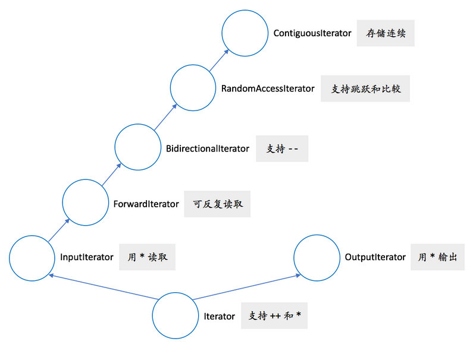

# 现代C++实战30讲

[toc]

## 0. 开篇

### C++这么难，为什么我们还要用C++

专栏主要讲C++之后的新特性以及相关的编程实践。

#### C++的意义

多范式的通用编程语言，面向过程、面向对象、泛型编程，新版本可以认为支持函数式编程。C++ 适用的领域非常广泛，小到嵌入式，大到分布式服务器，到处可以见到 C++ 的身影。

一些著名的用到 C++ 的场合：

- 大型桌面应用程序（如 Adobe Photoshop、Google Chrome 和 Microsoft Office）
- 大型网站后台（如 Google 的搜索引擎）
- 游戏（如 StarCraft）和游戏引擎（如 Unreal 和 Unity）
- 编译器（如 LLVM/Clang 和 GCC）
- 解释器（如 Java 虚拟机和 V8 JavaScript 引擎）
- 实时控制（如战斗机的飞行控制和火星车的自动驾驶系统）
- 视觉和智能引擎（如 OpenCV、TensorFlow）
- 数据库（如 Microsoft SQL Server、MySQL 和 MongoDB）

有些传统上使用 C++ 的场合现在已经不一定使用 C++，最典型的是个人电脑上的桌面应用。MFC已死；目前很流行的 Visual Studio Code 主要是用 TypeScript 写的，不是 C++。典型情况是，需要性能的组件用 C++ 来写，整个应用程序融合多种不同的语言（比如C#+C++）。

语言竞争激烈：

- 如果专注性能和最小内存占用的话，C 仍然是首选——嵌入式领域用 C 非常多，而 Linux 也是用纯 C 写的。
- 如果专注抽象表达和可读性的话，那 Python 之类的脚本语言则要方便得多。
- 图形界面（GUI）编程传统上是 C++ 的地盘，但近年来 C# 和 JavaScript 占领了很大一部分市场。
- 游戏算是 C++ 的经典强项了，但有了 C++ 写的游戏引擎，游戏用 C# 写也没啥问题了——你可能不一定知道，Unity 游戏引擎上的首选开发语言是 C#，而王者荣耀是用什么游戏引擎呢？答案正是 Unity——所以王者荣耀可以认为是用 C# 开发的。
- 还有，Go 和 Rust 也加入了战团，对 C++ 形成了一定的竞争……

C++的核心竞争力

- 抽象能力：意味着较高的开发效率，同时，更重要的是，不会因抽象而降低性能。
- 性能：这不用多说了，就是快并且占用资源少。
- 功耗：这是近年来我们越来越关注的问题，跟性能直接相关，性能好了功耗自然就低。

即使主流移动平台的开发语言不是 C++—而是 Java 和 Objective-C 或 Swift—但任何性能要求高的应用，都几乎必然会用到 C++ 开发的组件。

在服务器集群，C++的使用非常广泛

王者荣耀的客户端是用 Unity + C# 开发的，但王者荣耀的服务器端——那可还是用 C++  开发的。另外，有一点我前面还藏着呢！虽然王者荣耀初期是纯用 Unity 开发的，没有用到 C++；但后来，腾讯又用 C++  把游戏的逻辑部分独立成了一个 GameCore，进一步提高了性能。

跟 C++ 定位差不多、能有直接竞争关系的，也就是既支持高度抽象、又追求高性能的通用编程语言，其实只有 Rust 一种。而 Rust 远没有达到跟 C++ 一样的成熟和普及程度。

和 C 的兼容性，也是 C++ 的一大优势。虽然现在很多大型程序都混杂了多种语言，但在小项目里，减少语言的数量可以简化开发和部署。前不久，我在  Python 里做了一些加解密运算，发现使用的第三方库性能仍不够高，虽然它已经用了 C 开发的加解密引擎。所以，我找了用 C 写的高性能加解密代码，然后使用 pybind11 库，只手写了一百来行的 C++11 代码，就把性能又提高了几倍。（C++ + Pybind11 + Python绝配）

#### 什么时候该用C++

C++ 一直与 C 基本保持了向后兼容性，这种兼容性，也一直是 C++ 的安全性和易用性方面的负担。我的个人经验，完成同样的功能，C++ 需要的代码行数一般是 Python 的三倍左右，而性能则可以达到 Python 的十倍以上。

问题：**在开发上额外付出的时间，能从性能上省回来吗？**

简言之，当你的软件属于运算密集或者内存密集型，你需要性能、且愿意为性能付出额外代价的时候，应该考虑用 C++，特别在你的代码需要部署在多台服务器或者移动设备的场合。反之，如果性能不会成为你开发的软件的瓶颈，那 C++ 可能就不是一个最合适的工具。

在嵌入式应用的场景，那就根本不是值不值、而是行不行的问题。如果程序完成一个功能不能在指定的若干毫秒、甚至微秒内完成，那产品根本是失败、不可用的。在这种场合，能和 C++ 竞争的只有 C，但 C 是一种开发效率更低、更需要堆人力的语言了。在嵌入式开发使用 C++  的最大障碍可能不是技术，而是人力资源——搞嵌入式开发的程序员可能大多都习惯使用纯 C 了。

**C++ 是解决性能问题的利器，短时间里在市场上没有真正的竞争对手**

#### 如何学习C++

 C++ 的每一个新标准都是让语言从定义和规则的角度变得更复杂，但从用法上来说，新标准允许人们能够更简单地表达自己的计算意图。跟学外语一样，我们需要的是*多看多写*，掌握合适的“语感”，而不是记住所有的规则。


做无人驾驶感知系统的开发，尽管快速原型可以用python或者Matlab，但C++几乎是上车的唯一选择，就是因为它兼顾了强大的抽象能力、丰富的表达方式和高性能，尤其是汽车行业计算资源就是嵌入式设备…


对在 Windows 上使用 GCC 的开发者，我要特别提醒一句：要获得最全面的功能，你应当使用 MinGW-w64 的 POSIX 线程版本，这样才能完整使用 C++ 标准里的功能。

编译器命令行

```bash
# gcc
g++ -std=c++17 -W -Wall -Wfatal-errors 文件名
# clang
clang++ -std=c++17 -W -Wall -Wfatal-errors 文件名
# MSVC
cl /std:c++17 /EHsc /W3 文件名
```

适合阅读的开源项目, LLVM的libc++可读性是相当好的

## 1. 基础篇

### 01-堆、栈、RAII：C++里该如何管理资源？

#### 基本概念

堆 heap，在内存管理的语境下，指的是动态分配内存的区域。跟数据结构里的堆不是回事。

C++标准里一个相关的概念是自由存储区 free store，特质使用new，delete来分配和释放内存的区域。一般而言，这是堆的一个子集

- new delete操作的区域是free store
- malloc free操作的区域是heap

 `new` 和 `delete` 通常底层使用 `malloc` 和 `free` 来实现，所以 free store 也是 heap。鉴于对其区分的实际意义并不大

栈 stack，在内存管理的语境下，指的是函数调用过程中产生的本地变量和调用数据的区域。这个栈和数据结构里的栈高度相似，都LIFO

RAII 是 C++ 所特有的资源管理方式。主流的编程语言中， C++ 是唯一一个依赖 RAII 来做资源管理的。

#### 堆

从现代编程的角度来看，使用堆，或者说使用动态内存分配，是一件再自然不过的事情了.

```c++
// C++
auto ptr = new std::vector<int>();
// Java
ArrayList<int> list = new ArrayList<int>();
// Python
lst = list()
```

至今仍有很多场合会禁用动态内存，尤其在实时性要求比较高的场合，如飞行控制器和电信设备。

在堆上分配内存，有些语言可能使用 `new` 这样的关键字，有些语言则是在对象的构造时隐式分配，不需要特殊关键字。不管哪种情况，程序通常需要牵涉到三个可能的内存管理器的操作：

1. 让内存管理器分配一个某个大小的内存块
2. 让内存管理释放一个之前分配的内存块
3. 让内存管理器进行垃圾收集操作，寻找不在使用的内存块并予以释放

C++ 通常会做上面的操作 1 和 2。Java 会做上面的操作 1 和 3。而 Python 会做上面的操作 1、2、3。这是语言的特性和实现方式决定的。

**上面的三个操作都不简单，并且彼此之间是相关的。**

在不考虑垃圾收集的情况下，内存需要手工释放；在此过程中，内存可能有碎片化的情况。幸运的是，大部分软件开发人员都不需要担心这个问题。内存分配和释放的管理，是内存管理器的任务，一般情况下我们不需要介入。

“内存泄漏”

#### 栈

 C++ 里函数调用、本地变量是如何使用栈的。取决于计算机的实际架构，一般都会使用一个后进先出的结构。

栈是向上增长的。在包括 x86  在内的大部分计算机体系架构中，栈的增长方向是低地址，因而上方意味着低地址。任何一个函数，根据架构的约定，只能使用进入函数时栈指针向上部分的栈空间。当函数调用另外一个函数时，会把参数也压入栈里（我们此处忽略使用寄存器传递参数的情况），然后把下一行汇编指令的地址压入栈，并跳转到新的函数。新的函数进入后，首先做一些必须的保存工作，然后会调整栈指针，**分配出本地变量所需的空间**，随后执行函数中的代码，并在执行完毕之后，根据调用者压入栈的地址，返回到调用者未执行的代码中继续执行。

本地变量所需的内存就在栈上，跟函数执行所需的其他数据在一起。当函数执行完成之后，这些内存也就自然而然释放掉了。我们可以看到：

- 栈上的分配极为简单，移动一下栈指针而已。
- 栈上的释放也极为简单，函数执行结束时移动一下栈指针即可。
- 由于后进先出的执行过程，不可能出现内存碎片。

对于有构造和析构函数的非 POD 类型，栈上的内存分配也同样有效，只不过 C++ 编译器会在生成代码的合适位置，插入对构造和析构函数的调用。

这里尤其重要的是：编译器会自动调用析构函数，包括在函数执行发生异常的情况。在发生异常时对析构函数的调用，还有一个专门的术语，叫栈展开（stack unwinding）。也就是说，不管是否发生了异常，析构函数都会得到执行。

```c++
#include <stdio.h>

class Obj {
public:
  Obj() { puts("Obj()"); }
  ~Obj() { puts("~Obj()"); }
};

void foo(int n)
{
  Obj obj;
  if (n == 42)
    throw "life, the universe and everything";
}

int main()
{
  try {
    foo(41);
    foo(42);  // exception thrown, but descructor still called
  }
  catch (const char* s) {
    puts(s);
  }
}
// output
Obj()
~Obj()
Obj()
~Obj()
life, the universe and everything
```

在 C++ 里，所有的变量缺省都是值语义——如果不使用 `*` 和 `&` 的话，变量不会像 Java 或 Python 一样引用一个堆上的对象。对于像智能指针这样的类型，你写 `ptr->call()` 和 `ptr.get()`，语法上都是对的，并且 `->` 和 `.` 有着不同的语法作用。而在大部分其他语言里，访问成员只用 `.`，但在作用上实际等价于 C++ 的 `->`。这种值语义和引用语义的区别，是 C++ 的特点，也是它的复杂性的一个来源。要用好 C++，就需要理解它的值语义的特点。

#### RAII

在很多情况下，对象不能，或不应该，存储在栈上。比如：

- 对象很大；
- 对象的大小在编译时不能确定；
- 对象是函数的返回值，但由于特殊的原因，不应使用对象的值返回。

常见情况之一是，在工厂方法或其他面向对象编程的情况下，返回值类型是基类。

```c++
enum class shape_type {
  circle,
  triangle,
  rectangle,
  …
};

class shape { … };
class circle : public shape { … };
class triangle : public shape { … };
class rectangle : public shape { … };

shape* create_shape(shape_type type)
{
  …
  switch (type) {
      case shape_type::circle:
        return new circle(…);
      case shape_type::triangle:
        return new triangle(…);
      case shape_type::rectangle:
        return new rectangle(…);
      …
  }
}
```

函数的返回值只能是指针或其变体形式。如果返回类型是 `shape`，实际却返回一个 `circle`，编译器不会报错，但结果多半是错的。这种现象叫对象切片（object slicing），是 C++ 特有的一种编码错误。这种错误不是语法错误，而是一个对象复制相关的语义错误，也算是 C++ 的一个陷阱了。

如何确保在使用create_shape的返回值时不会发生内存泄漏呢？

答案就在析构函数和它的栈展开行为上。我们只需要把这个返回值放到一个本地变量里，并确保其析构函数会删除该对象即可。

```c++
class shape_wrapper {
public:
  explicit shape_wrapper(
    shape* ptr = nullptr)
    : ptr_(ptr) {}
  ~shape_wrapper()
  {
    delete ptr_;
  }
  shape* get() const { return ptr_; }
private:
  shape* ptr_;
};

void foo()
{
  …
  shape_wrapper ptr_wrapper(
    create_shape(…));
  …
}
```

 `delete` 空指针是一个合法的空操作

`new` 的时候先分配内存（失败时整个操作失败并向外抛出异常，通常是 `bad_alloc`），然后在这个结果指针上构造对象；构造成功则 `new` 操作整体完成，否则释放刚分配的内存并继续向外抛构造函数产生的异常。`delete` 时则判断指针是否为空，在指针不为空时调用析构函数并释放之前分配的内存。

在析构函数里做必要的清理工作，这就是 RAII 的基本用法。这种清理并不限于释放内存，也可以是：

- 关闭文件（`fstream` 的析构就会这么做）
- 释放同步锁
- 释放其他重要的系统资源

```c++
// 应该
std::mutex mtx;
void some_func()
{
  std::lock_guard<std::mutex> guard(mtx);
  // 做需要同步的工作
}

// 不应该
std::mutex mtx;
void some_func()
{
  mtx.lock();
  // 做需要同步的工作……
  // 如果发生异常或提前返回，
  // 下面这句不会自动执行。
  mtx.unlock();
}
```

上面的 `shape_wrapper` 差不多就是个最简单的智能指针了

#### 小结

讨论了 C++ 里内存管理的一些基本概念，强调栈是 C++ 里最“自然”的内存使用方式，并且，使用基于栈和析构函数的 RAII，可以有效地对包括堆内存在内的系统资源进行统一管理。


Q：\1. 全局静态和局部静态的变量是存储在哪个区域？看很多书是静态存储区，但静态存储区又是什么区？堆？
\2. thread local的变量存储在哪个区？因为线程是动态创建的，理解这个变量内存也应该动态分配的，线程结束内存自动释放？难道也是堆？
\3. 类的大小是怎么定的呢？一般都是看类的成员变量占用字节数再根据是否虚类看是否加4字节，但是类里面有很多成员函数，这些成员函数不占空间吗，如果有静态成员变量或者静态成员函数呢？

A：

1. 静态存储区既不是堆也不是栈，而是……静态的。意思是，它们是在程序编译、链接时完全确定下来的，具有固定的存储位置（暂不考虑某些系统的地址扰乱机制）。堆和栈上的变量则都是动态的，地址无法确定。
2.  thread_local和静态存储区类似，只不过不是整个程序统一一块，而是每个线程单独一块。用法上还是当成全局/静态变量来用，但不共享也就不需要同步了。
3. 非静态数据成员加上动态类型所需的空间。注意后者不一定是4，而一般是指针的大小，在64位系统上是8字节。还有，要考虑字节对齐的影响。*静态数据成员和成员函数都不占个别对象的空间*。

c++,近两年确实受到很大的冲击。云原生很不容易有个envoy，但是由于c++的复杂性，导致项目没有那么活跃。Go也有它的优点。写网络应用Go还是不错的。好的语言多了，也是C++用得少了些的原因。    


### 02-自己动手，实现C++的智能指针

将 `shape_wrapper` 改造成一个完整的智能指针。智能指针本质上并不神秘，其实就是 RAII 资源管理功能的自然展现而已。

这个类可以完成智能指针的最基本的功能：对超出作用域的对象进行释放。**但它缺了点东西：**

1. 这个类只适用于 `shape` 类
2. 该类对象的行为不够像指针
3. 拷贝该类对象会引发程序行为异常

#### 模板化和易用性

类模板

```c++
template <typename T>
class smart_ptr {
public:
  explicit smart_ptr(T* ptr = nullptr)
    : ptr_(ptr) {}
  ~smart_ptr()
  {
    delete ptr_;
  }
  T* get() const { return ptr_; }
private:
  T* ptr_;
};
```

模板使用也很简单，把原来的 `shape_wrapper` 改成 `smart_ptr<shape>` 就行

```c++
// * dereferencing
// -> pointing to member
// use in boolean expression like a pointer
template <typename T>
class smart_ptr {
public:
  …
  T& operator*() const { return *ptr_; }
  T* operator->() const { return ptr_; }
  operator bool() const { return ptr_; }
}
```

#### 拷贝构造和赋值

在 C++ 里没有像 Java 的 `clone` 方法这样的约定；一般而言，并没有通用的方法可以通过基类的指针来构造出一个子类的对象来。

```c++
template <typename T>
class smart_ptr {
  …
  smart_ptr(smart_ptr& other)
  {
    ptr_ = other.release();
  }
  smart_ptr& operator=(smart_ptr& rhs)
  {
    smart_ptr(rhs).swap(*this);
    return *this;
  }
  …
  T* release()
  {
    T* ptr = ptr_;
    ptr_ = nullptr;
    return ptr;
  }
  void swap(smart_ptr& rhs)
  {
    using std::swap;
    swap(ptr_, rhs.ptr_);
  }
  …
};
```

 `if (this != &rhs)` 的判断的实现，那种用法更啰嗦，而且异常安全性不够好——如果在赋值过程中发生异常的话，this 对象的内容可能已经被部分破坏了，对象不再处于一个完整的状态。

**目前这种惯用法则保证了强异常安全性：**赋值分为拷贝构造和交换两步，异常只可能在第一步发生；而第一步如果发生异常的话，this 对象完全不受任何影响。无论拷贝构造成功与否，结果只有赋值成功和赋值没有效果两种状态，而不会发生因为赋值破坏了当前对象这种场景。- 这实际上时C++98里auto_ptr的定义，已经在C++17里删除了

#### “移动”指针？

```c++
template <typename T>
class smart_ptr {
  …
  smart_ptr(smart_ptr&& other)
  {
    ptr_ = other.release();
  }
  smart_ptr& operator=(smart_ptr rhs)
  {
    rhs.swap(*this);
    return *this;
  }
  …
};
```

改了两个地方：

- 把拷贝构造函数中的参数类型 `smart_ptr&` 改成了 `smart_ptr&&`；现在它成了移动构造函数。
- 把赋值函数中的参数类型 `smart_ptr&` 改成了 `smart_ptr`，在构造参数时直接生成新的智能指针，从而不再需要在函数体中构造临时对象。现在赋值函数的行为是*移动还是拷贝*，完全依赖于构造参数时走的是移动构造还是拷贝构造。

根据 C++ 的规则，如果我提供了移动构造函数而没有手动提供拷贝构造函数，那后者自动被禁用

```c++
smart_ptr<shape> ptr1{create_shape(shape_type::circle)};
smart_ptr<shape> ptr2{ptr1};             // 编译出错
smart_ptr<shape> ptr3;
ptr3 = ptr1;                             // 编译出错
ptr3 = std::move(ptr1);                  // OK，可以
smart_ptr<shape> ptr4{std::move(ptr3)};  // OK，可以
```

这也是 C++11 的 `unique_ptr` 的基本行为。

#### 子类指针向基类指针的转换

一个 `circle*` 是可以隐式转换成 `shape*` 的，但上面的 `smart_ptr<circle>` 却无法自动转换成 `smart_ptr<shape>`。这个行为显然还是不够“自然”。

```c++
  template <typename U>
  smart_ptr(smart_ptr<U>&& other)
  {
    ptr_ = other.release();
  }
```

利用了指针的转换特性：现在 `smart_ptr<circle>` 可以移动给 `smart_ptr<shape>`，但不能移动给 `smart_ptr<triangle>`。不正确的转换会在代码编译时直接报错。

#### 引用计数


多个不同的 `shared_ptr` 不仅可以共享一个对象，在共享同一对象时也需要同时共享同一个计数。当最后一个指向对象（和共享计数）的 `shared_ptr` 析构时，它需要删除对象和共享计数

```c++
class shared_count {
public:
  shared_count() : count_(1) {}
  void add_count()
  {
    ++count_;
  }
  long reduce_count()  // return count
  {
    return --count_;
  }
  long get_count() const
  {
    return count_;
  }

private:
  long count_;
};
```

现在我们可以实现我们的引用计数智能指针了。首先是构造函数、析构函数和私有成员变量：

```c++
template <typename T>
class smart_ptr {
public:
  explicit smart_ptr(T* ptr = nullptr)
    : ptr_(ptr)
  {
    if (ptr) {
      shared_count_ = new shared_count();
    }
  }
  ~smart_ptr()
  {
    if (ptr_ && !shared_count_->reduce_count()) {
      delete ptr_;
      delete shared_count_;
    }
  }

private:
  T* ptr_;
  shared_count* shared_count_;
};
```

构造函数跟之前的主要不同点是会构造一个 `shared_count` 出来。析构函数在看到 `ptr_` 非空时（此时根据代码逻辑，`shared_count` 也必然非空），需要对引用数减一，并在引用数降到零时彻底删除对象和共享计数。原理就是这样，不复杂。

```c++
// 补充细节  
void swap(smart_ptr& rhs)
  {
    using std::swap;
    swap(ptr_, rhs.ptr_);
    swap(shared_count_,
         rhs.shared_count_);
  }

template <typename U>
smart_ptr(const smart_ptr<U>& other)
{
    ptr_ = other.ptr_;
    if (ptr_) {
        other.shared_count_->add_count();
        shared_count_ = other.shared_count_;
    }
}
template <typename U>
smart_ptr(smart_ptr<U>&& other)
{
    ptr_ = other.ptr_;
    if (ptr_) {
        shared_count_ = other.shared_count_;
        other.ptr_ = nullptr;
    }
}
```

上面代码有个问题

错误原因是模板的各个实例间并不天然就有 friend 关系，因而不能互访私有成员 `ptr_` 和 `shared_count_`。我们需要在 `smart_ptr` 的定义中显式声明

```c++
  long use_count() const
  {
    if (ptr_) {
      return shared_count_->get_count();
    } else {
      return 0;
    }
  }
```

测试代码

```c++
class shape {
public:
  virtual ~shape() {}
};

class circle : public shape {
public:
  ~circle() { puts("~circle()"); }
};

int main()
{
  smart_ptr<circle> ptr1(new circle());
  printf("use count of ptr1 is %ld\n", ptr1.use_count());
  smart_ptr<shape> ptr2;
  printf("use count of ptr2 was %ld\n", ptr2.use_count());
  ptr2 = ptr1;
  printf("use count of ptr2 is now %ld\n", ptr2.use_count());
  if (ptr1) {
    puts("ptr1 is not empty");
  }
}
// output
use count of ptr1 is 1
use count of ptr2 was 0
use count of ptr2 is now 2
ptr1 is not empty
~circle()
```

#### 指针类型转换

对应于 C++ 里的不同的类型强制转换：

- static_cast
- reinterpret_cast
- const_cast
- dynamic_cast

智能指针需要实现类似的函数模板。实现本身并不复杂，但为了实现这些转换，我们需要添加构造函数，允许在对智能指针内部的指针对象赋值时，使用一个现有的智能指针的共享计数。

```c++
  template <typename U>
  smart_ptr(const smart_ptr<U>& other,
            T* ptr)
  {
    ptr_ = ptr;
    if (ptr_) {
      other.shared_count_->add_count();
      shared_count_ = other.shared_count_;
    }
  }
```

```c++
template <typename T, typename U>
smart_ptr<T> dynamic_pointer_cast(
  const smart_ptr<U>& other)
{
  T* ptr = dynamic_cast<T*>(other.get());
  return smart_ptr<T>(other, ptr);
}
```

#### 代码列表

一个完整的smart_ptr

```c++
#include <utility>  // std::swap

class shared_count {
public:
  shared_count() noexcept
    : count_(1) {}
  void add_count() noexcept
  {
    ++count_;
  }
  long reduce_count() noexcept
  {
    return --count_;
  }
  long get_count() const noexcept
  {
    return count_;
  }

private:
  long count_;
};

template <typename T>
class smart_ptr {
public:
  template <typename U>
  friend class smart_ptr;

  explicit smart_ptr(T* ptr = nullptr)
    : ptr_(ptr)
  {
    if (ptr) {
      shared_count_ = new shared_count();
    }
  }
  ~smart_ptr()
  {
    printf("~smart_ptr(): %p\n", this);
    if (ptr_ && !shared_count_->reduce_count()) {
      delete ptr_;
      delete shared_count_;
    }
  }

  template <typename U>
  smart_ptr(const smart_ptr<U>& other) noexcept
  {
    ptr_ = other.ptr_;
    if (ptr_) {
      other.shared_count_->add_count();
      shared_count_ = other.shared_count_;
    }
  }
  template <typename U>
  smart_ptr(smart_ptr<U>&& other) noexcept
  {
    ptr_ = other.ptr_;
    if (ptr_) {
      shared_count_ = other.shared_count_;
      other.ptr_ = nullptr;
    }
  }
  template <typename U>
  smart_ptr(const smart_ptr<U>& other,
            T* ptr) noexcept
  {
    ptr_ = ptr;
    if (ptr_) {
      other.shared_count_ ->add_count();
      shared_count_ = other.shared_count_;
    }
  }
  smart_ptr&
  operator=(smart_ptr rhs) noexcept
  {
    rhs.swap(*this);
    return *this;
  }

  T* get() const noexcept
  {
    return ptr_;
  }
  long use_count() const noexcept
  {
    if (ptr_) {
      return shared_count_ ->get_count();
    } else {
      return 0;
    }
  }
  void swap(smart_ptr& rhs) noexcept
  {
    using std::swap;
    swap(ptr_, rhs.ptr_);
    swap(shared_count_, rhs.shared_count_);
  }

  T& operator*() const noexcept
  {
    return *ptr_;
  }
  T* operator->() const noexcept
  {
    return ptr_;
  }
  operator bool() const noexcept
  {
    return ptr_;
  }

private:
  T* ptr_;
  shared_count* shared_count_;
};

template <typename T>
void swap(smart_ptr<T>& lhs,
          smart_ptr<T>& rhs) noexcept
{
  lhs.swap(rhs);
}

template <typename T, typename U>
smart_ptr<T> static_pointer_cast(
  const smart_ptr<U>& other) noexcept
{
  T* ptr = static_cast<T*>(other.get());
  return smart_ptr<T>(other, ptr);
}

template <typename T, typename U>
smart_ptr<T> reinterpret_pointer_cast(
  const smart_ptr<U>& other) noexcept
{
  T* ptr = reinterpret_cast<T*>(other.get());
  return smart_ptr<T>(other, ptr);
}

template <typename T, typename U>
smart_ptr<T> const_pointer_cast(
  const smart_ptr<U>& other) noexcept
{
  T* ptr = const_cast<T*>(other.get());
  return smart_ptr<T>(other, ptr);
}

template <typename T, typename U>
smart_ptr<T> dynamic_pointer_cast(
  const smart_ptr<U>& other) noexcept
{
  T* ptr = dynamic_cast<T*>(other.get());
  return smart_ptr<T>(other, ptr);
}
```

注意noexcept

#### 小结

我们从 `shape_wrapper` 出发，实现了一个基本完整的带引用计数的智能指针。这个智能指针跟标准的 `shared_ptr` 比，还缺了一些东西，但日常用到的智能指针功能已经包含在内。现在，你应当已经对智能指针有一个较为深入的理解了。


### 03-右值和移动究竟解决了什么问题？

#### 值分左右


左值 lvalue 是有标识符、可以取地址的表达式，最常见的情况有：

- 变量、函数或数据成员的名字
- 返回左值引用的表达式，如 `++x`、`x = 1`、`cout << ' '`
- 字符串字面量如 `"hello world"` (?)

在函数调用时，左值可以绑定到左值引用的参数，如 `T&`

反之，纯右值 prvalue 是没有标识符、不可以取地址的表达式，一般也称之为“临时对象”。最常见的情况有：

- 返回非引用类型的表达式，如 `x++`、`x + 1`、`make_shared<int>(42)`
- 除字符串字面量之外的字面量，如 `42`、`true`

由于 C++ 有重载，我们就可以根据不同的引用类型，来选择不同的重载函数，来完成不同的行为。

```c++
smart_ptr(smart_ptr<U>&& other) noexcept
```

使用右值引用的第二个重载函数中的变量 `other` 算是左值还是右值呢？根据定义，`other` 是个变量的名字，变量有标识符、有地址，所以它还是一个左值——虽然它的类型是右值引用。

尤其重要的是，拿这个 `other` 去调用函数时，它匹配的也会是左值引用。也就是说，**类型是右值引用的变量是一个左值！**这点可能有点反直觉，但跟C++的其他方面是一致的。

```c++
smart_ptr<shape> ptr1{new circle()};
smart_ptr<shape> ptr2 = std::move(ptr1);
```

第一个表达式里的 `new circle()` 就是一个纯右值；对于指针，我们通常使用值传递，并不关心它是左值还是右值。

第二个表达式里的 `std::move(ptr)` 就有趣点了。它的作用是*把一个左值引用强制转换成一个右值引用*，而并不改变其内容。从实用的角度，在我们这儿 `std::move(ptr1)` 等价于 `static_cast<smart_ptr<shape>&&>(ptr1)`。因此，`std::move(ptr1)` 的结果是指向 `ptr1` 的一个右值引用，这样构造 `ptr2` 时就会选择上面第二个重载。

请注意，“值类别”（value category）和“值类型”（value  type）是两个看似相似、却毫不相干的术语。前者指的是上面这些左值、右值相关的概念，后者则是与引用类型（reference  type）相对而言，表明一个变量是代表实际数值，还是引用另外一个数值。在 C++ 里，所有的原生类型、枚举、结构、联合、类都代表值类型，只有引用（`&`）和指针（`*`）才是引用类型。在 Java 里，数字等原生类型是值类型，类则属于引用类型。在 Python 里，一切类型都是引用类型。

#### 生命周期和表达式类型

一个变量的生命周期在超出作用域时结束。那临时对象（prvalue）呢？在这儿，C++ 的规则是：一个临时对象会在包含这个临时对象的完整表达式估值完成后、按生成顺序的逆序被销毁，除非有生命周期延长发生。

#### 移动的意义

很关键的一点是，C++ 里的对象缺省都是值语义。

```c++
class A {
  B b_;
  C c_;
};
```

从实际内存布局的角度，很多语言——如 Java 和 Python——会在 `A` 对象里放 `B` 和 `C` 的指针（虽然这些语言里本身没有指针的概念）。而 C++ 则会直接把 `B` 和 `C` 对象放在 `A`  的内存空间里。这种行为既是优点也是缺点。说它是优点，是因为它保证了内存访问的局域性，而局域性在现代处理器架构上是绝对具有性能优势的。说它是缺点，是因为复制对象的开销大大增加：在 Java 类语言里复制的是指针，在 C++ 里是完整的对象。这就是为什么 C++ 需要移动语义这一优化，而 Java  类语言里则根本不需要这个概念。

一句话总结，移动语义使得在 C++ 里返回大对象（如容器）的函数和运算符成为现实，因而可以提高代码的简洁性和可读性，提高程序员的生产率。

所有的现代 C++ 的标准容器都针对移动进行了优化。

#### 如何实现移动

要让你设计的对象支持移动的话，通常需要下面几步：

- 你的对象应该有分开的拷贝构造和移动构造函数（除非你只打算支持移动，不支持拷贝——如 `unique_ptr`）。
- 你的对象应该有 `swap` 成员函数，支持和另外一个对象快速交换成员。
- 在你的对象的名空间下，应当有一个全局的 `swap` 函数，调用成员函数 `swap` 来实现交换。支持这种用法会方便别人（包括你自己在将来）在其他对象里包含你的对象，并快速实现它们的 `swap` 函数。
- 实现通用的 `operator=`。
- 上面各个函数如果不抛异常的话，应当标为 `noexcept`。这对移动构造函数尤为重要。

operator=成员函数，为了避免surprise，通常我们需要将其实现成对 `a = a;` 这样的写法安全。下面的写法算是个小技巧，对传递左值和右值都有效，而且规避了 `if (&rhs != this)` 这样的判断。

```c++
  smart_ptr&
  operator=(smart_ptr rhs) noexcept
  {
    rhs.swap(*this);
    return *this;
  }
```

#### 不要返回本地变量的引用

从 C++11 开始，返回值优化仍可以发生，named return value optimization，或 NRVO），能把对象直接构造到调用者的栈上。但在没有返回值优化的情况下，编译器将试图把本地对象移动出去，而不是拷贝出去。这一行为不需要程序员手工用 `std::move` 进行干预——使用`std::move` 对于移动行为没有帮助，反而会影响返回值优化。

#### 引用坍缩和完美转发

一个略复杂、但又不得不讲的话题，引用坍缩（又称“引用折叠”）。这个概念在泛型编程中是一定会碰到的。

一个实际的类型 `T`，它的左值引用是 `T&`，右值引用是 `T&&`。那么：

1. 是不是看到 `T&`，就一定是个左值引用？
2. 是不是看到 `T&&`，就一定是个右值引用？

对于前者的回答是“是”，对于后者的回答为“否”。

关键在于，在有模板的代码里，对于类型参数的推导结果可能是引用。

要点是：

- 对于 `template <typename T> foo(T&&)` 这样的代码，如果传递过去的参数是左值，`T` 的推导结果是左值引用；如果传递过去的参数是右值，`T` 的推导结果是参数的类型本身。
- 如果 `T` 是左值引用，那 `T&&` 的结果仍然是左值引用——即 `type& &&` 坍缩成了 `type&`。
- 如果 `T` 是一个实际类型，那 `T&&` 的结果自然就是一个右值引用。

事实上，很多标准库里的函数，连目标的参数类型都不知道，但我们仍然需要能够保持参数的值类别：左值的仍然是左值，右值的仍然是右值。这个功能在 C++ 标准库中已经提供了，叫 `std::forward`。它和 `std::move` 一样都是利用引用坍缩机制来实现。


#### 小结

介绍了 C++ 里的值类别，重点介绍了临时变量、右值引用、移动语义和实际的编程用法。由于这是 C++11 里的重点功能，你对于其基本用法需要牢牢掌握。

Q: 现在C++的应用范围貌似越来越窄，以前可能很多后台会用到，但是现在貌似后台都是go和java多一些，真正追求性能极致的貌似不多，现在也就一些人工智能方面和嵌入式方面会用到，但也是少数，真正要做一个深度学习框架的也不太多，即便是大企业也是个别几个部门，作为一个C++程序员比较迷茫，感觉这条路比较窄，未来的路怎么走呢？

把C++当作一种工具，也当作一种锻炼思维的方式，不要把它当成非用不可的圣器。把自己定位成“程序员”，而不是“C++程序员”。职业的将来方向定位成“软件架构师”、“开发主管”、“CTO”之类的角色，而不是“高级C++程序员”。

该用其他语言的时候用其他语言。要看到，即使不用C++，C++程序员在对优化的理解、对内存管理的理解等方面都是具有很大优势的。


### 04-容器汇编I：比较简单的若干容器

[xeus-cling](https://github.com/jupyter-xeus/xeus-cling)，它的便利性无与伦比——你可以直接在浏览器里以交互的方式运行代码，不需要本机安装任何编译器，try on binder

#### string

`string` 一般并不被认为是一个 C++ 的容器。`string` 是模板 `basic_string` 对于 `char` 类型的特化，可以认为是一个只存放字符 `char` 类型数据的容器。“真正”的容器类与 `string` 的最大不同点是里面可以存放任意类型的对象。

C++ 的 `begin` 和 `end` 是半开半闭区间：在容器非空时，`begin` 指向一个第一个元素，而 `end` 指向最后一个元素后面的位置；在容器为空时，`begin` 等于 `end`。

推荐你在代码中尽量使用 `string` 来管理字符串。不过，对于对外暴露的接口，情况有一点复杂。我一般不建议在接口中使用 `const string&`，除非确知调用者已经持有 `string`：如果函数里不对字符串做复杂处理的话，使用 `const char*` 可以避免在调用者只有 C 字符串时编译器自动构造 `string`，这种额外的构造和析构代价并不低。反过来，如果实现较为复杂、希望使用 `string` 的成员函数的话，那就应该考虑下面的策略：

- 如果不修改字符串的内容，使用 `const string&` 或 C++17 的 `string_view` 作为参数类型。后者是最理想的情况，因为即使在只有 C 字符串的情况，也不会引发不必要的内存复制。
- 如果需要在函数内修改字符串内容、但不影响调用者的该字符串，使用 `string` 作为参数类型（自动拷贝）。
- 如果需要改变调用者的字符串内容，使用 `string&` 作为参数类型（通常不推荐）。

#### vector

动态数组更为合适。它基本相当于 Java 的 `ArrayList` 和 Python 的 `list`。

可以使用 `data` 来获得指向其内容的裸指针（同 `string`）

留意一下 `push_…` 和 `pop_…` 成员函数。它们存在时，说明容器对指定位置的删除和插入性能较高。`vector` 适合在尾部操作，这是它的内存布局决定的。只有在尾部插入和删除时，其他元素才会不需要移动，除非内存空间不足导致需要重新分配内存空间。

`push_back`、`insert`、`reserve`、`resize` 等函数导致内存重分配时，或当 `insert`、`erase` 导致元素位置移动时，`vector` 会试图把元素“移动”到新的内存区域。`vector` 通常保证强异常安全性，如果元素类型没有提供一个**保证不抛异常的移动构造函数**，`vector` 通常会使用拷贝构造函数。因此，对于拷贝代价较高的自定义元素类型，我们应当定义移动构造函数，并标其为 `noexcept`，或只在容器中放置对象的智能指针。这就是为什么我之前需要在 `smart_ptr` 的实现中标上 `noexcept` 的原因。

C++11 开始提供的 `emplace…` 系列函数是为了提升容器的性能而设计的。对于 `vector` 里的内容，结果是一样的；但使用 `push_back` 会额外生成临时对象，多一次拷贝构造和一次析构。

现代处理器的体系架构使得对连续内存访问的速度比不连续的内存要快得多。因而，`vector` 的连续内存使用是它的一大优势所在。当你不知道该用什么容器时，缺省就使用 `vector` 吧。

`vector` 的一个主要缺陷是大小增长时导致的元素移动。如果可能，尽早使用 `reserve` 函数为 `vector` 保留所需的内存，这在 `vector` 预期会增长很大时能带来很大的性能提升。

#### deque

double-ended queue，双端队列

`deque` 的接口和 `vector` 相比，有如下的区别：

- `deque` 提供 `push_front`、`emplace_front` 和 `pop_front` 成员函数。
- `deque` 不提供 `data`、`capacity` 和 `reserve` 成员函数。

布局特性：

- 如果只从头、尾两个位置对 `deque` 进行增删操作的话，容器里的对象永远不需要移动。
- 容器里的元素只是部分连续的（因而没法提供 `data` 成员函数）。
- 由于元素的存储大部分仍然连续，它的遍历性能是比较高的。
- 由于每一段存储大小相等，`deque` 支持使用下标访问容器元素，大致相当于 `index[i / chunk_size][i % chunk_size]`，也保持高效。

#### list

`list` 在 C++ 里代表双向链表。和 `vector` 相比，它优化了在容器中间的插入和删除：

- `list` 提供高效的、O(1) 复杂度的任意位置的插入和删除操作。
- `list` 不提供使用下标访问其元素。
- `list` 提供 `push_front`、`emplace_front` 和 `pop_front` 成员函数（和 `deque` 相同）。
- `list` 不提供 `data`、`capacity` 和 `reserve` 成员函数（和 `deque` 相同）。

虽然 `list` 提供了任意位置插入新元素的灵活性，但由于每个元素的内存空间都是单独分配、不连续，它的遍历性能比 `vector` 和 `deque` 都要低。这在很大程度上抵消了它在插入和删除操作时不需要移动元素的理论性能优势。

注意标准std空间函数和list成员函数的区别

#### forward_list

单向链表

大部分 C++ 容器都支持 `insert` 成员函数，语义是从指定的位置之前插入一个元素。对于 `forward_list`，这不是一件容易做到的事情。标准库提供了一个 `insert_after` 作为替代。

在元素大小较小的情况下，`forward_list` 能节约的内存是非常可观的；在列表不长的情况下，不能反向查找也不是个大问题。如果你觉得不需要用到它的话，也许你真的不需要它。

#### queue

不是完整的实现，而是依赖于某个现有的容器；容器适配器（container adaptor）

先进先出（FIFO）的数据结构

- 没有 `begin`、`end` 成员函数
- 用 `emplace` 替代了 `emplace_back`，用 `push` 替代了 `push_back`，用 `pop` 替代了 `pop_front`；没有其他的 `push_…`、`pop_…`、`emplace…`、`insert`、`erase` 函数
- 不能按下标访问元素

#### stack

栈 `stack` 是后进先出（LIFO）的数据结构。

`queue` 缺省也是用 `deque` 来实现，但它的概念和 `vector` 更相似。

- 不能按下标访问元素
- 没有 `begin`、`end` 成员函数
- `back` 成了 `top`，没有 `front`
- 用 `emplace` 替代了 `emplace_back`，用 `push` 替代了 `push_back`，用 `pop` 替代了 `pop_back`；没有其他的 `push_…`、`pop_…`、`emplace…`、`insert`、`erase` 函数

一个小细节需要注意。`stack` 跟我们前面讨论内存管理时的栈有一个区别：在这里下面是低地址，向上则地址增大；而我们讨论内存管理时，高地址在下面，向上则地址减小，方向正好相反。

#### 小结

介绍了 C++ 里面的序列容器和两个容器适配器。

Q：为什么 `stack`（或 `queue`）的 `pop` 函数返回类型为 `void`，而不是直接返回容器的 `top`（或 `front`）成员？

A：实现pop时返回元素时，满足强异常安全，代码实现复杂，可读性差。再说两句，这是C++98时设计的接口，没有移动就只能那样。有了移动，在多线程的环境里，移动返回加弹出实际上就变得有用了。我对复杂和可读性部分不那么同意。stack(queue)为保证强异常安全性，如果元素类型没有提供一个保证不抛异常的移动构造函数，  通常会使用拷贝构造函数，而pop作用是释放元素，c++98还没有移动构造的概念，所以如果返回成员，必须要调用拷贝构造函数，这时分配空间可能出错，导致构造失败，要抛出异常，所以没必要返回成员。

### 05-容器汇编II：需要函数对象的容器

#### 函数对象及其特化

两个重要的函数对象，`less` 和 `hash`

在标准库里，通用的 `less` 大致是这样定义的：

```c++
template <typename T>
struct less
    : binary_function<T, T, bool> {
        bool operator()(const T& x,
                        const T& y) const
        {
            return x < y;
        }
    };
```

`less` 是一个函数对象，并且是个二元函数，执行对任意类型的值的比较，返回布尔类型。作为函数对象，它定义了函数调用运算符（`operator()`），并且缺省行为是对指定类型的对象进行 `<` 的比较操作。

这个缺省实现在大部分情况下已经够用，我们不太需要去碰它。在需要大小比较的场合，C++ 通常默认会使用 `less`，包括若干容器和排序算法 `sort`

计算哈希值的函数对象 `hash` 就不一样了。它的目的是把一个某种类型的值转换成一个无符号整数哈希值，类型为 `size_t`。它没有一个可用的默认实现。对于常用的类型，系统提供了需要的特化，类似于：

```c++
template <class T> class hash;

template<>
struct hash<int>
    : public unary_function<int, size_t> {
        size_t operator()(int v) const noexcept
        {
            return static_cast<size_t>(v);
        }
    };
```

更复杂的类型，如指针或者 `string` 的特化，都会更复杂。要点是，对于每个类，类的作者都可以提供 `hash` 的特化，使得对于不同的对象值，函数调用运算符都能得到尽可能均匀分布的不同数值。

```c++
#include <algorithm>  // std::sort
#include <functional> // std::less/greater/hash
#include <iostream>   // std::cout/endl
#include <string>     // std::string
#include <vector>     // std::vector
#include "output_container.h"

using namespace std;

int main()
{
    // 初始数组
    vector<int> v{13, 6, 4, 11, 29};
    cout << v << endl;

    // 从小到大排序
    sort(v.begin(), v.end());
    cout << v << endl;

    // 从小到大排序
    sort(v.begin(), v.end(),
         greater<int>());
    cout << v << endl;

    cout << hex;

    auto hp = hash<int *>();
    cout << "hash(nullptr)  = "
         << hp(nullptr) << endl;
    cout << "hash(v.data()) = "
         << hp(v.data()) << endl;
    cout << "v.data()       = "
         << static_cast<void *>(v.data())
         << endl;

    auto hs = hash<string>();
    cout << "hash(\"hello\")  = "
         << hs(string("hello")) << endl;
    cout << "hash(\"hellp\")  = "
         << hs(string("hellp")) << endl;
}
// output: vscode + gcc 8.1.0
{ 13, 6, 4, 11, 29 }   
{ 4, 6, 11, 13, 29 }   
{ 29, 13, 11, 6, 4 }   
hash(nullptr)  = 0     
hash(v.data()) = 672580
v.data()       = 0x672580
hash("hello")  = 26553298fdbe39c8
hash("hellp")  = 62ca8a73f37cbb7b
```

GCC、Clang 和 MSVC 对常见类型的哈希方式都各有不同。

这两个函数对象的值不重要。我们甚至可以认为，每个 `less`（或 `greater` 或 `hash`）对象都是等价的。关键在于其类型。对于容器也是如此，函数对象的类型确定了容器的行为。

#### priority_queue

`priority_queue` 也是一个容器适配器。它用到了比较函数对象（默认是 `less`）。它和 `stack` 相似，支持 `push`、`pop`、`top` 等有限的操作，但容器内的顺序既不是后进先出，也不是先进先出，而是（部分）排序的结果。在使用缺省的 `less` 作为其 `Compare` 模板参数时，最大的数值会出现在容器的“顶部”。如果需要最小的数值出现在容器顶部，则可以传递 `greater` 作为其 `Compare` 模板参数。

```c++
#include <functional> // std::greater
#include <iostream>   // std::cout/endl
#include <memory>     // std::pair
#include <queue>      // std::priority_queue
#include <vector>     // std::vector
#include "output_container.h"

using namespace std;

int main()
{
    priority_queue<
        pair<int, int>, 		// type of elements _Tp
        vector<pair<int, int>>,  // Type of underlying sequence, defaults to vector<_Tp>.
        greater<pair<int, int>>> // Type of underlying sequence, defaults to vector<_Tp>.
        q;
    q.push({1, 1});
    q.push({2, 2});
    q.push({0, 3});
    q.push({9, 4});
    while (!q.empty())
    {
        cout << q.top() << endl;
        q.pop();
    }
}
// output
(0, 3)
(1, 1)
(2, 2)
(9, 4)
```

#### 关联容器

关联容器有 `set`（集合）、`map`（映射）、`multiset`（多重集）和 `multimap`（多重映射）。跳出 C++ 的语境，`map`（映射）的更常见的名字是关联数组和字典，而在 JSON 里直接被称为对象（object）。在 C++ 外这些容器常常是无序的；在 C++ 里关联容器则被认为是有序的。

关联容器是一种有序的容器。名字带“multi”的允许键重复，不带的不允许键重复。`set` 和 `multiset` 只能用来存放键，而 `map` 和 `multimap` 则存放一个个键值对。

与序列容器相比，关联容器没有前、后的概念及相关的成员函数，但同样提供 `insert`、`emplace` 等成员函数。此外，关联容器都有 `find`、`lower_bound`、`upper_bound` 等查找函数，结果是一个迭代器

如果在声明关联容器时没有提供比较类型的参数，缺省使用 `less` 来进行排序。如果键的类型提供了比较算符 `<` 的重载，我们不需要做任何额外的工作。否则，我们就需要对键类型进行 `less` 的特化，或者提供一个其他的函数对象类型。

对于自定义类型，我推荐尽量使用标准的 `less` 实现，通过重载 `<`（及其他标准比较运算符）对该类型的对象进行排序。存储在关联容器中的键一般应满足严格弱序关系（strict weak ordering）

#### 无序关联容器

`unordered_set`，`unordered_map`，`unordered_multiset`，`unordered_multimap`它们是“无序”的。这些容器不要求提供一个排序的函数对象，而要求一个可以计算哈希值的函数对象。你当然可以在声明容器对象时手动提供这样一个函数对象类型，但更常见的情况是，我们使用标准的 `hash` 函数对象及其特化。

```c++
#include <complex>       // std::complex
#include <iostream>      // std::cout/endl
#include <unordered_map> // std::unordered_map
#include <unordered_set> // std::unordered_set
#include "output_container.h"

using namespace std;

namespace std
{
    template <typename T>
    struct hash<complex<T>>
    {
        size_t
        operator()(const complex<T> &v) const
            noexcept
        {
            hash<T> h;
            return h(v.real()) + h(v.imag());
        }
    };

} // namespace std

int main()
{
    unordered_set<int> s{
        1, 1, 2, 3, 5, 8, 13, 21};
    cout << s << endl;

    unordered_map<complex<double>,
                  double>
        umc{{{1.0, 1.0}, 1.4142},
            {{3.0, 4.0}, 5.0}};
    cout << umc << endl;
}
// output (possible, order not guaranteed)
{ 21, 8, 5, 3, 13, 2, 1 }
{ (3,4) => 5, (1,1) => 1.4142 }
```

请注意我们在 `std` 名空间中添加了特化，这是少数用户可以向 `std` 名空间添加内容的情况之一。正常情况下，向 `std` 名空间添加声明或定义是禁止的，属于未定义行为。

从实际的工程角度，无序关联容器的主要优点在于其性能。关联容器和 `priority_queue` 的插入和删除操作，以及关联容器的查找操作，其复杂度都是 O(log(n))，而无序关联容器的实现使用哈希表，可以达到平均 O(1)！但这取决于我们是否使用了一个好的哈希函数：在哈希函数选择不当的情况下，无序关联容器的插入、删除、查找性能可能成为最差情况的 O(n)，那就比关联容器糟糕得多了。

#### array

C 数组本身和 C++ 的容器相差是非常大的：

- C 数组没有 `begin` 和 `end` 成员函数（虽然可以使用全局的 `begin` 和 `end` 函数）
- C 数组没有 `size` 成员函数（得用一些模板技巧来获取其长度）
- C 数组作为参数有*退化*行为(成指针)，传递给另外一个函数后那个函数不再能获得 C 数组的长度和结束位置

三个可以考虑的替代选项：

- 如果数组较大的话，应该考虑 `vector`。`vector` 有最大的灵活性和不错的性能。
- 对于字符串数组，当然应该考虑 `string`。
- 如果数组大小固定（C 的数组在 C++ 里本来就是大小固定的）并且较小的话，应该考虑 `array`。`array` 保留了 C 数组在栈上分配的特点，同时，提供了 `begin`、`end`、`size` 等通用成员函数。

```c++
#include <array>     // std::array
#include <iostream>  // std::cout/endl
#include <map>       // std::map
#include "output_container.h"

// C-array can't be used as key type for map or unordered_map
typedef std::array<char, 8> mykey_t;

int main()
{
  std::map<mykey_t, int> mp;
  mykey_t mykey{"hello"};
  mp[mykey] = 5;  // OK
  std::cout << mp << std::endl;
}
```

#### 小结

绍了 C++ 的两个常用的函数对象，`less` 和 `hash`；然后介绍了用到这两个函数对象的容器适配器、关联容器和无序关联容器；最后，通过例子展示了为什么我们应当避免 C 数组而考虑使用 `array`

### 06-异常：用还是不用，这是个问题

开宗明义，如果你不知道到底该不该用异常的话，那答案就是该用

#### 没有异常的世界

C有大量需要判断错误的代码，零散分布在代码各处。

#### 使用异常

异常处理并不意味着需要写显式的 `try` 和 `catch`。**异常安全的代码，可以没有任何 `try` 和 `catch`。**

概念：异常安全是指当异常发生时，既不会发生资源泄漏，系统也不会处于一个不一致的状态。

可能会出现错误/异常的地方：

- 首先是内存分配。如果 `new` 出错，按照 C++ 的规则，一般会得到异常 `bad_alloc`，对象的构造也就失败了。这种情况下，在 `catch` 捕捉到这个异常之前，所有的栈上对象会全部被析构，资源全部被自动清理。

只要我们适当地组织好代码、利用好 RAII，代码都可以更短、更清晰。我们可以统一在外层某个地方处理异常——通常会记日志、或在界面上向用户报告错误了。

#### 避免异常的风格指南？

大名鼎鼎的 Google 的 C++ 风格指南不是说要避免异常吗？这又是怎么回事呢？

答案实际已经在 Google 的文档里了：

> Given that Google’s existing code is not exception-tolerant, the  costs of using exceptions are somewhat greater than the costs in a new  project. The conversion process would be slow and error-prone. We don’t  believe that the available alternatives to exceptions, such as error  codes and assertions, introduce a significant burden.
>
> Our advice against using exceptions is not predicated on  philosophical or moral grounds, but practical ones. Because we’d like to use our open-source projects at Google and it’s difficult to do so if  those projects use exceptions, we need to advise against exceptions in  Google open-source projects as well. Things would probably be different  if we had to do it all over again from scratch.

美国国防部的联合攻击战斗机（JSF）项目的 C++ 编码规范就禁用异常，因为工具链不能保证抛出异常时的实时性能。不过在那种项目里，被禁用的 C++ 特性就多了，比如动态内存分配都不能使用。

#### 异常的问题

异常当然不是一个完美的特性，否则也不会招来这些批评和禁用了。对它的批评主要有两条：

- 异常违反了“你不用就不需要付出代价”的 C++ 原则。只要开启了异常，即使不使用异常你编译出的二进制代码通常也会膨胀。
- 异常比较隐蔽，不容易看出来哪些地方会发生异常和发生什么异常。

对于第一条，开发者没有什么可做的。事实上，这也算是 C++  实现的一个折中了。目前的主流异常实现中，都倾向于牺牲可执行文件大小、提高主流程（happy path）的性能。只要程序不抛异常，C++  代码的性能比起完全不做错误检查的代码，都只有几个百分点的性能损失。除了非常有限的一些场景，可执行文件大小通常不会是个问题。

第二条可以算作是一个真正有效的批评。和 Java 不同，C++ 里不会对异常规约进行编译时的检查。从 C++17 开始，C++ 甚至完全禁止了以往的动态异常规约，你不再能在函数声明里写你可能会抛出某某异常。你唯一能声明的，就是某函数不会抛出异常——`noexcept`、`noexcept(true)` 或 `throw()`。这也是 C++ 的运行时唯一会检查的东西了。如果一个函数声明了不会抛出异常、结果却抛出了异常，C++ 运行时会调用 `std::terminate` 来终止应用程序。不管是程序员的声明，还是编译器的检查，都不会告诉你哪些函数会抛出哪些异常。

不声明异常是有理由的。特别是在泛型编程的代码里，几乎不可能预知会发生些什么异常。

对避免异常带来的问题有几点建议：

1. 写异常安全的代码，尤其在模板里。可能的话，提供强异常安全保证，在任何第三方代码发生异常的情况下，不改变对象的内容，也不产生任何资源泄漏。
2. 如果你的代码可能抛出异常的话，在文档里明确声明可能发生的异常类型和发生条件。确保使用你的代码的人，能在不检查你的实现的情况，了解需要准备处理哪些异常。
3. 对于肯定不会抛出异常的代码，将其标为 `noexcept`。注意类的特殊成员（构造函数、析构函数、赋值函数等）会自动成为 `noexcept`，如果它们调用的代码都是 `noexcept` 的话。所以，像 `swap` 这样的成员函数应当尽可能标成 `noexcept`。

#### 使用异常的理由

异常是渗透在 C++ 中的标准错误处理方式。标准库的错误处理方式就是异常。其中不仅包括运行时错误，甚至包括一些逻辑错误。C++ 的标准容器在大部分情况下提供了强异常保证，即，一旦异常发生，现场会恢复到调用函数之前的状态，容器的内容不会发生改变，也没有任何资源泄漏。比如，`vector` 会在元素类型没有提供保证不抛异常的移动构造函数的情况下，在移动元素时会使用拷贝构造函数（而不是移动）。这是因为一旦某个操作发生了异常，被移动的元素已经被破坏，处于只能析构的状态，异常安全性就不能得到保证了。

只要你使用了标准容器，不管你自己用不用异常，你都得处理标准容器可能引发的异常

虽然对于运行时错误，开发者并没有什么选择余地；但对于代码中的逻辑错误，开发者则是可以选择不同的处理方式的：你可以使用异常，也可以使用 `assert`，在调试环境中报告错误并中断程序运行。由于测试通常不能覆盖所有的代码和分支，`assert` 在发布模式下一般被禁用，两者并不是完全的替代关系。在允许异常的情况下，使用异常可以获得在调试和发布模式下都良好、一致的效果。

#### 小结

充分理解为什么异常是 C++ 委员会和很多大拿[推荐的](https://isocpp.org/wiki/faq/exceptions)错误处理方式，并在可以使用异常的地方正确地使用异常这一方便的错误处理机制。


### 07-迭代器和好用的新for循环

#### 什么是迭代器

注意在 C++17 之前，`begin` 和 `end` 返回的类型 I 和 S 必须是相同的。从 C++17 开始，I 和 S 可以是不同的类型。这带来了更大的灵活性和更多的优化可能性。



迭代器通常是对象。但需要注意的是，指针可以满足上面所有的迭代器要求，因而也是迭代器。事实上，`vector` 的迭代器，在很多实现里就直接是使用指针的。

#### 常用迭代器

最常用的迭代器就是容器的 `iterator` 类型了。一般而言，`iterator` 可写入，`const_iterator` 类型不可写入

很常见的一个输出迭代器是 `back_inserter` 返回的类型 `back_inserter_iterator` 了；用它我们可以很方便地在容器的尾部进行插入操作。

```c++
#include <algorithm>
#include <iterator>
#include <iostream>

vector<int> v1{1, 2, 3, 4, 5};
vector<int> v2;
copy(v1.begin(), v1.end(), back_inersert(v2));
copy(v2.begin(), v2.end(), ostream_iterator<int>(cout, " "));
```

#### 使用输入行迭代器

```c++
for (const string& line :
     istream_line_reader(is)) {
  // 示例循环体中仅进行简单输出
  cout << line << endl;
}
```

传统的方式

```c++
string line;
for (;;) {
  getline(is, line);
  if (!is) {
    break;
  }
  cout << line << endl;
}
```

生成迭代器这一步有可能是——但不一定是——调用 `r` 的 `begin` 和 `end` 成员函数。具体规则是：

- 对于 C 数组（必须是没有退化为指针的情况），编译器会自动生成指向数组头尾的指针（相当于自动应用可用于数组的 `std::begin` 和 `std::end` 函数）。
- 对于有 `begin` 和 `end` 成员的对象，编译器会调用其 `begin` 和 `end` 成员函数（我们目前的情况）。
- 否则，编译器会尝试在 `r` 对象所在的名空间寻找可以用于 `r` 的 `begin` 和 `end` 函数，并调用 `begin(r)` 和 `end(r)`；找不到的话则失败报错。

#### 定义输入行迭代器

```c++
// -*- Mode: C++; tab-width: 4; c-basic-offset: 4; indent-tabs-mode: nil -*-
// vim:tabstop=4:shiftwidth=4:expandtab:

/*
 * Copyright (C) 2017-2020 Wu Yongwei <wuyongwei at gmail dot com>
 *
 * This software is provided 'as-is', without any express or implied
 * warranty.  In no event will the authors be held liable for any
 * damages arising from the use of this software.
 *
 * Permission is granted to anyone to use this software for any purpose,
 * including commercial applications, and to alter it and redistribute
 * it freely, subject to the following restrictions:
 *
 * 1. The origin of this software must not be misrepresented; you must
 *    not claim that you wrote the original software.  If you use this
 *    software in a product, an acknowledgement in the product
 *    documentation would be appreciated but is not required.
 * 2. Altered source versions must be plainly marked as such, and must
 *    not be misrepresented as being the original software.
 * 3. This notice may not be removed or altered from any source
 *    distribution.
 *
 * This file is part of Stones of Nvwa:
 *      https://github.com/adah1972/nvwa
 *
 */

/**
 * @file  istream_line_reader.h
 *
 * Header file for istream_line_reader, an easy-to-use line-based
 * istream reader.
 *
 * This class allows using istreams in a Pythonic way (if your compiler
 * supports C++11 or later), e.g.:
 * @code
 * for (auto& line : nvwa::istream_line_reader(std::cin)) {
 *     // Process line
 * }
 * @endcode
 *
 * This code can be used without C++11, but using it would be less
 * convenient then.
 *
 * It was first published in a <a href="https://yongweiwu.wordpress.com/2016/08/16/python-yield-and-cplusplus-coroutines/">blog</a>,
 * and has since been modified to satisfy the \c InputIterator concept,
 * along with other minor changes.
 *
 * @date  2020-09-13
 */

#ifndef NVWA_ISTREAM_LINE_READER_H
#define NVWA_ISTREAM_LINE_READER_H

#include <assert.h>             // assert
#include <stddef.h>             // ptrdiff_t
#include <istream>              // std::istream
#include <iterator>             // std::input_iterator_tag
#include <stdexcept>            // std::runtime_error
#include <string>               // std::string
#include "_nvwa.h"              // NVWA_NAMESPACE_*
#include "c++_features.h"       // _NOEXCEPT/_NULLPTR

NVWA_NAMESPACE_BEGIN

/** Class to allow iteration over all lines from an input stream. */
class istream_line_reader {
public:
    /**
     * Iterator that contains the line content.
     *
     * The iterator \e owns the content.
     */
    class iterator {  // implements InputIterator
    public:
        typedef ptrdiff_t               difference_type;
        typedef std::string             value_type;
        typedef const value_type*       pointer;
        typedef const value_type&       reference;
        typedef std::input_iterator_tag iterator_category;

        iterator() _NOEXCEPT : _M_stream(_NULLPTR) {}
        explicit iterator(std::istream& is) : _M_stream(&is)
        {
            ++*this;
        }

        reference operator*() const _NOEXCEPT
        {
            assert(_M_stream != _NULLPTR);
            return _M_line;
        }
        pointer operator->() const _NOEXCEPT
        {
            assert(_M_stream != _NULLPTR);
            return &_M_line;
        }
        iterator& operator++()
        {
            assert(_M_stream != _NULLPTR);
            getline(*_M_stream, _M_line);
            if (!*_M_stream) {
                _M_stream = _NULLPTR;
            }
            return *this;
        }
        iterator operator++(int)
        {
            iterator temp(*this);
            ++*this;
            return temp;
        }

        bool operator==(const iterator& rhs) const _NOEXCEPT
        {
            // This implementation basically says, any iterators
            // pointing to the same stream are equal.  This behaviour
            // may seem a little surprising in the beginning, but, in
            // reality, it hardly has any consequences, as people
            // usually compare an input iterator only to the sentinel
            // object.  The alternative, using _M_stream->tellg() to
            // get the exact position, harms the performance too dearly.
            // I do not really have a better choice.
            //
            // If you do need to compare valid iterators, consider using
            // file_line_reader or mmap_line_reader.
            return _M_stream == rhs._M_stream;
        }
        bool operator!=(const iterator& rhs) const _NOEXCEPT
        {
            return !operator==(rhs);
        }

    private:
        std::istream* _M_stream;
        std::string   _M_line;
    };

    istream_line_reader() _NOEXCEPT
        : _M_stream(_NULLPTR)
    {
    }
    explicit istream_line_reader(std::istream& is) _NOEXCEPT
        : _M_stream(&is)
    {
    }
    iterator begin()
    {
        if (!_M_stream) {
            throw std::logic_error("input stream is null");
        }
        if (_M_stream->fail()) {
            throw std::runtime_error("input stream error");
        }
        return iterator(*_M_stream);
    }
    iterator end() const _NOEXCEPT
    {
        return iterator();
    }

private:
    std::istream* _M_stream;
};

NVWA_NAMESPACE_END

#if __cplusplus > 201703L
#include <ranges>

namespace std::ranges {

template <>
inline constexpr bool enable_borrowed_range<::NVWA::istream_line_reader> = true;

}
#endif

#endif // NVWA_ISTREAM_LINE_READER_H
```

仿照一般的容器，我们把迭代器定义为 `istream_line_reader` 的嵌套类。它里面的这五个类型是必须定义的

- `difference_type` 是代表迭代器之间距离的类型，定义为 `ptrdiff_t` 只是种标准做法（指针间差值的类型），对这个类型没什么特别作用。
- `value_type` 是迭代器指向的对象的值类型，我们使用 `string`，表示迭代器指向的是字符串。
- `pointer` 是迭代器指向的对象的指针类型，这儿就平淡无奇地定义为 `value_type` 的常指针了（我们可不希望别人来更改指针指向的内容）。
- 类似的，`reference` 是 `value_type` 的常引用。
- `iterator_category` 被定义为 `input_iterator_tag`，标识这个迭代器的类型是 input iterator（输入迭代器）。

构造函数只是简单地把输入流的指针赋给 `stream_` 成员变量。`begin` 成员函数则负责构造一个真正有意义的迭代器；`end` 成员函数则只是返回一个默认构造的迭代器而已。

#### 小结

介绍了所有的迭代器类型，并介绍了基于范围的 for 循环。随后，我们介绍了一个实际的输入迭代器工具，并用它来简化从输入流中读入文本行这一常见操作。最后，我们展示了这个输入迭代器的定义。

### 08-易用性改进I：自动类型推断和初始化

#### 自动类型推导

##### auto

`auto` 并没有改变 C++ 是静态类型语言这一事实——使用 `auto` 的变量（或函数返回值）的类型仍然是编译时就确定了

动类型推断不仅降低了代码的啰嗦程度，也提高了代码的抽象性，使我们可以用更少的代码写出通用的功能。

`auto` 实际使用的规则类似于函数模板参数的推导规则。当你写了一个含 `auto` 的表达式时，相当于把 `auto` 替换为模板参数的结果。举具体的例子：

- `auto a = expr;` 意味着用 `expr` 去匹配一个假想的 `template <typename T> f(T)` 函数模板，结果为值类型。
- `const auto& a = expr;` 意味着用 `expr` 去匹配一个假想的 `template <typename T> f(const T&)` 函数模板，结果为常左值引用类型。
- `auto&& a = expr;` 意味着用 `expr` 去匹配一个假想的 `template <typename T> f(T&&)` 函数模板，根据 [[第 3 讲\]](https://time.geekbang.org/column/article/169268) 中我们讨论过的转发引用和引用坍缩规则，结果是一个跟 `expr` 值类别相同的引用类型。

##### decltype

`decltype` 的用途是获得一个表达式的类型，结果可以跟类型一样使用。它有两个基本用法：

- `decltype(变量名)` 可以获得变量的精确类型。
- `decltype(表达式)` （表达式不是变量名，但包括 `decltype((变量名))` 的情况）可以获得表达式的引用类型；除非表达式的结果是个纯右值（prvalue），此时结果仍然是值类型。

如果我们有 `int a;`，那么：

- `decltype(a)` 会获得 `int`（因为 `a` 是 `int`）。
- `decltype((a))` 会获得 `int&`（因为 `a` 是 lvalue）。
- `decltype(a + a)` 会获得 `int`（因为 `a + a` 是 prvalue）。

##### decltype(auto)

auto有个限制，需要在写下 `auto` 时就决定你写下的是个引用类型还是值类型。根据类型推导规则，`auto` 是值类型，`auto&` 是左值引用类型，`auto&&` 是转发引用（可以是左值引用，也可以是右值引用）。使用 `auto` 不能通用地根据表达式类型来决定返回值的类型。不过，`decltype(expr)` 既可以是值类型，也可以是引用类型。

C++14 引入了 `decltype(auto)` 语法

```c++
decltype(auto) a = expr;
```

这种代码主要用在通用的转发函数模板中：你可能根本不知道你调用的函数是不是会返回一个引用。

#### 函数返回值类型推断

从 C++14 开始，函数的返回值也可以用 `auto` 或 `decltype(auto)` 来声明了。同样的，用 `auto` 可以得到值类型，用 `auto&` 或 `auto&&` 可以得到引用类型；而用 `decltype(auto)` 可以根据返回表达式通用地决定返回的是值类型还是引用类型。

和这个形式相关的有另外一个语法，后置返回值类型声明。严格来说，这不算“类型推断”

#### 类模板的模板参数推导

```c++
auto pr = make_pair(1, 42);
```

因为函数模板有模板参数推导，使得调用者不必手工指定参数类型；但 C++17 之前的类模板却没有这个功能，也因而催生了像 `make_pair` 这样的工具函数。

在进入了 C++17 的世界后，这类函数变得不必要了。

```c++
pair pr{1, 42};
```

c++17 std::array

```c++
array<int, 3> a2{1, 2, 3}; // 啰嗦
// array<int> a3{1, 2, 3}; 不行
array a{1, 2, 3};
// 得到 array<int, 3>
```

虽然不能只提供一个模板参数，但你可以两个参数全都不写 

这种自动推导机制，可以是编译器根据构造函数来自动生成；也可以是手工提供一个推导向导，达到自己需要的效果

#### 结构化绑定

```c++
multimap<string, int>::iterator
  lower, upper;
std::tie(lower, upper) =
  mmp.equal_range("four");
```

in C++17

```c++
auto [lower, upper] =
  mmp.equal_range("four");
```

#### 列表初始化

```c++
vector<int> v{1, 2, 3, 4, 5};
```

是一个通用的、可以用于各种类的方法。从技术角度，编译器的魔法只是对 `{1, 2, 3}` 这样的表达式自动生成一个初始化列表，在这个例子里其类型是 `initializer_list<int>`。程序员只需要声明一个接受 `initializer_list` 的构造函数即可使用。

#### 统一初始化

{}： uniform initialization

几乎可以在所有初始化对象的地方使用大括号而不是小括号。它还有一个附带的特点：当一个构造函数没有标成 `explicit` 时，你可以使用大括号不写类名来进行构造

```c++
Obj getObj()
{
  return {1.0};
}
```

这个语法主要的限制是，如果一个构造函数既有使用初始化列表的构造函数，又有不使用初始化列表的构造函数，那编译器会**千方百计**地试图调用使用初始化列表的构造函数，导致各种意外。所以，如果给一个推荐的话，那就是：

- 如果一个类没有使用初始化列表的构造函数时，初始化该类对象可全部使用统一初始化语法。
- 如果一个类有使用初始化列表的构造函数时，则只应用在初始化列表构造的情况。

#### 类数据成员的默认初始化

逐个去初始化是个累赘。C++11 增加了一个语法，允许在声明数据成员时直接给予一个初始化表达式。这样，当且仅当构造函数的初始化列表中不包含该数据成员时，这个数据成员就会自动使用初始化表达式进行初始化。

#### 小结

介绍了现代 C++ 引入的几个易用性改进：自动类型推断，初始化列表，及类数据成员的默认初始化。使用这些特性非常简单，可以立即简化你的 C++ 代码，而不会引入额外的开销。

### 09-易用性改进II：字面量、静态断言和成员函数说明符

#### 自定义字面量

字面量literal是指在源代码中写出的固定常量，它们在C++98里只能是原生类型

- `"hello"`，字符串字面量，类型是 `const char[6]`
- `1`，整数字面量，类型是 `int`
- `0.0`，浮点数字面量，类型是 `double`
- `3.14f`，浮点数字面量，类型是 `float`
- `123456789ul`，无符号长整数字面量，类型是 `unsigned long`

C++11 引入了自定义字面量，可以使用 `operator"" 后缀` 来将用户提供的字面量转换成实际的类型。C++14 则在标准库中加入了不少标准字面量。

```c++
#include <chrono>
#include <complex>
#include <iostream>
#include <string>
#include <thread>

// using namespace std;
using std::cout, std::endl;
using namespace std::literals::chrono_literals;
using namespace std::literals::complex_literals;
using namespace std::literals::string_literals;
using namespace std::this_thread;

int main()
{
    cout << "i * i = " << 1i * 1i << endl;
    cout << "Waiting for 500ms" << endl;
    /*this_thread::*/ sleep_for(500ms);
    cout << "Hello world"s.substr(0, 5) << endl;
}
// output:
i * i = (-1,0)
Waiting for 500ms
Hello
```

我们可以在自己的类里支持字面量，唯一的限制是非标准的字面量后缀必须以下划线_大头

```c++
struct length
{
    double value;
    enum unit
    {
        meter,
        kilometer,
        millimeter,
        centimeter,
        inch,
        foot,
        yard,
        mile,
    };
    static constexpr double factors[] = {
        1.0, 1000.0, 1e-3,
        1e-2, 0.0254, 0.3048,
        0.9144, 1609.344};
    explicit length(double v, unit u = meter)
    {
        value = v * factors[u];
    }
};

length operator+(length lhs, length rhs)
{
    return length(lhs.value + rhs.value);
}

length operator"" _m(long double v)
{
    return length(v, length::meter);
}

length operator"" _mm(long double v)
{
    return length(v, length::millimeter);
}

length operator"" _inch(long double v)
{
    return length(v, length::inch);
}

int main()
{
    // length t = length(10, length::unit::millimeter) + length(1, length::unit::inch);
    length t = 10.0_mm + 1.0_inch;  // cool
    std::cout << t.value << std::endl;
}
```

#### 二进制字面量

```c++
#include <bitset>
int main()
{
    unsigned mask = 0b111000000; // just like 0x
    cout << bitset<9>(mask) << endl;
}
```

#### 数字分隔符

C++14 开始，允许在数字型字面量中任意添加 `'` 来使其更可读

```c++
unsigned mask = 0b111'000'000;			// 
long r_earth_equatorial = 6'378'137;	// thousand, million
double pi = 3.14159'26535'89793;
const unsigned magic = 0x44'42'47'4E;
```

#### 静态断言

C++11 直接从语言层面提供了静态断言机制，不仅能输出更好的信息，而且适用性也更好，可以直接放在类的定义中，而不像之前用的特殊技巧只能放在函数体里。

```c++
static_assert((alignment & (alignment - 1)) == 0,
  "Alignment must be power of two");
```

#### default和delete成员函数

C++ 有一些规则决定是否生成默认的特殊成员函数。这些特殊成员函数可能包括：

- 默认构造函数
- 析构函数
- 拷贝构造函数
- 拷贝赋值函数
- 移动构造函数
- 移动赋值函数

生成这些特殊成员函数（或不生成）的规则比较复杂。每个特殊成员函数有几种不同的状态：

- 隐式声明还是用户声明
- 默认提供还是用户提供
- 正常状态还是删除状态

这三个状态是可组合的，虽然不是所有的组合都有效。隐式声明的必然是默认提供的；默认提供的才可能被删除；用户提供的也必然是用户声明的。

如果成员和父类没有特殊原因导致对象不可拷贝或移动，在用户不声明这些成员函数的情况下，编译器会自动产生这些成员函数，即隐式声明、默认提供、正常状态。有特殊成员、用户声明的话，情况就非常复杂了：

- 没有初始化的非静态 const 数据成员和引用类型数据成员会导致默认提供的默认构造函数被删除。
- 非静态的 const 数据成员和引用类型数据成员会导致默认提供的拷贝构造函数、拷贝赋值函数、移动构造函数和移动赋值函数被删除。
- 用户如果没有自己提供一个拷贝构造函数（必须形如 `Obj(Obj&)` 或 `Obj(const Obj&)`；不是模板），编译器会隐式声明一个。
- 用户如果没有自己提供一个拷贝赋值函数（必须形如 `Obj& operator=(Obj&)` 或 `Obj& operator=(const Obj&)`；不是模板），编译器会隐式声明一个。
- 用户如果自己声明了一个移动构造函数或移动赋值函数，则默认提供的拷贝构造函数和拷贝赋值函数被删除。
- 用户如果没有自己声明拷贝构造函数、拷贝赋值函数、移动赋值函数和析构函数，编译器会隐式声明一个移动构造函数。
- 用户如果没有自己声明拷贝构造函数、拷贝赋值函数、移动构造函数和析构函数，编译器会隐式声明一个移动赋值函数。
- ……

不鼓励你去死记硬背这些规则。主要要说的是，我们可以改变缺省行为，在编译器能默认提供特殊成员函数时将其删除，或在编译器不默认提供特殊成员函数时明确声明其需要默认提供（不过，要注意，即使用户要求默认提供，编译器也可能根据其他规则将特殊成员函数标为删除）。

```c++
template <typename T>
class my_array {
public:
  my_array(size_t size);
  my_array() = default;  // require provide
  …
private:
  T*     data_{nullptr};
  size_t size_{0};
};
```

复制行为是不安全的

```c++
class shape_wrapper {
  …
  shape_wrapper(
    const shape_wrapper&) = delete;
  shape_wrapper& operator=(
    const shape_wrapper&) = delete;
  …
};
```

在 C++11 之前，我们可能会用在 `private` 段里声明这些成员函数的方法，来达到相似的目的。但目前这个语法效果更好，可以产生更明确的错误信息。

#### override和final说明符

`override` 显式声明了成员函数是一个虚函数且覆盖了基类中的该函数。

`final` 则声明了成员函数是一个虚函数，且该虚函数不可在派生类中被覆盖。如果有一点没有得到满足的话，编译器就会报错。

`final` 还有一个作用是标志某个类或结构不可被派生。

final member function can't be overridden; final class can't be inherited

#### 小结

另外几个易用性改进：自定义字面量，二进制字面量，数字分隔符，静态断言，default 和 delete 成员函数，及 override 和 final。同上一讲介绍的易用性改进一样，这些新功能可以改进代码的可读性，同时也不会带来额外的开销。


## 2. 提高篇

### 10-到底应不应该返回对象？

#### F.20

《C++ 核心指南》的 [F.20](https://isocpp.github.io/CppCoreGuidelines/CppCoreGuidelines#Rf-out) 这一条款是这么说的：

> F.20: For “out” output values, prefer return values to output parameters

##### Reason

A return value is self-documenting, whereas a `&` could be either in-out or out-only and is liable to be misused.

之前的做法

#### 调用者负责管理内存，接口负责生成

一种常见的做法是，接口的调用者负责分配一个对象所需的内存并负责其生命周期，接口负责生成或修改该对象。这种做法意味着对象可以默认构造（甚至只是一个结构），代码一般使用错误码而非异常。

这种做法和 C 是兼容的，一种略为 C++ 点的做法是使用引用代替指针。如果对象有合理的析构函数的话，那这种做法的主要问题是啰嗦、难于组合。你需要写更多的代码行，使用更多的中间变量，也就更容易犯错误。

#### 接口负责对象的堆上生成和内存管理

另外一种可能的做法是接口提供生成和销毁对象的函数，对象在堆上维护。`fopen` 和 `fclose` 就是这样的接口的实例。注意使用这种方法一般不推荐由接口生成对象，然后由调用者通过调用 `delete` 来释放。在某些环境里，比如 Windows 上使用不同的运行时库时，这样做会引发问题。

虽然代码看似稍微自然了一点，但啰嗦程度却增加了。不过，如果我们同时使用智能指针和异常的话，就可以得到一个还不错的变体。

#### 接口直接返回对象

以下优点：

- 代码直观、容易理解。
- 乘法和加法可以组合在一行里写出来，无需中间变量。
- 性能也没有问题。实际执行中，没有复制发生，计算结果直接存放到了变量 `r` 上。更妙的是，因为矩阵大小是已知的，这儿不需要任何动态内存，所有对象及其数据全部存放在栈上。

#### 如何返回一个对象

一个用来返回的对象，通常应当是可移动构造/赋值的，一般也同时是可拷贝构造/赋值的。如果这样一个对象同时又可以默认构造，我们就称其为一个半正则（semiregular）的对象。如果可能的话，我们应当尽量让我们的类满足半正则这个要求。

半正则意味着我们的 `matrix` 类提供下面的成员函数：

```c++
class Matrix {
  public:
    Matrix(size_t rows, size_t cols);
    Matrix();
    
    Matrix(const Matrix&);
    Matrix(Matrix&&);
    
    Matrix& operator=(const Matrix&);
    Matrix& operator=(Matrix&&);
};
```

注意对于一个本地变量，我们永远不应该返回其引用（或指针），不管是作为左值还是右值。从标准的角度，这会导致未定义行为（undefined  behavior），从实际的角度，这样的对象一般放在栈上可以被调用者正常覆盖使用的部分，随便一个函数调用或变量定义就可能覆盖这个对象占据的内存。这还是这个对象的析构不做事情的情况：如果析构函数会释放内存或破坏数据的话，那你访问到的对象即使内存没有被覆盖，也早就不是有合法数据的对象了……

前面说过，返回非引用类型的表达式结果是个纯右值（prvalue）。在执行 `auto r = …` 的时候，编译器会认为我们实际是在构造 `matrix r(…)`，而“…”部分是一个纯右值。因此编译器会首先试图匹配 `matrix(matrix&&)`，在没有时则试图匹配 `matrix(const matrix&)`；也就是说，**有移动支持时使用移动，没有移动支持时则拷贝**。

#### 返回值优化

C++17 要求对于这种情况，对象必须被直接构造在目标位置上，不经过任何拷贝或移动的步骤 

compiler的威力

#### 回到F.20

描述的例外情况：

- “对于非值类型，比如返回值可能是子对象的情况，使用 `unique_ptr` 或 `shared_ptr` 来返回对象。”也就是面向对象、工厂方法这样的情况，像 前面给出的 `create_shape` 应该这样改造。
- “对于移动代价很高的对象，考虑将其分配在堆上，然后返回一个句柄（如 `unique_ptr`），或传递一个非 const 的目标对象的引用来填充（用作输出参数）。”也就是说不方便移动的，那就只能使用一个 RAII 对象来管理生命周期，或者老办法输出参数了。
- “要在一个内层循环里在多次函数调用中重用一个自带容量的对象：将其当作输入/输出参数并将其按引用传递。”这也是个需要继续使用老办法的情况。

#### 小结

C++ 里已经对返回对象做了大量的优化，目前在函数里直接返回对象可以得到更可读、可组合的代码，同时在大部分情况下我们可以利用移动和返回值优化消除性能问题。

如果要返回空对象，该如何做

用默认构造函数代表空，或者用 optional<对象> （不构造）代表空，或者抛异常代表不正常（视是否不正常而定）。


简单来说，在对本地变量进行返回时，不用 std::move。“在 C++11 之前，返回一个本地对象意味着这个对象会被拷贝，除非编译器发现可以做返回值优化（named return value  optimization，或 NRVO），能把对象直接构造到调用者的栈上。从 C++11  开始，返回值优化仍可以发生，但在没有返回值优化的情况下，编译器将试图把本地对象移动出去，而不是拷贝出去。这一行为不需要程序员手工用  `std::move` 进行干预——使用`std::move` 对于移动行为没有帮助，反而会影响返回值优化。”

### 11-Unicode：进入多文字支持的世界 - TODO

### 12-编译期多态：泛型编程和模板入门

编译期多态

#### 面向对象和多态

在面向对象的设计里，接口抽象了一些基本的行为，实现类里则去具体实现这些功能。当我们有着接口类的指针或引用时，我们实际可以唤起具体的实现类里的逻辑。

在很多动态类型语言里，有所谓的“鸭子”类型：

> 如果一只鸟走起来像鸭子、游起泳来像鸭子、叫起来也像鸭子，那么这只鸟就可以被当作鸭子。

Python

鸭子类型使得开发者可以不使用继承体系来灵活地实现一些“约定”，尤其是使得混合不同来源、使用不同对象继承体系的代码成为可能。唯一的要求只是，这些不同的对象有“共通”的成员函数。这些成员函数应当有相同的名字和相同结构的参数（并不要求参数类型相同）。

#### 容器类的共性

一个最最普遍的共性就是，容器类都有 `begin` 和 `end` 成员函数——这使得通用地遍历一个容器成为可能。容器类不必继承一个共同的 Container 基类，而我们仍然可以写出通用的遍历容器的代码，如使用基于范围的循环。

虽然 C++ 的标准容器没有对象继承关系，但彼此之间有着很多的同构性。这些同构性很难用继承体系来表达，也完全不必要用继承来表达。C++ 的模板，已经足够表达这些鸭子类型。

模板实例化

#### C++模板

#### 定义模板

```c++
template <typename T>
```

对于类型，共通的要求

#### 实例化模板

不管是类模板还是函数模板，编译器在看到其定义时只能做最基本的语法检查，真正的类型检查要在实例化instantiation的时候才做。一般而言，这也是编译器会报错的时候。

在整个的编译过程中，可能产生多个这样的（相同）实例，但最后链接时，会只剩下一个实例。这也是为什么 C++ 会有一个单一定义的规则：如果不同的编译单元看到不同的定义的话，那链接时使用哪个定义是不确定的，结果就可能会让人吃惊。

模板还可以显式实例化和外部实例化，即，使用 `template` 关键字并给出完整的类型来声明函数

当我们在使用 `vector<int>` 这样的表达式时，我们就在隐式地实例化 `vector<int>`。我们同样也可以选择用 `template class vector<int>;` 来显式实例化，或使用 `extern template class vector<int>;`  来告诉编译器不需要实例化。显式实例化和外部实例化通常在大型项目中可以用来集中模板的实例化，从而加速编译过程——不需要在每个用到模板的地方都进行实例化了——但这种方式有额外的管理开销，如果实例化了不必要实例化的模板的话，反而会导致可执行文件变大。因而，显式实例化和外部实例化应当谨慎使用。

#### 特化模板

如果我们需要使用的模板参数类型，不能完全满足模板的要求，应该怎么办？

我们实际上有好几个选择：

- 添加代码，让那个类型支持所需要的操作（对成员函数无效）。
- 对于函数模板，可以直接针对那个类型进行重载。
- 对于类模板和函数模板，可以针对那个类型进行特化。

这个例子比较简单，特化和重载在行为上没有本质的区别。就一般而言，特化是一种更通用的技巧，最主要的原因是特化可以用在类模板和函数模板上，而重载只能用于函数。Herb Sutter 给出了明确的建议：对函数使用重载，对类模板进行特化

#### “动态”多态与“静态”多态的对比

面向对象的“动态”多态和基于泛型编程的“静态”多态。需要看到的是，两者解决的实际上是不太一样的问题。“动态”多态解决的是运行时的行为变化——就如我前面提到的，选择了一个形状之后，再选择在某个地方绘制这个形状——这个是无法在编译时确定的。“静态”多态或者“泛型”——解决的是很不同的问题，让适用于不同类型的“同构”算法可以用同一套代码来实现，实际上强调的是对代码的复用。C++ 里提供了很多标准算法，都一样只作出了基本的约定，然后对任何满足约定的类型都可以工作。以排序为例，C++ 里的标准 `sort` 算法（以两参数的重载为例）只要求：

- 参数满足随机访问迭代器的要求。
- 迭代器指向的对象之间可以使用 `<` 来比较大小，满足严格弱序关系。
- 迭代器指向的对象可以被移动。

它的性能超出 C 的 `qsort`，因为编译器可以内联（inline）对象的比较操作；而在 C 里面比较只能通过一个额外的函数调用来实现。此外，C 的 `qsort` 函数要求数组指向的内容是可按比特复制的，C++ 的 `sort` 则要求迭代器指向的内容是可移动的，可适用于更广的情况。

C++ 里目前有大量这样的泛型算法

#### 小结

对模板、泛型编程和静态多态做了最基本的描述，并和动态多态做了一定的比较。

### 13-编译期能做些什么？一个完整的计算世界

模板的另外一种重要用途——编译期计算，也称作“模板元编程”。

#### 编译期计算

C++ 模板是图灵完全的。这句话的意思是，使用 C++ 模板，你可以在编译期间模拟一个完整的图灵机，也就是说，可以完成任何的计算任务。当然，这只是理论上的结论。从实际的角度，我们并不**想**、也不可能在编译期完成所有的计算

不要炫技，但使用模板元编程写出的代码仍然是可理解的，尤其是如果你对递归不发怵的话。

```c++
template <int n>
struct factorial
{
    static_assert(
        n >= 0,
        "Arg must be non-negative");
    static const int value =
        n * factorial<n - 1>::value;
};

template <>
struct factorial<0>
{
    static const int value = 1;
};

int main()
{
    std::cout << "Compile time factorial: " << factorial<10>::value << std::endl;

    return 0;
}
// output
Compile time factorial: 3628800
```

要进行编译期编程，最主要的一点，是需要把计算转变成类型推导。

#### 编译器类型推导

C++ 标准库在 <type_traits> 头文件里定义了很多工具类模板，用来提取某个类型（type）在某方面的特点（trait - 萃取-侯捷）。这些特点既是类型，又是常值。

为了方便地在值和类型之间转换，标准库定义了一些经常需要用到的工具类。

像 `is_trivially_destructible` 这样的 trait 类有很多，可以用来在模板里决定所需的特殊行为：

- `is_array`
- `is_enum`
- `is_function`
- `is_pointer`
- `is_reference`
- `is_const`
- `has_virtual_destructor`
- …

这些特殊行为判断可以是像上面这样用于决定不同的重载，也可以是直接用在模板参数甚至代码里（记得我们是可以直接得到布尔值的）。

除了得到布尔值和相对应的类型的 trait 模板，我们还有另外一些模板，可以用来做一些类型的转换。比如，如果我们对 `const string&` 应用 `remove_const`，就会得到 `string&`，即，`remove_const<const string&>::type` 等价于 `string&`。注意如果对 `const char*` 应用 `remove_const` 的话，结果还是 `const char*`。原因是，`const char*` 是指向 `const char` 的指针，而不是指向 `char` 的 const 指针。如果我们对 `char * const` 应用 `remove_const` 的话，还是可以得到 `char*` 的。

#### 简易写法

```c++
template <class T>
using remove_const_t =
  typename remove_const<T>::type;
```

`using` 是现代 C++ 的新语法，功能大致与 `typedef` 相似，但 `typedef` 只能针对某个特定的类型，而 `using` 可以生成别名模板。

#### 通用的fmap函数模板

你应当多多少少听到过 map-reduce。抛开其目前在大数据应用中的具体方式不谈，从概念本源来看，map 和 reduce 都来自函数式编程。下面我们演示一个 map 函数（当然，在 C++ 里它的名字就不能叫 `map` 了）

TODO

```c++
template <
    template <typename, typename>
    class OutContainer = vector,
    typename F, class R>

auto fmap(F &&f, R &&inputs)
{
    typedef decay_t<decltype(f(*inputs.begin()))>
        result_type;

    OutContainer<result_type, allocator<result_type>> result;

    for (auto &&item : inputs)
    {
        result.push_back(f(item));
    }
    return result;
}

int add_1(int x)
{
    return x + 1;
}

int main()
{
    vector<int> v{1, 2, 3, 4, 5};

    auto result = fmap(add_1, v);

    for (auto &i : result)
        cout << i << " ";

    return 0;
}
// output
2 3 4 5 6
```

#### 小结

介绍了模板元编程的基本概念和例子，其本质是**把计算过程用编译期的类型推导和类型匹配表达出来**；然后介绍 type traits 及其基本用法；最后我们演示了一个简单的高阶函数 map


模板，实际上就是一种展开而已。

### 14-SFINAE：不是错误的特化失败是怎么回事-TODO

TODO

### 15-constexpr：一个常态的世界

```c++
int sqr(int n)
{
    return n * n;
}

int main()
{
    int a[sqr(3)];				//ok
    const int n = sqr(3);
    int b[n];					// ok
    std::array<int, sqr(3)> c;	  // error
    cout << "seems ok" << endl;

    return 0;
}
```

这些问题的答案不直观

在 C++11 引入、在 C++14 得到大幅改进的 `constexpr` 关键字。constant expression，常量表达式。存在两类 `constexpr` 对象：

- `constexpr` 变量（唉……😓）
- `constexpr` 函数

一个 `constexpr` 变量是一个编译时完全确定的常数。一个 `constexpr` 函数至少对于某一组实参可以在编译期间产生一个编译期常数。注意一个 `constexpr` 函数不保证在所有情况下都会产生一个编译期常数（因而也是可以作为普通函数来使用的）。

```c++
constexpr int sqr(int n)
{
    return n * n;
}

int main()
{
    std::array<int, sqr(3)> c;   // ok
    cout << "seems ok" << endl;

    return 0;
}
```

要检验一个 `constexpr` 函数能不能产生一个真正的编译期常量，可以把结果赋给一个 `constexpr` 变量。成功的话，我们就确认了，至少在这种调用情况下，我们能真正得到一个编译期常量。

#### constexpr和编译期计算

constexpr更强大的地方在于，使用编译期常量，就跟我们之前的那些类模板里的 `static const int` 变量一样，是可以进行编译期计算的。

```c++
constexpr int factorial(int n)
{
    // static_assert(n >= 0, "argument must be non-negative");
    if (n < 0)
        throw std::invalid_argument("Arg must be non-negative");
    if (n == 0)
        return 1;
    else
        return n * factorial(n - 1);
}

int main()
{
    constexpr int n = factorial(10);
    cout << n << endl;
}
```

跟13讲提到的一样，上面的代码也产生了编译期常量。

在这个 `constexpr` 函数里，是不能写 `static_assert(n >= 0)`静态断言的。

#### constexpr和const

本质上，`const` 用来表示一个**运行时常量**。

在 C++ 里，`const` 后面渐渐带上了现在的 `constexpr` 用法，也代表**编译期常数**。现在——在有了 `constexpr` 之后——我们应该使用 `constexpr` 在这些用法中替换 `const` 了。

#### 内联变量

C++17引入了内联inline变量的概念，允许在头文件中定义内联变量，然后像内联函数一样，只要所有的定义都相同，那变量的定义出现多次也没有关系。对于类的静态数据成员，const缺省是不内联的，而constexpr缺省就是内联的。这种区别在于你用&去取一个const int值的地址、或将其传到一个形参类型为const int&的函数的时候（ODR-use），就会体现出来。

```c++
#include <iostream>

struct magic {
  static const int number = 42;
};

int main()
{
  std::cout << magic::number << std::endl;  // ok
  
  std::vector<int> v;
  // 调用 push_back(const T&)
  v.push_back(magic::number);	// linking error
  std::cout << v[0] << std::endl;
}
// constexpr will be ok
struct magic {
  static constexpr int number = 42;
};
```

one definition rule. 内联函数，现在又有了内联变量，以及模板，则不受这条规则限制。

- static constexpr int number = 42;  类的静态constexpr成员变量默认就是内联的
- static inline const int number = 42;

#### constexpr变量模板

变量模板是 C++14 引入的新概念。之前我们需要用类静态数据成员来表达的东西，使用变量模板可以更简洁地表达。`constexpr` 很合适用在变量模板里，表达一个和某个类型相关的编译期常量。

#### constexpr变量仍是const

一个 `constexpr` 变量仍然是 const 常类型。需要注意的是，就像 `const char*` 类型是指向常量的指针、自身不是 const 常量一样，下面这个表达式里的 `const` 也是不能缺少的：

```c++
constexpr int a = 42;
constexpr const int& b = a;
```

This code doesn't work in VSCode + GCC - TODO

#### constexpr构造函数和字面类型

#### if constexpr

#### output_container.h 解读

#### 小结

介绍了编译期常量表达式和编译期条件语句，可以看到，这两种新特性对编译期编程有了很大的改进，可以让代码变得更直观。最后我们讨论了我们之前用到的容器输出函数 output_container 的实现，里面用到了多种我们目前讨论过的编译期编程技巧。

### 16-函数对象和lambda：进入函数式编程

匿名函数对象 - lambda表达式

#### C++98 的函数对象

函数对象是一个可以被当作函数来用的对象 functor

```c++
struct adder
{
    adder(int n) : n_{n} {}
    int operator()(int x) const
    {
        return x + n_;
    }

private:
    int n_;
};

int main()
{
    auto add_2 = adder(2);
    cout << add_2(8) << endl;
}
```

C++98 里也定义了少数高阶函数：你可以传递一个函数对象过去，结果得到一个新的函数对象。最典型的也许是目前已经从 C++17 标准里移除的 `bind1st` 和 `bind2nd` 了 (what? I was using it)

#### 函数的指针和引用

除非你用一个引用模板参数来捕捉函数类型，传递给一个函数的函数实参会退化成为一个函数指针。不管是函数指针还是函数引用，都可以当成函数对象来用。

```c++
template <typename T>
auto test1(T fn)
{
    return fn(5);
}

template <typename T>
auto test2(T &fn)
{
    return fn(5);
}

template <typename T>
auto test3(T *fn)
{
    return (*fn)(5);
}

int add_2(int x)
{
    return x + 2;
}

int main()
{
    cout << test1(add_2) << endl;
    cout << test2(add_2) << endl;
    cout << test3(add_2) << endl;
}
// output
7
7
7
```

当我们拿 `add_2` 去调用这三个函数模板时，`fn` 的类型将分别被推导为 `int (*)(int)`、`int (&)(int)` 和 `int (*)(int)`。不管我们得到的是指针还是引用，我们都可以直接拿它当普通的函数用。

很多接收函数对象的地方，也可以接收函数的指针或引用。但在个别情况下，需要通过函数对象的类型来区分函数对象的时候，就不能使用函数指针或引用了——原型相同的函数，它们的类型也是相同的。

#### Lambda表达式

```c++
int n = 10;
auto adder = [n](int x) {
    return x + n;
};

cout << adder(3) << endl;
// output 13
```

常见的情况是，写匿名函数就是希望不需要起名字

到了可以使用 ranges（已在 C++20 标准化）的时候，代码可以更短、更灵活

 lambda 表达式除了没有名字之外，还有一个特点是你可以立即进行求值。

```c++
cout << [](int x) { return x * x; }(3) << endl;
// ouput
9
```

上述代码免去了我们定义一个 constexpr 函数的必要。只要能满足 constexpr 函数的条件，一个 lambda 表达式默认就是 constexpr 函数。


另外一种用途是解决多重初始化路径的问题。

```c++
Obj obj;
switch (init_mode) {
case init_mode1:
  obj = Obj(…);
  break;
case init_mode2;
  obj = Obj(…);
  break;
…
}
```

这样的代码，实际调用了默认构造函数、带参数的构造函数和（移动）赋值函数：既可能由性能损失，也对Obj提出了由默认构造函数的额外要求。对于这样的代码，一种重构意见是把代码分离成独立的函数。不过，更直截了当的做法是用一个 lambda 表达式来进行改造，既可以提升性能（不需要默认函数或拷贝/移动），又让初始化部分显得更清晰：

```c++
auto obj = [init_mode]() {
  switch (init_mode) {
  case init_mode1:
    return Obj(…);
    break;
  case init_mode2:
    return Obj(…);
    break;
  …
  }
}();
```

#### 变量捕获

默认捕获符 `=` 或 `&`，表示会自动按值或按引用捕获用到的本地变量：

- 本地变量名标明对其按值捕获（不能在默认捕获符 `=` 后出现；因其已自动按值捕获所有本地变量）
- `&` 加本地变量名标明对其按引用捕获（不能在默认捕获符 `&` 后出现；因其已自动按引用捕获所有本地变量）

从工程的角度，大部分情况不推荐使用默认捕获符。更一般化的一条工程原则是：**显式的代码比隐式的代码更容易维护。**

一般而言，按值捕获是比较安全的做法。按引用捕获时则需要更小心些，必须能够确保被捕获的变量和 lambda 表达式的生命期至少一样长，并在有下面需求之一时才使用：

- 需要在 lambda 表达式中修改这个变量并让外部观察到
- 需要看到这个变量在外部被修改的结果
- 这个变量的复制代价比较高

```c++
#include <chrono>
#include <iostream>
#include <sstream>
#include <thread>

using namespace std;

int get_count()
{
    static int count = 0;
    return ++count;
}

class task
{
public:
    task(int data) : data_(data) {}
    auto lazy_launch()		// member function
    {
        return
            [*this, count = get_count()]() mutable {
                ostringstream oss;
                oss << "Done work " << data_
                    << " (No. " << count
                    << ") in thread "
                    << this_thread::get_id()
                    << '\n';
                msg_ = oss.str();
                calculate();
            };
    }
    void calculate()
    {
        this_thread::sleep_for(100ms);
        cout << msg_;
    }

private:
    int data_;
    string msg_;
};

int main()
{
    auto t = task{37};
    thread t1{t.lazy_launch()};
    thread t2{t.lazy_launch()};
    t1.join();
    t2.join();
}
// output
Done work 37 (No. 2) in thread 3
Done work 37 (No. 1) in thread 2
```

演示了好几个 lambda 表达式的特性：

- `mutable` 标记使捕获的内容可更改（缺省不可更改捕获的值，相当于定义了 `operator()(…) const`）；
- `[*this]` 按值捕获外围对象（`task`）；
- `[count = get_count()]` 捕获表达式可以在生成 lambda 表达式时计算并存储等号后表达式的结果。

多个线程复制了任务对象，可以独立地计算。if we change \*this to this we get the following

```c++
[this, count = get_count()]() mutable {
// output
Done work 37 (No. 2) in thread 3
Done work 37 (No. 2) in thread 3
```

#### 泛型lamdba表达式

函数的返回值可以 auto，但参数还是要一一声明的。在 lambda 表达式里则更进一步，在参数声明时就可以使用 `auto`（包括 `auto&&` 等形式）。不过，它的功能也不那么神秘，就是给你自动声明了模板而已

```c++
template <typename T1,
          typename T2>
auto sum(T1 x, T2 y)
{
  return x + y;
}
```

等效的lamdba（更简单）

```c++
auto sum = [](auto x, auto y) {
    return x+y;
}
```

传递给接收函数对象的函数

#### bind模板

bind1st, bind2nd已经从C++标准里移除。原因有两个

- 功能可以被lambda表达式替代
- 有了一个更强大的bind模板

```c++
#include <functional>

using namespace std::placeholders;  // for _1, _2, ...

int main()
{
    vector<int> v{1, 2, 3, 4, 5};
    transform(v.begin(), v.end(),
              v.begin(),
              bind2nd(plus<int>(), 2));
    // equivalent
    transform(begin(v), end(v), begin(v),
              bind(plus<>(), _1, 2));
    for (auto &vi : v)
        cout << vi << " ";
}
```

原先我们只能把一个给定的参数绑定到第一个参数或第二个参数上，现在则可以非常自由地适配各种更复杂的情况！当然，`bind` 的参数数量，必须是第一个参数（函数对象）所需的参数数量加一

对bind稍微了解一下就好。在C++14之后的时代里，已经没有什么地方必须要使用bind了。

#### function 模板

每一个 lambda 表达式都是一个单独的类型，所以只能使用 `auto` 或模板参数来接收结果。在很多情况下，我们需要使用一个更方便的通用类型来接收，这时我们就可以使用 `function` 模板。`function` 模板的参数就是函数的类型，一个函数对象放到 `function` 里之后，外界可以观察到的就只剩下它的参数、返回值类型和执行效果了。注意 `function` 对象的创建还是比较耗资源的，所以请你只在用 `auto` 等方法解决不了问题的时候使用这个模板。

```c++
int main()
{
    map<string, function<int(int, int)>>
        op_dict{
            {"+",
             [](int x, int y) {
                 return x + y;
             }},
            {"-",
             [](int x, int y) {
                 return x - y;
             }},
            {"*",
             [](int x, int y) {
                 return x * y;
             }},
            {"/",
             [](int x, int y) {
                 return x / y;
             }},
        };

    cout << op_dict.at("+")(2, 5) << endl;
}
// output
7
```

由于要把函数对象存到一个map里，我们必须使用function模板。

#### 小结

了解了函数对象和 lambda 表达式的基本概念，并简单介绍了 `bind` 模板和 `function` 模板。它们在泛型编程和函数式编程中都是重要的基础组成部分，你应该熟练掌握。


1. 感觉lambda表达式就是C++中的闭包。
2. lambda表达式可以立即进行求值，这一点和JavaScript里的立即执行函数（Imdiately Invoked Function Expression，IIFE）一样。在JavaScript里，它是用来解决作用域缺陷的。

感觉在动态语言里被用到极致的闭包等特性，因为C++的强大、完备，在C++里很普通。lambda的定义对应一个匿名函数对象，捕获就是构造这个对象时某种方式的初始化过程，用lambda表达式隐藏了这个过程，只保留了这个意思，更直观和写意。

老师，我对协程很感兴趣，C++会有协程么？隐约感觉捕获变量这个东西是不是可以用在实现协程上？


对，就是闭包。Stackful 协程见 Boost.Coroutine2。Stackless 协程已经进入 C++20，第 30 讲讨论。


### 17-函数式编程：一种越来越流行的编程范式

#### 一个小例子

给定一组文件名，要求数一下文件里的总文本行数

对比传统与函数式风格的代码

```c++
int count_file(const char* name)
{
  int count = 0;
  ifstream ifs(name);
  string line;
  for (;;) {
    getline(ifs, line);
    if (!ifs) {
      break;
    }
    ++count;
  }
  return count;
}

int count_lines(const char** begin,
                const char** end)
{
  int count = 0;
  for (; begin != end; ++begin) {
    count += count_file(*begin);
  }
  return count;
}
```

```c++
int count_file(const char* name)
{
  ifstream ifs(name);
  istream_line_reader reader(ifs);
  return distance(reader.begin(),
                  reader.end());
}

int count_lines(const char** begin,
                const char** end)
{
  vector<int> count(end - begin);
  transform(begin, end,
            count.begin(),
            count_file);
  return accumulate(
    count.begin(), count.end(),
    0);
}
```

#### 函数式编程的特点

函数式编程期望函数的行为像数学上的函数，而非一个计算机上的子程序。这样的函数一般被称为纯函数（pure function），要点在于：

- 会影响函数结果的只是函数的参数，没有对环境的依赖
- 返回的结果就是函数执行的唯一后果，不产生对环境的其他影响

#### 高阶函数

既然函数（对象）可以被传递、使用和返回，自然就有函数会接受函数作为参数或者把函数作为返回值，这样的函数就被称为高阶函数。C++里algorithm提供了很多高阶函数：

- `sort`
- `transform`
- `accumulate`
- `fmap`
- `adder`

非常常见的三个，map（映射）、reduce（归并）和 filter（过滤）

Map 在 C++ 中的直接映射是 `transform`（在 <algorithm> 头文件中提供）。它所做的事情也是数学上的映射，把一个范围里的对象转换成相同数量的另外一些对象。这个函数的基本实现非常简单，但这是一种强大的抽象，在很多场合都用得上。

Reduce 在 C++ 中的直接映射是 `accumulate`（在 <numeric>  头文件中提供）。它的功能是在指定的范围里，使用给定的初值和函数对象，从左到右对数值进行归并。在不提供函数对象作为第四个参数时，功能上相当于默认提供了加法函数对象；这时相当于做累加。提供了其他函数对象时，那当然就是使用该函数对象进行归并了。

Filter 的功能是进行过滤，筛选出符合条件的成员。它在当前 C++（C++20 之前）里的映射可以认为有两个：`copy_if` 和 `partition`。这是因为在 C++20 带来 ranges 之前，在 C++ 里实现惰性求值不太方便。上面说的两个函数里，`copy_if` 是把满足条件的元素拷贝到另外一个迭代器里；`partition` 则是根据过滤条件来对范围里的元素进行分组，把满足条件的放在返回值迭代器的前面。另外，`remove_if` 也有点相近，通常用于删除满足条件的元素。它确保把不满足条件的元素放在返回值迭代器的前面（但不保证满足条件的元素在函数返回后一定存在），然后你一般需要使用容器的 `erase` 成员函数来将待删除的元素真正删除。

#### 命令式编程和说明式编程

传统上 C++ 属于命令式编程。命令式编程里，代码会描述程序的具体执行步骤。好处是代码显得比较直截了当；缺点就是容易让人只见树木、不见森林，只能看到代码啰嗦地怎么做（how），而不是做什么（what），更不用说为什么（why）了。

说明式编程则相反。以数据库查询语言 SQL 为例，SQL  描述的是类似于下面的操作：你想从什么地方（from）选择（select）满足什么条件（where）的什么数据，并可选指定排序（order  by）或分组（group  by）条件。你不需要告诉数据库引擎具体该如何去执行这个操作。事实上，在选择查询策略上，大部分数据库用户都不及数据库引擎“聪明”；正如大部分开发者在写出优化汇编代码上也不及编译器聪明一样。

说明式编程跟命令式编程可以结合起来产生既优雅又高效的代码。对于从命令式编程成长起来的大部分程序员，我的建议是：

- 写表意的代码，不要过于专注性能而让代码难以维护——记住高德纳的名言：“过早优化是万恶之源。”
- 使用有意义的变量，但尽量不要去修改变量内容——变量的修改非常容易导致程序员的思维错误。
- 类似地，尽量使用没有副作用的函数，并让你写的代码也尽量没有副作用，用返回值来代表状态的变化——没有副作用的代码更容易推理，更不容易出错。
- 代码的隐式依赖越少越好，尤其是不要使用全局变量——隐式依赖会让代码里的错误难以排查，也会让代码更难以测试。
- 使用知名的高级编程结构，如基于范围的 for 循环、映射、归并、过滤——这可以让你的代码更简洁，更易于推理，并减少类似下标越界这种低级错误的可能性。

这些跟函数式编程有什么关系呢？——这些差不多都是来自函数式编程的最佳实践。

#### 不可变性和并发

函数式编程对并行并发天然友好。影响多核性能的一个重要因素是数据的竞争条件——由于共享内存数据需要加锁带来的延迟。函数式编程强调不可变性（immutability）、无副作用，天然就适合并发。更妙的是，如果你使用高层抽象的话，有时可以轻轻松松“免费”得到性能提升。

```c++
#include <iostream>
#include <vector>
#include <string>
#include <algorithm>
#include <unordered_map>
#include <chrono>
#include <cmath>
#include <array>
#include <fstream>
#include <sstream>
#include <iomanip>
#include <numeric>
#include <thread>
#include <functional>
#include <map>
#include <random>
#include <execution>

using namespace std;

typedef std::chrono::high_resolution_clock::time_point TimeVar;

#define duration(a) std::chrono::duration_cast<std::chrono::milliseconds>(a).count()
#define timeNow() std::chrono::high_resolution_clock::now()

int main()
{
    vector<double> v(10000000, 0.0625);

    {
        auto t1 = chrono::
            high_resolution_clock::now();
        double result = accumulate(
            v.begin(), v.end(), 0.0);
        auto t2 = chrono::
            high_resolution_clock::now();
        chrono::duration<double, milli>
            ms = t2 - t1;
        cout << "accumulate: result "
            << result << " took "
            << ms.count() << " ms\n";
    }

    {
        auto t1 = chrono::
            high_resolution_clock::now();
        double result =
            reduce(std::execution::par,
                v.begin(), v.end());
        auto t2 = chrono::
            high_resolution_clock::now();
        chrono::duration<double, milli>
            ms = t2 - t1;
        cout << "reduce:     result "
            << result << " took "
            << ms.count() << " ms\n";
    }
}
// VS2019 w C++17
// debug
accumulate: result 625000 took 231.978 ms
reduce:     result 625000 took 14.7651 ms
// release
accumulate: result 625000 took 18.0348 ms
reduce:     result 625000 took 13.3563 ms
```

The above code not working with VSCode + GCC even with C++17 configured in CMake - TODO

执行策略还比较新，还没有被所有编译器支持。我目前测试下来，MSVC 没有问题，Clang 不行，GCC 需要外部库 TBB（Threading Building Blocks）的帮助。我上面是用 GCC 编译的，命令行是：

> ```
> g++-9 -std=c++17 -O3 test.cpp -ltbb
> ```

#### Y组合子

C++函数式编程[参考书](https://www.manning.com/books/functional-programming-in-c-plus-plus). Y组合子解决的问题：如何在lambda表达式中表现递归。

TODO

#### 小结

对函数式编程进行了一个入门式的介绍，希望你对函数式编程的特点、优缺点有了一个初步的了解。然后，我快速讨论了一个会烧脑的话题，Y 组合子，让你对函数式编程的威力和难度也有所了解。

## 3. 实战篇

## 4. 未来篇


