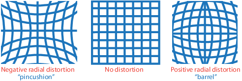
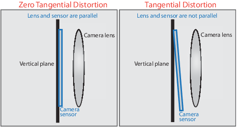
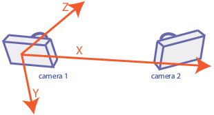
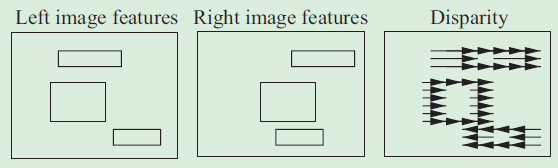
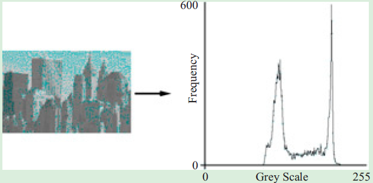
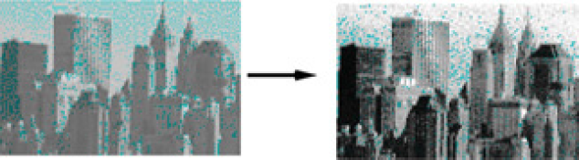
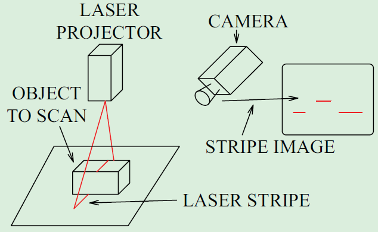
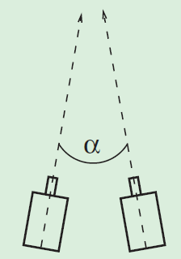
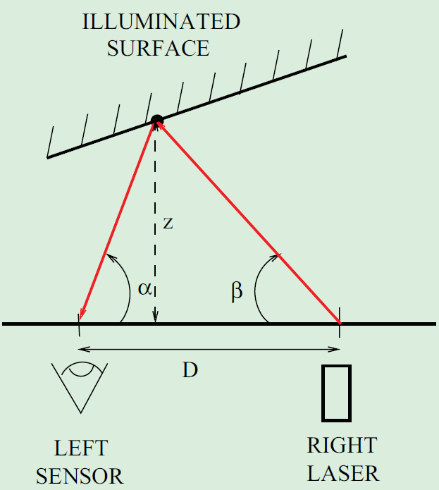

# Computer Vision - General Notes

[toc]

Algorithms, functions for computer vision, 3D vision, and video processing. Perform object detection and tracking, feature detection, extraction, and matching. For 3D vision includes single, stereo, and fisheye camera calibration; stereo vision; 3D reconstruction; and lidar and 3D point cloud processing.

Object detectors using deep learning and machine learning algorithms, such as YOLO v2, Faster R-CNN, and ACF. For sematic segmentation using deep learning algorithms such as SegNet, U-Net, and DeepLab.

Accelerate algorithms by running on multicore processors and GPUs.

## Feature Detection and Extraction

## Deep Learning, Sematic Segmentation and Detection

## Camera Calibration and 3-D Vision

Estimate camera intrinsics, distortion coefficients, and camera extrinsics, extract 3-D information from 2-D images, perform stereo rectification, depth estimation, 3-D reconstruction, triangulation and structure from motion.

- camera calibration: camera intrinscis, extrinsics, and lens distortion parameters
- stereo camera calibration: recover depth from images; estimate parameters of each camera; position and orientation of camera 2 relative to camera 1

### What is Camera Calibration

Geometric camera calibration

- estimate the parameters of a lens and image sensor
- used for 
  - correct lens distortion
  - measure the size of the object in world units
  - determine the location of the camera in the scene

To estimate the camera parameters, need to have 3-D world points and their corresponding 2-D image points. We can get these correspondences using multiple images of a *calibration pattern*, such as  a checkboard. With the correspondences, we can solve the camera parameters. After calibration, we can evaluate the accuracy with

- plot the relative location of the camera and the calibration pattern (checkboard)
- calculate the reprojection errors
- calculate the parameter estimation errors

#### Camera Model

- Pinhole camera model

ideal pinhole camera does not have a lens. 

**Camera Matrix**

- 4-by-3 representing camera parameters

- maps the 3-D world scene into the image plane

- to be identified by the calibration algorithm​ by calculating the extrinsic and intrinsic parameters, where extrinsic parameters represent the location of the camera in the 3-D scene. The intrinsic parameter represent the optical center and focal length of the camera

  ​														$$w*[x, y, 1] = [X, Y, Z, 1]*P$$

  ​																	$$P=\begin{bmatrix}R\\t\end{bmatrix}*K$$

  ​															  $$K = \begin{bmatrix}f_x & 0 & 0\\ s & f_y & 0\\ c_x & c_y & 1\end{bmatrix}$$

where

- w: scale factor
- $[X, Y, Z, 1]$: world points; $[x, y, 1]$: image points
- P: camera matrix; R, t: extrinsic rotation and translation; K: intrinsic matrix
- $[c_x,  c_y]$ - optical center (the principal point), in pixel; $f_x, f_y$ - Focal length in pixels, where $f_x = F/p_x$, $f_y = F/p_y$, where F - Focal length in world in units (mm), $(p_x, p_y)$ - size of pixel in world units; s - skew coefficient, which is non-zero if the image axes are not perpendicular; $s = f_x*tan(\alpha)$, unit (pixel)

The world points are transformed to camera coordinates using the extrinsics parameters. The camera coordinates are mapped into the image plane using the intrinsics parameters. *The extrinsic parameters represent a rigid transformation from 3-D world coordinate system to the 3-D camera coordinate system*. The intrinsic parameters represent a projective transformation from the 3-D camera's coordinates into the 2-D image coordinates.

The origin of the camera's coordinate system is at its optical center and its x- and y-axis define the image plane. In a stereo system, the origin is located at the optical center of Camera 1.

The camera intrinsic parameters include focal length, the optical center (aka principal points) and the skew coefficient.

- Lens distortion model (radial and tangential)

The camera matrix does not account for lens distortion. The (accurate) camera model includes the radial and tangential lens distortion.

**Radial Distortion**

Radial distortion occurs when light rays bend more near the edges of a lens than they do at tis optical center. The smaller the lens, the greater the distortion.

The radial distortion coefficients model this type of distortion.

​														$$x_{distorted} = (1+k_1r^2+k_2r^4+k_3r^6)x$$

​														$$y_{distorted} = (1+k_1r^2+k_2r^4+k_3r^6)y$$

where

- $x, y$ - Undistorted pixel locations. $x$ and $y$ are in normalized image coordinates. Normalized image coordinates are calculated from pixel coordinates by translating to the optical center and dividing by the focal length in pixels. Thus $x$ and $y$ are dimensionless
- $k_1, k_2, k_3$ - Radial distortion coefficients of the lens (to be calibrated)
- $r^2=x^2+y^2$

Typically, two coefficients are sufficient for calibration. For severe distortion, such as in wide-angle lenses, we can select 3 coefficients including $k_3$

**Tangential Distortion**

Tangential distortion occurs when the lens and the image plane are not parallel.

​															$$x_{distorted} = x + [2p_1xy+p_2(r^2+2x^2)]$$

​															$$y_{distorted} = y + [p_1(r^2+2y^2)+2p_2xy]$$

where

- $x, y$ - Undistorted pixel locations. $x$ and $y$ are in normalized image coordinates. Normalized image coordinates are calculated from pixel coordinates by translating to the optical center and dividing by the focal length in pixels. Thus $x$ and $y$ are dimensionless
- $p_1, p_2$ - Tangential distortion coefficients of the lens
- $r^2=x^2+y^2$

When you recontruct a 3-D scene using a calibrated stereo camera, the *reconstructScene* and *triangulate* functions return 3-D points with the origin at the optical center of Camera 1.

**Calibration Pattern-Based Coordinate System**

Points represented in a calibration pattern-based coordinate system are described with the origin located at the (0, 0) location of the calibration pattern (e.g. checkerboard).

#### Single Camera Calibrator

single camera calibration workflow

Use between 10 and 20 images of the calibration pattern (generally checkboard), at least three. Use uncompressed or lossless compression image formats.

**Prepare the Checkboard**

- 

## Lidar and Point Cloud Processing

## Tracking and Motion Estimation

## Computer/Vision Dictionary

- 2.5D image: A [range image]() obtained by scanning from a single [viewpoint](). It allows the data to be represented in a single image array, where each pixel value encodes the distance to the observer scene. The reason this is not called a [3D image]() is to make explicit fact that the back sides of the scene objects are not represented.

- alignment: An approach to [geometric model matching]() by [registration]() of a geometric model to the image data.

- baseline

- camera calibration: Methods for determining the position and orientation of cameras and range sensors in a scene and relating them to scene coordinates. There are essentially four problems in calibration:

  - *interior orientation*: determining the internal camera geometry, including its principal point, focal length and lends distortion;
  - *exterior orientation*: determining the orientation and position of the camera with respect to some absolute coordinate system;
  - *absolute orientation*: determining the transformation between two coordinate systems, and the position and orientation of the sensor in the absolute coordinate system from the calibration points;
  - *relative orientation*: determining the relative position and orientation between two cameras from projections of calibration points in the scene.

  These are classic problems in the field of [photogrammetry]().

- camera coordinates: 

- camera position estimation:

- Canny edge detector: 

- dense stereo matching: A class of methods establishing the correspondence (see [stereo correspondence problem]()) between all pixels in a stereo pair of images. The generated [disparity]() map can then be used for depth estimation.

- depth estimation: The process of estimating the distance between a sensor (e.g. a stereo pair) and a part of the scene being imaged. [Stereo vision]() and [range sensing]() are two well-known ways to estimate depth.

- 

- disparity: The image distance shifted between corresponding points in stereo image pairs
  
  - disparity gradient: the gradient of a disparity map for a stereo pair, that estimates the surface slope at each image point

- epipolar constraint: A geometric constraint reducing the dimensionality of the [stereo correspondence problem](). For any point in one image, the possible matching points in the other image are constrained to lie on a line known as the [epipolar line](). This constraint may be described mathematically using the [fundamental matrix](). See also [epipolar geometry]()

- epipolar line: The intersection of the [epipolar plane]() with the [image plane](). See also [epipolar constraint]()

- essential matrix: In binocular stereo, a matrix $E$ expressing a bilinear constraint between corresponding image points $u, u'$ in camera coordinates: $u'Eu=0$. This constraint is the basis for several reconstruction algorithms. $E$ is a function of the translation and orientation of the camera in the world reference frame.

- fundamental matrix: A bilinear relationship between corresponding points $(u, u')$ in binocular stereo images. The fundamental matrix $F$ incorporates the two sets of camera parameters $(K, K')$ and the relative position $(\vec{t})$ and orientation $(R)$ of the cameras. Matching points $\vec{u}$  from one image and $\vec{u}'$ from the other image satisfy $\vec{u}^TF\vec{u}'=0$ where $S(\vec{t})$ is the skew symmetric matrix of $\vec{t}$ and $F=(K^{-1})^TS(\vec{t})R^{-1}(K')^{-1}$. see also essential matrix

- HDR/high dynamic range imaging/HDRI: Imaging method that allows the capture of a much wider span (i.e. [dynamic range]()) of intensities across images that span multiple areas of contrast - e.g. bright sky and a relatively dark landscape. This technique can be achieved by blending multiple images at different exposure levels to create a scene or a specialist camera.

- 

- histogram: A representation of the frequency distribution of some values. See [intensity histogram]()

  

- histogram equalization: An [image enhancement]() operation that processes a single image and results in an image with a uniform distribution of intensity levels (i.e. whose [intensity histogram]() is flat). When this technique is applied to a [digital image](), however, the resulting histogram will often have large values interspersed with zeros:

  

- histogram of oriented gradients (HOG) descriptor: A feature descriptor based on a histogram of local [gradient]() orientation spatially aggregated over a set of blocks, each in turn sub-divided into cells, within the local image [neighborhood](). Not invariant to rotation.

- homogeneous coordinates: 

- homography transformation:

- 

- ICP/iterative closest point: A shape alignment algorithm that works by iterating its two-stage process until some termination point:

  - Given an estimated transformation of the first shape onto the second, find the closest feature from the second shape for each feature of the second shape
  - Given the new set of closest features, re-estimate the transformation that maps the first feature set onto the second.

  Most variations of the algorithm need a good initial estimate of the alignment.

- intensity histogram:  A data structure that records the number of pixels of each intensity value. A typical [grayscale image]() will have pixels with values in [0, 255]. Subsequently, the histogram will have 256 entries recording the number of pixels that had values 0, the number having value 1 etc.

- Klaman filter: A recursive linear estimator of a varying state vector and associated covariance from observations, their associated covariances and a dynamical model of the state evolution. Improved estimates are calculated as new data is obtained.

- laser radar (LIDAR): 

- laser range sensor: 

- photogrammetry:

- PnP problem: The perspective $n$ point problem; estimating [camera pose]() from $n$ known 2D to 2D point correspondences. TODO: check

- pose estimation/pose determination: The problem of determining the [orientation]() and [translation]() of an object, especially a 3D one, form one or more images thereof. Often the term means finding the transformation that aligns a geometric model with the image data. Several techniques exist for this purpose. See also [alignment](), [model registration](), [orientation representation](), and rotation representation. [WP: Pose_(computer vision)#Pose_Estimation](https://en.wikipedia.org/wiki/Pose_(computer_vision)#Pose_Estimation)

- range sensor: Any sensor acquiring [range data](). The most popular range sensors in computer vision are based on optical and acoustic technologies. A [laser range sensor]() often uses [structured light triangulation](). A time-of-flight range sensor measures the round-trip time of an acoustic or optical pulse. See also [depth estimation](). The figure shows a triangulation range sensor:

  

- robot vision: 

- SIFT: a [feature point]() descriptor that aims to give a distinctive signature for the pattern of intensity values in a $16\times16$ neighborhood around the feature point. The descriptor is computed from eight cell [histograms]() of the gradient magnitudes and directions from $4\times4$ blocks within the $16\times16$ pixel neighborhood. The histograms are concatenated to from a 128 vector.
- SLAM: Simultaneous localization and mapping. A vision algorithm used particularly by the mobile robotics community. It allows the incremental construction and update of a [geometric model]() by a robot as it explores an unknown environment. Given the constructed partial model, the robot can determine its location ([self-localization]()) relative to the model.
- smart camera: A hardware device incorporating a camera and an on-board computer in a single, small container, thus achieving a programmable vision system within the size of a normal video camera.
- smoothing: 
- stereo: General term for a class of problems in which multiple images of the same scene are used to recover a 3D property such as surface shape, orientation or curvature. In [binocular stereo](#stereo), two images are taken form different viewpoints allowing the computation of 3D structure. In trifocal, trinocular stereo and multi-view stereo, three or more images are available. In photometric stereo, the view-point is the same, but lighting conditions are varied in order to computer surface orientation.
- stereo camera calibration: The computation of [intrinsic parameters]() and [extrinsic parameters]() for a pair of cameras. Important extrinsic variables are relative orientation: the rotation and translation relating the two cameras. Calibration can be achieved in several ways: conventional [camera calibration]() of each camera independently; computation of the [essential matrix]() or [fundamental matrix]() relating the pair, from which relative orientation may be computed along with one or two intrinsic parameters; for a rigid [stereo]() rig, moving the rig and capturing multiple image pairs.
- stereo convergence: The angle $\alpha$ between the optical axes of two sensors in a stereo configuration

- stereo correspondence problem/stereo matching: The key to recovering depth from stereo is to identify 2D image points that are projections of the same 3D scene point. Pairs of such image points are called "correspondences". The correspondence problem is to determine which pairs of image points are correspondences. Unfortunately, matching features or image neighborhoods are usually ambiguous, leading to massive amount of computation and many alternative solutions. To reduce the space of matches, corresponding points are usually required to satisfy some constraints, such as having similar orientation and contrast, local smoothness or uniqueness of match. A powerful constraint is the epipolar constraint: from a single view, an image point is constrained to lie on a 3D ray, whose projection onto the second image is an epipolar curve. For pinhole cameras, the curve is an [epipolar line](). This greatly reduces the space of potential matches.

- stereo fusion: The ability of the human vision system, when presented with a pair of stereo images, one to each eye independently, to form a consistent 3D interpretation of the scene, essentially solving the [stereo correspondence problem](). The fact that humans can perform fusion even on [random dot stereograms]() means that high-level recognition is not required to solve all stereo correspondence problems.

- stereo image rectification: For a pair of images taken by pinhole cameras, points in stereo correspondence lie on corresponding [epipolar lines](). Stereo image rectification resamples the 2D images to create two new images, with the same number of rows, so that points on corresponding epipolar lines lie on corresponding rows. This reduces computation for some stereo algorithms, although certain relative orientations (e.g. translation along the optical axis) make rectification difficult to achieve.

- stereo triangulation: Determining the 3D position of a point given its 2D positions in each of two images taken by cameras in known positions. In the noise-free case, each 2D point defines a 3D ray by [back projection]() and the 3D point is at the intersection of the two rays. With noisy data, the optimal triangulation is computed by finding the 3D point that maximizes the probability that the two imaged points are noisy projections thereof. Also used for the analogous problem in multiple views ([WP: Range_imaging#Stereo_trianguation](https://en.wikipedia.org/wiki/Range_imaging#Stereo_triangulation))

- stereo vision: the ability to determine 3D structure using two eyes

- 

- structure and motion recovery: The simultaneous computation of 3D scene structure and 3D camera positions from a sequence of images of a scene. Common strategies depend on tracking of 2D image entities (e.g. [interest points]() or [edges]()) through multiple views and thus obtaining constraints on the 3D entities (e.g. points and lines) and camera motion. Constraints are embodied in entities such as the [fundamental matrix]() and [trifocal tensor](), which may be estimated from image data alone and then allow computation of the 3D camera positions. Recovery is up to certain equivalence classes of scenes, where any member of the class may generate the observed data, such as [projective reconstruction]() or [affine reconstruction](). 

- structure from motion/SfM: Recovery of the 3D shape of a set of scene points from their motion. For a more modern treatment, see [structure and motion recovery]()

- structure from optical flow

- structured light triangulation: Recovery of 3D structure by computing the intersection of a ray (or plane or other light shape) of light with the ray determined by the image of the illuminated scene surface:

  

- 

