# Image Processing and Acquisition Using Python

[toc]

## Introduction to Images and Computing using Python

### Introduction to Python

Python is a dynamic language. The real power of Python lies in the liberal usage of its data structure.

- Lists []: mutable C++ arrays allowing inhomogeneous types (including another container)
  - append, pop, sort, -1 index
  - list comprehensions
- Tuples (): immutable (length and content cannot change at runtime); may contain any data type
- Set {}: use function set or {}; unordered collection of unique objects (could use this to perform unique functions for list and tuple)
- Dictionaries {}: key-value pairs

#### File Handling

```python
# read csv as text
fo = open("myfile.csv")
for i in fo.readlines():
    print(i)
fo.close()
```

```python
# use csv module
import csv
for i in csv.reader(open("myfile.csv")):
    print(i)
```

Excel file can be read and written using the openpyxl module

```python
from openpyxl import load_workbook
wb = load_workbook("myfile.xlsx")
for sheet in wb:
    for row in sheet.values:
        for col in row:
            print(col, end=" | ")
        print()
# output
Timestamp | Az | El |
10100 | 69.7 | 32 |
10110 | 69.5 | 31.9 |
10120 | 69.3 | 31.8 |
10130 | 69.1 | 31.7 |
10140 | 68.9 | 31.6 |
10150 | 68.7 | 31.5 |
```


### Computing using Python Modules

numpy, scipy, matplotlib, Python Imaging Library, scikits

A module is *a Python file* containing multiple functions or classes or other optional components. All these functions and classes share a common namespace, namely, the name of the module file

Numpy module adds ability to manipulate arrays and matrices using a library of mathematical functions.

Numpy computation is much faster than traditional for-loop.

In numpy, there are two mathematical matrix classes: *arrays and matrices*. similar but arrays are more general-purpose and n-dimensional, while matrices facilitate faster linear algebra calculations.

 Array is the default datatype on numpy and is recommended.

Python Imagining Library (PIL), Scikit-image, Python OpenCV

```python
# basic matrix (numpy array) operation: transpose, inverse, multiplication
import numpy as np

arr = np.random.rand(5, 5)
arr_t = arr.transpose()
arr_inv = np.linalg.inv(arr)

arr_verify = arr.dot(arr_inv)
```

### Images and Its Properties

Image processing

- low-level: operate on individual pixels, e.g filtering, morphology, thresholding
- High-level: image understanding, pattern recognition

3D, 4D images; most images have integers for pixel values

Bit-depth: $[0, 2^{bitdepth}-1]$; most photos use 8 bits for storage

Medical and scientific image formats have higher pixel values, usually 16-bit, not only for accuracy but also to ensure that physical phenomena records are not lost (e.g. In CT, pixel>1000 means bone)

channels (RGB-3 or 5)

*A pixel in an image can be thought of as a bucket that collects light or electrons depending on the type of detectors used*. A single pixel in an image spans a distance in the physical world

- 2D: pixel
- 3D: voxel (size in header)

**Histogram**

A graphical depiction of the distribution of pixel value in an image. (pixel-frequency). Histograms are a useful tool in determining the quality of the image.

- An ideal histogram should have to close zero frequency for the lower pixel values
- An ideal histogram should have close to zero frequency for the higher pixel values (if not, may indicate saturation)

Histogram plots of frequency of occurrence can be converted to a probability density function (pdf).

segmentation by thresholding;

Connectivity: 4 or 8 pixels; During the convolution operation, a mask or kernel is placed on top of an image pixel. The final value of the output image pixel is determined using a linear combination of the value in the kernel and the pixel values in the image. The linear combination can be either 4-connected pixels or 8-connected pixels

Image types

- photographic: JPEG, GIF, PNG
- medical: DICOM, NIFTI, Analyze AVW
- microscope imaging: TIFF, ICS, IMS

ImageJ

Data structures

Image data is generally stored as a math matrix (numpy array)

```python
import cv2
img = cv2.imread("pic.png")
img_grayscale = cv2.cvtColor(img, cv2.COLOR_BGR2GRAY)
```

$Y = 0.299*R+0.587*G+0.114*B$

Reading DICOM images using pyDICOM

```python
import cv2
import matplotlib.pyplot as plt

img = cv2.imread("flower.png")
# convert image, three-channel ndarray to single-channel ndarray
img_grayscale = cv2.cvtColor(img, cv2.COLOR_BGR2GRAY)

# display with cv2
cv2.imshow("gray flowr", img_grayscale)
# save the image
cv2.imwrite("gray flower.png", img_grayscale)
cv2.waitKey(0)
cv2.destroyAllWindows()

# display with matplotlib
plt.imshow(img_grayscale)
plt.show()
```


## Image Processing using Python

### Spatial Filters

image filtering is at the heart of image quality and processing

filter usage: remove noise, suppress certain features and highlight others. Two types of filters:

- linear: mean, Laplacian, Laplacian of Gaussian
- non-linear: median, maximum, minimum, Sobel, Prewitt and Canny

Image enhancement can be in two domains

- spatial
- frequency: Fourier transform

#### Filtering

filter mask: usually a 2D square window that moves across the image affecting only *one pixel at a time*. Each number in the filter is known as *coefficient*. The resulting matrix from sub-image (mask size) and filter coefficients multiplication is simplified using a math equation to obtain a single value that will replace the pixel value in the mask center. The exact nature of the math equation depends on the type of filter. *This process of sliding a filter window over an image is called convolution in the spatial domain* - convolution kernel

The convolution operation has to be performed at every pixel in the image including pixels at the boundary. The process of creating pixel values outside the boundary is called padding (create fake pixels). The padded pixels can be assumed to be either zero or a constant value or nearest neighbor/reflect. The padded pixels are considered only for convolution and will be discarded after convolution

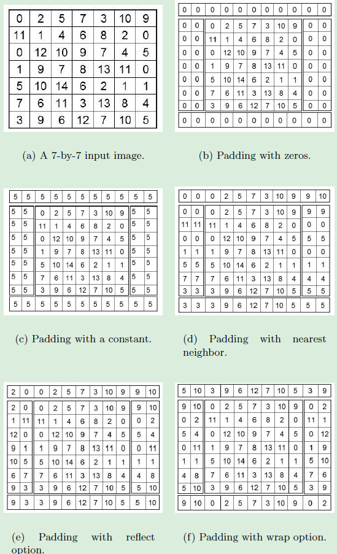

$f$ is linear if $f(x+y) = f(x) + f(y)$, one example is the mean filter

```python
import cv2
import numpy as np
import matplotlib.pyplot as plt
import scipy.ndimage

img = cv2.imread("flower.png")
img_grayscale = cv2.cvtColor(img, cv2.COLOR_BGR2GRAY)

k = np.ones((5, 5))/25
img_filter = scipy.ndimage.convolve(img_grayscale, k)
cv2.imwrite("flower_mean.png", img_filter)

plt.subplot(2, 1, 1)
plt.imshow(img_grayscale)

plt.subplot(2, 1, 2)
plt.imshow(img_filter)
plt.show()
```

advantages of mean filter

- removes noise
- enhances the overall quality of the image, i.e. mean filter brightens an image

disadvantages of the mean filter

- during smoothing, the edges get blurred
- reduces the spatial resolution of the image

median filter is one the most popular non-linear filter. The median filter is most commonly used in *removing salt-and-pepper noise* and impulse noise. Salt-and-pepper noise is characterized by black and white spots randomly distributed in an image.

```python
import cv2
import numpy as np
import matplotlib.pyplot as plt
import scipy.ndimage

img = cv2.imread("saltPepperImage.png")
img_grayscale = cv2.cvtColor(img, cv2.COLOR_BGR2GRAY)

k = np.ones((5, 5))/25
# filter size
img_filter = scipy.ndimage.median_filter(img_grayscale, size=5)
cv2.imwrite("saltPepperImage_denoise.png", img_filter)

plt.subplot(2, 1, 1)
plt.imshow(img_grayscale)

plt.subplot(2, 1, 2)
plt.imshow(img_filter)
plt.show()
```

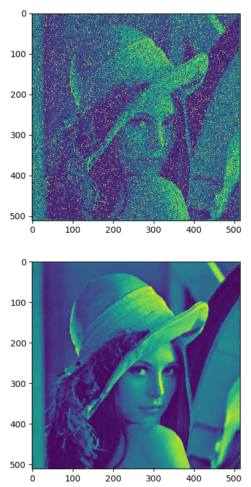


Max filter: enhances the bright points in an image; scipy.ndimage.maximum_filter(img, size)

Min filter: enhance the darkest points in an image; scipy.ndimage.minimum_filter(img, size)

#### Edge Detection using Derivatives

Edges are a set of points in an image where there is a change of *intensity* between one side of that point and the other.

first and second derivative; zero-crossing; noise will affect the detection of zero-crossing

##### Sobel Filter

the most popular first derivative filter. The Sobel filter is used to find horizontal and vertical edges.

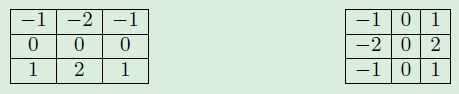

Soble filter features:

- sum of coefficients in the mask image is 0. pixels with constant grayscale are not affected by the derivative filter
- side effect: creation of additional noise. Hence use +2, -2 to produce smoothing

##### Prewitt Filter

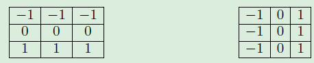

doesn't reduce noise like Sobel

in skimage, there filters for horizontal and vertical edges

##### Canny Filter

Canny edge detector uses three parameters to detect edges. This filter uses 3 parameters to detect edges:

- standard deviation $\sigma$, for Gaussian filter
- threshold values $t_1, t_2$

steps

- Gaussian filter for smoothing
- Edge pixel will have a maximum gradient magnitude in the direction of the gradient. For each pixel, the magnitude and direction of the gradient will be computed

$|\triangledown f| = |f_x|+|f_y|$

$\theta=tan^{-1}(\frac{f_y}{f_x})$

- At the edge points, the first derivative will have either a minimum or a maximum. This implies that the magnitude (absolute value) of the gradient of the image at the edge points is maximum (ridge pixels). To identify edge points and suppress others, only ridge tops are retained and other pixels are assigned a value of zero, a.k.a non-maximal suppression
- Two thresholds are used on ridges to classify edge pixels into weak (low< pixel <high) and strong (>high)
- last step, weak edge pixels are 8-connected with strong edge pixels

```python
import cv2
import numpy as np
import matplotlib.pyplot as plt
import scipy.ndimage

img = cv2.imread("Valve_org.png")
img_grayscale = cv2.cvtColor(img, cv2.COLOR_BGR2GRAY)

img_canny = cv2.Canny(img_grayscale, 100, 200)
cv2.imwrite("Valve_canny.png", img_canny)

plt.imshow(img_canny)
plt.show()
```


Process of Canny edge detection algorithm (wikipedia)

The Process of Canny edge detection algorithm can be broken down to 5 different steps:

1. Apply [Gaussian filter](https://en.wikipedia.org/wiki/Gaussian_filter) to smooth the image in order to remove the noise
2. Find the intensity gradients of the image
3. Apply non-maximum suppression to get rid of spurious response to edge detection
4. Apply double threshold to determine potential edges
5. Track edge by [hysteresis](https://en.wikipedia.org/wiki/Hysteresis): Finalize the detection of edges by suppressing all the other edges that are weak and not connected to strong edges.

**Second derivative filters**

second derivative edge algorithms are more expensive than first derivative filter

##### Laplacian Filter

$\triangledown^2f = \frac{\partial^2 f}{\partial x^2}+\frac{\partial^2 f}{\partial y^2}$ - Laplacian continuous function

The discrete Laplacian used for image processing has several versions of masks

```python
import cv2
import numpy as np
import matplotlib.pyplot as plt
import scipy.ndimage

img = cv2.imread("Valve_org.png")
img_grayscale = cv2.cvtColor(img, cv2.COLOR_BGR2GRAY)

img_laplacian = scipy.ndimage.laplace(img_grayscale, mode="reflect")
cv2.imwrite("Valve_laplacian.png", img_laplacian)

plt.imshow(img_laplacian)
plt.show()
```


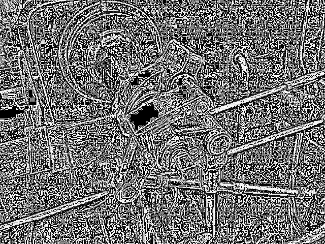

a derivative filter adds noise to an image. The effect is magnified when the first derivative image is differentiated again. As shown above, there are several edges in the input image, the Laplacian filter over-segments the object (creates many edges), the result is very noisy with no discernible edges.

To offset the noise effect, a smoothing function Gaussian, is used along with the Laplacian. *While the Laplacian calculates the zero-crossing and determines the edges, the Gaussian smooths the noise induced by the second derivative*

$G(r) = -e^{\frac{-r^2}{2\sigma^2}};  r^2=x^2+y^2$

A convolution of an image with the Gaussian will result in smoothing of the image. The standard deviation $\sigma$ determines the magnitude of smoothing. If large there will be more smoothing, which causes sharp edges to be blurred; smaller produce less smoothing

Laplacian of Gaussian (LoG)

```python
import cv2
import numpy as np
import matplotlib.pyplot as plt
import scipy.ndimage

img = cv2.imread("Valve_org.png")
img_grayscale = cv2.cvtColor(img, cv2.COLOR_BGR2GRAY)

img_LoG = scipy.ndimage.gaussian_laplace(img_grayscale, sigma=1, mode="reflect")
cv2.imwrite("Valve_laplacian_gaussian.png", img_LoG)

plt.imshow(img_LoG)
plt.show()
```

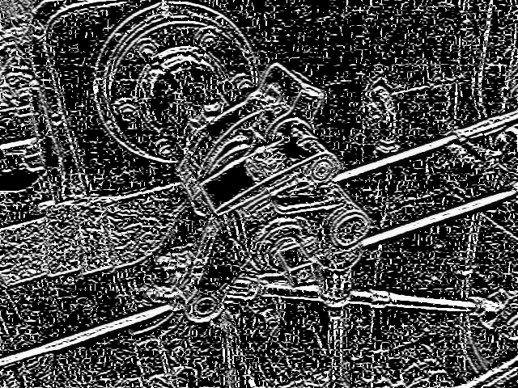

The LoG filter was able to determine the edges more accurately compared to Laplacian alone. The major disadvantage of LoG is the computational price as two operations, Gaussian followed by Laplacian, have to be performed. Even though LoG segments the object from the background, it oversegments the edges within the object causing closed loops (also called the spaghetti effect) as shown in the output.

#### Shape Detecting Filter

The Frangi filter is used to detect vessel-like objects in an image. eigen values

The Frangi filter computes the eigen value on the second derivative (Hessian) image instead of computing the eigen value on the original image

To reduce noise due to derivatives, the image is smoothed by convolution. Generally, Gaussian smoothing is used. It can be shown that *finding the derivative of Gaussian smoothed convolved image is equivalent to finding derivative of a Gaussian convolved with an image*. (convolve first then derivative & derivate on Gaussian first then convolve)

For a 2D image, there will be two eigen values for each pixel coordinate. The eigen values are then sorted in increasing order. A pixel is considered to be part of a tubular or vessel-like structure if $\lambda_1 \approx 0$ while $|\lambda_2|>|\lambda_1|$

For a 3D image, there will be three eigen values for each voxel coordinate. The eigen values are then sorted in increasing order. A voxel is considered to be part of a tubular or vessel-like structure if $\lambda_1 \approx 0$ while $\lambda_2$ and $\lambda_3$ are approximately the same high absolute value and are of the same sign. The bright vessels will have positive values for $\lambda_2$ and $\lambda_3$ while darker vessels will have negative values for $\lambda_2$ and $\lambda_3$.

```python
import cv2
import numpy as np
import matplotlib.pyplot as plt
from skimage.filters import frangi

img = cv2.imread("frangi_original.png")
img_arr = np.asarray(img)
img_frangi = frangi(img_arr, black_ridges=True)
img_enhance = 255*(img_frangi-np.min(img_frangi))/(np.max(img_frangi)-np.min(img_frangi))
cv2.imwrite("frangi_out.png", img_enhance)

plt.imshow(img_enhance)
plt.show()
```

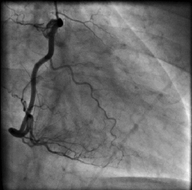

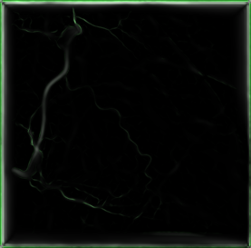

#### Summary

- Mean filter smooths the image while blurring the edges in the image
- Median filter is effective in removing salt-and-pepper noise
- Most widely used first derivative filters are Sobel, Prewitt, and Canny
- Both Laplacian and LoG are popular second derivative filters. Laplacian is sensitive to noise. LoG smooths the image to compensate noise but suffers from spaghetti effect
- Frangi filter is used for detecting vessel-like structures


### Image Enhancement

Image enhancement techniques transform the pixel values in the input image to a new value in the output image using a mapping function.

- logarithmic transformation
- power law transformation
- image inverse
- histogram equalization
- contrast stretching

#### Pixel Transformation

Take pixel intensities of the image as input and creates a new image with corresponding transformed intensities.

For a grayscale image, the transformation range is given by [0, L-1] where $L = 2^k$ and $k$ is the number of bits in an image; for 16-bit image, the range is [0, 65535]

#### Image Inverse

$t(i, j) = L-1-I(i, j)$

```python
import cv2
import numpy as np
import matplotlib.pyplot as plt

img = cv2.imread("skull_org.png")
img_inv = 255-img
cv2.imwrite("skull_inv.png", img_inv)

plt.imshow(img_inv)
plt.show()
```

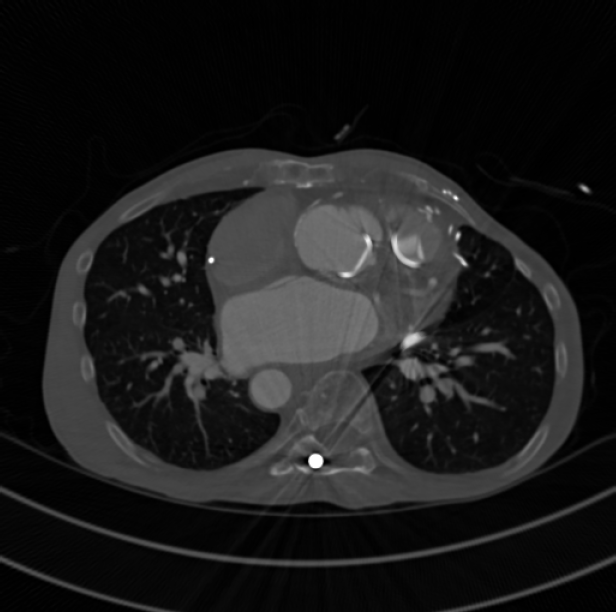

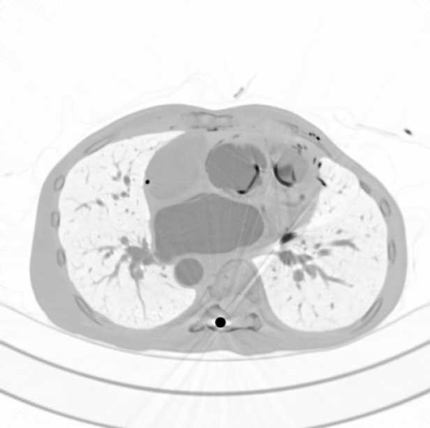

#### Power Law Transformation

a.k.a gamma-correction is used to enhance the image quality

$t(i, j) = kI(i, j)^\gamma$, in most cases $k=1$

- $\gamma = 1$, input, output is the same
- $\gamma < 1$, a narrow range of dark or low-intensity pixel values in the input image get mapped to a wide range of intensities in the output image, while a wide range of bright or high intensity-pixel values in the input image get mapped to a narrow range of high intensities in the output image.
- $\gamma>1$, opposite of above

human brain, monitors, tvs all use gamma-correction to process an image, image contrast

to avoid intensities out of bound, need normalization

$t(i,j)=e^{\gamma*ln(I_{norm})}*255$

```python
import cv2
import numpy as np
import matplotlib.pyplot as plt

img = cv2.imread("vessel.png")
gamma = 5
#  convert to type float
img_f = img.astype(float)
maxi = np.max(img_f)
# normalize image
img_fnorm = img_f/maxi
# gamma-correction exponent is computed
img_exp = np.log(img_fnorm)*gamma
# perform gamma_correction
img_gamma = np.exp(img_exp)*255.0
# convert image back to int
img_gamma_i = img_gamma.astype(int)
cv2.imwrite("vessel_gamma2.png", img_gamma_i)

plt.imshow(img_gamma_i)
plt.show()
```

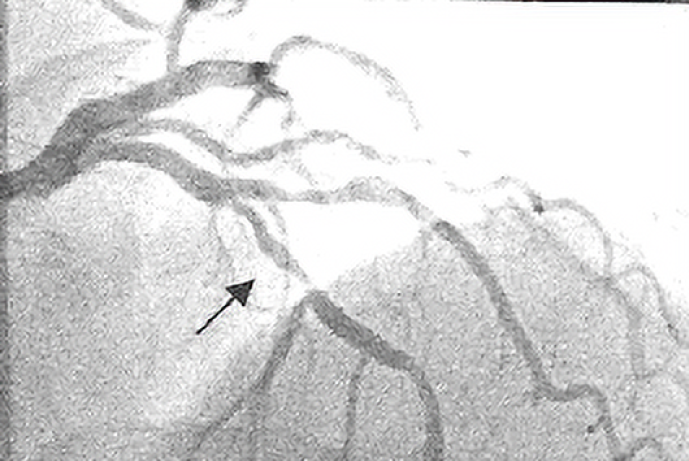

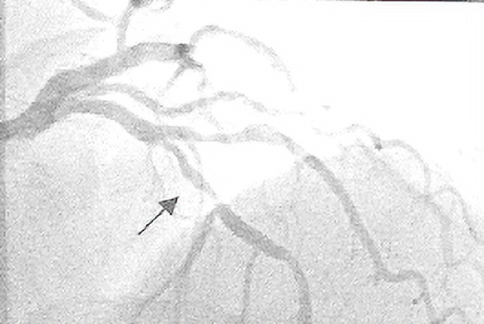

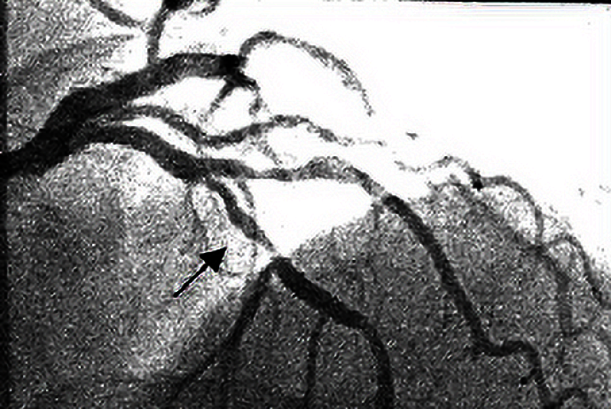

with $\gamma=5$, the image is darker and blood vessels are visible

#### Log Transformation

used to enhance pixel intensities that are otherwise missed due to a wide range of intensity values or lost at the expense of high-intensity values

$t(i,j)=k*log(1+I(i,j))=\frac{L-1}{log(1+|I_{max}|)}*log(1+I(i,j))$

the intensities in the image range from $[0, L-1]$, the end points of the range get mapped to themselves. The log can be of any base (10 or e)

```python
import cv2
import numpy as np
import matplotlib.pyplot as plt

img = cv2.imread("bse.png")
img_f = img.astype(float)
Imax = np.max(img_f)
# perform log transformation
img_log = (255.0*np.log(1+img_f))/np.log(1+Imax)
img_logi = img_log.astype(int)

cv2.imwrite("bse_log.png", img_logi)

plt.imshow(img_logi)
plt.show()
```

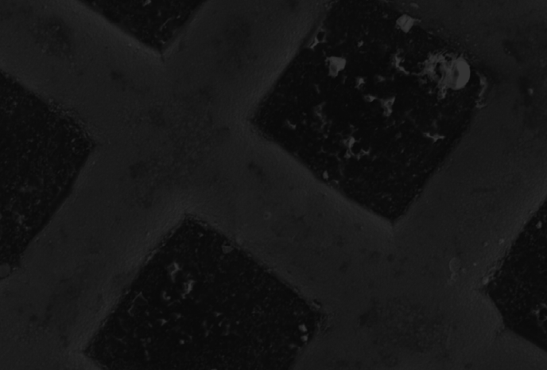

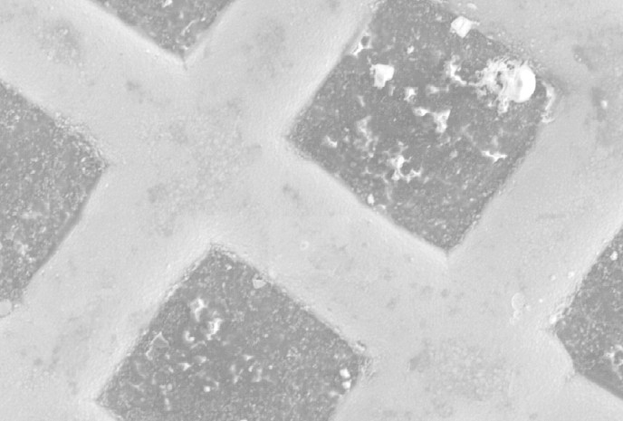

Log transformation improved the contrast of the above electron microscope image.

#### Histogram Equalization

The histogram of an image is a discrete function, its input is the gray-level value and the output is the number of pixels with that gray-level value. Low gray-level values in the image (left of histogram) correspond to dark regions and high gray-level values correspond to bright regions.

In a low-contrast image, the histogram is narrow, whereas in an image with better contrast, the histogram is spread out. In histogram equalization, the goal is to improve the contrast of an image by *rescaling the histogram* so that the histogram of the new image is spread out and the pixel intensities range over all possible gray-level values. The rescaling of the histogram will be performed using a one-to-one transformation. The transformation should be a monotonic function. This will ensure that the transformation is invertible.

Before histogram equalization transformation, the histogram of the input image is normalized so that the range of the normalized histogram is [0, 1]

probability distribution function (PDF): $p_x(i)$

cumulative distribution function (CDF): $C(i) = \sum_{j=0}^{i}p_x(j)$, where $0\leq i \leq L-1$; L is the total number of gray-level values in the image. C is an increasing function

The histogram equalization transformation can be defined as

$h(u) = round(\frac{C(u)-C_{min}}{1-C_{min}}*(L-1))$

```python
import cv2
import numpy as np
import matplotlib.pyplot as plt

img = cv2.imread("hequalization_input.png")
# 2D array is converted to 1D array
img_fl = img.flatten()
# histogram and bins of the image are computed
hist, bins = np.histogram(img, 256, [0, 255])
# cumulative distribution function
cdf = hist.cumsum()
# places where cdf=0 is masked or ignored and rest is stored in cdf_m
cdf_m = np.ma.masked_equal(cdf, 0)
# histogram equalization
num_cdf_m = (cdf_m - cdf_m.min())*255
den_cdf_m = (cdf_m.max()-cdf_m.min())
cdf_m = num_cdf_m/den_cdf_m
# the masked places in cdf_m are now 0
cdf = np.ma.filled(cdf_m, 0).astype('uint8')
# cdf values are assigned in the flattened array
im2 = cdf[img_fl]
# reshape 1D im2 to 2D
im3 = np.reshape(im2, img.shape)
cv2.imwrite("hequalization_output.png", im3)

plt.imshow(im3)
plt.show()
```

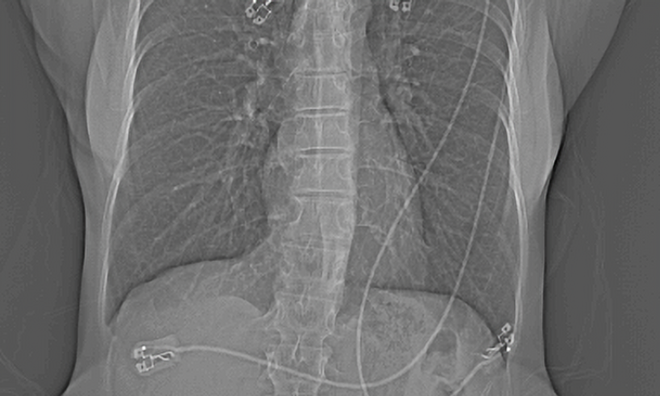

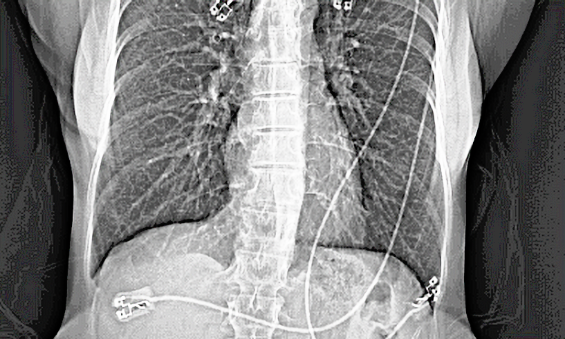

Notice that the histogram of the input image is narrow compared to the range [0, 255]. After histogram equalization, the histogram of the output image is spread over all the values in the range and subsequently the image is brighter and the leads are visible.

#### Contrast Limited Adaptive Histogram Equalization (CLAHE)

The above output image is too bright. In CLAHE, the image is divided into small regions and a histogram of each region is computed. A contrast limit is chosen as a threshold to clip the histogram in each bin, and the pixels above the threshold are not ignored but rather distributed to other bins before histogram equalization is applied.

Bilinear interpolation is applied to remove artifacts at the boundary of sub-images.

```python
import cv2
import numpy as np
import matplotlib.pyplot as plt
from skimage.exposure import equalize_adapthist

img = cv2.imread("embryo.png")
# applying Calhe
img2 = equalize_adapthist(img, clip_limit=0.02)
# rescaling img2 from 0 to 255
img3 = img2*255.0
cv2.imwrite("embryo_clahe.png", img3)

plt.imshow(img3)
plt.show()
```

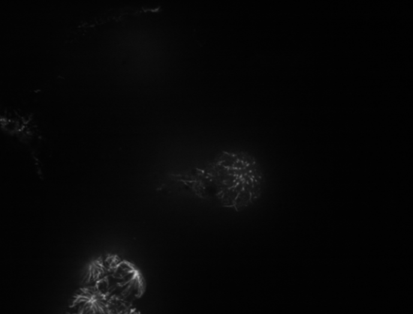

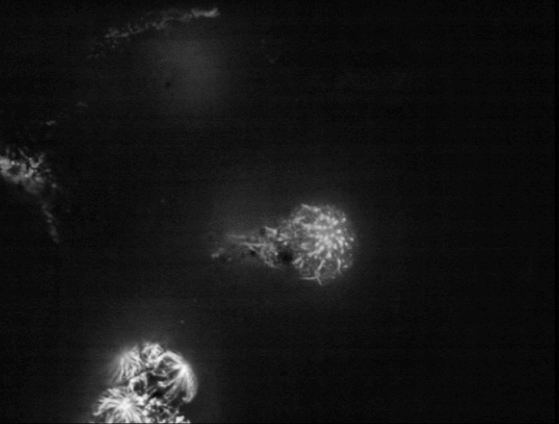

#### Contrast Stretching

Contrast stretching is similar in idea to histogram equalization except that the pixel intensities are rescaled using the pixel values instead of probabilities and CDF.

$t(i, j) = 255*\frac{I(i,j)-a}{b-a}$

```python
import cv2
import numpy as np
import matplotlib.pyplot as plt

img = cv2.imread("hequalization_input.png")
a = img.min()
b = img.max()

print(a, b)
c = img.astype(float)
img1 = 255.0*(c-a)/(b-a+0.0000001)

plt.imshow(img1)
plt.show()
```

#### Sigmoid Correction

$S(x) = \frac{1.0}{1+e^{-x*gain}}$

$S(x)$ asymptotically reaches 0 for low negative values or reaches 1 asymptotically for high positive values and is always bound between [0, 1]

We use the gain as a hyper-parameter (超参) for fine tuning the image enhancement.

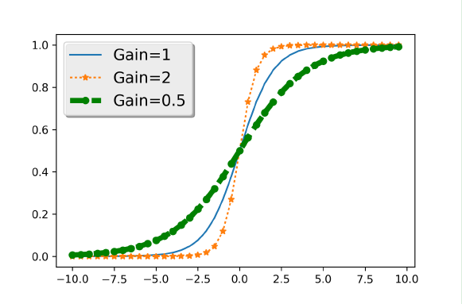

The above diagram shows the effect of gain in a sigmoid function

- for 0.5 gain, the slope is smaller. The saturation of pixel values to either 0 or 1 on either end of the spectrum will happen only for points that are farther away from 0. pixel values farther away from 0 will retain their gray value range and hence we will visualize a large range of pixel values in the image
- for 2 gain, only pixel values (x axis) close to 0 will retain their pixel values while pixel values farther away from 0 will either be saturated to 0 or 1. Hence only a pixel around 0 will be visible wit its gray value range

In scikit image

$S(x)=\frac{1.0}{1+e^{-(f_{cutoff}-i)*gain}}$

The cutoff is the pixel value around which the sigmoid correction is preformed. The pixel values must be normalized to [0, 1] before performing sigmoid correction

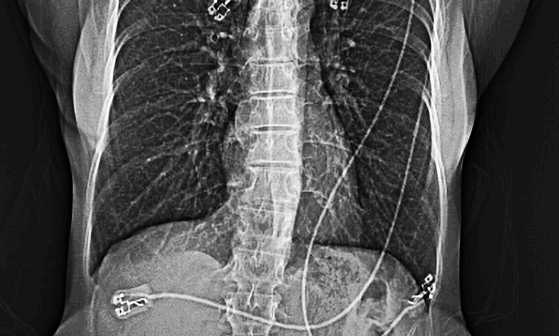

#### Local Contrast Normalization

Local contrast normalization was developed as part of a computational neural model. The method demonstrates that *enhancing the pixel value* at a certain location depends only on its neighboring pixels and not the ones farther away from it. The method works by setting the local mean of a pixel to zero and its standard deviation to 1 based on the pixels in the neighborhood.

$d = I*\sigma_1 - I$

$s = \sqrt{d^2*\sigma_2}$

$I_{out}=\frac{d}{max(mean(s), s)}$

where $I$ is the original image, $\sigma_1, \sigma_2$ are the standard deviations for the Gaussian smoothing, d is a difference image whose neighborhood mean is 0. * indicates convolution, and $mean(s)$ is the mean of the image s.

The convolution operation works on pixels neighboring a given pixel and hence the filter is called a "local contrast normalization". Since the Gaussian is a weighted mean of the neighborhood pixels, the operation is equivalent to remove the mean from the neighborhood.

This filter works especially well for highlighting high-contrast objects surrounded by low-contrast structures.

### Affine Transformation

geometric transformation that preservers points, lines and planes.

- collinearity
- Parallelism
- Convexity
- Ratios of parallel line segments

Affine transformation: calculate the dot product of the pixel coordinate with a transformation matrix. Since the dot product may product non-integer pixel coordinate, we will apply interpolation.

- translation
- rotation
- scaling

Various interpolation schemes

- Nearest-neighbor (n = 0) - copy neighboring
- Bi-linear (n = 1) - default; based on 2x2 neighboring
- Bi-quadratic (n = 2) - 3x3
- Bi-cubic (n = 3) - 4x4
- Bi-quartic (n = 4)
- Bi-quintic (N = 5)

higher order produces smoother interpolation but higher computation cost (significantly)

### Fourier Transform

Previously, we focused on images in the spatial domain, i.e. the physical world. In some cases, an operation can be performed more efficiently in the frequency domain than in the spatial domain.

A function can be expressed as infinite sums of sines and cosines of different frequencies, now known as Fourier series. The Fourier transform is a representation in which any function can be expressed as the integral of sines and cosines multiplied with the weighted function. Also, any function represented in either Fourier series or transform can be reconstructed completely by an inverse process, a.k.a. inverse Fourier transform.

FFT have affected several fields including remote sensing, signal processing and image processing.

- Image filtering
- Image compression
- Image enhancement
- Image restoration
- Image analysis
- Image reconstruction

continuous Fourier and inverse transform

$F(u) = \int_{-\infin}^{\infin}f(x)e^{-i2\pi ux}dx$ where $i=\sqrt{-1}$

$f(x) = \int_{-\infin}^{\infin}F(u)e^{i2\pi ux}du$

discrete Fourier and inverse transform (DFT, IDFT)

$F(u) = \frac{1}{L}\sum_{x=0}^{L-1}f(x)e^{\frac{-i2\pi ux}{L}}$ for $u=0,1,2,...,L-1$

$f(x) = \sum_{x=0}^{L-1}F(u)e^{\frac{-i2\pi ux}{L}}$ for $x = 0,1,2,...,L-1$

using Euler's formula $e^{i\theta}=cos\theta + isin\theta$, the above equation can be simplified as

$F(u) = \frac{1}{L}\sum_{x=0}^{L-1}f(x)[cos(\frac{2ux\pi}{L})+isin(\frac{2ux\pi}{L})]=R(u)+iI(u)$

$u$ plays a key role in determining the frequency of the coefficients of the Fourier transform, $u$ is known as the frequency variable, while $x$ is known as the spatial variable.

Traditionally many experts have compared the Fourier transform to a glass prism. As a glass prism splits or separates the light into various wavelengths or frequencies that form a spectrum, the Fourier transform splits or separates a function into its coefficients, which depend on the frequency. These Fourier coefficients form a Fourier spectrum in the frequency domain.

For computational purposes, it is convenient to represent the Fourier transform in polar form

$F(u) = |F(u)|e^{-i\theta(u)}$

$|F(u)|=\sqrt{R^2(u)+I^2(u)}$

$\theta(u)=tan^{-1}(\frac{I(u)}{R(u)})$

magnitude and phase angle

The first value of the discrete Fourier transform is obtained by setting $u=0$

$F(0) = \frac{1}{L}\sum_{x=0}^{L-1}f(x)$

which is just the average of all $f(x)$


### Segmentation

### Morphological Operations

### Image Measurements

### Neural Network

### Convolutional Neural Network

## Image Acquisition

### X-Ray and Computed Tomography

### Magnetic Resonance Imaging

### Light Microscopes

### Electron Microscopes

## Process-Based Parallelism using Joblib

## Parallel Programming using MPI4Py

## Introduction to ImageJ

## MATLAB and Numpy Functioins