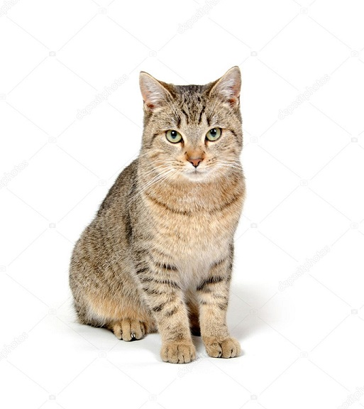
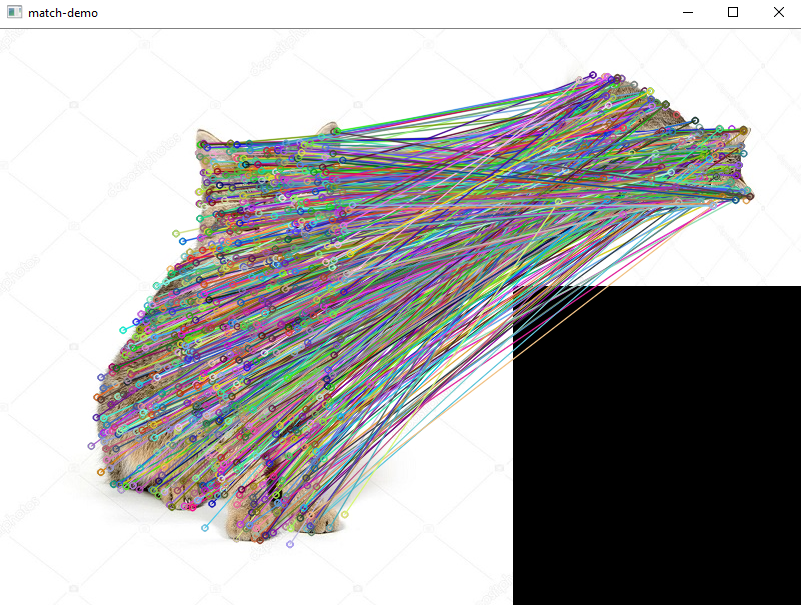

# Image Processing with OpenCV+VTK

[toc]

## OpenCV

AR = 2D image processing + static 3D visualization

VR = 2D image processing + dynamic 3D visualization

### OpenCV Introduction

cameras on UAVs is one of the best application scenarios for image capturing and processing.

Notes on Install OpenCV4.2.0 on Windows with CMake (C++ and Python)

1. Download OpenCV 4.20 and opencv_contrib 4.2.0 from Github releases
2. CMake GUI; VS 15 2017, x64
   1. In flag "OPENCV_EXTRA_MODULES_PATH", give "/opencv/opencv_contrib-4.2.0/modules"
   2. Check “INSTALL_C_EXAMPLES” and “INSTALL_PYTHON_EXAMPLES”
   3. Check "BUILD_opencv_world" to have one .lib and .dll built
   4. Manually add Python paths: "PYTHON3_EXECUTABLE", "PYTHON3_INCLUDE_DIR", "PYTHON3_LIBRARY", "PYTHON3_NUMPY_INCLUDE_DIRES", "PYTHON3_PACKAGES_PATH", and possibly "PATHON3_LIBRARY_DEBUG", I used Anaconda installation for Python 3.7.3
3. Configure (may need multiple times) and Generate
4. Compile and Install in VS2017 for Release and Debug separately; 
5. In built successfully, 
   1. dynamic libraries "opencv_world420.dll" and "opencv_world420d.dll" will be located in **OPENCV_PATH**\build\install\x64\vc15\bin
   2. static libraries "opencv_world420.lib" and "opencv_world420d.lib" will be located in **OPENCV_PATH**\build\install\x64\vc15\lib
6. Update system environment variables
   1. edit System variables/Path, add "**OPENCV_PATH**\build\install\x64\vc14\bin", modify if there is any existing ones
   2. add "OPENCV_DIR" in User variables, add **OPENCV_PATH**\build\install


Testing C++ installation with one SIFT matching example

```c++
#include <opencv2/opencv.hpp>
#include <opencv2/xfeatures2d.hpp>
#include <iostream>

using namespace cv;
using namespace cv::xfeatures2d;
using namespace std;

int main(int argc, char** argv) {

	Mat cat = imread("cat.jpg");
	Mat smallCat = imread("smallCat.jpg");
	imshow("cat image", cat);
	imshow("smallCat image", smallCat);

	auto detector = SIFT::create();
	vector<KeyPoint> keypoints_cat, keypoints_smallCat;
	Mat descriptor_cat, descriptor_smallCat;
	detector->detectAndCompute(cat, Mat(), keypoints_cat, descriptor_cat);
	detector->detectAndCompute(smallCat, Mat(), keypoints_smallCat, descriptor_smallCat);

	Ptr<FlannBasedMatcher> matcher = FlannBasedMatcher::create();
	vector<DMatch> matches;
	matcher->match(descriptor_cat, descriptor_smallCat, matches);
	Mat dst;
	drawMatches(cat, keypoints_cat, smallCat, keypoints_smallCat, matches, dst);
	imshow("match-demo", dst);


	waitKey(0);
	return 0;
}
```


Result:






### Core Module

### HighGUI Module

### ImgProc Module

### Calib3d Module

### Feature2d Module

### Video Module

### Objdect Module

### ML Module

### Contrib Module

## Application

### Image Encryption/Decrytion

### Image Capturing

### Keyboard Application

### Image Segmentation

### Image Rotation

### Mouse Coordinate Detection

### QR Code Detection

### Integration with OpenGL

### OpenGL and Camera

### Finding Car Plate with Contour

## 3D Projection

### VTK

### Viz Module