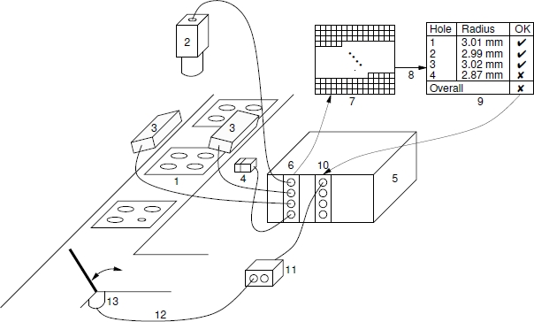
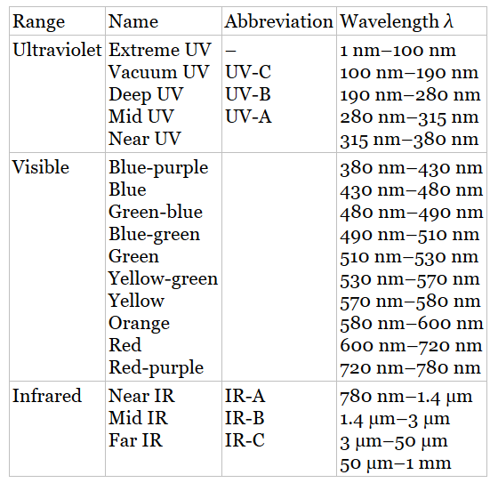
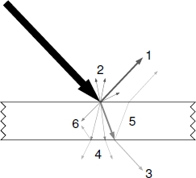
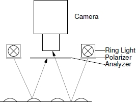

# Machine Vision Algorithms and Applications - 2nd

[toc]

HALCON software (https://www.mvtec.com/products/halcon/) - MVTec

book web (https://www.mvtec.com/company/research/machine-vision-book/)

automation

- camera-computer interface standard
- readily available sensors
- 3D machine vision algorithms
- robotics
- machine learning (classification)

## Introduction

Machine vision is one key technology in manufacturing because of increasing demands on the documentation of quality and the traceability of products. quality inspection, hybrid robot control

Common tasks for machine vision:

- object identification. can be based on special identification symbols, e.g. character strings or bar codes, or on objects characteristics, such as shape
- position detection is used to control a robot assembling a product, such as pick-and-place onto PCB. 2D or 3D
- completeness checking; the right components are in the right place
- Shape and dimension inspection checking the product geometric parameters; tolerance; in production and in use
- surface inspection, e.g. scratches, indentations, protrusions

A typical machine vision system:

- 1) object to be transported and inspected
- 4) a trigger that triggers the image acquisition, e.g. a photoelectric sensor
- 3) illumination
- 2) camera with lens or smart camera with built-in computer
- 5) computer (standard industrial PC); computer may use a standard processor, a DSP, or field-programmable gate array (FPGA) or a combination of above
- 6) camera-computer interface, e.g. a frame grabber
- 7) image assembled in the computer memory
- 8) machine vision software inspects the object and returns
- 9) an evaluation of the object
- 11) the result is communicated to a controller, e.g. a PLC or a distributed control system (DCS)
- this communication is performed by digital I/O interface 10)
- PLC, in turn, typically controls an actuator 13) through 
- a communication interface 12), e.g. a fieldbus or serial interface

If the image is acquired through a frame grabber, then illumination may be controlled by the frame grabber, e.g. through strobe signals. If the camera-computer interface is not a frame grabber but a standard interface, such as IEEE 1394, USB, or Ethernet, the trigger will typically be connected to the camera and illumination directly or through a programmable logic controller (PLC).

ME, EE, OE and SE

## Image Acquisition

hardware components involved

### Illumination

The goal of illumination is to make the important features visible and to suppress undesired features of the object. Spectral composition of the light and the object

#### Electromagnetic Radiation

Light is the electromagnetic radiation of a certain range of wavelengths. The range of wavelengths visible for humans is 380-780 nm.

X-rays, gamma rays < ultraviolet (UV) < Visible < IR < microwaves, radio waves

#### Types of Light sources

Light-emitting diode (LED) is currently the primary illumination technology used in machine vision (MV) applications.

The color of the emitted light depends on the composition and condition of the semiconductor material used. The possible range of colors comprises IR, visible, and near UV radiation. White LEDs can also be produced: they internally emit blue light, which is converted to white light by a coating with a yellow phosphor on the semiconductor. One advantage of LEDs is their longevity: lifetimes larger than 100 000 hours are not uncommon. Furthermore, they can be used as flashes with fast reaction times and almost no aging. Since they use direct current, their brightness can be controlled easily. In addition, they use comparatively little power and produce little heat.

#### Interaction of Light and Matter

The interaction of light with an object.

1. specular reflection
2. diffuse reflection
3. direct transmission
4. diffuse transmission
5. backside reflection
6. absorption

The microstructure of the object (essentially the roughness of its surface) determines how much of the light is reflected diffusely and how much specularly. In practice, specular reflection is never perfect

Reflection at metal and dielectric surfaces, e.g. glass or plastics, causes light to become partially polarized. *Polarization* occurs for diffuse as well as specular reflection. In practice, however, polarization caused by specular reflection dominates.

The fraction of light reflected by the surface is given by the bidirectional reflectance distribution function (BRDF). The BRDF is a function of the direction of the incoming light, the viewing direction, and the wavelength of the light. If the BRDF is integrated over both directions, the reflectivity of the surface is obtained. It depends only on the wavelength.

Note that reflection also occurs at the interface between two transparent media. This may cause backside reflections, which can lead to double images.

Depending on the internal and surface structure of the object, the transmission can be direct or diffuse. The fraction of light that passes through the object is called its transmittance. Like reflectivity, it depends, among other factors, on the wavelength of the light.

Absorption occurs if the incident light is converted into heat within the object.

If we denote the light that falls onto the object by *I*, the reflected light by *R*, the transmitted light by *T*, and the absorbed light by *A*, the law of conservation of energy dictates that $I = R + T + A$. In general, dark objects absorb a significant amount of light.

All of the above quantities except specular reflection depend on the wavelength of the light that falls onto the object. Wavelength-dependent diffuse reflection and absorption give opaque objects their characteristic color. Likewise, wavelength-dependent transmission gives transparent objects their characteristic color.

#### Using the Spectral composition of the Illumination

colored objects reflect certain portions of the light spectrum, while absorbing other portions. This can be used to enhance the visibility of certain features by employing an illumination source that uses a range of wavelengths that is reflected by the objects that should be visible and is absorbed by the objects that should be suppressed. For example, use red illumination for capturing a red object on a green background.

segmentation with illumination.

Since charge-coupled device (CCD) and complementary metal-oxide semiconductor (CMOS) sensors are sensitive to IR radiation, IR radiation can often be used to enhance the visibility of certain features. 

All the above effects can also be achieved through the use of white light and color filters. However, since a lot of efficiency is wasted if white light is created only to be filtered out later, it is almost always preferable to use colored illumination from the start. Nevertheless, CCD and CMOS sensors are sensitive to IR radiation. Therefore, an *IR cut filter* is often useful to avoid unexpected brightness or color changes in the image. On the other hand, if the object is illuminated with IR radiation, an *IR pass filter*, i.e., a filter that suppresses the visible spectrum and lets only IR radiation pass, is often helpful.

Another useful filter is a polarizing filter. To suppress the reflection light, we can mount a polarizing filter in front of the camera and turn it in such as way that the polarized light is suppressed.

> Note: **Polarization** is a property applying to [transverse](https://en.wikipedia.org/wiki/Transverse_wave) [waves](https://en.wikipedia.org/wiki/Wave) that specifies the geometrical orientation of the [oscillations](https://en.wikipedia.org/wiki/Oscillation). In a transverse wave, the direction of the oscillation is perpendicular to the direction of motion of the wave

The polarizing filters in from the illumination and camera are called polarizer and analyzer, respectively. The polarizer and analyzer are polarizing filters that are mounted in front of the illumination and camera, respectively. If the analyzer is turned by $90^0$ with respect to the polarizer, light polarized by specular reflection is suppressed by the analyzer (almost completely)

#### Using directional properties of the Illumination

in machine vision most often the directional properties of the illumination are used to enhance the visibility of the essential features.

By directional properties, we mean two different effects. On the one hand, the light source may be diffuse or directed. In the first case, the light source emits the light more or less evenly in all directions. In the second case, the light source emits the light in a very narrow range of directions. In the limiting case, the light source emits only parallel light rays in a single direction. This is called telecentric illumination.

The placement of the light source with respect to the object and camera is important

- front/incident light: the light source is on the same side of the object as the camera
- back/transmitted light: the light source is on the opposite side of the object to the camera, also known as transmitted light especially if images of transparent objects are acquired
- bright-field illumination: the light source is placed at an angle to the object so that most of the light is reflected to the camera
- dark-filed illumination: the light is placed in such a way that most of the light is reflected away from the camera, and only light of certain parts of the object is reflected to the camera

##### Diffuse bright-field front light illumination

### Lenses

### Cameras

### Camera-Computer Interfaces

### 3D Image Acquisition Devices

## Machine Vision Algorithms

### Fundamental Data Structures

### Image Enhancement

### Geometric Transformations

### Image Segmentation

### Feature Extraction

### Morphology

### Edge Extraction

### Segmentation and Fitting of Geometric Primitives

### Camera Calibration

### 3D Reconstruction

### Template Matching

### 3D Object Recognition

### Hand-Eye Calibration

### Optical Character Recognition

### Classification

## Machine Vision Applications

### Wafer Dicing

### Reading of Serial Numbers

### Inspection of Saw Blades

### Print Inspection

### Inspection of Ball Grid Arrays

### Surface Inspection

### Measurement of Spark Plugs

### Molding Flash Detection

### Inspection of Punched Sheets

### 3D Plane Reconstruction with Stereo

### Pose Verification of Resistors

### Classification of Non-Woven Fabrics

### Surface Comparison

### 3D Pick-and-Place

## References