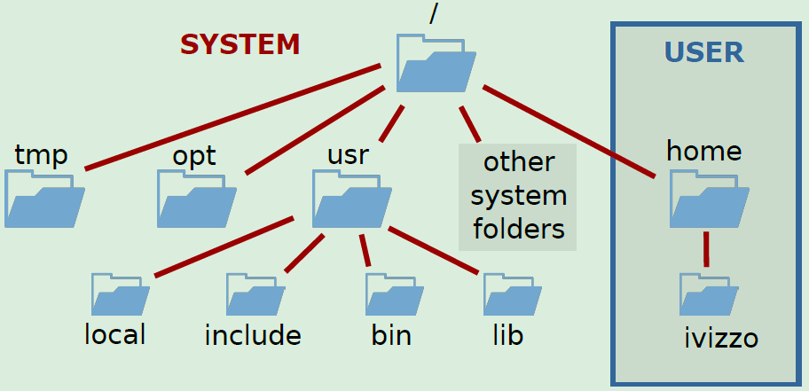
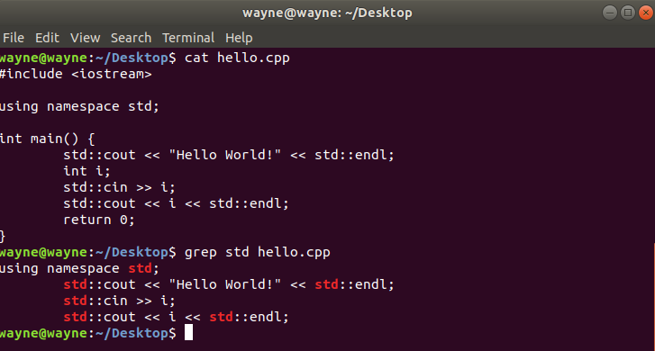
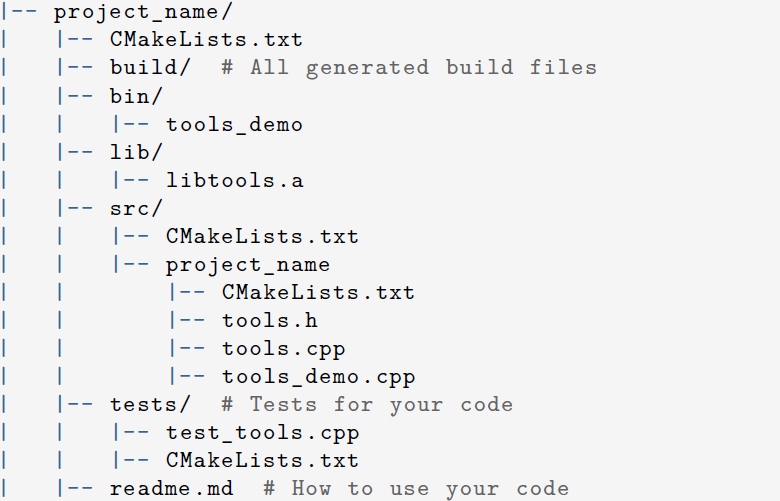
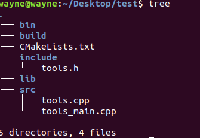
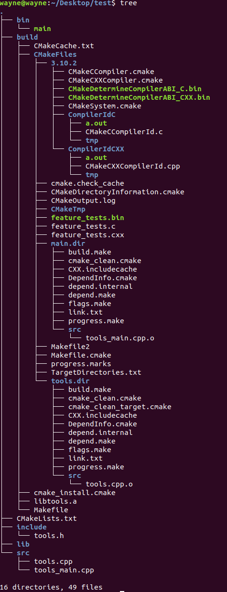
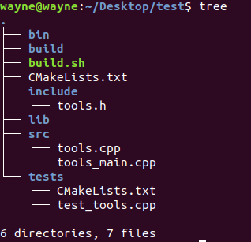
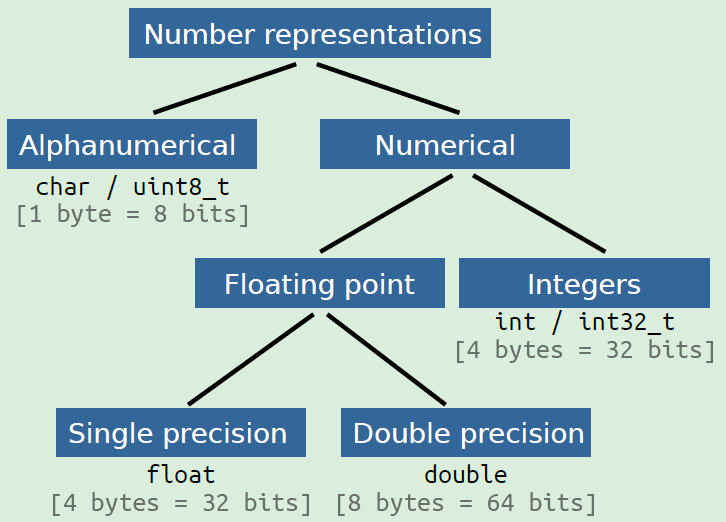
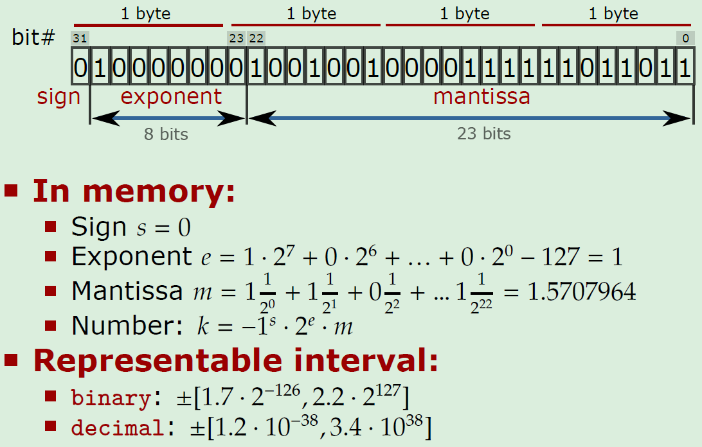

# Modern C++ for Computer Vision and Image Processing

[toc]

https://www.youtube.com/watch?v=F_vIB3yjxaM&list=PLgnQpQtFTOGR50iIOtO36nK6aNPtVq98C

2018 and 2020 versions

http://www.ipb.uni-bonn.de/teaching/modern-cpp/

https://www.ipb.uni-bonn.de/teaching/cpp-2020/

## Course Introduction and Hello World

> Talk is cheap. Show me the code. - Linus Torvalds

### Linux Introduction

Linux directory tree



- Tree organization starting with root: /
- there are no volume letters, e.g. C:, D:
- user can only access his/her own folder

Understanding files and folders

- Folders end with / e.g. /path/folder/
- Everything else are files, e.g. /path/file
- Absolute paths start with / while all other paths are relative
  - /home/folder/  - absolute
  - folder/filer  - relative
- Paths are case sensitive: filename is different from FileName
- extension is part of a name

Linux terminal

- Terminal is faster

- Terminal is always in some folder

- pwd

- cd <dir>

- ls <dir>

- special folders:

  - / - root folder
  - ~ - home folder
  - . - current folder
  - .. - parent folder

- --help

- mkdir

- rm -[r]f: remove [recursive] [force]

- cp [-r] <source><dest> - copy

- mv <source> <dest> - move

- Using placeholders: can be used with most terminal commands: ls, rm, mv

  - \* : Any set of characters

  - ? : Any single character

  - [a-f]: characters in [abcdef]

  - [^a-c]: characters not in [abc]

Standard input/output channels

- stdin
- stdout
- stderr

Working with files

- cat <filename>  -- cool
  - print the contents of the file in the terminal
- grep <what> <where>  -- insanely powerful (probably the most)
  - search for a string <what> in a file <where>



Chaining commands

Linux command line pipes and redirection

Canceling commands

- CTRL+C
- htop (top) -- cool (shows an overview of running processes)

Command histroy

- arrow
- Ctrl+R <query>

Install software

- sudo apt


### C++ Hello World

Modern C++

Good code style is important

- Use *clang_format* to format your code
- use *cpplint* to check the style
- We use Goolge Code Style Sheet

Compilers on Linux

- GCC
- Clang

```c++
c++ -std=c++11 -o hello hello.cpp
```


## Variables, Basic Types, Control Structure

always initialize variables if you can

Naming variables

- `GOOGLE-STYLE`: snake_case
- don't be afraid of long names

use std::array for fixed size collection of items of same type

```c++
array<float, 3> arr = {1.0f, 2.0f, 3.0f};
```

Use std::vector, it is fast and flexible; Vector is implemented as a dynamic table

Add a new item:

- vec.emplace_back(value) [preferred, C++11]
- vec.push_back(value) [historically better known]

Optimize vector resizing

```c++
vec.reserve(kIterNum);
```


Variables live in scopes; this is the core of C++ memory system

- Tip: declare everything const unless it must be changed

- GOOGLE_STYLE names constants in CamelCase starting with a small letter k

```c++
const float kImportFactor = 20.0f;
```

References

- const with references

In C++, for loops are very fast. less flexible than while but less error-prone

use break to exit the loop

### Git

- Free software for distributed version control
- Synchronizes local (computer) and remote files (repository)
- Stores a history of all changes

Typical workflow

- *Cloning* a repository: git clone <repo_url>
- change files
- git add <files>
- git commit -am "descriptive message"
- git push origin master


## Compilation, Debugging, Functions, Header/Source, Libraries, CMake

feed commands into the bash

demo:

```bash
touch commands.sh
# modify commands.sh
subl commands.sh
# echo "hello world"

# either feed commands to the bash
sh commands.sh
# make it executable
chmod +x commands.sh  # chmod: change mode
./commands.sh
```

### Compilation flags and debugging

- -std=c++11
- -Wall, -Wextra, -Werror
- Optimization options: -o0 (no optimizations); -o3 or -ofast (full optimization)
  - Compiler explorer: https://godbolt.org/; check assembly
  - with full optimization, most of your code goes away
- Keep debugging symbols: -g

Debugging tools

- the best option is to use gdb
- insanely popular and powerful
- No build-in gui
- use gdbgui for a user-friendly interface
- install gdbgui from pip: sudo pip3 install --upgrade gdbgui  (# a python program)

### Functions

- `GOOGLE-STYLE` name functions CamelCase
- create a scope
- Function **does a single thing**

Declaration and definition

- Function declaration can be separated from the implementation details
- Declaration sets up an interface
- Definition holds the implementation of the function that can be hidden from the user

use `const` reference; `GOOGLE-STYLE` Avoid using non-const refs

use snake_case for all function arguments

Function overloading

- cannot overload based on return type
- `GOOGLE-STYLE` Avoid non-obvious voerloads

Default arguments

- Only set in declaration not in definition
- Evaluated upon every call
- `GOOGLE-STYLE` Only use when readability gets much better

Don't reinvent the wheel

```c++
std::sort(v.begin(), v.end());
float sum = std::accumulate(v.begin(), v.end(), 0.0f);
float product = std::accumulate(v.begin(), v.end(), 1.0f, std::multiplies<float>());
```

### Header/Source Separation

```c++
#pragma once
```

we separate the code into modules. How to build this?

hard to build by hand. Use modules and libraries

- Compile modules

```c++
c++ -std=c++11 -c tools.cpp -o tools.o
```

- Organize modules into libraries

```c++
ar rcs libtools.a tools.o <other modules>
```

- Link libraries when building code

```c++
c++ -std=c++11 main.cpp -L . -ltools -o main
```

- Run the code

```bash
./main
```

### Libraries

- Library: multiple object files that are logically connected
- Types of libraries:
  - **Static**: faster, take a lot of space, become part of the end binary, named: lib*.a
  - **Dynamic**: slower, can be copied, referenced by a program, named lib*.so
- Create a static library with

```c++
ar rcs libnames.a module.o module.o ...
```

- Static libraries are just archives just liek zip/tar/...

What is linking?

- The library is a binary object that contains the compiled implementation of some methods
- Linking maps a function declaration to its compiled implementation
- To use a library we need *a header and the compiled the library* object


### CMake introduction

Use CMake to simplify the build

- One of the most popular build tools (build generator)
- Does not build the code, generates files to feed into a build system
- Cross-platform
- Very powerful, still build receipt is readable
- The library creation and linking can be rewritten as follows:

```cmake
add_library(tools tools.cpp)
add_executable(main main.cpp)
target_link_libraries(main tools)
```

#### Typical Project Structure



we usually separate include/ from src/ folder

#### Build Process

- CMakeLists.txt defines the whole build
- CMake reads CMakeLists.txt sequentially
- Build process:
  - cd <project_folder>
  - mkdir build
  - cd build
  - cmake ..
  - make -j4 # pass your number of cores here

Working CMakeLists.txt

```cmake
project(first_project)              # Mandatory
cmake_minimum_required(VERSION 3.1) # Mandatory
set(CMAKE_CXX_STANDARD 11)

# tell cmake to output binaries here:
set(EXECUTABLE_OUTPUT_PATH ${PROJECT_SOURCE_DIR}/bin)
set(LIBRARY_OUTPUT_DIRECTORY ${PROJECT_SOURCE_DIR}/LIB)

# tell cmake where to look for *.h files
include_directories(include)

# create library "libtools"
add_library(tools src/tools.cpp)
# add_library(tools SHARED src/tools.cpp)  # dynamic library

# add executable main
add_executable(main src/tools_main.cpp)

# tell the linker to bin these projects together
target_link_libraries(main tools)
```

Directory tree before cmake (creates bin, build, lib folders for demo comparison)



Directory tree after cmake



Useful commands in CMake

- Just a scripting language
- Has features of a scripting language, i.e. functions, control structures, variables etc.
- All variables are strings
- Set variables with `set(VAR VALUE)`
- Get value of a variable with `${VAR}`
- Show a message: `message(STATUS "message")`
- Also possible: `WARNING`, `FATAL_ERROR`

Use CMake in our own builds

- Build process is standard and simple

- No need to remember sequence of commands

- ALl generated build files are in one place

- CMake detect changes to the files

- Do this after changing files:

  - ```bash
    cd project/build
    make -j4
    ```

Set compilation options in CMake

```cmake
set (CMAKE_CXX_STANDARD 14)
# set build type if not set
if (NOT CMAKE_BUILD_TYPE)
	set(CMAKE_BUILD_TYPE Release)
endif()

# set additional flags
set(CMAKE_CXX_FLAGS "-Wall -Wextra") # show all warnings
set(CMAKE_CXX_FLAGS_DEBUG "-g -00")  # keep debug information in binary
set(CMAKE_CXX_FLAGS_RELEASE "-03")   # 0: no optimization, 3 full optimizaiton
```

Remove build folder for performing a clean build

```bash
cd project/build
make clean  # remove generated binaries
rm -r *  # make sure in the build folder
```

Use pre-compiled library

- sometimes we get a compiled library to use in the build, e.g. use libtools.so

```cmake
find_library(TOOLS
			 Names tools
			 PATHS ${LIBRARY_OUTPUT_PATH})
# use it for linking
target_link_libraries(<some_binary> ${TOOLS})
```

Whenever we use `add_subdirectory`, there must be a `CMakeLists.txt` in it; this will make the CMake design modular

nobody should ever see the build folder in the (github) repo

static vs shared (dynamic library): .a; .so

## Google Test, Namespaces, Classes

### Google Tests

- catch bugs early with less pain
- For every function write at least two tests
  - one for normal cases
  - one for extreme cases
- *Make writing tests a habit*: Keep Calm and Write Unit Tests

Add GTests with CMake

- Install GTest source files (build them later)
- Add folder `tests` to your CMake project

```cmake
# Must be in the top-most CMakeLists.txt file
enable_testing()
# Outsource tests to another folder
add_subdirectory(tests)  # there must be CMakeLists.txt in the tests folder
```

Configure tests

```cmake
# Add gtest source folder. Provides gtest, gtest_main
add_subdirectory(/usr/src/gtest
				${PROJECT_BINARY_DIR}/gtest)
include(CTest)  # Include testing cmake package
# Set binary name for convenience
set(TEST_BINARY ${PROJECT_NAME}_test)
# This is an executable that runs the tests
add_executable(${TEST_BINARY} test_tools.cpp)
# Link the executable to needed libraries
target_link_libraries(${TEST_BINARY}
	tools  			 # library we are testing
	gtest gtest_main  # GTest libraries
)
# Add gtest to be abel to run ctest
add_test(
	NAME ${TEST_BINARY}
	COMMAND ${EXECUTABLE_OUTPUT_PATH}/${TEST_BINARY})
```

Run your tests

- Build the code like before
- Add one *additional step* after building
  - cd <project_folder>
  - mkdir build
  - cd build
  - cmake ..
  - make
  - ctest -VV

TODO: practice

### Namespaces

- helps avoiding name conflicts
- group the project into logical modules

Avoiding using namespace <name>

- Never using namespace name in \*.h files
- only explicit use what you need even in \*.cpp files

```c++
using std::cout;
using std::endl;
```

If you find yourself relying on some constants in a file and these constants should not be seen in any other file, put them into a nameless namespace on the top of this file

```c++
// instead of using hard-coded values
namespace {
    const int kLocalImportantInt = 13;
    cosnt float kLocalFloat = 13.0f;
}
```

### Classes

- encapsulate data and methods
- `GOOGLE-STYLE`: use CamelCase for class name
- `GOOGLE-STYLE`: use struct as a simple data container, if it needs a function it should be a class instead
- always initialize structs using braced initialization

```c++
struct NamedInt {
    int num;
    std::string name;
};

NamedInt var = {1, "hello"};
```

- `GOOGLE-STYLE`: all data must be private
- `GOOGLE-STYLE`: use snake_case_ with a trailing "_" for private data members
- Data should be set in the Constructor and cleanup in the destructor if needed. RAII
- Setting and getting data
  - use initializer list
  - make getter const
  - avoid setters, set data in the constructor
- Always initialize members in classes
  - C++ allows to initialize variables in-place
  - Do not initialize them in the constructor
  - Note: leave the members of structs uninitialized as defining them forbids using brace initialization
- Classes as modules
  - prefer encapsulating information that belongs together into a class
  - Separate declaration and definition of the class into header and source files
  - One class in one file

## Move Semantics, Classes

use .gitignore

const correctness

### Move semantics

- Every expression is an lvalue or an rvalue; rvalue can't be addressed
- explicit rvalue defined using &&
- Use std::move(...) to explicitly convert an lvalue to an rvalue; "move" should be called "make rvalue"

```c++
int a = 2;
int&& c = std::move(a);
```

- Never access values after move; the value after move is undefined

How to think about std::move

- think about *ownership*
- entity owns a variable if it deletes it
- moving a variable transfers ownership
- *Runtime*: better than copying, worse than passing by reference

### Classes

#### Operator overloading

Custom operators for a class

- Operators are are functions with a signature
- have all attributes of functions
- always contain word `operator` in name
- for example overloading operator < for sorting elements in vector

#### Making your class copyable

Copy constructor

Copy assignment operator

- called automatically when the object is assigned a new value from an **L**value
- returns a reference to the changed object
- returned \*this

#### Making your class movable

Move constructor

Move assignment operator

- called automatically when the object is assigned a new value from an **R**value
- returns a reference to the changed object

#### Rule of all or nothing

- None of them defined: all autogenerated
- Any of them defined: none autogenerated
- Try to define none of the special functions
- If you must define one of them, define all
- use `=default` to use default implementation

Deleted functions

- Any function can be set as `=delete`
- remove copy constructor when only one instance of the class must be guaranteed

#### Inheritance:

- inherit data and functions 
- `GOOGLE-STYLE`: public inheritance, where inheritance keeps all access specifiers of the base class

Public inheritance:

- public inheritance stands for "is a" relationship, that is, Derived is a kind of Base
- allows Derived to use all public and protected members of Base
- Derived still gets its own special functions: constructors, destructor, assignment operators

Function overriding

- non-virtual
- virtual
- pure virtual

Overloading vs overriding 

- Do not confuse function overloading and overriding
- Overloading:
  - Pick from all functions with the same name, but different parameters
  - pick a function at compile time
  - functions don't have to be in a class
- Overriding
  - pick from functions with the same arguments and names in different classes of one class hierarchy
  - pick at runtime

Abstract classes and interfaces

- **Abstract class**: class that has at least one pure virtual function. It can't be instantized
- **Interface**: class that has only pure virtual functions and no data members

How virtual works

- A class with virtual functions has a virtual table
- when calling a function the class checks which of the virtual functions that match the signature should be called
- called *runtime polymorphism*
- costs some time but is very convenient (not free)

## Polymorphism, I/O, Stringstreams, CMake find

### Polymorphism

a more proper tree structure for CMake project with tests folder



Polymorphism

- Allows morphing derived classes into their base class type:

```c++
Base* base = new Derived(...);
```

- allows encapsulating the implementation inside a class only asking it to conform to a common interface
- Often used for:
  - working with all children of some Base class in unified manner
  - enforcing an interface in multiple classes to force them to implement some functionality
  - In *strategy* pattern, where some complex functionality is outsourced into separate classes and is passed to the object in a modular fashion

Creating a class hierarchy

- distinguish between 'is a' and 'has a' to test if the classes should be in one hierarchy
- prefer shallow hierarchies
- `GOOGLE-STYLE` prefer composition, i.e. including an object of another class as a member of your class

Using Interfaces

- use interfaces when you must enforce other classes to implement some functionality
- allow thinking about classes in terms of *abstract functionality*
- *Hide implementation* from the caller
- Allow to easily extend functionality by simply adding a new class

Using strategy pattern

- if a class relies on complex external functionality use strategy pattern
- allows to add/switch functionality of the class without changing its implementation
- all strategies must conform to one strategy interface

```c++
using std::cout; using std::endl;

class Strategy
{
public:
    virtual void Print() const = 0;
};

class StrategyA : public Strategy
{
public:
	void Print() const override
	{
        cout << "A" << endl;
	}
};

class StrategyB : public Strategy
{
public:
	void Print() const override
	{
        cout << "B" << endl;
	}
};

class MyStruct
{
public:
    MyStruct(const Strategy& s) : strategy_{ s } {}
    void Print() const { strategy_.Print(); }
private:
	const Strategy& strategy_;
};

int main() {

    MyStruct(StrategyA()).Print();  // shouldn't give reference to temp object, but it works here
    MyStruct(StrategyB()).Print();

	return 0;
}
```

Do not overuse it

- only use patterns when you need to
- if no another implementation needed, don't make it virtual

### I/O

Reading and writing to files

- using streams from STL

```c++
using Mode = std::ios_base::openmode;

std::ifstream fin(string& file_name, Mode mode);
std::ofstream fout(string& file_name, Mode mode);
```

Regular columns

- use it when the file contains organized data; every line has to have all columns

Reading files one line at a time

- bind every line to a string
- parse the string

```c++
string line, file_name;
ifstream input("test_bel.txt", ios_base::in);
while (getline(input, line)) {
    cout << "Read: " << line << endl;
    string::size_type loc = line.find("filename", 0);
    if (loc != string::npos) {
        file_name = line.substr(line.find("=", 0) + 1, string::npos);
    }
}
cout << "Filename found: " << file_name << endl;
```

write to files

### Stringstreams

- combine int, double, string into a single string
- break up strings into int, double, string etc.

### CMake find_package and find_library

- to use an external library
- Need headers and binary library files
- **Headers**

```cmake
find_path(SOME_PKG_INCLUDE_DIR include/some_file.h
		<path1> <path2> ...)
include_directories(${SOME_PKG_INCLUDE_DIR})
```

- **Libraries**

```cmake
find_library(SOME_LIB
			NAMES <some_lib>
			PATHS <path1> <path2> ...)
target_link_libraries(target ${SOME_LIB})
```

find_package

- 'find_package' calls multiple 'find_path' and 'find_library' functions
- To use 'find_package(<pkg>)' CMake must have a file 'Find<pkg>.cmake' in CMAKE_MODULE_PATH folders
- 'Find<pkg>.cmake' defines which libraries and headers belong to package <pkg>
- Pre-defined for most popular libraries, e.g. OpenCV, libpng, etc.

CMakeLists.txt

```cmake
cmake_minimum_required(VERSION 2.8)
project(first_project)

# CMake will search here for Find <pkg >. cmake files
SET(CMAKE_MODULE_PATH
	${PROJECT_SOURCE_DIR}/cmake_modules)

# Search for Findsome_pkg.cmake file and load it
find_package(some_pkg)

# Add the include folders from some_pkg
include_directories(${some_pkg_INCLUDE_DIRS})

# Add the executable "main"
add_executable(main small_main.cpp)
# Tell the linker to bind these binary objects
target_link_libraries(main ${some_pkg_LIBRARIES})
```

cmake_modules/Findsome_pkg.cmake

```cmake
# Find the headers that we will need
find_path(some_pkg_INCLUDE_DIRS include/some_lib.h
	<FOLDER_WHERE_TO_SEARCH >)
message(STATUS "headers: ${some_pkg_INCLUDE_DIRS}")

# Find the corresponding libraries
find_library(some_pkg_LIBRARIES
			NAMES some_lib_name
			PATHS <FOLDER_WHERE_TO_SEARCH >)
message(STATUS "libs: ${some_pkg_LIBRARIES}")
```


## Static, Numbers, Arrays, Non-owning pointers, Classes

### Static variables and methods

Static member variables of a class

- exist exactly once per class, not per object
- The value is equal across all instances
- Must be defined in \*.cpp files

Static member functions of a class

- Do not have an object of a class
- can access private members but need an object
- Syntax for calling

```c++
ClassName::MethodName(<params>)
```

free function and static member function

### Representation of numbers in memory



1 Byte = 8 bit

1 KB = 1024 Byte

```c++
sizeof(char)  == 1;  // always true
```

floating point number representation in memory



### Raw C arrays

- Base for std::array, std::vector, std::string
- The length of the array is fixed
- Elements of an array lie in continuous memory
- Do not explicitly store their size
- it's not a class (from C)

Working memory or RAM

- working memory has linear addressing
- every byte has an address usually presented in hexadecimal form
- Any address can be access at random (thus RAM)
- Pointer is a type to store memory addresses

**Pointers**

- The pointers have a type
- Uninitialized pointers point to random address
- Always initialize pointers to an address or a `nullptr`

### Non-owning pointers in C++

- Memory pointed to by a raw pointer is not removed when pointer goes out of scope
- Owning memory means being responsible for its cleanup
- *Raw pointers should never own memory*
- use smart pointers

pointer to pointer; ready from right to left

Pointer dereferencing 

- Dereferencing of nullptr: Segmentation Fault
- Dereferencing of uninitialized pointer: Undefined behavior

the size of pointer is usually 8 bytes


Arrays in memory and pointers

- Name of an array is an alias to a pointer

```c++
double ar[3];
double* ar_ptr = ar;
double* ar_ptr = &ar[0];
```

### Classes in memory

- How the part of an object are stored in memory is not strongly defined
- usually sequentially (padding can be added)
- The compiler can optimize memory


## Pointers, const with pointers, Stack and Heap, Memory leaks

### Using pointers

for classes

```c++
obj_ptr->Func() <-> (*obj_ptr).Func();
```

### Pointers are Polymorphic

- Pointers are like references, but have additional useful properties:
  - can be reassigned
  - can point to "nothing" (nullptr)
  - can be stored in a vector or an array
- Use pointers for polymorphism

```c++
Derived derived;
Base* ptr = &derived;
```

- Example: implementing strategy store a pointer to the strategy interface and initialize it with nullptr and check it is set before calling its methods

```c++
#include <iostream>
#include <vector>
using std::cout;
struct AbstractShape {
	virtual void Print () const = 0;
};
struct Square : public AbstractShape {
	void Print () const override { cout << "Square\n"; }
};
struct Triangle : public AbstractShape {
	void Print () const override { cout << "Triangle\n"; }
};

int main() {
	std::vector <AbstractShape*> shapes;
	Square square;
	Triangle triangle;
	shapes.push_back (&square);
	shapes.push_back (&triangle);
	for (const auto* shape : shapes) { shape ->Print (); }
	return 0;
}
```


### Pointer "this"

- Every object of a class or a struct holds a pointer to itself
- Allows the object to:
  - return a reference to themselves: return \*this
  - explicitly show that a member belongs to the current object: this->x()

### Using const with pointers

- read from right to left to see which const refers to what
  - pointer points to a const variable
  - const pointer

### Stack and Heap

working memory is divided into two parts: Stack and Heap

Stack

- available for short term storage (scope)
- small/limited (8 MB Linux typisch)
- Memory allocation is fast
- LIFO structure
- Items added to top of the stack with push
- Items removed from the top with pop

Heap

- Dynamic memory
- available for long time (program running)
- raw modifications possible with new and delete (usually encapsulated within a class)
- allocation is slower than stack allocations


prefer using smart pointers

### Memory leaks and dangling pointers

#### Memory leak

- can happen when working with heap memory if we are not careful (not to stack)
- Memory leak: memory allocated on Heap access to which has been lost
  - double free or corruption

```c++
#include <iostream >
#include <cmath >
#include <algorithm >
using std::cout; using std::endl;
int main() {
	double *data = nullptr;
	size_t size = pow (1024 , 3) / 8; // Produce 1GB
	for (int i = 0; i < 5; ++i) {
		// Allocate memory for the data.
		data = new double[size];
		std::fill(data , data + size , 1.23);
		// Do some important work with the data here.
		cout << "Iteration: " << i << " done!" << endl;
	}
	// This will only free the last allocation!
	delete [] data;
	int unused; std::cin >> unused; // Wait for user.
	return 0;
}
```

#### Dangling pointer

- pointer to a freed memory
- think of it as the opposite of a memory leak
- dereferencing a dangling pointer causes undefined behavior
- even worse when it still works (undefined)

Memory leak: if nobody has freed the memory

Dangling pointer: if somebody has freed the memory in a function

#### RAII

- New object -> allocate memory
- Remove object -> free memory
- Objects own their data
- Still cannot copy an object of MyClass!!!

```c++
class MyClass {
  public:
    MyClass { data_ = new SomeOtherClass;}
    ~MyClass() {
        delete data_;
        data_ = nullptr;
    }
   private:
    SomeOtherClass* data_;
};
```

(default) copy constructor will be shallow copy


Shallow vs Deep copy

- Shallow copy: just copy pointers, not data
- Deep copy: copy data, create new pointers
- Default copy constructor and assignment operator implement shallow copying
- RAII + shallow copy -> dangling pointer
- RAII  + Rule of all or Nothing -> correct
- Use smart pointers instead!


## Smart pointers, Associative containers, Enumeration

### Smart Pointers

- smart pointers wrap a raw pointer into a class and manage its lifetime (RAII)
- smart pointers are all about ownership
- always use smart pointers when the pointer should own heap memory
- Only use them with heap memory!
- Still use raw pointers for non-owning pointers and simple address storing
- #include<memory> to use smart pointers
- focus on std::unique_ptr, std::shared_ptr

Smart pointers manage memory!

smart pointers apart from memory allocation behave exactly as raw pointers:

- can be set to `nullptr`
- use \*ptr to dereference ptr
- use ptr-> to access methods
- smart pointers are polymorphic

Additional functions of smart pointers:

- ptr.get() returns a raw pointer that the smart pointer manages
- ptr.reset(raw_ptr) stops using currently managed pointer, freeing its memory if needed, sets ptr to raw_ptr

Unique pointer (std::unique_ptr)

- Constructor of a unique pointer takes ownership of a provided raw pointer
- No runtime overhead over a raw pointer
- Syntax

```c++
#include <memory>
auto p = std::unique_ptr<Type>(new Type);
// using construcotr type
auto p = std::unique_ptr<Type>(new Type(<params>));

// since C++14 - recommended way
auto p = std::make_unique<Type>(<params>);
```

What makes it "unique"

- Unique pointer has no copy constructor
- cannot be copied, can be moved
- guarantees that memory is always owned by a single unique pointer

Shared pointer (std::shared_ptr)

- Constructed just like a unique_ptr
- can be copied
- stores a usage counter and a raw pointer
  - increases usage counter when copied
  - decreases usage counter when destructed
- Frees memory when counter reaches 0
- can be initialized from a unique_ptr

```c++
#include <memory>
auto p = std::shared_ptr<Type>(new Type);
auto p = std::make_shared<Type>();  // preferred
// using constructor Type(<params>)
auto p = std::shared_ptr<Type>(new Type(<params>));
auto p = std::make_shared<Type>(<params>);  // preferred
```

```c++
class A
{
public:
    A(int a) { std::cout << "I'm alive \n"; }
    ~A() { std::cout << "I'm dead...\n"; }
};
int main() {
    
    using namespace std;

    auto a_ptr = std::make_shared<A>(10);
    cout << a_ptr.use_count() << endl;
    {
        auto b_ptr = a_ptr;
        cout << a_ptr.use_count() << endl;  // b_ptr.use_count() works as well
    }
    cout << "back to main scope\n";
    cout << a_ptr.use_count() << endl;

	return 0;
}
/* output:
I'm alive
1
2 // note there is new construction for b_ptr
back to main scope
1
I'm dead... */
```

note: the pointer lives in the stack; the object being pointed to by the pointer is in the heap


When to use what?

- Use smart pointer when the pointer must manage memory
- by default use unique_ptr (shared_ptr is over-used)
- If multiple objects must share ownership over something, use a shared_ptr
- using smart pointers allows to avoid having destructor in your own classes
- Think of any free standing new or delete as of a memory leak or a dangling pointer
  - don't use delete
  - allocate memory with make_unique, make_shared
  - only use new in smart pointer constructor if cannot use the function above

don't use smart pointer on static-managed variable

```c++
int a = 0;
auto a_ptr = std::unique_ptr<int>(&a);  // this will be double deleted - Error!
```

```c++
// This is a good example of using smart pointers.
#include <iostream >
#include <vector >
#include <memory >
using std::cout; using std:: unique_ptr;

struct AbstractShape { // Structs to save space.
	virtual void Print () const = 0;
};
struct Square : public AbstractShape {
	void Print () const override { cout << "Square\n"; }
};
struct Triangle : public AbstractShape {
	void Print () const override { cout << "Triangle\n"; }
};
int main() {
	std::vector <unique_ptr <AbstractShape >> shapes;
	shapes.emplace_back(new Square);
	auto triangle = unique_ptr <Triangle >(new Triangle);
	shapes.emplace_back(std::move(triangle));
	for (const auto& shape : shapes) { shape ->Print (); }
    
	return 0;
}
```


### Associative containers

std::map

- stores items under *unique* keys
- Implemented usually as a Red-Black tree
- Key can be any type with operator < defined; the map is sorted by key

```c++
std::map<KeyT, ValueT> m = {{key, vale}, {key, value}, {key, value}};
```

- add item to map: m.emplace(key, value)
- modify or add item: m[key] = value;
- Get (const) ref to an item: m.at(key)
- check if key present: m.count(key) > 0
- check size: m.size()

std::unordered_map

- hash_map in Java
- serves same purpose as std::map
- implemented as a hash table (close to constant time access)
- key type has to be hashable
- type used with int, string as a key
- exactly same interface as std::map

Iterating over maps

```c++
for (const auto& kv: m) {  // get a pair
    const auto& key = kv.first;
    const auto& value = kv.second;
}
```

- map has keys sorted
- unordered_map has keys in random order

### Type casting

- Type conversion is called type casting
- There are 3 ways of type casting (more explicit than Java)
  - static_cast
  - reinterpret_cast
  - dynamic_cast

static_cast

- static_cast<NewType>(variable)
- convert type of a variable at compile time
- Rarely need to be used explicitly (generally compiler will do it)
- can happen implicitly for some types (e.g. float to int)
- pointer to an object of a Derived class can be *upcast* to a pointer of a Base class
- Enum value can be casted to int or float

reinterpret_cast

- reinterpret_cast<NewType>(variable)
- Reinterpret the bytes of a variable as another type
- we must know what we are doing
- mostly used when writing binary data

dynamic_cast

- dynamic_cast<Base*>(derived_ptr)
- used to convert a pointer to a variable of Derived type to a pointer of a Base type
- conversion happens at runtime
- If derived_ptr cannot be converted to Base* returns a nullptr
- `GOOGLE-STYLE` avoid using dynamic casting

try to avoid casting as much as possible

### Enumeration classes

- stores an enumeration of options
- usually derived from int type
- mostly used to pick path in switch

```c++
enum class EnumType {
    OPTION_1,
    OPTION_2,
    OPTION_3
};
```

- `GOOGLE-STYLE` Name enum type as other types, CamelCase
- `GOOGLE-STYLE` Name values as constants kSomeConstant or in ALL_CAPS
- By default enum values start from 0
- we can specify custom values if needed

### Read/write binary files

Writing to binary files

- write a sequence of bytes

- must document the structure well, otherwise no one can read it

- writing/reading to fast

- No precision loss for floating point types

- substantially smaller than ascii-files

- Syntax

  ```c++
  file.write(reinterpret_cast<char*>(&a), sizeof(a));
  ```

```c++
int main() {
    
    using std::string;
    using std::ifstream; using std::ofstream;
    using std::vector;
	
    string file_name = "image.dat";
    ofstream fout(file_name, std::ios_base::out | std::ios_base::binary);
    if (!fout) { return EXIT_FAILURE; }

    int r = 2; int c = 3;
    vector<float> vec(r * c, 42);
    fout.write(reinterpret_cast<char*>(&r), sizeof(r));
    fout.write(reinterpret_cast<char*>(&c), sizeof(c));
    fout.write(reinterpret_cast<char*>(&vec.front()), vec.size()*sizeof(vec.front()));

    return 0;
}
```

Reading from binary files

- read a sequence of bytes

- Binary files are not human-readable

- we must know the structure of the contents

- Syntax

  ```c++
  file.read(reinterpret_cast<char*>(&a), sizeof(a));
  ```


## Templates, Iterators, Exceptions, Program input parameters, OpenCV

### Generic Programming

separate algorithms from the data types. Compiler generates code from compile time

#### Template functions

```c++
template<typename T, typename S>
T awesome_function(const T& var_t, const S& var_s) {
    T result = var_t;
    return result;
}
```

- T and S can be any type that is
  - copy constructable
  - assignable
  - is defined (for custom classes)

Explicit type

If the data type cannot be determined by the compiler, we must define it ourselves

```c++
template<typename T>
T DummyFunction() {
    T result;
    return result;
}
int main(int argc, char* argv[]) {
    DummyFunction<int>();
    DummyFunction<double>();
    return 0;
}
```

#### Template classes

- similar syntax to template functions
- use template type anywhere in class

```c++
template<typename T>
class MyClass {
  public:
    MyClass(const T& smth): smth_(smth) {}
  private:
    T smth_;
}

int main(int argc, char* argv[]) {
    MyClass<int> my_obj(10);  // these are different "type" of classes
    MyClass<double> my_double_obj(10.0);
    return 0;
}
```

Template specialization

- we can specialize for a type
- works for functions and classes alike

```c++
template<typename T>
T DummyFunction() {
    T result;
    return result;
}
// specialized for int type
template<>
int DummyFunction() {
    cout << "in specialzied verion: " << endl;
    return 42;
}

int main() {
    DummyFunction<int>();
    DummyFunction<double>();
    
    return 0;
}
```

Template meta programming

- Templates are used for Meta programming
- The compiler will generate concrete instances of generic classes based on the classes we want to use
- If we crate MyClass<int> and MyClass<float> the compiler will generate two different classes with appropriate types instead of template parameter

advanced topic; STL

Template classes headers/source

- Concrete template classes are generated instantiated at compile time
- Linker does not know about implementation
- There are three options for template classes
  - declare and define in header files (header only library); this way no need for a linker - classic way of doing this
  - Declare in NAME.h, implement in NAME.hpp file and #include<NAME.hpp> in the end of <NAME.h>
  - Declare in \*.h file, implement in \*.cpp file, in the end of the \*.cpp file add explicit instantization for types you expect to use
- Read more about: TODO
  - https://www.codeproject.com/Articles/48575/How-to-Define-a-Template-Class-in-a-h-File-and-Imp

### Iterators

### Error handing

### Program Input parameters

### OpenCV

#### cv::Mat

#### cv::Mat I/O

#### SIFT Extraction

#### FLANN in OpenCV

#### OpenCV with CMake