# Robotics: Perception

[toc]

How to extract the information from images and video. Robots perceive the world and their own movements for navigation and manipulation tasks

- images/videos from robot mounted cameras transform to features and optical flow
- extract 3D information from 2D representations
- grasping objects with computation of 3D posing of objects
- navigation with visual odometry and landmark-based localization

## 1. Geometry of Image Formation

### Introduction

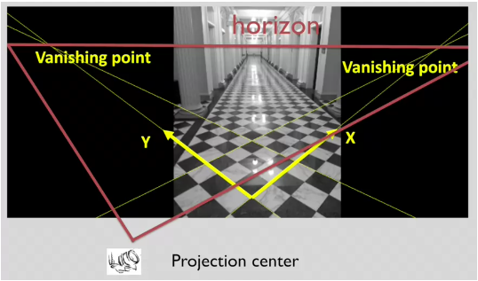

Where am I?

- vanishing points/known planar object/known 3D object

- Multiple images from different views (point correspondence)

- 8 points/bundle adjustment (nonlinear least square)

### Camera Modeling

How did birds(gannets) estimate the distance to the water? Estimate the time to collision (not distance) from the visual optical flow field. In robotics we use all kinds of cameras: 

- panoramic
- depth (kinect)
- laser scanner
- stereo

Two basic elements of an camera:

- image chip, such as CMOS chip
- lens

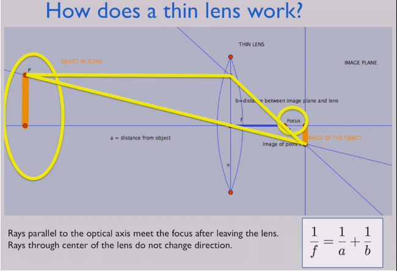

b is what can be controlled (focusing)

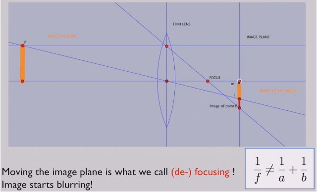

size of object image

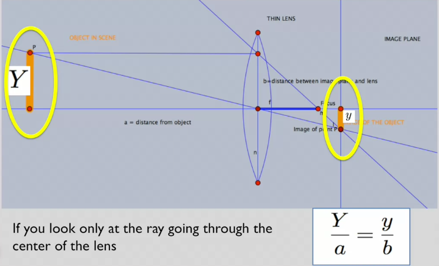

- a point object of the same size coming closer results on a larger image
- a point moving to the same ray does not change its image (ambiguity) - projected to the same point

### Single View Geometry

The 3 dimensional location becomes a 2 dimensional plane in camera coordinate. How relative orientation of the camera w.r.t the object.

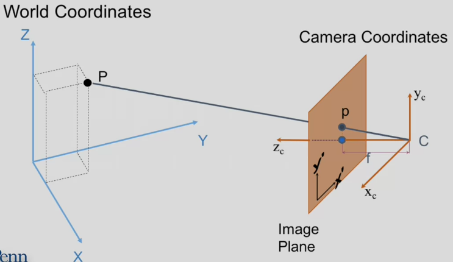

Construct 3D scene from 2D image.

Unwarp:

​	make the parallel lines parallel again (rectify)

Vanishing points; Vanish line

To reason where is the camera

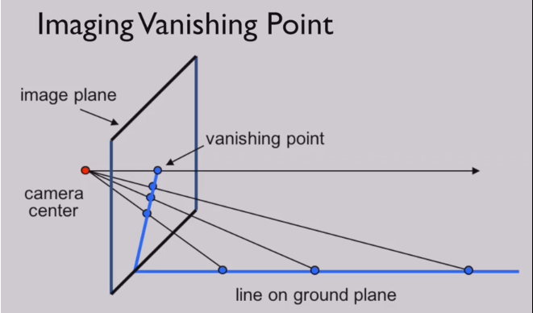

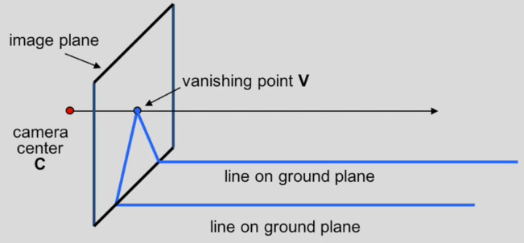

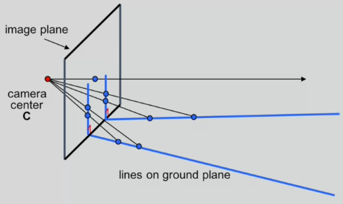

### More on Perspective Projection (透视投影)

elegant mechanism design

A circle is projected into an ellipse through perspective projection

Effect of distance of projection center from image plane: only the size not the shape of the ellipse changes!

The two parameters that we can directly control using the bi-perspectograph construction are:

- Focal length
- Height of the camera

### Glimpse on Vanishing Points

Vanishing points properties:

- Any two parallel lines have the same vanishing points
- The ray from C (camera center) through v (vanishing) point is parallel to the lines (see above image)
- An image may have more than one vanishing points

Multiple vanishing points

- Any set of parallel lines on the plane define a vanishing point (direction)
- The union of all of these vanishing points is the *horizon line*, aka vanishing line
- Note that different planes define different vanishing lines

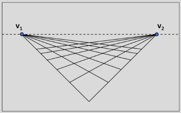

The horizon is the set of all directions to infinity for a plane

Computing vanishing line

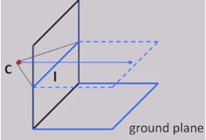

- I is intersection of horizontal plane through C with image plane
- Compute I from two sets of parallel lines on ground plane
- All points at same height as C project to I
- Provides way of comparing height of objects in the scene (the horizontal tells how tall is the camera)

image illusion

### Perspective Projection and Projective Geometry I

Connecting two vanishing points (or more), we get the horizon (to infinity). Artist could create multiple vanishing points in drawing to create illusion (cool). Vanishing points can be out of the image

How do we express these in the algebraic formulations: Homogeneous coordinate - why do we need

- represent points at infinity, homographies, perspective projection, multi-view relationships

Geometric intuition: a point in the image is a ray in projective space.

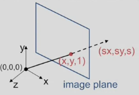

The project plane: $(x, y, 1)$; Each point $(x,y)$ on the plane is represented by a ray $(sx, sy, s)$

- All points on the ray are equivalent $(x,y,1)=(sx,sy,s)$
- coordinates in 2 dimensions with a 3-vector $[x, y]^T->[x, y, 1]^T$

What does a line in the image correspond to in projective space

- A line is a plane of rays through origins
  - all rays $(x, y, z)$ satisfying $ax+by+cz = 0$; $(a, b, c)$ are plane norm
- A line is also represented as a homogeneous 3-vector I

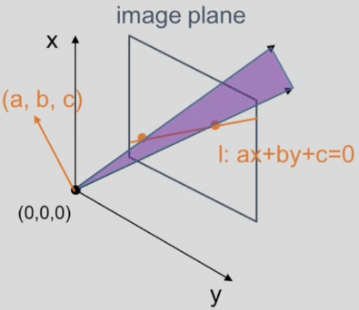

forming a plane

Line representation

- $\rho=xcos\theta+ysin\theta$ or
- $ax+by+c=0$

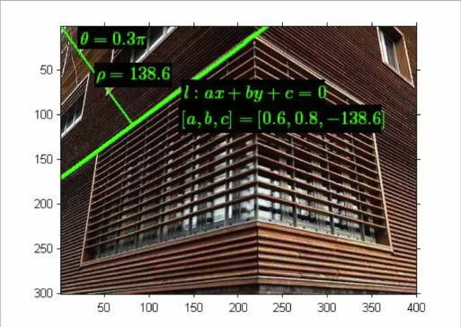

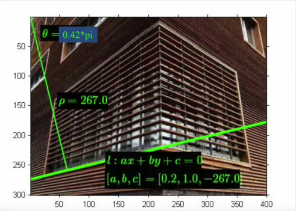

two lines are not parallel in plane

### Perspective Projection and Projective Geometry II

Two points form a line; Two lines interact at one point

How to define a line passing through two points

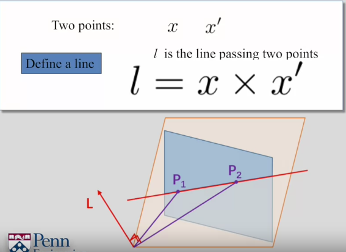

2D points are actually 3D rays

Two lines intersect at one point

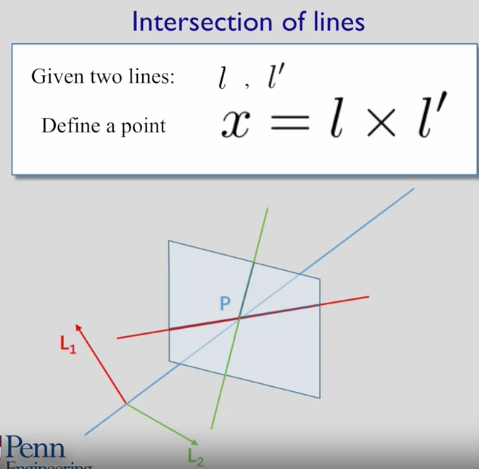

test verification

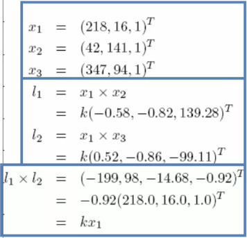

 points as a three-dimensional rays, lines as three dimensional planes

### Point-Line Duality

- A line **I** is a homogeneous 3-vector (so is a plane)
- It is $\perp$ to every point (ray) **p** on the line $Ip = 0$
- line **I** spanned by rays **p1, p2**
  - **I** is $\perp$ to **p1, p2** -> $I=p1 \times p2$
  - **I** is the plane normal
- the intersection of two lines **$I_1, I_2$**
  - **p** is $\perp$ to **$I_1, I_2$** -> $p = I_1 \times I_2$
- Points and lines are *dual* in projective space
  - given any formula, can switch the meaning of points and lines go get another formula


When P has the form $(x, y, 0)$?

- every points in the image plane has a coordinate of $(x, y, 1)$
- there are one infinity point associated with every parallel set of lines in an image
- consider two parallel lines $x=1; x=2$, intersection of $\det\begin{vmatrix}i & j & k\\-1 & 0 & 1 \\ -1 & 0 & 2\end{vmatrix} = (0, 1, 0)^T$, which is point at infinity in the direction of y
- Under projective transformation
  - all parallel lines intersect at the point at infinity
  - one point at infinity <-> one parallel line direction

Line at infinity

- A line passing all points at infinity $l_{\infin}=(0,0,1)^T$

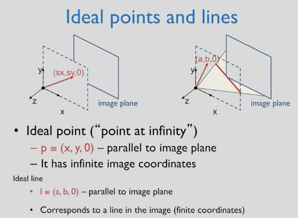

Q: line $y=1, y=2$ intersect at:

A: $(-1, 0, 0)^T and (1, 0, 0)^T$

### Rotations and Translations

RGB <-> XYZ

transformation from world frame to the camera frame

$^cP = {^c}R_w {^w}P+^cT_w$

Inverse transformation

How to compose motions?

- When we move coordinate frames and we refer to the most recent coordinate frame we always post-multiply

### Pinhole Camera

Optical center and focal length from intrinsics (triangle of vanishing points)

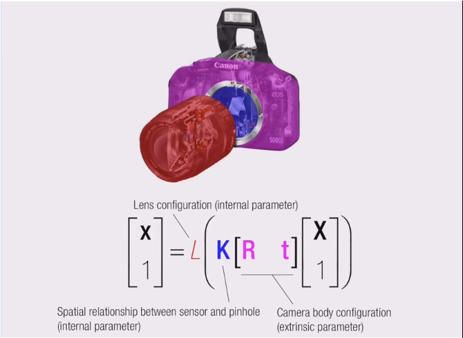

Three parts of the camera projection (TODO: revisit this image interpretation):

- pink: camera body itself, encodes the camera orientation and position in the world
- blue: inside the camera itself, transforms the optical measurements of the light coming through the camera into pixels. And the pictures we'll be working on
- red: focal lens of the lens itself

Transformation from 3D to 2D

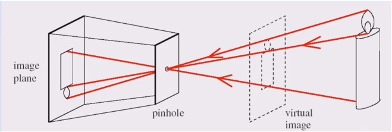

reverse canvas

mathematically, we can think of there's a virtual canvas plane in front of the eye and the geometrical relationship forming a picture behind us is the same as a canvas in front of us

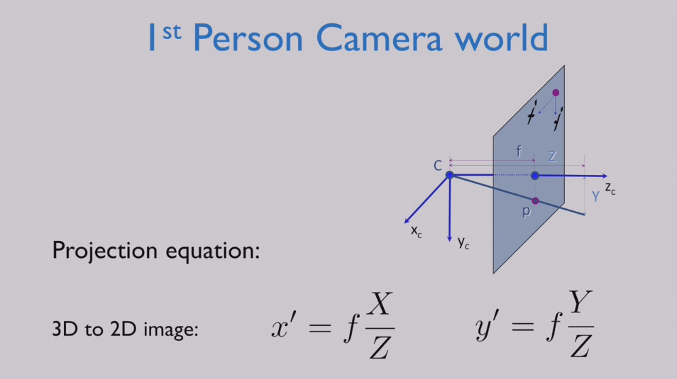

1st Person Camera World: I, the cameraman (eyeball) is located at $(0, 0)$ origin of the universe and everything is measured in 3D space relative to me. having an x-axis or in the horizontal direction, I will point in x-axis direction in the horizontal to the right. 

The image plane of the camera is a fixed size, therefore if we take the image plane further out by increase the focal lengths, our field of view will get smaller.

- Where is the Center of Projection?
  - think of reversing the camera as a reverse projector, where the camera optical center is a light source and the image plane is a picture, and we project the image on the image plane onto the ground plane.

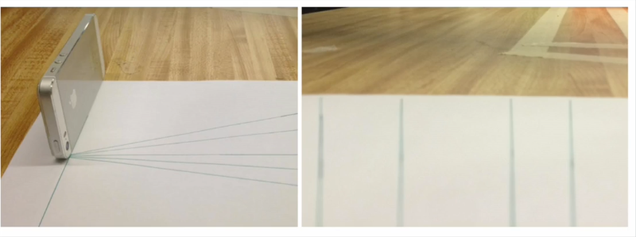


- What is the Focal Length?

### Focal Length and Dolly Zoom Effect

Cell phone usually has very small focal length due to the size constraint (mm order) vs. camera with 1700mm focal length

The process of changing the focal length is also called "zooming"

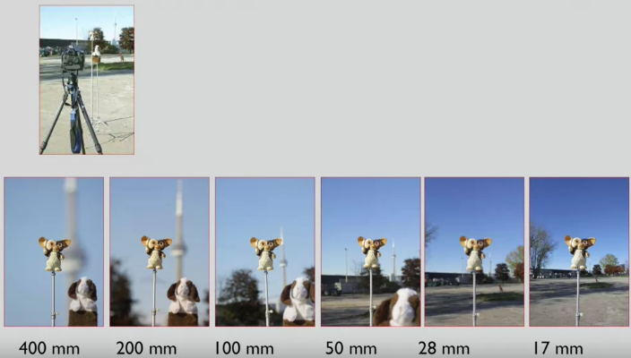

Large focal length compresses depth because the *optical center and focal lens changes occur simultaneously*

Changing zooms creates an interesting visual sensation of moving the background object in space by simply changing the focal lens. This is very different from just magnifying the picture itself.

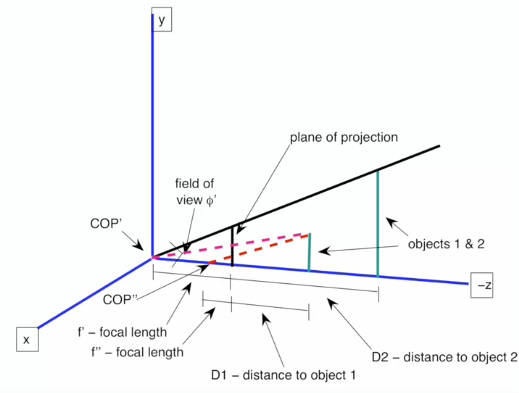

The camera center is moving as well

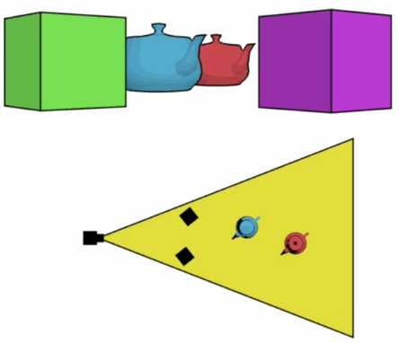

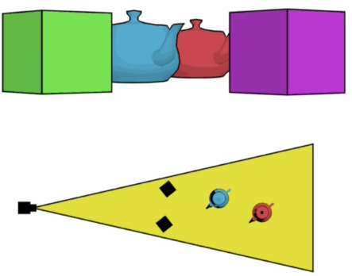

moving the camera back in z to increase the focal length and decrease the field view. By careful design,t he green cube stay at 400 pixels tall

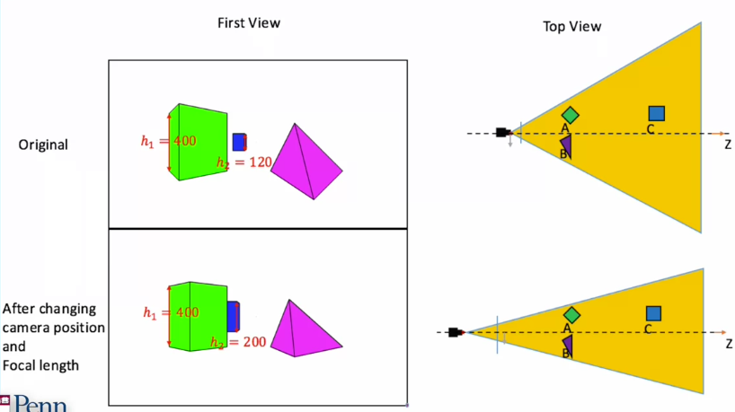

### Intrinsic Camera Parameter

- Step 1: Camera projection matrix

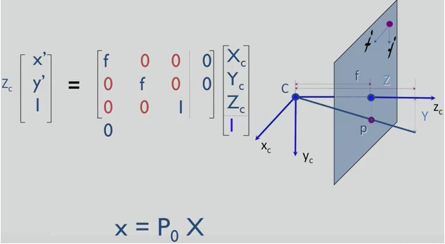

**Conversion from mm to pixels**

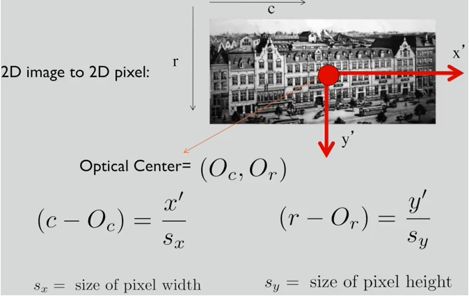

- 2D image, origin is generally at top left corner
- optical center: principal point; shift principal point to the image origin and scale

- Step 2: Intrinsic camera parameters: Map camera coordinate to pixel coordinate

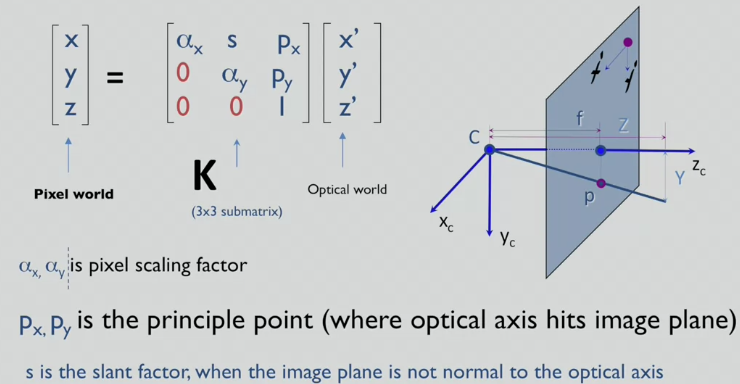

installation affect this matrix

combine the Intrinsic camera parameters:

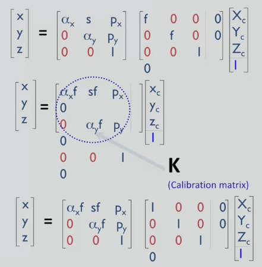

So, the 1st person camera projection (this first person camera projection matrix is a transformation of a three  dimensional world in the first person measurements, me, shrinking from a three dimensional space down to a two dimensional space. )


- A scale factor that converts physical focal length to pixel unit, i.e. $f(mm)->f_x(pixel)$
- Position of image center (principal point), i.e. $p_x, p_y$
- A skew factor between x and y axis of the image, i.e. $u_{img}=f_xx+sy+p_x$

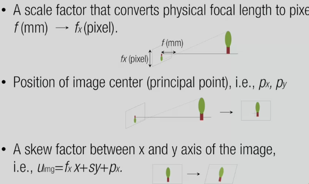

### Multiple View Geometry: 3D World to first person transformation

observe the world from multiple directions

We long longer have the luxury of thinking, using the first person measurements. Have to share a common representation between all different views

- Step 3: 3rd person to 1st person 3D mapping: the world to camera coordinates


transform from world center to the camera center

Combing Internal and External parameters

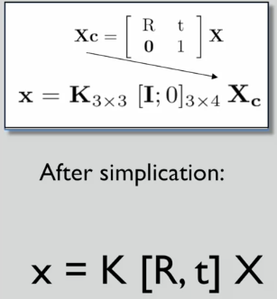

Ideal perspective projection

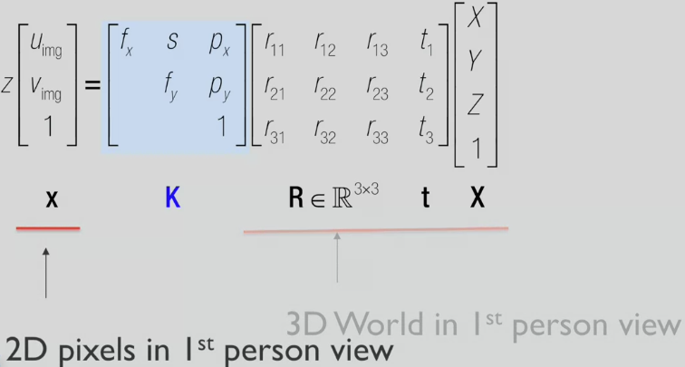

Two special cases:

- planar world, homograph

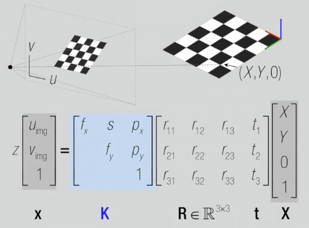

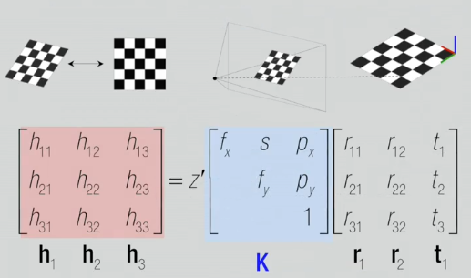

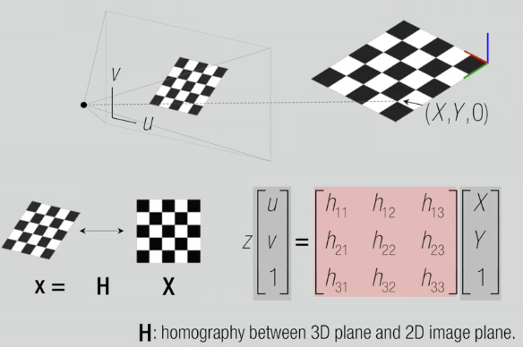

$X, Y$ is on the physical 3D plane, measured on the checkerboard, we know exactly the size of the checkerboard and its exact X, Y coordinates on the checkerboard image itself.  And those positions are transformed by the 3x3 matrix into the image. The image we took of that plane could look quite skewed depending on the orientation of the camera.

- Rotating camera

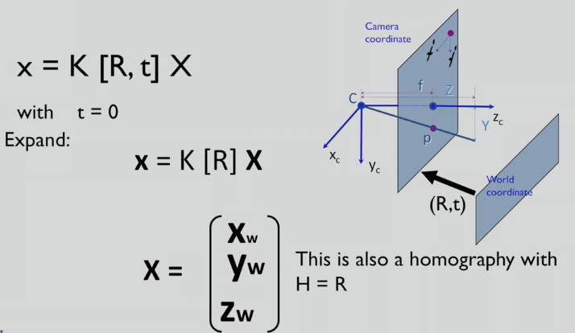

this can be used to create Panoramas

### How to compute Intrinsics from vanishing points

focal length: the distance of the image plane from the projection center from our lens.

horizon (the line at infinity); horizon tell use about how the camera is tilted or panned, thus giving us the orientation of the ground plane with respect to the camera

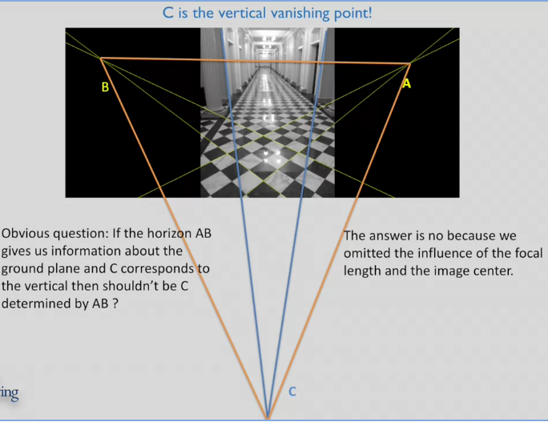

Three orthogonal vanishing points allow computation of focal length and image center. How can we compute the image center and the focal length without any calibration, from a single image.


$H$ is the orthocenter of the triangle ABC. There is theorem in Euclidean geometry, if we have a tetrahedron and we take the line between the vertex $O$ and the orthocenter $H$, then this line will be perpendicular to this plane (the optical axis).

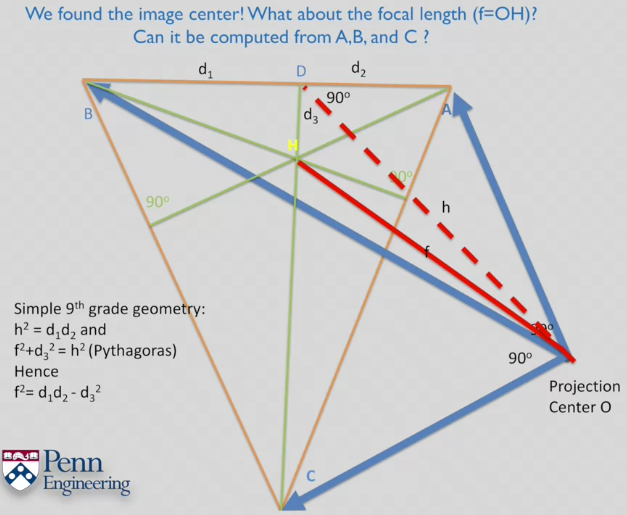

$d1, d2, d3$ can be measured in pixels

Summarize, in a picture of Manhattan world, where we have three directions of orthogonal parallel lines. And we assume these parallel lines are projected to lines of the image which intersect at vanishing points which we can compute. The orthocenter is the image center.

*The image center is the orthocenter of the triangle formed by the projections of three orthogonal vanishing points*

Q: Assume the image center has been computed. Then, under which conditions can we compute the focal length from the image projections of three orthogonal vanishing points?

A: A least two of the vanishing points are not at infinity - TODO

### Camera Calibration

find the camera parameters

- focal length
- image center
- image distortion
- the position of the camera w.r.t fixed reference frame

camera projection matrix $P$ (3x4)

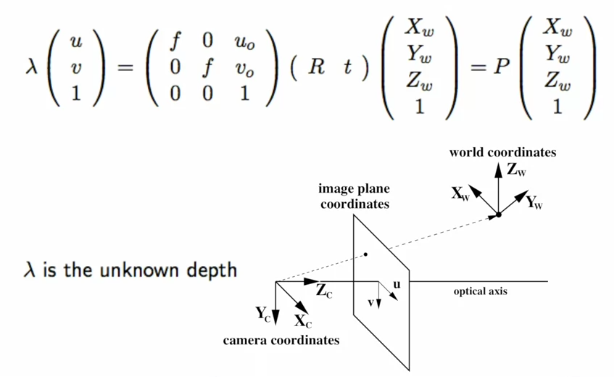

there are parameters that cannot be modeled linearly

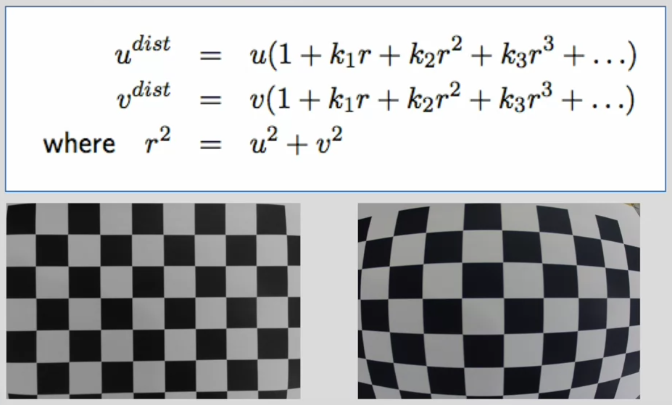

Cameras (e.g. with fisheye lenses) with large field of view have radial distortions. straight lines in the world, don't get straight lines in the picture anymore. These curved liens all distorted w.r.t the center. Radial distortion: the pixel points is distorted proportionally to the radius from the center. We model this as polynomials

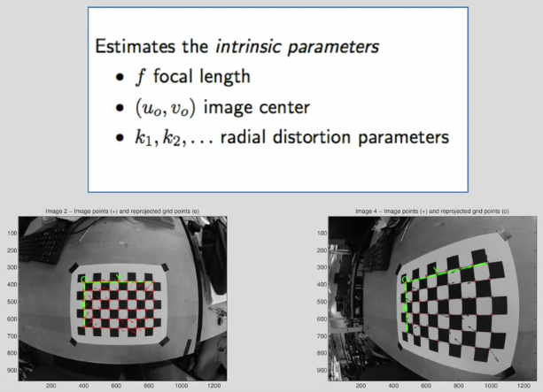

calibration with optimization

undistort the images and video

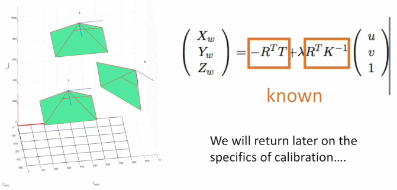

when pixels are not square, focal lengths can be different

For calibration, we need to know the size of the checkerboard squares

after calibration, save the parameter, which will be used for many other problems, e.g. pose estimation, structure from motion, triangulation or stereo.

For verification, we can use "Reproject Coordinates", which will show the undistorted image without the radial distortion.

### Homework: Dolly Zoom

It keeps the size of an object of interests constant in the image, while making the foreground and background object appear larger or smaller by adjusting focal length and moving the camera.

Given 3D coordinates of vertices, we will complete a function, compute focal length that finds focal length such that the height of the object A remains constant while the camera moves along with Z axis. The reference depth, reference focal length and height of the object A and the camera movement will be given.

A point in 3D is projected onto the image plane through the pinhole (center of projection, COP):

$u=f\frac{X}{Z}, v = f\frac{Y}{Z}$

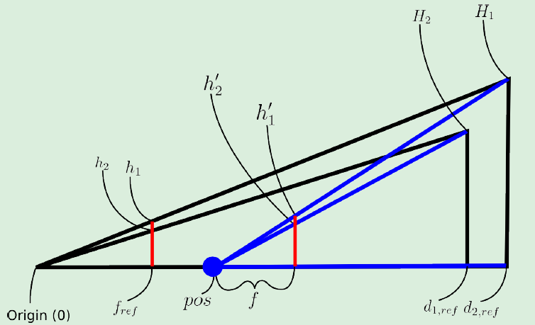

When the camera moves along with its Z-axis, the depth, Z changes and therefore, the projection $(u,v)$ changes

This projection change produced by the depth change can be compensated by adjusting focal length

$u=f_{ref}\frac{X}{Z_{ref}}=f'\frac{X}{Z_{ref}-pos}$

where pos is the movement of the camera along its Z axis (+ direction indicates approaching to objects) and $f'$ is the modified focal length. *Dolly zoom effect exploits the compensation between depth and focal length, which produces depth sensation*

## 2. Projective Transformations

Fourier transforms, convolution operators for 1D and 2D signals (images) and Canny algorithm for edge detection

### Vanishing Points; How to compute Camera orientation

Two factors in camera 3D-2D transformation

- camera rotation and translation
- pixel transformation or the camera calibration matrix $K$


z vanishing points with camera calibration matrix

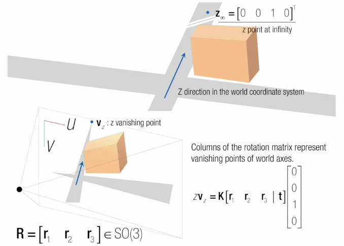

$r_1, r_2, t$ all disappeared

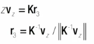

Geometry interpolation

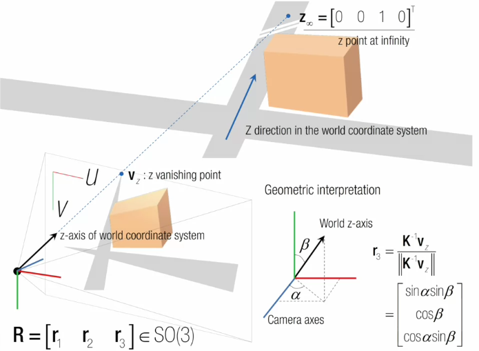

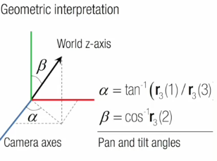

To figure out all three angle rotation, we need two vanishing points in the perpendicular direction.

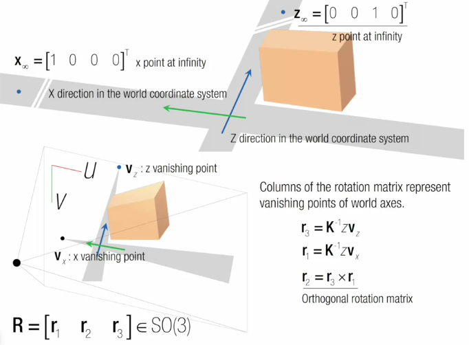

example


recover camera orientation and calculate pan/tilt angle


How to recover both orientation and translation

Homography

s

i.e. $zm=\tilde{H}[X,Y,1]^T$


How to estimate the rotation and translation of the robot from the world point of view?

- In the case of moving robot (rather than moving target), we need to know the orientation/position of the robot in the world; we need to know how to pan/tilt the world oriented to the robot;
- Note: pan/tilt of the camera is very different from the pan/tilt of the world!


The equation of line $l$ in $P^2$ has the form $l^Tx=0$

### Compute Projective Transformations

A perspective projection of a plane (like a camera image) is always a projective transformation

For example, we can use the projective transformation to estimate the pose of an aerial robot with respect to a planar pattern


definition


The most important property of projective transformation is that it preserves incidence:

- Three collinear points are mapped to three collinear points
- and three concurrent lines are mapped to three concurrent lines


for lines


projective transformation mapping (unique)


$A, B$ are vanishing points


we need 4th point D


we can let $\gamma=1$


Four points not three of them collinear suffice to recover unambiguously projective transformation

virtual Billboards

What happens when the original set of points is not square?


with canonical points


For projective transformation $H:P^2->P^2$,at least 4 non-colinear points are required for estimation.

### Projective Transformation and Vanishing Points

The geometry interpolation of the projective transformation and how they relate to this vanishing point


projective transformation maps planes to planes.

Homography columns as vanishing points


Equation of horizon: $(h1\times h2)^T(x,y,1)^T=0$

If connect the horizon with the projection center (as shown); this makes a plane, and this plane is always parallel to the ground plane.

Horizon with projection center build a horizon plane with normal $(h1\times h2)$, and hence $(h1\times h2_)$ is the normal to the ground plane expressed in pixels!

Horizon gives complete info about how ground plane is oriented! If horizon is horizontal in the center it means that optical axis is parallel to groundplane!


Q: When the camera is zooming, do the vanishing points move?

A: Yes (so does camera translation)

### Cross Ratios and Single View Metrology

How to measure distance in single pictures


What is preserved under a projective transformation? Cross-Ratio!


cross-ratio is double ratio


What happens when one of the points is at infinity (in horizon)? 


While $D'$ is a finite point, $D$ on the original plane is at infinity

the ratio actually needs even less information

And vice versa, we can find where is the vanishing point if we know ratios in the ground plane! without even parallel lines


### Two View Soccer Metrology

Two views are the focus of this note. First, how to measure very simple things without knowing the relative orientation between the two cameras.


Goal Line Tech in the soccer field; FIFA uses computer vision. Today multiple cameras with every accurate relative pose tracked! The Hawk-Eye


if $H$ is the homography between points, then $l_s \sim H^{-T}l$

and the projection $p$ is intersection of two lines $p \sim H^{-T}l \times l'$

### Assignments

Use the concept of projective geometry and homographies to allow us to project an image onto a scene in a natural way that respects perspective.

The task is, for each image in the video sequence, compute the homography between the Penn logo and the goal, and then warp the goal points onto the ones in the Penn logo to generate a projection of the logo onto the video frame.

- est_homography estimates the homography that maps the video image points onto the logo points (i.e. $x_{logo} \sim x_{video}$)
- warp_pts then warps the sample points according to this homography, returning the warped positions of the points (that is, the corresponding points in the logo image)
- Use these correspondence to copy the points from the logo into the video image
- play_video and save_images allow to vie the results and save them to files

#### Homography Estimation

To project one image patch onto another, we need to calculate the homography between the two image patches. This homography is a 3x3 matrix that satisfies

$x_{logo} \sim Hx_{video}$ or equivalently $\lambda x_{logo} = Hx_{video}$

where $x_{video}, x_{logo}$ are homogeneous image coordinates from each patch and $\lambda$ is scaling constant.

$\lambda \begin{pmatrix}x_1'\\x_2'\\1\end{pmatrix}=\begin{pmatrix}h_{11} & h_{12} & h_{13}\\h_{21} & h_{22} & h_{23}\\h_{31} & h_{32} & h_{33}\end{pmatrix}\begin{pmatrix}x_1\\x_2\\1 \end{pmatrix}$

rearrange the above equation, we have

$\begin{pmatrix} a_x \\ a_y\end{pmatrix}h=0$

where

$a_x = (-x_1, -x_2, -1, 0, 0, 0, x_1x_1', x_2x_1', x_1')$

$a_y = (0, 0, 0, -x_1, -x_2, -1, x_1x_2', x_2x_2', x_2')$

$h=(h_{11}, h_{12},h_{13},h_{21},h_{22},h_{23},h_{31},h_{32},h_{33})^T$

matrix $H$ has 8 degrees of freedom, and so, as each point gives 2 sets of equations, we need 4 points to solve for $h$ uniquely. Given 4 points (e.g. image corners), we can concatenate these $n$ pair of points

$Ah=\begin{pmatrix} a_{x, 1} \\ a_{y, 1} \\ \vdots \\ a_{x, n} \\ a_{y, n}\end{pmatrix}h=0$

A size of $2n\times9$, there is a unique null space. Normally, we can use MATLAB's `null` function, however, due to the measurements noise, there may not be an $h$ such taht $Ah$ is exactly 0. Instead, we have, for small $\vec{\epsilon}$:

$Ah=\vec{\epsilon}$

To resolve this issue, we can find the vector $h$ that minimizes the norm of this $\vec{\epsilon}$. The vector $h$ will be the last column of $V$ for SVD decomposition of A

## 3. Pose Estimation

### Visual Features


Where am I if I see this image?

Features should be detected again even under severe scale changes, this property is called `detection invariance`

What we want from features?

- We should be able to match features using a descriptor of the neighborhood
- This descriptor should not change significantly under viewpoint changes like scale and rotation
- this property `descriptor invariance`

**Invariant detection and description**

Probably the most challenging of all properties is the scale invariance!

- Feature detection with automatic scale selection
- Distinctive image features from scale-invariant keypoints (SIFT)

One of the most cited paper in CV (58315 as this writing)


using convolution as a sliding mask over the image. at every point, we take the inner product of this mask and the underlying intensities. $\sigma$ gives the covariance of the function or how it's spread the two dimensional Gaussians.

 A series of this blurred version of original images which are convolutions with different sigmas of the original elements is called the scale space in which we can write as the function $L(x,y,\sigma)$ the pixel position and the associated sigma.


The same scale but subsampled. We subsampled it every time that the sigma of the Gaussian was doubled! a pyramid of images

we look at the same pixel across scale


Where is a SIFT keypoint?


In the actual algorithm, the way it works is like this, we have the x y image and we have several images in scale space. So for one point it has eight neighbors at the same scale and has nine neighbors at the scale which is coarser, and nine neighbors at a scale which is finer. In this 3x3x3 neighborhood if this point has the maximum response of the Laplacian, then we say, that this is a SIFT keypoint. 

Vedaldi's vlfeat (VLFeat.org)


we can use this to create Image Mosaic, find location (find a match in a dataset of given images), robot scene understanding

Image Mosaic:

- get an image pair
- establish correspondences between matching features
- keep only consistent matches (inliers)
- compute (least squares) homography and warp 2nd image
- repeat and extend the mosaic

#### Summary

SIFT Features

- SIFT detector can automatically
  - select scale
  - compute dominant rotation
- SIFT descriptor
  - is a grid of histogram of gradient orientations
  - on a region normalized with respect to scale and rotation

#### Q&A

Features can be useful for

- Image based localization
- Image retrieval
- Scene reconstruction
- Panorama stitching

What properties of features are desirable?

- Detection invariance
- Descriptor invariance

A scale space of an image can be build by

- convolving with gaussian filters and subsampling

The scale of a feature is chosen by first convolving the corresponding image patch with Difference-of-Gaussian (DoG) filters and then, by taking the maximum response over all scales.

The SIF detector is

- scale and rotation invariant

To compute the SIFT descriptor

- We compute a histogram of gradients in a 16 by 16 grid and rotate them to have the largest magnitude gradient oriented upwards

### Singular Value Decomposition (SVD)


we can think of the U matrix as set of basis


for example, if A is made of curve, and since this space where every column of A is a curve, we can think of the U matrix enclose the basis function, where the first base is a horizonal curve, and the second basis function is a curve going down, and the third basis encode a curve going up and down. Then we can think of matrix V together with the singular value d, provides a coefficient for every column A. So, the coefficient of the $\beta_1, \beta_2, \beta_3$. It provides a reconstruction in column of A.


```matlab
Im2 = u(:, 1:20)*d(1:20, 1:20)*v(:,1:20)';
```


eigenfaces: interesting


Matrix inversion with SVD


Least square problems


null space of A

$Ax=b$ cases:


trivial solution $x=0$


$Ax=0$ homogeneous cases


The minimizer of the fitting close $||Ax||_2^2$ with $A\in R^{m\times n}, m>n$ subject to $||x||_2=1$ is

- The eigenvector of $A^TA$ corresponding to the smallest eigenvalue

A symmetric real matrix has real eigenvalues and real singular values. which of the following is true?

- [ ] singular values are equal to the eigenvalues
- [ ] all singular values are nonnegative
- [ ] all eigenvalues are nonnegative

Note (Moler: https://www.mathworks.com/content/dam/mathworks/mathworks-dot-com/moler/eigs.pdf):

- An *eigenvalue* and *eigenvector* of a square matrix $A$ are a scalar $\lambda$ and a nonzero vector $x$ so that $Ax=\lambda x$
- A *singular value​* and pair of *singular vectors* of a square matrix or rectangular matrix $A$ are a nonnegative scalar $\sigma$ and two nonzero vectors $u, v$ so that $Av=\sigma u; A^Hu=\sigma v$, where $A^H$ stands for *Hermitian transpose* and denotes the complex conjugate transpose of a complex matrix. If the matrix is real, then $A^T$ denotes the same matrix
- eigenvalue means "characteristic value"; the term "singular value" relates to the distance between a matrix and the set of singular matrices
- Eigenvalues play an important role in situations where the matrix is a transformation from one vector space onto itself. Systems of linear ordinary differential equations are the primary examples. The values of $\lambda$ can correspond to frequencies of vibration, or critical values of stability parameters, or energy levels of atoms. Singular values play an important role where the matrix is a transformation from one vector space to a different vector space, possibly with a different dimension. Systems of over- or underdetermined algebraic equations are the primary examples.
- eigenvalue-eigenvector equation: $(A-\lambda I)x=0, x\neq 0 => det(A-\lambda I) = 0$. This definition of an eigenvalue, which does not directly involve the corresponding eigenvector, is the *characteristic equation/polynomial* of $A$. The degree of the polynomial is the order of the matrix. Like the determinant itself, the characteristic polynomial is useful in theoretical considerations and hand calculations, but does not provide a sound basis for robust numerical software
- SVD: $A = U\Sigma V^H$ with diagonal $\Sigma$ and orthogonal (if real) or unitary (if complex) $U, V$.  If $A$ is $m\times n$ and $m>n$, then in full SVD, $U$ is a large, square $m\times m$ matrix. The last $m-n$ columns of $U$ are "extra" and not needed to reconstruct $A$. The economy SVD saves memory.


```matlab
# example
A = gallery(3);
>> eig(A)

ans =
    1.0000
    2.0000
    3.0000
    
>> [U,S,V] = svd(A)
U =
   -0.2691   -0.6798    0.6822
    0.9620   -0.1557    0.2243
   -0.0463    0.7167    0.6959

S =
  817.7597         0         0
         0    2.4750         0
         0         0    0.0030

V =
    0.6823   -0.6671    0.2990
    0.2287   -0.1937   -0.9540
    0.6944    0.7193    0.0204
```

### RANSAC: Random Sample Consensus I

We need to remove noise before applying the solution.


Strategy: to find a model that accords with the maximum number of samples

Assumptions

- Majority of good samples agree with the underlying model (good apples are same and simple)
- Bad samples does not consistently agree with a single model (all bad apples are different and complicated)


A good model will receive more votes.


Assume we have a case for RANSAC with 300 samples and 200 inliers. 

- If we pick $n=10$ samples to build our model, what is the probability that we will build the correct model? $(1-200/300)^{10} = 0.017$
- what is the probability that we won't build a correct model after $k=100$ iterations? $(1-w^n)^k = 0.174$
- How many iterations will we need at least, in case the desired RANSAC success rate is $p\geq0.99$? $k>264$

### Where am I

Estimating the camera pose from the image: where am I?

epipolar geometry between images; virtual reality

Homography linear estimation


Inside the $H$ matrix, encodes both the camera calibration matrix $K$ as well as the rotation matrix $R$ and the translation $t$ between the plane and the camera center. It all shrunk into this compact form of $H$ matrix of 9 elements.


$H$ matrix has 9 elements, but we can scale it any way we want it, thus one DoF can be removed. Once we have the least square program set up, we can obtain the solution for $H$ by solving the smallest eigenvector and take the last column of $V$, which is the reshaped $H$ matrix


We can convert $H$ matrix into the optical space through the $H$ inverse transformation. Given that the first two columns of the transform H matrix, in fact, its rotation matrix one column, rotation matrix two columns followed by transformation vector t. And we can renormalize it to obtain a proper rotation matrix to ensure the first column of $r=1$, the norm of that equal to 1. 

### Where am I - 2

a general case where we are looking a general 3D scene through a 2D picture and taking different pictures when moving around


Can we identify the exact location of the right image, in the 3D space, as well as orientation of this camera on the space shown on the left? This is a general camera 3D registration problem

**Perspective-n-Point** algorithm


$P$ is $3\times4$ matrix; need 6 corresponding points


Rotation has to be orthogonal

### Pose from 3D Point Correspondences: The Procrustes Problem

Given two shapes find the scaling, rotation, and translation that fits one into the other


3D-3D registration enables the creation of 3D models from multiple point clouds

The minimum number of points needed


the above equation yields the same result as umRot

3D registration for 3D model creation


### Pose from Projective Transformations

localize a robot given a projective transformation


Any transformation that is invertible, can be a projective transformation


Where is the camera

Pose estimation means find $R, T$ given $H$ and intrinsics $K$


find where is the camera and how it is oriented

### Pose from Point Correspondences PnP/P3P

the perspective N Point Problem (PnP)

We need a 3rd point: the perspective 3-Point problem of P3P or in Photogrammetry the Resection problem: The Snellius-Pothenot problem.

---

The perspective-three-point(P3P) problem, aka the absolute camera pose estimation problem, is one the most classical and fundamental problem in computer vision that determines the pose of a calibrated camera, i.e. the rotation and the translation, from three pairs of 3D points and its projection on the image plane. It can be extended to more complex camera pose estimation problems, e.g. for least square case with n points (PnP) problem for uncalibrated cameras with unknown internal parameters such as focal length or lens distortion (P3.5P, P4P, P5P, PnPf, PnPfr problems)

Classical methods for the P3P problem consist of two steps:  first,  find the distances between the camera center and the given three 3D points; then, estimate the camera pose by solving an alignment problem of two triangles.

- The first step formulates a quartic equation with respect to one of the three distances by eliminating the other two based on the law of cosines.  
- After finding the roots of the quartic equation, the second step solves the alignment problem, which is a rigid transformation between two triangles, by using a 4×4eigenvalue decomposition or 3×3 singular value decomposition.  Due to operations of the matrix decomposition, the numerical accuracy of the final solution becomes low despite its time-consuming processing.

Direct approaches: geometric approaches and algebraic approaches


PnP is the problem of estimating the pose of a calibrated camera given a set of $n$ 3D points in the world and their corresponding 2D projections in the image. The camera pose consists of 6DoF with respect to the world. This problem originates from camera calibration and has many applications in computer vision and other areas, including 3D pose estimation, robotics and augmented reality. A commonly used solution to the problem exists fro $n=3$ called P3P, and many solutions are available for the general case of $n\ge 3$. A solution for $n=2$ exists if feature orientations are available at the two points. Implementations of these solutions are available in open source software.

$sp_c=K[R|T]p_w$

$s\begin{bmatrix}u\\v\\1\end{bmatrix} = \begin{bmatrix}f_x & \gamma & u_0 \\ 0& f_y & v_0 \\ 0&0&1\end{bmatrix} \begin{bmatrix}r_{11} & r_{12} & r_{13} & t_1\\ r_{21} & r_{22}& r_{23} & t2\\ r_{31} & r_{32}& r_{33} & t3\end{bmatrix} \begin{bmatrix}x\\y\\z\\1\end{bmatrix}$

- $p_w$: homogeneous world point
- $p_c$: corresponding homogeneous image point
- $K$: calibrated intrinsic camera parameters (focal lengths, principal point, and skew parameter $\gamma$)
- $s$: scale factor for the image point
- $R, T$: unknown extrinsic parameters to be estimated

Note:

- the chosen point correspondences cannot be colinear
- PnP can have multiple solutions and choosing a particular solution would require post-processing of the solution set. RANSAC is also commonly used with a PnP method to make the solution robust to outliers.
- P3P methods assume the data is noise free; most PnP methods assume Gaussian noise on the linear set

----


if we can recover $d_i, d_j$, the rest will be an absolute orientation problem

$\lambda_j p_j = RP_j + T$

using cosine law, with 3 points we could solve 3 quadratic equations

Direct solution of the PnP problem


solve linear for these unknows and find the closet rotation matrix; $R'$ does not necessarily to be orthogonal

Q: What is the minimum number of point correspondences required for camera pose estimation given the perspective projections of points with known world coordinates?

A: 3

Q: Assume that all points in the world lie on the plane $Z_w=0$, let $K$ denote the camera calibration matrix. The transformation from the world frame to the camera frame reads $RX_w+T$, where $R=(r_1, r_2, r_3)$. What is the projective transformation from the world plane to the camera?

$K(r1, r2, T)$

Q: What is the maximum number of solutions obtained from solving the P3P?

4

From paper: Complete solution classification for the Perspective-Three-Point Problem

*the P3P problem has either an infinite number of solutions or at most four physical solutions*.

## 4. Multi-View Geometry

What makes a good feature and how can we reliably detect them in the face of image deformation?

### Epipolar Geometry I

Given two pictures of the same scene, how to compute the relative translation, rotation between them.

point correspondence


8 points


$X_1$ is point in Bob's coordinate system

bilinear relationship between $X_1, X_2$


As we sweep through the planes through the space. The orientation of the plane will change depends on which point in 3D we point to. But the base of this plane had to connect Bob and Mike and that base stay invariant. All the epipolar lines in the field of view converge into a single point, called `epipole`

#### Epipolar line computation

numerical computation


Epipole computation


### Epipolar Geometry II

Essential matrix and Fundamental matrix


$K$ reduces a 3D vector from camera frame to image frame


fundamental matrix: $F = K^{-T}EK^{-1}$

a giant $3\times3$ matrix

Fundamental matrix estimation


8 Point algorithm


$F$ needs to be rank 2

In practice, this requires us to painfully click on 8 corresponding points. If we are very precise for the 8 corresponding points, the procedure before can allow to compute the fundamentals exactly. In we want to automate this process, we need to have an automatic feature correspondence algorithm, and for automatic feature algorithm, it's not guaranteed we have exact respondents. Some will be noise, outliers, and we need to apply the RANSAC algorithm to reject those outliers.


Example

1. From the least square computation, compute $F$ matrix by reshaping the vector. Clean it up making rank 2 to get reconstructive fundamental matrix


2. Given any corresponding point in the left image, we have an epipole aligned in the right image. $Fx$ can be thought as as if we pull a line in the right hand image. We re-express the epipolar line such that the line equation has the property that the first two elements sum up to 1, which gives us the orientation of this line cos and sin.


3. Similarly, we can get the line in the left image
4. Where is the epipole? Epipole of the left image is simply the null space of the fundamentals $F$.  We then normalize the last element to be one to plot it in the image


5. Epipole in the right image; it needs to be normalized as well


### Epipolar Geometry III

Goal: Recovery of $R, T$ from Fundamental matrix

Recall one property of the fundamental matrix is allowing us to see epipole lines from one image to the other. As well as intersecting those epipole lines into those epipoles.

The epipole point in the left image corresponding to the camera center in the right

Recall the bilinear equation of the fundamental matrix that relates a point on the left image to a point on the right image $x_2^TFx_1=0$ where $F=K^{-T}EK^{-1}$, and we can obtain the essential matrix $E = K^TFK$

How to uncover the translation, rotation from the essential matrix $E$?


go back to reconstruct the rotation matrix


summary; procedures

- given two images; compute fundamental matrix between two views; transform the fundamental matrix through the camera calibration to the essential matrix
- decompose the essential matrix into translation vectors and rotation matrix
- take singular value decomposition of E


Camera pose disambiguation via point triangulation


**Point Triangulation**


rank is 2 even for many cameras

Triangulation example


in the above simple example, the second camera simply moves to the right, so the translation between the two is [1, 0, 0]


We can apply the same procedure to all the points in the space to reconstruct 3D point clouds.


Disambiguation


Translation and rotation in the world coordinate system


#### Q&A

1. Consider two images $x_1, x_2$ of the same point $p$ from two camera positions with relative pose $(R,T)\in SE(3)$, where $R\in SO(3)$ is the relative orientation and $T \in R^3$ is the relative position. Then $x_1,x_2$ always satisfy:

   $x_2^T\hat{T}Rx_1=0$

2. Let two cameras with poses $g1=(R_1,T_1)\in SE(3)$ and $g2=(R_2,T_2)\in SE(3)$. Note that the poses are such that a point $X_w$ in the world frame is transformed to the frame of camera $i$ as $X_{c,i} = R_i^T(X_w-T_i)$. What are the valid essential matrices, that they satisfy $x_1^TEx_2=0$ for all point correspondences $x_1 \leftrightarrow x_2$? For convenience let $T_{ij}:= T_j-T_i$ and $R_{ij} = R_i^TR_j$

   $E=\widehat{R_1^T T_{12}}R_{12}$ as well as $E=R_1^T\widehat{T_{12}}R_2$

   

3. The relative pose between two views is $(R,T)\in SE(3)$ where $R=I$ and $T$ corresponds to a translation of 1m in the direction of $z$-axis, what is the essential matrix? Hint: use the fact that $E=\hat{T}R$.

   $E=skew([0;0;1])I_4=\begin{bmatrix}0&-1&0\\ 1&0&0 \\ 0&0&0\end{bmatrix}$

4. A nonzero matrix $E\in R^{3\times 3}$ is an essential matrix if and only if $E$ has a singular value decomposition (SVD) $E=U\Sigma V^T$ with

   $\Sigma=diag(\sigma,\sigma,0)$ for some $\sigma>0$ and $U,V\in SO(3)$

5. Given a real matrix $F\in R^{3\times 3}$ with SVD $F=U diag(\lambda_1,\lambda_2, \lambda_3)V^T$ with $U,V\in SO(3), \lambda_1\ge \lambda_2 \ge \lambda_3$, then the essential matrix that minimizes the error $||E-F||_F^2$ is given by

   $E=Udiag(\sigma,0,0)V^T$ with $\sigma=(\lambda_1+\lambda_2+\lambda_3)/2$

6. How many point correspondences are required to obtain an essential matrix using the linear algorithm? 8

7. In general, given a normalized essential matrix, we get $m$ distinct poses $(R,T)$ and by enforcing the positive depth constraint, we end up with $n$ valid poses. what are $(m,n)$

   $(m,n)=(4,1)$

### RANSAC: Random Sample Consensus II

use least squares with confidence

With corresponding points ($\geq 8$) we can estimate the fundamental matrix between two images. And through that we can triangulate points in 3D as well as figure out a camera rotation and translation between them. We need to find an automatic way of finding correspondence between two views.


The above two images only has left-right relative motion, thus the corresponding lines should have just gone left and right. We will get bad fundamental matrix with bad inputs


### Nonlinear Least Squares I

Two types of linear least squares: $Ax=b$, $Ax=0$


Linear least squares has following properties


However, life is not always easy


nonlinear least square has multiple local minimums and need good initial solution

### Nonlinear Least Squares II

Nonlinear least square example: Perspective-n-Point algorithm: given a set of 3D points and 2D image of those points. How to estimate the rotation and translation between the cameras

stacking a $3\times 4$ matrix in a single column; solve SVD

the constraint $R\in SO(3)$; 3 DoF; 3 angles or four quaternion angles


Another example: Triangulation

the inverse of the above situation: we have the camera pose given and we want to triangulate these points in 3D space


however, this is insufficient; we could have noises due to lens distortion, correspondence error etc. $Ax \neq 0$

we will have reprojection error; we would want to minimize error in the pixel space not in the 3D space


optimization goal


red: measurement

blue: reprojection

unknown: $\tilde{X}$

everytime we take a homogenous ray back to the pixels' base, we have to divide


### Nonlinear Least Squares III

How to solve the nonlinear least square problem


local or global minimal; which direction to go

if the gradient is 0, it means that whichever direction it go, I couldn't change the cost function anymore

How far should I go along the gradient direction: Taylor expansion


However, the caveat is that *a different initialization converges to a different local solution*.

In practice, we could start from multiple points and take the gradient method to find local minimal and compare

#### Bundle Adjustment

In BA, the variables we are trying to seek are 3D location of point, the camera orientation and translation. For every image feature points we can measure, we will have one of the constraints.


### Optical Flow: 2D Point Correspondences

space time curve; frame to frame


time $t=0, t=1$; the intensity "motion"

brightness constancy constraint


we are seeking for the two dimensional (2D) shifts $d$ such that the bright images $I, J$ in alignment, i.e. minimize the error by finding the shift $d$ such that the arrow go down to zero. This is nonlinear least square problem, because the function mapping from pixels to intensity is not a linear function.

3 steps for solving this problem

- solve for $\frac{\delta E}{\delta d}|_{d^*}=0$ : necessary condition
- Taylor expansion on $J(x+d)$, where $J$ match pixel to intensity value : linearization
- Solve for d, warp image, iterate


simple painting process to create a new picture?

putting them (gradient and taylor expansion) together


we have two equations for each pixel in the image and having two unknows

$\frac{\delta J(x)}{\delta x}^T \frac{\delta J(x)}{\delta x}$ is known as "second moment matrix": $2\times 2$ matrix for each pixel


consider as a painting process


warp and iterate


track feature in time


### 3D velocities from Optical Flow

extract 3D velocities from optical flow

structure from motion; Videos taken from quadrotors are taken from a continuous trajectory. There is not a big base line between these frames, and we can characterize the geometry of this problem not with point correspondences but with velocity vectors (optical flow vectors) 

How can we infer the direction that the camera is moving from the video and from the optical flow that we can compute?

camera in driverless cars

the vector field and Focus of Expansion


mixed vector field


The above is about the directions of the vectors but how about their length

The camera kinematics: let's assume a fixed point $P$ in the scene, and the moving camera with linear velocity $V$ and angular velocity $\Omega$


Combine these together, we get the equation for the optical flow field


translational flow + rotational flow

For the above plotted vector field from the car. We see that while on the rotational field on the right there is no difference in the lengths. Whether the points are at infinity or very close to us, all of them are about the same. We see on the left that points in a infinity are hardly moving like the horizon is really not moving, and points close to us on the ground are moving very, very fast. 

*the rotational flow is independent of depth and the translational flow depends on depth*


if $Z$ is know from some depth sensor, then $\dot{p}$ is a linear function of $V, \Omega$. $V$ represent the Heading Direction

there are 3 unknowns in $V$, 3 unknows in $\Omega$, so with 3 optical vectors, we can recover these 3 velocities if we know the depth.

If we have only a rotational field, we don't need the depth information.


radial pattern; we just need two vectors to find the FOE; if $V_Z=0$, then we are moving just parallel to the image plane and the focus of expansion is at infinity


animals can estimate this time to collision (for animals with monocular system) - cool


How can we split (decompose) a mixed optical flow field


if we knew our translation, we would be able to find further rotation and the Z. If we know the $\Omega$ and the Z there is some way to find for the translation. We will find it which is just by solving a radial translational field. 

like a chicken and egg problem


We learned how to estimate the translation and rotation direction from a continuous video. This can be used for control and obstacles avoidance

### 3D Motion and Structure from Multiple Views

extract camera poses and structure from multiple views of the same scene

open source bundle adjustment method

>  Wikipedia: Given a set of images depicting a number of 3D points from different viewpoints, bundle adjustment can be defined as the problem of simultaneously refining the 3D coordinates describing the scene geometry, the parameters of the relative motion, and the optical characteristics of the camera(s) employed to acquire the images, according to an optimality criterion involving the corresponding image projections of all points.
>
> Bundle adjustment is almost always used as the last step of every feature-based [3D reconstruction](https://en.wikipedia.org/wiki/3D_reconstruction) algorithm. It amounts to an optimization problem on the 3D structure and viewing parameters (i.e., camera pose and possibly intrinsic calibration and radial distortion), to obtain a  reconstruction which is optimal under certain assumptions regarding the  noise pertaining to the observed[[1\]](https://en.wikipedia.org/wiki/Bundle_adjustment#cite_note-triggs1999-1) image features: If the image error is zero-mean Gaussian, then bundle adjustment is the [Maximum Likelihood Estimator](https://en.wikipedia.org/wiki/Maximum_likelihood).[[2\]](https://en.wikipedia.org/wiki/Bundle_adjustment#cite_note-sba2009-2):2 Its name refers to the bundles of light rays originating from each 3D feature and converging on each camera's optical center, which are adjusted optimally with respect to both the structure and viewing parameters
>
> Bundle adjustment boils down to minimizing the [reprojection error](https://en.wikipedia.org/wiki/Reprojection_error) between the image locations of  observed and predicted image points, which is expressed as the sum of  squares of a large number of nonlinear, real-valued functions. Thus, the minimization is achieved using nonlinear [least-squares](https://en.wikipedia.org/wiki/Least-squares) algorithms. Of these, [Levenberg–Marquardt](https://en.wikipedia.org/wiki/Levenberg–Marquardt_algorithm) has proven to be one of the most successful due to its ease of  implementation and its use of an effective damping strategy that lends  it the ability to converge quickly from a wide range of initial guesses. By iteratively linearizing the function to be minimized in the  neighborhood of the current estimate, the Levenberg–Marquardt algorithm  involves the solution of linear systems termed the [normal equations](https://en.wikipedia.org/wiki/Linear_least_squares_(mathematics)). When solving the minimization problems arising in the framework of bundle adjustment, the normal equations have a [sparse](https://en.wikipedia.org/wiki/Sparse_matrix) block structure owing to the lack of interaction among parameters for  different 3D points and cameras. This can be exploited to gain  tremendous computational benefits by employing a sparse variant of the  Levenberg–Marquardt algorithm which explicitly takes advantage of the  normal equations zeros pattern, avoiding storing and operating on  zero-elements.
>
> Bundle adjustment amounts to jointly refining a set of initial camera  and structure parameter estimates for finding the set of parameters that most accurately predict the locations of the observed points in the set of available images. Assume that $n$ 3D points are seen in $m$ views and let $x_{ij}$ be the projection of the $i$th point on image $j$. Let $v_{ij}$ denote the binary variables that 1 if point $i$ is visible in image $j$ and 0 otherwise. Assume also that each camera $j$ is parameterized by a vector $a_j$ and each 3D point $i$ by a vector $b_i$. Bundle adjustment minimizes the total reprojection error with respect to all 3D point and camera parameters, specifically
>
> $\underset{a_j, b_i}{\min}\sum_{i=1}^{n} \sum_{j=1}^m v_{i,j}d(Q(a_j, b_i), x_{ij)})^2$
>
> where $Q(a_j,b_i)$ is the predicted projection of point $i$ on image $j$ and $d(x,y)$ denotes the Euclidean distance between the image points represented by vectors $x, y$. Clearly, bundle adjustment is by definition tolerant to missing image projections and minimizes a physically meaningful criterion.

geometric vision using only 2D views in order to extract 3D models.

How many points we need and how many frames we need in order at least to get a unique solution.


Obviously, we cannot solve in a closed form solution, what need to do is called an adjustment


for all motions together


this will be used in visual odometry as well

### Visual Odometry

The emphasis of visual odometry is not on how to get the 3D structure but how to get the poses of a camera as a path; e.g. extract camera trajectory from a video


new field, not in textbooks but good reference tutorials in RAM: Visual Odometry: Part I - The first 30 years and Fundamentals; Part II - Matching, Robustness, and Applications

The Future of Real-Time SLAM: 2015 ICCV Workshop - [slides](http://wp.doc.ic.ac.uk/thefutureofslam/) available

Visual odometry on the MARS (curiosity) - most successful application, no way to drive with joy-stick; vacuum robot (Dyson 360 [Andrew Davison](https://www.doc.ic.ac.uk/~ajd/))


Visual odometry process

update for rotation and translation in 2 steps


the translation estimate is not enough at this step due to lack of scale


we always have essential matrices between the points. We compute the relative translation rotation with the two successive images and then need to integrate because we use this pairs of subsequent frames depending on the base line. Depending on how many features to track, this might become very vulnerable to "drift", which is the main problem of visual odometry. To address this issue, we group a window of frames and apply a bundle adjustment.


The advantage of these bundle adjustment is not only that we have a longer base line but also that we are going to use directly the back projection error with all the unknowns together. And this will create excellent local map.


Triangulation and Keyframe selection


While keyframe selection reduces drift, a large factor is the good inlier selection in point correspondences (5-point algorithm) - Outliers in VO


Loop closure is an essential element in every visual odometry algorithm. The estimated pose in the picture has to be corrected and come to the same position where it started. It has two steps:

1. look in the vicinity of every pose you are, i.e. checking whether visiting the same place. we do this in the feature level, for example the vocabulary trace and then we apply geometric consistency. And might also a bundle adjustment in order to correct all our poses so that we are at the correct pose

Summary of Visual Odometry Tools

- Bundle adjustment over a window
- Keyframe selection
- RANSAC for 5-points or reduced minimal problem with 3 points
- Visual closing to produce unique trajectories when places are revisited


The future of visual SLAM: sematic visual inertial navigation (Bowman 2016)

### Bundle Adjustment I

Where am I (camera)

$P=K[R \; t]=KR[I_{3\times3} \; -C]$, where $C$ is the camera center of the observer in the world coordinate sytem

minimize the reprojection error $e$ in the image space


nonlinear least square problem


We need to derive the Jacobian for the system of reprojection error


with respect to the camera center:


with respect to the 3D point:


with respect to the rotation matrix:


rotation matrix with respect to the Jacobian


we have the Jacobian matrix ($2\times10$) for the current points in the estimate space. The current space consists of a guess of a camera center $C$, current guess of point $X$ in the 3D space, as well as current guess of orientations. 

for multiple view (Jacobian: $4\times17$)


### Bundle Adjustment II

simple 2D bundle (in plane) adjustment example


Jacobian


back to Bob, Mike's example


geometric refinement with bundle adjustment

### Bundle Adjustment III

#### Structure from Motion pipeline

- Where Am I (camera)?
- Where are they (points)?

GoPro camera for each basketball player


Pipeline

1. Pairwise Image Feature Matching
   1. detect feature points automatically
   2. find corresponding points in the second image and make the correspondence between them by red line. 
   3. Once we have the corresponding points in multiple or two images, we know these two locations of feature points are correlated to each other through the fundamental matrix in a bilinear form. Recall that the fundamental matrix enclose the rotation and translation between the two cameras into a $3\times3$ matrix, as well the camera calibration itself
   4. our goal is to estimate the fundamental matrix from the feature matchings. As long as we have 8 corresponding views, we have a sufficient amount of constraints to solve the equation.


least least square problem for $F$ matrix as unkown


2. Outlier Rejection via RANSAC
   1. randomly sample 8 points in the correspondence space; compute the fundamental matrix from these 8 points
   2. check if all other points agree with this fundamental matrix. This is done by joining epipolar liens in the second image from the points in the first image. Check whether the second corresponding points in the image in fact lies down these epipolar line by measuring the distance between of corresponding points to that epipolar line. We set the threshold for this distance, i.e. inliers. We count how many points that's agreen with this epipolar constraints.
   3. iterate this random sampling process and pick the one set of 8 points which produced a large number of inlier count. This allows us to remove the outliers thus computing a more robust estimate of fundamental matrix

group the correct correspondence together for a correct estimation of fundamental matrices and delete the outliers

RANSAC: all the good correspondences agree with each other and all the bad correspondences disagree with each other.


3. Essential Matrix Computation
   1. Decouple the fundamental matrix to get essential matrix $E$ by peeling away the calibration $K$. $E$ itself contains only the rotation and translation


4. Relative Transform from Essential Matrix
   1. compute the rotation and translation (4 possible configurations ambiguity). This is done by doing a triangulation of points in 3D space, assuming that each camera pose is correct and check if all the points is projected in front rather than behind the camera


5. Point Triangulation
   1. The triangulation problem itself assume we have a known camera positions, therefore camera projection matrix $P$
   2. Once we have established camera position relative to each other, once we have established a pair of cameras how they're oriented to themselves. We are ready to add a third and fourth camera into this setup (different pair of iamges). 


6. New Camera Registration
   1. For new cameras, instead of computing pair-wise relative motion to the first images, we can simply use the normal 3D structure computed already and estimate a 3D to 2D transformation. This step allowed us to quickly localize the new images as they came in relative to the new 3D scene. This is computed through the perspective-n-point algorithm.


7. Bundle Adjustment


for this nonlinear least square estimation (a.k.a bundle adjustments), we are measuring the errors, not in terms of the homogeneous points but instead measuring error on the image plane itself. This minimization (optimization) is nonlinear because we have a division by z element also the rotation matrices lie in the subspace of $SO(3)$. 

example

The Jacobian matrix can be highly sparse


inverse of the Hessian; how to compute the inverse effectively. We have much more points than cameras

point clouds and cameras in the space

Opportunities in the Robotics and Entertainment in the coming future

Q: Bundle adjustment corresponds to minimization of:

A: Reprojection error

Q: Which of the following tools are useful in a visual odometry framework

- [x] Bundle adjustment over sliding window
- [x] Key frame selection
- [x] Visual loop closure when places are visited

