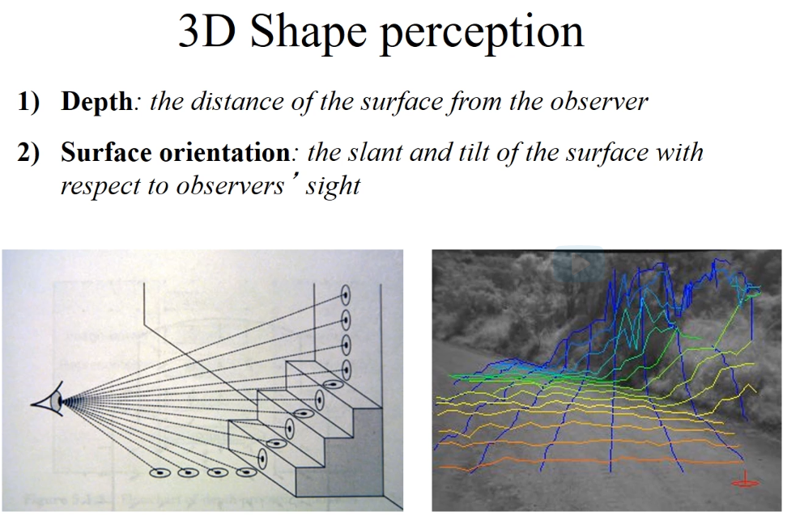
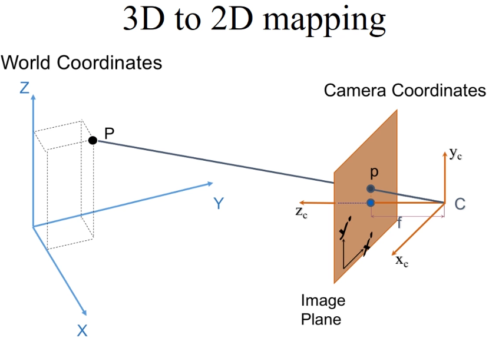
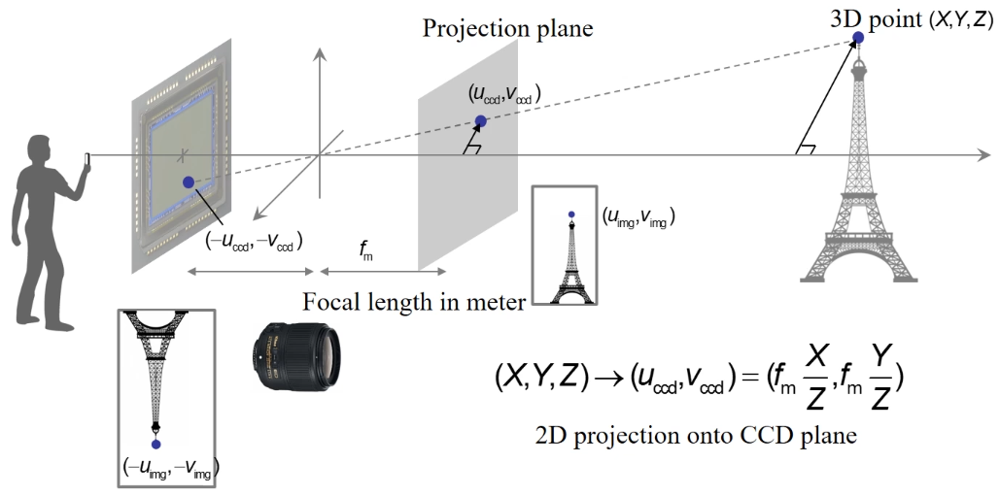
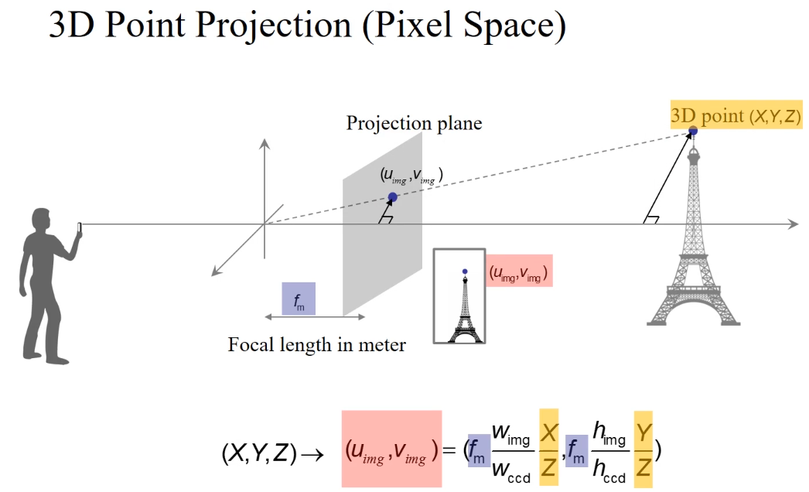
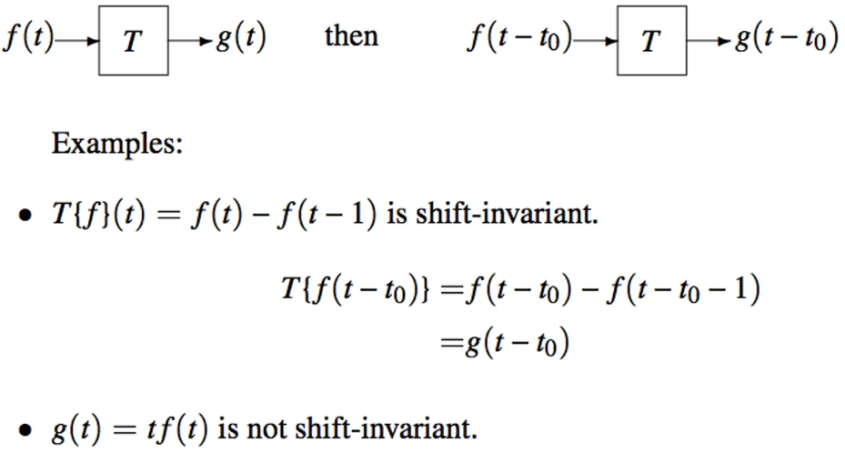

# Vision Intelligence and Machine Learning

[toc]

extracting 3D information from 2D images and videos

vision and learning; 70% of brain are devoted to the act of seeing; it takes >200ms to recognize an image in our brain

robots "see", respond to and learn; Visual intelligence allows a robot to "sense" and "recognize" the surrounding environment. It also enables a robot to "learn" from the memory of past experience by extracting patterns from visual signals.

Learning objectives:

- Understand how Machine Learning extracts statically meaningful patterns in data that support classification, regression and clustering
- By studying Computer Vision and Machine Learning together, you will be able to build recognition algorithms that can learn from data and adapt to new environments
- Program vision capabilities for a robot such as robot localization as well as object recognition using machine learning

MATLAB and OpenCV (Python, C++) for video stabilization, recognition of 3D objects, coding a classifier for objects, building a perceptron, and designing a convolutional neural network (CNN) using one of the standard CNN frameworks.

self-supervised; Vision and Learning

The 'effortless' work of seeing; 70% of our brain, in a human, are devoted to the act of seeing. And it take 200ms or above to recognize a picture in our head. It's a very complicated process.

object recognition, scenery recognition; Application: autonomous driving, virtual reality, augmented reality

## 1. Camera Geometry and Color Sensing

camera:

- a photon collection machine which collects light rays into a camera color arrays
- a 3D to 2D compression machine

Depth ambiguity: inverse problem with multiple solution exists

perspective projection: stereo vision;

face recognition; autonomous driving

pinhole camera: *aperture*;

lenses: large collection of rays coming to the pinholes while still getting focused image

CCD or CMOS image sensors

Photons hit the pixel arrays and then discharge the particles, resulting in different voltage drop. This is the process of converting photons to electricity

each pixel has the physical size in the order of microns

digitization: In a computer, an image is a 2D matrix (usually 8 bits); Any 2D matrix can be seen as an image

3D point projection

focal length: the distance from the center of projection to the image plane (unit: mm); note the above $u_{cdd}, v_{ccd}$ are physical size in the CCD sensor, unit of mm, not pixels

*shorter focal length, larger field of view!*

Dolly Zoom effect: It keeps the size of an object of interests constant in the image, while making the foreground and background objects appear larger or smaller by adjusting focal length and moving the camera.

$u=f_{ref}\frac{H}{d_{ref}}=f\frac{H}{d_{ref}-pos}$

## 2. Fourier Transforms, Image Convolution, Edge Detection

Fourier transforms, convolution operators for 1D and 2D signals (images) and Canny algorithm for edge detection

robot learning

an operation between signals

$(f\star g)=\int_{-\infin}^{\infin}f(t')g(t-t')dt'$

moving a sliding window and at every position we take the scalar product between the mask and the signal. We will call this operation *correlation* between two discrete signals and we can write it as

$y[n]=\sum_{k=1}^Ns[k]h[k-n]$

Convolution differs from correlation by a reflection

The informal term for the convolution mask is "filter mask", its values are called "filter weights" or convolution weights.

music signal convolution

$y[n]=\sum_{k=1}^Ns[k]h[n-k]$

The system's view

linear vs non-linear system

shift-invariant (or time-invariant) system

Is there a formula for describing linear shift-invariant systems?

Yes, the *convolution*! Discrete or continuous

$g(t)=\int_{-\infin}^{\infin}f(t')h(t-t')dt'=f(t)\star h(t)$   $g[n]=\sum_{k=-\infin}^{\infin}f[k]h[n-k]$

this $h(t)$ or $h[n]$ is called mask or filter

Box function

$rect(t/a) = \begin{cases} 1/a &\mbox{if } |t|\le a/2 \\  0 & \mbox{otherwise } \end{cases} $

**Dirac function**

$\delta(t)\doteq \lim_{a\to 0} \frac{1}{a}rect(t/a)$

It follows from definition of the Dirac function that

$\delta(t)=0 \quad \mbox{for all t} \neq 0$ and $\int_{-\infin}^{\infin}\delta(t)dt=1$

the total energy is still 1

*Absorption property*

$\int_{-\infin}^{\infin}\delta(t)f(t_0)dt=f(t_0)$

What happens when the input to an LSI is a Dirac?

$\int_{-\infin}^{\infin}\delta(t')h(t-t')dt'=h(t)$

A filter $h(t)$ or $h[n]$ is the response of the system to the Dirac impulse.

Dirac description of sampling

- What do we get discrete signals out of analog?
- sampling is multiplication with the comb

$f_{S}(t)=f(t)\sum_{n=-\infin}^{\infin}\delta(t-nT)$

after sampling, we forget about the T: we just obtain a sequence of numbers, $f_S[k]$

**The Fourier Transform**

edges, peaks

We can decompose a function into "sinusoids" if it is periodic. Fourier series

$f(t)=\sum_{-\infin}^{\infin}F[n]e^{j2\pi\frac{n}{T}t}$

The complex Fourier coefficients $F[n]$ can be found with the Fourier Transform

$F[n]=\int_{-T/2}^{T/2}f(t)e^{-j2\pi\frac{n}{T}t}dt$

angular frequency $\omega$, ordinary frequency $\frac{n}{T}$

Some facts about the Fourier transform

DC component of the Fourier Transform

## 3. Image Convolution and Edge Detection Part 2, Image Pyramids

## 4. Feature Detection: Filters, SIFT, HOG

What makes a good feature and how can we reliably detect them in the face of image deformation?

## 5. Geometric Transformation, Affine, Protective and Ransac

Perspective camera model and the transformations which comprise a perspective transformation

## 6. Optical Flow Estimation

A strategy employing iterative image deformation and linearization for displacement estimation between video frames

## 7. Image Morphing

Image morphing, image warping, shape averaging, cross-dissolve, triangular warping, Delaunay triangulation, barycentric coordinates

## 8. Image Blending

Gradient domain blending, Possion image editing, seamless cloning, alpha blending, laplacian blending, least squares

## 9. Image Carving

Image carving, information-preserving image resizing, dynamic programming, recursion, energy functions, minimum energy paths

## 10. Probability and Statistics, Regression and Classification

Key concepts from probability theory, as well as linear and logistic regression algorithms, which are widely used for regression and classification tasks respectively

## 11. SVM and Object Recognition

Perceptron and support vector machine algorithms are both very commonly used machine learning methods for various classification tasks such as image classification, object recognition, and many others

## 12. Convolutional Neural Network

Key concepts related to convolutional neural networks, forward and backward passes in each layer of the convolutional neural networks, and finally backpropagation algorithm, which is used to train a network for various classification or regression tasks such as image classification

