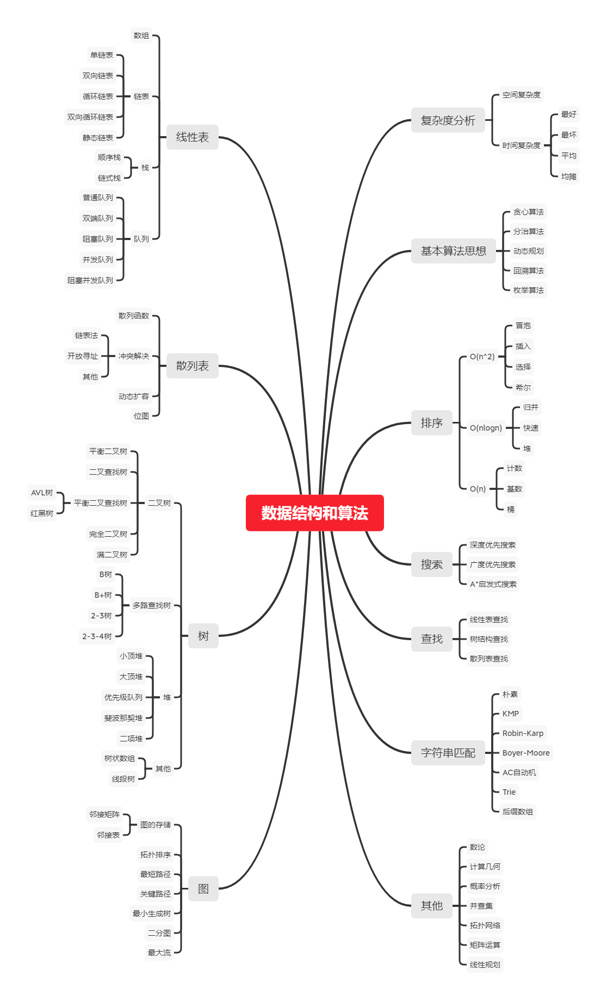

# 数据结构与算法之美

[toc]

## 入门篇

[github](https://github.com/wangzheng0822/algo)

### 01. 为什么要学习数据结构和算法

CRUD: create, read, update and delete 增删改查工程师（哈哈）

框架、中间件和底层系统，Spring、RPC框架、消息中间件、Redis

基础架构研发工程师，写出达到开源水平的框架才是目标。高手之间的竞争在细节。

长期来看，大脑思考能力是个人最重要的核心竞争力，而算法是为数不多的能够有效训练大脑思考能力的途径之一。

看没用，一定要动手写。

1、数据结构和算法学习的精髓-复杂度分析
2、最常用的、最基础的数据结构：数组、链表、栈、队列、散列表、二叉树、堆、跳表、图、Trie 树
3、最常用的算法：递归、排序、二分查找、搜索、哈希算法、贪心算法、分治算法、回溯算法、动态规划、字符串匹配算法

### 02. 如何抓住重点，系统高效地学习数据结构和算法

从广义上讲，数据结构就是指一组数据的存储结构。算法就是操作数据的一组方法。数据结构和算法是相辅相成的。数据结构是为算法服务的，算法要作用在特定的数据结构之上。因此，我们无法孤立数据结构来讲算法，也无法孤立算法来讲数据结构。



重点有10个数据结构：数组、链表、栈、队列、散列表、二叉树、堆、跳表、图、Trie树；10个算法：递归、排序、二分查找、搜索、哈希算法、贪心算法、分治算法、回溯算法、动态规划、字符串匹配算法

只要集中精力逐一攻克这20个知识点就足够了

边学边练，适度刷题

打怪升级法和知识沉淀


哈哈flag:

1、所有数据结构与算法用C++实现一遍;
2、所有数据结构与算法用Python实现一遍;
3、学完就辞职。

[算法可视化](https://www.cs.usfca.edu/~galles/visualization/Algorithms.html)网站


### 03. 复杂度分析：如何分析算法的执行效率和资源消耗？

数据结构和算法本身解决的是“快”和“省”的问题，即如何让代码运行得更快，如何让代码更省存储空间

复杂度分析是整个算法学习的精髓，只要掌握了它，数据结构和算法的内容基本上就掌握了一半。


O(nlogn)是一种非常常见的算法时间复杂度，比如，归并排序、快速排序的时间复杂度都是O(nlogn)

空间复杂度比时间复杂度分析要简单很多，常见的有O(1), O(n), O(n^2)。衡量内存

### 04. 复杂度分析：浅析最好、最坏、平均、均摊时间复杂度

最好情况时间复杂度（best case time complexity）、最坏情况时间复杂度（worst case time complexity）、平均
情况时间复杂度（average case time complexity）、均摊时间复杂度（amortized time complexity）。

实际上，在大多数情况下，我们并不需要区分最好、最坏、平均情况时间复杂度三种情况

均摊时间复杂度，听起来跟平均时间复杂度有点儿像。对于初学者来说，这两个概念确实非常容易弄混。

对一个数据结构进行一组连续操作中，大部分情况下时间复杂度都很低，只有个别情况下时间复杂度比较高，而且这些操作之间存在前后连贯的时序关系，这个时候，我们就可以将这一组操作放在一块儿分析，看是否能将较高时间复杂度那次操作的耗时，平摊到其他那些时间复杂度比较低的操作上。而且，在能够应用均摊时间复杂度分析的场合，一般均摊时间复杂度就等于最好情况时间复杂度。

均摊时间复杂度就是一种特殊的平均时间复杂度，我们没必要花太多精力去区分它们。你最应该掌握的是它的分析方法，摊还分析

## 基础篇

### 05. 数组：为什么很多编程语言中数组都从0开始编号？

它不仅仅是一种编程语言中的数据类型，还是一种最基础的数据结构。

数组（Array）是一种线性表数据结构。它用一组连续的内存空间，来存储一组具有相同类型的数据。

关键字：

- 线性表：线性表就是数据排成像一条线一样的结构。每个线性表上的数据最多只有前和后两个方向。其实除了数组，链表、队列、栈等也是线性表结构。与它相对立的概念是非线性表，比如二叉树、堆、图等。之所以叫非线性，是因为，在非线性表中，数据之间并不是简单的前后关系。
- 连续的内存空间和相同类型的数据：这两个限制，保证了“随机访问”；但是在数组中删除、插入数据会变得低效

数组是适合查找操作，但是查找的时间复杂度并不为O(1)。即便是排好序的数组，你用二分查找，时间复杂度也是O(logn)。所以，正确的表述应该是，数组支持随机访问，根据下标随机访问的时间复杂度为O(1)。

低效的“插入”和“删除”：如果数组中的数据是有序的，我们在某个位置插入一个新的元素时，就必须按照刚才的方法搬移k之后的数据。，如果数组中存储的数据并没有任何规律，数组只是被当作一个存储数据的集合。在这种情况下，如果要将某个数组插入到第k个位置，为了避免大规模的数据搬移，我们还有一个简单的办法就是，直接将第k位的数据搬移到数组元素的最后，把新的元素直接放入第k个位置。利用这种技巧，特定场景下，插入元素的时间复杂度会降为O(1)。这个处理思想在快排中也会用大。

标记删除；JVM标记清除垃圾回收算法的核心思想。

警惕数组的越界访问问题；数组越界在C中是一种未决行为undefined behavior。Java会做越界检查


#### 容器能否完全替代数组？

针对数组类型，很多语言都提供了容器类，比如Java中的ArrayList、C++ STL中的vector。在项目开发中，什么时候适合用数组，什么时候适合用容器呢？

个人觉得，ArrayList最大的优势就是可以将很多数组操作的细节封装起来。比如前面提到的数组插入、删除数据时需要搬移其他数据等。另外，它还有一个优势，就是支持动态扩容。使用ArrayList，我们就完全不需要关心底层的扩容逻辑，ArrayList已经帮我们实现好了。每次存储空间不够的时候，它都会将空间自动扩容为1.5倍大小。

Java ArrayList无法存储基本类型，比如int、long，需要封装为Integer、Long

总结一下，**对于业务开发，直接使用容器就足够了**，省时省力。毕竟损耗一丢丢性能，完全不会影响到系统整体的性能。但如果你是做一些非常底层的开发，比如开发网络框架，性能的优化需要做到极致，这个时候数组就会优于容器，成为首选。

并不是说数组起始编号非0开始不可，最主要的原因可能是历史原因。


#### 小结

数组可以说是最基础、最简单的数据结构了。数组用一块连续的内存空间，来存储相同类型的一组数据，最大的特点就是支持随机访问，但插入、删除操作也因此变得比较低效，平均情况时间复杂度为O(n)。在平时的业务开发中，我们可以直接使用编程语言提供的容器类，但是，如果是特别底层的开发，直接使用数组可能会更合适。


```c
int main(int argc, char* argv[]){
    int i = 0;
    int arr[3] = {0};
    for(; i<=3; i++){
        arr[i] = 0;
        printf("hello world\n");
    }
    return 0;
}
```

这段代码会无限循环。函数体内的局部变量存在栈上，且是连续压栈。在Linux进程的内存布局中，栈区在高地址空间，从高向低增长。变量i和arr在相邻地址，且i比arr的地址大，所以arr越界正好访问到i。当然，前提是i和arr元素同类型，否则那段代码仍是未决行为。

对于不同的编译器，在内存分配时，会按照内存地址递增或递减的方式进行分配。上面程序，如果是内存地址递减的方式，就会造成无限循环。

gcc有一个编译选项（-fno-stack-protector）用于关闭堆栈保护功能。默认情况下启动了堆栈保护，不管i声明在前还是在后，i都会在数组之后压栈，只会循环4次；如果关闭堆栈保护功能，则会出现死循环


JVM标记清除算法：
大多数主流虚拟机采用可达性分析算法来判断对象是否存活，在标记阶段，会遍历所有 GC ROOTS，将所有 GC ROOTS 可达的对象标记为存活。只有当标记工作完成后，清理工作才会开始。
不足：1.效率问题。标记和清理效率都不高，但是当知道只有少量垃圾产生时会很高效。2.空间问题。会产生不连续的内存空间碎片。


### 06. 链表（上）：如何实现LRU缓存淘汰算法?

#### 五花八门的链表结构

一个经典的链表应用场景，那就是LRU缓存淘汰算法。

缓存是一种提高数据读取性能的技术。缓存的大小有限，当缓存被用满时，哪些数据应该被清理出去，哪些应该被保留？需要缓存淘汰策略来决定。常见的策略有三种：先进先出策略FIFO（First In，First Out）、最少使用策略LFU（LeastFrequently Used）、最近最少使用策略LRU（Least Recently Used）

三种最常见的链表结构，它们分别是：单链表、双向链表和循环链表

头结点用来记录链表的基地址。尾结点指针不是指向下一个结点，而是指向一个空地址NULL，表示这是链表上最后一个结点。

链表的插入和删除操作对应的时间复杂度是O(1)。链表随机访问的性能没有数组好，需要O(n)的时间复杂度。

和单链表相比，循环链表的优点是从链尾到链头比较方便。当要处理的数据具有环型结构特点时，就特别适合采用循环链表。比如著名的[约瑟夫问题](https://zh.wikipedia.org/wiki/%E7%BA%A6%E7%91%9F%E5%A4%AB%E6%96%AF%E9%97%AE%E9%A2%98)

虽然两个指针比较浪费存储空间。但从结构上来看，双向链表可以支持O(1)时间复杂度的情况下找到前驱结点（双向遍历），正是这样的特点，也使双向链表在某些情况下的插入、删除等操作都要比单链表简单、高效。

从链表中删除一个数据无外乎这两种情况：

- 删除结点中“值等于某个给定值”的结点 （需遍历寻找）；
- 删除给定指针指向的结点（需找到前驱节点）。

尽管单纯的删除操作时间复杂度是O(1)，但遍历查找的时间是主要的耗时点，对应的时间复杂度为O(n)。根据时间复杂度分析中的加法法则，删除值等于给定值的结点对应的链表操作的总时间复杂度为O(n)。单链表并不支持直接获取前驱结点，还是要从头结点开始遍历链表

同理，对于前插入，双向链表也比单链表有优势。双向链表可以在O(1)时间复杂度搞定，而单向链表需要O(n)的时间复杂度

除了插入、删除操作有优势之外，对于一个有序链表，双向链表的按值查询的效率也要比单链表高一些（类似于二叉搜索）。

在实际的软件开发中，双向链表尽管比较费内存，但还是比单链表的应用更加广泛

**空间换时间**的设计思想，追求执行速度。时间换空间（手机或单片机）追求内存利用率

#### 链表vs数组性能比拼

在实际的软件开发中，不能仅仅利用复杂度分析就决定使用哪个数据结构来存储数据。

数组简单易用，在实现上使用的是连续的内存空间，可以借助CPU的缓存机制，预读数组中的数据，所以访问效率更高。而链表在内存中并不是连续存储，所以对CPU缓存不友好，没办法有效预读。

数组的缺点是大小固定，一经声明就要占用整块连续内存空间。链表本身没有大小的限制，天然地支持动态扩容，我觉得这也是它与数组最大的区别。

如果你的代码对内存的使用非常苛刻，那数组就更适合你。因为链表中的每个结点都需要消耗额外的存储空间去存储一份指向下一个结点的指针，所以内存消耗会翻倍。而且，对链表进行频繁的插入、删除操作，还会导致频繁的内存申请和释放，容易造成内存碎片，如果是Java语言，就有可能会导致频繁的GC（Garbage Collection，垃圾回收）。

#### 基于链表实现LRU缓存淘汰算法

思路：维护一个有序单链表，越靠近链表尾部的结点是越早之前访问的。当有一个新的数据被访问时，我们从链表头开始顺序遍历链表。

1. 如果此数据之前已经被缓存在链表中了，我们遍历得到这个数据对应的结点，并将其从原来的位置删除，然后再插入到链表的头部。
2. 如果此数据没有在缓存链表中，又可以分为两种情况：
   1. 如果此时缓存未满，则将此结点直接插入到链表的头部；
   2. 如果此时缓存已满，则链表尾结点删除，将新的数据结点插入链表的头部。

这种基于链表的实现思路，缓存访问的时间复杂度是O(n)

我们可以继续优化这个实现思路，比如引入散列表（Hash table）来记录每个数据的位置，将缓存访问的时间复杂度降到O(1)。

#### 小结

和数组相比，链表更适合插入、删除操作频繁的场景，查询的时间复杂度较高


如果字符串是通过单链表来存储的，如何来判断是否是一个回文串？

由于回文串最重要的就是对称，那么最重要的问题就是找到那个中心，用快指针每步两格走，当他到达链表末端的时候，慢指针刚好到达中心，慢指针在过来的这趟路上还做了一件事，他把走过的节点反向了，在中心点再开辟一个新的指针用于往回走，而慢指针继续向前，当慢指针扫完整个链表，就可以判断这是回文串，否则就提前退出，总的来说时间复杂度按慢指针遍历一遍来算是O(n),空间复杂度因为只开辟了3个额外的辅助，所以是o(1)

### 07. 链表（下）：如何轻松写出正确的链表代码？

投入时间

#### 技巧一：理解指针或引用的含义

有些语言有“指针”的概念，比如C语言；有些语言没有指针，取而代之的是“引用”，比如Java、Python。不管是“指针”还是“引用”，实际上，它们的意思都是一样的，都是存储所指对象的内存地址。

将某个变量赋值给指针，实际上就是将这个变量的地址赋值给指针，或者反过来说，指针中存储了这个变量的内存地址，指向了这个变量，通过指针就能找到这
个变量。

#### 技巧二：警惕指针丢失和内存泄漏

手动内存管理

#### 技巧三：利用哨兵简化实现难度

针对链表的插入、删除操作（空链表中插入第一个节点，删除链表中最后一个节点），需要对插入第一个结点和删除最后一个结点的情况进行特殊处理。这样代码实现起来就会很繁琐，不简洁，而且也容易因为考虑不全而出错。如何来解决这个问题呢？

哨兵结点是不存储数据的。因为哨兵结点一直存在，所以插入第一个结点和插入其他结点，删除最后一个结点和删除其他结点，都可以统一为相同的代码实现逻辑了。

利用哨兵简化编程难度的技巧，在很多地方都有用到，比如插入排序、归并排序、动态规划等

#### 技巧四：重点留意边界条件处理

边界条件最容易出现bug，检查清单：

- 链表为空时，代码能否正常工作
- 链表只包含一个结点时，代码能否正常工作
- 链表只包含两个结点
- 代码逻辑在处理头结点和尾结点时，能否正常工作

#### 技巧五：举例画图，辅助思考

具体的例子，画在纸上

#### 技巧六：多写多练，没有捷径

😄，这是技巧吗？

多写几遍，写熟练

#### LeetCode

- 单链表反转 [206](https://leetcode.com/problems/reverse-linked-list/)
- 链表中环的检测 [141](https://leetcode.com/problems/linked-list-cycle/)
- 两个有序的链表合并 [21](https://leetcode.com/problems/merge-two-sorted-lists/)
- 删除链表倒数第n个结点 [19](https://leetcode.com/problems/remove-nth-node-from-end-of-list/)
- 求链表的中间结点 [876](https://leetcode.com/problems/middle-of-the-linked-list/)

#### 小结

写链表代码是最考验逻辑思维能力的

思考时间不要太长。一是先用自己能想到的暴力方法实现试试。另外就是在一定时间内(比如半个到一个小时)实在想不到就要在网上搜搜答案。很多最优解不是能想出来的

### 08. 栈：如何实现浏览器的前进和后退功能？

#### 如何理解“栈”

数组或链表暴露了太多的操作接口

当某个数据集合只涉及在一端插入和删除数据，并且满足后进先出、先进后出的特性，我们就应该首选“栈”这种数据结构。

#### 如何实现一个“栈”

栈可以用数组来实现，也可以用链表来实现。前者为顺序栈，后者为链式栈

```c++
class ArrayStack
{
public:
    ArrayStack(int n)
    {
        items = new string[n];
        this->n = n;
        this->count = 0;
    }
    // ~ArrayStack() { delete items; }

    bool push(string item)
    {
        if (count == n)
            return false;
        items[count] = item;
        ++count;
        return true;
    }

    string pop()
    {
        if (count == 0)
            return {};
        string tmp = items[count - 1];
        --count;
        return tmp;
    }

private:
    string *items;
    int count;
    int n;
};
int main()
{
    ArrayStack stack(3);
    stack.push("!");
    stack.push("world");
    stack.push("hello");

    for (auto i = 0; i < 3; ++i)
    {
        string item = stack.pop();
        cout << item << " ";
    }
}
// output
hello world !
```

入栈、出栈时间复杂度都是O(1)

#### 支持动态扩容的顺序栈

入栈操作的均摊时间复杂度为O(1)

#### 栈在函数调用中的应用

操作系统给每个线程分配了一块独立的内存空间，这块内存被组织成“栈”这种结构,用来存储函数调用时的临时变量。每进入一个函数，就会将临时变量作为一个栈帧入栈，当被调用函数执行完成，返回之后，将这个函数对应的栈帧出栈。

#### 栈在表达式求值中的应用

计算机如何计算3+5*8-6

编译器就是通过两个栈来实现的。其中一个保存操作数的栈，另一个是保存运算符的栈。我们从左向右遍历表达式，当遇到数字，我们就直接压入操作数栈；当遇到运算符，就与运算符栈的栈顶元素进行比较。如果比运算符栈顶元素的优先级高，就将当前运算符压入栈；如果比运算符栈顶元素的优先级低或者相同，从运算符栈中取栈顶运算符，从操作数栈的栈顶取2个操作数，然后进行计算，再把计算完的结果压入操作数栈，继续比较。最后要清空栈

#### 栈在括号匹配中的应用

()[]{}

用栈来保存未匹配的左括号，从左到右依次扫描字符串。当扫描到左括号时，则将其压入栈中；当扫描到右括号时，从栈顶取出一个左括号。如果能够匹配则出栈，并继续扫描剩下的字符串。如果扫描的过程中，遇到不能配对的右括号，或者栈中没有数据，则说明为非法格式。

当所有的括号都扫描完成之后，如果栈为空，则说明字符串为合法格式；否则，说明有未匹配的左括号，为非法格式。

#### 如何实现浏览器的前进和后退

用两个栈就可以非常完美地解决这个问题。
我们使用两个栈，X和Y，我们把首次浏览的页面依次压入栈X，当点击后退按钮时，再依次从栈X中出栈，并将出栈的数据依次放入栈Y。当我们点击前进按钮时，我们依次从栈Y中取出数据，放入栈X中。当栈X中没有数据时，那就说明没有页面可以继续后退浏览了。当栈Y中没有数据，那就说明没有页面可以点击前进按钮浏览了。

如果中间点了新的页面，则Y栈需要被清空

#### 小结

栈是一种操作受限的数据结构，只支持入栈和出栈操作。后进先出是它最大的特点。栈既可以通过数组实现，也可以通过链表来实现。不管基于数组还是链表，入栈、出栈的时间复杂度都为O(1)。除此之外，我们还讲了一种支持动态扩容的顺序栈，你需要重点掌握它的均摊时间复杂度分析方法。


JVM内存管理中有个“堆栈”的概念。栈内存用来存储局部变量和方法调用，堆内存用来存储Java中的对象。那JVM里面的“栈”跟我们这里说的“栈”是不是一回事呢？如果不是，那它为什么又叫作“栈”呢？

内存中的堆栈和数据结构堆栈不是一个概念，可以说内存中的堆栈是真实存在的物理区，数据结构中的堆栈是抽象的数据存储结构。
内存空间在逻辑上分为三部分：代码区、静态数据区和动态数据区，动态数据区又分为栈区和堆区。代码区：存储方法体的二进制代码。高级调度（作业调度）、中级调度（内存调度）、低级调度（进程调度）控制代码区执行代码的切换。静态数据区：存储全局变量、静态变量、常量，常量包括final修饰的常量和String常量。系统自动分配和回收。
栈区：存储运行方法的形参、局部变量、返回值。由系统自动分配和回收。
堆区：new一个对象的引用或地址存储在栈区，指向该对象存储在堆区中的真实数据。


我们不一定非要用栈来保存临时变量，只不过如果这个函数调用符合后进先出的特性，用栈这种数据结构来实现，是最顺理成章的选择。

#### LeetCode

- 20 [Valid Parentheses](https://leetcode.com/problems/valid-parentheses/)
- 155 [Min Stack](https://leetcode.com/problems/min-stack/)
- 232 [Implement Queue using Stacks](https://leetcode.com/problems/implement-queue-using-stacks/)
- 844 [Backspace String Compare](https://leetcode.com/problems/backspace-string-compare/)
- 224 [Basic Calculator](https://leetcode.com/problems/basic-calculator/)
- 682 [Baseball Game](https://leetcode.com/problems/baseball-game/)
- 496 [Next Greater Element I](https://leetcode.com/problems/next-greater-element-i/)

### 09. 队列：队列在线程池等有限资源池中的应用

CPU资源是有限的，任务的处理速度与线程个数并不是线性正相关。相反，过多的线程反而会导致CPU频繁切换，处理性能下降。所以，线程池的大小一般都是综合考虑要处理任务的特点和硬件环境，来事先设置的。
当我们向固定大小的线程池中请求一个线程时，如果线程池中没有空闲资源了，这个时候线程池如何处理这个请求？是拒绝请求还是排队请求？各种处理策略又
是怎么实现的呢？

#### 如何理解“队列”

栈只支持两个基本操作：入栈push()和出栈pop()。队列跟栈非常相似，支持的操作也很有限，最基本的操作也是两个：入队enqueue()，放一个数据到队列尾部；出队dequeue()，从队列头部取一个元素

作为一种非常基础的数据结构，队列的应用非常广泛，特别时一些具有额外特性的队列，比如循环队列、阻塞队列、并发队列。

#### 顺序队列和链式队列

跟栈一样，队列可以用数组来实现，也可以用链表来实现。用数组实现的栈叫作顺序栈，用链表实现的栈叫作链式栈。同样，用数组实现的队列叫作顺序队列，
用链表实现的队列叫作链式队列。

对于栈来说，只需要一个栈顶指针就可以了。但是队列需要两个指针：一个是head指针，指向队头；一个是tail指针，指向队尾。

当tail移动到最右边，enqueue()时需要搬移数据。

```c++
bool enqueue(string item)
{
    if (tail == n)
    {
        if (head == 0)
            return false;
        for (int i = head; i < tail; ++i)
        {
            items[i - head] = items[i];
        }
        tail -= head;
        head = 0;
    }
    items[tail] = item;
    ++tail;
    return true;
}
```

基于链表: tail->next = new_node; tail = tail->next; 出队：head = head->next;

#### 循环队列

要想写出没有bug的循环队列的实现代码，最关键的是，确定好队空和队满的判定条件。队列空判断：head==tail; 队列满判断：(tail+1)%n==head

入队update tail：tail = (tail+1)%n 出队update head：head=(head+1)%n

#### 阻塞队列和并发队列

平时的业务开发不大可能从零实现一个队列，甚至都不会直接用到。而一些具有特殊特性的队列应用却比较广泛，比如阻塞队列和并发队列。

阻塞队列其实就是在队列基础上增加了阻塞操作。简单来说，就是在队列为空的时候，从队头取数据会被阻塞。因为此时还没有数据可取，直到队列中有了数据
才能返回；如果队列已经满了，那么插入数据的操作就会被阻塞，直到队列中有空闲位置后再插入数据，然后再返回。

“生产者-消费者模型”

线程安全的队列我们叫作并发队列。最简单直接的实现方式是直接在enqueue()、dequeue()方法上加锁，但是锁粒度大并发度会比较低，同一时刻仅允许一个存或
者取操作。实际上，基于数组的循环队列，利用CAS原子操作，可以实现非常高效的并发队列。这也是循环队列比链式队列应用更加广泛的原因。

#### 队列在线程池的引用

线程池没有空闲线程时，新的任务请求线程资源时，线程池该如何处理？各种处理策略又是如何实现的呢？

一般有两种处理策略。第一种是非阻塞的处理方式，直接拒绝任务请求；另一种是阻塞的处理方式，将请求排队，等到有空闲线程时，取出排队的请求继续处理。

## 高级篇

## 实战篇


