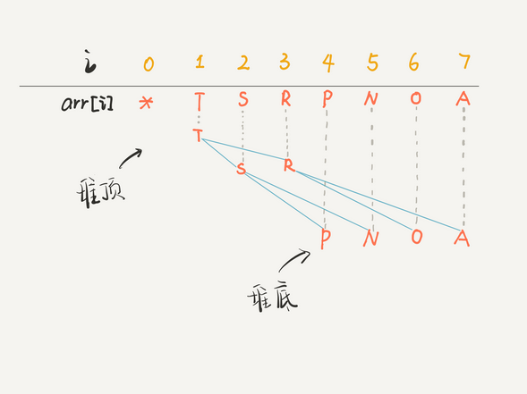
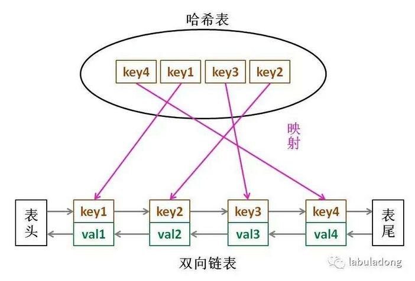
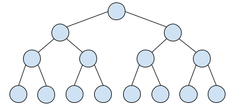

# Fucking-algorithm

[toc]

Notes based https://labuladong.gitbook.io/algo/; https://github.com/labuladong/fucking-algorithm

## 0. 必读

### 学习算法和刷题的思路指南

#### 数据结构的存储方式

只有两种

- 数组（顺序存储）
- 链表（链式存储）

比如说「队列」、「栈」这两种数据结构既可以使用链表也可以使用数组实现。用数组实现，就要处理扩容缩容的问题；用链表实现，没有这个问题，但需要更多的内存空间存储节点指针。

「图」的两种表示方法，邻接表就是链表，邻接矩阵就是二维数组。邻接矩阵判断连通性迅速，并可以进行矩阵运算解决一些问题，但是如果图比较稀疏的话很耗费空间。邻接表比较节省空间，但是很多操作的效率上肯定比不过邻接矩阵。

「散列表」（hash table）就是通过散列函数把键映射到一个大数组里。而且对于解决散列冲突的方法，拉链法需要链表特性，操作简单，但需要额外的空间存储指针；线性探查法就需要数组特性，以便连续寻址，不需要指针的存储空间，但操作稍微复杂些。

「树」，用数组实现就是「堆」，因为「堆」是一个完全二叉树，用数组存储不需要节点指针，操作也比较简单；用链表实现就是很常见的那种「树」，因为不一定是完全二叉树，所以不适合用数组存储。为此，在这种链表「树」结构之上，又衍生出各种巧妙的设计，比如二叉搜索树、AVL 树、红黑树、区间树、B 树等等，以应对不同的问题。

数组与链表的优缺点：

- **数组**由于是紧凑连续存储,可以随机访问，通过索引快速找到对应元素，而且相对节约存储空间。但正因为连续存储，内存空间必须一次性分配够，所以说数组如果要扩容，需要重新分配一块更大的空间，再把数据全部复制过去，时间复杂度 $O(N)$；而且你如果想在数组中间进行插入和删除，每次必须搬移后面的所有数据以保持连续，时间复杂度 $O(N)$。
- **链表**因为元素不连续，而是靠指针指向下一个元素的位置，所以不存在数组的扩容问题；如果知道某一元素的前驱和后驱，操作指针即可删除该元素或者插入新元素，时间复杂度 $O(1)$。但是正因为存储空间不连续，你无法根据一个索引算出对应元素的地址，所以不能随机访问；而且由于每个元素必须存储指向前后元素位置的指针，会消耗相对更多的储存空间。

#### 数据结构的基本操作

基本操作：遍历+访问；增删查改

遍历+访问无非两种形式：线性和非线性的。线性就是for/while迭代为代表，非线性就是递归为代表。

*数组遍历，典型线性*

```c++
void traverse(int[] arr) {
    for (int i = 0; i < arr.length; ++i)
        // 迭代访问
}
```

*链表遍历，兼具迭代和递归*

```c++
struct ListNode {
    int val;
    ListNode* next;
}
void traverse(ListNode* head) {
    for (ListNode* p = head; p != nullptr; p = p->next) {
        // 迭代访问
    }
}
void traverse(ListNode* head) {
    travere(head->next);
}
```

*二叉树遍历，典型的非线性递归遍历*

```c++
struct TreeNode {
    int val;
    TreeNode* left, *right;
}
void traverse(TreeNode* root) {
    traverse(root->left);
    traverse(root->right);
}
```

二叉树遍历与链表的递归遍历相似。

二叉树框架可以扩展为N叉树的遍历框架

```c++
struct TreeNode {
    int val;
    TreeNode*[] children;
}
void traverse(TreeNode* root) {
    for (TreeNode* child: root->children)
        traverse(child);
}
```

N 叉树的遍历又可以扩展为图的遍历，因为图就是好几 N 叉棵树的结合体。你说图是可能出现环的？这个很好办，用个布尔数组 visited 做标记就行了

#### 算法刷题指南

**数据结构是工具，算法是通过合适的工具解决特定问题的方法**

**先刷二叉树(binary tree)**; **只要涉及递归的问题，都是树的问题**。

### 学习数据结构和算法读什么书

算法4

例子：二分图；套汇

### 动态规划详解

**动态规划问题的一般形式就是求最值**。求解动态规划的核心问题是穷举。

动态规划

- 存在*重叠子问题*。需要“备忘录”或者“DP table”来优化
- 具有*最优子结构*，能通过子问题的最值求得原问题的最值
- 只有列出正确的*状态转移方程*才能正确地穷举

明确「状态」 -> 定义 dp 数组/函数的含义 -> 明确「选择」-> 明确 base case。

#### 斐波那契数列

```C++
int fib(int N) {
    if (N == 1 || N == 2)
        return 1;
    return fib(N-1) + fib(N-2);  // O(2^n)
}
```

```c++
int fib(int N) {
    if (N < 1)
        return 0;
    vector<int> memo(N+1, 0);
    return helper(memo, N);
}
int helper(vector<int>& memo, int n) {
    if (n == 1 || n == 2)
        return 1;
    if (memo[n] != 0)
        return memo[n];
    memo[n] = helper(memo, n-1) + helper(memo, n-2);  // O(n)
    return memo[n];
}
```

这种方法叫做「自顶向下」，动态规划叫做「自底向上」。

```c++
int fib(int N) {
    vector<int> dp(N+1, 0);  // dp table
    dp[1] = dp[2] = 1;
    for (int i = 3; i <= N; ++i)
        dp[i] = dp[i-1] + dp[i-2];  // state transition function
    return dp[N];
}
```

状态转移方程直接代表着暴力解法。

**千万不要看不起暴力解，动态规划问题最困难的就是写出状态转移方程**，即这个暴力解。优化方法无非是用备忘录或者 DP table，再无奥妙可言。

```c++
int fib(int n) {
    if (n == 1 || n == 2)
        return 1;
    int prev =1, curr = 1;
    for (int i = 3; i <= n; ++i) {
        int sum = prev + curr;
        prev = curr;
        curr = sum;
    }
    return curr;
}
```

上面code降低了空间复杂度为$O(1)$

#### 凑零钱问题

题目：给你 `k` 种面值的硬币，面值分别为 `c1, c2 ... ck`，每种硬币的数量无限，再给一个总金额 `amount`，问你**最少**需要几枚硬币凑出这个金额，如果不可能凑出，算法返回 -1 

```c++
int coinChange(int[] coins, int amount);  // signature; coins: options; amount: final amount
```

要符合「最优子结构」，子问题间必须互相独立

思考**如何列出正确的状态转移方程**？

- **先确定「状态」**，也就是原问题和子问题中变化的变量。由于硬币数量无限，所以唯一的状态就是目标金额 `amount`。
- **然后确定** **`dp`** **函数的定义**：当前的目标金额是 `n`，至少需要 `dp(n)` 个硬币凑出该金额。
- **然后确定「选择」并择优**，也就是对于每个状态，可以做出什么选择改变当前状态。具体到这个问题，无论当的目标金额是多少，选择就是从面额列表 `coins` 中选择一个硬币，然后目标金额就会减少：

```python
def coinChange(coins, amount: int):
    def dp(n):
        # base case
        if n == 0:
            return 0
        if n < 0:
            return -1
        res = float('INF')
        for coin in coins:
            subproblem = dp(n-coin)
            if subproblem == -1:
                continue
            res = min(res, 1+subproblem)
        return res if res != float('INF') else -1
    return dp(amount)
```

以上，时间复杂度是$O(k*n^k)$

```python
def coinChange(coins, amount: int):
    # memory table
    memo = dict()
    def dp(n):
        # base case
        if n in memo:
            return memo[n]
        if n == 0:
            return 0
        if n < 0:
            return -1
        res = float('INF')
        for coin in coins:
            subproblem = dp(n-coin)
            if subproblem == -1:
                continue
            res = min(res, 1+subproblem)
        memo[n] = res if res != float('INF') else -1
        return memo[n]
    return dp(amount)
```

自底而上

```c++
int coinChange(vector<int>& coins, int amount) {
    vector<int> dp(amount+1, amount+1);
    // base case
    dp[0] = 0;
    for (int i = 0; i < dp.size(); ++i) {
        // inner for for each subproblem + 1
        for (int coin: coins) {
            // subproblem no solution
            if (i - coin < 0) continue;
            dp[i] = min(dp[i], 1 + dp[i-coin]);
        }
    }
    return (dp[amount] == amount +1) ? -1 : dp[amount];
}
```

**计算机解决问题其实没有任何奇技淫巧，它唯一的解决办法就是穷举**，穷举所有可能性。算法设计无非就是先思考“如何穷举”，然后再追求“如何聪明地穷举”。

### 动态规划答疑篇

#### 最优子结构详解

「最优子结构」是某些问题的一种特定性质，并不是动态规划问题专有的。

最优子结构并不是动态规划独有的一种性质，能求最值的问题大部分都具有这个性质；**但反过来，最优子结构性质作为动态规划问题的必要条件，一定是让你求最值的**。碰到最值题，思路往动态规划想就对了，套路

找最优子结构的过程，其实就是证明状态转移方程正确性的过程，方程符合最优子结构就可以写暴力解了，写出暴力解就可以看出有没有重叠子问题了，有则优化，无则 OK

#### dp数组的遍历方向

- **1、遍历的过程中，所需的状态必须是已经计算出来的**。
- **2、遍历的终点必须是存储结果的那个位置**。

### 回溯算法详解

**解决一个回溯问题，实际上就是一个决策树的遍历过程**。你只需要思考 3 个问题：

1. 路径：也就是已经做出的选择。
2. 选择列表：也就是你当前可以做的选择。
3. 结束条件：也就是到达决策树底层，无法再做选择的条件。

#### 全排列问题

**前序遍历的代码在进入某一个节点之前的那个时间点执行，后序遍历代码在离开某个节点之后的那个时间点执行**。

**回溯算法的一个特点，不像动态规划存在重叠子问题可以优化，回溯算法就是纯暴力穷举，复杂度一般都很高**。

#### N皇后问题

给你一个 N×N 的棋盘，让你放置 N 个皇后，使得它们不能互相攻击。

PS：皇后可以攻击同一行、同一列、左上左下右上右下四个方向的任意单位。

```c++
vector<vector<string>> res;

// input: board length; output: all legal placement
vector<vector<string>> solveNQueens(int n) {
    // '.' means empty; 'Q' stands for Queen
    vector<string> board(n, string(n, '.'));
    backtrack(board, 0);
    return res;
}

// path: all rows with smaller index than row has Queens already
// options: all colummns in row to put Queen
// ending: row exceeds the last rows of the board
void backtrack(vector<string>& board, int row) {
    // triggering ending condition
    if (row = board.size()) {
        res.push_back(board);
        return;
    }
    int n = board[row].size();
    for (int col = 0; col < n; ++col) {
        // exclude illegal choice
        if (!isValid(board, row, col))
            continue;
        // make choice
        board[row][col] = 'Q';
        // entering next decision
        backtrack(board, row+1);
        // withdraw choice
        board[row][col] = '.';
    }
}

bool isValid(vector<string>& board, int row, int col) {
    int n = board.size();
    // check queen conflict in column
    for (int i = 0; i < n; ++i) {
        if (board[i][col] == 'Q')
            return false;
    }
    // check conflict in right-upper
    for (int i = row-1, j = col + 1; i >=0 && j < n; i--, j++) {
        if (board[i][j] == 'Q')
            return false;
    }
    // check conflict in left-upper
    for (int i = row-1, j = col-1; i >=0 && j >= 0; i--, j--) {
        if (board[i][j] == 'Q')
            return false;
    }
    return true;
}
```

**有的时候，我们并不想得到所有合法的答案，只想要一个答案，怎么办呢**？比如解数独的算法，找所有解法复杂度太高，只要找到一种解法就可以。

```c++
// 函数找到一个答案后就返回 true
bool backtrack(vector<string>& board, int row) {
    // 触发结束条件
    if (row == board.size()) {
        res.push_back(board);
        return true;
    }
    ...
    for (int col = 0; col < n; col++) {
        ...
        board[row][col] = 'Q';
        if (backtrack(board, row + 1))
            return true;
        board[row][col] = '.';
    }

    return false;
}
```

#### 总结

回溯算法就是个多叉树的遍历问题，关键就是在前序遍历和后序遍历的位置做一些操作

**写** **`backtrack`** **函数时，需要维护走过的「路径」和当前可以做的「选择列表」，当触发「结束条件」时，将「路径」记入结果集**。

某种程度上说，动态规划的暴力求解阶段就是回溯算法。只是有的问题具有重叠子问题性质，可以用 dp table 或者备忘录优化，将递归树大幅剪枝，这就变成了动态规划。

### 二分查找详解

二分查找真正的坑在于到底要给 `mid` 加一还是减一，while 里到底用 `<=` 还是 `<`。

最常用的二分查找场景：寻找一个数、寻找左侧边界、寻找右侧边界

**分析二分查找的一个技巧是：不要出现 else，而是把所有情况用 else if 写清楚，这样可以清楚地展现所有细节**。

#### 寻找一个数（基本）

```c++
int binarySearch(vector<int>& nums, int target) {
    int left = 0;
    int right = nums.size() - 1;
    while (left <= right) {
        int mid = left + (right-left)/2;
        if (nums[mid] == target)
            return mid;
        else if (nums[mid] < target)
            left = mid + 1;
        else if (nums[mid] > target)
            right = mid - 1;
    }
    return -1;
}
```

明确了「搜索区间」这个概念; 左闭右开，还是左闭右闭

#### 寻找左侧边界的二分搜索

```c++
int left_bound(vector<int>& nums, int target) {  // how many smaller than target; not finding value
    if (nums.size() == 0)
        return -1;
    int left = 0;
    int right = nums.size();  // note
    
    while (left < right) {  // note
        int mid = left + (right - left)/2;
        if (nums[mid] == target)
            right = mid;
        else if (nums[mid] < target)
            left = mid+1;
        else if (nums[mid] > target)
            right = mid;  // note
    }
    return left;  // return nums[left] == target ? left : -1;
}
```

对于搜索左右侧边界的二分查找，这种写法比较普遍

**返回** **`left`** **, ** **`right`**都是一样的，因为 while 终止的条件是 `left == right`

寻找右侧边界的二分搜索

```c++
int right_bound(vector<int>& nums, int target) {
    if (nums.size() == 0)
        return -1;
    int left = 0;
    int right = nums.size();
    
    while (left < right) {
        int mid = left + (right -left)/2;
        if (nums[mid] == target)
            left = mid+1;  // note
        else if (nums[mid] < target)
            left = mid+1;
        else if (nums[mid] > target)
            right = mid;
    }
    return right - 1;
}
```

again, finaly left == right

#### 逻辑统一

```c++
int binary_search(vector<int>& nums, int target) {
    int left = 0, right = nums.size() - 1; 
    while(left <= right) {
        int mid = left + (right - left) / 2;
        if (nums[mid] < target) {
            left = mid + 1;
        } else if (nums[mid] > target) {
            right = mid - 1; 
        } else if(nums[mid] == target) {
            // 直接返回
            return mid;
        }
    }
    // 直接返回
    return -1;
}

int left_bound(vector<int>& nums, int target) {
    int left = 0, right = nums.size() - 1;
    while (left <= right) {
        int mid = left + (right - left) / 2;
        if (nums[mid] < target) {
            left = mid + 1;
        } else if (nums[mid] > target) {
            right = mid - 1;
        } else if (nums[mid] == target) {
            // 别返回，锁定左侧边界
            right = mid - 1;
        }
    }
    // 最后要检查 left 越界的情况
    if (left >= nums.size() || nums[left] != target)
        return -1;
    return left;
}


int right_bound(vector<int>& nums, int target) {
    int left = 0, right = nums.size() - 1;
    while (left <= right) {
        int mid = left + (right - left) / 2;
        if (nums[mid] < target) {
            left = mid + 1;
        } else if (nums[mid] > target) {
            right = mid - 1;
        } else if (nums[mid] == target) {
            // 别返回，锁定右侧边界
            left = mid + 1;
        }
    }
    // 最后要检查 right 越界的情况
    if (right < 0 || nums[right] != target)
        return -1;
    return right;
}
```

**总结**

1. 分析二分查找代码时，不要出现 else，全部展开成 else if 方便理解
2. 如果将「搜索区间」全都统一成两端都闭，好记，只要稍改 `nums[mid] == target` 条件处的代码和返回的逻辑即可

### 双指针技巧总结

分为两类，一类是「快慢指针」，一类是「左右指针」。前者解决主要解决链表中的问题，比如典型的判定链表中是否包含环；后者主要解决数组（或者字符串）中的问题，比如二分查找。

#### 快慢指针的常见算法

判断是否含有环

```c++
bool hasCycle(listNode* head) {
    listNode* fast, *slow;
    fast = slow = head;
    while (fast != nullptr && fast->next != nullptr) {
        fast = fast->next->next;
        slow = slow->next;
        
        if (fast == slow)
            return true;
    }
    return false;
}
```

已知有环，返回这个环的起始位置

```c++
listNode* detectCycle(listNode* head) {
    listNode* fast, *slow;
    fast = slow = head;
    while (fast != nullptr && fast->next != nullptr) {
        fast = fast->next->next;
        slow = slow->next;
        if (fast == slow)
            break;
    }
    // any pointer goes back to head
    slow = head;
    while (slow != fast) {
        fast = fast->next;
        slow = slow->next;
    }
    return slow;  // meet again at the starting point of the cycle
}
```

寻找链表的中点

```c++
while (fast != nullptr && fast->next != nullptr) {
    fast = fast->next->next;
    slow = slow->next;
}
return slow;
```

当链表的长度是奇数时，slow 恰巧停在中点位置；如果长度是偶数，slow 最终的位置是中间偏右

寻找链表中点的一个重要作用是对链表进行归并排序。对于链表，合并两个有序链表是很简单的，难点就在于二分。


寻找列表的倒数第K个元素

```c++
listNode* slow, *fast;
slow = fast = head;
while (k-- > 0)
    fast = fast->next;
whiel (fast != nullptr) {
    slow = slow->next;
    fast = fast->next;
}
return slow;
```

#### 左右指针的常用算法

二分查找

两数之和

```c++
vector<int> twoSum(vector<int>& nums, int target) {
    int left = 0, right = nums.size() - 1;
    while (left < right) {
        int sum = nums[left] + nums[right];
        if (sum == target)
            return {left+1, right+1};
        else if (sum < target)
            left++;
        else if (sum > target)
            right--;
    }
    return {-1, -1};
}
```

反转数组

```c++
void reverse(vector<int>& nums) {
    int left = 0;
    int right = nums.size() - 1;
    while (left < right) {
        // std::swap(nums[left], nums[right]);
        int temp = nums[left];
        nums[left] = nums[right];
        nums[right] = temp;
        left++;
        right--;
    }
}
```

### 滑动窗口算法

#### 最小覆盖子串

Given string S, T; In S find: the minimum string that contains all letters in T. If it doesn't exist, return empty string ""; If it exists, the answer is unique

e.g. Input: S = "ADOBECODEBANC", T = "ABC"

output: "BANC"

思路：左右指针构建窗口，移动右指针寻找，移动左指针优化

```c++
string minWindow(string s, string t) {
    // record the starting position and length of the minimum sub-string
    int start = 0, minLen = INT_MAX;
    int left = 0, right = 0;

    unordered_map<char, int> window;
    unordered_map<char, int> needs;
    for (char c: t)
        needs[c]++;

    int match = 0;

    while (right < s.size()) {
        char c1 = s[right];
        if (needs.count(c1)) {
            window[c1]++;
            if (window[c1] == needs[c1])
                match++;
        }
        right++;

        while (match == needs.size()) {
            if (right - left < minLen) {
                // update the minimal sub-string position and length
                start = left;
                minLen = right-left;
            }
            char c2 = s[left];
            if (needs.count(c2)) {
                window[c2]--;
                if (window[c2] < needs[c2])
                    match--;
            }
            left++;
        }
    }
    return minLen == INT_MAX ? "" : s.substr(start, minLen);
}
```

这个算法的时间复杂度是 O(M + N)，M 和 N 分别是字符串 S 和 T 的长度

#### 找到字符串中所有字母异位词

Given a string s and a non-empty string p, find all the sub-strings in s that are p 的字母异位词（字母相同，但排列顺序不同的字符串）

s: "cbaebabacd", p: "abc"

output: [0, 6]

```c++
vector<int> findAnagrams(string s, string t) {
    vector<int> res;
    int left = 0, right = 0;
    unordered_map<char, int> needs;
    unordered_map<char, int> window;
    for (char c: t) needs[c]++;
    int match = 0;

    while (right < s.size()) {
        char c1 = s[right];
        if (needs.count(c1)) {
            window[c1]++;
            if (window[c1] == needs[c1])
                match++;
        }
        right++;

        while (match == needs.size()) {
            if (right - left == t.size())
                res.push_back(left);
            char c2 = s[left];
            if (needs.count(c2)) {
                window[c2]--;
                if (window[c2] < needs[c2])
                    match--;
            }
            left++;
        }
    }
    return res;
}
```

#### 无重复字符串的最长子串

Given a string, find the longest sub-string without repeated characters

input: "abcabcbb"

output: 3

**遇到子串问题，首先想到的就是滑动窗口技巧。**

```c++
int lengthOfLongestSubstring(string s) {
    int left = 0, right = 0;
    unordered_map<char, int> window;
    int res = 0;

    while (right < s.size()) {
        char c1 = s[right];
        window[c1]++;
        right++;
        while(window[c1] > 1) {
            char c2 = s[left];
            window[c2]--;
            left++;
        }
        res = max(res, right-left);
    }
    return res;
}
```

总结

```c++
int left = 0, right = 0;

while (right < s.size()) {
    window.add(s[right]);
    right++;

    while (valid) {
        window.remove(s[left]);
        left++;
    }
}
```

使用哈希表充当计数器

### Linux的进程、线程、文件描述符是什么

**在Linux系统中，进程process与线程thread几乎没有区别**

Linux 中的进程就是一个数据结构，看明白就可以理解文件描述符、重定向、管道命令的底层工作原理

#### 进程是什么


用户空间装着用户进程需要使用的资源，内核空间存放内核进程需要加载的系统资源，这一些资源一般是不允许用户访问的。但是注意有的用户进程会共享一些内核空间的资源，比如一些动态链接库等等。

C 语言写一个 hello 程序，编译后得到一个可执行文件，在命令行运行就可以打印出一句 hello world，然后程序退出。在操作系统层面，就是新建了一个进程，这个进程将我们编译出来的可执行文件读入内存空间，然后执行，最后退出。

**编译好的那个可执行程序只是一个文件**，不是进程，可执行文件必须要载入内存，包装成一个进程才能真正跑起来。进程是要依靠操作系统创建的，每个进程都有它的固有属性，比如进程号（PID）、进程状态、打开的文件等等，进程创建好之后，读入你的程序，你的程序才被系统执行。

**对于操作系统，进程就是一个数据结构**，我们直接来看 Linux 的源码：

```c
struct task_struct {
    // 进程状态
    long              state;
    // 虚拟内存结构体
    struct mm_struct  *mm;
    // 进程号
    pid_t              pid;
    // 指向父进程的指针
    struct task_struct __rcu  *parent;
    // 子进程列表
    struct list_head        children;
    // 存放文件系统信息的指针
    struct fs_struct        *fs;
    // 一个数组，包含该进程打开的文件指针
    struct files_struct        *files;
};
```

比较有意思的是`mm`指针和`files`指针。`mm`指向的是进程的虚拟内存，也就是载入资源和可执行文件的地方；`files`指针指向一个数组，这个数组里装着所有该进程打开的文件的指针。

#### 文件描述符是什么

TODO

## 1. 动态规划

## 2. 数据结构

### 二叉堆详解实现优先级队列

二叉堆（Binary Heap）性质比二叉搜索树BST还简单。主要操作就两个，sink(下沉)和swim(上浮)，用以维护二叉堆的性质。主要应用有两个，首先是一种排序方法「堆排序」，其次是一种很有用的数据机构「优先级队列」Priority Queue。

#### 二叉堆概览

二叉堆其实就是一种特殊的二叉树（完全二叉树），只不过存储在数组里。一般的链表二叉树，我们操作节点的指针，而在数组里，我们把数组索引作为指针。

```c++
// parent node index
int parent(int root) {
    return root/2;
}
// left child node index
int left(int root) {
    return root*2;
}
// right child node index
int right(int root) {
    return root*2+1;
}
```



notice: index 0 is not used

把 arr[1] 作为整棵树的根的话，每个节点的父节点和左右孩子的索引都可以通过简单的运算得到

二叉堆还分为最大堆和最小堆。**最大堆的性质是：每个节点都大于等于它的两个子节点。**类似的，最小堆的性质是：每个节点都小于等于它的子节点。两种堆核心思路都是一样的

#### 优先级队列概览

对于优先级队列数据结构，当你插入或者删除元素时，元素会自动排序，这底层的原理就是二叉堆操作。

优先级队列有两个主要 API，分别是 `insert` 插入一个元素和 `delMax` 删除最大元素（如果底层用最小堆，那么就是 `delMin`）

```java
public class MaxPQ
    <Key extends Comparable<Key>> {
    // 存储元素的数组
    private Key[] pq;
    // 当前 Priority Queue 中的元素个数
    private int N = 0;

    public MaxPQ(int cap) {
        // 索引 0 不用，所以多分配一个空间
        pq = (Key[]) new Comparable[cap + 1];
    }

    /* 返回当前队列中最大元素 */
    public Key max() {
        return pq[1];
    }

    /* 插入元素 e */
    public void insert(Key e) {...}

    /* 删除并返回当前队列中最大元素 */
    public Key delMax() {...}

    /* 上浮第 k 个元素，以维护最大堆性质 */
    private void swim(int k) {...}

    /* 下沉第 k 个元素，以维护最大堆性质 */
    private void sink(int k) {...}

    /* 交换数组的两个元素 */
    private void exch(int i, int j) {
        Key temp = pq[i];
        pq[i] = pq[j];
        pq[j] = temp;
    }

    /* pq[i] 是否比 pq[j] 小？ */
    private boolean less(int i, int j) {
        return pq[i].compareTo(pq[j]) < 0;
    }

    /* 还有 left, right, parent 三个方法 */
}
```

这里用到 Java 的泛型，空出来的四个方法是二叉堆和优先级队列的奥妙所在

#### 实现swim和sink

错位的节点 A 可能要上浮（或下沉）很多次，才能到达正确的位置。操作是互逆等价的，但是最终我们的操作只会在堆底和堆顶进行，显然堆底的「错位」元素需要上浮，堆顶的「错位」元素需要下沉。

```java
private void swim(int k) {
    // 如果浮到堆顶，就不能再上浮了
    while (k > 1 && less(parent(k), k)) {
        // 如果第 k 个元素比上层大
        // 将 k 换上去
        exch(parent(k), k);
        k = parent(k);
    }
}
```

下沉比上浮略微复杂一点，因为上浮某个节点 A，只需要 A 和其父节点比较大小即可；但是下沉某个节点 A，需要 A 和其**两个子节点**比较大小

```java
private void sink(int k) {
    // 如果沉到堆底，就沉不下去了
    while (left(k) <= N) {
        // 先假设左边节点较大
        int older = left(k);
        // 如果右边节点存在，比一下大小
        if (right(k) <= N && less(older, right(k)))
            older = right(k);
        // 结点 k 比俩孩子都大，就不必下沉了
        if (less(older, k)) break;
        // 否则，不符合最大堆的结构，下沉 k 结点
        exch(k, older);
        k = older;
    }
}
```

#### 实现delMax和insert

**`insert`** **方法先把要插入的元素添加到堆底的最后，然后让其上浮到正确位置。**

```java
public void insert(Key e) {
    N++;
    // 先把新元素加到最后
    pq[N] = e;
    // 然后让它上浮到正确的位置
    swim(N);
}
```

**`delMax`** **方法先把堆顶元素 A 和堆底最后的元素 B 对调，然后删除 A，最后让 B 下沉到正确位置。**

```java
public Key delMax() {
    // 最大堆的堆顶就是最大元素
    Key max = pq[1];
    // 把这个最大元素换到最后，删除之
    exch(1, N);
    pq[N] = null;
    N--;
    // 让 pq[1] 下沉到正确位置
    sink(1);
    return max;
}
```

插入和删除元素的时间复杂度为 $O(logN)$ - 堆高

#### 总结

二叉堆就是一种完全二叉树，所以适合存储在数组中

二叉堆的操作很简单，主要就是上浮和下沉，来维护堆的性质（堆有序），核心代码也就十行。

优先级队列是基于二叉堆实现的，主要操作是插入和删除。插入是先插到最后，然后上浮到正确位置；删除是调换位置后再删除，然后下沉到正确位置。核心代码也就十行。

### LRU算法详解

#### 什么是LRU算法

一种缓存淘汰策略, Least Recently Used

举例，智能手机软件后台运行

其他算法：LFU 按频率

#### LRU算法描述

LRU算法实际上是让你设计数据结构：首先要接收一个capacity参数作为缓存的最大容量，然后实现两个API，一个是put(key, val)存入键值对，另一个是get(key)方法获取key对应的val，如果key不存在则返回-1

get 和 put 方法必须都是 $O(1)$ 的时间复杂度

```java
/* 缓存容量为 2 */
LRUCache cache = new LRUCache(2);
// 你可以把 cache 理解成一个队列
// 假设左边是队头，右边是队尾
// 最近使用的排在队头，久未使用的排在队尾
// 圆括号表示键值对 (key, val)

cache.put(1, 1);
// cache = [(1, 1)]
cache.put(2, 2);
// cache = [(2, 2), (1, 1)]
cache.get(1);       // 返回 1
// cache = [(1, 1), (2, 2)]
// 解释：因为最近访问了键 1，所以提前至队头
// 返回键 1 对应的值 1
cache.put(3, 3);
// cache = [(3, 3), (1, 1)]
// 解释：缓存容量已满，需要删除内容空出位置
// 优先删除久未使用的数据，也就是队尾的数据
// 然后把新的数据插入队头
cache.get(2);       // 返回 -1 (未找到)
// cache = [(3, 3), (1, 1)]
// 解释：cache 中不存在键为 2 的数据
cache.put(1, 4);    
// cache = [7(1, 4), (3, 3)]
// 解释：键 1 已存在，把原始值 1 覆盖为 4
// 不要忘了也要将键值对提前到队头
```

#### LRU算法设计

cache 这个数据结构必要的条件：查找快，插入快(head)，删除快(tail)，有顺序之分

哈希表查找快，但是数据无固定顺序；链表有顺序之分，插入删除快，但是查找慢。结合一下：哈希链表



借助哈希表赋予了链表快速查找的特性

代码实现

```java
class Node {
    public int key, val;
    public Node next, prev;
    public Node(int k, int v) {
        this.key = k;
        this.val = v;
    }
}

class DoubleList {
    // insert at head, O(1)
    public void addFirst(Node x);
    
    // delete node x (guaranteed existence)
    // 由于是双链表且给的是目标 Node 节点，时间 O(1)
    public void remove(Node x);
    
    // delete the last node, and return this node, O(1)
    public Node removeLast();
    
    // return the list length， O(1)
    public int size();
}
```

```java
class LRUCache {
    // key -> Node(key, val)
    private HashMap<Integer, Node> map;
    // Node(k1, v1) <-> Node(k2, v2)...
    private DoubleList cache;
    // max capacity
    private int cap;
    
    public LRUCache(int capacity) {
        this.cap = capacity;
        map = new HashMap<>();
        cache = new DoubleList();
    }
    
    public int get(int key) {
        if (!map.containsKey(key))
            return -1;
        int val = map.get(key).val;
        // use put method to move this data forward
        put(key, val);
        return val;
    }
    
    public void put(int key, int val) {
        Node x = new Node(key, val);
        
        if (map.containsKey(key)) {
            // delete the old node and insert in head
            cache.remove(map.get(key));
            cache.addFirst(x);
        } else {
            if (cap == cache.size()) {
                // delete the last node
                Node last = cache.removeLast();
                map.remove(last.key);
            }
            // insert at head
            cache.addFirst(x);
            map.put(key, x);
        }
    }
}
```

很容易犯错的一点是：处理链表节点的同时不要忘了更新哈希表中对节点的映射

### 二叉搜索树操作集锦

二叉树算法的设计的总路线：明确一个节点要做的事情，然后剩下的事抛给框架。

```java
// 二叉树所有的节点中的值加一
void plusOne(TreeNode root) {
    if (root == null)
        return;
    root.val += 1;
    
    plusOne(root.left);
    plusOne(root.right);
}
```

```java
boolean isSameTree(TreeNode root1, TreeNode root2) {
    if (root1 == null && root2 == null)
        return true;
    if (root1 == null || root2 == null)
        return false;
    if (root1.val != root2.val)
        return false;
    
    return isSameTree(root1.left, root2.left)
        && isSameTree(root1.right, root2.right);
}
```

Binary Search Tree (BST): 常见的二叉树；BST任意节点的值要大于左子树所有节点的值，且要小于等于右边子树所有节点的值。

基础操作：合法性判断、增、删、查

注意不只是判断左右子节点，而是左右子树

```java
boolean isValidBST(TreeNode root) {
    return isValidBST(root, null, null);
}

boolean isValidBST(TreeNode root, TreeNode min, TreeNode max) {
    if (root == null)
        return true;
    if (min != null && root.val <= min.val)
        return false;
    if (max != null && root.val >= max.val)
        return false;
    return isValidBST(root.left, min, root)
        && isValidBST(root.right, root, max);
}
```

查找是否存在

```java
boolean isInBST(TreeNode root, int target) {
    if (root = null)
        return false;
    if (root.val == target)
        return true;
    if (root.val < target)
        return isInBST(root.right, target);
    if (root.val > target)
        return isInBST(root.left, target);
}
```

插入

对数据结构的操作无非遍历 + 访问，遍历就是“找”，访问就是“改”。一旦涉及“改”，函数就要返回 TreeNode 类型，并且对递归调用的返回值进行接收。

```java
TreeNode insertIntoBST(TreeNode root, int val) {
    if (root == null)
        return new TreeNode(val);
    // if (root.val == val)
    if (root.val < val)
        root.right = insertIntoBST(root.right, val);
    if (root.val > val)
        root.left = insertIntoBST(root.left, val);
    return root;
}
```

删除

```java
TreeNode deleteNode(TreeNode root, int key) {
    if (root == null)
        return null;
    if (root.val == key) {
        if (root.left == null)
            return root.right;
        if (root.right == null)
            return root.left;
        TreeNode minNode = getMin(root.right);
        root.val = minNode.val;
        root.right = deleteNode(root.right, minNode.val);
    } else if (root.val > key) {
        root.left = deleteNode(root.left, key);
    } else if (root.val < key) {
        root.right = deleteNode(root.right, key);
    }
    return root;
}

TreeNode getMin(TreeNode node) {
    // the left most is the minimum
    while (node.left != null)
        node = node.left;
    return node;
}
```

#### 总结

二叉树算法设计的总路线：

- 把当前节点要做的事做好，其他的交给递归框架，不用当前节点操心。
- 如果当前节点会对下面的子节点有整体影响，可以通过辅助函数增长参数列表，借助参数传递信息。
- 在二叉树框架之上，扩展出一套 BST 遍历框架

```java
void BST(TreeNode root, int target) {
    if (root.val == target)
        // do something
    if (root.val < target)
        BST(root.right, target);
    if (root.val > target)
        BST(root.left, target);
}
```

### 如何计算完全二叉树的节点数

完全二叉树 complete:每一层都是紧凑靠左排列的


满二叉树 perfect：特殊的完全二叉树，每层都是满的，像一个稳定的三角形



Full BT: 一棵二叉树的所有节点要么没有孩子节点，要么有两个孩子节点

这个算法的时间复杂度应该是 $O(logN*logN)$

#### 思路分析

普通二叉树 $O(N)$

```java
public int countNodes(TreeNode root) {
    if (root == null)
        return 0;
    return 1 + countNodes(root.left) + countNodes(root.right);
}
```

满二叉树 perfect。节点总数和树高呈指数关系

```java
public int countNodes(TreeNode root) {
    int h = 0;
    while (root != null) {
        root = root.left;
        h++;
    }
    return (int)Math.pow(2, h) - 1;
}
```

完全二叉树

```java
public int countNodes(TreeNode root) {
    TreeNode l = root, r = root;
    // recode heights of left and right tree
    int hl = 0, hr = 0;
    while (l != null) {
        l = l.left;
        hl++;
    }
    while (r != null) {
        r = r.right;
        hr++;
    }
    if (hl == hr)  // perfect BT
        return (int)Math.pow(2, hl) - 1;
    // normal BT
    return 1 + countNodes(root.left) + countNodes(root.right);
}
```

#### 复杂度分析

**关键点在于，这两个递归只有一个会真的递归下去，另一个一定会触发** **`hl == hr`** **而立即返回，不会递归下去**。

原因如下：

**一棵完全二叉树的两棵子树，至少有一棵是满二叉树**

综上，算法的递归深度就是树的高度 $O(logN)$，每次递归所花费的时间就是 while 循环，需要 O(logN)，所以总体的时间复杂度是 $O(logN*logN)$。

### 特殊数据结构：单调栈

栈(stack)是一种简单的数据结构，先进后出。例如函数调用栈

单调栈利用了一些巧妙的逻辑，使得每次新元素入栈后，栈内的元素都保持有序（单调递增或递减）

单调栈用途不太广泛，只处理一种典型的问题，叫做Next Greater Element:给你一个数组，返回一个等长的数组，对应索引存储着下一个更大元素，如果没有更大的元素，就存-1.


## 3. 算法思维

## 4. 高频面试

## 5. 计算机技术