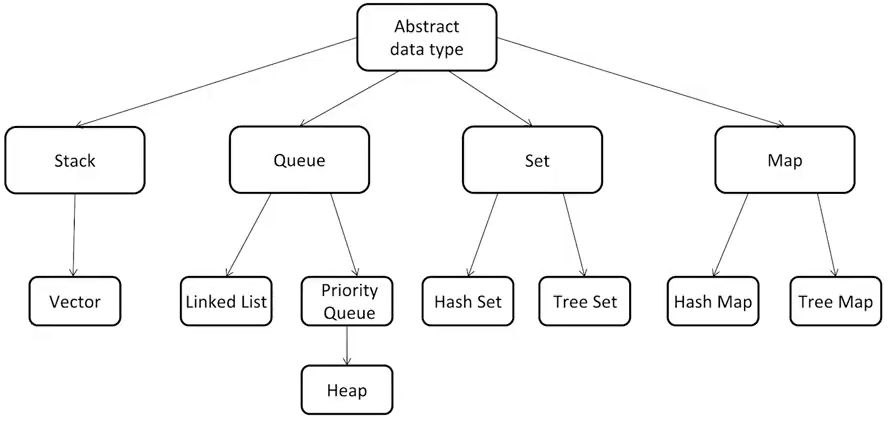

# 算法面试通关

https://visualgo.net/en

## How to Learn

- Chunk up
- Deliberate practice
- Feedback (Timely, Active)

**Data Structures**

- Array
- Stack/Queue
- Priority Queue (heap)
- LinkedList (single/double)
- Tree/Binary Tree
- Binary Search Tree
- Hash Table
- Disjoint Set
- Trie
- BloomFilter
- LRU Cache

**Algorithms**

- In-order/Pre-order/Post-order traversal
- Greedy
- Recursion/Backtrace
- Traversal
- Breadth-first/Depth-first search
- Divide and Conquer
- Dynamic Programming
- Binary Search
- Graph

## Time Complexity

Master theorem

application to common algorithms

| Algorithm                    | Recurrence relationship | Runtime    | Comment |
| ---------------------------- | ----------------------- | ---------- | ------- |
| Binary Search                | $T(n)=T(n/2)+O(1)$      | $O(logn)$  |         |
| Binary tree traversal        | $T(n)=2T(n/2)+O(1)$     | $O(n)$     |         |
| Optimal sorted matrix search | $T(n)=2T(n/2)+O(logn)$  | $O(n)$     |         |
| Merge sort                   | $T(n)=2T(n/2)+O(n)$     | $O(nlogn)$ |         |

## LeetCode

practice, practice, practice

practice by groups

## Array, Linked list

