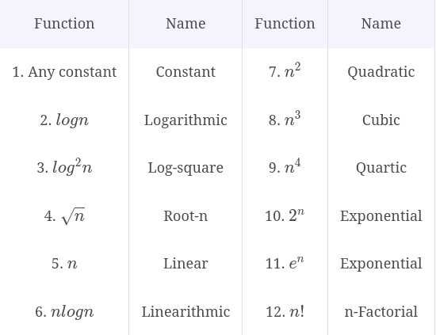

# Data Structures in C++: An Interview Refresher

[toc]

## Introduction to Complexity Measures

time and space

primitive operation

- Best case analysis - lower bound of execution time
- Worst case analysis - upper bound of execution time
- Average case analysis - compute the weighted average of the number of operations with the relative frequencies

time complexity

Asymptotic analysis and Big O

cares about large input sizes only

A function $f(n)$ is considered $O(g(n))$ if there exists some positive real constant c and an integer $n_0\geq 0$ such that the following inequality holds for all $n \geq n_0$: $f(n) \leq cg(n)$

$O(g(n))$ is a set of functions

When dealing with time and space complexities, we are generally interested in the tightest possible bound when it comes to the asymptotic notation.



The above table lists some commonly encountered functions in ascending order of rate of growth. Any function can be given as Big O of any other function that appears later in this table.

Other common Asymptotic notations

- Big 'Omega' - $\Omega$: a function $f(n)$ is in $\Omega(g(n))$ if $f(n)$ will grow at least as fast as $g(n)$

> It is a common misconception that Big O characterizes worst case running time while Big Omega characterizes best case running time of an algorithm. There is no one-to-one relationship between any of these cases and the asymptotic notations.

if $f(n) \in O(g(n))$ then $g(n) \in \Omega(f(n))$

- Big 'Theta' - $\Theta$: if $f(n)$ is in $O(g(n))$ and $f(n)$ is also in $\Omega(g(n))$ then it is in $\Omega(n)$; If $f(n)$ is $\Theta(g(n))$, then the two functions grow at the same rate, within constant factors. So Big Theta is an "asymptotically tight bound.'
- Little 'o': the little o notation is for strictly less
- Little 'omega': 

Big 'O' is preferred over other notations

In algorithm analysis, we tend to focus on the worst case time and space complexity. It tends to be more useful to know that the *worst case* running time of a particular algorithm will grow **at most** as fast as a constant multiple of a certain function than to know that it will grow **at least** as fast as some other function. In other words, Big Omega is often not very useful for use with worst case running time.

Big Theta would be nice to have with a tight bound. Big O is a subset of Big Theta.

The little o and little omega notations require a strict level of inequality (< or >) and the ability to show that there is a valid $n_0$ for any valid choice of $c$. This is not always easy to do.

General tips for calculating complexity

1. Every time a list or arrays gets iterated over $c*length$ times, it is most likely in $O(n)$ time
2. When you see a problem where the number of elements in the problem space gets halved each time, it will most probably be in $O(logn)$ runtime
3. Whenever you have a singly nested loop, the problem is most likely in quadratic time

List of common complexities

- simple for-loop: $O(n)$
- for-loop with increments: $O(n)$
- simple nested for-loop: $O(nm)$
- nested for-loop with dependent variables: $O(n^2)$
- nested for-loop with index modification: $O(n)$ - TODO
- loops with log(n) time complexity: $O(log_k(n))$

## Introduction to Arrays

same data element type; contiguous in memory; static (compile time, on the stack) or dynamic (run time, on the heap) array no bounds checking

dynamic arrays in memory are stored using a reference pointer which points to the first element of the array. For example, if we create int* arr = new int[3], then the variable will point to the start of the array. Memory assigned to arr will be on the stack. The memory created by new keyword will be on heap.

```c++
// Write an ArrayList that could resize and insert element
class ArrayList {
    int* arr;
    int num_elements;
    int capacity;
public:
    ArrayList(int size) {
        arr = new int[size];
        num_elements = 0;
        capacity = size;
    }
    void insert(int val) {
        if (num_elements >= capacity)
            resize();
        arr[num_elements] = val;
        num_elements++;
    }
    void resize() {
        int* temp = new int[capacity*2];
        capacity *= 2;
        for (int i = 0; i < num_elements; ++i)
            temp[i] = arr[i];
        delete[] arr;
        arr = temp;
    }
    int length() {
        return num_elements;
    }
    int getAt(int index) {
        return arr[index];
    }
    void print() {
        for (int i = 0; i < num_elements; ++i)
            cout << arr[i] << " ";
        cout << endl;
    }
};
```


Multidimensional arrays

2D array as an array of the one-dimensional array

```c++
data_type arr[row][col];
// dynamic
datatype** arr = new datatype* [row];
for (int i = 0; i < row; ++i)
    arr[i] = new datatype[col];

// free memory
for (int i = 0; i < row; ++i)
    delete[] arr[i];
delete[] arr;
```


## Introduction to Linked Lists

```c++
class Node {
    int data;
    Node* nextElement;
public:
    Node() {
        nextElement = nullptr;
    }
};

class LinkedList {
    Node* head;
public:
    LinkedList() {
        head = nullptr;
    }
}
```

For any operations on the list, we need to traverse it from the head. The main difference between arrays and linked lists is memory allocation. In linked lists, there is no concept of indexing.

> Note: even when a linked list is empty, the head node must always exist

The main difference between array and linked list is memory allocation.

Insertion at head, tail and any n-th index


