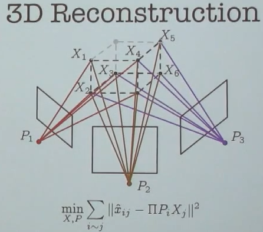
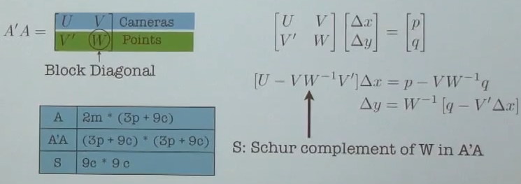
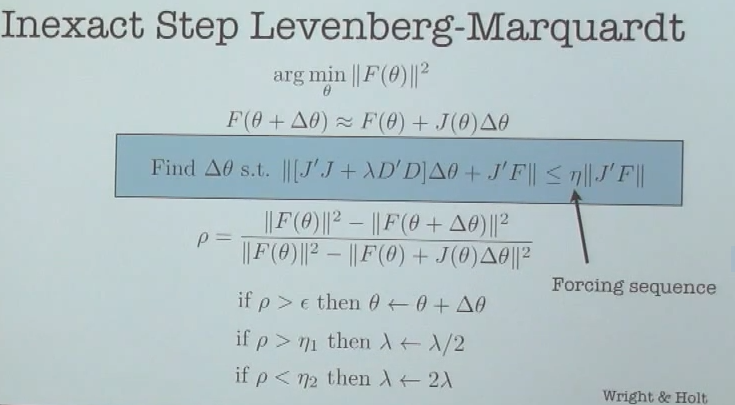

# Ceres Solver

[toc]

## Linear Algebra and Optimization Seminar

https://www.youtube.com/watch?v=u_YC1haw48k Dr. Sameer Agarwal

curve fitting problem: $y_i=f(x_i;\theta)+N(0, \sigma)$ to estimate $\theta$

$\arg\underset{\theta}{\min}\underset{i}\sum(y_i-f(x_i;\theta))^2$

for the above expression

- if you assume Gaussian noise distribution, you have "Maximum likelihood estimate"
- for optimization, you have "Nonlinear least squares" problem

### 3D Reconstruction problem

$\underset{R_i,t_i,X_i}{min} \underset{ij}{\sum}||u_{ij}-\Pi(R_iX_j+t_i)||^2$

where $R_i\in SO(3)$, $t_i, X_j \in \mathbb{R}^3$

$\Pi(x,y,z)=(\frac{x}{z}, \frac{y}{z})$

goal: trying to identify the location and orientation of multiple cameras, as the 3D structure of the scene by observing the 2D images

Applications in CV, Robotics (SLAM)

Example: Street view sensor fusion

- Cars have a variety of sensors: GPS, IMU, LIDAR etc.
- Each sensor reports some information about the position and orientation of the car
- Estimate the most consistent pose of the car from the sensor data

How is this problem is modeled to be solved in Ceres?

Street view 3D reconstruction

Mesh Smoothing using Ceres

### Problem definition

$\arg\underset{\theta}{\min}\underset{i}\sum(y_i-f(x_i;\theta))^2$

$F(\theta)=\begin{bmatrix} y_1-f(x_1,\theta) \\ \vdots \\ y_n-f(x_n,\theta)\end{bmatrix}$

$\arg\underset{\theta}{\min} ||F(\theta)||^2$

#### Solving NNLS-Gauss-Newton Style

$F(\theta+\Delta\theta)\approx F(\theta)+J(\theta)\Delta\theta$

$\arg\underset{\Delta\theta}{\min}||F(\theta)+J(\theta)\Delta\theta||^2$ : linear least squares problem

$\theta \leftarrow \theta+\Delta\theta$ and iterate

However, this Doesn't work! might, might not, local minimal

#### Trust Region Methods

$F(\theta+\Delta\theta)\approx F(\theta)+J(\theta)\Delta\theta$

$\arg\underset{\Delta\theta}{\min}||F(\theta)+J(\theta)\Delta\theta||^2$ s.t. $||D\Delta\theta||^2 \leq \mu$ : Trust Region Problem

$\rho=\frac{||F(\theta)||^2-||F(\theta+\Delta\theta)||^2}{||F(\theta)||^2-||F(\theta)+J(\theta)\Delta\theta||^2}$ : Trust Region Quality

$\begin{cases}
\rho>\epsilon, \theta \leftarrow \theta+\Delta\theta\\
\rho>\eta_1, \mu \leftarrow 2\mu\\
\rho<\eta_2, \mu \leftarrow \mu/2
\end{cases}$ : Trust Region Update

and iterate


the trust region problem can be rewrite as constrained linear least squares

$\arg\underset{\Delta\theta}{\min}||F(\theta)+J(\theta)\Delta\theta||^2+\lambda ||D\Delta\theta||^2$ where $\lambda \propto \frac{1}{\mu}$

$\arg\underset{\Delta\theta}{\min} ||\begin{bmatrix} F \\ 0\end{bmatrix} + \begin{bmatrix}J \\ \sqrt{\lambda}D\end{bmatrix}\Delta\theta||^2$ : linear least squares

#### Levenberg-Marquardt

$\arg\underset{\Delta\theta}{\min}||F(\theta)+J(\theta)\Delta\theta||^2+\lambda ||D\Delta\theta||^2$

$\rho=\frac{||F(\theta)||^2-||F(\theta+\Delta\theta)||^2}{||F(\theta)||^2-||F(\theta)+J(\theta)\Delta\theta||^2}$

$\begin{cases}
\rho>\epsilon, \theta \leftarrow \theta+\Delta\theta\\
\rho>\eta_1, \lambda \leftarrow \lambda/2\\
\rho<\eta_2, \lambda \leftarrow 2\lambda
\end{cases}$ 


### Design Goals

- fast & scalable (big and small problems)
- simple & flexible
- portable (Linux, Windows, iOS, Android)
- Modeling and solving are independent
- good solution quality

### Architecture

- Modeling layer
- Preprocessor
- Evaluator
- Trust Region Solver
- Linear Solver

#### Modeling Layer

$\arg\underset{\theta}{\min} \underset{i}{\sum}f_i^2(\theta_{i1},\theta_{i2},\dots,\theta_{ik})$

- sum of squared residuals
- arbitrary sparsity structure
- build the objective function one term at a time
- hold any number of variables constant
- Analytic, automatic, and numeric derivatives

Jacobian Evaluation

- User provides $J_i$ for each residual
- Ceres assembles $J_i$ into $J(\theta)$
- Correct Jacobian computation is painful
  - correct & efficient chain rule is hard
  - Numerical differentiation is slow, ill-conditioned and slows down convergence

Dual Numbers

Automatic differentiation

$f(x_1,x_2,y_1,y_2)=x_1y_1+x_2y_2-10$

```c++
struct F {
    template<typename T>
    bool operator()(const T* x, const T* y, T* output) {
        output[0] = x[0]*y[0]+x[1]*y[1]-T(10.0);
        return true;
    }
}
```

Computing the LM Step

$\arg\underset{\Delta\theta}{\min} ||\begin{bmatrix} F \\ 0\end{bmatrix} + \begin{bmatrix}J \\ \sqrt{\lambda}D\end{bmatrix}\Delta\theta||^2$

or 

$\arg\underset{\Delta \theta}{\min}||A\Delta\theta-b||^2$, $A\in\mathbb{R}^{m\times n}$, $b\in\mathbb{R}^m$

Generally the most expensive part of a non-linear least squares solver; for some cases, computing the Jacobian can be as or more expensive than this solving

solving methods:

- ~~SVD~~
- QR factorization
- Cholesky factorization
- Conjugate Gradients/LSQR etc.

SVD is pretty but generally useless for nonlinear 

QR vs Cholesky

- Small/medium dense problems
  - QR slower than Cholesky but more accurate
  - Using QR is a good idea
- Large spare problems
  - Sparse Cholesky is WAY cheaper than Sparse QR (way to go)



To do better, we need make some assumptions

for the 3D reconstruction problem

- Jacobian has special structure
- Each residual/row has one camera and one 3d point (Sparse matrix)



- store $A$ as a block sparse matrix
- Custom code to compute the Schur complement
- Use sparse/dense Cholesky factorization to factorize $S$
- 2/3 the memory and 3-6x faster than CHOLMOD on $A'A$

The problem with spare Cholesky

depends on the spare structure

"Why solve an approximation exactly?"

Inexact Step Levenberg-Marquardt



Loss Functions

for robust nonlinear least squares


Box Constraints

tests; Benchmark problems

speed performance; Ceres has a built-in always on profiler

difficult to model the problem well conditioned

local minimum is the best we can get at most cases

Most advices:

1. Improving conditioning
2. Reduce nonlinearity
3. Better initialization
4. Automate differentiation

