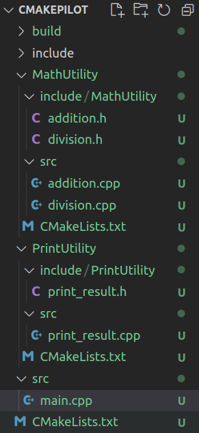

# Master CMake for Cross-Platform C++ Project Building

[toc]

## Introduction

$make command will look for the makefile, and build project based on the rules written in the makefile

- Make: uses *build system files* to generate executable
- CMake: used to generate *build system files*

## CMake Installation and Building the First Target

CMake Installation

- from repository
- Prebuilt binaries
  - Shell scripts (.sh can be downloaded from website directly)
  - Tarball
- Source code

Requirements to run CMake

- CMakeLists.txt
- "Build" (any name) to store the generated build files

```bash
cmake ..
```

will create "CMakeCache.txt" and Makefile

```bash
make
```

will generate the executable


Targets: Libraries, Executables

```cmake
add_executable(<Exec name> <Source files>)
add_library(<Lib name> <Source files>)
```

```cmake
target_link_libraries(<executable> <lib1> <lib2>)
```


### Targets Properties and Dependencies

Target properties

- interface_link_directories
- include_directories
- version
- sources

[CMake properties](https://cmake.org/cmake/help/latest/manual/cmake-properties.7.html)

```cmake
target_link_libraries(myapp PUBIC <item1> <item2>)
target_link_libraries(myapp INTERFACE <item1> <item2>)
target_link_libraries(myapp PRIVATE <item1> <item2>)
```


- Can we add more than 1 executable in CMakeLists.txt
  - yes
- Can we have 2 targets of the same name
  - no
- Do we have the target files saved in our computer?
  - yes


## Managing Project Files and Folders using Subdirectories

```cmake
add_subdirectory(MathUtility)
add_subdirectory(PrintUtility)

target_link_libraries(${PROJECT_NAME} PRIVATE MathUtility PrintUtility)
```

after "make"

```bash
[ 14%] Building CXX object MathUtility/CMakeFiles/MathUtility.dir/src/addition.cpp.o
[ 28%] Building CXX object MathUtility/CMakeFiles/MathUtility.dir/src/division.cpp.o
[ 42%] Linking CXX static library libMathUtility.a
[ 42%] Built target MathUtility
[ 57%] Building CXX object PrintUtility/CMakeFiles/PrintUtility.dir/src/print_result.cpp.o
[ 71%] Linking CXX static library libPrintUtility.a
[ 71%] Built target PrintUtility
[ 85%] Building CXX object CMakeFiles/CMakePilot.dir/src/main.cpp.o
[100%] Linking CXX executable CMakePilot
[100%] Built target CMakePilot
```


CMake way of managing header files

we can use relative path the specify the header files location, but its better to tell CMake to take care of it. 

```cmake
target_include_directories(<target> <scope> <dir1> <dir2> ...)
e.g.
target_include_directories(MathUtility PUBLIC include)  # e.g.
```


Target properties and propagation scopes

| Question                                                     | Answer | Answer    | Answer  |
| ------------------------------------------------------------ | ------ | --------- | ------- |
| Does MathUtility need the directory?                         | Yes    | No        | Yes     |
| Does the other targets, depending on MathUtility need this include directory? | Yes    | Yes       | No      |
|                                                              | PUBLIC | INTERFACE | PRIVATE |

have another folder inside the library include directory with the same name as the library itself.




## Variables, Lists and Strings

Use CMake in the script mode

```cmake
message(<mode-of-display> "the message")
# e.g.

set(MSG "Hello World")
message("Hello World")
message(STATUS ${MSG})  # de-reference, will give "" empty string if not defined
message(DEBUG ${MSG})
message(WARNING ${MSG})
message(FATAL_ERROR "Critical Error")
```

to run

```bash
cmake -P CMakeLists.txt
```

strings & Lists

```cmake
set(Name "Bob Smith")  # -> String "Name" = Bob Smith
set(Name Bob Smith)    # -> List "Name" = Bob;Smith
```

note: project command is not scriptable

Quoted and unquoted arguments (hard to understand)

quotedArg.png)

every variable type in CMake is string type


Lists and Strings


## Control Flow Commands, Functions, Macros, Scopes and Listfiles

Flow control commands

- if-else
- Loop
  - while
  - foreach

```cmake
cmake_minimum_required(VERSION 3.10)

set(NAME Alice)

if (DEFINED NAME)
    message("Name: if block executed")  # this will be printed
else()
    message("Name: else block executed")
endif()


if (COMMAND target_link_library)
    message("target_link_library is a command")
elseif(COMMAND target_link_libraries)
    message("target_link_libraries is a command")  // output
endif()

if (EXISTS CMakeLists.txt)
    message("Given file exists")  # current file
else()
    message("File not found")
endif()
```

```cmake
if ("${CMAKE_CXX_COMPILER_ID}" STREQUAL "GUN" OR
    "${CMAKE_CXX_COMPILER_ID}" STREQUAL "Clang")
    set(warnings "-Wall -Wextra -Werror")
elseif ("${CMAKE_CXX_COMPILER_ID}" STREQUAL "MSVC")
    set(warnings "/W4 /WX /EHsc")
endif()
```

Boolean operators

```cmake
if (NOT DEFINED VAR)
if (NOT (VAR STREQUAL "test" OR VAR2 STREQUAL "test2"))
if (NOT (VAR STREQUAL "test" AND VAR2 STREQUAL "test2"))
```


Looping commands

```cmake
while(<condition>)
	<commands>
endwhile()

foreach(<loop_variable> <items>)
	<commands>
endforeach()
```


Q: Consider a project having 4 targets A, B, C, and D such that target A depends upon targets B, C, and D, and targets C depends upon target D. What is the appropriate CMake command for proper linking of these targets?

```cmake
target_link_libraries(C PUBLIC D)
target_link_libraries(A PUBLIC B C)
```

Functions

Optional arguments for Functions

Scopes


Macros

macros like #define in C

case insensitive


Listfiles and Modules

we have been writing our CMake codes in *CMakelists.txt* files. These files are collectively called the **ListFiles**.

Apart from the listfiles, we also have the concept of **modules**, where the CMake codes are written. These **modules have** **.cmake extension**. 

CMake provides some standard modules containing the CMake codes so  that we can directly use those in any project. You can find those in the */usr/local/share/CMake-3.16/Modules* directory.

These modules can be used with the **include()** command. If you want to use this module, you need to write these 2  lines of code and then the variable VAR will contain the number of  processors.

```cmake
include(ProcessorCount)
ProcessorCount(VAR)
message("Number of processors are: ${VAR}")
```

You can use this VAR variable in your project if you want to run parallel jobs of any process.

Apart from the standard modules, you can also make your own module.

The modules are often used if we want to have reusable code in our project. Also if your *CMakeLists.txt* file is too long, some part of it can be written inside another *.cmake* file; to improve the readability of the code.

## Cache Variables

variables with global scope

- persistent cache variables
- environment variables

```cmake
set(A "123" CACHE STRING "This command sets variable A in persistent cache")
# to use it
message($CACHE{A})
```

CMakeCahe.txt

1. Run CMake command for the first time
2. CMakeCache.txt created
3. ~~Modify/Remove previous cache variables (this step will be rejected)~~

To do this

- Use -D flag


Cache Variables (used often)

- CMAKE_VERSION
- CMAKE_MAJOR_VERSION
- CMAKE_MINOR_VERSION
- CMAKE_PATCH_VERISON
- CMAKE_PROJECT_NAME   # top level project name
- PROJECT_NAME                  # most recent subdirectory project name
- CMAKE_GENERATOR

```bash
# use Ninja generation (or other) rather than Make
$ cmake -DCMAKE_GENERATOR=Ninja ..
# or use -G flag
$ cmake -GNinja
$ ninja
```

## Installing and Exporting Package

### Installing a Package

use a package: download, compile and install it

- compiled libraries/executables
- header files
- supporting files

In Linux, the installation path is `/usr/local`

```cmake
# find the package for use
find_package(<package_name>)
```

To use it, we need to find the installed package

```cmake
# install for sharing
install(FILES <file_name> DESTINATION <dir>)
# or
install(TARGETS <tgt_name> DESTINATION <dir>)
```


check

```cmake
message(${CMAKE_INSTALL_PREFIX})	# /usr/local
```

Recommend installation

- Header files: `/usr/local/include/<package-name>`
- Targets: `/usr/local/lib/<package_name>`

example:

we want to release MathUtility as library for others to use; items to copy: header files (addition.h, division.h); targets (MathUtility)

```cmake
add_library(MathUtility
    src/addition.cpp
    src/division.cpp)

target_include_directories(MathUtility PUBLIC include)

install(FILES ${CMAKE_CURRENT_SOURCE_DIR}/include/MathUtility/addition.h
            ${CMAKE_CURRENT_SOURCE_DIR}/include/MathUtility/division.h
            DESTINATION ${CMAKE_INSTALL_PREFIX}/include/MathUtility)

install(TARGETS MathUtility DESTINATION ${CMAKE_INSTALL_PREFIX}/lib/MathUtility)
```

```bash
$ sudo make install
```

### Exporting a Package

when use `find_package` command

```cmake
find_package(ABC) # -> it looks for ABC-config.cmake file
				  # folder: /usr/local/lib/ABC (1 of many)
```

we need make the ABC-config.cmake file to make this work. 3 steps

- add targets to export group
- install the export group
- modify the target_include_directories() commands

```cmake
add_library(MathUtility
    src/addition.cpp
    src/division.cpp)

# target_include_directories(MathUtility PUBLIC include)
target_include_directories(MathUtility PUBLIC
$<INSTALL_INTERFACE:include>
$<BUILD_INTERFACE:${CMAKE_CURRENT_SOURCE_DIR}/include>)

install(FILES ${CMAKE_CURRENT_SOURCE_DIR}/include/MathUtility/addition.h
            ${CMAKE_CURRENT_SOURCE_DIR}/include/MathUtility/division.h
            DESTINATION ${CMAKE_INSTALL_PREFIX}/include/MathUtility)

install(TARGETS MathUtility EXPORT my_export DESTINATION ${CMAKE_INSTALL_PREFIX}/lib/MathUtility)
install(EXPORT my_export FILE MathUtility-config.cmake DESTINATION ${CMAKE_INSTALL_PREFIX}/lib/MathUtility)
```

this is install

```bash
$ cmake ..
-- The CXX compiler identification is GNU 9.4.0
-- Detecting CXX compiler ABI info
-- Detecting CXX compiler ABI info - done
-- Check for working CXX compiler: /usr/bin/c++ - skipped
-- Detecting CXX compile features
-- Detecting CXX compile features - done
-- Configuring done
-- Generating done
-- Build files have been written to: /CMakePilot/build
$ make
[ 14%] Building CXX object PrintUtility/CMakeFiles/PrintUtility.dir/src/print_result.cpp.o
[ 28%] Linking CXX static library libPrintUtility.a
[ 28%] Built target PrintUtility
[ 42%] Building CXX object MathUtility/CMakeFiles/MathUtility.dir/src/addition.cpp.o
[ 57%] Building CXX object MathUtility/CMakeFiles/MathUtility.dir/src/division.cpp.o
[ 71%] Linking CXX static library libMathUtility.a
[ 71%] Built target MathUtility
[ 85%] Building CXX object CMakeFiles/CMakePilot.dir/src/main.cpp.o
[100%] Linking CXX executable CMakePilot
[100%] Built target CMakePilot
$ sudo make install
Consolidate compiler generated dependencies of target PrintUtility
[ 28%] Built target PrintUtility
Consolidate compiler generated dependencies of target MathUtility
[ 71%] Built target MathUtility
Consolidate compiler generated dependencies of target CMakePilot
[100%] Built target CMakePilot
Install the project...
-- Install configuration: "Release"
-- Installing: /usr/local/include/MathUtility/addition.h
-- Installing: /usr/local/include/MathUtility/division.h
-- Installing: /usr/local/lib/MathUtility/libMathUtility.a
-- Installing: /usr/local/lib/MathUtility/MathUtility-config.cmake
```

How to uninstall

```bash
$ sudo make uninstall
make: *** No rule to make target 'uninstall'.  Stop.
```


Generator Expressions

- Evaluated during **Building system generation**
- Form: $<...>
- Enables **conditional linking, conditional include directories, etc**
- Conditions based on:
  - build configuration
  - target properties
  - platform


### Using a 3rd party Package in our Project

use the previous installed library

```cmake
find_package(MathUtility)
if (MathUtility_FOUND)
	message("MathUtility library found")
	add_executable(calc main.cpp)
	target_link_libraries(calc MathUtility)
else()
	message(FATAL_ERROR "MathUtility library not found")
endif()
```

find_package() commands modes of operation

- Module mode		*Find*MathUtility*.cmake*
- Config mode          MathUtility*-config.cmake*

will find module first and then config mode; 

## Tips/FAQs

running CMakeLists.txt in script mode

```bash
cmake -P CMakeLists.txt
```


Debug/Release Mode; 2 case scenarios:

1. Making a project, which does not depend on any external library. we can directly set a normal variable `CMAKE_BUILD_TYPE`, which generating the build system files.

```bash
cmake -DCMAKE_BUILD_TYPE=Debug ...
cmake -DCMAKE_BUILD_TYPE=Release ..
```

2. We want to use an external library in the Debug/Release mode

   - download the external library's source code and compile it in both *debug* and *release* modes. You **MUST** have separate folders containing the debug and release binaries. e.g. foo/debug/libfoo.so and foo/release/libfoo.so

   - link the external `foo` library to our `my_app` project

     ```cmake
     target_link_libraries(my_app
     	debug /foo/debug/libfoo.so
     	optimized /foo/release/libfoo.so)
     ```

     Now run

     ```bash
     cmake -DCMAKE_BUILD_TYPE=Debug ..
     // or
     cmake -DCMAKE_BUILD_TYPE=Release ..
     ```

     the corresponding debug/release library will be linked

     Note: `cmake..` directly without specifying build type will throw an error


## Linking External Libraries

### Problems with Linking External Libraries

- Linking external libraries using \*config Module
- Linking external libraries using Pkg-Config file
- `find_library` and `find_path` command
- Writing a Find*cmake Module

Using external library

Library name: XYZ

Library file name: libXYZ.a or libXYZ.so

- download the source code (github/official website)
- cmake, make, sudo make install
- XYZ-config.cmake in the installed location
- Use find_package(XYZ)

if there is no \*config module

- ask the library developers to provide
- write your own Find*cmake file
- write \*config module

\*config vs Find* module

- \*config module: standard directories (/usr/local)
- Find* module: inside your project

- If the External library uses CMake based build generation process
  - \*config.cmake present
  - NO \*config.cmake present
- If the External library uses NON-CMake based build generation process
  - CMake or Library may provide Find* or \*config modules
  - Uses pkg-config file
  - NO pkg-config file present

### Installation of OpenCV

[official tutorial](https://docs.opencv.org/4.x/d7/d9f/tutorial_linux_install.html)

- install dependencies
- download, compile and install opencv
- use opencv in C++ program

```cmake
find_package(OpenCV REQUIRED)  -> OpenCVConfig.cmake
# will not find
find_package(opencv REQUIRED)  -> opencvConfig.cmake  # not found
```

Variable Naming conventions

- Package Name: XYZ
  - Libraries: XYZ_LIBRARIES, XYZ_LIBS, ...
  - Include Directories: XYZ_INCLUDES, XYZ_INCLUDE_DIRS, ...
  
- OpenCV uses:
  
  ```cmake
  include_directories(${OpenCV_INCLUDE_DIRS})
  # or, but below need to show up after add_executable
  target_include_directories(${PROJECT_NAME} PRIVATE ${OpenCV_INCLUDE_DIRS})
  target_link_libraries(${PROJECT_NAME} ${OpenCV_LIBS})
  ```

```bash
$ find /usr -name OpenCV*cmake
# output
/usr/local/lib/cmake/opencv4/OpenCVModules.cmake
/usr/local/lib/cmake/opencv4/OpenCVConfig.cmake
/usr/local/lib/cmake/opencv4/OpenCVModules-release.cmake
/usr/local/lib/cmake/opencv4/OpenCVConfig-version.cmake

$ gedit /usr/local/lib/cmake/opencv4/OpenCVConfig.cmake
# output
#    This file will define the following variables:
#      - OpenCV_LIBS                     : The list of all imported targets for OpenCV modules.
#      - OpenCV_INCLUDE_DIRS             : The OpenCV include directories.
#      - OpenCV_COMPUTE_CAPABILITIES     : The version of compute capability.
#      - OpenCV_ANDROID_NATIVE_API_LEVEL : Minimum required level of Android API.
#      - OpenCV_VERSION                  : The version of this OpenCV build: "4.5.5"
#      - OpenCV_VERSION_MAJOR            : Major version part of OpenCV_VERSION: "4"
#      - OpenCV_VERSION_MINOR            : Minor version part of OpenCV_VERSION: "5"
#      - OpenCV_VERSION_PATCH            : Patch version part of OpenCV_VERSION: "5"
```

Q: say, you want to use a package called `fontenc` in your project. You installed the package from the repository using

```bash
sudo apt install libfontenc
```

command. After installation, you can't find the `fontenc.h` file to include in your project. What's the action to solve this problem with **minimal effort**

A: Installing the fontenc-dev or fontenc-devel package from the repository, if available. Not building from source code

### Using Pkg-Config to link GTK3 Library

if the library is not built using the CMake based build tools

Files inside packages

- Compiled library
- Header files
- Symbolic Links
- *Pkg-Config (.pc) files*

Packge to install, if can't find these file, install

- libxyz
- libxyz-dev
- libxyz-devel

Example

- Use **GTK3** library in main.cpp
- Use **Pkg-Config** in CMake

this library is terrible

```cmake
cmake_minimum_required(VERSION 3.10)
project(GTK_PC)

find_package(PkgConfig REQUIRED)
pkg_check_modules(GTK3 REUIRED gtk+-3.0)

add_executable(${PROJECT_NAME}_app main.cpp)
target_include_directories(${PROJECT_NAME}_app PRIVATE ${GKT3_INCLUDE_DIRS})
target_link_libraries(${PROJECT_NAME}_app PRIVATE ${GTK3_LIBRARIES})
```

note: all the `GTK3` above can be replaced with other library names

Pkg_Config search directories

- CMake variable: CMAKE_PREFIX_PATH
- Environment variables: PKG_CONFIG_PATH

### find_library() and find_path() commands

```cmake
# link directory; don't need complete path for each library
target_link_directories(${PROJECT_NAME} PRIVATE /home/Downloads/abc/lib)
target_link_libraries(${PROJECT_NAME} PRIVATE libabc.so libabc1.so libabc.so)
```

find_library and find_path

```cmake
find_library(<VAR> <lib-name> <path1><path2> ...)
# e.g.
find_library(abc_LIBRARY abc HINTS /Home/Downloads/abc)
# now, we can use abc_LIBRARY
abc_LIBRARY: /home/Downloads/abc/libabc.so
# find_library doesn't look for subdirectory by default; 
find_library(abc_LIBRARY 
	NAMES abc abc-1.14 abc-1.15
    HINTS /home/Downloads/abc   /opt/abc	# 2 possible paths
	PATH_SUFFIXES lib lib/acb-1.14)			# subdirectory
```

```cmake
find_path(<VAR> <lib-name> <path1><path2> ... <suffix1> ...)
# e.g.
find_path(abc_INCLUDE abc.h
	HINTS /home/Downloads/abc
	PATH_SUFFIXES include include/abc-1.14)
```

Default paths

- find_library(...)
  - /usr/lib
  - /usr/lib/x86_64-linux-gnu
- find_path(...)
  - /usr/include
  - /usr/include/x86_64-linux-gnu

### Writing a Find* module

search online first; if the library is a famous one, there should be Find* module available

cmake modules

```bash
find /usr -name glib.h/gtk.h/pango.h/cario.h
```

DSO missing; dynamic shared library missing

```bash
find /usr -name *gio*so
```


this whole process is not clean and messy
