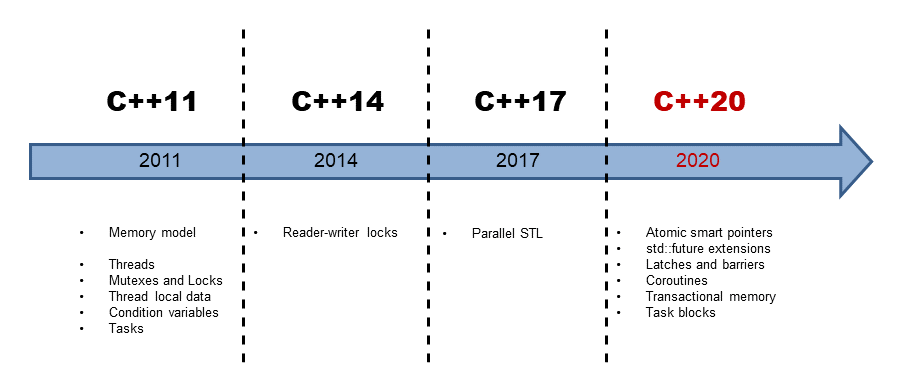
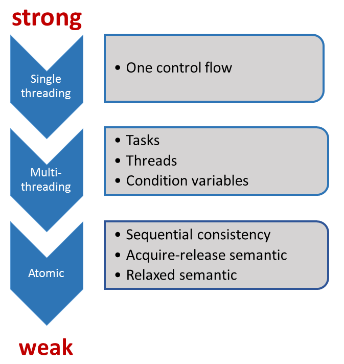

# Modern C++ Concurrency: Get the most out of any machine

- C++11 and C++14 have the basic building blocks for creating concurrent and parallel programs
- With C++17 we have the parallel algorithms from STL. That means that most STL based algorithms can be executed sequentially, parallel or vectorized
- With C++20 we can hope for extended futures, co-routines, transactions and more

[toc]

## A Quick Overview



With C++11, C++ got a multithreading library and a memory model. atomic variables, threads, locks and condition variables

C++11 consists of: a well-defined memory model, and a standardized threading interface; C++14 added reader-writer locks to the multithreading facilities of C++.

The memory model has to deal with the following aspects:

- Atomic operations: operations that can be performed without interruption
- Partial ordering of operations: the sequence of operations that must not be reordered
- Visible effects of operations: guarantees when operations on shared variables are visible in other threads

The C++ memory model was inspired by its predecessor: the Java memory  model. Unlike the Java memory model, however, C++ allows us to break the constraints of *sequential consistency*, which is the default behavior of atomic operations. Sequential consistency provides two guarantees.

1. The instructions of a program are executed in source code order
2. There is a global order for all operations on all threads

The memory model is based on atomic operations on atomic data types (short atomics).

Atomics establish synchronization and ordering constraints that can also hold for non-atomic types. The standardized threading interface is the  core of concurrency in C++.

### Multithreading in C++

Multithreading in C++ consists of threads, synchronization primitives for shared data, thread-local data, and tasks

**Threads**

A std::thread represents an independent unit of program execution. The executable unit, which is started immediately, receives its work package as a callable unit. A callable unit can be a named function, a function object, or a lambda function.

The creator of a thread is responsible for its lifecycle. The executable unit of the new thread ends with the end of the callable. Either the creator waits until the created thread t is done (t.join()), or the creator detaches itself from the created thread (t.detach()). A thread t is *joinable* if no operation t.join() or t.detach() was performed on it. A joinable thread calls std::terminate in its destructor and the program terminates.

A thread that is detached from its creator is typically called a daemon thread because it runs in the background. A `std::thread` is a variadic template. This means that it can receive an arbitrary  number of arguments by copy or reference; either the callable or the  thread can get the arguments.

**Shared Data**

We have to coordinate access to a shared variable if more than one thread is using it at the same time and the variable is mutable (non-const). Reading and writing a shared variable at the same time is a data race, and therefore, undefined behavior. Coordinating access to a shared variable is achieved with mutexes and locks in C++.

**Mutexes**

A mutex (mutual exclusion) guarantees that only one thread can access a shared variable at any given time. A mutex locks and unlocks the critical section that the shared variable belongs to. C++ has five different mutexes; they can lock recursively, tentatively,  and with or without time constraints. Even mutexes can share a lock at  the same time.

**Locks**

You should encapsulate a mutex in a lock to release the mutex automatically. A lock impelments the RAII idiom by binding a mutex's lifetime to its own. C++ has a std::lock_guard for the simple cases, and a std::unique_lock, std::shared_lock for the advanced use-cases.

**Thread-safe initialization of data**

If shared data is read-only, it’s sufficient to initialize it in a *thread-safe* way.

**Thread local data**

Declaring a variable as *thread-local* ensures that each thread  gets its own copy; therefore, there is no shared variable. The lifetime  of a thread local data is bound to the lifetime of its thread.

**Condition Variables**

*Condition variables* enable threads to be synchronized via  messages. One thread acts as the sender while another one acts as the  receiver of the message, where the receiver blocks wait for the message  from the sender. Typical use cases for condition variables are  producer-consumer workflows. A condition variable can be either the  sender or the receiver of the message. Using condition variables  correctly is quite challenging; therefore, tasks are often the easier  solution.

**Tasks**

*Tasks* have a lot in common with threads. While you explicitly  create a thread, a task is simply a job you start. The C++ runtime will  automatically handle, in the simple case of std::async, the lifetime of the task

Tasks are like data channels between two communication endpoints. They  enable thread-safe communication between threads: the promise at one  endpoint puts data into the data channel, and the future at the other  endpoint picks the value up. The data can be a value, an exception, or  simply a notification. In addition to std::async, C++ has class templates std::promise and std::future that give you more control over the task

### C++17: Parallel Algorithms in STL

C++11 and C++14 only provide the basic building blocks for concurrency.  These tools are suitable for a library or framework developer, but not  for the application developer.

With C++17, most STL algorithms will be available in a parallel implementation. std::seq, std::par, std::par_unseq

### C++20: The Concurrent Future

The smart pointers std::shared_ptr, std::weak_ptr have a conceptional issue in concurrent programs: they share an intrinsically mutable state. Therefore, they are prone to data races and leads to undefined behaviors.

std::shared_ptr, std::weak_ptr guarantee that the incrementing and decrementing of the reference counter is an atomic operation and the resource will be deleted exactly once, but neither of them can guarantee that the access to its resource is atomic. The new atomic smart pointers std::atomic_shared_ptr and std::atomic_weak_ptr solve this issue.

Coroutines: functions that can suspend and resume their execution while maintaining  their state. Coroutines are often the preferred approach to implement  cooperative multitasking in operating systems, event loops, infinite  lists, or pipelines.

Challenges: blocking issues, race conditions, data races and deadlocks

## Memory Model: The Contract

The C++ memory model defines a contract

the weaker the rules are that the programmer has to follow, the more  potential there is for the system to generate a highly optimized  executable.

Roughly speaking, there are three contract levels in C++11



the *sequential consistency*  is called the strong memory model, and the *relaxed semantic* is called the weak memory model.

When you invoke a function with two arguments, the C++ standard makes no guarantee about which arguments will be evaluated first, so the  behavior is unspecified. The reason is straightforward: the comma  operator is not a *sequence point* and this will not change in C++.

## Memory Model: Atomics

Atomics are the base of the C++ memory model. By default, the strong version of the memory model (sequential consistency) is applied to the atomics;

Sequential consistency provides two guarantees:

- The instructions of a program are executed in source code order
- There is a global order of all operations on all threads

There are a few models between the sequential consistency and the  relaxed-semantic. The most important one is the acquire-release  semantic. The acquire-release semantic is the key to a deeper understanding of  synchronization and partial ordering in multithreading programming  because the threads will be synchronized at specific synchronization  points in the code.

If no memory order is specified, sequential consistency is applied - meaning that the flag `std::memory_order_seq_cst` is implicitly applied to each operation on an atomic.

```c++
x.store(1);
res = x.load();
// is equivalent to
x.store(1, std::memory_order_seq_cst);
res = x.load(std::memory_order_seq_cst);
```

