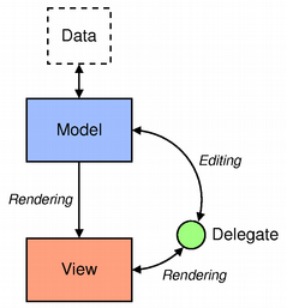

# General Qt Note

[toc]

## Model/View Programming

[Qt's documentation](https://doc.qt.io/qt-5/model-view-programming.html) about Model/View Programming

Qt contains a set of item view classes (e.g. List, Tree, Table, Column and Undo View) that use a model/view architecture to manage the relationship between data and the way it is presented to the user (view). The separation of functionality (separation of concern) provides a standard model interface to allow different data sources to be used with existing item views.

#### The model/view architecture

Model-View-Controller (MVC) is a design pattern, in GoF:

> MVC consists of three kinds of objects. The Model is the application  object, the View is its screen presentation, and the Controller defines  the way the user interface reacts to user input. Before MVC, user  interface designs tended to lump these objects together. MVC decouples them to increase flexibility and reuse.

Qt combines the view and controller to a model/view architecture.

> MVC consists of three kinds of objects. The Model is the application  object, the View is its screen presentation, and the Controller defines  the way the user interface reacts to user input. Before MVC, user  interface designs tended to lump these objects together. MVC decouples  them to increase flexibility and reuse.

Models, Views and Delegates are defined by *abstract classes* that provide common interfaces and, in some cases, default implementations of features.

Models, views, and delegates communicate with each other using *signals and slots*:

- Signals from the model inform the view about changes to the data held by the data source.
- Signals from the view provide information about the user's interaction with the items being displayed.
- Signals from the delegate are used during editing to tell the model and view about the state of the editor.

Discussion of Qt [misusing the model/view terminology](https://stackoverflow.com/questions/5543198/why-qt-is-misusing-model-view-terminology).

