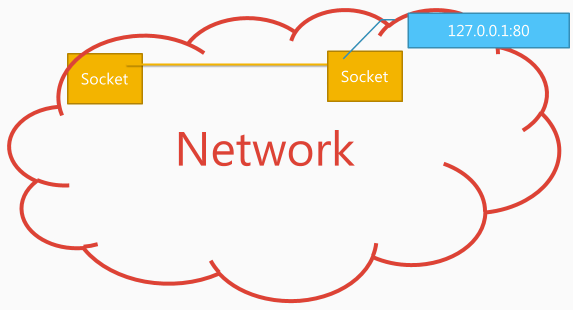
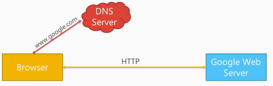
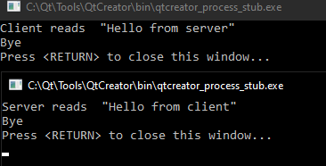
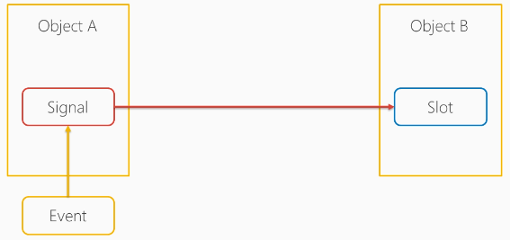
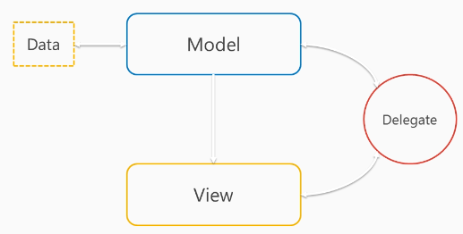
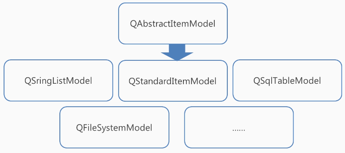
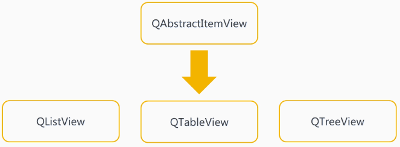
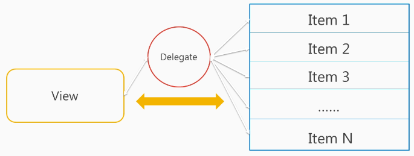
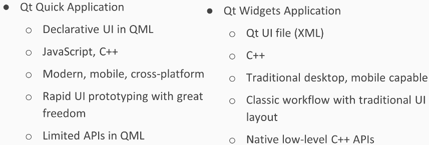
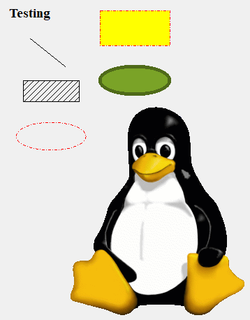

# Learning Qt5

[toc]

## Command Line

use qDebug as cout

```c++
#include <QtDebug>
```

### Fundamentals

Qt event loop

QObject and its memory management

```c++
#include <QCoreApplication>
#include "myparentclass.h"
#include "mychild.h"

int main(int argc, char *argv[]) {

    QCoreApplication a(argc, argv);

    MyParentClass* parent = new MyParentClass();
    MyChild* child = new MyChild(parent);

    // delete parent;  // child will be automatically deleted
    parent->deleteLater();
    child->deleteLater();

    return a.exec();

//    return 0;
}
```

```c++
#include <QObject>

class MyParentClass: public QObject {
    Q_OBJECT
  public:
    explicit MyParentClass(QObject* parent = 0);
    ~MyParentClass();

  signals:

  public slots:

};


class MyChild: public QObject {
    Q_OBJECT
  public:
    explicit MyChild(QObject* parent = 0);
    ~MyChild();

  signals:
  public slots:

};
```

```c++
MyParentClass::MyParentClass(QObject* parent): QObject(parent) {

}
MyParentClass::~MyParentClass() {
    qDebug("MyParentClass destructor");
    QCoreApplication::quit();
}

MyChild::MyChild(QObject* parent): QObject(parent) {

}
MyChild::~MyChild() {
    qDebug("MyChild destructor");
    this->parent()->deleteLater();
}
```

### Command Line Processing

- Adding command-line options
- Parsing and processing command-line options

```c++
#include <QCoreApplication>
#include <QCommandLineOption>
#include <QCommandLineParser>

int main(int argc, char *argv[]) {

    QCoreApplication a(argc, argv);

    a.setApplicationName("Hello World");
    a.setApplicationVersion("0.1");

    int num = -1;

    QCommandLineParser parser;
    parser.addHelpOption();
    parser.addVersionOption();

    QCommandLineOption numOption("n", "The number argument", "number", "1");  // defautl: 1

    parser.addOption(numOption);
    parser.process(a);

    if (parser.isSet(numOption))
        num = parser.value(numOption).toInt();

    qDebug("Hello Qt World: This is number %d", num);

    return 0;
}
```

we can add "command line arguments" in project run setting

To run the program in PowerShell or cmd, remember to copy the needed Qt dll in the folder (e.g. Qt5Cored.dll)

### Multi-platform and Portability

- using compile-time OS macros
- getting system information at run-time
- platform-specific configurations in qmake project file

```c++
#include <QCoreApplication>
#include <QtDebug>
#include <QSysInfo>

void printHello() {
#ifdef Q_OS_WIN
    qDebug() << "Hello Qt World from Windows";

    if (QSysInfo::windowsVersion() == QSysInfo::WV_XP)
        qDebug() << "We're deprecating Windows XP support";
    else if (QSysInfo::windowsVersion() == QSysInfo::WV_WINDOWS10)
        qDebug() << "Hello Windows 10 user";
#elif defined(Q_OS_UNIX)
    qDebug() << "Hello Qt world from UNIX";
#else
    qDebug() << "We don't support this platform yet.";
#endif
}

int main(int argc, char *argv[]) {

    QCoreApplication a(argc, argv);
    printHello();
    return 0;
}
```

## Multithreading and Multiprocessing

- threads and processes
- multithreading and multiprocessing in Qt

Process

- An instance of program (chrome and VLC players are different processes when running)
- It holds all states and resources (e.g. allocated memory)

Thread

- "Light weight" process
- smallest sequence of instructions managed independently by scheduler (e.g. a UI thread, a driver thread in one program)
- can only be started within a process

Process vs. Thread

- sharing resources (threads share resources inside a process; process are independent; a thread crash will cause other threads crash as well, processes generally not)
- communication (much easier to communicate between threads; inter-process communications are trickier)

### Multithreading

QThread class

e.g. listen to user input and general random numbers; the application needs to be responsive at all time; the main event cannot be blocked

```c++
// inputworker.h
#ifndef INPUTWORKER_H
#define INPUTWORKER_H

#include <QObject>
#include <QTextStream>

class InputWorker: public QObject {
    Q_OBJECT
  public:
    explicit InputWorker(QObject* parent = 0);

  signals:
    void inputAvailable(const QString&);

  public slots:
    void startWork();

  private:
    QTextStream is;
};

#endif // INPUTWORKER_H
```

```c++
// inputworker.cpp
#include "inputworker.h"
#include <QThread>
#include <QtDebug>

InputWorker::InputWorker(QObject* parent) : QObject(parent),
    is(stdin) {

}

void InputWorker::startWork() {
    qDebug() << "Input worker thread:" << QThread::currentThreadId();

    do {
        qDebug() << "Input the size of vector:";
        QString input = is.readLine();
        emit inputAvailable(input);
    } while (true);
}
```

```c++
// randomvecworker.h
#ifndef RANDOMVECTORWORKER_H
#define RANDOMVECTORWORKER_H

#include <QObject>

class RandomVectorWorker: public QObject {
    Q_OBJECT
  public:
    RandomVectorWorker(QObject* parent = 0);
  public slots:
    void inputHandler(const QString& in);
};

#endif // RANDOMVECTORWORKER_H
```

```c++
// randomvecworker.cpp
#include "randomvectorworker.h"
#include <QVector>
#include <QDateTime>
#include <QThread>
#include <QtDebug>


RandomVectorWorker::RandomVectorWorker(QObject* parent) :
    QObject(parent) {

}

void RandomVectorWorker::inputHandler(const QString& in) {
    qDebug() << "RandomVectorWorker thread:" << QThread::currentThreadId();
    int size = in.toInt();
    QVector<int> vec;
    vec.resize(size);

    qsrand(QDateTime::currentMSecsSinceEpoch());
    for (int& num: vec) {
        num = qrand();
    }
    qDebug() << "Randomized\n";
}
```

```c++
// main.cpp
#include <QCoreApplication>
#include <QtDebug>
#include <QThread>
#include "inputworker.h"
#include "randomvectorworker.h"

int main(int argc, char *argv[]) {

    QCoreApplication a(argc, argv);

    QThread thread1, thread2;

    thread1.start();
    thread2.start();

    InputWorker inputWorker;
    inputWorker.moveToThread(&thread1);

    RandomVectorWorker vecWorker;
    vecWorker.moveToThread(&thread2);

    QObject::connect(&inputWorker, &InputWorker::inputAvailable,
                     &vecWorker, &RandomVectorWorker::inputHandler);

    inputWorker.startWork();

    return a.exec();
}
```

### Multiprocessing

- starting an external process in Qt application
- communicating with other processes

```c++
#include <QCoreApplication>
#include <QThread>
#include <QProcess>
#include <iostream>

int main(int argc, char *argv[]) {

    QCoreApplication a(argc, argv);

    std::cout << "Main process ID: " << a.applicationPid() << std::endl;

    QProcess process;
    process.setProgram("C:\\gzip\\bin\\gzip.exe");
    process.start();
    process.waitForStarted();
    std::cout << "Process started: " << process.processId() << std::endl;

    int m;
    std::cout << "input an integer: " << std::endl;
    // this will block the process; Gzip will be in task manager list
    std::cin >> m;
    std::cout << "You typed a number: " << m << std::endl;
    process.close();  // Gzip will be closed

    return 0;
}
```

Communicate with Gzip to do something useful

```c++
#include <QCoreApplication>
#include <QThread>
#include <QProcess>
#include <iostream>

int main(int argc, char *argv[]) {

    QCoreApplication a(argc, argv);

    std::cout << "Main process ID: " << a.applicationPid() << std::endl;

    QStringList args;  // QList<QString>
    args << "-c";
    QProcess process;
    process.setProgram("C:\\gzip\\bin\\gzip.exe");
    process.setArguments(args);
    process.start();
    process.waitForStarted();
    process.write("Hello World");
    process.waitForBytesWritten();
    process.closeWriteChannel();
    std::cout << "Process started: " << process.processId() << std::endl;
    process.waitForReadyRead();
    std::cout << process.readAll().toBase64().toStdString() << std::endl;
    process.close();  // Gzip will be closed

    return 0;
}
```

## Networking

### Network programming introduction

- POSIX sockets
  - Berkeley sockets
  - Application programming interface (API)
  - standard interface for connecting to the internet
- TCP and UDP
  - TCP
    - Reliable (re-transmitting missing data packets)
    - Accurate (re-arrange data packets)
    - widely used in most internet services (guarantees order and completeness)
  - UDP (still plays an important role where low latency is important)
    - little overhead
    - connectionless
    - unreliable
    - used in places where overhead or latency is sensitive
- HTTP (hypertext transfer protocol)
  - application layer protocol
  - backbone of www
  - client-server model
  - assuming reliable transport protocol

TCP/IP: transmission control protocol/internet protocol

socket address


E.g.



When type www.google.com in browser, a DNS query is sent by UDP to resolve the IP address of www.google.com, once the result is received, the browser will sent a http request via TCP to google's web server and that server will return the content as response. We could send DNS query via TCP

### HTTP request and downloading

- sending HTTP request
- receiving HTTP request
- downloading a file

```c++
#include <QCoreApplication>
#include <QNetworkAccessManager>
#include <QNetworkRequest>
#include <QNetworkReply>
#include <iostream>

int main(int argc, char *argv[]) {

    QCoreApplication a(argc, argv);

    QNetworkAccessManager man;
    QNetworkRequest req(QUrl("http://blog.qt.io/"));
    QString ua("HttpRequestDemo/0.1 (Wind64) Qt/5.14");
    req.setHeader(QNetworkRequest::UserAgentHeader, QVariant(ua));
    QNetworkReply* reply = man.get(req);
    QObject::connect(reply, &QNetworkReply::finished, [&]() {
        // reply is still open for reading after emitting 'finished' signal
        QByteArray read = reply->readAll();
        std::cout << "Got response:\n"
                  << read.toStdString() << std::endl;
        reply->close();
        reply->deleteLater();
        a.quit();
    });


    return a.exec();
}
```

similarly, we could also download a file from remote server

```c++
#include <QCoreApplication>
#include <QNetworkAccessManager>
#include <QNetworkRequest>
#include <QNetworkReply>
#include <iostream>
#include <QFile>

int main(int argc, char *argv[]) {

    QCoreApplication a(argc, argv);

    QNetworkAccessManager man;
    QNetworkRequest req(QUrl("http://www.gnu.org/licenses/lgpl-3.0.txt"));
    QString ua("HttpRequestDemo/0.1 (Wind64) Qt/5.14");
    req.setHeader(QNetworkRequest::UserAgentHeader, QVariant(ua));
    QNetworkReply* reply = man.get(req);
    QObject::connect(reply, &QNetworkReply::finished, [&]() {
        // reply is still open for reading after emitting 'finished' signal
        QByteArray read = reply->readAll();
        QFile out("lgpl-3.0.txt");
        out.open(QIODevice::WriteOnly|QIODevice::Text);
        out.write(read);
        out.close();
        reply->close();
        reply->deleteLater();
        a.quit();
    });


    return a.exec();
}
```

The lgpl-3.0.txt license is downloaded correctly - Nice

### TCP server

- creating a TCP client
- creating a TCP server

```c++
// TCP client
#include <QCoreApplication>
#include <QTcpSocket>
#include <QHostAddress>
#include <QtDebug>

int main(int argc, char *argv[]) {

    QCoreApplication a(argc, argv);

    QTcpSocket client;
//    client.bend(QHostAddress::LocalHost);
    client.connectToHost(QHostAddress::LocalHost, 54321);
    client.waitForConnected();
    if (client.state() != QTcpSocket::ConnectedState) {
        qDebug() << "Failed to connect to localhost:54321";
        return  1;
    }

    client.waitForReadyRead();  // blocking methods
    QByteArray readData = client.readAll();
    qDebug() << "Client reads " << readData;

    QByteArray toWrite("Hello from client");
    client.write(toWrite);
    client.waitForBytesWritten();

    qDebug() << "Bye";

    return 0;
}
```

server side

```c++
#include <QCoreApplication>
#include <QTcpSocket>
#include <QTcpServer>
#include <QHostAddress>
#include <QtDebug>

int main(int argc, char *argv[]) {

    QCoreApplication a(argc, argv);

    QTcpServer server;
    if (!server.listen(QHostAddress::LocalHost, 54321)) {
        qDebug() << "Failed to listen at localhost:54321";
        return 1;
    }
    server.waitForNewConnection(-1);  // -1: no timeout
    QTcpSocket* con = server.nextPendingConnection();
    QByteArray toWrite("Hello from server");
    con->write(toWrite);
    con->waitForBytesWritten();
    con->waitForReadyRead();

    QByteArray readData = con->readAll();
    qDebug() << "Server reads " << readData;
    con->close();
    con->deleteLater();  // good practice to avoid memory wasting
    server.close();

    qDebug() << "Bye";

    return 0;
}
```

run server side to listen to the localHost first and then run the client side. Synchronized. Nice



## Qt GUI Application Development Basics

- Design in Qt Creator
- Signals and slots
- Window, Dialog, Popup

### Signals and slots

- signals and slots mechanism
- connect a signal and a slot

Signals and slots mechanism is one of its most important features allowing communication between objects. A signal can be emitted from any QObject objects or its subclasses, which will then trigger any slot functions of any objects that are connected to the signals. signals and slots are the foundations of asynchronized events in Qt.

Compared with callbacks (Qt 5 also support), the signals and slots mechanism is comparably more fluid and flexible for the programmer to use. Type safe and not strongly coupled to the processing function.

> A signal of an arbitrary class can trigger any private slots of an unrelated class that is going to be invoked, which is not possible with callbacks



```c++
// mainwindow.h
#ifndef MAINWINDOW_H
#define MAINWINDOW_H

#include <QMainWindow>

QT_BEGIN_NAMESPACE
namespace Ui {
class MainWindow;
}
QT_END_NAMESPACE

class MainWindow : public QMainWindow {
    Q_OBJECT

  public:
    MainWindow(QWidget *parent = nullptr);
    ~MainWindow();

  signals:
    void init();

  public slots:  // public or private
    void onInit();

  private:
    Ui::MainWindow *ui;
};
#endif // MAINWINDOW_H
```

the signals and slots are defined; the signals function must return void

```c++
// mainwindow.cpp
#include "mainwindow.h"
#include "ui_mainwindow.h"

MainWindow::MainWindow(QWidget *parent)
    : QMainWindow(parent)
    , ui(new Ui::MainWindow) {
    ui->setupUi(this);
    ui->label->setText("Hello Qt World!");

    connect(this, &MainWindow::init, this, &MainWindow::onInit); 
    emit init();
}

MainWindow::~MainWindow() {
    delete ui;
}

void MainWindow::onInit() {
    qDebug("init");
}
```

Notice that we could connect the signal and slots after the signal emission

A signal could also be connected to C++11 Lambda functors. Let's try to connect a built-in signal (destroyed) to main.cpp

```c++
#include "mainwindow.h"

#include <QApplication>

int main(int argc, char *argv[]) {
    QApplication a(argc, argv);
    MainWindow w;

    QObject::connect(&w, &MainWindow::destroyed, []() {
        qDebug("mainwindow destroyed");
    });

    w.show();

    return a.exec();
}
```

notice connect is a static member function of QObject

create our own signals and slots functions

```c++
// myclass.h
#ifndef MYCLASS_H
#define MYCLASS_H

#include <QMainWindow>
#include <QMessageBox>

class MyClass : public QObject {
    Q_OBJECT
  public:
    explicit MyClass(QObject* parent = nullptr);
  signals:

  public slots:
    void doSomething();
};

#endif // MYCLASS_H
// myclass.cpp
#include "myclass.h"

MyClass::MyClass(QObject* parent): QObject(parent) {

}

void MyClass::doSomething() {
    //QMessageBox::information(this, "hello", "Button clicked");
    QMessageBox::information(0, "Hello", "Button clicked");  // 0: no parent
}
```

```c++
// mainwindow.h
#ifndef MAINWINDOW_H
#define MAINWINDOW_H

#include <QMainWindow>
#include "myclass.h"

QT_BEGIN_NAMESPACE
namespace Ui {
class MainWindow;
}
QT_END_NAMESPACE

class MainWindow : public QMainWindow {
    Q_OBJECT

  public:
    MainWindow(QWidget *parent = nullptr);
    ~MainWindow();

  signals:
    void doNow();

  private slots:
    void on_pushButton_clicked();

  private:
    Ui::MainWindow *ui;

};
#endif // MAINWINDOW_H

// mainwindow.cpp
#include "mainwindow.h"
#include "ui_mainwindow.h"
#include <QMessageBox>

MainWindow::MainWindow(QWidget *parent)
    : QMainWindow(parent)
    , ui(new Ui::MainWindow) {

    ui->setupUi(this);
    MyClass* myclass = new MyClass;
    connect(this, &MainWindow::doNow, myclass, &MyClass::doSomething);
}

MainWindow::~MainWindow() {
    delete ui;
}

void MainWindow::on_pushButton_clicked() {
    //QMessageBox::information(this, "Hello", "Button has been clicked");
    emit doNow();
}

```

In the new syntax, we must specify the type of objects for signals and slots

```c++
connect(
	sender, &Sender::valueChanged,
	receiver, &Receiver::updateValue
);
```

The new syntax also allows connecting a signal directly to a function (including lambda) instead of QObject

```c++
connect(
	sender, &Sender::valueChanged, myFunction
);
```

Almost all widget has a set of slot functions associated with its usage. A push button will start emitting signals that trigger the slot functions associated with it when pressed or released.

### Window, dialog and popup

QMainWindow, QDialog

There is no menu bar, tool bar, status bar in dialog; it is usually used for short-term tasks; it can be modal, which will block operations on other visible window

```c++
// a popup
#include "mainwindow.h"
#include "ui_mainwindow.h"
#include <QDialog>

MainWindow::MainWindow(QWidget *parent)
    : QMainWindow(parent)
    , ui(new Ui::MainWindow) {
    ui->setupUi(this);
    ui->label->setText("Hello Qt World!");

    connect(this, &MainWindow::init, this, &MainWindow::onInit);
    connect(ui->actionmyAction, &QAction::triggered, this, &MainWindow::onShowPopup);
    emit init();
}

MainWindow::~MainWindow() {
    delete ui;
}

void MainWindow::onInit() {
    qDebug("init");
}

void MainWindow::onShowPopup() {
    QDialog* popup = new QDialog(this);
//    popup->exec();
    popup->show();  // not blocking
    qDebug("onShowPopup finished");
}
```

We could also add dialog from UI (better for customization). 

- select project, add new
- Qt < Qt Designer Form Class < choose templates

```c++
#include "mainwindow.h"
#include "ui_mainwindow.h"
//#include <QDialog>
#include "dialog.h"  // the new Dialog class derived from QDialog

MainWindow::MainWindow(QWidget *parent)
    : QMainWindow(parent)
    , ui(new Ui::MainWindow) {
    ui->setupUi(this);
    ui->label->setText("Hello Qt World!");

    connect(this, &MainWindow::init, this, &MainWindow::onInit);
    connect(ui->actionmyAction, &QAction::triggered, this, &MainWindow::onShowPopup);
    emit init();
}

MainWindow::~MainWindow() {
    delete ui;
}

void MainWindow::onInit() {
    qDebug("init");
}

void MainWindow::onShowPopup() {
//    QDialog* popup = new QDialog(this);
    Dialog* popup = new Dialog(this);

    popup->exec();
//    popup->show();  // not blocking
    qDebug("onShowPopup finished");
}
```

### Asynchronous programing made easier

Signals and slots mechanism is asynchronous in nature. Qt 5 allows us to make use of its signals and slots mechanism for things other than interfaces. A signal can trigger a normal function instead of a slot function from a QObject.

Lambda expressions make declaring a slot function optional, but this is only recommended if code is really short.

```c++
#include <QCoreApplication>
#include <QNetworkAccessManager>
#include <QNetworkReply>
#include <QDebug>

void printHtml(QString html) {
    qDebug() << "Done";
    qDebug() << html;
}

int main(int argc, char *argv[]) {

    QCoreApplication a(argc, argv);

    QString* html = new QString;
    qDebug() << "start";

    QNetworkAccessManager manager;
    QNetworkRequest req(QUrl("http://www.dustyfeet.com"));
    QNetworkReply* reply = manager.get(req);

    QObject::connect(reply, &QNetworkReply::downloadProgress,
    [reply, html]() {
        html->append(QString(reply->readAll()));
    });

    QObject::connect(reply, &QNetworkReply::downloadProgress,
    [reply](qint64 bytesReceved, qint64 bytesTotal) {
        qDebug() << "Progress: " << bytesReceved << "bytes /" << bytesTotal << "bytes";
    });

    QObject::connect(reply, &QNetworkReply::finished, [=]() {
        printHtml(*html);
    });

    return a.exec();
}
```

**Function callbacks**

Qt 5 still use function callabcks, such as keyboard input, window resize etc. Since these events only need to be implemented once, there is no need to use the signals and slots mechanism.

```c++
// mainwindow.h
#ifndef MAINWINDOW_H
#define MAINWINDOW_H

#include <QMainWindow>
#include <QDebug>
#include <QResizeEvent>
#include <QMouseEvent>
#include <QKeyEvent>

QT_BEGIN_NAMESPACE
namespace Ui {
class MainWindow;
}
QT_END_NAMESPACE

class MainWindow : public QMainWindow {
    Q_OBJECT

  public:
    MainWindow(QWidget *parent = nullptr);
    ~MainWindow();

    void resizeEvent(QResizeEvent* event);

    void keyPressEvent(QKeyEvent* event);
    void keyReleaseEvent(QKeyEvent* event);

    void mouseMoveEvent(QMouseEvent* event);
    void mousePressEvent(QMouseEvent* event);
    void mouseReleaseEvent(QMouseEvent* event);

  private:
    Ui::MainWindow *ui;
};
#endif // MAINWINDOW_H

// mainwindow.cpp
#include "mainwindow.h"
#include "ui_mainwindow.h"

MainWindow::MainWindow(QWidget *parent)
    : QMainWindow(parent)
    , ui(new Ui::MainWindow) {
    ui->setupUi(this);

    this->setMouseTracking(true);
    ui->centralwidget->setMouseTracking(true);
}

MainWindow::~MainWindow() {
    delete ui;
}

void MainWindow::resizeEvent(QResizeEvent* event) {
    qDebug() << "Old size: " << event->oldSize() << ", New size: " << event->size();
}

void MainWindow::keyPressEvent(QKeyEvent* event) {
    if (event->key() == Qt::Key_Escape)
        this->close();
    qDebug() << event->text() << " has been pressed";
}

void MainWindow::keyReleaseEvent(QKeyEvent* event) {
    qDebug() << event->text() << " has been released";
}

void MainWindow::mouseMoveEvent(QMouseEvent* event) {
    qDebug() << "Position: " << event->pos();
}

void MainWindow::mousePressEvent(QMouseEvent* event) {
    qDebug() << "Mouse pressed: " << event->button();
}

void MainWindow::mouseReleaseEvent(QMouseEvent* event) {
    qDebug() << "Mouse released: " << event->button();
}
```

Qt 5 objects, especially the main window, has a dozen of built-in callbacks that exist as virtual functions. These functions can be overridden.

## Widgets and Layouts

### Display widgets

examples with

- displaying text in label, text Browser
- displaying image with QPixmap
- display progress bar with timer and slots

```c++
#include "mainwindow.h"
#include "ui_mainwindow.h"
#include <QTimer>

MainWindow::MainWindow(QWidget *parent)
    : QMainWindow(parent)
    , ui(new Ui::MainWindow) {
    ui->setupUi(this);

    QTimer* timer = new QTimer(this);
    timer->setInterval(500);

    connect(timer, &QTimer::timeout, this, &MainWindow::onTimeOut);
    timer->start();
    //timer->setSingleShot(true);
}

MainWindow::~MainWindow() {
    delete ui;
}

void MainWindow::onTimeOut() {
    int value = ui->progressBar->value();
    if (value >= 100) {
        return;
    }
    value += 1;
    ui->progressBar->setValue(value);
}
```

### Editable Widgets

examples

- use Combo box
- get text from Text Edit
- formatting with HTML

```c++
#include "mainwindow.h"
#include "ui_mainwindow.h"

MainWindow::MainWindow(QWidget *parent)
    : QMainWindow(parent)
    , ui(new Ui::MainWindow) {

    plainText = true;
    ui->setupUi(this);

    connect(ui->comboBox, &QComboBox::currentTextChanged, this,
            &MainWindow::onComboBoxChanged);
    connect(ui->textEdit, &QTextEdit::textChanged, this,
            &MainWindow::updateTextBrowser);

}

MainWindow::~MainWindow() {
    delete ui;
}

void MainWindow::updateTextBrowser() {
    QString text = ui->textEdit->document()->toPlainText();
    if (plainText)
        ui->textBrowser->setPlainText(text);
    else
        ui->textBrowser->setHtml(text);
}

void MainWindow::onComboBoxChanged(const QString& text) {
    plainText = (text == "Plain");
    updateTextBrowser();
}
```

### Layouts

- QBoxLayout (QHBoxLayout, QVBoxLayout)
- QGridLayout - most flexible
- QFormLayout (label, fields)

### Tabs

- QTabWidget
- creating tabbed window using QTabWidget

```c++
#include "mainwindow.h"
#include "ui_mainwindow.h"
#include <QLabel>

MainWindow::MainWindow(QWidget *parent)
    : QMainWindow(parent)
    , ui(new Ui::MainWindow) {

    ui->setupUi(this);

    // add new tab
    QLabel* newLabel = new QLabel("Hello new Tab", this);
    ui->tabWidget->addTab(newLabel, "New Tab Title");

    // switch tab
    // ui->tabWidget->setCurrentIndex(2);
    ui->tabWidget->setCurrentWidget(newLabel);

    // remove tab
    ui->tabWidget->removeTab(1);

}

MainWindow::~MainWindow() {
    delete ui;
}
```


## Models and Views

an important architecture in Qt

- The Mode/View Architecture
- table model and view
- list model and view

MVC: (design patterns book)

- Model: the application model
- View: the screen presentation
- Controller: defines the way the user interface reacts to the user inputs

model-view structure in Qt



communicate with signals-slots

Qt Models



The model does not need to store the data, but instead it could be stored in a database. we can inherit from one to create our own class

Qt Views



Qt Delegates



delegates control how the inputs is obtained from the user, as well as how individual components are rendered. But unlike controller in MCV structure, the Delegate doesn't manage interaction completely.

### Table model and view

- QSqlTableModel
- QTableView

```c++
#include "mainwindow.h"
#include "ui_mainwindow.h"
#include <QSqlDatabase>
#include <QSqlQuery>

MainWindow::MainWindow(QWidget *parent)
    : QMainWindow(parent)
    , ui(new Ui::MainWindow) {

    ui->setupUi(this);

    initDb();
    QSqlTableModel* model = initModel();
    ui->tableView->setModel(model);
}

MainWindow::~MainWindow() {
    delete ui;
}

void MainWindow::initDb() {
    QSqlDatabase db = QSqlDatabase::addDatabase("QSQLITE");
    db.setDatabaseName(":memory:");  // in-memory SQLite database
    db.open();
    db.exec("CREATE TABLE price (name Text, price Currency)");
    db.exec("INSERT INTO price (name, price) VALUES('Apple', 2.01)");
    db.exec("INSERT INTO price (name, price) VALUES('Banana', 1.332)");
    db.exec("INSERT INTO price (name, price) VALUES('Orange', 0.60)");
    db.exec("INSERT INTO price (name, price) VALUES('Pear', 1.93)");

}

QSqlTableModel* MainWindow::initModel() {
    QSqlTableModel* model = new QSqlTableModel(this);
    model->setTable("price");
    model->select();

    model->setHeaderData(0, Qt::Horizontal, "Item Name");
    model->setHeaderData(1, Qt::Horizontal, "Price");
    return model;
}
```

### List Model and View

- QStringListModel
- QStringListModel and QListView
- QSqlTableModel and QListView

```c++
#include "mainwindow.h"
#include "ui_mainwindow.h"
#include <QSqlDatabase>
#include <QSqlQuery>
#include <QStringListModel>

MainWindow::MainWindow(QWidget *parent)
    : QMainWindow(parent)
    , ui(new Ui::MainWindow) {

    ui->setupUi(this);

    initDb();
    QSqlTableModel* model = initModel();
    ui->tableView->setModel(model);
    //ui->listView->setModel(initStringModel());
    ui->listView->setModel(model);  // model and view
}

MainWindow::~MainWindow() {
    delete ui;
}

void MainWindow::initDb() {
    QSqlDatabase db = QSqlDatabase::addDatabase("QSQLITE");
    db.setDatabaseName(":memory:");  // in-memory SQLite database
    db.open();
    db.exec("CREATE TABLE price (name Text, price Currency)");
    db.exec("INSERT INTO price (name, price) VALUES('Apple', 2.01)");
    db.exec("INSERT INTO price (name, price) VALUES('Banana', 1.332)");
    db.exec("INSERT INTO price (name, price) VALUES('Orange', 0.60)");
    db.exec("INSERT INTO price (name, price) VALUES('Pear', 1.93)");

}

QSqlTableModel* MainWindow::initModel() {
    QSqlTableModel* model = new QSqlTableModel(this);
    model->setTable("price");
    model->select();

    model->setHeaderData(0, Qt::Horizontal, "Item Name");
    model->setHeaderData(1, Qt::Horizontal, "Price");
    return model;
}

QAbstractItemModel* MainWindow::initStringModel() {
    QStringList list({"Parsley", "Sage", "Rosemary", "Thyme"});
    QStringListModel* model = new QStringListModel(list, this);
    model->setData(model->index(3), "Cinnamon");
    return model;
}
```

## Introduction to Qt Quick and QML

- Design Qt Quick application
- Dynamic QML

QML

- JSON-like declarative language
- user interface markup
- compatible with JavaScript
- Dynamic property binding

Qt Quick

- Highly dynamic user interface framework
- declarative scripting language for designing (QML)
- standard library of types and functionality


### Designing Qt Quick Application

- Quick Controls
- Create Qt Quick project
- Design Qt Quick application in QML
- Design Qt Quick application in Design Mode

### Dynamic QML

- Rt Resource system
- dynamic property binding in QML

## QML and JavaScript

## Qt Quick Widgets

## States and Animations with Qt and QML

- Property animation in Qt
- State machines in Qt

Qt provides a way to animate widgets or any other objects that inherit the QObject class through its powerful animation framework. The animation can be used either on its own or with the state machine framework, which allows different animations to be played based on the current active state of the widget.

### Property Animation

```c++
#include "mainwindow.h"
#include "ui_mainwindow.h"
#include <QPropertyAnimation>

MainWindow::MainWindow(QWidget *parent)
    : QMainWindow(parent)
    , ui(new Ui::MainWindow) {
    ui->setupUi(this);

    this->setMouseTracking(true);
    ui->centralwidget->setMouseTracking(true);

    QPropertyAnimation* animation = new QPropertyAnimation(
        ui->pushButton, "geometry");
    animation->setDuration(3000);
    animation->setStartValue(ui->pushButton->geometry());
    animation->setEndValue(QRect(200, 200, 100, 50));  // top left corder x, y, dx, dy
    animation->start();
}

MainWindow::~MainWindow() {
    delete ui;
}

void MainWindow::mouseMoveEvent(QMouseEvent* event) {
    QString currentPos = QString("Current position: %1, %2").arg(event->pos().x()).arg(event->pos().y());
    ui->statusbar->showMessage(currentPos);
}
```

Property animation class QPropertyAnimation is part of the animation framework and it makes use of the timer system to change the properties of a GUI element over a given duration.

subsystems to create GUI animations: timer, timeline, animation framework, state machine framework and graphics view framework

- Timer: repetitive and single-shot timer. When the timeout value is reached, an event callback function will be triggered through signal-and-slot mechanism
- Timeline: calls a slot periodically to animate GUI element. similar to a repetitive timer, but instead of doing the same thing all of the time when the slot is triggered, timeline provides a value to the slot to indicate its current frame index so that you can do different things based on the given value
- Animation framework: animations are controlled by using easing curves. speed, acceleration of animation: linear, quadratic, cubic, quartic, sine, exponential, circular, elastic
- State Machine: provides with classes for creating and executing state graphs, which allow each GUI element to move from one state to another when triggered by signals. The state graph in the state machine framework is hierarchical, which means each state can also be nested inside of other states.
- Graphics view: a powerful graphics engine for visualizing and interacting with a large number of custom-made 2D graphical items

```c++
    QPropertyAnimation* animation = new QPropertyAnimation(
        ui->pushButton, "geometry");
    animation->setDuration(3000);
    animation->setStartValue(ui->pushButton->geometry());
    animation->setEndValue(QRect(200, 200, 100, 50));

    QEasingCurve curve;
    curve.setType(QEasingCurve::OutBounce);
    curve.setAmplitude(1.0);  // bounce or elastic spring effect
    curve.setOvershoot(1.7);
    curve.setPeriod(0.3);

    animation->setEasingCurve(curve);
	// animation->setEasingCurve(QEasingCurve::OutBounce)
    animation->setLoopCount(2);  // -1 for infinite
    animation->start();
```

There are many types of easing curve available

### Animation Group

```c++
    QParallelAnimationGroup* group = new QParallelAnimationGroup;  // or QSequentialAnimationGroup
    group->addAnimation(animation1);
    group->addAnimation(animation2);
    group->addAnimation(animation3);
    group->start();
```

property animations and animation groups both inherit from QAbstractAnimator class, thus we can nest animation groups (even mix parallel and sequential)

### State Machines in Qt

State machines can be used for many purposes, but we cover animation here

```c++
#include "mainwindow.h"
#include "ui_mainwindow.h"
#include <QStateMachine>
#include <QPropertyAnimation>
#include <QEventTransition>

MainWindow::MainWindow(QWidget *parent)
    : QMainWindow(parent)
    , ui(new Ui::MainWindow) {
    ui->setupUi(this);

    this->setMouseTracking(true);
    ui->centralwidget->setMouseTracking(true);

    QStateMachine* machine = new QStateMachine(this);
    QState* s1 = new QState();
    QState* s2 = new QState();

    s1->assignProperty(ui->stateLabel, "text", "Current state: 1");
    s1->assignProperty(ui->pushButton, "geometry", QRect(50, 200, 100, 50));

    s2->assignProperty(ui->stateLabel, "text", "Current state: 2");
    s2->assignProperty(ui->pushButton, "geometry", QRect(200, 50, 140, 100));

    QEventTransition* t1 = new QEventTransition(ui->changeState, QEvent::MouseButtonPress);
    t1->setTargetState(s2);
    t1->addAnimation(new QPropertyAnimation(ui->pushButton, "geometry"));
    s1->addTransition(t1);

    QEventTransition* t2 = new QEventTransition(ui->changeState, QEvent::MouseButtonPress);
    t2->setTargetState(s1);
    t2->addAnimation(new QPropertyAnimation(ui->pushButton, "geometry"));
    s2->addTransition(t2);

    machine->addState(s1);
    machine->addState(s2);
    machine->setInitialState(s1);
    machine->start();
}

MainWindow::~MainWindow() {
    delete ui;
}
```

The QEventTransition classes define what will trigger the transition between one state and another

The state machine framework provides classes for creating and executing state graphs. Qt's event system is used to drive the state machines, where transitions between states can be triggered by using signals, and then the slots on the end will be invoked by the signals to perform an action.

The state graph in the state machine framework is hierarchical, and can be nested

### States, transitions, and animations in QML

similar features in Qt Quick is provided using QML instead of C++

### Animating widget properties using animators

animate the GUI widgets properties using QML animator feature

## QPainter and 2D Graphics

how to render 2D graphics onscreen with Qt. Internally, Qt uses a low-level class QPainter to render its widgets on the main window. Qt allows us to access and use the QPainter class for drawing vector graphics, text, 2D images, and 3D graphics

### Drawing basic shapes onscreen

```c++
void MainWindow::paintEvent(QPaintEvent* event) {
    QPainter textPainter;
    textPainter.begin(this);
    textPainter.setFont(QFont("Times", 14, QFont::Bold));
    textPainter.drawText(QPoint(20, 30), "Testing");
    textPainter.end();

    QPainter linePainter;
    linePainter.begin(this);
    linePainter.drawLine(QPoint(50, 60), QPoint(100, 100));
    linePainter.end();

    QPainter rectPainter;
    rectPainter.begin(this);
    rectPainter.setBrush(Qt::BDiagPattern);
    rectPainter.drawRect(QRect(40, 120, 80, 30));
    rectPainter.end();

    QPen ellipsePen;
    ellipsePen.setColor(Qt::red);
    ellipsePen.setStyle(Qt::DashDotLine);

    QPainter ellipsePainter;
    ellipsePainter.begin(this);
    ellipsePainter.setPen(ellipsePen);
    ellipsePainter.drawEllipse(QPoint(80, 200), 50, 20);
    ellipsePainter.end();

    // We can also use the QPainterPath class to define
    // a shape before passing it over to the QPainter class for rendering
    QPainterPath rectPath;
    rectPath.addRect(QRect(150, 20, 100, 50));

    QPainter pathPainter;
    pathPainter.begin(this);
    pathPainter.setPen(QPen(Qt::red, 1, Qt::DashDotLine, Qt::FlatCap, Qt::MiterJoin));
    pathPainter.setBrush(Qt::yellow);
    pathPainter.drawPath(rectPath);
    pathPainter.end();

    QPainterPath ellipsePath;
    ellipsePath.addEllipse(QPoint(200, 120), 50, 20);

    QPainter ellipsePathPainter;
    ellipsePathPainter.begin(this);
    ellipsePathPainter.setPen(QPen(QColor(79, 106, 25), 5, Qt::SolidLine, Qt::FlatCap, Qt::MiterJoin));
    ellipsePathPainter.setBrush(QColor(122, 163, 39));
    ellipsePathPainter.drawPath(ellipsePath);
    ellipsePathPainter.end();

    // draw an image using QPainter
    QImage image;
    image.load("Tux.png");

    QPainter imagePainter(this);
    //imagePainter.begin(this);
    imagePainter.drawImage(QPoint(100,150), image);
    imagePainter.end();
}
```



- QPen: graphic outline
- QBrush: graphics background

QImage can load images from both the computer directories and from the program resources

Think of QPainter as a robot with a pen and an empty canvas

In Qt, all widget classes (including the main window) have an event handler called QWidget::paintEvent(). This event handler will be triggered whenever the OS thinks that the main window should re-draw its widgets (such as main window scaled, a widget changing its state, or functions such as repaint() or update() being invoked manually in the code).

### Exporting shapes to SVG files

SVG is an XML-based language for describing two-dimensional vector graphics. SVG files do not lose any quality if they are zoomed in or resized (for all vector graphics).

```c++
// add svg module to the .pro file
QT       += core gui svg
```

Save as SVG

```c++
// mainwindow.h
#ifndef MAINWINDOW_H
#define MAINWINDOW_H

#include <QMainWindow>
#include <QDebug>
#include <QPainter>
#include <QtSvg/QSvgGenerator>


QT_BEGIN_NAMESPACE
namespace Ui {
class MainWindow;
}
QT_END_NAMESPACE

class MainWindow : public QMainWindow {
    Q_OBJECT

  public:
    MainWindow(QWidget *parent = nullptr);
    ~MainWindow();

    virtual void paintEvent(QPaintEvent* event);
    void paintAll(QSvgGenerator* generator=0);

  private slots:
    void on_actionSave_as_SVG_triggered();

  private:
    Ui::MainWindow *ui;
};
#endif // MAINWINDOW_H

// mainwindow.cpp
#include "mainwindow.h"
#include "ui_mainwindow.h"
#include <QImage>
#include <QFileDialog>

MainWindow::MainWindow(QWidget *parent)
    : QMainWindow(parent)
    , ui(new Ui::MainWindow) {
    ui->setupUi(this);

    this->setMouseTracking(true);
    ui->centralwidget->setMouseTracking(true);

}

MainWindow::~MainWindow() {
    delete ui;
}

void MainWindow::paintEvent(QPaintEvent* event) {
    paintAll();
}

void MainWindow::paintAll(QSvgGenerator* engine) {
    QPainter painter;
    if (engine)
        painter.begin(engine);
    else
        painter.begin(this);

    painter.setFont(QFont("Times", 14, QFont::Bold));
    painter.drawText(QPoint(20, 30), "Testing");
    painter.drawLine(QPoint(50, 60), QPoint(100, 100));
    painter.setBrush(Qt::BDiagPattern);
    painter.drawRect(QRect(40, 120, 80, 30));

    QPen ellipsePen;
    ellipsePen.setColor(Qt::red);
    ellipsePen.setStyle(Qt::DashDotLine);
    painter.setPen(ellipsePen);
    painter.drawEllipse(QPoint(80, 200), 50, 20);

    // We can also use the QPainterPath class to define
    // a shape before passing it over to the QPainter class for rendering
    QPainterPath rectPath;
    rectPath.addRect(QRect(150, 20, 100, 50));
    painter.setPen(QPen(Qt::red, 1, Qt::DashDotLine, Qt::FlatCap, Qt::MiterJoin));
    painter.setBrush(Qt::yellow);
    painter.drawPath(rectPath);

    QPainterPath ellipsePath;
    ellipsePath.addEllipse(QPoint(200, 120), 50, 20);
    painter.setPen(QPen(QColor(79, 106, 25), 5, Qt::SolidLine, Qt::FlatCap, Qt::MiterJoin));
    painter.setBrush(QColor(122, 163, 39));
    painter.drawPath(ellipsePath);

    // draw an image using QPainter
    QImage image;
    image.load("Tux.png");
    painter.drawImage(QPoint(100,150), image);
    painter.end();
}

void MainWindow::on_actionSave_as_SVG_triggered() {
    QString filePath = QFileDialog::getSaveFileName(this, "Save SVG", "", "SVG files (*.svg)");
    if (filePath == "")
        return;
    QSvgGenerator generator;
    generator.setFileName(filePath);
    generator.setSize(QSize(this->width(), this->height()));
    generator.setViewBox(QRect(0, 0, this->width(), this->height()));
    generator.setTitle("SVG Example");
    generator.setDescription("This SVG file is generated by Qt");
    paintAll(&generator);
}
```

By default, QPainter will use the paint engine from its parent object to draw the graphics assigned to it. We can also manually assign a paint engine to it, which is what we have done here. We either use the QSvgGenerator as engine for exporting the graphics or we pass the main window paint engine for display the graphics on the mainwindow

Coordinate Transformation

```c++
#include "mainwindow.h"
#include "ui_mainwindow.h"


MainWindow::MainWindow(QWidget *parent)
    : QMainWindow(parent)
    , ui(new Ui::MainWindow) {
    ui->setupUi(this);

    this->setMouseTracking(true);
    ui->centralwidget->setMouseTracking(true);

    // create a timer to referesh the graphics every second
    // connect doesn't work? - TODO
    QTimer* timer = new QTimer(this);
    timer->start(1000);
    // connect(timer, QTimer::timeout, this, MainWindow::update);
    connect(timer, &QTimer::timeout, this, &MainWindow::update);
}

MainWindow::~MainWindow() {
    delete ui;
}

void MainWindow::paintEvent(QPaintEvent* event) {
    static const QPoint hourHand[3] = {
        QPoint(4, 4),
        QPoint(-4, 4),
        QPoint(0, -40)
    };
    static const QPoint minuteHand[3] = {
        QPoint(4, 4),
        QPoint(-4, 4),
        QPoint(0, -70)
    };
    static const QPoint secondHand[3] = {
        QPoint(2, 2),
        QPoint(-2, 2),
        QPoint(0, -90)
    };

    int side = qMin(width(), height());
    QPainter painter(this);
    painter.setRenderHint(QPainter::Antialiasing);
    painter.translate(width()/2, height()/2);
    painter.scale(side/250.0, side/250.0);

    for (int i = 0; i < 60; ++i) {
        if ((i % 5) != 0)
            painter.drawLine(92, 0, 96, 0);
        else
            painter.drawLine(86, 0, 96, 0);
        painter.rotate(6.0);
    }

    QTime time = QTime::currentTime();

    // Draw hour hand
    painter.save();
    painter.rotate((time.hour() * 360) / 12);
    painter.setPen(Qt::NoPen);
    painter.setBrush(Qt::black);
    painter.drawConvexPolygon(hourHand, 3);
    painter.restore();

    // Draw minute hand
    painter.save();
    painter.rotate((time.minute() * 360) / 60);
    painter.setPen(Qt::NoPen);
    painter.setBrush(Qt::black);
    painter.drawConvexPolygon(minuteHand, 3);
    painter.restore();

    // Draw second hand
    painter.save();
    painter.rotate((time.second() * 360) / 60);
    painter.setPen(Qt::NoPen);
    painter.setBrush(Qt::black);
    painter.drawConvexPolygon(secondHand, 3);
    painter.restore();
}
```

The QPainter class uses the coordinate system to determine the position and size of the graphics before rending them onscreen.

- QPainter::translate()
- QPainter::rotate()
- QPainter::scale()
- QPainter::shear()

```c++
void MainWindow::paintEvent(QPaintEvent* event) {
    QImage image;
    image.load("checker.png");

    QImage image2;
    image2.load("tux.png");

    QImage image3;
    image3.load("butterfly.png");


    QPainter painter(this);
    painter.setCompositionMode(QPainter::CompositionMode_Difference);
    painter.drawImage(QPoint(10, 10), image);

    painter.setCompositionMode(QPainter::CompositionMode_Multiply);
    painter.drawImage(QPoint(10, 10), image2);

    painter.setCompositionMode(QPainter::CompositionMode_Xor);
    painter.drawImage(QPoint(300, 10), image);

    painter.setCompositionMode(QPainter::CompositionMode_SoftLight);
    painter.drawImage(QPoint(300, 40), image3);
}
```

QPaint rendering sequences and composition effect

Applying image effects to graphics <QGraphicsBlurEffect>, <QGraphicsDropShadowEffect>, <QGraphicsColorizeEffect> <QGraphicsOpacityEffect> etc.

### Creating a basic paint program

```c++
// mainwindow.h
#ifndef MAINWINDOW_H
#define MAINWINDOW_H

#include <QMainWindow>
#include <QDebug>
#include <QPainter>
#include <QMouseEvent>
#include <QFileDialog>


QT_BEGIN_NAMESPACE
namespace Ui {
class MainWindow;
}
QT_END_NAMESPACE

class MainWindow : public QMainWindow {
    Q_OBJECT

  public:
    MainWindow(QWidget *parent = nullptr);
    ~MainWindow();
	// overriden callback functions
    virtual void mousePressEvent(QMouseEvent* event);
    virtual void mouseMoveEvent(QMouseEvent* event);
    virtual void mouseReleaseEvent(QMouseEvent* event);
    virtual void paintEvent(QPaintEvent* event);
    virtual void resizeEvent(QResizeEvent* event);

  private slots:

    void on_actionSave_triggered();
    void on_actionClear_triggered();
    void on_action2px_triggered();
    void on_action5px_triggered();
    void on_action10px_triggered();
    void on_actionBlack_triggered();
    void on_actionWhite_triggered();
    void on_actionRed_triggered();
    void on_actionGreen_triggered();
    void on_actionBlue_triggered();
    void on_actionPink_triggered();

  private:
    Ui::MainWindow *ui;

    QImage image;
    bool drawing;
    QPoint lastPoint;
    int brushSize;
    QColor brushColor;
};
#endif // MAINWINDOW_H
```

```c++
// mainwindow.cpp
#include "mainwindow.h"
#include "ui_mainwindow.h"
#include <QImage>


MainWindow::MainWindow(QWidget *parent)
    : QMainWindow(parent)
    , ui(new Ui::MainWindow) {
    ui->setupUi(this);

    this->setMouseTracking(true);
    ui->centralwidget->setMouseTracking(true);

    image = QImage(this->size(), QImage::Format_RGB32);
    image.fill(Qt::white);
    drawing = false;
    brushColor = Qt::black;
    brushSize = 2;

}

MainWindow::~MainWindow() {
    delete ui;
}

void MainWindow::mousePressEvent(QMouseEvent* event) {
    if (event->button() == Qt::LeftButton) {
        drawing = true;
        lastPoint = event->pos();
    }
}

void MainWindow::mouseMoveEvent(QMouseEvent* event) {
    if ((event->buttons() & Qt::LeftButton) && drawing) {
        QPainter painter(&image);
        painter.setPen(QPen(brushColor, brushSize, Qt::SolidLine, Qt::RoundCap, Qt::RoundJoin));
        painter.drawLine(lastPoint, event->pos());

        lastPoint = event->pos();
        this->update();
    }
}

void MainWindow::mouseReleaseEvent(QMouseEvent* event) {
    if (event->button() == Qt::LeftButton) {
        drawing = false;
    }
}

void MainWindow::paintEvent(QPaintEvent* event) {
    QPainter canvasPainter(this);
    canvasPainter.drawImage(this->rect(), image, image.rect());
}

void MainWindow::resizeEvent(QResizeEvent* event) {
    QImage newImage(event->size(), QImage::Format_RGB32);
    newImage.fill(qRgb(255, 255, 255));  // white

    QPainter painter(&newImage);
    painter.drawImage(QPoint(0, 0), image);  // partially visible if resize smaller
    image = newImage;
}


void MainWindow::on_actionSave_triggered() {
    QString filePath = QFileDialog::getSaveFileName(this, "Save Image", "", "PNG (.png);;JPEG (.jpg *.jpeg);;All files (*.*)");
    if (filePath == "")
        return;
    image.save(filePath);
}

void MainWindow::on_actionClear_triggered() {
    image.fill(Qt::white);
    this->update();
}

void MainWindow::on_action2px_triggered() {
    brushSize = 2;
}

void MainWindow::on_action5px_triggered() {
    brushSize = 5;
}

void MainWindow::on_action10px_triggered() {
    brushSize = 10;
}

void MainWindow::on_actionBlack_triggered() {
    brushColor = Qt::black;
}

void MainWindow::on_actionWhite_triggered() {
    brushColor = Qt::white;
}

void MainWindow::on_actionRed_triggered() {
    brushColor = Qt::red;
}

void MainWindow::on_actionGreen_triggered() {
    brushColor = Qt::green;
}

void MainWindow::on_actionBlue_triggered() {
    brushColor = Qt::blue;
}

void MainWindow::on_actionPink_triggered() {
    brushColor = QColor::fromRgb(219,112,147);
}
```

### Rendering a 2D canvas in QML

TODO

## OpenGL Implementation

OpenGL is a cross-language, cross-platform powerful rendering API for drawing 2D and 3D graphics on screen through the Graphics Processing Unit (GPU) within computer's graphics chip.

OpenGL3

### Setting up Open Graphics Library in Qt

```c++
// .pro
QT       += core gui opengl
LIBS     += -lopengl32 -lglu32

greaterThan(QT_MAJOR_VERSION, 4): QT += widgets
```

```c++
// main.cpp
#include <QtOpenGL>
#include <QApplication>

int main(int argc, char *argv[]) {
    QApplication app(argc, argv);

    QOpenGLWindow window;
    window.setTitle("Hello World");
    window.resize(640, 480);
    window.show();

    return app.exec();
}
```

program is now running on OpenGL

How it works:

- The OpenGL module must be added to the .pro file in order to access header files that are related to OpenGL (e.g. QtOpenGL, QOpenGLFunctions)
- used QOpenGLWindow replace QMainWindow, which is designed to easily create windows that perform OpenGL rendering, and it offers better performance compared to QOpenGLWidget
- We must call SetSurfaceType(QWindow::OpenGLSurface) to tell Qt we prefer to use OpenGL to render the images to screen instead of QPainter

### Hello World!

OpenGL3 uses vertex buffer objects to send data to the GPU in batches instead of sending them one by one, which slows down the rendering. We will *pack all the data into vertex buffer objects and send it all in one huge package to the GPU and instruct the GPU to calculate the resulting pixels through shader programming*. create a simple shader programs through a C-like programming language called OpenGL Shading Language (GLSL)


### Rendering 2D shapes

### Rendering 3D shapes

### Texturing in OpenGL

### Basic Lighting in OpenGL

### Moving an object using keyboard controls

### 3D Canvas in QML


