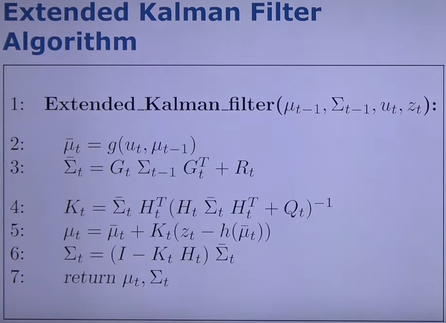

# Introduction to Mobile Sensing and Robotics

[toc]

## Introduction

## Bayes Filter

## Occupancy Grid Mapping with Known Poses

## Locomotion

## Motion and Sensor Models

## EKF Localization

Kalman Filter

- is a Bayes filter

- Everything is Gaussian

  $p(x) = det(2\pi\sum)^{-0.5}exp(-0.5(x-\mu)^T\sum^{-1}(x-\mu))$

- Optimal solution for linear models and Gaussian distribution

Kalman Filter assumptions

- Gaussian distributions and noise

- Linear motion and observation model

  $\cases{x_t=A_tx_{t-1}+B_tu_t+\epsilon_t \\ z_t=C_tx_t+\delta_t}$

What if this is not the case (linear process, linear observation)

Non-linear Dynamic Systems

- most realistic problems involve nonlinear functions

Linearized motion model

Linearized observation model

EKF localization for Feature-based Map

Odometry as Controls

## Particle Filter

## Robot Control

## Robot Motion Planning with A*

## Classification: NN and Decision Trees

## Ensemble Classification

## Clustering

