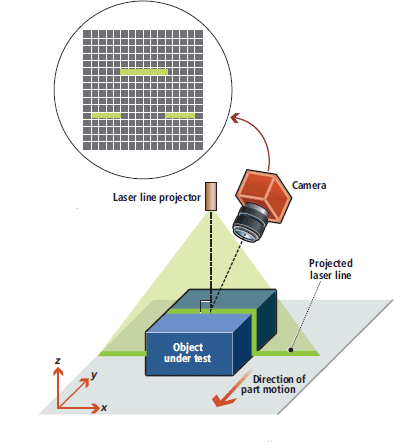

# Range Sensing

[toc]

capture the 3-D structure of the world from the viewpoint of the sensor, usually measuring the depth of the nearest surfaces. These measurements could be at a single point, across scanning plane, or a full image with depth measurements at every point.

## Basics

### 1. Range Images and Point Sets

sensors that use light

Range data is a 2.5D or 3D representation of the scene around the robot.

There are two standard formats for representing range data. The first is an image $d(i, j)$, which records the distance $d$ to the corresponding scene point $(x, y, z)$ for each pixel $(i, j)$. There are several common mappings from $(i, j, d(i, j))$ to $(X, Y, Z)$, usually arising from the geometry of the range sensor or from the application needs. Range sensors with rotating mirrors sample in spherical coordinates, that is, $(\theta, \phi, d)$

Spherical to Cartesian conversions

The further common projection is the perspective one, usually called rectilinear projection, gnomonic or tangent-plane projection. kinetic-like devices. The range values are assumed to be projected in a pinhole camera like fashion. The primary advantage of he rectilinear projection is that it maps straight lines in the 3D space and in the 2D images. Its disadvantage is the smaller field of view (FOV). The projection is structed toward the corners and the distortion grow with larger FOV.

The second format is as a list of ${(x_i, y_i, z_i)}$ of 3D data point, which is usually called the point cloud.

## Sensor Technologies

Two main technologies for range sensing: triangulation and time-of-flight with many variations of each.

### 1. Triangulation

Triangulation sensors measure depth by determining the angle formed by the rays from a world point to two *sensors*. The sensors are separated by a baseline of length $b$, which forms the third segment of a triangle between the two sensors and the point.

$tan\theta=\frac{Z}{b}$

An image sensor measures the angle $\theta$ by an offset on an image plane from the primary ray; this offset $x$ is called the *disparity*. If we assume that the image plane is parallel to the baseline, then $tan\theta=f/x$, and we get the basic equation of triangulation depth sensors

$Z = \frac{fb}{x}$

#### Depth Precision

*depth resolution*: how precisely can the sensor measure the depth?

$\frac{dZ}{dx}=-\frac{Z^2}{fb}$

Triangulation precision falls off with the square of the distance to an object: if it is 1mm at 1m, then it is 4mm at 2m [interesting!]

Increasing the baseline or reducing the the FOV is inversely related to precision, that is if the baseline is doubled or FOV is halved, the precision is halved (e.g. 1mm at 0.1m baseline to 0.5mm at 0.2m baseline). This makes *triangulation sensors more difficult to use at a distance*.


from Learning OpenCV3: Depth and disparity are inversely related, so fine depth measurements are restricted to nearby objects

#### Types of Triangulation Sensors

two main types:

- stereo cameras: have two cameras separated by as baseline
- structured light sensor: substitute a projector for one of the cameras

Stereo cameras take images of a scene from two slightly different viewpoints, and match texture in the images to determine corresponding points and disparities. Some issues with stereo cameras are that there is often too little texture, especially indoors, to make reliable matches; and the matching uses small patches, which blurs out the spatial resolution. Many methods have been developed to deal with these issues, including painting a texture with a projector (not to be confused with structured light), using different kinds of support neighborhoods and regularization methods.

Structured light sensors project a known pattern from one end of the baseline, and view the pattern with a camera from the other. *By decoding the pattern* in the image, the placement of the pattern in the projector is determined, and hence the disparity. The simplest type of projectors output a point or line, and must be scanned to produce a full 3D image.

A full-image structured light system projects a pattern covering the whole image, that can be decoded to get information at each pixel or small group of pixels. The PrimeSense technology, used in the Kinect, projects a known pattern of dots and decodes a small neighborhood to find the projected coordinates; thus this sensor also blurs out the spatial resolution. Other sensors project a time series of images with a vertical structure, so that each pixel on a horizontal line accumulates a unique code, which is then decoded against the projected images. Popular binary codes are Gray codes, which require N images if the image width is $2^N$; and sinusoidal phase-shifted patterns, which typically use three images and are decoded by determining the phase at each point. These time-series structured light system can produce very good spatial and depth resolution.

In general, structured light systems are not used outdoors because of interference from natural light, and for distant objects indoors. They can also have difficulty with high-contrast and specular objects, and the phase-based systems can suffer from $2\pi$ phase ambiguities. Relative motion between the sensor and the scene an also distort readings from time series and scanning sensors, although very fast projectors and cameras can alleviate this problem for the former.

### 2. Time of Flight

TOF sensors is like radar: measure the time it takes for light to be projected out to an object and return. Very precise timers are required for direct TOF measurement; an alternative is indirect methods, typically *phase difference with a modulated reference beam*.

TOF sensors can theoretically have constant precision in depth measurement, no matter how far an object - unlike triangulation sensors, which fall off as the square of distance. But TOF sensors cannot duplicate the very fine precision of triangulation sensors for close objects, and hence are not used in close-range metrology applications.

#### Direct Time of Flight

In direct TOF sensors, the travel time is measured by a high-speed chronometer. Laser-based direct TOF range sensors are also called LIDAR (light detection and ranging) or LADAR (laser radar) sensors.

$2d = ct$

Error in measuring the time $t$ gives rise to a proportional distance error. In practice, one tries to measure the peak of the output pulse, which has a finite extent; weak reflections from distant objects make it harder to measure this peak and hen the error tends to increase with distance. Averaging multiple readings can reduce the random error in these readings.

The simplest TOF sensor transmit only a single beam; More often, robotics applications need denser representations, where the laser beam is swept across the scene. Normally, the beam is swept by a set of mirrors rather than moving the laser and detector themselves. The most common technologies for this are using a *step motor* (for program-based range sensing) or rotating or oscillating mirrors for automatic scanning.

Scanning or averaging requires multiple TOF pulses at perhaps high repetition rates, which can give rise to ambiguity about which pulse is actually being received. If $\delta t$ is the time between pulses, then the *ambiguity interval* for the device is $1/2*c*\delta t$, for example, for a pulse repetition rate of 100kHz, the ambiguity interval is 1500 m. If an object is further than this, it will be seen as within the interval, with distance $mod(z, 1/2*\delta t)$. An *unwinding algorithm* can recover the true depth, if range values for the scanning system change slowly, and start within the ambiguity interval.

Typical ground-based time of flight sensors suitable for robotics applications have a range of 10-100 m, and an accuracy of 5-10 mm. The amount of the scene scanned will depend on the sweep rate of the mirrors and the pulse rate, but 1-25K points per second are typical. Manufacturers of these sensors include Acuity, Hokuyo, Sick, Mensi, DeltaSphere, and Cyrax.

Multiple-beam scanning LIDARs can increase the amount of information available. Velodyne; These devices are typically used in autonomous driving, for environment reconstruction and obstacle avoidance.

##### Flash LIDAR

In contrast to scanning devices, a *flash LIDAR* has a 2-D detector array (aka *focal plane array* similar to a camera imager, but where each pixel incorporates timing circuitry to measure TOF of a laser pulse). In stead of a single or multiple laser beams, a light source pulse (LED or laser) is shaped o cover a large area. All pixels have their timers started when the pulse is initiated, and measure the time it takes to receive the backscattered light. Typically, some tens of samples are captured and averaged, to reduce noise in the measurements - the amount of energy received is quite small,since the laser is not focused into a beam. As might be expected, the detector array pixels are quite large because of the timing electronics; These devices are expensive.

#### Indirect Time of Flight Sensors

measure the distance by inferring transit time from particular properties of a propagating beam. The two main methods are based on *modulation and phase differences* and *gated intensity*

##### Modulation-Based TOF

a continuous laser signal is either *amplitude* or *frequency* modulated. By observing the phase shift between the outgoing and return signals, the signal transit time is estimated and from this the target distance.

*Amplitude modulation* works by varying the intensity of a light signal $s(t) = sin(2\pi ft)$ with frequency *f*. The signal reflected from an object has a phase shift $\psi$, and the returned signal is

$r(t) = Rsin(2\pi ft-\psi)=Rsin[2\pi f(t-\frac{2d}{c})]$, $d=\frac{c\psi}{4\pi f}$

$d$ is he distance to the object, and $R$ is the reflected amplitude. Measuring the phase shift yields the distance; note because the phase shift wraps around at $2\pi$, the ambiguity interval is $c/2f$. For a modulation of 10 MHz, the interval is 15m.

To measure the phase difference, the returned signal is mixed with the original reference signal and a $90^o$ shifted version, then low-pass filtered. Comparing the two mixed signals gives both the phase difference and the intensity.


Because of the signal-to-noise ratio (SNR) depends on the amplitude of the returned signal, these devices typically have a depth resolution that falls off as $d^2$, comparable to triangulation devices, but with much lower repeatability.

*Frequency modulation*, aka frequency modulation continuous wave (FMCW), modulates a laser frequency with a sawtooth ramp of period $t_m$, where the maximum frequency spread is $\Delta f$. The outgoing and incoming signals are mixed to give a signal difference $f_i$, which is measured by frequency counting. The distance is calculated as $d=f_ict_m/2\Delta f$. Since the frequency difference can be measured very accurately, this technique can yield excellent depth precision, on the order of 5mm at 2m. The electronics required for mixing and frequency counting, as well as the difficulty of linear laser frequency modulation, have restricted this technique to high-end single-beam devices.

##### Range-Gated Intensity

Another indirect method for measuring TOF of a pulse is to measure the amount of the pulse that gets returned within a precise time period.

### 3. Comparison of Methods

The two main parameters are spatial precision and depth precisions.

In general, we would expect the triangulation sensors to outperform TOF sensors at shorter distances.

### 4. Stereo Vision

Stereo analysis uses two or more input images to estimate the distance to points in a scene. The basic concept is *triangulation*: a scene point and the two camera points form a triangle, and knowing the baseline between the two cameras, and the angle formed by the camera rays, the distance to the object can be determined.

In practice, most difficulties arise in finding reliable matches for pixels in the two images that correspond to the same point in the scene. A further consideration is that stereo analysis for robotics has a real-time constraint, and the processing power needed for some algorithms can be very high. The advantage of stereo imaging is that it can provide full 3D range images, registered with visual information, potentially out to an infinite distance, at high frame rates - something which no other range sensor can match.

binocular stereo

#### Stereo Image Geometry

The input images are *rectified*, which means that the original images are modified to correspond to ideal pinhole cameras with a particular geometry.


If the principal rays of the cameras are parallel (after rectification), and the images are embedded in a common plane and have collinear scan lines, then the search geometry takes a simple form. The *epipolar line* of a point $s$ in the left image, defined as the possible positions of $s'$ in the right image, *is always a scan line with the same y coordinate as s*. Thus, search for a stereo match is linear. The process of finding a rectification of the original images that puts them into standard form is called *calibration*.

The difference in the $x$ coordinates of $s$ and $s'$ is the *disparity* of the 3D point, which is related to its distance from the focal point, and the baseline $T_x$ that separate the focal points.

A 3D point can be projected into either the left or right image using the *projection matrix*.

$P=\begin{pmatrix}f_x & 0 & c_x & -f_xT_x \\0 & f_y & c_y & 0 \\ 0 & 0 & 1 & 0 \end{pmatrix}$

this is the projection matrix for a single camera. $f_x, f_y$ are the focal lengths of the rectified images, and $c_x, c_y$ are the optical center; $T_x$ is the translation of the camera relative to the left (reference) camera. For the left camera, it is 0; for the right camera, it is the baseline times the $x$ focal length.

$\begin{pmatrix} x\\y\\z \end{pmatrix} = P \begin{pmatrix} X \\ Y \\ Z\\ 1 \end{pmatrix}$

where $(x/w, y/w)$ are the idealized image coordinates.

If points in the left and right images correspond to the same scene features, the depth of the feature can be calculated from the image coordinates using the *reprojection matrix*

$Q = \begin{pmatrix} 1 & 0 & 0 & -c_x \\ 0  & 1 & 0 & -c_y \\ 0 & 0 & 0 & f_x \\ 0 & 0 & -1/T_x & \frac{(c_x-c_x')}{T_x}\end{pmatrix}$

The primed parameters are from the left projection matrix, the unprimed from the right. The last item is zero except for verged cameras. If $x, y$ and $x', y$ are the two matched image points, with $d=x-x'$, then

$\begin{pmatrix} X\\Y\\Z\\W \end{pmatrix} = Q \begin{pmatrix} x \\ y \\ d\\ 1 \end{pmatrix}$

where $(X/W, Y/W/, Z/W)$ are the coordinates of the scene feature, and $d=x-x'$ is the disparity. Assuming $c_x=c_x'$, the $Z$ distance assumes the familiar inverse form of triangulation

$Z = \frac{f_xT_x'}{d}$

Reprojection is valid only for rectified images - for the general case, the projected lines do not intersect. The disparity $d$ is an *inverse depth* measure, and the vector $(x, y, d)$ is a perspective representation range image, sometimes called the *disparity space* representation. The disparity space is often used in applications instead of 3D space, as a more efficient representation for determining obstacles or other features.

The above equation (with $Q$ matrix) is a *homography* between disparity space and 3D Euclidean space. Disparity space is also useful in translating between 3D frames. Let $p_0=[x_0, y_0, d_0, 1]$ in frame 0, with frame 1 related by the rigid motion $R, t$. From the above reprojection equation, the 3D position is $Q*p_0$. Under the rigid motion this becomes

$P_1 = \begin{pmatrix}R & t \\ 0 & 1\end{pmatrix}Qp_0$

and finally applying $Q^{-1}$ yields the disparity representation in frame 1. The concatenation of these operations is the homography

$H(R, t) = Q^{-1}\begin{pmatrix}R & t \\ 0 & 1\end{pmatrix}Q$

i.e. $p_1=H(R, t)p_0$

using the homography $H$ allows the point in the reference frame to be directly projected onto another frame, without translating to 3D points.

#### Stereo Matching Methods

The fundamental problem in stereo analysis is matching image elements that represent the same object or object part in the scene. Once the match is made, the range to the object can be computed using the image geometry.

Matching methods can be characterized as *local or global*. Local methods attempt to match small regions of one image to another based on intrinsic features of the region. Global methods supplement local methods by considering physical constraints such as surface continuity or base of support. Local methods can be further classified by whether they match discrete features among images or correlate a small area patch. Features are usually chosen to be lighting and viewpoint independent, for example, corners are a natural feature to use because they remain corners in almost all projections. Feature-based algorithms compensate for viewpoint changes and camera differences, and can produce rapid, robust matching. But they have the disadvantage of requiring perhaps expensive feature extraction, and yielding only sparse range results.

local area correlation is one of the most efficient and practical algorithms for real-time stereo. [this survey](https://vision.middlebury.edu/stereo/) lists up-to-date stereo methods.

#### Area Correlation Stereo

Area correlation compares small patches among images using correlation. The area size is a compromise, since small areas are more likely to be similar in images with different viewpoints, while larger areas increase the signal-to-noise ratio. In contrast to feature-based method, area-based correlation produces dense results. Because area methods need not compute features, and have an extremely regular algorithmic structure, they can have optimized implementations.

The typical area correlation method has five steps


1. **Geometry correction**. Distortions in the input images are corrected by warping into *standard form*
2. **Image transform**. A local operator transforms each pixel in the grayscale image into a more appropriate form, e.g. normalizes it based on average local intensity
3. **Area correlation**. This is the correlation step, where each small area is compared with other areas in its search window
4. **Extrema extraction**. The extreme value of the correlation at each pixel is determined, yielding a disparity image; each pixel value is the disparity between the left and right image patches at the best match
5. **Post-filtering**. One or more filters clean up noise in the disparity image result

Correlation of image areas is disturbed by illumination, perspective, and imaging differences among images. Area correlation methods usually attempt to compensate by correlating not the raw intensity images, but some transform intensities. Let $u, v$ be the center pixel of the correlation, $d$ the disparity, and $I_{x, y}, I'_{x, y}$ the intensities of the left and right images:

1. Normalized cross-correlation

$\frac{\sum_{x,y}[I_{x,y}-\hat{I}_{x,y}][I'_{x-d,y}-\hat{I'}_{x-d,y}]}{\sqrt{\sum_{x,y}[I_{x,y}-\hat{I}_{x,y}]^2\sum_{x,y}[I'_{x,y}-\hat{I}'_{x-d,y}]^2}}$

2. High-pass filter such as Laplacian of Gaussian (LOG). The Laplacian measures directed edge intensities over some area smoothed by the Gaussian. Typically, the standard deviation of the Gaussian is 1-2 pixels

   $\sum_{x,y}s(LOG_{x,y}-LOG_{x-d,y})$

   where $s(x)$ is $x^2$ or $||x||$

3. Nonparametric. These transforms are an attempt to deal with the problem of outliers, which tend to overwhelm the correlation measure, especially using a square difference. The census method computes a bit vector describing the local environment of a pixel, and the correlation measure is the Hamming distance between two vectors

   $\sum_{x,y}(I_{x,y}>I_{u,v})\oplus(I'_{x-d,y}>I'_{u,v})$

Another technique for increasing the signal-to-noise ratio of matches is to use more than two images. This technique can also overcome the problem of view-point occlusion, where the matching part of an object does not appear in the other image. The simple technique of adding the correlations between images at the same disparity seems to work well. Obviously, the computational expenditure for multiple images is greater than that for two.

Dense range images usually contain false matches that must be filtered, although this is less of a problem with multiple-image methods.

Disparity images can be processed to give subpixel accuracy, by trying to locate the correlation peak between pixels. This increases the available range resolution without much additional work. Typically accuracies are 1/10 pixel.

#### Stereo Range Quality

Various artifacts and problems affect stereo range images.

- Smearing

- Dropouts

- Range Resolution: Unlike LADAR devices, stereo range accuracy is a quadratic function of distance, found by differentiating $Z = \frac{f_xT_x'}{d}$ (the triangulation equation) with respect to disparity

  $\delta Z = -\frac{f_x*T'_x}{d^2}$

  The degradation of the stereo range with distance can be clearly seen.

- Processing: Area correlation is process-intensive, requiring A$w$d operations, where A is the image area, $w$ is the correlation window size, and $d$ is the number of disparities. Clever optimizations take advantage of redundant calculations to reduce this to Ad (independent of window size), at the expense of some storage. Real-time implementations exist for standard PCs, digital signal processors (DSPs), field programmable gate arrays (FPGAs), and specialized application-specific integrated circuits (ASICs).

#### Other Visual Sources of Range Information

briefly list the most popular, but less reliable sources of range information

- *Focus/defocus*: Knowledge of the camera parameters and the mount of blur of image features allows the estimation of how far the corresponding scene features are from the perfect focus distance. Sensors may be passive (using a precaptured image) or active (capturing several images with different focus settings)
- *Structure and motion*: Structure and motion algorithms compute 3D scene structure and the sensor positions simultaneously. This is essentially a binocular stereo process, except that only a single moving camera is used. Thus, the images needed by the stereo process are acquired by the same camera in several different positions. Video camcorders are also used, but they have lower resolution. One important advantage of this approach over the normal algorithm is that features can be tracked easily if the time between frames or the motion is small enough. This simplifies the *correspondence problem*; however, it can lead to another problem. If the pair of images used for the stereo calculation are taken close together in time, then the separation between the cameras' images will not be much - this is a *short baseline*. Triangulation calculations are then more inaccurate, as small errors in estimating the position of image features results in large errors in the estimated 3D position (particularly the depth estimate). This problem can be partly avoided by tracking for longer periods. A second problem that can arise is that not all motions are suitable for estimate of the full 3D scene structure. For example, if the video recorder only rotates about its optical axis or about its focus point, then no 3D information can be recovered.
- *Shading*: The pattern of shading on a surface is related to the orientation of the surface relative to the observer and light sources. This relationship can be used to estimate the surface orientation across the surface.
- *Photometric stereo*: a combination of shading and stereo processes. The restriction of a stationary observer and changing light sources makes this approach less likely to be useful to most robotics applications.
- *Texture*: As with shading, the texture gradients can be used to estimate the surface orientation across the surface.

### 5. Structured Light Stereo

Kinect - PrimeSense; structured-light stereo

projects a structured pattern generated from an IR laser and patented combination of diffractive elements. The pattern consists of bright dots on a grid, with unique combinations of dots over a horizontal area. A camera with resolution 1280x960 captures the IR image at a horizontal offset of 7.5cm from the projector, and correlates a 19x19 block against the known dot pattern for a given horizontal line. If a match is found, the position of the pattern in the known projected pattern gives the angle subtended by the reflecting object to the projector and camera, and hence the distance. A depth image is returned at a resolution of 640x480, with 11 bits of depth precision, over an FOV of approximately $50^o$; the depth is interpolated to a precision of 1/8 pixel.

## Registration

3D localization of parts for robot manipulation, self-localization of robot vehicles, and scene understanding for robot navigation. All of these are based on the ability to register 3D shapes.

Registration puts two or more independently acquired 3D shapes into one frame of reference. It can be solved as an optimization problem that uses a cost function for the quality of the alignment. The 3D shapes are registered by determining the rigid transformation which minimizes the cost function. *Feature based registration* extracts distinguishing features of the range images and uses corresponding features for calculating the alignment.

### 1. The ICP Algorithm

ICP (iterative closest points) algorithm is the de-factor standard for registration of point sets, but is also applicable to 3D shapes, if one samples them.

cost function for data sets $\hat{M}$ (model set) and $\hat{D}$ (data set)

$E(R, t) = \frac{1}{N}\sum_{i=1}^{N}||m_i-(Rd_i+t)||^2$

Two things have to calculated: the corresponding points and the transformation $(R, t)$

The ICP algorithm uses closest points as corresponding points. A sufficiently good starting guess enables the ICP algorithm to converge to the correct minimum. (initial alignment and ICP optimization)

Implementations of ICP use a maximal distance for closest points to handle partially overlapping point sets.

```pseudocode
1: for i = 0 to maxIterations do
2: 	for all d_j \in D do
3: 		find the closest point within a range d_max in the set M for point d_j
4: 	end for
5: 	Calculate transformation (R, t) that minimizes the error function
6:	Apply the transformation found in step 5 to data set D.
7:	Compute the difference of the quadratic error, that is compute the difference of the value ||E_{i-1}(R, t)-		E_i(R, t)|| before and after the application of the transformation. If the difference falls below a thereshold 	   \epsilon, terminate.
8: end for
```

If the input are 3D meshes then a point-to-plane metric can be used instead of the above equation. Minimizing using a point-to-plane metric outperforms the standard point-to-point one, but requires the computation of normals and meshes in a preprocessing step.

The computation of closest points is the crucial step of the ICP algorithm. A naive implementation examines all points in $\hat{M}$ and the resulting computation time for ICP is $O(|\hat{D}||\hat{M}|)$, that is $O(n^2)$. Note that $N$ can be very large. An efficient tree data structure, a *k-d* tree, is widely used to speed up the closest point computation. Every node of the k-d tree represents a partition of the point set into two distinct sets, the successor nodes. The root of the tree represents the whole point set. The leaves of the tree are called buckets and are a partition of the set into small, disjunctive point sets. Furthermore, every node of the tree consists of the center and the dimension of the point set. The *k-d* tree is constructed until the number of points in the nodes falls below a threshold b (bucket size). Only the leaves of the tree contain the data point. Searching in *k-d* trees is done recursively. A given 3D points $p_q$ needs to be compared to the separating plane (splitting dimension and splitting value) in order to decide on which side the search must continue. This procedure is executed until the leaves are reached. There, the algorithm has to evaluate all bucket points. However, the closest point may be in a different bucket, iff the distance $d$ of the query point $p_q$ to the limits is smaller than the one to the closest point in the bucket $p_b$. In this case backtracking has to be performed. This test is known as Ball-Within-Bounds test. The optimized *k-d* tree chooses the split dimension and split value, such that the expected amount of backtracking is minimized. Since one typically has no information about the query points *k-d* tree algorithms take only the distribution of the given points into account. For all possible queries, this works sufficiently, but it will not be optimal for a specific query. This enables the recursive construction and avoid the overall optimization that is known to be NP-complete.

In each ICP iteration, the transformation can be calculated in $O(N)$ by any of these four methods:

1. A singular value decomposition (SVD)-based method
2. A quaternion-based method
3. An algorithm using orthonormal matrices
4. A calculation based on dual quaternions. Besides these closed-form solutions, there are several linearized, approximative version

The challenge is to ensure that $R$ is orthonormal. Most often, the SVD methods is implemented due to its simplicity and availability in various libraries. The optimal rotation is $R=VU^T$, from $H = USV^T$, where $H$ is a cross-correlation matrix given by $H = \sum_{i=1}^Nm_i'^Td_i'$


### 2. Maker and Feature-Based Registration

To avoid issues with starting guess in the ICP framework, marker-based registration uses defined artificial or natural landmarks as corresponding points. This manual data association ensures that by minimizing the equation, the scans are registered at the correct location. Iterations are no longer required, but possible as verification with the RANSAC algorithm. The RANSAC algorithm is a general, randomized procedure that iteratively finds an accurate model for observed data that may contain a large number of outliers.

#### 3D Feature Representations and Extraction

There are many representations available for encoding 3D scene structure and model representations. Some scene models or descriptions may use more than one of these simultaneously to describe different aspects of the scene or object models.

- *Normals*

Normals describe the surface orientation in a point. Most computation approaches involves some form of eigenvalue decomposition resembling total linear least squares. The normals are usually computed when taking into account the nearby neighbor points which are computed using a variety of methods like nearest neighbor search. These methods include $k$ nearest neighbors ($k$-NN) and radius search among others. The method of total least square is robust to noise as it inherently includes low-pass filtering, but it is sensitive to the distribution and density of the point samples as well as the curvature of the underlying manifold.

The total least-squares problem finds the plane parameters that optimally fit a small surface area in a point set given by the nearest neighbors. A plane is defined by

$n_xx+n_yy+n_zz-d=0$

where $p=(x,y,z)^T$ lies on the plane and $(n_x,n_y,n_z,d)$ are the parameters to compute. Given a subset of $k$ 3D points $p_i, i=1,2,...,k$ of the surface, least squares finds the optimal normal vector $n=(n_x,n_y,n_z)^T$ and scalar $d$ that minimizes the following error equation

$e=\sum_{i=1}^k(p_in-d)$

The basic method for normal estimation from the neighboring points using a fitting plane is the principal component analysis (PCA). PCA is the eigenvalue decomposition of the data covariance (or correlation) matrix or singular value decomposition of a data matrix, usually after mean centering (and normalizing) the data matrix for each attribute (3D query point). PCA can be interpreted as fitting a Gaussian distribution and computing the main axes. For each query point

$\mu=\frac{1}{k}\sum_{i=1}^kp_i$

$\sum=\frac{1}{k}\sum_{i=1}^k(p_i-\mu)^T(p_i-\mu)$

The vector corresponding to the smallest eignevalue of the above matrix $\sum$ is the normal direction if the neighboring points belong to a plane and this is also the closed form solution of the total least-square problem.

For equirecangular range images, that is, spherical coordinates, a fast algorithm has been developed that avoids computing eigenvalues.

- *3D Point Features*

This is a set $\{p_i=(x_i, y_i, z_i)\}$ of 3D points that describe some salient and identifiable points in the scene. They might be the centers of spheres (often used as markers), corners where three planes intersect, or the extrema of some protrusion or indentation on a surface. They may be a subset of an initially acquired 3D full scene point set, or they might be extracted from a range image, or they might be computed theoretical points based on extracted data features.

Spin image are used for surface matching between point clouds and meshes. Scanned 3D points become the vertices of the mesh and connectivity is established by the 3D scanning geometry. A fundamental component of the surface matching representation is an *oriented point*, a 3D point with an associated direction. Huber defines an oriented point *O* at a surface mesh vertex using the 3D position of the vertex $p$ and the surface normal at the vertex $n$. Two coordinates can be calculated given an oriented point: $\alpha$ the radial distance to the surface normal line $L$ and $\beta$ the axial distance above the tangent plane $P$

$(x)\mapsto(\alpha, \beta)$


A consequence of the cylindrical symmetry is that points that lie on a circle that is parallel to $P$ and centered on $L$ will have the same coordinates $(\alpha, \beta)$ with respect to the basis.

Seminal work on 3D point features are the point feature histogram (PFH) descriptors. They encode a point's $k$-neighborhood geometrical properties by generalizing the mean curvature around the point using a multidimensional histogram of values. This highly dimensional hyperspace aims at providing an informative signature for the feature representation, being invariant to the 6D pose of the underlying surface, and copying very well with different sampling densities or noise levels present in the neighborhood.


In addition to 3D structural features, 3D features derived from texture, for example, coregistered color images or scan reflectivities, are widely used for registration. scale invariant feature transform (SIFT) features

- *Planes*

A planar surface may only be described by the infinite surface as given by the equation, but it may also include a description of the boundary of the surface patch. Convenient representations for robotics applications are lists of the 3D points $\{(x_i, y_i, z_i)\}$ that form the patch boundary or polylines, i.e. a set of connected line segments. A polyline is represented by the sequence of 3D points $\{(x_i, y_i, z_i)\}$ that form the vertices that join the line segments.

Plane extraction, or plane fitting, is the problem of modeling a given 3D point cloud as a set of planes that ideally explain every data point. The RANSAC algorithm is one possible algorithm. When adapted for plane finding, this algorithm selects three 3D points at random (although exploiting some locality to the point selection algorithm can improve the efficiency of the algorithm). These three points determine a plane with a parameter vector **$\alpha$**. Test all points $\{p\}$ in the set for belonging to the plane $(|p_i\cdot \alpha|<\tau)$. If enough points are close to the plane, then potentially a plane has been found. These points should also be processed to find a connected set, from which a more accurate set of plane parameters can be estimated using the least-squares algorithms given above. If a planar patch is successfully founds, the points that lie in that plane are removed from the dataset. The random selection of three points then continues until no more planes are found (a bound on how many tries to make can be estimated). Schnabel adapted RANSAC for plane extraction and found that the algorithm performs precise and fast extraction, but only if the parameters have been fine-tuned properly.

A further standard method for plane detection is region growing, based on a seed patch. When the scene largely consists of planes, a particularly simple approach is based on selecting a previously unused point and the set of points $\{p_i=(x_i,y_i,z_i)\}$ in its neighborhood. A plane to fit to these points using the least-square method (cf. normal computation). This hypothesized plane then needs to be tested form reasonableness by 1) examining the smallest eigenvalue - it should be small and of the order of the square of the expected noise level and 2) ensuring that most of the 3D points in the fitted set lie on the plane $(|p_i\cdot \alpha|<\tau)$.

Larger planar regions are *grown* by locating new adjacent points $p_i$ that lie on the plane $(|p_i\cdot \alpha|<\tau)$. When enough of these are found, the parameters $\alpha$ of the plane are re-estimated. Points on the selected plane are removed and the process is repeated with a new seed patch. This process continues until no more points can be added.

The radon transform can be used to detect planes in volume data. The idea and the speed of the algorithm are similar to that of the standard Hough transform. The Hough transform is a method for detecting parametrized objects. For the Hough transform, planes are represented in the Hesse normal form, using normal vectors. A plane is thereby given by a point *p* on the plane, the normal vector *n* that is perpendicular to the plane is the distance $\rho$ to the origin

$\rho = p\cdot n = p_xn_x+p_yn_y+p_zn_z$

Considering the angles between the normal vector and the coordinate system, the coordinates of $n$ are factorized to

$p_xcos\theta sin\phi + p_ysin \phi sin\theta + p_zcos \phi = \rho$

with $\theta$ is the angle of the normal vector on the xy-plane and $\phi$ the angle between the xy-plane and the normal vector in the $z$ direction. $(\phi, \theta, \rho)$ define the 3D Hough space such that each point in the Hough space corresponds to *one plane* in $\mathbb{R}^3$. To find planes in a point set, one calculates the Hough transform for each point. Given a point $p$ in Cartesian coordinates, one finds all planes the lies on, that is, find all the $\theta, \phi, \rho$ that satisfy the above equation. Marking these points in the Hough space, that is, leads to a 3D sinusoid curve. The intersection of two curves in the Hough space denote the planes that are rotated around the line built by the two points. Consequently, the intersection of three curves in the Hough space corresponds to the polar coordinates defining the plane spanned by the three points. The more curves intersect in $h_j\in(\theta, \phi, \rho)$, the more points lie on the plane represented by $h_j$ and the higher is the probability that $h_j$ is actually extracted from points set P.

11

- *Triangulated Surfaces*
- *3D Lines*
- *Voxels*
- *Straight Lines*

### 3. Multiple-View Registration

### 4. Model Matching

### 5. Relative Pose Estimation

### 6. 3-D Applications

## Navigation and Terrain Classification and Mapping

### 1. Mobile Mapping

### 2. Urban Navigation

### 3. Rough Terrain

## Conclusion and Further Reading

### Understanding Laser-based 3D Triangulation methods

laser-based 3D triangulation systems can be configured in numerous ways to optimize the performance of a machine vision system

While the basic concept of triangulation measurement is simple, the details of how laser-based 3D triangulation systems are configured and how laser line parameters are specified.

In laser-based triangulation systems, a narrow band of light projected onto a 3D surface produces a line of illumination that will appear distorted from an observation perspective other than the projector. Analysis of the shape of these line images can then be used to achieve an accurate geometric reconstruction of the object's surface shape



4 main components: camera, the line projector that is laser-based, a mechanism that moves the object or camera/laser system through the field of view of the imaging system and software to process the captured image and accurately translate pixel offsets to height differences.

#### Triangulation configurations


- Standard geometry: most commonly used, the laser line is projected perpendicular to the nominal measurement $(x, y)$ plane. The most important characteristic of this configuration is that height variations in the object along the projected line do not produce a change in the line's y coordinate values. This simplifies the subsequent calculations required to derive object shape, resulting in a system that is faster, more accurate and easier to calibrate during setup.

  One drawback is that the camera views the object from an angle. This increases the depth of field it must accommodate to maintain focus as object height varies. It also means that the lens experiences greater magnification as object height (and hence object distance from the lens) changes. Thus *a test object must be calibrated to derive accurate measurement results* from the system.

  It is also possible for there to be some occlusion with this geometry. Whenever the camera views the object from anything other than an angle perpendicular to the inspection surface, there will be some parts of the line which are blocked or occluded from the camera's view since no object is completely flat. This creates an inherent design tradeoff, because, *while measurement height resolution increases for the standard geometry as the camera angle increases, so does the potential for occlusion.

- Reverse geometry: offers increased height resolution over the standard geometry, since the oblique angle of laser illumination means a given change in object height produces a larger shift in the position of the laser line. Since the camera is normal to the measurement plane, there is no occlusion in this geometry.

  However, in the reverse geometry configuration, a change in part height does cause a change in the line's y coordinate, making it more complex to interpret results. As a result, this setup is generally most useful with planar objects.

- Specular geometry: both the laser and camera are at similar, non-normal angles to the surface. Having both oblique projection and viewing angles provides greater height resolution over either of the previously described configurations. However, in this arrangement, it is possible for the camera to see specular, or near specular reflections, from the laser. This can cause measurement errors if these reflections produce saturation or blooming in the detector. On the other hand, higher reflection could be used to increase signal levels from dark colored objects since dark objects reflects less light, making the measurement signal level lower - in other words, the detector has less light to measure.

  Working near the specular reflection angle generally provides the highest level of reflectivity for a relatively smooth object. Thus, when measuring a dark, smooth object, this geometry may be advantageous. However, if the object is highly textured, working at the specular angle may not yield much of an increase in reflectivity. Depending upon the color and texture of your object, it may or may not be necessary to work near the specular angle.

  a change in part height also causes a change in the line's y coordinate, make it more complex to interpret results. Thus, this setup is best used when imaging planar object. This oblique camera angle also leans to some occlusion.

- Look-away geometry: both the camera and laser projector are placed on the same side of the normal to the object surface. This dramatically reduces the change of specular reflection, unless the object is highly textured. However, this geometry also reduces height resolution because the camera point of view is so similar to that of the projector. There is some occlusion in this configuration


#### Laser line power

projected laser line parameters is critical.

One key parameter is the power uniformity of the line beam, fluctuations in which occur due to manufacturing variations and tolerance effects. These typically manifest themselves as *intensity variations (partially at the beam edge)*, non-flat top intensity profiles, and light scatter.

####  Laser line width


## References