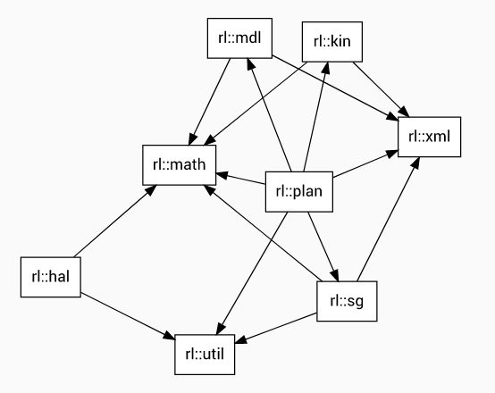

# Robotics Library Notes

[toc]

https://www.roboticslibrary.org/api

https://github.com/roboticslibrary

## API

The Robotics Library (RL) is structured as a hierarchical set of components. Interfaces for motion planning are built on top of basic mathematical function, kinematics and dynamics calculation, scene graph abstraction, hardware abstraction, XML parsing, and utility functions



### rl::math

matrix algebra built on top of Eigen 3 with double specified as default(rl::math::Real). Math expressions are identical to Eigen for vector, matrix operations, 3D rotations, quaternions, transformations.

- RL extends the Eigen API with features logarithm, exponential, angular velocity/acceleration, slerp and squad for quaternions. 
- Spatial vector algebra: for dynamic algorithms in r::mdl; classes for spatial transformations, motion and force vectors, rigid and articulated body inertia; Demo: "rlSpatialDemo"
- SI units and rl::math::constants::
- Interpolation between robot configurations and poses; rl::math::Polynomial<rl::math::Real>

### rl::xml

This component serves as a C++ abstraction layer for the XML library [libxml2](http://xmlsoft.org/) and [libxslt](http://xmlsoft.org/libxslt/). It offers support for [XPath](https://www.w3.org/TR/xpath/) (XML Path Language) and provides convenient parsing of XML files.

```c++
// 01. XML parser
rl::xml::DomParser parser;
rl::xml::Document document = parser.readFile("foo.xml");

// 02. validating a document against a given XML schema
rl::xml::Schema schema("schema.xsd");
bool isValid = schema.validate(document);
```


### rl::util

provides os independent functions for accessing high-precision timer data, thread, and thread synchronization. RL uses C++11 structures and includes extensions for additional features (e.g. Xenomai, RTAI). Ref [Thread support library](https://en.cppreference.com/w/cpp/thread)

in order to set the current process or thread to the highest available priority, the following commands are avaliable

```c++
rl::util::this_process::set_priority(rl::util::this_process::get_priority_max());
rl::util::this_thread::set_priority(rl::util::this_thread::get_priority_max());
```

### rl::hal

### rl::mdl

kinematics and dynamics calculations based on spatial vector algebra with support for *branches*. 

- supported joint types: revolute, prismatic, cylindrical, helical
- algorithms: forward kinematics, inverse dynamics via recursive Newton-Euler, forward-dynamics via articulated-body (No inverse kinematics? TODO: add it)

Robot models

- Models can be constructed and modified during runtime. A matching XML format is available in order to conveniently load existing models.

```xml
<?xml version="1.0" encoding="UTF-8"?>
<rlmdl xmlns:xsi="http://www.w3.org/2001/XMLSchema-instance" xsi:noNamespaceSchemaLocation="rlmdl.xsd">
	<model>
		<manufacturer>Comau</manufacturer>
		<name>SMART5 NJ4 220 2.7</name>
		<world id="world">
			<rotation>
				<x>0</x>
				<y>0</y>
				<z>0</z>
			</rotation>
			<translation>
				<x>0</x>
				<y>0</y>
				<z>0</z>
			</translation>
			<g>
				<x>0</x>
				<y>0</y>
				<z>9.86055</z>
			</g>
		</world>
		<body id="body0">
			<ignore/>
			<ignore idref="body1"/>
		</body>
		<frame id="frame0"/>
		<frame id="frame1"/>
		<body id="body1">
			<ignore idref="body0"/>
			<ignore idref="body2"/>
		</body>
		<frame id="frame2"/>
		<body id="body2">
			<ignore idref="body1"/>
			<ignore idref="body3"/>
			<ignore idref="body4"/>
		</body>
		<frame id="frame3"/>
		<body id="body3">
			<ignore idref="body2"/>
			<ignore idref="body4"/>
		</body>
		<frame id="frame4"/>
		<body id="body4">
			<ignore idref="body2"/>
			<ignore idref="body3"/>
			<ignore idref="body5"/>
			<ignore idref="body6"/>
		</body>
		<frame id="frame5"/>
		<body id="body5">
			<ignore idref="body4"/>
			<ignore idref="body6"/>
		</body>
		<frame id="frame6"/>
		<body id="body6">
			<ignore idref="body4"/>
			<ignore idref="body5"/>
		</body>
		<frame id="frame7"/>
		<fixed id="fixed0">
			<frame>
				<a idref="world"/>
				<b idref="body0"/>
			</frame>
			<rotation>
				<x>0</x>
				<y>0</y>
				<z>0</z>
			</rotation>
			<translation>
				<x>0</x>
				<y>0</y>
				<z>0</z>
			</translation>
		</fixed>
		<fixed id="fixed1">
			<frame>
				<a idref="body0"/>
				<b idref="frame0"/>
			</frame>
			<rotation>
				<x>0</x>
				<y>0</y>
				<z>0</z>
			</rotation>
			<translation>
				<x>0</x>
				<y>0</y>
				<z>0.83</z>
			</translation>
		</fixed>
		<revolute id="joint0">
			<frame>
				<a idref="frame0"/>
				<b idref="frame1"/>
			</frame>
			<axis>
				<x>0</x>
				<y>0</y>
				<z>-1</z>
			</axis>
			<max>180</max>
			<min>-180</min>
			<speed>100</speed>
		</revolute>
		<fixed id="fixed2">
			<frame>
				<a idref="frame1"/>
				<b idref="body1"/>
			</frame>
			<rotation>
				<x>0</x>
				<y>0</y>
				<z>0</z>
			</rotation>
			<translation>
				<x>0.4</x>
				<y>0</y>
				<z>0</z>
			</translation>
		</fixed>
		<revolute id="joint1">
			<frame>
				<a idref="body1"/>
				<b idref="frame2"/>
			</frame>
			<axis>
				<x>0</x>
				<y>1</y>
				<z>0</z>
			</axis>
			<max>95</max>
			<min>-75</min>
			<speed>90</speed>
		</revolute>
		<fixed id="fixed3">
			<frame>
				<a idref="frame2"/>
				<b idref="body2"/>
			</frame>
			<rotation>
				<x>0</x>
				<y>0</y>
				<z>0</z>
			</rotation>
			<translation>
				<x>0</x>
				<y>0</y>
				<z>1.175</z>
			</translation>
		</fixed>
		<revolute id="joint2">
			<frame>
				<a idref="body2"/>
				<b idref="frame3"/>
			</frame>
			<axis>
				<x>0</x>
				<y>-1</y>
				<z>0</z>
			</axis>
			<max>-10</max>
			<min>-256</min>
			<offset>90</offset>
			<speed>110</speed>
		</revolute>
		<fixed id="fixed4">
			<frame>
				<a idref="frame3"/>
				<b idref="body3"/>
			</frame>
			<rotation>
				<x>0</x>
				<y>0</y>
				<z>0</z>
			</rotation>
			<translation>
				<x>0</x>
				<y>0</y>
				<z>0.25</z>
			</translation>
		</fixed>
		<revolute id="joint3">
			<frame>
				<a idref="body3"/>
				<b idref="frame4"/>
			</frame>
			<axis>
				<x>-1</x>
				<y>0</y>
				<z>0</z>
			</axis>
			<max>200</max>
			<min>-200</min>
			<speed>130</speed>
		</revolute>
		<fixed id="fixed5">
			<frame>
				<a idref="frame4"/>
				<b idref="body4"/>
			</frame>
			<rotation>
				<x>0</x>
				<y>0</y>
				<z>0</z>
			</rotation>
			<translation>
				<x>1.165</x>
				<y>0</y>
				<z>0</z>
			</translation>
		</fixed>
		<revolute id="joint4">
			<frame>
				<a idref="body4"/>
				<b idref="frame5"/>
			</frame>
			<axis>
				<x>0.5</x>
				<y>0</y>
				<z>0.86602540378443864676372317075294</z>
			</axis>
			<max>200</max>
			<min>-200</min>
			<speed>125</speed>
		</revolute>
		<fixed id="fixed6">
			<frame>
				<a idref="frame5"/>
				<b idref="body5"/>
			</frame>
			<rotation>
				<x>0</x>
				<y>0</y>
				<z>0</z>
			</rotation>
			<translation>
				<x>0.31</x>
				<y>0</y>
				<z>0.14722</z>
			</translation>
		</fixed>
		<revolute id="joint5">
			<frame>
				<a idref="body5"/>
				<b idref="frame6"/>
			</frame>
			<axis>
				<x>-1</x>
				<y>0</y>
				<z>0</z>
			</axis>
			<max>200</max>
			<min>-200</min>
			<speed>170</speed>
		</revolute>
		<fixed id="fixed7">
			<frame>
				<a idref="frame6"/>
				<b idref="body6"/>
			</frame>
			<rotation>
				<x>0</x>
				<y>0</y>
				<z>0</z>
			</rotation>
			<translation>
				<x>0</x>
				<y>0</y>
				<z>0</z>
			</translation>
		</fixed>
		<fixed id="fixed8">
			<frame>
				<a idref="body6"/>
				<b idref="frame7"/>
			</frame>
			<rotation>
				<x>0</x>
				<y>0</y>
				<z>0</z>
			</rotation>
			<translation>
				<x>0</x>
				<y>0</y>
				<z>0</z>
			</translation>
		</fixed>
		<home>
			<q unit="deg">0</q>
			<q unit="deg">0</q>
			<q unit="deg">-90</q>
			<q unit="deg">0</q>
			<q unit="deg">0</q>
			<q unit="deg">0</q>
		</home>
		<gamma>
			<row>
				<col>1</col>
				<col>0</col>
				<col>0</col>
				<col>0</col>
				<col>0</col>
				<col>0</col>
			</row>
			<row>
				<col>0</col>
				<col>1</col>
				<col>0</col>
				<col>0</col>
				<col>0</col>
				<col>0</col>
			</row>
			<row>
				<col>0</col>
				<col>1</col>
				<col>1</col>
				<col>0</col>
				<col>0</col>
				<col>0</col>
			</row>
			<row>
				<col>0</col>
				<col>0</col>
				<col>0</col>
				<col>1</col>
				<col>0</col>
				<col>0</col>
			</row>
			<row>
				<col>0</col>
				<col>0</col>
				<col>0</col>
				<col>0</col>
				<col>1</col>
				<col>0</col>
			</row>
			<row>
				<col>0</col>
				<col>0</col>
				<col>0</col>
				<col>0</col>
				<col>0</col>
				<col>1</col>
			</row>
		</gamma>
	</model>
</rlmdl>

```

- A model stores the current state (position, velocity, acceleration, torque) of the robot. These variables can be retrieved and modified via matching get and set functions.
- function calls for kinematics and dynamics algorithms are available in corresponding subclasses
- Executing an algorithm modifies the current state of the model. A calculation of forward position kinematics requires the desired joint configuration as input. The corresponding operational frames can be accessed after calling the function
- The calculation of operational velocity values given joint positions and velocities can be performed in a similar fashion
- full Jacobian for a given joint position can be calculated as well. Demo: rlInversePositionDemo
- corresponding torque values can be calculated with a trajectory of joint positions, velocities and acceleration using recursive Newton-Euler algorithm. Demo: rlDynamicsDemo
- mass matrix, centrifugal and Coriolis vector, gravity vector and operational mass matrix can also be calculated. Demo: rlDynamics2Demo
- **To solve the inverse kinematics for a given global frame, different IK algorithms are available in rl::mdl::JacobianInverseKinematics and rl::mdl::NloptInverseKinematics**. A time limit can be specified for the query and a global frame can be specified for each TCP in the kinematics model

```c++
// rlInversePositionDemo
// 01 - Model construction
string filename = "comau-smart5-nj4-220-27.xml";
rl::mdl::XmlFactory factory; // or UrdfFactory
// didn't see rl::mdl::Model used this way in sample
// update (inheritance relation):
// Dynamic: Kinematic: Metric: Model
//std::shared_ptr<rl::mdl::Model> model(factory.create("model.xml"));
std::shared_ptr<rl::mdl::Kinematic> kinematic = std::dynamic_pointer_cast<rl::mdl::Kinematic>(factory.create(filename));

// 02 - Update model "state" through joint configuration
kinematic->setPosition(q);  // rl::math::Vector q(kinematic->getDof())
kinematic->forwardPosition();  // forward kinematics (modify model)
const rl::math::Transform& x = kinematic->getOperationalPosition(0);
// Cartesian Position&Orientation
rl::math::Vector3 position = x.translation();
rl::math::Vector3 orientation = x.rotation().eulerAngles(2,1,0).reverse();

// 03 - Inverse kinematics
rl::mdl::NloptInverseKinematics ik(kinematic.get());
// or
rl::mdl::JacobianInverseKinematics ik(kinematic.get());
ik.setDuration(std::chrono::seconds(1));
ik.addGoal(kinematic->getOperationalPosition(0), 0);
// or
ik.goals.push_back(::std::make_pair(x, 0));  // goal frame in world coordinates for first TCP
bool result = ik.solve();
// check
rl::math::Vector solution = kinematic->getPosition();
```


XML models:

- <model> is the top and only layer
  -  <manufacturer>
  - <name>
  - <world id="world">
    - <rotation>(x,y,z)
    - <translation>(x,y,z)
    - <g>(0,0,9.86055)
  - <body id="body0">(idref=) - TODO
  - <frame id="frame0">
  - <fixed id="fixed0">
    - <frame>
    - <rotation>
    - <translation>
  - <fixed id="fixed1">
    - <frame>
    - <rotation>
    - <translation> (relative z here)
  - <revolute id="joint0">
    - <frame>
    - <axis>
    - <max>
    - <min>
    - <speed>
  - <fixed id="fixed2"> (relative xyz)
  - <revolute id="joint1">
  - <fixed id="fixed3">(relative xyz)
  - <revolute id="joint2">
    - <frame>
    - <axis>
    - <max>
    - <min>
    - <offset> (theta_0)
    - <speed>
  - <fixed id="fixed04">
  - <revolute id="joint3">
  - <fixed id="fixed05">
  - <revolute id="joint4">
    - <frame>
    - <axis>: (0.5, 0, 0.86602540378443864676372317075294)
    - <max>
    - <min>
    - <speed>
  - <fixed id="fixed06">
    - translation (0.31, 0, 0.14722)
  - <revolute id="joint5">
  - <fixed id="fixed07">
  - <fixed id="fixed08">
  - <home>
    - <q unit="deg"> (0 0 -90 0 0 0)
  - <gamma> (joint interaction)
    - <row>

### ~~rl::kin~~

kinematics using DH frames. deprecated and transition to rl::mdl

### rl::sg

### rl::plan

## Code Review

### math

- [ ] Real.h
- [ ] 

### kin

### mdl

