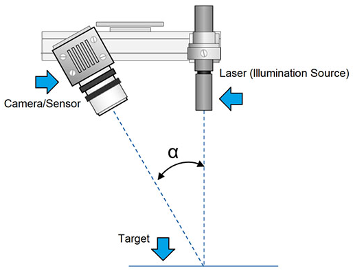
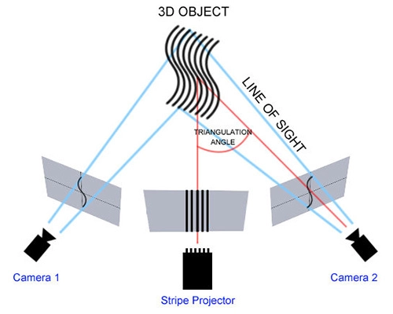

# Robotics Sensors

[toc]

## Laser Tracker

## LIDAR

LiDAR: light detection and ranging;

There are two different types of technology behind static terrestrial laser scanners:

- Time of flight (ToF): such as Leica C10, Riegl VZ-400; 50k-150k pts/sec
- Phase-shift (or phased based): such as Leica HDS7000, Faro Focus 3D; 1M pts/sec

Characteristics

- ToF is terrible at close range; accuracy at less than 6 feet is poor.

- Phased based data can be weird; TOF point clouds are less noisy, and more consistent in the noise they produce. Phased based point clouds however, tend to be more noisy and also produce a range of spurious points that are not always predictable or consistent. 

  two category of noise:

  - measurement noise: inaccuracy of the scanner
  - spurious point noise: much larger measurement error whereby the scanner receives a false laser return. Spurious points include things like *edge effects* and *reflections*

  C10 can shoot through most glass windows and acquire point cloud data - however, HDS7000 usually cannot.

- Phased based scanners don't have true dual axis compensators; TOF scanners have true dual axis compensators, like a total station - while phased based scanners use some form of less accurate tilt sensor

- ToF and Phased based scanners cannot use all the same targets

## Laser Radar

[Laser Radar vs LIDAR](https://metrology.news/difference-between-laser-radar-and-lidar-technology/)

The names are nearly synonymous and used interchangeably. The major difference being the wavelength of the signal and the divergence of the signal beam. LIDAR (Laser Detection and Ranging) is typically a collimated light beam (准直光) with minimal divergence over long distances from the transmitter; where RADAR (Radio Detection and Ranging) is a cone shaped signal fanning out from the source. Both calculate distance by comparing the time it takes for the outgoing wave or pulse to return to the source. LIDAR uses lightwave frequencies which have a shorter wavelenght enhacning the capability of follcetion data with high precision.

## Laser Scanners - metrology

Main technologies

### Laser Triangualtion

Laser triangulation is one of the simplest scanning technologies. Triangulation works by projecting a laser point or line onto an object and then capturing its reflection with sensors. Since the sensors are located at a known distance from the laser's source, accurate point mensurments can be made by calculating the reflection angle of the laser light. With the knowledge of the distance of the scanner from the object, the scanning hardware can map the surface of the object and therby record a 3D scan.

The laser dot(line) and the laser emitter for a triangle as shown below.

The benefits of the laser triangulation technology are its resolution and accuracy. When talking about accuracy, it is on the order of tens of micrometers.

Disadvantages: the digitization of transparent or reflective surfaces can prove difficult.

### Structured Light

Structured light technology also uses trigonometric triangulation but works by projecting a pattern of light onto the object to scan and not a laser line (or dot). The pattern is projected on the object using an LCD projector or some other source of stable light. One or more sensors (or cameras), slightly offset from the projector, look at the shape of the pattern of light and calculate the distance of every point in the field of view. The structured light used in the scanning process can be white or blue and the pattern of light usually consists of a series of stripes, but can also consist of a matrix of dots or other shapes. 

The benefit of structured light technology is how fast scans are. Just like laser scanners, structured light scanners are extremely accurate and offer a high resolution.

One of the downsides of this type of scanner is that they are sensitive to the lighting conditions in a given environment. This is less true of laser scanners. For example, working outside would be extremely difficult.

#### Fringe Pattern

Fringe pattern generation is the process of projecting a sinusoidal pattern over the surface of an object and capturing the pattern by taking a picture of it with a digital camera.

unwrapping

Fringe pattern analysis is the central algorithm for recovering the underlying phase distribution from the recorded frgine patterns. Despite extensive research efforts for decades, how to extract the desired phase information, with the highest possible accuracy, from the minimum number of fringe patterns remains one of the most challenging open problems. Deep neural networks can be trained to perform fringe analysis to enhance the accuracy of phase demodulation from a signle fringe pattern.

[TODO]

### Time-of-flight

Triangulation and structured light are meant for shrot range 3D scanning.

Time-of-flight 3D scanners use laser pulse technology. Just like laser scanners they use lasers to accurately scan a 3D object, however, the technology works completely differently. It works by knowing the speed of the laser light perfectly, then the system measures the length of time the laser takes to reach an object and reflect back to its sensor. 

Another type of time-of-flight 3D scanner uses phase-shift systems. This technique works the same as laser pulse technology, but also modulates the power of the laser beam. The scanner compares the phase of the laser sent out and returned to the sensor. This allows it to be more accurate than a laser pulse 3D scanner but not as flexible for long range scanning. 

Time-of-flight 3D scanners are definitely not as accurate as laser scanners or structured light scanners, however if you are looking to scan a large object, let’s say a building, you will mostly likely use this sort of technology. 

## Photogrammetry

