# Self-Driving Car Engineer

[toc]

Projects

- Finding Lane Lines
- Advanced Lane Finding
- Traffic Sign Classifier
- Behavioral Cloning
- Extended KF
- Kidnapped Vehicle
- Highway Driving
- PID Controller
- LinkedIn, Github profiles
- Programming a Real Self-Driving Car

## Part 1. Computer Vision, Deep Learning, and Sensor Fusion

### Introduction; 

Robotics approach and Deep learning approach

Stanley; DARPA Grand Challenge

### Computer Vision Fundamentals

vision perception; 

The following features could be useful in the identification of lane lines on the road

- Color
- Shape
- Orientation
- Position in the image

RGB channels; 0: darkest, 255: white; pure while: [255, 255, 255]


#### Color Selection

modify the threshold values until retain as much of the lane lines as possible while dropping everything else

```python
import matplotlib.pyplot as plt
import matplotlib.image as mpimg
import numpy as np

# read image
image = mpimg.imread("../../Media/laneOrg.jpg")
print("this iamge is: ", type(image),
      "with dimension: ", image.shape)  # (nrow, ncol, 3)

xsize = image.shape[1]
ysize = image.shape[0]

color_select = np.copy(image)

red_threshold = 200
green_threshold = 200
blue_threshold = 200
rgb_threshold = [red_threshold, green_threshold, blue_threshold]
# print(type(rgb_threshold))

# pixels below the threshold
thresholds = (image[:, :, 0] < rgb_threshold[0]) \
    | (image[:, :, 1] < rgb_threshold[1]) \
    | (image[:, :, 2] < rgb_threshold[2])
print(type(thresholds), '\t', thresholds.shape)
color_select[thresholds] = [0, 0, 0]

plt.imshow(color_select)
plt.show()

# mpimg.imsave("../../Media/laneSelected.jpg", color_select)
```


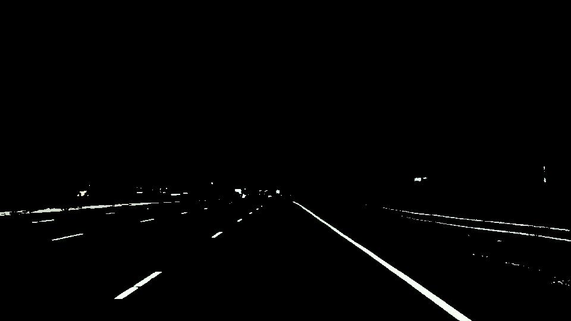


#### Region Masking

Assuming that the front facing camera that took the image is mounted in a fixed position on the car, such that the lane lines will always appear in the same general region of the image. We are using a triangular mask for illustration, in principle, we could use any polygon.

```python
import matplotlib.pyplot as plt
import matplotlib.image as mpimg
import numpy as np

# read image
image = mpimg.imread("../../Media/laneOrg.jpg")
print("this iamge is: ", type(image),
      "with dimension: ", image.shape)  # (nrow, ncol, 3)

xsize = image.shape[1]
ysize = image.shape[0]

color_select = np.copy(image)
line_image = np.copy(image)

red_threshold = 200
green_threshold = 200
blue_threshold = 200
rgb_threshold = [red_threshold, green_threshold, blue_threshold]
# print(type(rgb_threshold))

# Define a triangle region of interest
left_bottom = [120, 540]
right_bottom = [820, 540]
apex = [475, 310]

fit_left = np.polyfit((left_bottom[0], apex[0]), (left_bottom[1], apex[1]), 1)
fit_right = np.polyfit(
    (right_bottom[0], apex[0]), (right_bottom[1], apex[1]), 1)
fit_bottom = np.polyfit(
    (left_bottom[0], right_bottom[0]), (left_bottom[1], right_bottom[1]), 1)

# mask pixels below the threshold
color_thresholds = (image[:, :, 0] < rgb_threshold[0]) \
    | (image[:, :, 1] < rgb_threshold[1]) \
    | (image[:, :, 2] < rgb_threshold[2])

# find the region inside the triangle
XX, YY = np.meshgrid(np.arange(0, xsize), np.arange(0, ysize))
region_thresholds = (YY > (XX*fit_left[0] + fit_left[1])) & \
    (YY > (XX*fit_right[0] + fit_right[1])) & \
    (YY < (XX*fit_bottom[0] + fit_bottom[1]))

color_select[color_thresholds] = [0, 0, 0]
# find where the image is both colored right and in the region
line_image[~color_thresholds & region_thresholds] = [255, 0, 0]

plt.imshow(image)
x = [left_bottom[0], right_bottom[0], apex[0], left_bottom[0]]
y = [left_bottom[1], right_bottom[1], apex[1], left_bottom[1]]
plt.plot(x, y, 'b--', lw=4)
plt.imshow(color_select)
plt.imshow(line_image)
plt.show()
```

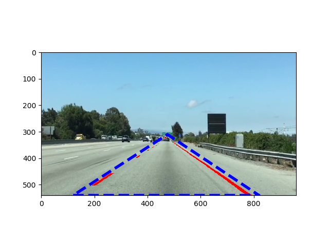

Lane lines are not always the same color, and even lines of the same color under different lighting conditions may fail to be detected by the simple color selection

#### Canny Edge Detection

OpenCV in Python

John F. Canny; Convert to grayscale, calculate gradient; Canny algorithm will thin the edges

```
edges = cv2.Canny(gray, low_threshold, high_threshold)
```

The Canny algorithm will first detect strong edge (strong gradient) pixels above the high_threshold, and reject pixels below the low_threshold. Pixels with values between the low_threshold and high_threshold will be included as long as they are connected to strong edges. The derivatives (i.e. the value differences from pixel to pixel), will be on the scale of tens or hundreds. John Canny recommended a low_threshold to high_threshold ratio of 1:2 or 1:3.

Applying Gaussian smoothing before running Canny will suppress noise and spurious gradients by averaging. cv2.Canny function actually applies Gaussian smoothing internally, but further smoothing will yield different results. 

```python
import matplotlib.pyplot as plt
import matplotlib.image as mpimg
import numpy as np
import cv2

image = mpimg.imread("../../Media/exitRamp.jpg")
plt.imshow(image)

gray = cv2.cvtColor(image, cv2.COLOR_RGB2GRAY)
plt.imshow(gray, cmap="gray")

kernel_size = 3  # odd number implying the averaging window
blur_gray = cv2.GaussianBlur(gray, (kernel_size, kernel_size), 0)

low_threshold = 50
high_threshold = 150
edges = cv2.Canny(blur_gray, low_threshold, high_threshold)

plt.imshow(edges, cmap = "Greys_r")
plt.show()
```


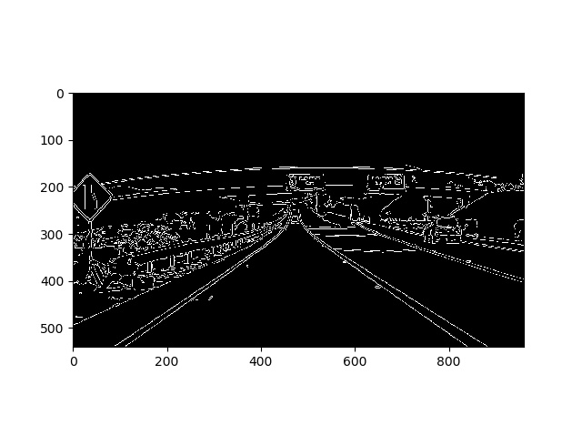


#### Hough Transform

using the Hough transform to find Lines from Canny edges.

In 2D image space, a line can be described as $y = m*x+b$, which could also be represented in the parameter space. The Hough transform is jus the conversion from image space to Hough space. *The characterization of a line in image space is a single point at the position (m, b) in Hough space*.

Inversely, a line $y = m*x+b$ can be written as $b = -x*m+y$, so a point in image space is a line in Hough space with slope of $-x$. The intersection point of the two lines in the Hough space correspond to [A line in image space that passes through both $(x1, y1)$ and $(x2, y2)$], since we have the same $(m, b)$ at the intersection point.

So our strategy in finding straight lines in image space is to look for intersecting lines in the Hough space. One problem is that vertical lines in image space has infinite slope; the polar coordinate is the strategy.

 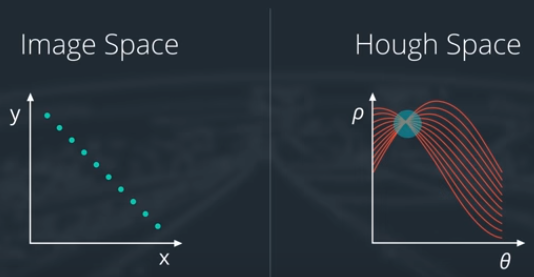

```python
lines = cv2.HoughLinesP(masked_edges, rho, theta, threshold,
                       np.array([]), min_line_length, max_line_gap)
```

- masked_edges: input image
- lines: array containing endpoints $(x1, y1, x2, y2)$ of all line segments detected by the transform operation
- rho, theta: distance and angular resolution of our grid in Hough space; rho unit pixel, theta unit radian; rho with a minimum value of 1, a reasonable starting for theta is 1 degree (pi/180 radians)
- threshold: the minimum number of votes (intersections in a given grid cell) a candidate line needs to have to make it into the output
- np.array([]): empty placeholder
- min_line_length: minimum length of a line (in pixels) that will be accepted in the output
- max_line_gap: maximum distance (in pixels) between segments that will be allowed to be connected into a single line

```python
import matplotlib.pyplot as plt
import matplotlib.image as mpimg
import numpy as np
import cv2

image = mpimg.imread("../../Media/exitRamp.jpg")
plt.imshow(image)

# grayscale image
gray = cv2.cvtColor(image, cv2.COLOR_RGB2GRAY)
plt.imshow(gray, cmap="gray")

# define a kernel size and apply Gaussian smoothing
kernel_size = 5  # odd number implying the averaging window
blur_gray = cv2.GaussianBlur(gray, (kernel_size, kernel_size), 0)

# Canny edge detection
low_threshold = 50
high_threshold = 150
masked_edges = cv2.Canny(blur_gray, low_threshold, high_threshold)

# create a masked edges image using cv2.fillPoly
mask = np.zeros_like(masked_edges)
ignore_mask_color = 255
# define a four sided polygon to mask
imshape = image.shape
vertices = np.array([[(0,imshape[0]),(450, 300), (500, 300), (imshape[1],imshape[0])]], dtype=np.int32)
cv2.fillPoly(mask, vertices, ignore_mask_color)
masked_edges = cv2.bitwise_and(masked_edges, mask)

# Define the Hough transform parameters
rho = 1
theta = 0.5*np.pi/180.0
threshold = 5
min_line_length = 10
max_line_gap = 1
line_image = np.copy(image)*0  # creating a blank to draw lines on

lines = cv2.HoughLinesP(masked_edges, rho, theta, threshold,
np.array([]), min_line_length, max_line_gap)

for line in lines:
    for x1, y1, x2, y2 in line:
        cv2.line(line_image, (x1, y1), (x2, y2), (255, 0, 0), 10)

# Create a "color" binary imag eto combine with line image
color_edges = np.dstack((masked_edges, masked_edges, masked_edges))

# Draw the lines on the edge image
combo = cv2.addWeighted(color_edges, 0.8, line_image, 1, 0)

plt.imshow(combo)
plt.show()
```

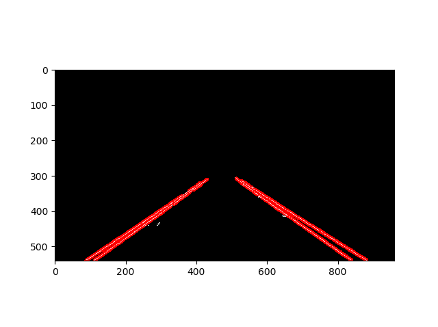

#### Parameter Tuning

Parameter tuning is one of the biggest challenges in CV - what works well for one image may not work at all with different lighting and/or backgrounds.

develop a parameter tuning tool overtime

### Project: Finding Lane Lines

finding lane lines in a video stream; video is a just a series of images

The README.md file for each repository (in GitHub) can include the following information:

- a list of files contained in the repository with a brief description of each file
- any instructions someone might need for running the code
- an overview of the project

The tools we have:

- color selection
- region of interest selection
- grayscaling
- Gaussian smoothing
- Canny Edge Detection
- Hough Transform line detection

Some OpenCV functions that might be useful for this project are:

- cv2.inRange() for color selection
- cv2.fillPoly() for regions selection
- cv2.line() to draw lines on an image given endpoints
- cv2.addWeighted() to add/overlay two images
- cv2.cvtColor() to grayscale or change color
- cv2.imwrite() to output images to file
- cv2.bitwise_and() to apply a mask to an image


### Camera Calibration

80% of challenge is from *perception*

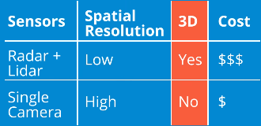

#### Distortion Correction

Image distortion occurs when a camera looks at 3D objects in the real world and transforms them into a 2D image.

#### Pinhole Camera model

Real cameras use curved lenses (not pinhole) to form an image, and light rays often bend a little too much or too little at the edges of these lenses. This creates an effect that distorts the edges of images.

- **radial distortion**: lines or objects at the edges of the images appear more or less curved than actual
- **tangential distortion**: when a camera's lens is not aligned perfected parallel to the imaging plane (seems farther away or closer than actual)

distortion values: $[k1, k2, p1, p2, k3]$, for lens with not much distortion, $k3$ sometime can be negligible (close to zero), that why it appears at the end of the array in OpenCV

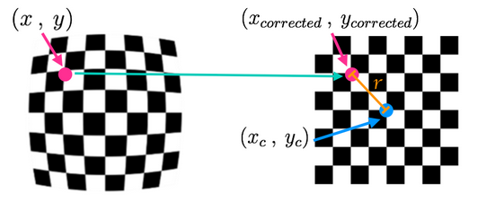

The distortion correction formulas

Radial

$\begin{align} x_{distorted} = x_{ideal}(1+k_1r^2+k_2r^4+k_3r^6) \\ y_{distorted} = y_{ideal}(1+k_1r^2+k_2r^4+k_3r^6)\end{align}$

Tangential

$\begin{align} x_{corrected} = x+[2p_1xy + p_2(r^2+2x^2)] \\ y_{corrected} = y + [p_1(r^2+2y^2)+2p_2xy]\end{align}$

#### Camera Calibration

we can use a chess board for the calibration;

"corners" are points where two black and two white squares intersect,, thus inside only not outside corners

```python
import numpy as np
import cv2
import matplotlib.pyplot as plt
import matplotlib.image as mpimg

# prepare object points
nx = 8
ny = 6

# make a list of calibration images
fname = "calibrationTestDistorted.png"
img = cv2.imread("../../Media/" + fname)

# convert to grayscale
# note: if read with cv2.imread, use cv2.COLOR_BGR2GRAY
#       if read with mpimg.imread, use cv2.COLOR_RGB2GRAY
gray = cv2.cvtColor(img, cv2.COLOR_BGR2GRAY)

# find the chessboard corners
ret, corners = cv2.findChessboardCorners(gray, (nx, ny), None)
print(type(corners), corners.shape)

# if found, draw corners
if ret == True:
    cv2.drawChessboardCorners(img, (nx, ny), corners, ret)
    plt.imshow(img)
    plt.show()
```


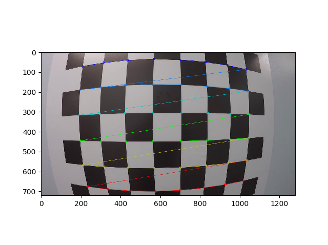

color images have 3 dimensions (height, width, and depth/channels) while grayscale image only has 2 dimensions.


Camera calibration and correction for distortion with saved image points and object points extracted

```python
import pickle
import cv2
import numpy as np
import matplotlib.pyplot as plt
import matplotlib.image as mpimg

# Read in the saved objpoints and imgpoints
dist_pickle = pickle.load(open("wide_dist_pickle.p", "rb"))
objpoints = dist_pickle["objpoints"]
imgpoints = dist_pickle["imgpoints"]

# Read in an image
img = cv2.imread("test_image.png")

# takes an image, object points, and image points
# performs the camera calibration, image distortion correction and 
# returns the undistorted image
def cal_undistort(img, objpoints, imgpoints):
    # print(img.shape)
    img_size = img.shape[1:]
    # img_size = (img.shape[1], img.shape[0])
    # img_size = img.shape[::-1]
    ret, mtx, dist, rvecs, tvecs = cv2.calibrateCamera(objpoints, imgpoints, img_size, None, None)
    undist = cv2.undistort(img, mtx, dist, None, mtx)
    # cv2.imwrite("test_image_undist.png", undist)
    return undist

undistorted = cal_undistort(img, objpoints, imgpoints)

f, (ax1, ax2) = plt.subplots(1, 2, figsize=(24, 9))
f.tight_layout()
ax1.imshow(img)
ax1.set_title('Original Image', fontsize=50)
ax2.imshow(undistorted)
ax2.set_title('Undistorted Image', fontsize=50)
plt.subplots_adjust(left=0., right=1, top=0.9, bottom=0.)
plt.show()
```

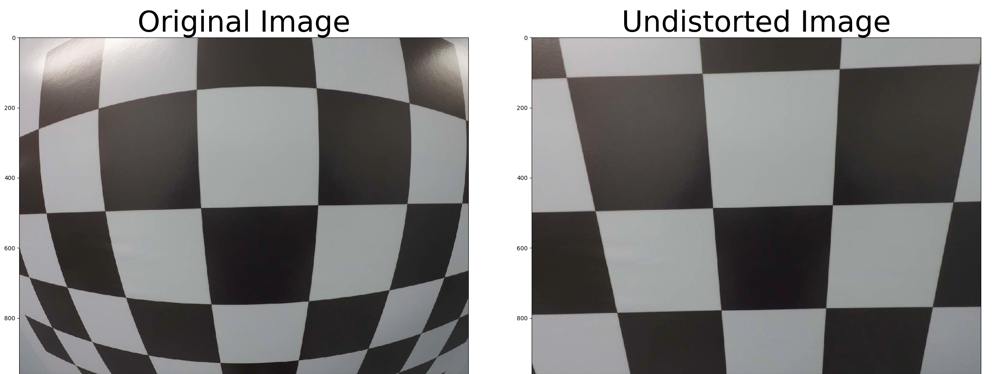

Camera calibration and correction for distortion by extracting object points and image points from raw images

```python
import numpy as np
import cv2
import glob
import matplotlib.pyplot as plt

# prepare object points, like (0, 0, 0), (1, 0, 0,), (2, 0, 0) ..., (5, 7, 0)
objp = np.zeros((6*8, 3), np.float32)
objp[:, :2] = np.mgrid[0:8, 0:6].T.reshape(-1, 2)

# arrays to store object points and image points form all the images
objpoints = []  # 3d points in real world space
imgpoints = []  # 2d points in image plane

# make a list of calirbation images
images = glob.glob("../../Media/calibration_wide/GO*.jpg")

# step through the list and search for chessbaord corners
for idx, fname in enumerate(images):
    img = cv2.imread(fname)
    gray = cv2.cvtColor(img, cv2.COLOR_BGR2GRAY)

    # find the chessboard corners
    ret, corners = cv2.findChessboardCorners(gray, (8, 6), None)

    # if found, add object points, image points
    if ret == True:
        objpoints.append(objp)
        imgpoints.append(corners)

        # draw and display the corners
        cv2.drawChessboardCorners(img, (8, 6), corners, ret)
        # write_name = "corners_found" + str(idx) +".jpg"
        # cv2.imwrite(write_name, img)
        cv2.imshow("img", img)
        cv2.waitKey(200)

cv2.destroyAllWindows()

# use the above objpoints and imgpoints for camera calibration and verify
# with one image distortion
import pickle

img = cv2.imread("../../Media/calibration_wide/test_image.jpg")
img_size = (img.shape[1], img.shape[0])

ret, mtx, dist, rvecs, tvecs = cv2.calibrateCamera(objpoints, imgpoints, img_size, None, None)

dst = cv2.undistort(img, mtx, dist, None, mtx)
cv2.imwrite("../../Media/calibration_wide/test_image_undist.jpg", dst)

# save the camera calibration result for later use (no need to worry about rvecs, tvecs)
dist_pickle = {}
dist_pickle["mtx"] = mtx
dist_pickle["dist"] = dist
pickle.dump(dist_pickle, open("../../Media/calibration_wide/wide_dist_pickle.p","wb"))
# Visualize undistortion
f, (ax1, ax2) = plt.subplots(1, 2, figsize=(24, 9))
ax1.imshow(img)
ax1.set_title('Original Image', fontsize=30)
ax2.imshow(dst)
ax2.set_title('Undistorted Image', fontsize=30)
plt.subplots_adjust(left=0., right=1, top=0.9, bottom=0.)
plt.show()
```

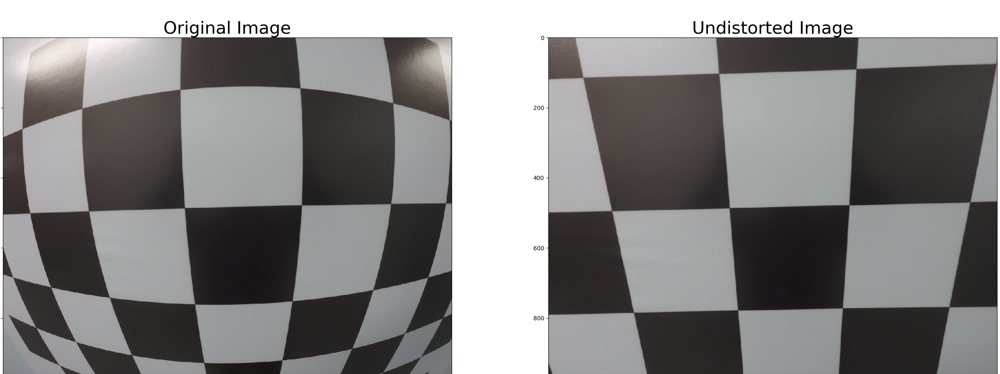

#### Lane Curvature

To obtain the correct steering angle to turn, we need calculate the curvature of the lane line. One way is to fit a 2nd degree polynomial to that line $f(y) = Ay^2 + By + C$. Performing a perspective transform to get a bird's-eye view of the lane.

#### Perspective Transform

A perspective transform maps the points in a given image to different, desired image points with a new perspective. A bird's eye view transform allows us view a lane from above. It will also allow us to match the car's location directly with a map since map displays roads from a top-down view.

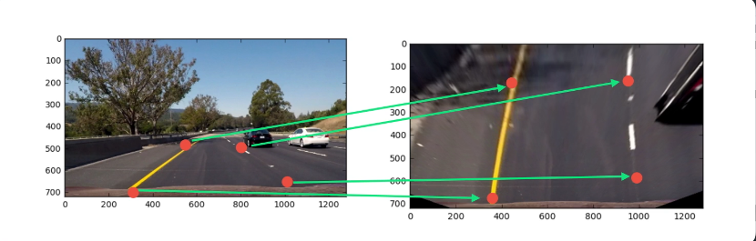

#### Transform a Stop Sign

Use 4 points to define a linear transformation between the original image and the warped iamge

We can choose four source points manually when applying a perspective transform manually. However, it is often not the best option. Many perspective transform algorithms will programmatically detect four source points in an image based on edge or corner detection and analyzing attributes like color and surrounding pixels.

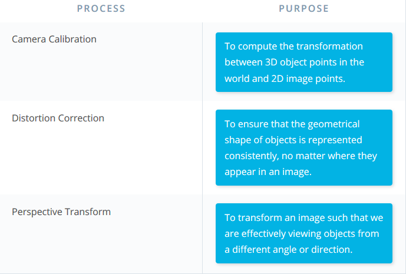

#### Undistort and Transform

Basic procedures

- undistort the image using camera calibration result
- convert to grayscale
- find the chessboard corners and draw corners
- define 4 source points (the outer 4 corners detected in the chessboard pattern) in pixels
- define 4 destination points (the same order as source points)
- get the perspective transform matrix
- use perspective transform matrix to warp the image

> Hint: the destination points are the x and y pixel values of where we want those four corners to be mapped to in the output image

```python
import pickle
import numpy as np
import cv2
import matplotlib.pyplot as plt
import matplotlib.image as mpimg

# read in the saved camera matrix and distortion coefficients
dist_pickle = pickle.load(open("../../Media/calibration_wide/wide_dist_pickle.p", "rb"))
mtx = dist_pickle["mtx"]
dis = dist_pickle["dist"]

# read in the image
img = cv2.imread("../../Media/calibration_wide/test_image2.png")
nx = 8
ny = 6

def corners_unwarp(img, nx, ny, mtx, dist):
    # 1) undistort using mtx, dist (distortion coefficients)
    # 2) convert to grayscale
    # 3) find the chessboard corners
    # 4) If corners found:
        # a) draw corners
        # b) define 4 source points src = np.float32([[,], [,], [,], [,]])
        #   we could pick any four of the detected corners; recommend using
        #   the automatic detection
        # c) define 4 destination points dst = np.float32([[,], [,], [,], [,]])
        # d) use cv2.getPerspectiveTransform() to get M, the transform matrix
        # e) use cv2.warpPerspective() to warp the image to a top-down view
    undist_img = cv2.undistort(img, mtx, dist, None, mtx)
    gray = cv2.cvtColor(undist_img, cv2.COLOR_BGR2GRAY)
    # find the chessboard corners
    ret, corners = cv2.findChessboardCorners(gray, (nx, ny), None)
    # print(type(corners), corners.shape)
    M = None
    warped = np.copy(img)
    if ret == True:
        # if found corners, draw (optional)
        cv2.drawChessboardCorners(undist_img, (nx, ny), corners, ret)
        offset = 100  # offset for dst points (in pixel)
        # grab image shape
        img_size = (gray.shape[1], gray.shape[0])
        # four detected corner points as source
        src = np.float32([corners[0], corners[nx-1], corners[-1], corners[-nx]])

        dst = np.float32([[offset, offset], [img_size[0]-offset, offset], [img_size[0]-offset, img_size[1]-offset], [offset, img_size[1]-offset]])
        M = cv2.getPerspectiveTransform(src, dst)
        warped = cv2.warpPerspective(undist_img, M, img_size)
    return warped, M

top_down, perspective_M = corners_unwarp(img, nx, ny, mtx, dis)
f, (ax1, ax2) = plt.subplots(1, 2, figsize = (24, 9))
f.tight_layout()
ax1.imshow(img)
ax1.set_title("Original image", fontsize = 50)
ax2.imshow(top_down)
ax2.set_title("Undistorted and Warped image", fontsize = 50)
plt.subplots_adjust(left = 0., right = 1, top = 0.9, bottom = 0.)
plt.show()
```

OpenCV size indexing is really awkward

### Gradients and Color Spaces

#### Soble Operator

The Sobel operator is at the heart of the Canny edge detection algorithm. Applying the Sobel operator to an image is a way of taking the derivative of the image in the $x$ or $y$ direction. A odd kernel size of at least 3. A larger kernel implies a smoother gradient.

$gradient = \sum(region.*S_x)$

Taking gradients in both the $x$ and $y$ directions. Taking the gradient in the $x$ direction emphasizes edges closer to vertical. Alternatively, taking the gradient in the $y$ direction emphasizes edges closer to horizontal.

cv2.Sobel() accepts single color channel (gray) image

```python
import numpy as np
import cv2
import matplotlib.pyplot as plt
import matplotlib.image as mpimg
import pickle

image_name = "signs_vehicles_xygrad.png"
image = mpimg.imread("../../Media/" + image_name)

def abs_sobel_thresh(img, orient = 'x', thresh_min = 0, thresh_max = 255):
    # apply the following steps to img
    # 1) convert to grayscale
    # 2) take the derivative in the "orient" direction
    # 3) take the absolute value of the derivative or gradient
    # 4) scale to 8-bit (0-255) then convert to type = np.uint8
    # 5) create a mask of 1's where the scaled gradient mangnitue is between thresh_min and thresh_max
    # 6) return this mask as your binary_output image
    gray = cv2.cvtColor(img, cv2.COLOR_RGB2GRAY)
    if orient == 'x':
        sobeldire = cv2.Sobel(gray, cv2.CV_64F, 1, 0)
    if orient == 'y':
        sobeldire = cv2.Sobel(gray, cv2.CV_64F, 0, 1)
    abs_sobeldire = np.absolute(sobeldire)
    scaled_sobel = np.uint8(255*abs_sobeldire/np.max(abs_sobeldire))

    binary_output = np.zeros_like(scaled_sobel)
    binary_output[(scaled_sobel >= thresh_min) & (scaled_sobel <= thresh_max)] = 1
    return binary_output

grad_binary = abs_sobel_thresh(image, orient='x', thresh_min=20, thresh_max=100)

f, (ax1, ax2) = plt.subplots(1, 2, figsize=(24, 9))
f.tight_layout()
ax1.imshow(image)
ax1.set_title("original image", fontsize = 50)
ax2.imshow(grad_binary, cmap = 'gray')
ax2.set_title("threshold gradient", fontsize = 50)
plt.subplots_adjust(left=0., right=1, top=0.9, bottom=0.)
plt.show()
```

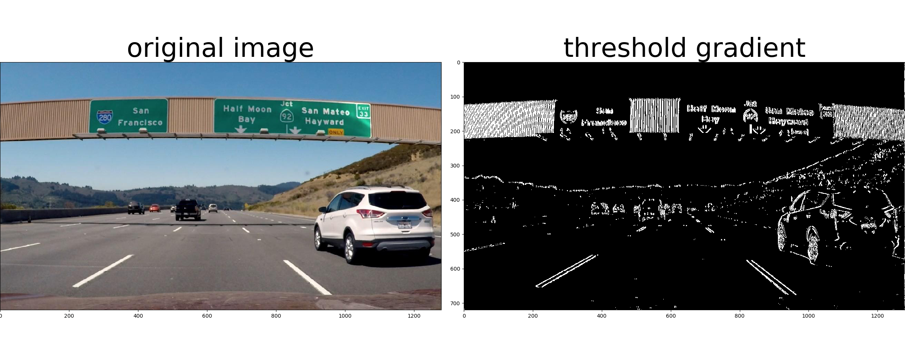

#### Magnitude of the Gradient

We took the gradient in $x$ or $y$ and set thresholds to identify pixels within a certain gradient range. Now, we want to apply a threshold to the overall magnitude of the gradient, in both x and y.

It's also worth considering to modify the kernel size for the Sobel operator to change the region of interest size. Taking the gradient over larger regions can smooth over noisy intensity fluctuations on small scales.

```python
import numpy as np
import cv2
import matplotlib.pyplot as plt
import matplotlib.image as mpimg
import pickle

image_name = "signs_vehicles_xygrad.png"
image = mpimg.imread("../../Media/" + image_name)

# Define a function that applies Sobel x and y, 
# then computes the magnitude of the gradient
# and applies a threshold
def mag_thresh(img, sobel_kernel=3, mag_thresh=(0, 255)):
    # Apply the following steps to img
    # 1) Convert to grayscale
    # 2) Take the gradient in x and y separately
    # 3) Calculate the magnitude 
    # 4) Scale to 8-bit (0 - 255) and convert to type = np.uint8
    # 5) Create a binary mask where mag thresholds are met
    # 6) Return this mask as your binary_output image
    gray = cv2.cvtColor(img, cv2.COLOR_RGB2GRAY)
    sobel_x = cv2.Sobel(gray, cv2.CV_64F, 1, 0, sobel_kernel)
    sobel_y = cv2.Sobel(gray, cv2.CV_64F, 0, 1, sobel_kernel)
    sobel_abs = np.sqrt(np.absolute(sobel_x)*np.absolute(sobel_x) + np.absolute(sobel_y)*np.absolute(sobel_y))
    scaled_sobel = np.uint8(255*sobel_abs/np.max(sobel_abs))

    binary_output = np.zeros_like(scaled_sobel)
    thresh_min = mag_thresh[0]
    thresh_max = mag_thresh[1]
    binary_output[(scaled_sobel >= thresh_min) & (scaled_sobel <= thresh_max)] = 1
    return binary_output

# Run the function
mag_binary = mag_thresh(image, sobel_kernel=3, mag_thresh=(30, 100))
# Plot the result
f, (ax1, ax2) = plt.subplots(1, 2, figsize=(24, 9))
f.tight_layout()
ax1.imshow(image)
ax1.set_title('Original Image', fontsize=50)
ax2.imshow(mag_binary, cmap='gray')
ax2.set_title('Thresholded Magnitude', fontsize=50)
plt.subplots_adjust(left=0., right=1, top=0.9, bottom=0.)
plt.show()
```


#### Direction of the Gradient

Gradient magnitude is at the heart of Canny edge detection, and is why Canny works well for picking up all edges.

In the case of lane lines, we are interested only in edges of a particular orientation. The direction of the gradient is imply the inverse tangent of the $y$ gradient divided by the $x$ gradient - TODO

$atan(sobel_y/sobel_x)$

Each pixel of the resulting image contains a value for the angle of the gradient away from horizontal in units of radians, with range of $[-\pi/2, \pi/2]$. An orientation of 0 implies a vertical line and orientation of $\pm \pi/2$ imply horizontal lines.

```python
import numpy as np
import cv2
import matplotlib.pyplot as plt
import matplotlib.image as mpimg
import pickle

# Read in an image
image_name = "signs_vehicles_xygrad.png"
image = mpimg.imread("../../Media/" + image_name)

# Define a function that applies Sobel x and y, 
# then computes the direction of the gradient
# and applies a threshold.
def dir_threshold(img, sobel_kernel=3, thresh=(0, np.pi/2)):
    # Apply the following steps to img
    # 1) Convert to grayscale
    # 2) Take the gradient in x and y separately
    # 3) Take the absolute value of the x and y gradients
    # 4) Use np.arctan2(abs_sobely, abs_sobelx) to calculate the direction of the gradient 
    # 5) Create a binary mask where direction thresholds are met
    # 6) Return this mask as your binary_output image
    gray = cv2.cvtColor(img, cv2.COLOR_RGB2GRAY)
    sobelx = cv2.Sobel(gray, cv2.CV_64F, 1, 0, ksize = sobel_kernel)
    sobely = cv2.Sobel(gray, cv2.CV_64F, 0, 1, ksize = sobel_kernel)
    graddir = np.arctan2(np.absolute(sobely), np.absolute(sobelx))
    binary_output = np.zeros_like(graddir)
    binary_output[(graddir >= thresh[0]) & (graddir <= thresh[1])] = 1

    return binary_output
    
# Run the function
dir_binary = dir_threshold(image, sobel_kernel=15, thresh=(0.7, 1.3))
# Plot the result
f, (ax1, ax2) = plt.subplots(1, 2, figsize=(24, 9))
f.tight_layout()
ax1.imshow(image)
ax1.set_title('Original Image', fontsize=50)
ax2.imshow(dir_binary, cmap='gray')
ax2.set_title('Thresholded Grad. Dir.', fontsize=50)
plt.subplots_adjust(left=0., right=1, top=0.9, bottom=0.)
plt.show()
```

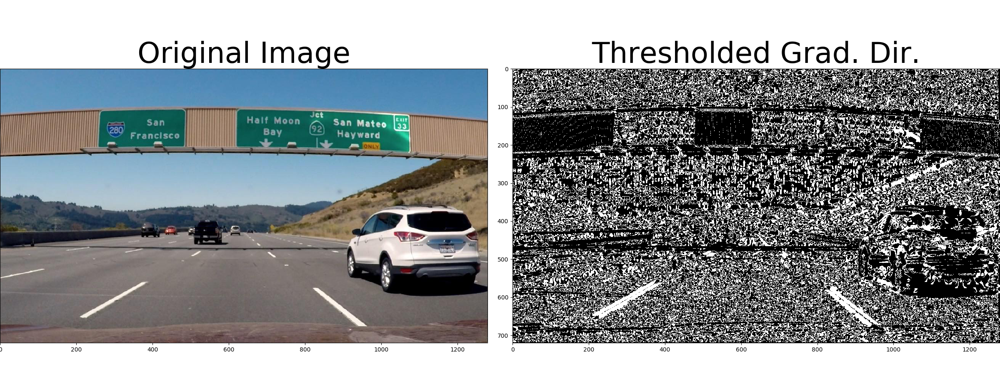

#### Combining Thresholds


### Advanced Computer Vision

### Project: Advanced Lane Finding

### Neural Networks

### TensorFlow

### Deep Neural Networks

### LeNet Traffic Signs

### Project: Traffic Sign Classifier

### Keras

### Transfer Learning

### Project: Behavioral Cloning

### Github

### Sensors

### Kalman Filters

### C++ Checkpoint

### Geometry and Trigonometry Refresher

### Extended Kalman Filters

### Project: Extended Kalman Filters

## Part 2. Localization, Path Planning, Control and System Integration

### Introduction to Localization

### Markov Localization

### Motion Models

### Particle Filters

### Implementation of a Particle Filter

### Project: Kidnapped Vehicle Project

### Search

### Prediction

### Behavior Planning

### Trajectory Generation

### Project: Highway Driving

### PID Control

### Project: PID Controller

### Project: Improve LinkedIn/GitHub

### Autonomous Vehicle Architecture

### Introduction to ROS

### Packages and Catkin Workspaces

### Writing ROS Nodes

### Project: Program an Autonomous Vehicle

### 

## Additional Content

### Object Detection

### Unscented KF

### Vehicle Models

### Model Predictive Control

### Fully Convolutional Networks

### Scene Understanding

### Inference Performance

### Introduction to Functional Safety

### Functional Safety: Safety Plan

### Functional Safety: Hazard Analysis and Risk Assessment

### Functional Safety: Functional Safety Concept

### Functional Safety: Technical Safety Concept

### Functional Safety at Software and Hardware Levels

