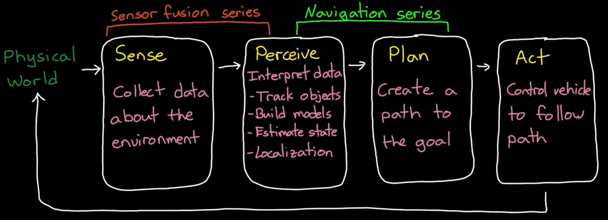

# Simultaneous Localization and Mapping

[toc]

## Autonomous Navigation

Navigation is the ability to determine your location within an environment and to be able to figure out a path that will take you to a goal.

From Tele-operations to Full autonomy

Heuristic approach

- practical rules or behaviors
- not guaranteed to be optimal
- doesn't need complete environment information

Optimal approach

- requires more environment information
- planning is achieved through optimization

Robotic vacuum

Challenges is that environments aren't perfectly known and dynamically changing

Autonomous system capabilities

