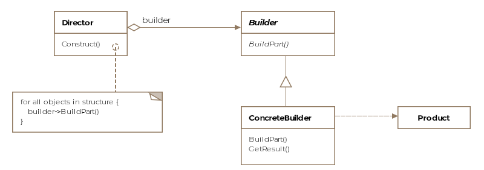
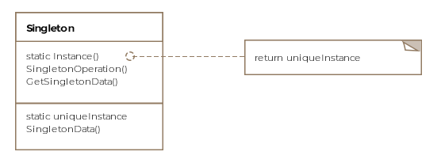
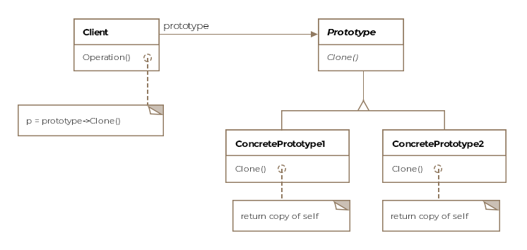
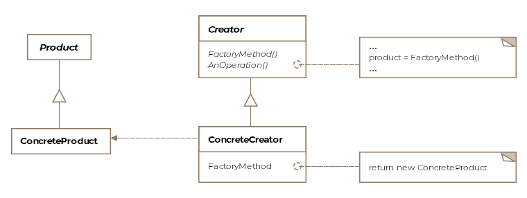

# Software Design Patterns: Best Practices for Software Developers

[toc]

## Introduction

Don't reinvent the wheel! Relationship among various design patterns by the gang of four


anti-patterns: how NOT to do things!

Suggestions for OOD:

- Separate out parts of code that vary or change from those that remain the same
- Always code to an interface and not against a concrete implementation
- Encapsulate behaviors as much as possible
- Favor composition over inheritance: Inheritance can result in explosion of classes and also sometimes the base class is fitted with new functionality that isn't applicable to some of its derived classes
- Interacting components within a system should be as loosely coupled as possible
- Ideally, class design should inhibit modification and encourage extension
- Using patterns in your day to day work, allows exchanging entire implementation concepts with other developers via shared pattern vocabulary

Flexibility increases complexity and understandability. One must walk a fine line between the two competing objectives when designing and writing software.

### Types of Design Patterns

- Creational: relate to how objects are constructed from classes.
  - Builder Pattern
  - Prototype Pattern
  - Singleton Pattern
  - Abstract Factory Pattern
- Structural: concerned with the composition of classes i.e. how the classes are made up or constructed
  - Adapter Pattern
  - Bridge Pattern
  - Composite Pattern
  - Decorator Pattern
  - Facade Pattern
  - Flyweight Pattern
  - Proxy Pattern
- Behavioral: dictate the interaction of classes and objects amongst each other and the delegation of responsibility
  - Interpreter Pattern
  - Template Pattern
  - Chain of Responsibility Pattern
  - Command Pattern
  - Iterator Pattern
  -  Mediator Pattern
  - Memento Pattern
  - Observer Pattern
  - State Pattern
  - Strategy Pattern
  - Visitor Pattern

For interview prep, go through all **creational patterns, decorator, proxy, iterator, observer and visitor** patterns. Be sure to look at the Java framework's api examples

## Creational Patterns

### Builder Pattern

How complex objects can be represented and constructed without coupling the two operations.

A *composite* or and *aggregate* object is what a builder generally builds

Formally, a *builder pattern encapsulates or hides the process of building a complex object and separates the representation of the object and its construction. The separation allows us to construct different representations using the same construction process*.



The process or algorithm required to construct the aircraft which in our case is the specific order in which the different parts are created is captured by another class called Director. The director is in a sense *directing* the construction of the aircraft.

The AircraftBuilder hides how a given aircraft gets built.

You may find the builder pattern being used without the **director**. The client can directly instantiate the builder and invoke the required methods to get a product for itself. This is a common antidote for **telescoping constructors**.

> The builder pattern might seem similar to the abstract factory pattern but one difference is that the builder pattern creates an object step by step whereas the abstract factory pattern returns the object in one go.

### Singleton Pattern

Singleton pattern enforces only a single instance of a class to ever get produced and exist throughout an application's lifetime.

Caches, thread pools, registries are examples of objects that should only have a single instance.

How? The answer is to make the constructor private of the class we intend to define as singleton. That way, only the members of the class can access the private constructor and no one else.

Formally, the Singleton pattern is defined as *ensuring that only a single instance of a class exists and a global point of access to it exists*



```c++
class AirforceOne
{
public:
    static AirforceOne* getInstance() {
        if(!onlyInstance) {
            onlyInstance = new AirforceOne();
        }
        return onlyInstance;
    }
    AirforceOne(AirforceOne const&) = delete;
    void operator= (AirforceOne const&) = delete;

    void fly() {
        cout << "Airforce one is flying..." << endl;
    }
private:
    AirforceOne() {}
    static AirforceOne* onlyInstance;
};

AirforceOne* AirforceOne::onlyInstance = nullptr;

int main()
{
    AirforceOne* s1 = AirforceOne::getInstance();
    s1->fly();
    
    AirforceOne* s2 = AirforceOne::getInstance();
    cout << s1 << endl;
    cout << s2 << endl;  // the address should be the same

    return 0;
}
```

Multithreading and Singleton

for multiple threads, need pay attention to the race condition

- synchronized (Java?)
- undertake static initialization of the instance

The next version would be "double-checked locking"

> It's possible to subclass a singleton class by making the constructor protected instead of private. It might be suitable under some circumstances. AN approach taken in these scenarios is to create a *register of singletons* of the subclasses and the getInstance method can take in a parameter or use an environment variable to return the desired singleton. The registry maintains a mapping of string names to singleton objects.

### Prototype Pattern

creating new objects by copying existing objects. The object whose copies are made is called the *prototype*. 

- Imagine a class will only be loaded at runtime and you can't access its constructor statically. The run-time environment creates an instance of each dynamically loaded class automatically and registers it with a *prototype manager*. The application can request objects from the prototype manager which in turn can return clones of the prototype
- The number of classes in a system can be greatly reduced by varying the values of a cloned object from a prototypical instance



The prototype pattern is all about object copying.

- Interface
- Implementation
- Client

Shallow vs. Deep Copy

The prototype pattern requires that the prototype class or interface implements the clone() method. Cloning can be either *shallow* or *deep*. Say, F-16 class has a member object of type F16Engine. In a shallow copy, the cloned object would point to the same F16Engine object as the prototype. The engine object would end up getting shared between the two. However, in a deep copy, the cloned object would get a copy of its own engine object as well as any of the nested objects within it. There will be no sharing of any fields, nested or otherwise between the prototype and the clone.

> Implementing the clone method can be challenging because of circular references

### Factory Method Pattern

How derived classes can be given the responsibility of creating appropriate objects.

**code to an interface and not to an implementation**

Formally, the factory method is defined as *providing an interface for object creation but delegating the actual instantiation of objects to subclasses*



Encapsulate the object creation in another object that is solely responsible for new-ing up the requested variants of the F-16.

Remember simple and static factories aren't the same as the factory method pattern, but common programming idiom.

We used inheritance to subclass and specialize the engine object. A factory method may or may not provide a default or generic implementation but lets subclasses specialize or modify the product by overriding the create/make methods. In our example, the variant models only have a different engine but the same cockpit.

Note that the factory method pattern, returns an abstract type, be it a Java interface or a Java abstract class. The general setup is that the superclass has the implementation for all the methods other than the creation methods. A create method is either abstract or comes with a default implementation and in turn is invoked by the other methods of the superclass. The creation of the right object is the responsibility of the subclasses.

> The factory method pattern might seem very similar to the simple or static factory, however, the primary difference is that simple factories can't produce varying products through inheritance as a factory method pattern can.

The factory pattern can be used whenever a class doesn't know ahead of time what subclass objects it would need to instantiate. This is a common problem in designing frameworks

>Caveats:
>
>- The pattern can result in too many subclasses with very minor differences
>- If the subclass extends the functionality, then the superclass can't use it unless it downcasts it to the concrete type. The downcast may fail at runtime

### Abstract Factory Pattern