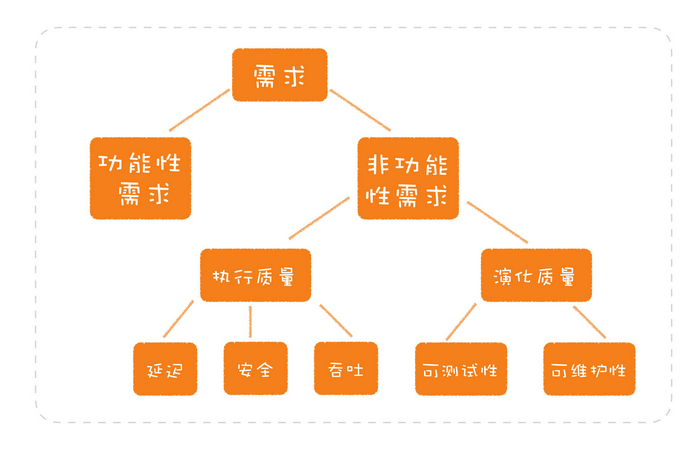

# 软件设计之美

[toc]

## 开篇词

软件设计：

- 写软件不仅要追求如何实现功能，还要考虑未来的维护和扩展；

- 代码不应该毫无目的地堆在那里，而是要考虑如何组织更为恰当；

- 原来后期遇到很多问题，只是因为前期缺乏设计而留下了隐患

### 关注长期变化的软件设计

> Design is there to enable you to keep changing the software easily in the long term.
>
> —— Kent Beck

长期意味着会有源源不断的需求扑面而来。

算法和软件设计其实是一样的，二者对抗的都是规模问题，只不过，**算法对抗的是数据的规模，而软件设计对抗的是需求的规模**。

**软件设计，实际上就是应对需求的“算法”**。

### 如何学习软件设计

快速了解现有软件设计的方法，那就是抓住这个软件最核心的三个部分：**模型、接口和实现**。

从功能到业务，从模块到系统

软件设计中最重要的部分：

- 程序设计语言
  - 则其善者而从之
- 编程范式
  - 代码编写的风格，决定着你在设计时可以用到哪些元素：模块、对象还是函数。在不同层次的设计中，选择不同的编程范式。结构化编程、面向对象和函数式编程
- 设计原则
  - SOLID原则
- 设计模式
- 设计方法
  - DDD是目前最为完整。有效的应对复杂业务场景的设计方法，包括了从如何识别概念到如何建立模型

不懂程序设计的人能摆弄的代码规模是有限的。

## 课前必读

### 01 软件设计到底是什么？

软件设计要关注长期变化，需要应对需求规模的膨胀。

#### 核心的模型

软件开发是为了解决由需求带来的各种问题，而解决的结果是一个可以运行的交付物。

**软件设计就是要构建出一套模型**。

模型不仅包括用来描述业务的各种实体，也包括完成业务功能的各种组件。代码中常用到的服务Service、调度器Scheduler等概念就是一个个模型。

**模型，是一个软件的骨架，是一个软件之所以是这个软件的核心**。一个电商平台，它不用关系型数据库，还可以用NoSQL，但如果没有产品信息，没有订单，它就不再是电商平台了。

**模型的粒度可大可小**。如果把模型理解为一个一个的类，就是小的模型。你也可以把一整个系统当作一个整体来理解，这就是大的模型。

“**高内聚、低耦合**”，**这其实就是对模型的要求。**

整个计算机世界就是在这样一个又一个模型的叠加中，一点一点构建出来的。

我们熟悉的网络模型就是一个典型的分层模型。按照TCP/IP的分层方法，网络层要构建在网络接口层之上，应用层则要依赖传输层，而我们平时使用的大多数协议则属于应用层。

即便实在一个软件内部，模型也可以是分层的。**可以从最核心的模型开始构建，有了这个核心模型之后，可以通过组合这些基础的模型，构建出上面一层的模型**

总结一下就是，模型是一个软件的核心；模型的粒度可大可小；好的模型应该“高内聚、低耦合”；模型可以分层，由底层的模型提供接口，构建出上层的模型。

#### 约束的规范

**规范，就是限定了什么样的需求应该以怎样的方式去完成**。比如

- 与业务处理相关的代码，应该体现在领域模型中；

- 与网络连接相关的代码，应该写在网关里；

- 与外部系统集成的代码，需要有防腐层；

**一种常见的问题就是缺乏显式的、统一的规范。**

没有一个统一的规范，每一个项目上的新成员都会痛斥一番前人的不负责任。然后，新的人准备另起炉灶，增加一些新东西。这种场景你是不是很熟悉呢？混乱通常就是这样开始的。

如果存在一个显式的、统一的规范，项目会按照一个统一的方向行进。即便未来设计要演化、规范要调整，有一个统一的规范也要比散弹打鸟来得可控得多。

关于规范，**还有一种常见问题就是，规范不符合软件设计原则**。

#### 模型与规范

**模型与规范，二者相辅相成**。一个项目最初建立起的模型，往往是要符合一定规范的，而规范的制定也有赖于模型。这就像讨论户型设计时，你可以按照各种方式组合不同的空间（模型），却不会把厨房与卫生间放在一起（规范）

特定技术、框架和中间件，只是支撑我们模型的实现，而设计模式、Controller、Service、Model这些东西也只是一个特定的实现结果，是某些特定场景下的模型。

#### 总结

- 模型，是一个软件的骨架，是一个软件之所以是这个软件的核心。模型的粒度可大可小。我们所说的“高内聚、低耦合”指的就是对模型的要求，一个好的模型可以有效地隐藏细节，让开发者易于理解。模型是分层的，可以不断地叠加，基于一个基础的模型去构建上一层的模型，计算机世界就是这样一点点构建出来的。
- 规范，就是限定了什么样的需求应该以怎样的方式去完成。它对于维系软件长期演化至关重要。关于规范，常见的两种问题是：一个项目缺乏显式的、统一的规范；规范不符合软件设计原则。
- 模型与规范，二者相辅相成，一个项目最初建立起的模型，往往是要符合一定规范的，而规范的制定也有赖于模型。

好的产品经理和业务专家

慢慢的，某个瞬间，突然觉得自己的工作不再是码农，而是软件设计，并且在工作中得到强烈的自我肯定。

向贝佐斯学习，做事情要建立在不变的东西上。模型是一个理解世界的抽象模型，就像科学理论一样。好的模型应该是稳定的，简洁的。

规范也不能朝令夕改，规范就是做事的高层原则，相当于“公理”。公理要么来自于根深蒂固的人性（广义的，中性的，如懒惰，两点之间直线最短），要么就是大量经验教训的积累（如业界各公司如阿里巴巴开发手册之类）。（这里看出为什么小公司规范意识稀缺了，踩得坑不足，积累经验不足，你就是想规范也规范不起来。解决办法就是参考业界或大公司的规范，当然不能照搬。）   

​     

### 02 分离关注点：软件设计至关重要的第一步

问题一般是如何解决的呢？最常见的解决问题思路是**分而治之**

分解出来的**粒度太大会造成什么影响呢？这会导致我们把不同的东西混淆在一起**，为日后埋下许多隐患。

**技术和业务被混在了一起，随之而来的就是无尽的后患。** 通信层面的技术问题在通信层面解决了，业务层面也就不会受到影响了。

#### 分离关注点

我们在分解问题的时候，会有很多维度，每一个维度都代表着一个关注点，这就是设计中一个常见的说法，“**分离关注点（Separation of concerns）**”。

最常见的一类问题就是**把业务处理和技术实现两个关注点混在了一起**

例子：如果现在业务的处理性能跟不上，你有什么办法解决吗？大多数程序员的第一反应是，多线程啊！没错，多线程的确是一种解决办法。但如果不加限制地让人去把这段代码改成多线程的，一些多线程相关的问题也会随之而来。比如，让人头疼的资源竞争、数据同步等等。写好业务规则和正确地处理多线程，这是两个不同的关注点。如果我们把二者放到同一段代码里去写，彼此影响也就在所难免了。问题说明白了，解决方案才能清楚，那就是把业务处理和多线程处理的代码分开。

**大部分程序员都不应该编写多线程程序**。由专门的程序员把并发处理的部分封装成框架，大家在里面写业务代码就好了。

在真实项目中，程序员最常犯的错误就是认为所有问题都是技术问题，总是试图用技术解决所有问题。**任何试图用技术去解决其\**\*\*他\*\**\*关注点的问题，只能是陷入焦油坑之中，越挣扎，陷得越深。**

另外一个常见的容易产生混淆的关注点是**不同的数据变动方向**。**不同的数据变动方向，就是一个潜在的、可以分离的关注点。**

分离关注点之所以重要，有两方面原因。一方面，不同的关注点混在一起会带来一系列的问题，正如前面提到的各种问题；另一方面，当分解得足够细小，你就会发现不同模块的共性，才有机会把同样的信息聚合在一起。这会为软件设计的后续过程，也就是组合，做好准备。

#### 总结

软件设计中至关重要的第一步：分解。

大多数系统的设计做得不够好，问题常常出现在分解这步就没做好。常见的分解问题就是分解的粒度太大，把各种维度混淆在一起。在设计中，将一个模块的不同维度分开，有一个专门的说法，叫分离关注点。

分离关注点很重要，一方面，不同的关注点混在一起会带来许多问题；另一方面，分离关注点有助于我们发现不同模块的共性，更好地进行设计。分离关注点，是我们在做设计的时候，需要时时绷起的一根弦。

两种常见的关注点混淆的情况。一种是技术和业务的混淆，另一种是不同数据变动方向的混淆。

只能记住一件事，那请记住：**分离关注点，发现的关注点越多越好，粒度越小越好**。

我发现大家在工作中往往不做分离，分析需求的时候把方案揉在一起。可以怎样去练习做分离呢？

有一种从小事练起的方法，就是写代码时，把自己写的函数行数限定在一定的规模之下，比如，10行。超过10行的代码，你就要去仔细想想是否是有东西混在了一起。这种方法锻炼的就是找出不同关注点的思维习惯，一旦你具备了这种思维习惯，再去看大的设计，自然也会发现不同的关注点。

继承分为接口继承和实现继承。一般说组合优于继承，这里的继承指的是实现继承。

### 03 可测试性：一个影响软件设计的重要因素

集成测试中的各种问题

#### 软件设计要考虑“可测试性”

软件开发要解决的问题是从需求而来。需求包括两大类，第一类是功能性需求，也就是要完成怎样的业务功能；第二类是非功能性需求，是业务功能之外的一些需求。

非功能性需求也被分为两大类，一类称为执行质量（Execution   qualities），你所熟悉的吞吐、延迟、安全就属于这一类，它们都是可以在运行时通过运维手段被观察到的；而另一类称为演化质量（Evolution  qualities），它们内含于一个软件的结构之中，包括可测试性、可维护性、可扩展性等。

做设计的时候，功能性需求自不必说，你肯定会考虑到。在非功能性需求中，执行质量是很多程序员的心头爱，一般也不会被忽略。但演化质量的地位却很低，常常为人忽略，尤其是其中的“可测试性”。

开发过程中欠下的很多技术债，本质上都是因为忽略了“可测试性”这个需求。

要保证每个小模块的正确性，就要保证每个模块在开发阶段能够测试，而想要每个模块能够测试，在设计过程中，就要保证每个模块是可以测试的，而这就是可测试性。

为什么我们在集成测试场景中，会浪费那么多时间呢？因为这个系统只能在集成测试环境中进行测试，所以，即使是一些非常简单的问题，也只能在这阶段暴露。这些问题原本可以在更前面的阶段解决，比如，单元测试。可为什么这些问题会遗留到集成测试环境呢？很多程序员给你的回答都会是，不好测。而这不好测的背后，往往就是因为在设计中没有考虑“可测试性”这个因素。

那么如何在设计中考虑可测试性呢？其实就是要在设计时想一下，**这个函数/模块/系统要怎么测。**

设计根本没有考虑过测试。这样的系统常常只有最外层的接口可以测试，也就是说，整个系统必须集成起来才能测试。前面提到的集成测试的问题犯下的就是这种错误。

**我们在设计一个函数/模块/系统时，必须将可测试性纳入考量，以便于能够完成不同层次的测试，减少对集成环境的依赖。**具体该如何做呢？一方面，尽可能地给每个模块更多的测试，使构成系统的每个模块尽可能稳定，把集成测试环境更多地留作公共的验收资源。另一方面，尽可能搭建本地的集成测试环境，周边的系统可以采用模拟服务的方案（mock）。

把质量的思考前移到开发，甚至是设计阶段，是软件开发从传统进入到现代的重要一步。

#### 当你有了可测试性的视角

从可测试性的角度来看，Singleton就不是一个好的设计模式。

TDD（Test-Driven Development，测试驱动开发）对于很多人来说都非常困难，主要有两方面原因。一方面，这些人不习惯先写测试的工作方式，但另外一方面，也是更重要的原因，是他们不知道怎么测试。

在这种代码里，我们只需要将数据访问的接口模拟出来，而用来模拟接口的Mock框架在各种程序语言里几乎都可以找到。我们唯一要保证的，就是模拟出来的对象要与接口定义的行为保持一致，不过，这可比准备数据库，难度系数要低多了。

真正懂得了可测试性，还可以帮助我们理解软件开发的趋势。

Spring胜出的一个重要原因就是它简化了开发。它当年的口号正是without EJB。**这是一种重要的开发趋势：轻量级开发**。而这背后，重要的思维基础，**就是可测试性**。

Spring在简化开发的道路上从未停下脚步。今天的Java程序员使用Spring Boot的时候，启动它就像启动一个普通的Java应用，在IDE里做各种调试，甚至都没有注意到它启动时，下面有一个Tomcat。

#### 总结

在软件设计中，可测试性常常被人忽视，结果造成了很多模块的不可测，由此引发了很多技术债。所以，在设计中就要充分考虑可测试性。

在设计中考虑可测试性，就是在设计时问一下，**这个函数/模块/系统怎么测**。在软件开发中，只有把一个一个的小模块做了足够的测试，我们才会有稳定的构造块，才可以在集成测试的时候，只关注最终的结果。

而有了可测试性的视角，我们可以把它当作一个衡量标准去看待其他的设计或实践，也可以用它帮助我们理解软件的发展趋势。

由于集成测试环境复杂，排错复杂，所以我们要尽量在前期，开发甚至设计阶段就要考虑测试，尽量把bug消灭在集成测试之前。每个模块保证接口功能正常，模块交互又是按照规范的，一般集成都问题不大，当然只是概率非常低。

单元测试还有一个好处，那就是自动化。写一个功能，就运行一下单元测试。单元测试是代码功能的保障。经常对曾经一些低级的bug如手误少些个！之类的错误深恶痛绝，觉得怎么能犯这么低级的错误。我错怪自己了，人就是这样一种粗心的动物，应该让程序来检查代码的正确性，程序检查的又快又不会出错，何乐不为?当然前提是得有单元测试。

## 了解一个软件的设计

### 04 三步走：如何了解一个软件的设计？

有多少次你满怀希望地打开一个开源项目，结果多半都是坚持不了多久就放弃了。

迷茫在于缺少对这个软件整体的了解，这就如同不带地图指南针闯入密林一般，迷路只是早晚的事。所以，虽然阅读源码是必经的一步，却不应该是你的第一步。我们应该先从了解软件的设计开始。

#### 模型、接口和实现

先去看有哪些类以及它们之间的关系，这就是看模型；然后你会打开一个具体的类，看它提供了哪些方法，这就相当于看接口；最后，你再来打开一个具体的方法，去看它的代码是怎么写的，这就是看实现。

首先是**模型**，它是一个软件的核心部分。设计最关键的就是构建出模型。而理解一个设计中的模型，可以帮助我们建立起对这个软件整体的认知。比如，你在编写分布式计算代码时，需要考虑怎样在不同的节点上调度计算；而使用MapReduce时，只要考虑如何把计算分开（Map）最后再汇总（Reduce）；而到了Spark，注意力就集中在要做怎样的计算上。它们在解决同样的问题，只是抽象层次逐步提高了，越来越接近要解决的问题，越来越少地考虑计算，在不同的机器上是如何执行的，由此，降低了理解的门槛。

其次是**接口**，它决定了软件通过怎样的方式，将模型提供的能力暴露出去。它是我们与这个软件交互的入口。

- 一个程序库的接口就是它的API，但对于同样的模型，每个人会设计出不同的API，而不同的API有着不同的表达能力。比如：Google的Guava对JDK的一些API重新做了封装，其目的就是为了简化开发，而很多优秀的做法后来又被JDK学了回去。
- 一个工具软件一般会提供命令行接口，比如，每个程序员必备的基本技能——Unix命令行工具就是典型的命令行接口。
- 一个业务系统的接口，就是对外暴露的各种接口，比如，它提供的各种REST API，也可能是提供了RPC给其它系统的调用。

最后是**实现**，就是指软件提供的模型和接口在内部是如何实现的，这是软件能力得以发挥的根基。

“实现”里面的内容很多。所以，做每一个技术决策都应该结合自己所开发应用的特点，并不存在一个通用的解决方案。在实际的工作中，我发现许多人以为的设计其实是这里所讲的实现。我也知道，“实现”很重要，但是，它必须建立在模型和接口的基础之上。因为在一个系统的设计中，模型是最核心的部分。如果模型变了，这个软件便不再是这个软件了，而接口通常反映的就是模型。所以，模型和接口的稳定度都要比实现高，实现则是要随着软件发展而不断调整。

（稳定与变化的关系）

#### 了解设计三步走

之所以要把模型、接口和实现区分开来，是因为这三者的*关注点*是不同的

如果你在讨论的时候连“讨论的内容到底是什么”都没弄清楚，就很难得出一个清晰的结果。我参与过很多类似的讨论，经常有一种很混乱的感觉。我思考了很长时间才发现，问题就在于他们把不同层面的内容混在了一起（深有同感，不是他们，是我）。

正确的做法是什么呢？就是你在讨论设计时应该遵循一个顺序，**先模型，再接口，最后是实现**。如果模型都还没有弄清楚，就贸然进入细节的讨论，你很难分清哪些东西是核心，是必须保留的，哪些东西是可以替换的。如果你清楚了解了模型，也就知道哪些内容在系统中是广泛适用的，哪些内容必须要隔离。简单地说，分清模型会帮助你限制实现的使用范围。

随着业务的发展，技术选型选型是会变的，但是整个设计应该是稳定的。“实现这段代码的时候，必须把Kafka相关的代码进行封装，不能在系统各处随意地调用，因为它属于实现，是可能被替换的。”

强调一点，在了解设计时，要按层次去了解，因为设计常常是分层的。每当我们打开一个层次，需要了解它的内部时，我们还要按照模型、接口和实现的顺序解读这个层次。

操作系统来举个例子，如果你去了解它的内部，就知道它有内存管理、进程调度、文件系统等模块。我们可以按照模型、接口和实现去理解每个模块，就以进程管理为例：

- 进程管理的核心模型就包括进程模型和调度算法；
- 它的接口就包括，进程的创建、销毁以及调度算法的触发等；
- 不同调度算法就是一个个具体的实现。

即便层层展开到最后，到了一个具体类，甚至是一个具体的数据结构，我们依然可以按照模型、接口和实现这个结构来理解，比如很多Java面试题常问到的HashMap：

- 它的模型就是我们在数据结构中学习的HashMap；
- 它定义了一些接口，比如，get、put等；
- 它的实现原来是用标准的HashMap实现，后来则借鉴了红黑树。

#### 总结

了解一个软件设计，可以从三个部分入手：模型、接口和实现。

- 模型，也可以称为抽象，是一个软件的核心部分，是这个系统与其它系统有所区别的关键，是我们理解整个软件设计最核心的部分。
- 接口，是通过怎样的方式将模型提供的能力暴露出去，是我们与这个软件交互的入口。
- 实现，就是软件提供的模型和接口在内部是如何实现的，是软件能力得以发挥的根基。

了解设计的顺序应该是，**先模型，再接口，最后是实现**。了解设计，需要一层一层地展开，在每个层次都按照模型、接口和实现进行理解，在头脑中形成一棵设计树。

只能记住一件事，那请记住：**了解设计，先模型，再接口，最后是实现**。

使用一个软件，就是通过其接口进行的。接口分为api和ui。要想正确使用一个东西，就要知道一点内部的原理。模型是对内部原理的简化，可以让人快速上手。如果想玩一些高级的玩法，或者想要改造软件，就少不了研究实现了。接口和模型组合起来，就相当于一个“ADT”。

### 05 Spring DI容器：如何分析一个软件的模型？

### 06 Ruby on Rails：如何分析一个软件的接口？

### 07 Kafka：如何分析一个软件的实现？

## 设计一个软件

### 08 语言的模型：如何打破单一语言局限，让设计更好落地？

### 09 语言的接口：语法和程序库，软件设计的发力点

### 10 语言的实现：运行时，软件设计的地基

### 11 DSL：你也可以设计一门自己的语言

### 加餐：再八卦几门语言！

### 12 编程范式：明明写的时Java，为什么有人说是C代码？

### 13 结构化编程：为什么做设计时仅有结构化编程是不够的？

### 14 面向对象之封装：怎样的封装才算是高内聚？

### 15 面向对象之继承：继承是代码复用的合理方式吗？

### 16 面向对象之多态：稀疏平常的多态，确是软件设计的大杀器？

### 17 函数式编程：不用函数式编程语言，怎么写函数式的程序？

### 18 函数式编程之组合性：函数式编程为什么如此吸引人？

### 19 函数式编程之不变性：怎样保证我的代码不会被别人破坏？

### 加餐：函数式编程拾遗

### 20 单一职责原则：你的模块到底为谁负责？

### 21 开放封闭原则：不改代码怎么写新功能？

### 22 Liskov替代原则：用了继承，子类就设计对了吗？

### 23 接口隔离原则：接口里的方法，你都用得到吗？

### 24 依赖倒置原则：高层代码和底层代码，到底谁该依赖谁？

### 25 设计模式：每一种都是一个特定问题的解决方案

### 26 简单设计：难道一开始就要把设计做复杂吗？

### 27 领域驱动设计：如何从零开始设计一个软件？

### 28 战略设计：如何划分系统的模块？

### 29 战术设计：如何像写故事一样找出模型？

## 巩固篇

### 30 程序库的设计：Moco是如何解决继承问题的？

### 31 应用的设计：如何设计一个数据采集平台？

### 32 应用的改进：如何改进我们的软件设计？

### 结束语：那些没有讲的事儿