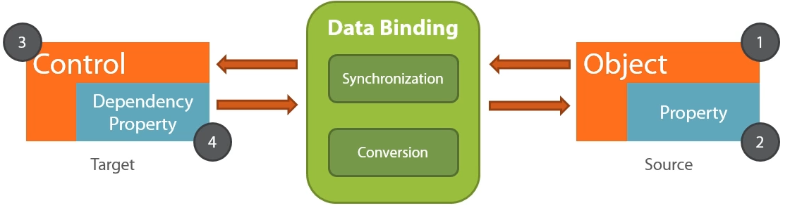

# Practical MVVM

[toc]

## Introduction

MVVM Pattern: model view, view-model pattern, commonly used in XAML-based applications, including WPF

refactor non-MVVM application to MVVM

- Data Binding
- MVVM Pattern
- Commands & Services
- Unit Testing

knowledge of XAML, WPF

course project: Joe's Coffee Store Administration

- WPF app
- stock management application
- view with list of coffees
- view with details of coffee

## Dataa Binding

MVVM pattern is based heavily on the data binding features of the XAML language

Data binding: link objects to UI elements, single object as well as collections

### Hello Data Binding

Data: data of objects; binding the data of objects to properties of controls in UI

in XAML, loosely coupled



```xaml
Coffee localCoeffee = new Coffee();

localCoffee.CoffeeName = "Joe Arabica";
localCoffee.Price = 15;
localCoffee.Intensity = "Strong"
localCoffee.Description = "One of the greatest coffees on earth";

MainGrid.DataConext = localCoffee;
```

Walking the XAML tree


## Learning and Refactoring to MVVM

## Commands and Using Services

## Units Testing View Models

